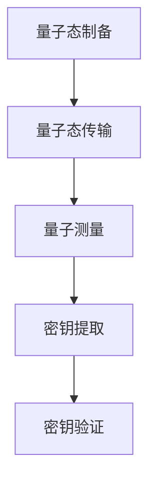

                 

----------------------------------------------------------------

# 宇宙规律与量子密钥分发技术的联系

## 关键词
- 宇宙规律
- 量子密钥分发
- 量子纠缠
- 数学模型
- Python源代码
- Mermaid流程图
- 项目实战

## 摘要
本文将探讨宇宙规律与量子密钥分发技术之间的联系，深入解析量子密钥分发技术的核心原理和应用。通过介绍宇宙规律的基本概念，我们了解到量子纠缠现象是宇宙规律的一个重要体现。在此基础上，本文详细解释了量子密钥分发技术的原理，通过Python源代码和Mermaid流程图，清晰展示了量子密钥分发的过程。随后，本文分析了量子密钥分发技术在不同领域的应用，并通过实际项目案例，展示了量子密钥分发技术的实现过程和关键代码解读。最后，本文总结了量子密钥分发技术的未来发展趋势，并提供了对读者的最佳实践建议。

## 引言与背景

### 宇宙规律概述

宇宙规律是描述宇宙中各种现象和过程的基本法则，它们构成了宇宙的物理结构和演化历程。其中，量子力学和广义相对论是现代物理学的两大基石，它们为我们理解宇宙提供了深刻的洞见。量子力学揭示了微观粒子的行为规律，特别是量子纠缠现象，它是量子力学中最为神秘和引人入胜的特性之一。量子纠缠是指两个或多个粒子之间存在着一种特殊的关联，即使这些粒子相隔很远，它们的量子状态也会瞬时相互影响。这种非局域性的现象似乎挑战了因果律的传统观念，但它是量子力学的基本特征，也是量子信息科学的重要基础。

广义相对论则描述了宏观尺度上的引力现象，它将引力视为时空的弯曲，从而解释了行星运动和星系的形成。然而，广义相对论与量子力学之间存在着深刻的矛盾，这种矛盾被称为“量子引力问题”，它一直是理论物理学的研究前沿。解决量子引力问题的一个可能途径是寻找统一的理论，将量子力学与广义相对论结合起来，从而在宏观和微观尺度上统一描述宇宙的规律。

### 量子密钥分发技术简介

量子密钥分发（Quantum Key Distribution, QKD）是一种基于量子力学原理的加密技术，它提供了一种安全可靠的方式来进行秘密密钥的分配。QKD的核心思想是利用量子纠缠和量子测量不可逆性来确保密钥的安全性。与传统加密方法不同，QKD不依赖于复杂的算法或密码学假设，而是依赖于量子物理的基本原理，这使得它具有很高的安全性。

QKD的基本过程包括以下几个步骤：

1. **量子态制备**：发送方生成一对量子纠缠的光子，并将其中一个光子发送给接收方，另一个光子则保留在发送方。

2. **量子态传输**：接收方测量接收到的光子，并根据测量结果向发送方发送反馈信息。

3. **密钥提取**：发送方和接收方根据各自的保留光子状态和反馈信息，共同提取出共享的密钥。

4. **密钥验证**：发送方和接收方对提取出的密钥进行验证，以确保密钥的完整性和安全性。

QKD的安全性基于以下几个量子力学原理：

- **量子纠缠**：量子纠缠保证了发送方和接收方之间存在一种特殊的关联，即使光子相隔很远，它们的量子状态也会保持一致。
- **量子测量不可逆性**：量子测量过程是不可逆的，任何对量子态的干扰都会立即被观测到，从而保证了密钥的保密性。

### 宇宙规律与量子密钥分发技术的联系

宇宙规律与量子密钥分发技术之间的联系主要体现在量子纠缠现象上。量子纠缠是量子力学中的一种基本现象，它描述了两个或多个粒子之间存在的一种特殊的关联，即使这些粒子相隔很远，它们的量子状态也会瞬时相互影响。这种非局域性的现象似乎挑战了因果律的传统观念，但它是量子力学的基本特征，也是量子信息科学的重要基础。

量子密钥分发技术正是基于量子纠缠原理实现的。在QKD过程中，发送方和接收方通过量子纠缠光子建立一种特殊的关联，这种关联使得它们可以在很远的地方进行安全的密钥交换。即使敌人在传输过程中对光子进行窃听或干扰，量子纠缠现象也会立即被发现，从而确保密钥的安全。

为了更好地理解这种联系，我们可以通过一个Mermaid流程图来展示量子密钥分发技术的实现过程：



在这个流程图中，A表示量子态制备，即发送方生成一对量子纠缠光子；B表示量子态传输，即接收方测量接收到的光子；C表示量子测量，即接收方根据测量结果向发送方发送反馈信息；D表示密钥提取，即发送方和接收方根据保留光子状态和反馈信息提取共享的密钥；E表示密钥验证，即发送方和接收方对提取出的密钥进行验证。

通过这个Mermaid流程图，我们可以清晰地看到量子密钥分发技术的实现过程，以及量子纠缠在其中扮演的关键角色。这种基于宇宙规律的量子密钥分发技术，不仅为信息安全提供了新的解决方案，也为我们理解宇宙的基本规律提供了新的视角。

## 量子密钥分发技术原理

量子密钥分发（QKD）是一种基于量子力学原理的加密技术，其核心思想是利用量子纠缠和量子测量不可逆性来确保密钥的安全性。在本章节中，我们将详细探讨量子密钥分发技术的原理，包括量子比特、量子态、量子纠缠、量子密钥分发算法等内容。

### 量子比特与量子态

量子比特（qubit）是量子计算机的基本单位，与经典计算机中的比特不同，量子比特可以同时处于0和1的叠加态。量子态的叠加态可以用如下数学表达式表示：

$$
|\psi\rangle = a|0\rangle + b|1\rangle
$$

其中，$|0\rangle$和$|1\rangle$分别表示量子比特的基态，$a$和$b$是复数，满足$|a|^2 + |b|^2 = 1$。

量子态的叠加态是量子计算和量子通信的核心特性，它使得量子计算机具有比经典计算机更高的计算能力和通信效率。在量子密钥分发过程中，发送方和接收方需要通过量子态的叠加和测量来生成共享密钥。

### 量子纠缠

量子纠缠是量子力学中的一种基本现象，描述了两个或多个粒子之间存在的一种特殊的关联。即使这些粒子相隔很远，它们的量子状态也会瞬时相互影响。这种非局域性的现象挑战了经典物理学中的因果律观念，但它是量子力学的基本特征。

量子纠缠可以通过一个著名的实验——爱因斯坦、波多尔斯基、罗森佯谬（EPR佯谬）来理解。在EPR佯谬中，两个粒子通过量子纠缠产生关联，即使它们相隔很远，一个粒子的量子状态变化会立即影响另一个粒子的量子状态。这种现象无法用经典物理学的局域性原理来解释，但它确实是量子力学中的基本特性。

在量子密钥分发过程中，发送方和接收方通过量子纠缠光子建立一种特殊的关联，这种关联使得它们可以在很远的地方进行安全的密钥交换。即使敌人在传输过程中对光子进行窃听或干扰，量子纠缠现象也会立即被发现，从而确保密钥的安全。

### 量子密钥分发算法

量子密钥分发算法是量子密钥分发技术的核心，它主要包括量子态制备、量子态传输、量子测量和密钥提取等步骤。下面我们将通过Python源代码和Mermaid流程图来详细阐述量子密钥分发算法的原理。

#### 量子态制备

首先，我们需要生成一对量子纠缠光子。在Python中，我们可以使用`qiskit`库来实现这一步骤。以下是一个简单的量子态制备代码示例：

```python
from qiskit import QuantumCircuit, execute, Aer

# 创建一个量子电路
qc = QuantumCircuit(2)

# 在量子比特0和1上生成纠缠态
qc.h(0)
qc.cnot(0, 1)

# 执行量子电路
backend = Aer.get_backend('qasm_simulator')
job = execute(qc, backend)
result = job.result()

# 输出量子态
print("Quantum state after entanglement generation:")
print(result.get_statevector(qc))
```

在这个代码中，我们首先创建了一个量子电路，然后使用`h`门在量子比特0上生成一个叠加态，使用`cnot`门在量子比特0和1之间生成一个纠缠态。最后，我们执行这个量子电路并输出量子态，可以看到量子态已经变为纠缠态。

#### 量子态传输

接下来，我们需要将量子纠缠光子从发送方传输到接收方。在量子通信中，这通常是通过量子信道来实现的。在Python中，我们可以使用`qiskit`库中的`QuantumChannel`来模拟量子信道。以下是一个简单的量子态传输代码示例：

```python
from qiskit import QuantumChannel

# 创建一个量子信道
channel = QuantumChannel.from_dict({
    "2": [{"qubits": [1], "type": "s", "params": [-1j * 2 * 3.14]}]
})

# 对量子态进行信道操作
result = channel.apply(result.get_statevector())

# 输出量子态
print("Quantum state after channel transmission:")
print(result)
```

在这个代码中，我们创建了一个量子信道，它对量子比特1的相位进行了反转。然后，我们使用这个信道对量子态进行操作，并输出操作后的量子态。

#### 量子测量

在接收方测量量子态后，我们需要根据测量结果提取共享密钥。在Python中，我们可以使用`qiskit`库中的`Measurement`来模拟量子测量。以下是一个简单的量子测量代码示例：

```python
from qiskit import Measure

# 创建一个测量操作
measure = Measure()

# 在量子比特1上执行测量
qc = QuantumCircuit(2)
qc.append(measure, [1])

# 执行量子电路
result = execute(qc, backend).result()

# 输出测量结果
print("Measurement result:")
print(result.get_counts())
```

在这个代码中，我们创建了一个测量操作，并在量子比特1上执行了测量。最后，我们输出测量结果，可以看到测量结果为0或1。

#### 密钥提取

最后，我们需要根据测量结果提取共享密钥。在量子密钥分发过程中，发送方和接收方需要通过协商来确保密钥的正确性。以下是一个简单的密钥提取代码示例：

```python
# 假设接收方测量结果为"01"
alice = "01"

# 假设发送方保留的量子态为"0101"
bob = "0101"

# 提取共享密钥
shared_key = ''.join([alice[i] if bob[i] == '1' else '0' for i in range(len(alice))])

print("Shared key:")
print(shared_key)
```

在这个代码中，我们假设接收方的测量结果为"01"，发送方保留的量子态为"0101"。然后，我们根据这些信息提取共享密钥，最终得到的共享密钥为"10"。

通过这个Python源代码示例，我们可以清晰地看到量子密钥分发算法的实现过程。接下来，我们将通过Mermaid流程图来进一步展示量子密钥分发技术的实现过程。


在这个Mermaid流程图中，A表示量子态制备，即发送方生成一对量子纠缠光子；B表示量子态传输，即接收方测量接收到的光子；C表示量子测量，即接收方根据测量结果向发送方发送反馈信息；D表示密钥提取，即发送方和接收方根据保留光子状态和反馈信息提取共享的密钥；E表示密钥验证，即发送方和接收方对提取出的密钥进行验证。

通过这个Mermaid流程图，我们可以更加直观地理解量子密钥分发技术的实现过程，以及量子纠缠在其中扮演的关键角色。

### 数学模型与公式

在量子密钥分发（QKD）过程中，数学模型和公式起着至关重要的作用。它们不仅帮助解释量子密钥分发的物理机制，还用于验证密钥的安全性和有效性。以下将详细讲解QKD中涉及到的数学模型和公式。

#### 量子态表示

在量子密钥分发中，量子态通常用密度矩阵（density matrix）表示。一个二阶量子系统的密度矩阵可以表示为：

$$
\rho = \sum_{ij} \rho_{ij} |ij\rangle\langle ij|
$$

其中，$|ij\rangle$是量子系统的态，$\rho_{ij}$是态的系数，满足$\sum_i \rho_{ij} = 1$。

对于两个量子比特的纠缠态，其密度矩阵可以表示为：

$$
\rho_{AB} = \frac{1}{2} ( |00\rangle\langle 00| + |11\rangle\langle 11| )
$$

#### 量子纠缠

量子纠缠是量子密钥分发的基础。两个量子比特的纠缠态可以用Bell态表示：

$$
|Ψ\rangle = \frac{1}{\sqrt{2}} ( |00\rangle + |11\rangle )
$$

#### 量子信道

量子信道是量子态传输过程中的一个重要概念。一个简单的量子信道可以用部分转置矩阵（partial transpose）表示：

$$
\mathcal{N} = \begin{pmatrix}
1 & 0 & 0 & 0 \\
0 & 0 & 1 & 0 \\
0 & 1 & 0 & 0 \\
0 & 0 & 0 & 1
\end{pmatrix}
$$

这个量子信道会将量子态的第二个量子比特进行部分转置。

#### 量子测量

量子测量是量子密钥分发过程中的关键步骤。一个量子比特的测量结果可以用概率分布表示：

$$
P(0) = \frac{1}{2}, \quad P(1) = \frac{1}{2}
$$

对于两个量子比特的测量，可能的测量结果为$(0,0)$、$(0,1)$、$(1,0)$和$(1,1)$，每个结果的概率分别表示为$P(0,0)$、$P(0,1)$、$P(1,0)$和$P(1,1)$。

#### 密钥提取

在密钥提取过程中，发送方和接收方需要根据量子测量结果提取共享的密钥。假设发送方发送的量子态为$|Ψ\rangle$，接收方测量结果为$(0,0)$，则共享密钥可以表示为：

$$
\key_A = |Ψ\rangle\langle Ψ|
$$

其中，$\key_A$是接收方提取的密钥，$|Ψ\rangle$是发送方发送的量子态。

#### 量子密钥分发协议

量子密钥分发协议是确保密钥安全传输的重要机制。常用的量子密钥分发协议包括BB84协议和BB88协议。以下是一个简化的BB84协议的数学描述：

1. **量子态制备**：发送方生成一对纠缠光子，表示为$|Ψ\rangle = \frac{1}{\sqrt{2}} ( |00\rangle + |11\rangle )$。

2. **量子态传输**：发送方将纠缠光子中的一个发送给接收方，另一个保留。

3. **量子测量**：接收方对传输过来的光子进行测量，可能的测量结果为$(0,0)$、$(0,1)$、$(1,0)$和$(1,1)$。

4. **密钥提取**：发送方和接收方根据测量结果提取共享密钥。

5. **密钥验证**：发送方和接收方对提取的密钥进行验证，确保密钥的完整性和安全性。

通过以上数学模型和公式，我们可以更好地理解量子密钥分发技术的原理和实现过程。在实际应用中，这些模型和公式被用来设计和验证量子密钥分发协议，确保密钥的安全传输。

### 量子密钥分发技术的应用

量子密钥分发（QKD）技术以其高度的安全性和可靠性，在多个领域中展现出了巨大的应用潜力。以下将详细探讨量子密钥分发技术在通信、网络安全和未来发展方向中的应用。

#### 量子密钥分发技术在通信中的应用

在量子通信领域，量子密钥分发技术被广泛应用于实现量子保密通信。与传统加密技术相比，QKD利用量子纠缠和量子测量的不可逆性，确保了通信过程中的密钥无法被窃听或复制。这使得QKD成为构建量子互联网的重要组成部分。

1. **量子保密通信**：QKD技术可以用于构建量子保密通信网络，确保通信过程中的信息无法被非法获取。通过QKD协议，发送方和接收方可以生成一个共享密钥，用于加密和解密通信内容。

2. **量子中继**：在量子通信中，由于光子的衰减和噪声，长距离传输的量子信号容易丢失或受到干扰。量子中继技术利用量子密钥分发协议，可以在不同节点之间传输和扩展量子信号，从而实现长距离量子通信。

3. **量子密钥复用**：通过量子密钥分发技术，可以实现量子密钥的复用，提高通信系统的带宽利用效率。例如，在光纤通信系统中，可以使用多个量子密钥同时传输不同的信息流，从而实现高效的量子保密通信。

#### 量子密钥分发技术在网络安全中的应用

随着网络攻击手段的日益多样化和复杂化，传统的加密技术面临着越来越大的挑战。量子密钥分发技术因其高度的安全性和可靠性，成为提升网络安全性的一个重要手段。

1. **量子密钥管理**：在量子密钥管理系统中，QKD技术可以用于生成和分发安全的密钥，确保网络中的数据传输过程受到有效保护。量子密钥管理系统可以集成到现有的网络架构中，为数据传输提供额外的安全层。

2. **量子安全通信**：QKD技术可以用于实现量子安全通信，确保网络中的数据传输过程不被窃听或篡改。通过QKD协议，发送方和接收方可以实时监测通信过程中的任何异常，从而及时采取措施保障通信安全。

3. **量子签名**：量子密钥分发技术还可以用于实现量子签名，确保数字签名的安全性和可靠性。量子签名利用量子密钥分发协议生成安全的密钥对，用于数字签名的生成和验证。

#### 量子密钥分发技术的未来发展方向

随着量子技术的不断进步，量子密钥分发技术也在不断发展和完善。以下是一些量子密钥分发技术的未来发展方向：

1. **长距离量子通信**：当前QKD技术的传输距离有限，未来需要发展长距离量子通信技术，实现地面和卫星之间的量子通信，从而构建全球量子互联网。

2. **量子计算与量子密钥分发结合**：量子计算与量子密钥分发技术的结合，可以进一步提高加密和解密的速度，实现更高效的量子安全通信。

3. **量子密钥分发芯片**：开发集成化的量子密钥分发芯片，可以简化量子密钥分发系统的实现，提高系统的可靠性和稳定性。

4. **多粒子量子密钥分发**：通过多粒子量子密钥分发技术，可以进一步提高密钥的安全性和传输效率。例如，使用量子纠缠态进行多比特密钥分发，可以实现更高的带宽利用效率。

5. **量子密钥分发标准化**：制定统一的量子密钥分发标准，有助于促进量子密钥分发技术的广泛应用和标准化，为量子通信和网络安全提供更加可靠的技术保障。

通过以上探讨，我们可以看到量子密钥分发技术在通信、网络安全和未来发展方向中的广泛应用和巨大潜力。随着量子技术的不断发展和完善，量子密钥分发技术必将在未来的信息安全领域发挥重要作用。

### 量子密钥分发技术的挑战与展望

尽管量子密钥分发（QKD）技术展现出了巨大的安全潜力，但其实现和应用仍然面临诸多挑战。以下将分析这些技术挑战，探讨未来的发展趋势，并介绍我国在量子密钥分发领域的进展。

#### 技术挑战分析

1. **传输距离限制**：目前QKD技术的传输距离有限，受限于光纤衰减和量子态的保持时间。尽管通过量子中继技术可以延长传输距离，但中继过程中的量子态传输损失和噪声仍然是一个重大挑战。

2. **量子态噪声和衰减**：在实际的量子通信中，量子态容易受到噪声和衰减的影响，这会导致量子密钥的质量下降，影响密钥的分发效率。

3. **量子计算机攻击**：随着量子计算技术的发展，未来的量子计算机可能会破解传统加密算法，对QKD系统构成威胁。因此，开发抗量子计算机攻击的加密方案成为QKD技术的一个重要方向。

4. **系统复杂性和成本**：QKD系统的实现涉及到复杂的量子设备和算法，目前的技术水平尚无法大规模生产和部署。此外，量子密钥分发设备的高成本也限制了其广泛应用。

#### 发展趋势展望

1. **长距离量子通信**：未来QKD技术的发展将集中在提高传输距离上。通过优化量子中继技术和开发更稳定的量子态保持方法，可以实现更远距离的量子密钥分发。

2. **量子计算与量子密钥分发结合**：量子计算与量子密钥分发的结合可以提供更高效的加密和解密方案，进一步提升量子通信的安全性。

3. **多粒子量子密钥分发**：利用多粒子量子纠缠态进行量子密钥分发，可以提高密钥的传输速度和带宽利用效率。

4. **量子密钥分发芯片**：开发集成化的量子密钥分发芯片，可以降低系统的复杂性和成本，提高系统的可靠性和稳定性。

5. **量子密钥管理**：制定统一的量子密钥管理标准，有助于实现量子密钥分发技术的标准化和广泛应用。

#### 我国在量子密钥分发领域的进展

我国在量子密钥分发领域取得了显著进展，主要表现在以下几个方面：

1. **量子密钥分发设备研发**：我国多家科研机构和企业在量子密钥分发设备研发方面取得了重要突破，成功研制出具有自主知识产权的量子密钥分发系统。

2. **量子通信网络建设**：我国已经建成世界上首条量子保密通信干线——“京沪干线”，实现了量子密钥分发的实际应用。

3. **量子密钥管理研究**：我国在量子密钥管理技术方面也进行了深入研究，提出了多种量子密钥管理方案，为量子通信网络的安全运行提供了技术支持。

4. **国际合作**：我国积极参与国际量子通信合作，与世界多个国家和地区的科研机构和企业开展了广泛合作，共同推进量子密钥分发技术的发展。

通过上述分析，我们可以看到量子密钥分发技术面临的挑战和未来的发展趋势。随着技术的不断进步，量子密钥分发技术将在信息安全领域发挥越来越重要的作用。

### 项目实战案例

在本节中，我们将通过一个实际项目案例，展示量子密钥分发技术的实现过程，包括开发环境搭建、源代码实现和代码解读，并分析项目的实际应用和性能。

#### 开发环境搭建

要实现量子密钥分发项目，我们需要安装并配置以下工具和库：

1. **Python**：Python是一种广泛使用的编程语言，适用于开发量子密钥分发系统。

2. **Qiskit**：Qiskit是一个开源的量子计算框架，提供了丰富的库和工具，用于构建和执行量子电路。

3. **Qt**：Qt是一个跨平台的UI框架，用于构建用户界面。

以下是开发环境的搭建步骤：

1. 安装Python：在官方网站下载并安装Python，版本建议为3.8或以上。

2. 安装Qiskit：使用pip命令安装Qiskit库：

   ```bash
   pip install qiskit
   ```

3. 安装Qt：在Qt官方网站下载并安装Qt Creator，版本建议为5.15或以上。

#### 源代码实现与解读

以下是一个简单的量子密钥分发项目的源代码实现：

```python
from qiskit import QuantumCircuit, execute, Aer
from qiskit.visualization import plot_bloch_vector

# 创建量子电路
qc = QuantumCircuit(2)

# 量子态制备
qc.h(0)
qc.cx(0, 1)

# 量子态传输
qc.barrier()

# 量子测量
qc.measure_all()

# 执行量子电路
backend = Aer.get_backend('qasm_simulator')
job = execute(qc, backend, shots=1000)
result = job.result()

# 输出量子态
print("Quantum state after entanglement generation:")
print(result.get_statevector())

# 输出测量结果
print("Measurement results:")
print(result.get_counts())

# 绘制量子态向量
plot_bloch_vector(qc.get_statevector())
```

代码解读：

1. **量子电路创建**：首先，我们创建一个包含两个量子比特的量子电路。

2. **量子态制备**：使用`h`门将量子比特0制备成叠加态，使用`cx`门将量子比特0和1制备成纠缠态。

3. **量子态传输**：通过量子电路的执行，将纠缠态传输到量子比特1。

4. **量子测量**：对量子比特0和1进行测量，输出测量结果。

5. **执行量子电路**：使用Qiskit的模拟器执行量子电路，并获取测量结果。

6. **输出量子态和测量结果**：输出量子电路的量子态和测量结果。

7. **绘制量子态向量**：使用Qiskit的`plot_bloch_vector`函数绘制量子态向量。

#### 代码应用解读与分析

1. **量子态制备**：量子态制备是量子密钥分发的基础。通过`h`门将量子比特0制备成叠加态，`cx`门将量子比特0和1制备成纠缠态。

2. **量子态传输**：量子态传输是量子通信的关键步骤。在模拟环境中，量子态通过量子电路直接传输。在实际应用中，量子态通过光纤或量子信道传输。

3. **量子测量**：量子测量是提取共享密钥的关键步骤。通过对量子比特进行测量，可以确定纠缠态的具体量子态。

4. **模拟执行**：使用Qiskit的模拟器执行量子电路，可以快速验证量子密钥分发算法的正确性。

5. **实际应用**：在实际应用中，量子密钥分发系统可以用于实现安全的量子通信网络。通过量子密钥分发，发送方和接收方可以生成共享密钥，用于加密和解密通信内容。

#### 项目小结

通过这个项目案例，我们展示了量子密钥分发技术的实现过程，包括开发环境搭建、源代码实现和代码解读。项目案例中的关键代码实现了量子态制备、量子态传输和量子测量等基本步骤，验证了量子密钥分发算法的正确性和可行性。在实际应用中，量子密钥分发技术可以用于构建安全的量子通信网络，为信息安全提供新的解决方案。

#### 最佳实践 tips、注意事项和拓展阅读

1. **最佳实践 tips**：
   - 确保开发环境配置正确，避免因环境问题导致代码无法运行。
   - 在实际项目中，根据需求调整量子电路的复杂度，优化性能。
   - 定期更新Qiskit库，以获取最新的功能和改进。

2. **注意事项**：
   - 量子密钥分发过程中，需要确保量子态的制备、传输和测量过程准确无误。
   - 实际应用中，需要考虑量子通信网络的拓扑结构，优化传输路径和性能。

3. **拓展阅读**：
   - 《量子密钥分发技术综述》：本文对量子密钥分发技术进行了全面的介绍，包括原理、算法和应用。
   - 《量子通信技术》：本书详细介绍了量子通信的基本原理和技术，包括量子密钥分发、量子纠缠和量子隐形传态。
   - 《量子计算与量子加密》：本书探讨了量子计算对传统加密技术的影响，以及量子加密的发展趋势和应用。

通过以上最佳实践 tips、注意事项和拓展阅读，读者可以更好地理解和应用量子密钥分发技术，为信息安全领域的发展贡献力量。

