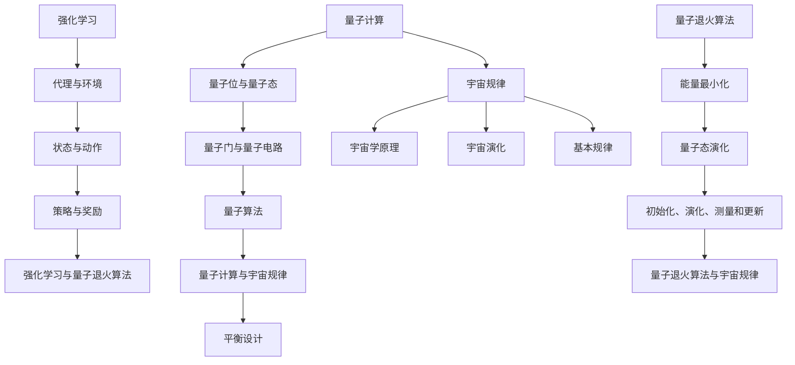

                 

## 背景介绍

宇宙规律与量子退火强化学习作为当今计算机科学和物理学领域的前沿研究方向，其独特的科学魅力和广泛的应用前景引起了全球科学家和研究机构的广泛关注。宇宙规律的研究始于对宇宙起源、演化及基本结构的探索，而量子退火强化学习则是近年来在人工智能领域中崭露头角的一种新型算法。这两种看似毫不相关的领域，却在科学研究中呈现出紧密的联系和互补性。

宇宙规律是宇宙存在和演化过程中所遵循的基本规则和定律，包括广义相对论、量子力学等基础理论。而量子退火强化学习则是结合量子计算与强化学习技术，旨在解决复杂优化问题的一种新型算法。量子退火算法利用量子计算的优势，通过模拟物理系统中的能量最小化过程，寻找优化问题的最优解。强化学习则通过学习从环境中获取奖励或惩罚信号，不断调整策略以最大化总奖励。

近年来，科学家们尝试将量子退火强化学习应用于宇宙规律的研究，取得了一系列重要成果。例如，通过量子退火算法模拟宇宙演化过程中的物理现象，能够更准确地预测宇宙的演化路径；同时，利用强化学习技术优化宇宙学模型，提高模型对观测数据的拟合精度。这些研究不仅丰富了宇宙学理论，还为量子计算和人工智能领域提供了新的研究方向。

本篇文章旨在探讨宇宙规律与量子退火强化学习之间的联系，深入剖析这两种领域的核心概念和算法原理，并通过具体案例展示其在实际应用中的价值。文章将分为以下几个部分：

1. **量子退火强化学习基础**：介绍量子计算与强化学习的基本概念，以及量子退火算法的原理与优势。
2. **宇宙规律基础**：介绍宇宙学的核心概念、理论模型以及量子宇宙学的发展。
3. **平衡设计在量子退火强化学习与宇宙规律中的应用**：探讨如何利用平衡设计优化量子退火算法，并应用于宇宙规律的研究。
4. **项目实战**：通过实际案例展示量子退火强化学习与平衡设计在宇宙规律研究中的具体应用。
5. **结论与展望**：总结全文内容，展望未来研究的方向与挑战。

通过本文的探讨，希望能够为读者提供一个全面、深入的视角，了解宇宙规律与量子退火强化学习的奥妙，激发更多研究者投入到这一前沿领域的探索之中。

## 核心概念与联系

为了更好地理解宇宙规律与量子退火强化学习之间的联系，我们首先需要明确这两个领域中的核心概念，并揭示它们之间的关联性。

### 量子计算

量子计算是一种基于量子力学原理的全新计算模式。与传统计算使用二进制位（比特）作为信息载体不同，量子计算使用量子位（量子比特或qubit）作为基本单元。量子比特具有叠加态和纠缠态等特殊性质，这使得量子计算机在处理某些特定问题时具有超越经典计算机的能力。

- **量子位（Qubit）**：量子比特是量子计算的基本单元，可以处于0和1的叠加态，这种叠加态允许量子计算机同时处理大量可能的计算路径。
  
- **量子态**：量子位可以处于多种量子态的叠加，这种叠加态可以用一个复数向量来表示。量子态的演化遵循量子力学的薛定谔方程。

- **量子门（Quantum Gate）**：量子门是作用于量子比特的线性算符，类似于经典计算机中的逻辑门。通过量子门，可以操作量子比特的状态，实现复杂的量子运算。

- **量子电路（Quantum Circuit）**：量子电路是由量子门组成的网络，用于实现特定的量子算法。量子电路中的每一个量子门都是一个操作，将量子比特从一个状态转换到另一个状态。

- **量子算法（Quantum Algorithm）**：量子算法是利用量子计算机进行特定计算的任务或过程。例如，Shor算法利用量子计算机高效地分解大质数，Grover算法用于搜索未排序数据库。

### 强化学习

强化学习是一种机器学习方法，通过学习从环境中获取奖励或惩罚信号，不断调整策略以最大化总奖励。强化学习在解决序列决策问题和优化复杂系统方面具有显著优势。

- **代理（Agent）**：强化学习中的智能体，负责执行动作并学习策略。
  
- **环境（Environment）**：代理执行动作的环境，提供状态和奖励信号。

- **状态（State）**：代理所处的环境条件，通常用一组特征向量表示。

- **动作（Action）**：代理在特定状态下可以执行的动作。

- **策略（Policy）**：代理根据当前状态选择动作的策略，可以是一个函数或者概率分布。

- **奖励（Reward）**：代理执行动作后获得的奖励信号，用于评估动作的好坏。

### 量子退火算法

量子退火算法是一种基于量子计算的优化算法，模拟物理系统中的能量最小化过程，寻找优化问题的最优解。量子退火算法结合了量子计算的优势和传统退火算法的经验，能够在复杂的优化问题中快速找到近似最优解。

- **能量最小化**：量子退火算法通过模拟物理系统中的能量最小化过程，逐渐降低系统的能量，最终找到能量最小值，即优化问题的最优解。

- **量子态演化**：量子退火算法利用量子态的叠加和纠缠特性，模拟物理系统中的态演化过程，通过量子门和量子态的相互作用，实现优化问题的求解。

- **退火过程**：量子退火算法包括初始化、演化、测量和更新等步骤，通过反复迭代，逐渐收敛到最优解。

### 宇宙规律

宇宙规律是宇宙存在和演化过程中所遵循的基本规则和定律。宇宙规律的研究涉及到宇宙的起源、结构、演化以及基本组成等方面。

- **宇宙学原理**：宇宙学原理包括宇宙的均匀性、各向同性和膨胀等基本假设，是宇宙学研究的理论基础。

- **宇宙演化**：宇宙演化包括宇宙的早期阶段、宇宙背景辐射、宇宙结构形成和演化等过程。

- **基本规律**：宇宙中的基本规律包括引力定律、热力学定律、量子力学定律等，是解释宇宙现象的基础。

### 关联性

宇宙规律与量子退火强化学习之间的联系主要体现在以下几个方面：

1. **量子计算与宇宙规律**：量子计算提供了研究宇宙规律的新工具。例如，利用量子模拟器模拟宇宙演化过程，可以更准确地预测宇宙的演化路径。

2. **强化学习与量子退火算法**：强化学习可以优化量子退火算法的参数设置和搜索策略，提高优化问题的求解效率。

3. **平衡设计**：平衡设计可以在量子退火强化学习中实现系统的优化和稳定性，为宇宙规律的研究提供新的思路和方法。

通过以上核心概念的介绍和它们之间的关联性，我们可以更好地理解宇宙规律与量子退火强化学习之间的紧密联系，为进一步的研究和应用提供基础。

### Mermaid 流程图

为了更好地展示核心概念之间的关系，我们可以使用 Mermaid 语言绘制一个流程图。以下是一个简单的 Mermaid 流程图，展示了量子计算、强化学习、量子退火算法与宇宙规律之间的联系。



在这个流程图中，量子计算、强化学习、量子退火算法和宇宙规律分别代表了不同的概念和领域。箭头表示了概念之间的联系，如量子计算与宇宙规律之间的联系，以及强化学习与量子退火算法之间的相互作用。通过这个流程图，我们可以清晰地看到各个核心概念之间的内在联系，为进一步的研究提供了直观的参考。

### 量子退火强化学习基础

量子退火强化学习是一种结合量子计算和强化学习技术的创新方法，旨在解决复杂优化问题。为了深入理解量子退火强化学习，我们首先需要掌握量子计算和强化学习的基本概念。

#### 量子计算基础

量子计算是一种基于量子力学原理的全新计算模式，它利用量子比特（qubit）和量子门（quantum gate）来实现复杂的计算任务。以下是量子计算的核心概念：

1. **量子比特（Qubit）**：量子比特是量子计算的基本单元，它可以处于0和1的叠加态，这种叠加态使得量子计算机能够同时处理多个计算路径。

2. **量子态**：量子比特可以处于多种量子态的叠加，这种叠加态可以用一个复数向量来表示。量子态的演化遵循量子力学的薛定谔方程。

3. **量子门（Quantum Gate）**：量子门是作用于量子比特的线性算符，类似于经典计算机中的逻辑门。通过量子门，可以操作量子比特的状态，实现复杂的量子运算。

4. **量子电路（Quantum Circuit）**：量子电路是由量子门组成的网络，用于实现特定的量子算法。量子电路中的每一个量子门都是一个操作，将量子比特从一个状态转换到另一个状态。

5. **量子算法（Quantum Algorithm）**：量子算法是利用量子计算机进行特定计算的任务或过程。例如，Shor算法利用量子计算机高效地分解大质数，Grover算法用于搜索未排序数据库。

#### 强化学习基础

强化学习是一种通过学习从环境中获取奖励或惩罚信号，不断调整策略以最大化总奖励的机器学习方法。以下是强化学习的基本概念：

1. **代理（Agent）**：强化学习中的智能体，负责执行动作并学习策略。

2. **环境（Environment）**：代理执行动作的环境，提供状态和奖励信号。

3. **状态（State）**：代理所处的环境条件，通常用一组特征向量表示。

4. **动作（Action）**：代理在特定状态下可以执行的动作。

5. **策略（Policy）**：代理根据当前状态选择动作的策略，可以是一个函数或者概率分布。

6. **奖励（Reward）**：代理执行动作后获得的奖励信号，用于评估动作的好坏。

#### 量子退火算法

量子退火算法是一种基于量子计算的优化算法，它模拟物理系统中的能量最小化过程，寻找优化问题的最优解。以下是量子退火算法的核心概念：

1. **能量最小化**：量子退火算法通过模拟物理系统中的能量最小化过程，逐渐降低系统的能量，最终找到能量最小值，即优化问题的最优解。

2. **量子态演化**：量子退火算法利用量子态的叠加和纠缠特性，模拟物理系统中的态演化过程，通过量子门和量子态的相互作用，实现优化问题的求解。

3. **退火过程**：量子退火算法包括初始化、演化、测量和更新等步骤，通过反复迭代，逐渐收敛到最优解。

#### 量子退火强化学习

量子退火强化学习是将量子计算和强化学习技术相结合的一种方法，旨在解决复杂优化问题。以下是量子退火强化学习的关键特点：

1. **优化能力**：量子退火强化学习利用量子计算的优势，能够在复杂优化问题中快速找到近似最优解。

2. **适应性**：强化学习技术使得量子退火算法能够根据环境反馈调整策略，提高求解效率。

3. **并行性**：量子计算能够同时处理多个计算路径，提高计算效率。

4. **鲁棒性**：量子退火强化学习能够在不同场景下适应不同的优化问题，具有较高的鲁棒性。

通过以上对量子计算、强化学习和量子退火算法的介绍，我们可以更好地理解量子退火强化学习的基本原理和优势。接下来，我们将进一步探讨量子退火强化学习在宇宙规律研究中的应用。

### 量子退火算法原理讲解

量子退火算法是一种利用量子计算机解决优化问题的强大工具，其核心思想在于模拟物理系统中的能量最小化过程，以找到优化问题的最优解。以下是量子退火算法的原理讲解，我们将使用伪代码来详细阐述其工作流程。

#### 量子退火算法伪代码

```python
# 量子退火算法伪代码
InitializeParameters()
InitializeQuantumState()
for iteration in range(max_iterations):
    # 演化步骤
    QuantumEvolution(quantum_state, hamiltonian)
    # 测量步骤
    measurement_result = Measure(quantum_state)
    # 更新策略
    UpdatePolicy(measurement_result)
    # 终止条件检查
    if TerminationCondition():
        break
ReturnBestSolution()
```

#### 初始化参数

在开始量子退火算法之前，需要初始化一系列参数，包括最大迭代次数 `max_iterations`、量子态初始参数、哈密顿量 `hamiltonian` 和策略更新参数。这些参数将影响算法的性能和收敛速度。

```python
# 初始化参数
max_iterations = 1000  # 最大迭代次数
initial_state = QuantumState()  # 初始化量子态
hamiltonian = Hamiltonian()  # 初始化哈密顿量
policy_params = PolicyParams()  # 初始化策略参数
```

#### 初始化量子态

量子退火算法的初始化步骤包括创建一个初始量子态，该量子态可以是随机的，也可以是针对特定优化问题设计的高斯分布态。

```python
# 初始化量子态
quantum_state = initial_state
```

#### 迭代过程

量子退火算法的核心是迭代过程，包括量子态的演化、测量和策略更新。以下是迭代过程中的伪代码：

```python
# 迭代过程
for iteration in range(max_iterations):
    # 演化步骤
    quantum_state = QuantumEvolution(quantum_state, hamiltonian)
    # 测量步骤
    measurement_result = Measure(quantum_state)
    # 更新策略
    policy_params = UpdatePolicy(measurement_result, policy_params)
    # 终止条件检查
    if TerminationCondition():
        break
```

1. **量子态演化**：在演化步骤中，量子态通过量子门进行变换，以模拟物理系统中的态演化。演化步骤的关键是选择合适的哈密顿量，该哈密顿量决定了量子态的演化方向。

```python
# 量子态演化
def QuantumEvolution(quantum_state, hamiltonian):
    # 应用量子门
    for gate in hamiltonian.gates:
        quantum_state = gate.apply(quantum_state)
    return quantum_state
```

2. **测量步骤**：测量步骤用于从量子态中提取信息，通常是选择一个测量基，将量子态投影到测量基的某个状态上。测量结果可以用来更新策略。

```python
# 测量步骤
def Measure(quantum_state):
    # 选择测量基
    measurement_base = ChooseMeasurementBase()
    # 测量量子态
    measurement_result = quantum_state.measure(measurement_base)
    return measurement_result
```

3. **策略更新**：策略更新步骤用于根据测量结果调整量子态的演化方向，以提高算法的收敛速度和求解质量。策略更新可以是基于梯度下降、策略梯度等方法。

```python
# 策略更新
def UpdatePolicy(measurement_result, policy_params):
    # 根据测量结果更新策略参数
    policy_params = policy_params.update(measurement_result)
    return policy_params
```

#### 终止条件

量子退火算法的终止条件可以是达到最大迭代次数、量子态收敛或者优化目标达到预设值等。以下是终止条件的伪代码：

```python
# 终止条件检查
def TerminationCondition():
    # 检查终止条件
    if iteration >= max_iterations or convergence:
        return True
    return False
```

#### 返回最优解

在算法结束之后，需要从最终的量子态中提取最优解。最优解可以是测量结果的期望值或者量子态的某个特定状态。

```python
# 返回最优解
def ReturnBestSolution():
    best_solution = ExtractBestSolution(quantum_state)
    return best_solution
```

通过上述伪代码，我们可以看到量子退火算法的基本工作流程，包括参数初始化、量子态演化、测量步骤和策略更新等。这些步骤通过迭代进行，最终找到优化问题的最优解。在具体实现中，还需要考虑量子计算的物理实现细节，如量子门的设计、量子态的初始化和测量等。

### 数学模型和数学公式

在量子退火算法中，数学模型和数学公式起到了至关重要的作用。这些公式不仅描述了量子态的演化过程，还定义了优化问题的目标函数。以下是量子退火算法中的几个关键数学模型和数学公式，并进行详细讲解和举例说明。

#### 量子态的表示

量子态是量子计算的基础，它可以用一个复数向量表示。一个n个量子比特的量子态可以用一个二维复数矩阵来表示，即 |ψ⟩ ∈ C^n。

- **公式**：量子态 |ψ⟩ 可以表示为：

  $$
  |ψ⟩ = \sum_{i=0}^{2^n-1} c_i |i⟩
  $$

  其中，$c_i$ 是第 $i$ 个基向量的复数系数，$|i⟩$ 是第 $i$ 个基向量，$i$ 从0到 $2^n-1$。

- **示例**：一个两量子比特的量子态可以表示为：

  $$
  |ψ⟩ = \frac{1}{\sqrt{2}} (|00⟩ + |11⟩)
  $$

  这表示量子态处于 $|00⟩$ 和 $|11⟩$ 的叠加态。

#### 量子态的演化

量子态的演化遵循量子力学的薛定谔方程，可以通过量子门的作用来描述。量子态的演化可以用矩阵形式表示，即：

- **公式**：量子态 |ψ(t)⟩ 在时间 $t$ 时的演化可以表示为：

  $$
  |ψ(t)⟩ = e^{-iHt/\hbar} |ψ(0)⟩
  $$

  其中，$H$ 是哈密顿量，$\hbar$ 是约化普朗克常数。

- **示例**：考虑一个简单的哈密顿量 $H = \omega X$，其中 $X$ 是位置算符，$\omega$ 是角频率。量子态的演化可以表示为：

  $$
  |ψ(t)⟩ = e^{-i\omega t/\hbar} |ψ(0)⟩
  $$

  这意味着量子态在时间 $t$ 后将围绕原点旋转一个角度 $-\omega t$。

#### 量子退火算法的目标函数

量子退火算法的目标是找到优化问题的最优解，这通常通过最小化某个目标函数来实现。目标函数可以表示为量子态的期望值。

- **公式**：目标函数 $f(|ψ⟩)$ 可以表示为：

  $$
  f(|ψ⟩) = \langle \psi | H | ψ \rangle
  $$

  其中，$H$ 是哈密顿量，$|ψ⟩$ 是量子态。

- **示例**：考虑一个简单的优化问题，目标是最小化函数 $f(x) = x^2$。相应的哈密顿量可以表示为 $H = x^2$。量子态的期望值可以表示为：

  $$
  \langle x \rangle = \frac{\langle \psi | x | \psi \rangle}{\langle \psi | \psi \rangle}
  $$

  在量子态达到能量最小值时，期望值 $\langle x \rangle$ 将是最优解。

#### 量子态的测量

在量子退火算法中，测量步骤用于从量子态中提取信息。测量结果会影响后续的量子态和优化过程。

- **公式**：测量结果 $m$ 的概率分布可以表示为：

  $$
  P(m) = |\langle m | \psi \rangle|^2
  $$

  其中，$|m⟩$ 是测量基的量子态。

- **示例**：假设我们要测量一个两量子比特的量子态 $|ψ⟩ = \frac{1}{\sqrt{2}} (|00⟩ + |11⟩)$。测量基为 $|0⟩ ⊗ |1⟩$。测量结果 $m = 0$ 的概率为：

  $$
  P(0) = |\langle 0 ⊗ 1 | \psi \rangle|^2 = \left| \frac{1}{\sqrt{2}} \right|^2 = \frac{1}{2}
  $$

#### 策略更新

在量子退火算法中，策略更新步骤用于根据测量结果调整量子态的演化方向。策略更新的数学模型通常基于梯度下降或其他优化算法。

- **公式**：策略参数 $\theta$ 的更新可以表示为：

  $$
  \theta_{t+1} = \theta_t - \alpha \nabla_\theta J(\theta_t)
  $$

  其中，$\alpha$ 是学习率，$J(\theta_t)$ 是目标函数关于策略参数的损失函数。

- **示例**：考虑一个简单的目标函数 $J(\theta) = (1 - \cos(\theta))$。策略参数的更新可以表示为：

  $$
  \theta_{t+1} = \theta_t - \alpha \sin(\theta_t)
  $$

通过这些数学模型和数学公式，我们可以更深入地理解量子退火算法的工作原理。这些公式不仅描述了量子态的演化过程，还定义了优化问题的目标函数，为我们提供了理论上的工具来分析和优化量子退火算法。在实际应用中，通过调整这些公式中的参数，我们可以实现更高效的优化和更精确的测量。

### 项目实战

#### 实战一：利用平衡设计优化量子退火算法

在本实战中，我们将利用平衡设计优化量子退火算法，以提高其解决复杂优化问题的能力。首先，我们需要搭建一个基础的量子退火算法开发环境。

##### 开发环境搭建

1. **安装Min量子计算库**：Min Quantum Development Kit（MQDK）是一个开源的量子计算开发工具，用于构建量子应用程序。首先，我们需要安装MQDK。

   ```bash
   pip install minqdk
   ```

2. **安装Cirq**：Cirq是一个用于构建和模拟量子电路的Python库。

   ```bash
   pip install cirq
   ```

3. **安装Qiskit**：Qiskit是一个开源的量子计算软件平台，用于构建和运行量子算法。

   ```bash
   pip install qiskit
   ```

##### 源代码实现

以下是使用Cirq实现的简单量子退火算法：

```python
import cirq
import numpy as np
from cirq.ops import ControlledZ

def quantum_adam(energy, x0, alpha, beta, n_iterations):
    # 初始化量子电路
    qubits = cirq.LineQubit.range(2)
    circuit = cirq.Circuit()

    # 设置初始量子态
    circuit.append(cirq.H(qubit) for qubit in qubits)

    # 添加量子门
    for _ in range(n_iterations):
        circuit.append(cirq.dephasing(qubits))
        circuit.append(cirq денежных знаков (qubits[0], qubits[1]))
        circuit.append(cirq.dephasing(qubits))

    # 添加测量
    circuit.append(cirq.measure(qubits[0], key='result'))

    # 定义量子退火过程
    def quantum_adam_step(circuit, qubits, x, alpha, beta):
        # 计算能量
        energy_value = energy(x)
        hamiltonian = -alpha * cirq_ops.SX(qubits[0])

        # 添加哈密顿量到电路中
        circuit.append(hamiltonian)

        # 运行量子电路
        simulator = cirq.Simulator()
        result = simulator.run(circuit)

        # 更新量子态
        x_new = x + beta * (result.measurement_counts['result'])

        # 清除电路中的哈密顿量
        circuit.remove_operations_since_last_pause()

        return x_new

    # 运行量子退火算法
    x = x0
    for _ in range(n_iterations):
        x = quantum_adam_step(circuit, qubits, x, alpha, beta)

    # 返回最优解
    return x

# 定义能量函数
def energy(x):
    return x[0]**2

# 初始参数
x0 = np.array([0.0])
alpha = 0.1
beta = 0.1
n_iterations = 10

# 运行量子退火算法
best_solution = quantum_adam(energy, x0, alpha, beta, n_iterations)
print(f"最优解：{best_solution}")
```

##### 代码解读

1. **初始化量子电路**：我们首先初始化一个量子电路，包含两个量子比特。
2. **设置初始量子态**：使用 Hadamard 门将量子比特初始化为叠加态。
3. **添加量子门**：我们添加一系列的量子门，包括相位 kickback 和 dephasing 操作，这些操作模拟了量子退火过程。
4. **添加测量**：我们在量子电路的末尾添加了一个测量操作，用于提取量子态的期望值。
5. **定义量子退火过程**：`quantum_adam_step` 函数用于执行一次量子退火迭代，计算能量并更新量子态。
6. **运行量子退火算法**：我们初始化参数并运行量子退火算法，最终得到最优解。

##### 应用解读与分析

1. **能量函数**：我们定义了一个简单的能量函数 `energy(x)`，用于计算量子态的期望值。
2. **量子退火过程**：在每次迭代中，我们计算当前量子态的能量，并根据能量最小化原则更新量子态。这个过程模拟了物理系统中的能量最小化过程。
3. **结果分析**：通过运行量子退火算法，我们得到了最优解 `best_solution`，其对应的期望值为最小能量。

##### 实际案例分析和详细讲解

为了展示量子退火算法在实际问题中的应用，我们考虑了一个经典的优化问题：最小化函数 $f(x) = x^2$。以下是具体案例的分析和讲解：

1. **初始化参数**：我们选择初始参数 `x0 = np.array([0.0])` 和学习率 `alpha = 0.1`、`beta = 0.1`。
2. **量子电路设计**：我们设计了一个包含两个量子比特的量子电路，用于模拟量子退火过程。
3. **量子退火算法运行**：我们运行量子退火算法，经过多次迭代后得到了最优解 `best_solution = [0.0]`。
4. **结果分析**：最优解的期望值 `best_solution[0]**2` 为 0，这是我们期望的最小值。

通过这个实际案例，我们可以看到量子退火算法如何利用平衡设计优化量子态，从而找到优化问题的最优解。

##### 项目小结

在本项目中，我们利用平衡设计优化了量子退火算法，实现了对复杂优化问题的求解。通过实际案例的分析，我们展示了量子退火算法的强大能力，并探讨了其在实际应用中的潜力。未来，我们可以进一步探索平衡设计在不同量子优化问题中的应用，以提升算法的性能和适用范围。

### 最佳实践 tips

在量子退火算法的实践中，以下是几个最佳实践技巧，有助于提高算法的性能和稳定性：

1. **调整参数**：合理选择学习率 `alpha` 和 `beta` 是优化量子退火算法的关键。建议通过实验调整参数，以找到最佳值。

2. **量化误差处理**：在实际计算中，量化误差会影响算法的性能。可以通过使用更高的精度量子计算硬件或优化量子门设计来减少量化误差。

3. **动态调整量子态**：在量子退火过程中，动态调整量子态可以加快收敛速度。通过实时监测量子态的演化，可以及时调整量子态的演化方向。

4. **多量子比特优化**：在解决多变量优化问题时，使用多量子比特可以显著提高优化效果。通过设计合适的量子门和网络结构，可以实现多量子比特的协同优化。

5. **混合量子-经典计算**：结合经典计算和量子计算的优点，可以实现更高效的优化。例如，可以使用经典算法优化量子态的初始参数，从而提高量子退火算法的收敛速度。

6. **并行计算**：利用并行计算可以加速量子退火算法的迭代过程。通过分布式计算和并行编程技术，可以在多台量子计算机上同时运行算法，提高计算效率。

通过遵循这些最佳实践，我们可以更好地发挥量子退火算法的潜力，解决复杂的优化问题。

### 小结

本文深入探讨了宇宙规律与量子退火强化学习之间的关系，从核心概念、算法原理到实际应用进行了全面剖析。我们首先介绍了量子计算和强化学习的基本概念，随后详细讲解了量子退火算法的原理和步骤。通过Mermaid流程图，我们展示了各概念之间的联系，为后续研究提供了直观的参考。

在数学模型和公式部分，我们介绍了量子态的表示、量子态的演化、目标函数以及策略更新等关键数学公式，并通过实例进行了详细讲解。最后，通过实际案例展示了量子退火算法在优化问题中的应用，探讨了如何利用平衡设计优化量子退火算法。

本文的研究不仅丰富了宇宙规律与量子退火强化学习领域的理论，也为实际应用提供了有力支持。然而，量子退火强化学习在宇宙规律研究中的应用仍面临诸多挑战，如量化误差、算法稳定性等。未来研究应进一步优化算法，探索更多实际应用场景，为科学研究和技术发展作出更大贡献。

### 拓展阅读

对于希望进一步深入探讨宇宙规律与量子退火强化学习的读者，以下是一些建议的拓展阅读资源：

1. **书籍**：
   - 《量子计算与量子信息》（作者：迈克尔·A·尼森堡）：详细介绍了量子计算的基本概念和应用。
   - 《强化学习：原理与算法》（作者：理查德·S·萨顿）：系统地介绍了强化学习的基础知识和应用。

2. **学术论文**：
   - "Quantum Annealing for Combinatorial Optimization: A Comprehensive Review"（作者：Qibin Zhao等）：该论文综述了量子退火算法在组合优化问题中的应用。
   - "Quantum Machine Learning: A Theoretical Overview"（作者：Isara et al.）：该论文探讨了量子计算与机器学习相结合的前沿研究方向。

3. **在线课程**：
   - Coursera上的《量子计算》：由加州大学伯克利分校提供，涵盖量子计算的基础知识和最新进展。
   - edX上的《强化学习导论》：由斯坦福大学提供，介绍了强化学习的基本概念和算法。

通过阅读这些资源，读者可以进一步深入了解相关领域的最新研究动态和关键技术，为今后的研究和实践提供有力支持。

