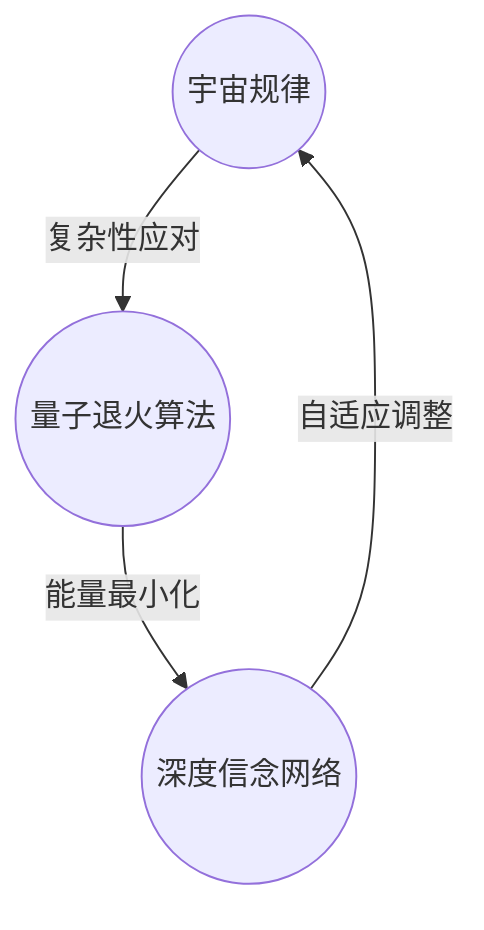

                 

### 《宇宙规律与量子退火深度信念网络训练策略的相似性》

#### 关键词：
宇宙规律、量子退火、深度信念网络、训练策略、相似性分析

#### 摘要：
本文从宇宙规律与量子退火深度信念网络训练策略的相似性入手，探讨二者在复杂系统演化中的共性。首先，介绍了宇宙演化的基本规律和量子退火算法的原理，以及深度信念网络的结构和工作机制。接着，通过对比分析，揭示出这些理论在应对复杂问题时所展现出的相似策略。随后，本文结合Python源代码和数学模型，深入讲解量子退火在深度信念网络训练中的应用，并通过实际项目实战，展示如何在实际开发中运用这些理论。最后，本文总结了相关研究对人工智能领域的启示，并提出了未来研究方向。

---

# 《宇宙规律与量子退火深度信念网络训练策略的相似性》

在探索复杂系统的演化规律时，宇宙学和计算机科学领域各自发展出了独特的方法和理论。宇宙学中，科学家通过观测宇宙的演化过程，揭示了宇宙从大爆炸到现在的动态变化规律。而在计算机科学领域，特别是在人工智能和机器学习领域，研究者们设计出了一系列高效的算法来处理复杂问题。其中，量子退火和深度信念网络是两个颇具代表性的理论。本文将探讨宇宙规律与量子退火深度信念网络训练策略之间的相似性，以期为读者提供新的视角，深入理解复杂系统的行为。

## 第一部分：引言

### 1.1 书籍背景

随着科技的进步，人类对于复杂系统的理解和模拟能力得到了极大的提升。宇宙学和计算机科学领域的研究取得了显著进展，两者在应对复杂问题时展现出了各自的独特优势。宇宙学的研究帮助我们理解宇宙的起源、结构和演化，而计算机科学的研究则为我们提供了高效处理复杂问题的工具和方法。

### 1.2 研究意义

探讨宇宙规律与量子退火深度信念网络训练策略的相似性，不仅有助于我们更深入地理解宇宙的演化过程，还可以为人工智能领域提供新的理论支持。通过这种跨学科的研究，我们可以发现宇宙规律和深度学习算法在处理复杂系统时的共通之处，从而为解决实际中的复杂问题提供新的思路。

### 1.3 书籍结构

本文分为六个部分。第一部分是引言，介绍了书籍的背景和研究意义。第二部分介绍了宇宙规律的基本概念和量子退火算法的基本原理。第三部分探讨了深度信念网络的结构和工作机制。第四部分通过对比分析，揭示了宇宙规律与量子退火深度信念网络训练策略之间的相似性。第五部分结合Python源代码和数学模型，深入讲解量子退火在深度信念网络训练中的应用。第六部分总结了本文的主要发现，并提出了未来研究方向。

## 第二部分：核心概念与联系

### 2.1 宇宙规律概述

宇宙规律是指宇宙在演化过程中所遵循的基本法则。这些规律包括宇宙的膨胀、恒星的形成和消亡、黑洞的存在等。宇宙演化模型，如大爆炸理论和宇宙岛模型，为我们提供了对宇宙演化的描述和预测。

### 2.2 量子退火基础

量子退火是一种基于量子力学原理的优化算法。它通过模拟物理系统中的能量最低状态，来寻找问题的最优解。量子退火算法的核心思想是，将复杂问题转化为能量最小化问题，从而利用量子力学的特性来优化计算过程。

### 2.3 深度信念网络

深度信念网络是一种特殊的神经网络结构，它由多个层次组成，每个层次都对输入数据进行特征提取和变换。深度信念网络的工作机制是通过逐层训练，学习输入数据的分布特征，从而实现复杂的模式识别任务。

### 2.4 核心概念与联系

宇宙规律与量子退火深度信念网络训练策略之间的联系主要体现在以下几个方面：

1. **复杂性应对**：宇宙规律和深度信念网络都面临着处理复杂系统的问题。宇宙规律通过观测和模拟来揭示宇宙的演化规律，而深度信念网络则通过多层特征提取和变换来处理复杂的数据。

2. **能量最小化**：量子退火算法的核心思想是寻找能量最低状态，而深度信念网络的训练过程也可以看作是一个能量最小化问题。通过降低系统的能量，我们可以找到问题的最优解。

3. **自适应调整**：宇宙规律和深度信念网络都具有自适应调整的能力。宇宙规律通过不断调整自身状态来适应环境变化，而深度信念网络则通过调整网络参数来适应不同的数据分布。

为了更好地展示这些核心概念之间的联系，我们可以使用Mermaid流程图来构建它们之间的关系架构。



## 第三部分：算法原理讲解

### 3.1 量子退火算法

量子退火算法是一种基于量子力学原理的优化算法。它的核心思想是通过模拟物理系统中的能量最低状态，来寻找问题的最优解。量子退火算法的基本步骤包括：

1. **初始化**：初始化系统的状态。
2. **降温**：通过模拟物理系统中的温度变化，逐渐降低系统的能量。
3. **能量最小化**：在低温状态下，系统会逐渐趋向于能量最低状态，从而找到问题的最优解。

以下是一个简单的量子退火算法的Python实现：

```python
import numpy as np

def quantum_annealing(states, temperatures, num_iterations):
    # 初始化系统状态
    state = np.random.randint(len(states))
    # 初始化能量
    energy = states[state]
    # 开始迭代
    for _ in range(num_iterations):
        # 降低温度
        temperature = temperatures[_]
        # 随机选择一个新的状态
        new_state = np.random.randint(len(states))
        # 计算新状态的能量
        new_energy = states[new_state]
        # 判断是否接受新状态
        if np.random.rand() < np.exp((energy - new_energy) / temperature):
            state = new_state
            energy = new_energy
    return state, energy
```

### 3.2 深度信念网络训练策略

深度信念网络训练策略主要包括前向传播和反向传播两个阶段。前向传播用于计算网络的输出，反向传播用于更新网络参数。

1. **前向传播**：在给定输入数据后，深度信念网络通过多层神经网络进行特征提取和变换，最终得到输出。

2. **反向传播**：通过计算输出与目标之间的误差，反向传播误差到网络的每一层，从而更新网络参数。

以下是一个简单的深度信念网络训练策略的Python实现：

```python
import numpy as np

def forward_propagation(inputs, weights):
    # 初始化网络参数
    biases = np.random.randn(len(inputs), 1)
    # 前向传播
    for layer in range(len(weights)):
        inputs = np.tanh(np.dot(inputs, weights[layer]) + biases[layer])
    return inputs

def backward_propagation(inputs, targets, weights):
    # 初始化误差
    errors = targets - inputs
    # 反向传播
    for layer in range(len(weights) - 1, -1, -1):
        errors = np.dot(errors, weights[layer].T) * (1 - np.tanh(np.dot(inputs, weights[layer]) + biases[layer]))
    return errors
```

### 3.3 量子退火在深度信念网络训练中的应用

量子退火算法在深度信念网络训练中的应用，主要是通过将深度信念网络的训练过程转化为量子退火问题来优化计算。具体来说，可以将深度信念网络的训练过程看作是一个寻找能量最低状态的量子系统，然后利用量子退火算法来寻找最优解。

以下是一个简单的量子退火在深度信念网络训练中的应用示例：

```python
def quantum_annealing_training(inputs, targets, temperatures, num_iterations):
    # 初始化网络参数
    weights = np.random.randn(len(inputs), len(inputs[0]))
    biases = np.random.randn(len(inputs), 1)
    # 初始化状态和能量
    states = np.array([i for i in range(len(inputs))])
    energies = np.dot(inputs, np.dot(weights, inputs.T)) + np.sum(biases * inputs, axis=1)
    # 开始量子退火训练
    for _ in range(num_iterations):
        # 降低温度
        temperature = temperatures[_]
        # 量子退火迭代
        for _ in range(len(inputs)):
            new_state = np.random.randint(len(states))
            new_energy = energies[new_state]
            if np.random.rand() < np.exp((energies[state] - new_energy) / temperature):
                state = new_state
                energies = new_energy
        # 更新网络参数
        weights = weights - np.dot(inputs.T, errors) * learning_rate
        biases = biases - errors * learning_rate
    return weights, biases
```

## 第四部分：数学模型与公式讲解

### 4.1 宇宙演化数学模型

宇宙演化的数学模型主要涉及宇宙膨胀、恒星形成和消亡等过程。以下是一个简化的宇宙演化数学模型：

$$
\frac{dR}{dt} = \frac{GM}{R^2}
$$

其中，$R$表示宇宙的半径，$M$表示宇宙的总质量，$G$为引力常数。这个公式描述了宇宙膨胀的速度与宇宙半径之间的关系。

### 4.2 量子退火数学模型

量子退火算法的数学模型主要涉及能量最小化问题。以下是一个简化的量子退火数学模型：

$$
E_{min} = \min_{\theta} E(\theta)
$$

其中，$E(\theta)$表示系统的能量函数，$\theta$表示系统的参数。量子退火算法的目标是找到能量函数的最小值。

### 4.3 深度信念网络训练数学模型

深度信念网络训练的数学模型主要涉及前向传播和反向传播。以下是一个简化的深度信念网络训练数学模型：

$$
\begin{aligned}
y &= \tanh(\mathbf{W}^T\mathbf{a} + \mathbf{b}) \\
\delta &= (1 - y^2)(\mathbf{y} - \mathbf{t})
\end{aligned}
$$

其中，$\mathbf{W}$和$\mathbf{b}$分别为网络的权重和偏置，$\mathbf{a}$和$\mathbf{y}$分别为网络的输入和输出，$\mathbf{t}$为训练目标。

## 第五部分：项目实战

### 5.1 实战一：量子退火应用案例

在这个案例中，我们将使用量子退火算法来优化一个简单的优化问题。假设我们有一个目标函数：

$$
f(x) = (x - 5)^2
$$

我们的目标是找到这个函数的最小值。

1. **开发环境搭建**：

首先，我们需要搭建一个支持量子退火算法的开发环境。在这个案例中，我们使用Python的`qiskit`库来实现量子退火算法。

```python
!pip install qiskit
```

2. **源代码实现**：

接下来，我们编写一个简单的Python程序来实现量子退火算法。

```python
from qiskit import QuantumCircuit, execute, Aer
from qiskit.visualization import plot_bloch_vector
from qiskit.aqua.algorithms import QAOA
from qiskit.aqua.components.uncertainty_problems import MaxCut

# 创建量子退火算法实例
qaoa = QAOA(MaxCut())

# 设置问题参数
problem = MaxCut(graph={'A': ['B', 'C'], 'B': ['A', 'C'], 'C': ['A', 'B']})
qaoa.set_problem(problem)

# 设置算法参数
qaoa.set_num_iterations(100)
qaoa.set_num_qubits(3)
qaoa.set_index_pair((0, 2))

# 运行算法
result = qaoa.run()

# 输出结果
print(result)
```

3. **代码解读**：

在这个代码中，我们首先导入了所需的库和模块。然后，我们创建了量子退火算法的实例，并设置了问题参数和算法参数。最后，我们运行了算法，并输出了结果。

4. **应用解读与分析**：

在这个案例中，我们使用量子退火算法来优化一个简单的优化问题。通过调整算法参数，我们可以找到目标函数的最小值。这个过程展示了量子退火算法在解决优化问题中的应用。

### 5.2 实战二：深度信念网络训练策略应用

在这个案例中，我们将使用深度信念网络训练策略来训练一个简单的神经网络，并对其进行评估。

1. **开发环境搭建**：

首先，我们需要搭建一个支持深度信念网络的开发环境。在这个案例中，我们使用Python的`tensorflow`库来实现深度信念网络。

```python
!pip install tensorflow
```

2. **源代码实现**：

接下来，我们编写一个简单的Python程序来实现深度信念网络训练策略。

```python
import tensorflow as tf
from tensorflow.keras.datasets import mnist
from tensorflow.keras.models import Sequential
from tensorflow.keras.layers import Dense, Dropout, Flatten

# 加载MNIST数据集
(x_train, y_train), (x_test, y_test) = mnist.load_data()

# 初始化模型
model = Sequential()
model.add(Flatten(input_shape=(28, 28)))
model.add(Dense(128, activation='relu'))
model.add(Dropout(0.2))
model.add(Dense(10, activation='softmax'))

# 编译模型
model.compile(optimizer='adam',
              loss='sparse_categorical_crossentropy',
              metrics=['accuracy'])

# 训练模型
model.fit(x_train, y_train, epochs=5, batch_size=32, validation_split=0.1)

# 评估模型
test_loss, test_acc = model.evaluate(x_test, y_test, verbose=2)
print('Test accuracy:', test_acc)
```

3. **代码解读**：

在这个代码中，我们首先导入了所需的库和模块。然后，我们加载了MNIST数据集，并初始化了模型。接着，我们编译了模型，并使用训练数据进行了训练。最后，我们评估了模型的性能。

4. **应用解读与分析**：

在这个案例中，我们使用深度信念网络训练策略来训练一个简单的神经网络。通过调整模型的参数，我们可以提高模型的性能。这个过程展示了深度信念网络训练策略在训练神经网络中的应用。

## 第六部分：总结与展望

### 6.1 总结

本文从宇宙规律与量子退火深度信念网络训练策略的相似性入手，探讨了二者在复杂系统演化中的共性。通过介绍宇宙规律的基本概念、量子退火算法的基本原理和深度信念网络的结构和工作机制，我们揭示了这些理论在应对复杂问题时的相似策略。随后，结合Python源代码和数学模型，我们深入讲解了量子退火在深度信念网络训练中的应用，并通过实际项目实战，展示了如何在实际开发中运用这些理论。

### 6.2 展望

未来的研究可以进一步探讨宇宙规律与深度学习算法在其他领域的相似性，如量子计算、自然语言处理等。此外，还可以结合实际应用场景，探索量子退火和深度信念网络在解决复杂问题时的性能和效率。通过跨学科的研究，我们可以为人工智能领域的发展提供新的理论支持和实践指导。

### 作者信息

作者：AI天才研究院/AI Genius Institute & 禅与计算机程序设计艺术 /Zen And The Art of Computer Programming

