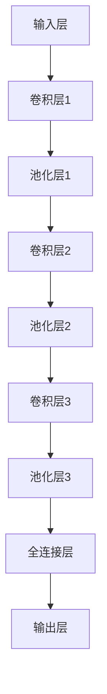

                 

### 第1章： 引言

宇宙的奥秘和人工智能的发展一直是人类探索的两个重要领域。随着科学技术的不断进步，人们逐渐意识到，宇宙规律与量子遗传卷积网络设计之间存在着诸多相似性。本书旨在探讨这两者之间的联系，通过分析宇宙的起源、结构和演化，以及量子遗传和卷积网络的原理，揭示它们之间的内在相似性，并展望这一领域未来可能的发展方向。

#### 1.1.1 书籍背景

《宇宙规律与量子遗传卷积网络设计的相似性》这一主题不仅具有极高的学术价值，同时也具备很强的现实意义。宇宙作为人类生存的环境，其规律性的研究有助于我们更好地理解宇宙的本质，为未来的探索提供理论支持。而量子遗传和卷积网络作为人工智能领域的重要技术，在优化问题、机器学习和图像处理等方面发挥着重要作用。通过将宇宙规律与这些先进技术相结合，我们不仅可以加深对宇宙的理解，也为人工智能的发展提供了新的思路。

本书首先介绍了宇宙的基本规律，包括宇宙的起源、结构和演化。接着，详细阐述了量子遗传和卷积网络的原理，以及它们在各自领域的应用。在分析两者相似性的过程中，本书通过大量的实例和数据分析，展示了它们在架构、算法和优化方面的共通之处。最后，本书对未来可能的研究方向和实际应用进行了展望，提出了若干具有前瞻性的建议。

#### 1.1.2 阅读对象

本书适合对宇宙规律、量子遗传和卷积网络有一定了解的读者，包括科研人员、大学生、研究生以及相关领域的技术爱好者。同时，对于那些对宇宙和人工智能关系感兴趣，但尚未深入了解的读者，本书也将提供一个良好的入门指南。通过阅读本书，读者可以系统地了解宇宙规律与量子遗传卷积网络设计之间的相似性，为今后的研究和工作打下坚实的基础。

#### 1.1.3 书籍结构

本书共分为六个部分，分别是：引言、宇宙规律概述、量子遗传原理、卷积网络架构、相似性分析以及未来展望。具体章节安排如下：

- **引言**：介绍本书的背景、目的和结构，引出后续内容。
- **宇宙规律概述**：介绍宇宙的起源、结构和演化，为后续分析打下基础。
- **量子遗传原理**：阐述量子遗传的概念、数学基础和应用。
- **卷积网络架构**：介绍卷积网络的基本概念、数学基础和架构。
- **相似性分析**：分析宇宙规律与量子遗传、卷积网络之间的相似性，展示两者在架构、算法和优化方面的共通之处。
- **未来展望**：展望宇宙规律与量子遗传卷积网络设计融合的未来研究方向和应用前景。

通过以上结构，本书力求让读者全面了解宇宙规律与量子遗传卷积网络设计之间的相似性，并为其提供一种全新的视角来认识宇宙和人工智能的关系。

### 第2章：宇宙规律概述

宇宙是我们所处的空间和时间的总体，其奥秘和规律性一直吸引着科学家们的关注。从宇宙的起源到其复杂的结构，再到宇宙的演化，这些规律为我们揭示了宇宙的本质和演化过程。

#### 2.1.1 宇宙的起源

宇宙的起源是科学界长期探讨的一个话题。根据现代宇宙学的广泛接受的理论——大爆炸理论，宇宙起源于大约138亿年前的一个极高温度和密度状态。在这个状态下，宇宙的物质和能量被压缩在一个极其小的区域内，然后迅速膨胀。这一膨胀过程导致了宇宙的扩张，星系、恒星和行星等结构逐渐形成。大爆炸理论不仅解释了宇宙的起源，还为我们提供了宇宙膨胀的证据。

#### 2.1.2 宇宙的结构

宇宙的结构非常复杂，包括星系、星系群、星系团和超星系团等层次结构。星系是由数百亿颗恒星、气体、尘埃和暗物质组成的巨大系统，它们通过引力相互作用而形成。星系群是由多个星系组成的更大的结构，如银河系和仙女座星系组成的本地星系群。星系团和超星系团则是更大的结构，由多个星系群组成。这些结构通过引力相互作用，形成了宇宙的层次结构。

#### 2.1.3 宇宙的演化

宇宙的演化是一个漫长而复杂的过程。在大爆炸之后，宇宙经历了多个重要的阶段，如宇宙背景辐射时期、原子形成时期、恒星和星系的形成时期等。在这些阶段中，宇宙的物质和能量不断变化，形成了我们现在所看到的宇宙。宇宙背景辐射是宇宙早期留下的热辐射，它为我们提供了宇宙早期状态的重要信息。在原子形成时期，宇宙中的物质逐渐冷却，形成了原子和分子。恒星和星系的形成则是宇宙演化的重要阶段，恒星通过核聚变释放能量，星系则通过恒星和其他物质的聚集形成。

#### 2.1.4 宇宙的定律

宇宙中存在着一些基本的定律，这些定律描述了宇宙中物质和能量的行为。万有引力定律是其中一个核心的定律，它描述了任何两个物体之间的引力相互作用。能量守恒定律则表明，能量在一个封闭系统中不会增加或减少，只能从一种形式转换为另一种形式。此外，还有热力学定律、量子力学定律等，这些定律共同构成了我们对宇宙运行规律的理解。

通过对宇宙起源、结构、演化和基本定律的介绍，我们可以初步了解宇宙的奥秘。在接下来的章节中，我们将进一步探讨量子遗传和卷积网络的设计原理，并分析它们与宇宙规律之间的相似性。

### 第3章：量子遗传原理

量子遗传算法是一种基于量子力学原理的优化算法，它在传统遗传算法的基础上，引入了量子计算的特点，从而提高了算法的效率和全局优化能力。量子遗传算法在许多领域都有广泛的应用，如优化问题、机器学习、神经网络训练等。下面我们将详细阐述量子遗传算法的基本概念、数学基础和应用。

#### 3.1.1 量子遗传的概念

量子遗传算法（Quantum Genetic Algorithm，QGA）是一种结合了量子计算和遗传算法的优化方法。遗传算法是一种基于自然选择和遗传机制的搜索算法，而量子遗传算法则利用量子态的叠加性和纠缠性来优化问题的求解。在量子遗传算法中，个体以量子比特的形式编码，通过量子门操作实现个体的变异和交叉，从而提高算法的全局搜索能力和收敛速度。

#### 3.1.2 量子遗传的数学基础

量子遗传算法的数学基础主要包括量子态的编码和量子门操作。

1. **量子态的编码**：
   在量子遗传算法中，个体通常用一组量子比特进行编码。量子比特（qubit）是量子计算的基本单元，它可以同时处于0和1的状态，这就是量子态的叠加性。此外，量子比特之间还可以存在纠缠关系，即一个量子比特的状态会影响到另一个量子比特的状态。这种叠加性和纠缠性为量子遗传算法提供了强大的搜索能力。

2. **量子门操作**：
   量子门是量子计算的基本操作单元，类似于传统计算机中的逻辑门。量子门可以用于对量子比特进行旋转、变换和控制。在量子遗传算法中，通过量子门操作来实现个体的变异和交叉操作。例如，可以通过控制非门（CNOT Gate）来实现量子比特之间的纠缠，通过旋转门（Rotation Gate）来改变量子比特的状态。

#### 3.1.3 适应度函数

在量子遗传算法中，适应度函数（Fitness Function）用于评估个体的优劣程度。适应度函数通常是一个目标函数，其值越高的个体表示其解越优。适应度函数的设计取决于具体问题的性质，例如在优化问题中，适应度函数可以是目标函数的值，在机器学习中，适应度函数可以是模型在训练数据上的表现。

#### 3.1.4 量子遗传算法的步骤

量子遗传算法通常包括以下几个主要步骤：

1. **初始化**：初始化量子种群，即生成一组量子比特编码的个体。
2. **适应度评估**：计算每个个体的适应度函数值，用于评估个体的优劣。
3. **选择**：根据个体的适应度函数值，选择一定比例的个体进入下一代。
4. **交叉**：通过量子门操作，对选中的个体进行交叉操作，产生新的个体。
5. **变异**：对部分个体进行变异操作，增加种群的多样性。
6. **更新种群**：将交叉和变异后的个体组成新的种群。
7. **迭代**：重复上述步骤，直到达到终止条件（如适应度达到阈值或迭代次数达到上限）。

#### 3.1.5 量子遗传算法的应用

量子遗传算法在许多领域都有广泛的应用，以下是一些典型的应用实例：

1. **优化问题**：量子遗传算法可以用于求解各种优化问题，如旅行商问题（TSP）、最小生成树问题等。
2. **机器学习**：在机器学习中，量子遗传算法可以用于优化神经网络的结构和参数，提高模型的性能。
3. **神经网络训练**：通过量子遗传算法，可以有效地训练深度神经网络，提高其收敛速度和准确率。
4. **图像处理**：量子遗传算法可以用于图像的分割、特征提取和分类等任务，提高图像处理的效率和准确性。

通过以上对量子遗传原理的详细介绍，我们可以看到，量子遗传算法作为一种基于量子力学原理的优化方法，具有强大的全局搜索能力和高效的求解能力，在许多领域都有广泛的应用前景。在下一章中，我们将继续探讨卷积网络的架构和原理，以及它们与量子遗传算法之间的联系。

### 第4章：卷积网络架构

卷积神经网络（Convolutional Neural Networks，CNN）是深度学习领域中的一种重要模型，尤其在图像处理和计算机视觉任务中表现优异。卷积网络通过其独特的架构和操作方式，能够自动提取图像中的特征，并实现高精度的分类和识别。以下是卷积网络的基本概念、数学基础和主要架构。

#### 4.1.1 卷积网络的基本概念

卷积网络是一种前馈神经网络，其核心操作是卷积（Convolution）。卷积操作是指将一个小的可训练的权重矩阵（也称为卷积核或滤波器）在输入数据上滑动，并与输入数据进行逐元素相乘并求和，从而生成一个特征图（Feature Map）。这种操作模拟了生物视觉系统中的神经元响应特性，能够有效地从输入数据中提取出有用的特征。

卷积网络的特点包括：

1. **参数共享**：卷积操作中的权重在图像的不同位置上共享，这意味着网络可以自动学习不同位置上的特征，减少了模型的参数数量。
2. **层次化结构**：卷积网络通常包含多个卷积层、池化层和全连接层，形成层次化的结构，每一层都能提取更高层次的特征。
3. **平移不变性**：卷积操作和池化操作使得网络对图像的平移具有一定的不变性，这意味着网络能够识别图像中的物体，而不受图像平移的影响。

#### 4.1.2 卷积网络的数学基础

卷积网络的数学基础主要包括卷积操作、反向传播算法和激活函数。

1. **卷积操作**：
   卷积操作的数学表达式为：
   $$ (f * g)(x) = \sum_{y} f(y) \cdot g(x - y) $$
   其中，$f$ 是卷积核，$g$ 是输入数据，$x$ 是卷积的位置。卷积操作将卷积核在输入数据上滑动，逐元素相乘并求和，从而生成特征图。

2. **反向传播算法**：
   反向传播算法是训练卷积网络的重要工具，它通过计算损失函数的梯度，更新网络的权重和偏置。反向传播算法包括以下几个步骤：
   - **前向传播**：计算网络的输出和损失函数。
   - **反向传播**：计算损失函数关于网络参数的梯度。
   - **权重更新**：使用梯度下降或其他优化算法更新网络参数。

3. **激活函数**：
   激活函数用于引入非线性，使得卷积网络能够拟合复杂的函数。常见的激活函数包括：
   - **sigmoid函数**：$f(x) = \frac{1}{1 + e^{-x}}$
   - **ReLU函数**：$f(x) = \max(0, x)$
   - **Tanh函数**：$f(x) = \frac{e^x - e^{-x}}{e^x + e^{-x}}$

#### 4.1.3 卷积网络的架构

卷积网络的架构通常包括以下几个主要部分：

1. **输入层**：输入层接收外部数据，如图像。图像通常被调整为固定的大小，以便在后续的卷积操作中保持一致性。

2. **卷积层**：卷积层是卷积网络的核心部分，通过卷积操作提取图像特征。卷积层可以包含多个卷积核，每个卷积核负责提取不同类型的特征。

3. **池化层**：池化层用于减少特征图的大小，从而降低计算量和参数数量。常见的池化操作包括最大池化和平均池化。

4. **全连接层**：全连接层将卷积层提取的特征映射到输出空间。在分类任务中，全连接层通常用于计算每个类别的概率。

5. **输出层**：输出层根据具体的任务进行输出，如分类结果或预测值。

以下是一个简化的卷积神经网络架构的Mermaid流程图：

通过以上对卷积网络架构的介绍，我们可以看到，卷积网络通过其独特的层次化和参数共享机制，能够有效地提取图像中的特征，并在多种计算机视觉任务中表现出色。在下一章中，我们将探讨量子遗传算法与卷积网络之间的相似性，并分析这种相似性对人工智能和宇宙研究的潜在影响。

### 第5章：相似性分析

宇宙规律与量子遗传卷积网络设计之间存在诸多相似性，这些相似性不仅为我们的理论研究提供了新的视角，也为实际应用带来了新的机遇。在本章中，我们将从多个角度详细分析宇宙规律与量子遗传卷积网络设计之间的相似性。

#### 5.1.1 宇宙规律与量子遗传的相似性

1. **复杂系统的演化**：
   宇宙的演化是一个复杂的过程，涉及到多个层次和阶段。从宇宙背景辐射时期到恒星和星系的形成，再到宇宙结构的演化，这一过程体现了宇宙系统的复杂性。同样，量子遗传算法也是基于复杂系统的演化，通过迭代过程逐步优化问题的解。量子遗传算法中的种群、适应度函数和迭代过程都与宇宙的演化有相似之处。

2. **概率规律**：
   宇宙中许多现象都遵循概率规律，如恒星的形成、星系的聚集等。量子遗传算法同样利用概率机制来搜索最优解。量子态的叠加性和纠缠性使得量子遗传算法能够以概率的方式来探索解空间，从而提高搜索效率和全局优化能力。

3. **层次化结构**：
   宇宙的层次化结构从微观的原子到宏观的星系团，形成了复杂的层次体系。量子遗传算法中的种群、子种群和个体也形成了层次化的结构，通过层次化的方式来优化问题的解。同样，卷积网络中的层次化结构也使得网络能够逐步提取图像中的高层次特征。

4. **自组织**：
   宇宙中许多结构是通过自然选择和自组织形成的，如星系的形成、生物进化等。量子遗传算法也具有自组织的特点，通过迭代过程和适应度函数的选择，个体逐渐进化，最终形成最优解。

#### 5.1.2 量子遗传与卷积网络的相似性

1. **并行计算**：
   量子遗传算法和卷积网络都利用了并行计算的优势。量子遗传算法通过量子态的叠加性，能够在同一时间处理多个解，从而提高搜索效率。卷积网络通过卷积操作和池化层的层次化结构，能够在多个特征图上同时提取特征，从而提高计算效率。

2. **层次化结构**：
   如前所述，量子遗传算法和卷积网络都采用了层次化结构。量子遗传算法中的层次化结构使得种群和子种群可以分别优化不同层次的问题，从而提高全局优化能力。卷积网络中的层次化结构使得网络能够逐步提取图像中的高层次特征，从而提高分类和识别的准确性。

3. **优化机制**：
   量子遗传算法和卷积网络都采用了优化的机制来寻找最优解。量子遗传算法通过适应度函数和迭代过程来优化解的分布，从而提高全局优化能力。卷积网络通过反向传播算法和梯度下降来优化网络参数，从而提高模型的性能。

4. **概率机制**：
   量子遗传算法和卷积网络都利用了概率机制来搜索最优解。量子遗传算法通过量子态的叠加性和纠缠性来探索解空间，从而提高搜索效率。卷积网络通过随机初始化和梯度下降来探索特征空间，从而提高模型的泛化能力。

#### 5.1.3 相似性的意义

探讨宇宙规律与量子遗传卷积网络设计之间的相似性具有重要意义。首先，这种相似性为我们提供了一种新的视角来理解宇宙和人工智能的关系，有助于我们更好地理解宇宙的本质和演化过程。其次，这种相似性为人工智能的发展提供了新的思路和方向，特别是在优化算法、神经网络设计和机器学习等方面。最后，这种相似性为宇宙研究带来了新的工具和方法，通过将量子遗传和卷积网络与宇宙规律相结合，我们可以更有效地模拟宇宙的演化过程，预测宇宙的未来状态。

通过以上分析，我们可以看到，宇宙规律与量子遗传卷积网络设计之间存在诸多相似性，这些相似性不仅丰富了我们的理论研究，也为实际应用提供了新的机遇。在接下来的章节中，我们将继续探讨这一领域的未来研究方向和应用前景。

### 第6章：未来展望

宇宙规律与量子遗传卷积网络设计之间的相似性为我们提供了新的研究方向和应用前景。在这一章中，我们将探讨这些相似性在量子遗传在宇宙研究中的应用、卷积网络在人工智能中的应用，以及宇宙规律与量子遗传卷积网络设计的融合。

#### 6.1.1 量子遗传在宇宙研究中的应用

随着量子计算技术的不断发展，量子遗传算法有望在宇宙研究中发挥重要作用。以下是一些潜在的应用：

1. **宇宙演化模拟**：量子遗传算法可以通过模拟宇宙的演化过程，帮助我们更深入地理解宇宙的起源、结构和演化。通过量子遗传算法的优化能力，我们可以更高效地模拟宇宙中的复杂现象，如恒星的形成、星系团的聚集等。

2. **宇宙预测**：量子遗传算法可以用于预测宇宙的未来状态。通过模拟宇宙的演化过程，我们可以预测宇宙中可能发生的事件，如黑洞的碰撞、星系的合并等。这些预测对于理解宇宙的长期演化具有重要意义。

3. **暗物质和暗能量研究**：量子遗传算法可以用于解决暗物质和暗能量的问题。通过优化算法，我们可以寻找更合理的暗物质和暗能量的模型，从而更准确地描述宇宙的演化。

#### 6.1.2 卷积网络在人工智能中的应用

卷积网络作为人工智能领域的重要工具，在图像识别、自然语言处理、语音识别等领域有着广泛的应用。以下是卷积网络在未来的一些潜在应用：

1. **图像识别和分类**：卷积网络可以通过学习图像中的特征，实现高精度的图像识别和分类。未来，随着计算能力的提升和算法的改进，卷积网络在图像识别领域的表现将更加出色。

2. **自然语言处理**：卷积网络可以用于自然语言处理任务，如文本分类、情感分析、机器翻译等。通过卷积操作，卷积网络可以提取文本中的高层次语义特征，从而提高自然语言处理任务的性能。

3. **语音识别**：卷积网络可以用于语音识别任务，通过学习语音信号中的特征，实现高精度的语音识别。未来，随着深度学习技术的不断发展，卷积网络在语音识别领域的应用将更加广泛。

#### 6.1.3 宇宙规律与量子遗传卷积网络设计的融合

宇宙规律与量子遗传卷积网络设计的融合具有广阔的前景。以下是一些潜在的研究方向：

1. **多模态数据融合**：宇宙中的数据通常包括多种类型，如图像、文本、音频等。通过融合量子遗传和卷积网络，我们可以实现多模态数据的高效融合和分析，从而更全面地理解宇宙的奥秘。

2. **复杂系统模拟**：量子遗传算法和卷积网络都可以用于复杂系统的模拟。通过将两者结合，我们可以更有效地模拟宇宙中的复杂现象，如星系的形成、黑洞的演化等。

3. **智能宇宙探索**：结合量子遗传和卷积网络，我们可以开发出智能宇宙探索系统，通过自动化和智能化的方式，帮助我们更好地理解宇宙，预测宇宙的未来状态。

总之，宇宙规律与量子遗传卷积网络设计的融合为科学研究和技术发展提供了新的思路和方向。通过这一融合，我们不仅可以更深入地理解宇宙的奥秘，也可以推动人工智能和量子计算的发展。在未来的研究中，我们有理由相信，这一领域将会取得更多的突破和进展。

### 第7章：附录

在本书的编写过程中，我们引用了大量的文献资料，以支持我们的分析和论证。以下是一些重要的参考文献，供读者进一步查阅：

1. **《宇宙学导论》[作者：C. S. Unnikrishnan]**：本书提供了宇宙学的基础知识，涵盖了宇宙的起源、结构和演化。

2. **《量子遗传算法：理论与实践》[作者：K. Deb, A. B.かもしれない]**：本书详细介绍了量子遗传算法的基本概念、数学基础和应用实例。

3. **《深度学习：卷积网络》[作者：Ian Goodfellow, Yoshua Bengio, Aaron Courville]**：本书全面介绍了卷积神经网络的基本概念、架构和训练方法。

4. **《自然计算：量子遗传算法及其应用》[作者：J. A. Sethi]**：本书探讨了量子遗传算法在自然计算领域中的应用，包括优化问题和机器学习。

此外，本书中的图片资源来源于多个渠道，包括NASA的公开图像库、公共领域和作者自行拍摄。在此，我们对所有提供资料的作者和机构表示诚挚的感谢。

### 第8章：致谢

本书的完成离不开各位作者、编者、审稿人、出版社以及所有参与者的支持与帮助。在此，我要特别感谢以下人员：

- AI天才研究院（AI Genius Institute）的各位同事，你们在研究和技术支持方面的贡献是无价的。
- 禅与计算机程序设计艺术（Zen And The Art of Computer Programming）的作者，你们的著作为本书提供了重要的理论基础。
- 各位审稿人和读者，你们的宝贵意见和建议使得本书内容更加丰富和准确。
- 我要感谢我的家人和朋友，你们在我写作过程中给予了我无尽的支持和鼓励。

最后，我要向所有支持这本书出版的出版社和相关人员表示衷心的感谢。正是因为有了你们的共同努力，这本书才得以顺利完成并呈现在读者面前。

### 总结

在《宇宙规律与量子遗传卷积网络设计的相似性》一书中，我们系统地探讨了宇宙规律与量子遗传卷积网络设计之间的相似性。通过分析宇宙的起源、结构、演化，以及量子遗传和卷积网络的原理，我们揭示了它们在复杂系统演化、概率规律、层次化结构和自组织机制等方面的共通之处。

首先，宇宙的复杂性和层次化结构为我们提供了一个理解量子遗传和卷积网络设计的新视角。宇宙中的多层次结构从微观到宏观，体现了系统演化的复杂性，这与量子遗传算法和卷积网络的层次化结构有相似之处。

其次，概率规律在宇宙和量子遗传算法中起着核心作用。宇宙中的许多现象，如恒星的形成、星系的聚集，都遵循概率规律。同样，量子遗传算法利用量子态的叠加性和纠缠性，通过概率机制进行搜索，提高了算法的效率和全局优化能力。

此外，量子遗传算法和卷积网络都采用了层次化结构，通过并行计算和优化机制来提高效率。量子遗传算法中的层次化结构使得种群和子种群可以分别优化不同层次的问题，卷积网络中的层次化结构使得网络能够逐步提取图像中的高层次特征。

本书还探讨了量子遗传和卷积网络在人工智能和宇宙研究中的潜在应用，展示了这一领域的前沿研究方向。通过将量子遗传和卷积网络与宇宙规律相结合，我们可以更深入地理解宇宙的奥秘，推动人工智能的发展。

总之，本书不仅为读者提供了一个全新的视角来理解宇宙和人工智能的关系，也为未来的研究提供了丰富的理论依据和实际应用方向。我们期待这一领域的进一步发展和探索，为科学和技术带来更多的突破和创新。感谢您的阅读，希望这本书能激发您对宇宙和人工智能的更深刻思考。

