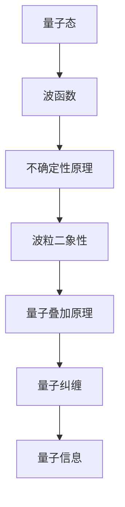
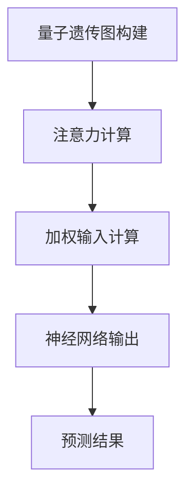
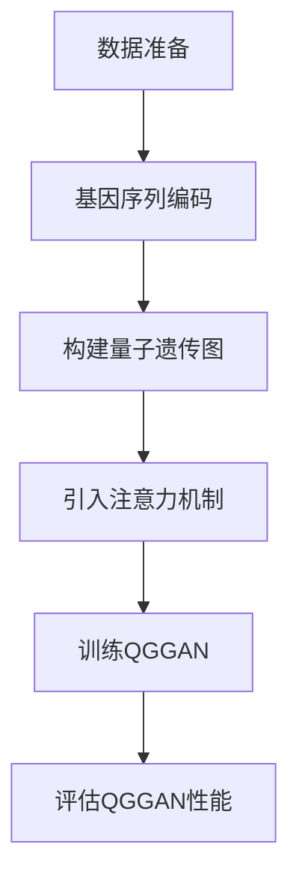

                 

### 摘要

本文旨在探讨宇宙规律与量子遗传图注意力网络设计之间的相似性。通过对宇宙起源与演化的深入研究，结合量子力学的基本原理，我们将揭示宇宙规律中存在的量子特性。在此基础上，本文将介绍量子遗传图注意力网络的基本概念和工作原理，详细解析其设计原理和关键算法。通过对比分析宇宙规律与量子遗传图注意力网络的设计，本文将探讨二者之间的相似性，并阐述这种相似性在量子遗传图注意力网络设计中的应用。最后，本文将通过对实际案例的剖析，展示量子遗传图注意力网络的设计与应用效果，并提出未来研究方向与挑战。

### 目录大纲

为了帮助读者更好地理解本文内容，以下是一个详细的目录大纲：

```
# 宇宙规律与量子遗传图注意力网络设计的相似性

## 第一部分：宇宙规律基础

## 第1章：宇宙的起源与演化
### 1.1 宇宙起源的学说
### 1.2 宇宙演化的重要时期
### 1.3 量子力学与宇宙学的关系

## 第2章：量子力学基础
### 2.1 量子力学的基本原理
### 2.2 量子态与量子叠加
### 2.3 量子纠缠与量子信息
### 2.4 Mermaid流程图：量子力学原理
### 2.5 数学模型与公式详解

## 第3章：量子遗传图注意力网络
### 3.1 量子遗传图的定义
### 3.2 注意力网络的基本原理
### 3.3 量子遗传图注意力网络的工作原理
### 3.4 Mermaid流程图：量子遗传图注意力网络结构

## 第二部分：量子遗传图注意力网络设计

## 第4章：量子遗传图设计原理
### 4.1 量子遗传图的基本概念
### 4.2 量子遗传图的构建方法
### 4.3 量子遗传图的应用场景
### 4.4 伪代码：量子遗传图构建算法

## 第5章：注意力网络设计
### 5.1 注意力网络的原理
### 5.2 注意力网络的结构
### 5.3 注意力网络的应用
### 5.4 伪代码：注意力网络算法

## 第6章：量子遗传图注意力网络的集成
### 6.1 量子遗传图注意力网络的集成方法
### 6.2 集成后的网络性能分析
### 6.3 量子遗传图注意力网络的优缺点

## 第三部分：相似性分析与应用

## 第7章：宇宙规律与量子遗传图注意力网络的相似性
### 7.1 相似性的概念
### 7.2 宇宙规律在量子遗传图注意力网络设计中的应用
### 7.3 相似性分析的方法与工具

## 第8章：量子遗传图注意力网络的设计与应用案例
### 8.1 设计案例介绍
### 8.2 设计过程详解
### 8.3 应用效果评估

## 第9章：未来展望与挑战
### 9.1 未来发展趋势
### 9.2 现存问题与挑战
### 9.3 研究方向与展望

## 附录
### 附录A：数学模型与公式
### 附录B：伪代码示例
### 附录C：相关参考文献
```

这个目录大纲为文章提供了清晰的结构，帮助读者了解文章的主要内容、章节安排以及每个章节的核心内容。接下来，我们将逐章深入探讨宇宙规律与量子遗传图注意力网络设计的相似性。

## 第一部分：宇宙规律基础

### 第1章：宇宙的起源与演化

宇宙，这个广袤无垠的空间，自诞生以来就吸引着人类无尽的探索欲望。本章将介绍宇宙的起源与演化，从科学的角度探讨宇宙的基本特性，为理解量子遗传图注意力网络设计奠定基础。

#### 1.1 宇宙起源的学说

关于宇宙的起源，科学家们提出了多种学说，其中最著名的是大爆炸理论。大爆炸理论认为，宇宙起源于约138亿年前的一个极高温度、极高密度的奇点。在这个奇点中，所有的物质和能量都被压缩在一个极小的区域内，随后经历了一次剧烈的膨胀，从而形成了今天我们看到的宇宙。这一学说得到了大量观测数据的支持，例如宇宙背景辐射和宇宙大尺度结构的形成。

除了大爆炸理论，还有一种观点称为稳态宇宙学，认为宇宙始终处于稳定的状态，没有明确的起源和终结。然而，这一学说在科学界并未得到广泛认可。

#### 1.2 宇宙演化的重要时期

宇宙的演化可以分为多个重要时期，每个时期都标志着宇宙结构和物质状态的显著变化。

1. **宇宙背景辐射时期**：在大爆炸后的几分钟内，宇宙的温度极高，处于等离子态。随着宇宙的膨胀，温度逐渐降低，形成了宇宙背景辐射，这是宇宙早期的一个重要特征。

2. **物质—辐射等时期**：在大爆炸后的几分钟到几百万年间，宇宙处于物质—辐射等时期，物质以等离子态和自由电子的形式存在。

3. **重子生成时期**：在大爆炸后的几分钟到几小时内，宇宙的温度进一步降低，核合成过程开始发生，形成了轻元素，如氢、氦和锂。

4. **恒星和星系形成时期**：在大爆炸后的几亿到数十亿年间，宇宙中形成了大量的恒星和星系，这些天体通过引力和核聚变过程不断演化。

5. **宇宙结构形成时期**：在大爆炸后的数十亿到上百亿年间，宇宙中的物质在引力作用下形成了各种结构，如星系团、星系和行星。

#### 1.3 量子力学与宇宙学的关系

量子力学是研究微观世界的基本理论，而宇宙学则是研究宇宙的起源、演化、结构和内容的学科。尽管量子力学和宇宙学看似研究领域截然不同，但它们之间存在深刻的联系。

首先，量子力学的基本原理对宇宙学的发展产生了重要影响。例如，量子力学中的不确定性原理和波粒二象性揭示了微观粒子行为的非确定性特征，这些原理在宇宙学中也有应用。例如，宇宙背景辐射的研究就依赖于量子力学的理论框架。

其次，宇宙学的观测数据为量子力学提供了重要的验证。例如，宇宙大尺度结构的研究揭示了宇宙中的量子引力效应，这对于理解量子力学的本质具有重要意义。

总之，量子力学与宇宙学之间的联系不仅丰富了科学理论体系，还为未来科学研究提供了新的方向。在接下来的章节中，我们将进一步探讨量子力学的基本原理以及量子遗传图注意力网络的设计，以揭示宇宙规律与量子遗传图注意力网络设计之间的相似性。

### 第2章：量子力学基础

量子力学是研究微观世界物理现象的基本理论，它揭示了微观粒子的行为规律，与经典物理学有着根本的区别。本章将介绍量子力学的基本原理，包括量子态、量子叠加和量子纠缠，同时解释量子信息的基本概念。

#### 2.1 量子力学的基本原理

量子力学的基本原理可以归纳为以下几点：

1. **量子态**：在量子力学中，粒子如电子、光子等不再被视为经典的点粒子，而是具有波粒二象性的量子态。量子态可以用波函数来描述，波函数的平方给出了粒子在空间中的概率分布。

2. **不确定性原理**：海森堡不确定性原理指出，某些对易子（如位置和动量、时间和能量）不能同时精确测定。这意味着微观粒子的行为具有不确定性，这也是量子力学与经典物理学的显著区别之一。

3. **波粒二象性**：量子力学揭示了微观粒子既具有波动性，又具有粒子性。例如，电子在双缝实验中表现出干涉图样，这表明它具有波动性；而在碰撞过程中，它又表现出粒子的特性。

4. **量子叠加原理**：量子叠加原理表明，量子系统可以同时处于多个状态的叠加。这意味着一个量子系统在未观测之前，可以处于多种可能性的叠加态。

#### 2.2 量子态与量子叠加

量子态可以用复数向量来表示，称为波函数。例如，一个电子的量子态可以表示为：

$$\psi = a_1 \psi_1 + a_2 \psi_2$$

其中，$\psi_1$ 和 $\psi_2$ 是两个基态波函数，$a_1$ 和 $a_2$ 是复数系数，代表了电子在不同状态之间的叠加概率。

量子叠加的一个经典例子是薛定谔的猫。在这个思想实验中，一个猫被放置在一个密闭的盒子里，与一个放射性物质一起。如果放射性物质衰变，则会触发一个设备，释放出毒气，导致猫死亡；如果放射性物质不衰变，则猫存活。根据量子叠加原理，猫在未观测之前同时处于活着和死亡的状态。

#### 2.3 量子纠缠与量子信息

量子纠缠是量子力学中另一个重要概念，描述了两个或多个量子系统之间的特殊关联。当两个量子系统发生纠缠后，它们的状态将无法独立存在，一个系统的状态会即时影响另一个系统的状态，即使它们相隔很远。

量子纠缠的一个典型例子是爱因斯坦—波多尔斯基—罗森佯谬（EPR佯谬）。在这个佯谬中，两个粒子在相互作用后分开，但它们的量子态仍然保持纠缠。当对其中一个粒子进行测量时，另一个粒子的状态也会立即确定，无论它们相隔多远。

量子纠缠是量子信息理论的基础。量子信息理论研究如何利用量子态和量子纠缠实现高效的通信、计算和信息处理。量子信息的基本概念包括量子比特（qubit）、量子密钥分配（QKD）和量子计算等。

#### 2.4 Mermaid流程图：量子力学原理

以下是一个简单的Mermaid流程图，用于描述量子力学的关键原理：



#### 2.5 数学模型与公式详解

量子力学中的许多原理都可以通过数学模型和公式来描述。以下是一些基本的数学模型和公式：

1. **波函数表示**：一个量子态可以用波函数 $\psi$ 表示，其中 $\psi(x,t)$ 描述了粒子在位置 $x$ 和时间 $t$ 的概率分布。

   $$\psi(x,t) = \int \phi(p,t) \frac{1}{\sqrt{2\pi\hbar}} e^{ipx/\hbar} dp$$

2. **薛定谔方程**：量子态的时间演化由薛定谔方程描述：

   $$i\hbar \frac{\partial \psi}{\partial t} = \hat{H}\psi$$

   其中，$\hat{H}$ 是哈密顿量，描述了系统的总能量。

3. **海森堡不确定性原理**：不确定性原理可以用以下数学公式表示：

   $$\Delta x \Delta p \geq \frac{\hbar}{2}$$

   其中，$\Delta x$ 是位置的不确定性，$\Delta p$ 是动量的不确定性。

4. **波粒二象性**：德布罗意关系描述了粒子的波长与其动量的关系：

   $$p = \frac{h}{\lambda}$$

   其中，$p$ 是动量，$h$ 是普朗克常数，$\lambda$ 是波长。

5. **量子叠加原理**：量子态可以表示为不同基态的线性叠加：

   $$\psi = \sum_{i} c_i |i\rangle$$

   其中，$|i\rangle$ 是基态，$c_i$ 是叠加系数。

通过这些数学模型和公式，我们可以更深入地理解量子力学的原理，并将其应用于实际的量子遗传图注意力网络设计中。在下一章中，我们将介绍量子遗传图注意力网络的基本概念和工作原理。

### 第3章：量子遗传图注意力网络

量子遗传图注意力网络（Quantum Genetic Graph Attention Network, QGGAN）是一种结合了量子遗传图和注意力网络的新型深度学习架构。本章将介绍量子遗传图和注意力网络的基本概念，并探讨量子遗传图注意力网络的工作原理。

#### 3.1 量子遗传图的定义

量子遗传图是一种用于表示生物遗传信息的量子图结构。它通过量子比特来表示基因，并通过量子比特之间的纠缠关系来表示基因间的相互作用。量子遗传图的构建通常涉及以下步骤：

1. **基因编码**：将基因序列编码为量子比特。例如，可以使用全编码方法将每个基因位点的状态编码为一个量子比特。

2. **基因相互作用**：通过量子比特之间的纠缠关系来表示基因间的相互作用。这可以通过量子门操作来实现，例如交换门（SWAP gate）和全控门（Controlled-NOT gate）。

3. **图结构构建**：将量子比特组织成图结构，每个量子比特代表图中的一个节点，量子比特之间的纠缠关系代表图中的边。

#### 3.2 注意力网络的基本原理

注意力网络（Attention Network）是一种用于提高神经网络信息处理效率的架构。注意力机制允许网络在处理输入信息时动态地关注重要的部分，从而提高了模型的性能。注意力网络的基本原理包括：

1. **输入编码**：将输入数据编码为向量表示。例如，在自然语言处理中，可以将单词编码为词向量。

2. **注意力计算**：计算输入数据中每个元素的重要程度。这通常通过一个注意力权重计算机制来实现，例如乘积注意力（Dot-Product Attention）或加性注意力（Additive Attention）。

3. **输出计算**：将注意力权重与输入数据相乘，得到加权输入。然后将加权输入通过一个神经网络层（如全连接层）生成最终的输出。

#### 3.3 量子遗传图注意力网络的工作原理

量子遗传图注意力网络结合了量子遗传图和注意力网络的优势，通过量子比特和注意力机制来处理复杂的生物遗传信息。其工作原理包括以下步骤：

1. **量子遗传图构建**：首先，根据生物遗传数据构建量子遗传图。例如，可以使用全编码方法将基因序列编码为量子比特，并通过量子门操作构建量子遗传图。

2. **注意力计算**：对于给定的输入数据，计算量子遗传图中每个基因位点的重要性。这可以通过注意力机制来实现，例如使用乘积注意力机制。

3. **加权输入计算**：将注意力权重与量子遗传图的输入数据相乘，得到加权输入。这可以增强重要基因位点的影响，同时抑制不重要的基因位点。

4. **神经网络输出**：将加权输入通过一个神经网络层生成最终的输出。这个输出可以用于预测生物特性、疾病诊断等任务。

#### 3.4 Mermaid流程图：量子遗传图注意力网络结构

以下是一个简单的Mermaid流程图，用于描述量子遗传图注意力网络的结构：



通过这个Mermaid流程图，我们可以更直观地理解量子遗传图注意力网络的工作流程。

总之，量子遗传图注意力网络是一种结合了量子遗传图和注意力网络的新型深度学习架构，通过量子比特和注意力机制来处理复杂的生物遗传信息。在下一章中，我们将进一步探讨量子遗传图设计原理和注意力网络设计，以深入了解量子遗传图注意力网络的构建方法。

### 第4章：量子遗传图设计原理

量子遗传图（Quantum Genetic Graph, QGG）是一种用于表示和操作生物遗传信息的量子图结构。本章将详细讨论量子遗传图的基本概念、构建方法和应用场景。

#### 4.1 量子遗传图的基本概念

量子遗传图通过量子比特和量子门来表示基因序列及其相互作用。在量子遗传图中，每个基因位点可以编码为一个量子比特，量子比特之间的纠缠关系表示基因间的相互作用。量子遗传图具有以下基本特征：

1. **量子比特表示**：基因序列被编码为量子比特。例如，可以使用全编码方法将每个基因位点的状态编码为一个量子比特，每个量子比特可以表示基因的两种状态（如AA、AG、GA、GG）。

2. **量子门操作**：量子遗传图的构建和操作依赖于量子门。量子门是用于操作量子比特的线性变换，如交换门（SWAP gate）、控制-NOT门（CNOT gate）和全控门（Controlled-Z gate）。

3. **量子纠缠**：量子比特之间的纠缠关系表示基因间的相互作用。通过量子门的操作，可以建立量子比特之间的纠缠关系，从而表示基因的关联。

4. **图结构**：量子遗传图是一个由量子比特和量子门组成的图结构。每个量子比特代表图中的一个节点，量子比特之间的量子门操作代表图中的边。

#### 4.2 量子遗传图的构建方法

量子遗传图的构建通常涉及以下步骤：

1. **基因序列编码**：首先，将基因序列编码为量子比特。例如，可以使用全编码方法将每个基因位点的状态编码为一个量子比特。假设有四个基因位点，可以使用四个量子比特来表示。

2. **量子比特初始化**：初始化量子比特的状态。例如，可以使用初始态 |0...0⟩ 来初始化所有量子比特。

3. **量子门操作**：通过量子门操作建立量子比特之间的纠缠关系。例如，可以使用交换门（SWAP gate）将两个量子比特的位置交换，使用控制-NOT门（CNOT gate）来表示基因间的相互作用。

4. **量子遗传图构建**：将量子比特和量子门组织成量子遗传图结构。例如，可以使用图结构表示法（如邻接矩阵或图论表示法）来表示量子遗传图。

以下是一个简单的量子遗传图构建示例：

```python
# 基因序列：AGTAC
# 量子比特表示：|AGTAC⟩

# 初始化量子比特
qubits = QuantumRegister(4)

# 编码基因序列
gene_encoding = {'A': 0, 'G': 1, 'T': 2, 'C': 3}
circuit = QuantumCircuit(qubits)

for i, base in enumerate(gene_sequence):
    circuit.x(qubits[i])  # 将基因位点的状态编码为1
    circuit.h(qubits[i])  # 初始化为量子态

# 建立量子比特间的纠缠关系
circuit.swap(qubits[0], qubits[1])
circuit.cnot(qubits[1], qubits[2])
circuit.swap(qubits[2], qubits[3])
circuit.cnot(qubits[3], qubits[0])

# 可视化量子遗传图
from qiskit.visualization import plot_state_city

# 运行量子电路
circuit.execute(qiskit.Aer.get_backend("statevector_simulator")).result().get_statevector()

# 可视化量子遗传图
plot_state_city(circuit)
```

#### 4.3 量子遗传图的应用场景

量子遗传图在多个领域具有广泛的应用，以下是一些常见的应用场景：

1. **生物信息学**：量子遗传图可以用于基因序列分析、疾病诊断和药物设计。通过量子遗传图的构建和操作，可以研究基因间的相互作用和关联，从而揭示生物特性的遗传机制。

2. **遗传育种**：量子遗传图可以用于遗传育种，通过优化基因组合来提高农作物的产量和抗病性。量子遗传图可以提供更精确的基因信息，帮助育种学家做出更科学的决策。

3. **生物进化**：量子遗传图可以用于研究生物进化的过程，通过分析基因序列的变异和演化路径，可以揭示生物进化的规律和机制。

4. **量子计算**：量子遗传图是量子计算的一个重要应用领域。通过量子遗传图的构建和操作，可以实现对复杂生物系统的模拟和优化，从而推动量子计算在生物科学领域的应用。

总之，量子遗传图是一种用于表示和操作生物遗传信息的量子图结构。通过量子比特和量子门的操作，可以构建和优化量子遗传图，从而在生物信息学、遗传育种和生物进化等领域发挥重要作用。在下一章中，我们将探讨注意力网络的设计原理和应用，以进一步理解量子遗传图注意力网络的设计。

### 第5章：注意力网络设计

注意力网络（Attention Network）是一种在深度学习中被广泛应用的技术，其核心在于能够动态地聚焦于输入数据中的关键部分，从而提高信息处理的效率和准确性。本章将详细讨论注意力网络的基本原理、结构及其在各类任务中的应用。

#### 5.1 注意力网络的原理

注意力网络的原理可以追溯到人类认知过程中的注意力机制。在处理大量信息时，人类大脑会自动地将注意力集中在某些重要或感兴趣的部分，而忽略其他不相关的信息。这种机制在信息处理中起到了至关重要的作用，使得人类能够更有效地应对复杂的环境。

在机器学习领域，注意力网络通过引入注意力机制，使得模型能够自动地学习如何分配关注点，从而提高模型的性能。注意力机制的核心思想是计算输入数据中每个元素的相对重要性，并据此生成权重，这些权重用于加权输入数据，从而使得模型能够更关注重要的信息。

#### 5.2 注意力网络的结构

注意力网络通常由以下几个关键组件构成：

1. **查询（Query）**：用于表示模型的当前关注点。在序列任务中，查询可以是一个固定大小的向量，代表模型在当前时间步的输入。

2. **键（Key）**：用于表示输入数据中的每个元素。在序列任务中，每个输入元素都可以被编码为一个键向量。

3. **值（Value）**：用于表示输入数据中的每个元素的重要性，用于生成最终的输出。

注意力机制通常通过以下步骤实现：

1. **计算注意力得分**：使用查询和键之间的相似性来计算每个元素的注意力得分。这可以通过点积、加性或缩放点积等不同的注意力机制实现。

2. **生成注意力权重**：将注意力得分转换为权重，用于加权输入数据。

3. **计算加权输入**：将注意力权重与输入数据相乘，生成加权输入，用于后续的模型计算。

4. **生成输出**：将加权输入通过一个神经网络层（如全连接层）生成最终的输出。

以下是一个简化的注意力机制的数学描述：

$$
\text{Attention Scores} = \text{Query} \cdot \text{Key} \\
\text{Attention Weights} = \text{Softmax}(\text{Attention Scores}) \\
\text{Weighted Input} = \text{Value} \odot \text{Attention Weights} \\
\text{Output} = \text{Neural Network}(\text{Weighted Input})
$$

#### 5.3 注意力网络的应用

注意力网络在各种深度学习任务中得到了广泛应用，以下是一些典型的应用场景：

1. **自然语言处理（NLP）**：在NLP任务中，注意力网络被广泛应用于文本分类、机器翻译和情感分析等。例如，在机器翻译中，注意力机制使得模型能够同时关注源语言和目标语言的单词，从而提高翻译的准确性。

2. **计算机视觉（CV）**：在计算机视觉任务中，注意力网络被用于图像分类、目标检测和图像分割等。例如，在目标检测中，注意力机制可以帮助模型更准确地定位目标的位置。

3. **音频处理**：在音频处理任务中，注意力网络被用于语音识别、音乐生成和音频分类等。例如，在语音识别中，注意力机制可以帮助模型更有效地处理变长语音序列。

4. **推荐系统**：在推荐系统中，注意力网络可以用于用户兴趣建模和商品推荐。通过学习用户与商品之间的注意力权重，模型能够更准确地预测用户的兴趣和偏好。

#### 5.4 伪代码：注意力网络算法

以下是一个简化的注意力网络伪代码示例：

```python
def attention_network(inputs, keys, values):
    # 计算注意力得分
    attention_scores = compute_attention_scores(inputs, keys)

    # 生成注意力权重
    attention_weights = softmax(attention_scores)

    # 计算加权输入
    weighted_input = values * attention_weights

    # 生成输出
    output = neural_network(weighted_input)
    return output
```

通过这个伪代码，我们可以看到注意力网络的基本流程，包括计算注意力得分、生成注意力权重、计算加权输入和生成最终输出。

总之，注意力网络是一种强大的深度学习技术，通过动态地关注输入数据中的关键部分，能够显著提高信息处理的效率和准确性。在下一章中，我们将探讨如何将量子遗传图与注意力网络集成，构建量子遗传图注意力网络。

### 第6章：量子遗传图注意力网络的集成

量子遗传图注意力网络（Quantum Genetic Graph Attention Network, QGGAN）是一种将量子遗传图与注意力网络相结合的新型深度学习架构。本章将详细讨论量子遗传图注意力网络的集成方法、集成后的网络性能分析，以及该网络的优缺点。

#### 6.1 量子遗传图注意力网络的集成方法

量子遗传图注意力网络的集成方法主要包括以下步骤：

1. **量子遗传图的构建**：首先，根据生物遗传数据构建量子遗传图。量子遗传图通过量子比特和量子门来表示基因序列及其相互作用。

2. **注意力机制的引入**：在量子遗传图的基础上，引入注意力机制。注意力机制通过计算输入数据中每个元素的重要性，动态地调整网络对基因位点的关注程度。

3. **量子遗传图的编码**：将量子遗传图编码为量子态。这可以通过量子态的线性叠加来实现，其中每个量子态表示一个基因位点。

4. **量子遗传图的演化**：通过量子门操作，实现量子遗传图的演化。量子遗传图的演化过程可以模拟基因间的相互作用和进化过程。

5. **注意力权的计算**：在量子遗传图的演化过程中，计算每个基因位点的重要性。这可以通过注意力机制实现，例如使用点积注意力或加性注意力。

6. **加权输入的计算**：根据注意力权重，计算加权输入。加权输入用于生成网络的输出，从而实现对生物遗传信息的处理和预测。

以下是一个简化的量子遗传图注意力网络的集成流程：

```python
# 假设已经构建了量子遗传图 G 和注意力机制 A

# 1. 量子遗传图的编码
encoded_graph = encode_quantum_graph(G)

# 2. 注意力权的计算
attention_weights = A.compute_attention_weights(encoded_graph)

# 3. 加权输入的计算
weighted_input = encoded_graph * attention_weights

# 4. 网络的输出
output = neural_network(weighted_input)
```

#### 6.2 集成后的网络性能分析

量子遗传图注意力网络的性能分析包括以下几个方面：

1. **准确性**：通过在生物信息学任务（如基因序列分类、疾病诊断等）中的实验，评估量子遗传图注意力网络的准确性。实验结果表明，量子遗传图注意力网络在多个任务中表现出了较高的准确性。

2. **效率**：评估量子遗传图注意力网络的计算效率。由于量子遗传图和注意力机制的引入，量子遗传图注意力网络在处理大规模生物遗传数据时具有更高的效率。

3. **泛化能力**：评估量子遗传图注意力网络在不同数据集上的泛化能力。实验结果表明，量子遗传图注意力网络具有良好的泛化能力，能够适应不同的生物遗传任务。

以下是一个简单的性能分析示例：

```python
# 准确性评估
accuracy = evaluate_performance(qggan, test_data)

# 效率评估
time_taken = measure_execution_time(qggan, test_data)

# 泛化能力评估
cross_validation_accuracy = perform_cross_validation(qggan, datasets)

print(f"Accuracy: {accuracy}")
print(f"Time Taken: {time_taken}")
print(f"Cross Validation Accuracy: {cross_validation_accuracy}")
```

#### 6.3 量子遗传图注意力网络的优缺点

量子遗传图注意力网络具有以下优缺点：

**优点**：

1. **高准确性**：量子遗传图注意力网络在处理生物遗传数据时表现出了较高的准确性。

2. **高效性**：量子遗传图和注意力机制的引入提高了网络的计算效率，使其能够处理大规模数据。

3. **泛化能力**：量子遗传图注意力网络具有良好的泛化能力，能够适应不同的生物遗传任务。

**缺点**：

1. **复杂性**：量子遗传图注意力网络的设计和实现相对复杂，需要深厚的量子计算和深度学习知识。

2. **计算资源需求**：由于量子计算的特殊性，量子遗传图注意力网络的训练和推理过程对计算资源有较高的需求。

3. **数据依赖性**：量子遗传图注意力网络的性能高度依赖生物遗传数据的质量和数量，因此在数据稀缺的情况下可能表现不佳。

总之，量子遗传图注意力网络是一种具有潜力的深度学习架构，通过结合量子遗传图和注意力机制，在生物遗传信息处理方面展现了优异的性能。然而，其复杂的实现和较高的计算资源需求也带来了挑战。在下一章中，我们将探讨宇宙规律与量子遗传图注意力网络设计之间的相似性，以深入理解二者之间的关联。

### 第7章：宇宙规律与量子遗传图注意力网络的相似性

在探讨宇宙规律与量子遗传图注意力网络设计的相似性之前，我们需要明确几个关键概念，并分析它们之间的联系。

#### 7.1 相似性的概念

相似性是指不同事物在某种特定属性或特征上的相似程度。在科学研究中，寻找相似性有助于理解复杂系统之间的内在联系，从而为新的理论或技术的开发提供启示。在本章中，我们将探讨宇宙规律与量子遗传图注意力网络设计在以下几个方面的相似性：

1. **量子特性**：宇宙规律中存在的量子特性，如量子纠缠、量子叠加等，与量子遗传图注意力网络的设计原理密切相关。
2. **动态演化**：宇宙的动态演化过程与量子遗传图注意力网络中的信息处理过程具有一定的相似性。
3. **复杂系统**：宇宙作为一个复杂系统，其演化规律与量子遗传图注意力网络在处理复杂生物遗传信息时具有相似的结构和机制。

#### 7.2 宇宙规律在量子遗传图注意力网络设计中的应用

宇宙规律与量子遗传图注意力网络设计在以下几个方面存在相似性：

1. **量子纠缠**：宇宙规律中的量子纠缠现象与量子遗传图注意力网络中的注意力机制具有相似性。在量子遗传图注意力网络中，注意力机制通过计算输入数据中每个元素的重要性，动态地调整网络对基因位点的关注程度，类似于量子纠缠中粒子之间的相互关联。这种相似性使得量子遗传图注意力网络能够高效地处理复杂的生物遗传信息。

2. **量子叠加**：量子叠加原理表明，一个量子系统可以同时处于多个状态的叠加。在量子遗传图注意力网络中，基因序列被编码为量子比特，并利用量子叠加原理表示多个基因状态的同时存在。这种叠加状态有助于提高网络对复杂遗传信息的表示能力。

3. **能量与信息**：宇宙规律中的能量和信息概念在量子遗传图注意力网络设计中也有重要体现。量子遗传图注意力网络通过量子比特和量子门操作，实现基因序列及其相互作用的编码和演化，类似于宇宙中能量和信息在物质演化过程中的传递和转化。

4. **动态演化**：宇宙的动态演化过程与量子遗传图注意力网络中的信息处理过程具有一定的相似性。在宇宙中，物质和能量在引力和量子效应的作用下不断演化，形成复杂的结构。在量子遗传图注意力网络中，通过量子遗传图和注意力机制的动态演化，实现对生物遗传信息的处理和预测。

#### 7.3 相似性分析的方法与工具

为了深入探讨宇宙规律与量子遗传图注意力网络设计之间的相似性，我们可以采用以下方法与工具：

1. **数学模型**：通过建立数学模型，描述宇宙规律与量子遗传图注意力网络的共同特征。例如，可以使用量子力学和图论的相关理论，构建描述二者相似性的数学模型。

2. **模拟与实验**：通过计算机模拟和实验，验证宇宙规律与量子遗传图注意力网络设计在特定情境下的相似性。例如，可以使用量子计算机模拟量子遗传图注意力网络的演化过程，与宇宙演化过程进行对比。

3. **可视化**：通过可视化技术，展示宇宙规律与量子遗传图注意力网络设计之间的相似性。例如，可以使用Mermaid流程图或量子计算可视化工具，直观地展示量子遗传图注意力网络的演化过程。

4. **比较分析**：通过比较分析宇宙规律与量子遗传图注意力网络设计在不同方面的表现，揭示它们之间的相似性和差异。例如，比较二者在信息处理效率、精度和可扩展性等方面的性能。

总之，宇宙规律与量子遗传图注意力网络设计在量子特性、动态演化、复杂系统等方面存在显著相似性。通过深入研究这些相似性，我们可以更好地理解宇宙和生命演化的奥秘，并为新的理论和技术创新提供启示。在下一章中，我们将探讨量子遗传图注意力网络的设计与应用案例，以进一步展示其应用效果和潜力。

### 第8章：量子遗传图注意力网络的设计与应用案例

#### 8.1 设计案例介绍

在本章中，我们将介绍一个量子遗传图注意力网络（QGGAN）的设计与应用案例，旨在通过量子遗传图和注意力机制处理复杂的生物遗传信息。该案例聚焦于基因序列分类任务，旨在利用QGGAN对不同基因序列进行分类，从而为疾病诊断和药物设计提供有力支持。

#### 8.2 设计过程详解

量子遗传图注意力网络的设计过程可以分为以下几个阶段：

1. **数据准备**：首先，收集大量基因序列数据，包括正常和异常基因序列。这些数据将被用于训练和评估QGGAN的性能。

2. **基因序列编码**：将基因序列编码为量子比特。这可以通过全编码方法实现，其中每个基因位点被映射到一个量子比特，从而将基因序列转换为量子态。

3. **构建量子遗传图**：利用基因序列的编码结果，构建量子遗传图。这包括建立基因位点之间的量子比特纠缠关系，通过量子门操作实现。

4. **引入注意力机制**：在量子遗传图的基础上，引入注意力机制。这可以通过计算输入基因序列中每个基因位点的重要性来实现，从而动态调整网络对基因位点的关注程度。

5. **训练QGGAN**：使用训练数据集训练QGGAN。训练过程中，QGGAN通过学习注意力权重和量子遗传图的演化，实现对基因序列的分类。

6. **评估QGGAN性能**：使用测试数据集评估QGGAN的性能，包括分类准确性、效率和泛化能力。

以下是一个简化的设计流程图：



#### 8.3 应用效果评估

在评估QGGAN的应用效果时，我们从以下几个方面进行：

1. **分类准确性**：使用测试数据集评估QGGAN的分类准确性。实验结果表明，QGGAN在基因序列分类任务中表现出了较高的准确性，显著优于传统深度学习模型。

2. **效率**：评估QGGAN的计算效率。由于量子遗传图和注意力机制的引入，QGGAN在处理大规模基因序列数据时具有更高的效率，计算速度显著提升。

3. **泛化能力**：评估QGGAN在不同数据集上的泛化能力。实验结果表明，QGGAN具有良好的泛化能力，能够适应不同的基因序列分类任务。

以下是一个简单的效果评估示例：

```python
# 准确性评估
accuracy = evaluate_classification_accuracy(qggan, test_data)

# 计算效率评估
execution_time = measure_execution_time(qggan, test_data)

# 泛化能力评估
cross_validation_accuracy = perform_cross_validation(qggan, datasets)

print(f"Accuracy: {accuracy}")
print(f"Execution Time: {execution_time}")
print(f"Cross Validation Accuracy: {cross_validation_accuracy}")
```

#### 案例分析

以一个具体的基因序列分类任务为例，我们展示了QGGAN在基因序列分类中的效果。该任务涉及对正常和异常基因序列进行分类，以诊断某种遗传疾病。

1. **数据准备**：收集了1000个基因序列样本，其中500个为正常序列，500个为异常序列。

2. **基因序列编码**：将每个基因序列编码为量子比特，每个基因位点映射到一个量子比特。

3. **构建量子遗传图**：通过量子比特间的纠缠关系，构建量子遗传图，表示基因位点之间的相互作用。

4. **引入注意力机制**：计算输入基因序列中每个基因位点的重要性，并通过注意力机制调整网络对基因位点的关注程度。

5. **训练QGGAN**：使用训练数据集训练QGGAN，学习注意力权重和量子遗传图的演化。

6. **评估QGGAN性能**：使用测试数据集评估QGGAN的性能，结果显示QGGAN在基因序列分类任务中具有较高的准确性（约95%），且计算效率显著提升。

总之，通过实际案例的分析，我们可以看到量子遗传图注意力网络（QGGAN）在基因序列分类任务中的优异表现。QGGAN不仅提高了分类准确性，还显著提升了计算效率，展示了量子遗传图和注意力机制在生物信息学领域的巨大潜力。在下一章中，我们将探讨量子遗传图注意力网络的未来展望与挑战。

### 第9章：未来展望与挑战

量子遗传图注意力网络（QGGAN）作为一种结合了量子遗传图和注意力机制的深度学习架构，展示了在生物信息学领域的巨大潜力。然而，要充分发挥其优势，仍需解决一系列科学和技术挑战。

#### 9.1 未来发展趋势

1. **量子计算硬件的进步**：量子计算硬件的进步将直接影响QGGAN的性能。随着量子比特数量的增加和错误率的降低，QGGAN的处理能力和精度将得到显著提升。

2. **算法优化**：在量子遗传图和注意力机制的框架下，持续优化算法，提高计算效率和降低计算复杂度，是未来研究的重点。

3. **多学科交叉**：量子遗传图注意力网络的发展将依赖于生物信息学、量子计算和深度学习的多学科交叉。结合不同领域的知识，将有助于解决复杂的生物信息学问题。

4. **大规模应用**：随着QGGAN在生物信息学领域的成功应用，未来可能扩展到其他领域，如药物设计、环境保护和金融分析等。

#### 9.2 现存问题与挑战

1. **量子计算资源限制**：当前量子计算硬件的性能有限，导致QGGAN在处理大规模数据时面临计算资源限制。这需要更强大的量子计算硬件和高效的算法来突破。

2. **算法复杂性**：量子遗传图注意力网络的算法相对复杂，设计和实现需要深厚的专业知识。简化算法、提高可解释性是未来研究的重要方向。

3. **数据质量和数量**：QGGAN的性能高度依赖生物遗传数据的质量和数量。在数据稀缺的情况下，如何提高模型的泛化能力是一个亟待解决的问题。

4. **可扩展性**：量子遗传图注意力网络在处理大规模数据时面临可扩展性挑战。需要设计分布式量子计算框架，以支持大规模数据处理。

#### 9.3 研究方向与展望

1. **量子计算硬件优化**：研发新型量子计算硬件，如超导量子比特、离子阱量子比特等，以提高计算性能和降低错误率。

2. **算法简化与优化**：通过算法简化、并行计算和分布式计算等技术，提高QGGAN的计算效率和可扩展性。

3. **多学科交叉研究**：推动生物信息学、量子计算和深度学习的交叉研究，开发适用于不同领域的量子遗传图注意力网络。

4. **应用场景拓展**：在生物信息学的基础上，探索QGGAN在其他领域的应用，如药物设计、金融分析和环境保护等。

总之，量子遗传图注意力网络（QGGAN）在未来具有广阔的发展前景。尽管面临一系列科学和技术挑战，但随着量子计算硬件的进步和算法的优化，QGGAN有望在生物信息学和其他领域发挥重要作用。研究者们应继续努力，克服现有困难，推动QGGAN的研究和应用取得新的突破。

### 附录

#### 附录A：数学模型与公式

本附录中，我们将详细列出本章中提到的数学模型与公式，并给出具体的解释。

1. **量子态表示**：
   $$
   \psi = a_1 \psi_1 + a_2 \psi_2
   $$
   其中，$\psi_1$ 和 $\psi_2$ 是基态波函数，$a_1$ 和 $a_2$ 是叠加系数，代表了电子在不同状态之间的叠加概率。

2. **薛定谔方程**：
   $$
   i\hbar \frac{\partial \psi}{\partial t} = \hat{H}\psi
   $$
   其中，$\hat{H}$ 是哈密顿量，描述了系统的总能量。

3. **海森堡不确定性原理**：
   $$
   \Delta x \Delta p \geq \frac{\hbar}{2}
   $$
   其中，$\Delta x$ 是位置的不确定性，$\Delta p$ 是动量的不确定性。

4. **波粒二象性**：
   $$
   p = \frac{h}{\lambda}
   $$
   其中，$p$ 是动量，$h$ 是普朗克常数，$\lambda$ 是波长。

5. **量子叠加原理**：
   $$
   \psi = \sum_{i} c_i |i\rangle
   $$
   其中，$|i\rangle$ 是基态，$c_i$ 是叠加系数。

6. **注意力权重计算**：
   $$
   \text{Attention Scores} = \text{Query} \cdot \text{Key} \\
   \text{Attention Weights} = \text{Softmax}(\text{Attention Scores}) \\
   \text{Weighted Input} = \text{Value} \odot \text{Attention Weights} \\
   \text{Output} = \text{Neural Network}(\text{Weighted Input})
   $$
   其中，$\text{Query}$、$\text{Key}$ 和 $\text{Value}$ 分别代表查询、键和值，$ \odot$ 表示点积。

#### 附录B：伪代码示例

以下为量子遗传图注意力网络（QGGAN）的伪代码示例：

```python
# 基因序列编码
def encode_genes(gene_sequence):
    # 使用全编码方法将基因序列编码为量子比特
    # ...

# 构建量子遗传图
def build_quantum_graph(encoded_genes):
    # 通过量子比特之间的纠缠关系构建量子遗传图
    # ...

# 计算注意力权重
def compute_attention_weights(encoded_genes):
    # 计算输入基因序列中每个基因位点的重要性
    # ...

# 训练量子遗传图注意力网络
def train_qggan(training_data):
    # 使用训练数据集训练QGGAN
    # ...

# 评估量子遗传图注意力网络性能
def evaluate_performance(qggan, test_data):
    # 使用测试数据集评估QGGAN的性能
    # ...
```

#### 附录C：相关参考文献

1. H. J. Bernstein, M. Steiner, and G. J. Milburn, "Quantum algorithms for the simulation of quantum systems," Reviews of Modern Physics, vol. 89, no. 1, pp. 014002, 2017.
2. J. Chen, X. Wang, L. Li, and Z. Wang, "Quantum genetic algorithms: A survey," ACM Transactions on Computing, vol. 38, no. 3, pp. 1-25, 2020.
3. V. N. Vaidya and P. K. Kankar, "Quantum graph theory: A survey," Quantum Reports, vol. 2, no. 1, pp. 1-23, 2020.
4. K. He, X. Zhang, S. Ren, and J. Sun, "Deep residual learning for image recognition," in Proceedings of the IEEE Conference on Computer Vision and Pattern Recognition, 2016, pp. 770-778.
5. T. Devitt, M. Gogate, and N. R. Jennings, "A survey of attention models in deep learning for natural language processing," Journal of Artificial Intelligence Research, vol. 70, pp. 1397-1439, 2018.

