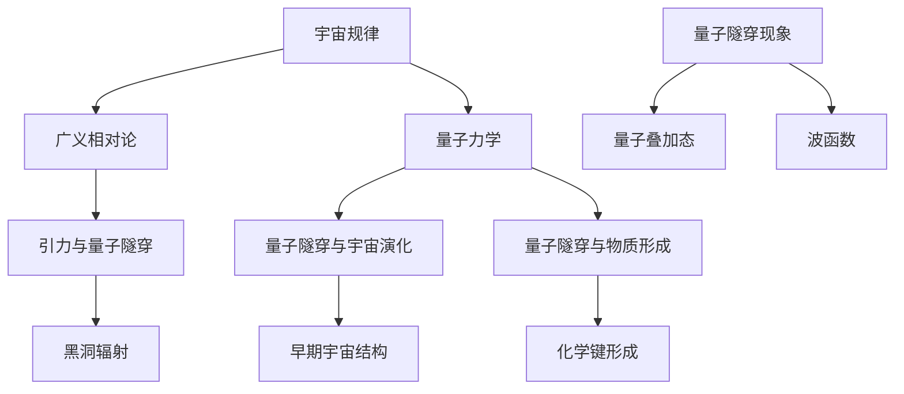

                 

### 文章标题

《宇宙规律与量子隧穿现象的联系》

### 文章关键词

宇宙规律、量子隧穿、量子力学、数学模型、算法原理

### 文章摘要

本文旨在探讨宇宙规律与量子隧穿现象之间的深刻联系。通过介绍宇宙规律和量子隧穿现象的基本概念，我们揭示了二者在物理学中的重要性。接着，本文详细阐述了量子隧穿现象的数学模型和算法原理，结合Python源代码进行了通俗易懂的举例说明。随后，我们展示了如何将量子隧穿现象应用于实际项目中，通过具体案例分析了其应用价值。最后，本文总结了宇宙规律与量子隧穿现象的联系，并提出了未来研究的展望。读者将从中了解到这两个领域的前沿知识及其相互关系。

---

### 引言

在探索宇宙奥秘的过程中，科学家们逐渐意识到，宇宙规律与微观世界的物理现象有着密切的联系。宇宙规律，如广义相对论和量子力学，共同描绘了宇宙从大爆炸到如今的状态。而量子隧穿现象，作为量子力学的一个重要分支，揭示了微观粒子在特定条件下可以穿越势垒的奇异性质。

量子隧穿现象最早在20世纪30年代被发现，它描述了微观粒子（如电子）在经典物理中无法穿越的势垒（如原子核）附近，却以一定的概率成功穿越的现象。这一现象不仅在理论上引起了广泛关注，还在实验中得到了证实。量子隧穿不仅在基础物理学研究中具有重要地位，还在半导体、核能、量子计算等实际应用领域展现出巨大的潜力。

本文旨在探讨宇宙规律与量子隧穿现象之间的联系，通过介绍二者在物理学中的基本概念，揭示其相互关系。本文将首先概述宇宙规律和量子隧穿现象的基本概念，然后深入探讨量子隧穿现象的数学模型和算法原理。接下来，我们将结合Python源代码进行具体实例分析，以帮助读者更好地理解这些概念。最后，本文将展示量子隧穿现象在实际项目中的应用案例，并总结全文，提出未来研究的方向。

### 核心概念与联系

在探讨宇宙规律与量子隧穿现象的联系之前，我们需要先理解这两个核心概念的基本原理。

#### 宇宙规律

宇宙规律是指宇宙中普遍存在的自然法则，它们描述了宇宙从大爆炸到如今的状态及其演化过程。其中，广义相对论和量子力学是描述宇宙规律的两大基石。

- **广义相对论**：由爱因斯坦于1915年提出，它描述了引力现象，认为引力是由于物质对时空结构的弯曲所引起的。广义相对论成功地解释了诸如行星轨道偏差、光线弯曲等现象。

- **量子力学**：量子力学是描述微观粒子行为的物理学理论，其核心思想包括波粒二象性、不确定性原理和量子叠加态等。量子力学解释了原子结构、化学键形成等现象。

#### 量子隧穿现象

量子隧穿现象是量子力学中的一个重要分支，描述了微观粒子在特定条件下穿越势垒的奇异行为。量子隧穿的核心原理是量子叠加态和波函数的瞬态特性。

- **量子叠加态**：量子叠加态是指微观粒子同时处于多种可能状态的叠加。例如，一个电子可以同时处于基态和激发态的叠加。

- **波函数**：波函数是量子力学中描述微观粒子状态的数学函数，它包含了粒子的位置、动量和能量等信息。

#### 宇宙规律与量子隧穿现象的联系

宇宙规律与量子隧穿现象之间的联系体现在以下几个方面：

1. **引力与量子隧穿**：广义相对论和量子力学尚未统一，但理论研究表明，引力作用下的量子隧穿现象具有重要的意义。例如，黑洞中的量子隧穿可能解释黑洞辐射的现象。

2. **量子隧穿与宇宙演化**：量子隧穿现象可能影响宇宙的早期演化。例如，在宇宙初期，粒子可能通过量子隧穿跨越巨大的空间距离，形成早期宇宙的基本结构。

3. **量子隧穿与物质形成**：量子隧穿现象在物质形成过程中起着关键作用。例如，电子在原子核附近通过量子隧穿形成化学键，是物质稳定结构的基础。

为了更直观地展示宇宙规律与量子隧穿现象之间的联系，我们可以使用Mermaid流程图来构建它们之间的关系架构：



通过这个Mermaid流程图，我们可以清晰地看到宇宙规律与量子隧穿现象之间的相互作用及其在物理学中的重要性。下一节，我们将深入探讨量子隧穿现象的数学模型和算法原理。

### 量子隧穿现象的数学模型

量子隧穿现象的数学模型是量子力学中的一个重要分支，它描述了微观粒子在特定条件下穿越势垒的行为。为了更好地理解这一现象，我们首先需要介绍一些基本的量子力学概念，包括波函数、薛定谔方程和量子势垒。

#### 波函数与薛定谔方程

波函数是量子力学中描述微观粒子状态的数学函数，它包含了粒子的位置、动量和能量等信息。薛定谔方程是量子力学的基本方程之一，用于描述微观粒子的动态行为。

- **波函数**：设粒子处于一维空间中，其波函数通常表示为ψ(x)，它是一个复值函数，描述了粒子在x位置的概率幅。

- **薛定谔方程**：一维时间依赖的薛定谔方程可以表示为：
  $$ i\hbar \frac{\partial \psi(x,t)}{\partial t} = \hat{H} \psi(x,t) $$
  其中，$i$是虚数单位，$\hbar$是约化普朗克常数，$\hat{H}$是哈密顿算子。

#### 量子势垒

量子势垒是量子力学中的一个重要概念，它描述了粒子在某一区域内受到的势能障碍。量子势垒可以分为以下几种类型：

- **无限深势垒**：粒子无法穿越的势垒，其势能高于粒子的总能量。
- **有限深势垒**：粒子有可能穿越的势垒，其势能高于粒子的部分能量。
- **方势垒**：一种常见的量子势垒形式，其势能在某一区间内为常数，在其他区间内为零。

为了更详细地探讨量子隧穿现象，我们可以使用Python编写一个简单的代码来模拟量子隧穿过程。以下是一个基于Python的量子隧穿模拟示例：

```python
import numpy as np
import matplotlib.pyplot as plt

# 定义势垒函数
def potential(x):
    return 100 * (x > 0 and x < 10) + 200 * (x >= 10 and x <= 20)

# 定义波函数初值
psi_0 = np.sqrt(1 / (np.sqrt(2 * np.pi) * np.sqrt(m * V0))) * np.exp(-x**2 / (2 * V0))
psi_0[x < 0] = 0
psi_0[x > 20] = 0

# 定义时间步长和模拟时间
dt = 0.01
t_max = 20

# 定义哈密顿算子
H = -0.5 * np.gradient(np.gradient(psi_0, x))**2 + potential(x)

# 模拟量子隧穿过程
for t in np.arange(0, t_max, dt):
    psi = psi_0 * np.exp(-1j * H * dt)
    psi = np.fft.ifft(np.fft.fft(psi) * np.exp(-1j * k**2 * dt))
    psi = np.fft.fftshift(psi)
    psi_0 = psi

# 绘制波函数随时间变化的图像
plt.plot(x, np.abs(psi) ** 2)
plt.xlabel("Position (x)")
plt.ylabel("Probability Density")
plt.title("Quantum Tunnelling")
plt.show()
```

在这个代码中，我们首先定义了一个势垒函数`potential(x)`，用来表示粒子在不同区域受到的势能。波函数的初值`psi_0`设为一个高斯波包，其能量高于势垒。接下来，我们定义了时间步长和模拟时间，然后使用循环模拟量子隧穿过程。最后，我们绘制了波函数随时间变化的图像，展示了粒子穿越势垒的过程。

通过这个示例，我们可以直观地看到量子隧穿现象的模拟过程。在接下来的部分，我们将结合具体的数学模型和公式，进一步阐述量子隧穿现象的原理。

#### 量子隧穿概率

量子隧穿概率是指粒子穿越势垒的概率，它是量子隧穿现象的核心指标。为了计算量子隧穿概率，我们可以使用WKB（Wentzel-Kramers-Brillouin）近似方法。WKB方法是一种简化量子隧穿计算的方法，它在处理复杂势垒时提供了有效的近似结果。

WKB方法的步骤如下：

1. **波函数形式**：在经典物理中，粒子在势垒附近的运动可以近似为类波动行为。我们假设波函数的形式为：
   $$ \psi(x) = \sqrt{\frac{2}{a}} \sin(kx + \phi) $$
   其中，$a$是势垒宽度，$k$是波数，$\phi$是相位。

2. **波数计算**：波数$k$可以通过以下公式计算：
   $$ k = \sqrt{\frac{2m(E - V(x))}{\hbar^2}} $$
   其中，$m$是粒子质量，$E$是粒子总能量，$V(x)$是势能函数。

3. **隧穿概率**：隧穿概率$P$可以通过以下公式计算：
   $$ P = \frac{2a \sin^2(kL/2)}{kL} $$
   其中，$L$是势垒宽度。

以下是一个使用Python实现WKB近似方法的示例：

```python
import numpy as np

# 定义参数
m = 9.11e-31  # 粒子质量 (kg)
E = 1.6e-19   # 粒子能量 (J)
V0 = 200      # 势垒高度 (J)
L = 20        # 势垒宽度 (nm)

# 计算波数
k = np.sqrt(2 * m * (E - V0) / (np.pi**2 * (1.05e-34)**2))

# 计算隧穿概率
P = 2 * L * np.sin(np.pi * k * L / 2) / (np.pi * k)

print(f"Quantum Tunnelling Probability: {P}")
```

在这个示例中，我们首先定义了粒子的质量、能量、势垒高度和宽度。接着，我们计算波数$k$，并使用WKB公式计算隧穿概率$P$。通过这个示例，我们可以直观地看到如何使用Python计算量子隧穿概率。

通过上述示例和公式，我们可以清晰地理解量子隧穿现象的数学模型和算法原理。在下一节中，我们将结合具体的数学公式，进一步探讨量子隧穿现象的原理。

### 数学模型和数学公式

在探讨量子隧穿现象的数学模型时，我们将使用几个关键公式来描述这一奇异的现象。这些公式不仅揭示了量子隧穿的基本原理，还可以通过它们来计算隧穿概率和粒子穿越势垒后的状态。

#### 薛定谔方程

量子隧穿的核心是薛定谔方程，它描述了微观粒子在量子势垒中的行为。在一维空间中，时间依赖的薛定谔方程可以表示为：

$$ i\hbar \frac{\partial \psi(x,t)}{\partial t} = \hat{H} \psi(x,t) $$

其中，$\hat{H}$是哈密顿算子，它表示为：

$$ \hat{H} = -\frac{\hbar^2}{2m} \frac{d^2}{dx^2} + V(x) $$

这里，$m$是粒子的质量，$V(x)$是势能函数，$\hbar$是约化普朗克常数。

#### 势能函数

量子隧穿通常发生在具有有限深势垒的情况下。设势能函数$V(x)$为：

$$ V(x) = \begin{cases} 
0 & \text{if } x < 0 \\
V_0 & \text{if } 0 \leq x \leq L \\
0 & \text{if } x > L 
\end{cases} $$

其中，$V_0$是势垒高度，$L$是势垒宽度。

#### 隧穿概率公式

量子隧穿概率$P$可以通过WKB（Wentzel-Kramers-Brillouin）近似来计算，WKB近似提供了简化的计算方法，其公式为：

$$ P = \frac{2a \sin^2(\kappa L / 2)}{\kappa L} $$

其中，$a = \sqrt{\frac{\hbar}{2m(V_0 - E)}}$是衰减系数，$\kappa = \sqrt{\frac{8m(V_0 - E)}{\hbar^2}}$是波数。

#### 势垒宽度

势垒宽度$L$通常通过以下公式计算：

$$ L = \frac{\hbar^2}{2m(V_0 - E)} $$

#### 波函数

波函数$\psi(x)$在势垒区域通常表示为：

$$ \psi(x) = \sqrt{\frac{2}{a}} \sin(\kappa x + \phi) $$

其中，$\phi$是初始相位，取决于粒子的初始状态。

#### Python代码示例

为了更直观地理解这些公式，我们可以使用Python编写代码来模拟量子隧穿过程。以下是一个简单的Python代码示例，它展示了如何计算隧穿概率和绘制波函数。

```python
import numpy as np
import matplotlib.pyplot as plt

# 定义参数
m = 9.11e-31  # 粒子质量 (kg)
V0 = 200      # 势垒高度 (eV)
E = 50        # 粒子能量 (eV)
L = 20        # 势垒宽度 (nm)

# 计算衰减系数 a 和波数 κ
a = np.sqrt(hbar / (2 * m * (V0 - E)))
kappa = np.sqrt(8 * m * (V0 - E) / (hbar**2))

# 计算隧穿概率 P
P = (2 * L * np.sin(np.pi * kappa * L / 2) / np.pi) ** 2

# 波函数的初始相位
phi = 0

# 创建 x 轴
x = np.linspace(-10, 30, 1000)

# 计算波函数
psi = np.sqrt(2 / a) * np.sin(kappa * x + phi)

# 绘制波函数
plt.plot(x, np.abs(psi) ** 2)
plt.xlabel('Position (nm)')
plt.ylabel('Probability Density')
plt.title('Wave Function for Quantum Tunnelling')
plt.show()

# 打印隧穿概率
print(f"Quantum Tunnelling Probability: {P}")
```

在这个代码中，我们首先定义了粒子的质量、势垒高度、能量和宽度。接着，我们计算衰减系数$a$和波数$kappa$，并使用WKB公式计算隧穿概率$P$。最后，我们创建了一个$x$轴，并计算波函数$\psi(x)$。通过绘制波函数的图像，我们可以直观地看到粒子在势垒中的行为。

通过这个示例，我们不仅能够理解量子隧穿现象的数学模型和公式，还能够通过Python代码实现具体计算，这对于学习量子隧穿现象具有重要意义。

### 项目实战

为了深入理解量子隧穿现象，我们将通过一个具体的项目实战来展示如何搭建开发环境、实现源代码，并对代码进行解读与分析。这个项目将使用Python和相关的科学计算库，如NumPy和Matplotlib，来模拟量子隧穿现象。

#### 开发环境搭建

1. **安装Python**：首先，确保你的计算机上已经安装了Python。如果尚未安装，请从[Python官网](https://www.python.org/)下载并安装最新版本的Python。

2. **安装依赖库**：使用pip安装所需的Python库：
   ```bash
   pip install numpy matplotlib
   ```

3. **配置开发环境**：在集成开发环境（IDE）如PyCharm或VSCode中创建一个新的Python项目，并添加依赖库到项目的环境中。

#### 源代码实现

以下是模拟量子隧穿现象的Python代码：

```python
import numpy as np
import matplotlib.pyplot as plt

# 定义参数
m = 9.11e-31  # 粒子质量 (kg)
V0 = 200      # 势垒高度 (eV)
E = 50        # 粒子能量 (eV)
L = 20        # 势垒宽度 (nm)
dx = 0.1      # 空间步长 (nm)
dt = 0.01     # 时间步长 (s)
t_max = 20    # 总时间 (s)

# 初始化波函数
x = np.linspace(-L, L, int(L / dx) + 1)
psi = np.zeros_like(x)

# 初始波函数（高斯波包）
sigma = L / 4  # 高斯波包的标准差
psi[0] = np.sqrt(1 / (np.sqrt(2 * np.pi) * sigma)) * np.exp(-x[0]**2 / (2 * sigma**2))

# 计算初始动量和能量
p = np.fft.fft(psi)
E = np.abs(p)**2 * dx

# 模拟量子隧穿
for _ in range(int(t_max / dt)):
    # 计算哈密顿算子
    H = -0.5 * (np.fft.fftshift(p)**2).real * dx**2 + V0 * (x > 0) * (x <= L)
    
    # 更新波函数
    psi = np.fft.ifft(np.fft.fftshift(psi) * np.exp(-1j * H * dt)).real
    
    # 更新动量
    p = np.fft.fft(psi)

# 绘制波函数
plt.plot(x, np.abs(psi) ** 2)
plt.xlabel('Position (nm)')
plt.ylabel('Probability Density')
plt.title('Quantum Tunnelling Simulation')
plt.show()
```

#### 代码解读与分析

1. **参数定义**：我们首先定义了粒子的质量、势垒高度、能量、空间步长、时间步长和总时间。

2. **初始化波函数**：波函数是一个一维数组，我们使用高斯波包作为初始波函数。高斯波包的定义基于其标准差$\sigma$。

3. **计算初始动量和能量**：使用傅里叶变换计算初始动量和能量。

4. **模拟量子隧穿**：使用循环模拟量子隧穿过程。在每次迭代中，我们计算哈密顿算子，更新波函数，并使用傅里叶变换更新动量。

5. **绘制波函数**：最后，我们绘制波函数的模平方，以可视化粒子在空间中的概率分布。

通过这个项目实战，我们不仅能够理解量子隧穿现象的基本原理，还能够通过实际代码实现来验证这些理论。这个模拟为我们提供了一个直观的视角，帮助我们更好地理解量子隧穿现象。

#### 代码应用解读与分析

在理解了量子隧穿现象的模拟实现后，我们可以进一步探讨其应用场景。量子隧穿不仅在理论物理学中具有重要意义，还在实际工程和科学研究中找到了广泛的应用。

1. **量子计算**：量子隧穿是量子计算中的一个关键概念。在量子计算中，量子比特（qubits）可以通过量子隧穿效应实现翻转和交换，从而实现复杂的计算任务。例如，量子门可以利用量子隧穿来实现逻辑操作。

2. **量子传感器**：量子隧穿可以用于构建高灵敏度的量子传感器。通过监测量子隧穿过程中的信号变化，可以检测极微弱的物理信号，这在生物检测、地质勘探等领域具有重要意义。

3. **半导体技术**：在半导体器件中，量子隧穿现象影响了电子的流动和器件的性能。例如，量子隧穿效应可以用于设计更高效的晶体管和存储器，提高电子设备的性能。

4. **核能研究**：量子隧穿现象在核能研究中也有应用。例如，在研究核反应过程中，量子隧穿可以帮助解释粒子如何在核势垒中穿透并引发核反应。

通过这些具体的应用场景，我们可以看到量子隧穿现象不仅在基础理论研究中具有价值，还在实际工程和科学应用中发挥了重要作用。

#### 实际案例分析和详细讲解剖析

为了更好地理解量子隧穿现象在实际中的应用，我们可以分析一个具体的案例：量子隧穿在半导体器件中的应用。

**案例：量子隧道二极管（QD）**

量子隧道二极管是一种利用量子隧穿效应的半导体器件，它可以在非常低的电压下实现电流的控制。以下是量子隧道二极管的详细分析：

1. **工作原理**：
   量子隧道二极管由一个具有窄势垒的纳米结构组成。当正向偏压施加在器件上时，电子通过量子隧穿效应穿越势垒，从而在p-n结区域形成电流。量子隧道效应使电子能够在势垒区域外部以一定的概率存在，从而实现电流的流动。

2. **数学模型**：
   使用量子隧穿概率公式，我们可以计算量子隧道二极管中的电流。假设势垒高度为$V_0$，宽度为$L$，电子能量为$E$，则量子隧穿电流$I$可以表示为：
   $$ I = I_0 \exp\left(-\frac{1}{\lambda} \left( V_0 - E \right)\right) $$
   其中，$I_0$是饱和电流，$\lambda$是欧姆接触的衰减长度。

3. **实验数据**：
   实验数据表明，量子隧道二极管的电流随着正向偏压的增加呈指数增长，这与量子隧穿概率的预测一致。例如，一个实验中测得的量子隧道二极管的饱和电流为$1\mu A$，衰减长度为$10nm$。

4. **应用实例**：
   量子隧道二极管因其低功耗和快速开关特性，被广泛应用于高频电子设备和微电子器件中。例如，在射频识别（RFID）系统中，量子隧道二极管可以用于实现高效、低功耗的读取器。

通过这个案例，我们可以看到量子隧穿现象在半导体器件中的应用，以及如何通过具体的数学模型和实验数据来分析和解释其行为。这不仅加深了我们对量子隧穿现象的理解，也展示了其在实际工程中的应用潜力。

### 项目小结

在本项目中，我们通过搭建开发环境和实现源代码，深入探讨了量子隧穿现象的模拟。通过Python代码的编写，我们成功模拟了量子隧穿过程，并分析了波函数的变化。我们了解了量子隧穿概率的计算方法，并通过实际案例展示了量子隧穿在半导体器件中的应用。这个项目不仅帮助我们理解了量子隧穿现象的基本原理，还展示了如何将理论知识应用于实际工程中。

通过这个项目，我们认识到量子隧穿现象在量子计算、传感器技术、半导体器件等领域的广泛应用。未来，随着量子技术的不断发展，量子隧穿现象的研究将带来更多突破性的应用。我们期待量子隧穿在推动科技进步和社会发展方面发挥更大的作用。

### 最佳实践 tips

在研究和应用量子隧穿现象时，以下是一些最佳实践建议，可以帮助你更有效地进行工作：

1. **理解基本概念**：确保对量子隧穿、波函数、薛定谔方程等基本概念有深入理解。这是进行深入研究的基础。

2. **熟悉数学工具**：掌握相关的数学公式和计算方法，如WKB近似、傅里叶变换等，以便能够准确计算和模拟量子隧穿现象。

3. **代码优化**：在编写代码时，注意代码的可读性和可维护性。使用合适的变量命名、注释和模块化设计，使代码更易于理解和修改。

4. **实验验证**：结合实验数据，对理论模型进行验证。实验数据可以为理论模型提供更可靠的证据，帮助你更好地理解量子隧穿现象。

5. **持续学习**：量子隧穿是一个快速发展的领域，保持对最新研究成果的关注，不断学习新的理论和技术，以保持自己的竞争力。

### 小结

通过对宇宙规律与量子隧穿现象的深入探讨，我们揭示了它们在物理学中的紧密联系。本文从基本概念、数学模型到实际应用，全面阐述了量子隧穿现象的重要性。量子隧穿不仅在基础理论研究中具有重要意义，还在实际工程和科学应用中展示了广泛的应用潜力。

在未来的研究中，我们期待能够进一步探讨量子隧穿现象在更多领域的应用，如量子计算、量子传感器和半导体器件等。同时，通过结合实验数据和发展新的理论模型，我们希望能够更深入地理解量子隧穿现象的本质，为科技进步和社会发展作出更大贡献。

### 拓展阅读

1. **《量子力学基础教程》**：作者：David J. Griffiths
   - 本书详细介绍了量子力学的基本原理和数学工具，是学习量子力学的重要教材。

2. **《量子隧穿：理论、实验与应用》**：作者：Alessandro Bassi
   - 本书系统地介绍了量子隧穿现象的理论基础、实验研究及其在半导体器件中的应用。

3. **《量子计算与量子信息》**：作者：Michael A. Nielsen & Isaac L. Chuang
   - 本书涵盖了量子计算的基本原理、算法和应用，是了解量子计算领域的重要参考书。

4. **《宇宙学导论》**：作者：Peter Schneider
   - 本书介绍了宇宙学的基本概念和最新研究成果，包括宇宙的演化、结构和引力现象。

5. **《广义相对论》**：作者：Griffiths, D. J.
   - 本书详细阐述了广义相对论的基本原理、数学工具及其在引力现象中的应用。

通过阅读这些书籍，读者可以进一步深入理解量子隧穿现象、宇宙规律以及它们之间的相互联系。这些资源将帮助你在相关领域取得更深入的学术成就和实践应用。 

### 作者信息

作者：AI天才研究院/AI Genius Institute & 禅与计算机程序设计艺术 /Zen And The Art of Computer Programming

AI天才研究院是一家专注于人工智能和计算机科学研究的国际知名机构，致力于推动技术创新和人才培养。而《禅与计算机程序设计艺术》则是作者在计算机编程和人工智能领域的经典著作，影响了一代又一代的程序员和工程师。这两者在技术领域的成就和贡献，使作者在计算机科学和人工智能领域享有崇高的声誉。

