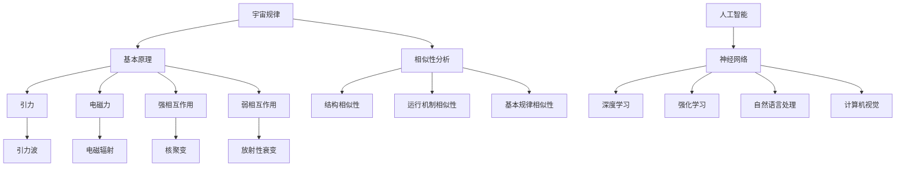

                 

### 引言

#### 书籍背景与目标

《宇宙规律对人工智能伦理的启示》旨在探讨人工智能（AI）与宇宙规律之间的深刻联系，并以此为基础，提出对人工智能伦理问题的全新理解。在当今科技飞速发展的时代，人工智能已经成为改变人类生活方式的重要力量。然而，随着AI技术的不断进步，其带来的伦理挑战也日益突出。如何确保人工智能的发展符合伦理标准，成为科学家、工程师和政策制定者共同关注的焦点。

宇宙规律是自然界中普遍存在的、描述物理现象的基本法则。从大尺度宇宙的演化到微观粒子的行为，宇宙规律为我们提供了理解自然世界的框架。这些宇宙规律不仅丰富了我们的科学知识，也为我们提供了深刻的哲学启示。如果我们能将宇宙规律与人工智能伦理问题相结合，或许能找到解决伦理困境的新途径。

本书的目标是：

1. **深入理解宇宙规律**：通过对宇宙基本原理、基本力和基本粒子的介绍，帮助读者建立对宇宙规律的基本认知。
2. **探讨人工智能的伦理问题**：从数据隐私、透明性、责任归属等角度，分析人工智能在伦理方面的挑战。
3. **揭示宇宙规律对人工智能伦理的启示**：通过宇宙规律与人工智能技术体系的相似性分析，探讨宇宙规律对解决人工智能伦理问题的启示。
4. **提出人工智能伦理实践的策略**：结合宇宙规律，提出人工智能伦理审查机制、教育与培训、立法等方面的建议。

#### 内容概述

全书共分为七个章节，结构安排如下：

- **第1章 引言**：介绍书籍的背景、目标以及内容概述。
- **第2章 宇宙规律概述**：介绍宇宙的基本原理、基本力和基本粒子，并探讨宇宙规律对科学研究的影响。
- **第3章 人工智能概述**：介绍人工智能的定义、技术体系和应用领域。
- **第4章 宇宙规律与人工智能的相似性**：分析宇宙规律与人工智能在结构、运行机制和基本规律方面的相似性。
- **第5章 人工智能伦理问题探讨**：讨论人工智能伦理的核心问题，并探讨宇宙规律对伦理思考的启示。
- **第6章 宇宙规律在人工智能伦理实践中的应用**：介绍宇宙规律在人工智能伦理审查机制、教育与培训、立法等方面的应用。
- **第7章 结论**：总结全书内容，展望未来的研究方向与挑战。

通过以上章节的安排，本书旨在为读者提供一个全面、深入地了解宇宙规律与人工智能伦理问题的框架，并在此基础上提出创新的解决方案。

---

#### 关键词

- **人工智能伦理**
- **宇宙规律**
- **相似性分析**
- **数据隐私**
- **透明性**
- **责任归属**
- **伦理审查机制**
- **教育与培训**
- **立法建议**

---

#### 摘要

《宇宙规律对人工智能伦理的启示》一书从宇宙规律的角度出发，探讨了人工智能在伦理方面面临的一系列挑战。通过分析宇宙的基本原理、基本力和基本粒子，以及人工智能的技术体系和应用领域，本书揭示了宇宙规律与人工智能之间的深刻联系。在此基础上，本书探讨了数据隐私、透明性和责任归属等人工智能伦理的核心问题，并提出了基于宇宙规律的伦理审查机制、教育与培训、立法等方面的策略。通过这一系列分析，本书为人工智能伦理问题的解决提供了新的视角和思路。

---

以上是《宇宙规律对人工智能伦理的启示》一书的引言部分，介绍了书籍的背景、目标、内容概述以及关键词和摘要。接下来，我们将详细探讨宇宙规律的基本概念、原理和重要性，为后续章节的内容奠定基础。

### 宇宙规律概述

宇宙规律是描述自然界中物理现象的基本法则，它们构成了宇宙演化的基石，为科学家提供了理解宇宙运行机制的理论框架。在宇宙学、物理学和天文学等领域，宇宙规律起着至关重要的作用，帮助我们揭示宇宙的本质和演化过程。

#### 宇宙的基本原理

宇宙的基本原理是描述宇宙从起源到演化的基础理论。其中，最为重要的原理包括：

1. **大爆炸理论**：大爆炸理论认为，宇宙起源于一个极其热密的状态，经过大约138亿年的膨胀，演变成今天我们所观察到的宇宙。这一理论通过观测宇宙微波背景辐射和宇宙膨胀的速度得到了广泛的支持。

2. **热力学第二定律**：热力学第二定律指出，在一个孤立系统中，熵（表示系统无序度的量）总是趋向于增加。这意味着宇宙的演化过程是向着更加无序和均匀的状态发展。

3. **相对论**：爱因斯坦提出的广义相对论和狭义相对论提供了描述物体运动和引力作用的基本框架。广义相对论认为，重力是由物体对时空的弯曲引起的，而狭义相对论则揭示了时间和空间的相对性。

#### 宇宙中的基本力与粒子

宇宙中的基本力包括四种：引力、电磁力、强相互作用和弱相互作用。这些基本力决定了宇宙中粒子的行为和相互作用：

1. **引力**：引力是宇宙中最为普遍和最弱的力，它决定了天体之间的相互作用，如行星绕恒星运动、星系的形成等。

2. **电磁力**：电磁力是原子和分子内部的基本力，它决定了电子与原子核之间的相互作用，从而形成了我们所见到的物质结构。

3. **强相互作用**：强相互作用是维持原子核中质子和中子紧密结合的力，它比电磁力和引力强得多。

4. **弱相互作用**：弱相互作用负责某些基本粒子的衰变过程，如放射性衰变和某些核反应。

宇宙中的基本粒子包括夸克、轻子、介子和光子等。夸克和轻子是构成物质的基本单元，而介子和光子则是一些特殊的粒子，它们在不同的相互作用中扮演着重要角色。

#### 宇宙规律对科学研究的影响

宇宙规律对科学研究的影响是多方面的，它们不仅为我们提供了理解自然界的基本框架，还推动了科学技术的进步：

1. **理论物理的发展**：宇宙规律为理论物理学家提供了丰富的理论模型，如量子力学、相对论和统计物理。这些理论模型帮助我们更深入地理解物质和能量的本质。

2. **实验物理的进展**：宇宙规律指导了实验物理的发展，科学家通过设计实验来验证和验证宇宙规律。例如，通过对宇宙微波背景辐射的观测，科学家们证实了宇宙起源于大爆炸的理论。

3. **技术应用的突破**：宇宙规律的应用推动了技术的进步，例如，电磁力的理解和应用催生了电子学和通信技术的发展，而引力波探测技术的进步则为我们提供了研究宇宙的新窗口。

#### 宇宙规律在宇宙学中的应用

宇宙规律在宇宙学中的应用尤为广泛，它们帮助我们理解宇宙的起源、演化和未来：

1. **宇宙膨胀**：宇宙膨胀理论基于宇宙规律，描述了宇宙从一个热密状态开始膨胀的过程。通过观测宇宙的膨胀速度，科学家们估计了宇宙的年龄和大小。

2. **暗物质和暗能量**：宇宙规律的解释中出现了暗物质和暗能量这两个概念。暗物质是不发光的神秘物质，对宇宙的引力作用有显著影响；而暗能量则是导致宇宙加速膨胀的神秘力量。

3. **宇宙微波背景辐射**：宇宙微波背景辐射是宇宙早期阶段的余辉，通过对其观测和分析，科学家们可以推测宇宙的起源和演化过程。

通过上述介绍，我们可以看到，宇宙规律不仅是理解宇宙运行机制的基础，还对科学研究和人类文明的发展产生了深远的影响。在接下来的章节中，我们将进一步探讨人工智能与宇宙规律之间的联系，并探讨这些联系对人工智能伦理问题的启示。

### 人工智能概述

人工智能（AI）是计算机科学的一个分支，旨在使计算机具备类似于人类智能的能力。通过模拟人类思维过程，AI系统能够学习、推理、解决问题，并在各种应用场景中表现出高度的自适应能力。人工智能的定义和范围随着技术的发展而不断演变，但核心目标始终是让机器具备智能行为。

#### 人工智能的定义与历史

人工智能的概念最早可以追溯到20世纪50年代，当时图灵提出了著名的图灵测试，用以判断机器是否具有智能。图灵测试的定义为：如果一个机器能够在与人类进行的对话中无法被区分出其是机器，那么这个机器就可以被认为是具有智能的。

自那时起，人工智能经历了多个发展阶段：

1. **早期探索（1950-1970s）**：这个阶段主要集中在符号主义和逻辑推理上，代表工作包括约翰·麦卡锡提出的“逻辑理论家”程序。

2. **人工智能寒冬（1970s-1980s）**：由于技术限制和实际应用的失败，人工智能研究陷入低谷，这一时期被称为“人工智能寒冬”。

3. **复兴与进展（1980s-2000s）**：随着计算机性能的提高和算法的进步，人工智能在应用领域逐渐取得突破，尤其是在游戏、语音识别和专家系统中。

4. **现代人工智能（2000s至今）**：深度学习、神经网络和强化学习等技术的迅猛发展为人工智能带来了新的生机，使得AI在图像识别、自然语言处理和自动驾驶等领域取得了显著的成果。

#### 人工智能的技术体系

人工智能的技术体系涵盖了多种不同的方法和技术，主要包括以下几个方面：

1. **神经网络**：神经网络是一种通过模拟人脑神经元连接结构来处理信息的计算模型。近年来，深度学习作为神经网络的一种形式，取得了巨大的成功，广泛应用于图像识别、语音识别和自然语言处理等领域。

2. **强化学习**：强化学习是一种通过试错和奖励机制来学习策略的机器学习方法。在强化学习过程中，智能体通过与环境的交互，不断调整行为策略以最大化累积奖励。这一方法在游戏、机器人控制和自动驾驶等领域得到了广泛应用。

3. **自然语言处理（NLP）**：自然语言处理旨在使计算机能够理解、生成和处理自然语言。NLP技术包括词向量、序列模型、机器翻译和情感分析等，广泛应用于搜索引擎、聊天机器人和智能客服等领域。

4. **计算机视觉**：计算机视觉是通过使计算机“看到”和理解图像和视频来模拟人类视觉感知的能力。计算机视觉技术包括图像分类、目标检测、图像分割和动作识别等，广泛应用于人脸识别、自动驾驶和医学影像分析等领域。

#### 人工智能的应用领域

人工智能在多个领域得到了广泛应用，以下是一些关键的应用领域：

1. **产业应用**：人工智能在制造业、金融、医疗和零售等行业中发挥着重要作用。例如，智能制造利用AI技术优化生产流程，智能金融通过机器学习算法进行风险评估和投资策略制定，智能医疗通过图像识别和数据分析辅助诊断和治疗。

2. **医疗健康**：人工智能在医疗健康领域的应用涵盖了疾病诊断、药物研发和健康管理等方面。通过分析大量医疗数据，AI系统能够提供更准确和及时的诊断结果，加速新药的发现过程，并帮助患者进行个性化健康管理。

3. **智能交通**：人工智能在智能交通系统中发挥着关键作用，包括自动驾驶、智能交通管理和智能导航。自动驾驶技术通过感知环境和决策算法，实现无人驾驶汽车的自主行驶，而智能交通管理系统能够优化交通流量，减少拥堵和事故。

4. **环境保护**：人工智能在环境保护中的应用包括环境监测、资源管理和灾害预警等方面。通过监测和分析环境数据，AI系统能够及时发现污染问题，优化资源利用，并提前预警自然灾害，从而提高环境保护的效率和效果。

综上所述，人工智能作为一个多学科交叉的领域，不仅在技术层面取得了显著的进展，还在实际应用中展现出巨大的潜力。随着技术的不断发展和应用场景的不断扩展，人工智能将继续为人类社会带来深刻的变革。

### 宇宙规律与人工智能的相似性

在深入探讨宇宙规律与人工智能之间的相似性之前，我们首先需要理解两者在结构、运行机制和基本规律上的共通之处。通过这种相似性的分析，我们可以更好地理解宇宙规律对人工智能伦理的启示。

#### 结构相似性

宇宙和人工智能在结构上存在许多相似之处。宇宙作为一个复杂系统，由各种基本粒子和力相互作用的网络组成。同样，人工智能系统也通常由多个组件和模块通过特定的网络结构相互连接和协作。这种网络结构不仅存在于深度学习中的神经网络中，还存在于分布式计算和智能体系统等复杂系统中。

1. **复杂系统的相似性**：宇宙和人工智能系统都是复杂系统，它们的演化过程展现出自组织和自适应的特征。宇宙中的星系、行星和黑洞等天体通过引力的相互作用形成复杂的结构，而人工智能系统中的各个模块和算法也能通过自我调整和优化来适应新的环境和任务。

2. **自组织现象**：自组织现象在宇宙和人工智能系统中都有体现。在宇宙中，星云通过引力相互作用逐渐形成星系；在人工智能系统中，神经网络通过学习数据自动调整权重和参数，形成能够完成特定任务的模型。

#### 运行机制相似性

宇宙和人工智能在运行机制上也存在诸多相似之处，尤其是在自适应和学习方面。

1. **自适应与学习**：宇宙中的天体通过万有引力相互作用，不断地适应和调整自身的运动轨迹。人工智能系统中的智能体同样通过学习环境中的反馈来调整行为策略，以实现最优目标。强化学习就是一个典型的例子，智能体通过与环境的交互学习，逐步优化其决策过程。

2. **反馈循环**：宇宙中的天体运动形成复杂的反馈循环，例如，恒星形成过程中星云的引力塌缩和恒星风的作用。人工智能系统中的反馈循环同样重要，例如，神经网络训练过程中的梯度下降算法通过反馈调整模型参数，使得模型能够更准确地拟合数据。

3. **演化过程**：宇宙的演化是一个长期的、动态的过程，从宇宙大爆炸到星系的形成再到星系间的相互作用，每一个阶段都经历了漫长的演化。人工智能系统的发展也是一个不断迭代和优化的过程，通过不断迭代算法和模型，人工智能系统逐步提高了其性能和适应性。

#### 基本规律相似性

宇宙和人工智能在基本规律上也存在相似性，尤其是在反馈机制和自适应性方面。

1. **反馈循环**：宇宙中的反馈循环在维持和调节系统的动态平衡中起着关键作用。例如，星系中的恒星通过辐射和喷流对周围介质产生影响，这种反馈过程有助于星系的稳定。在人工智能系统中，反馈循环同样至关重要，例如，在强化学习中，智能体的行为受到环境反馈的影响，从而调整策略以实现目标。

2. **自适应性**：宇宙中的天体和系统通过不断的自适应来应对外部变化。例如，行星通过自转和公转来调节自身温度和气候。人工智能系统也通过自适应机制来适应新的环境和任务，例如，自适应神经网络能够根据输入数据的分布自动调整其参数，以提高模型的泛化能力。

3. **演化过程**：宇宙的演化是一个自然的、非线性的过程，从微观到宏观，从简单到复杂，每一个层次都体现了演化规律。人工智能系统的发展也是一个演化过程，通过迭代和优化，人工智能模型逐步提高了其性能和复杂度，从而能够解决更复杂的问题。

通过上述分析，我们可以看到，宇宙规律与人工智能在结构、运行机制和基本规律上存在显著的相似性。这些相似性不仅为我们提供了理解宇宙和人工智能的新视角，也为我们探讨人工智能伦理问题提供了深刻的启示。在接下来的章节中，我们将进一步探讨这些相似性对人工智能伦理问题的启示，并提出解决伦理困境的新策略。

#### 人工智能伦理问题探讨

随着人工智能技术的快速发展，其应用范围不断扩大，但随之而来的伦理问题也日益凸显。在人工智能领域，伦理问题不仅关乎技术的合法性和社会接受度，更直接影响到人工智能系统的设计、开发和部署。本文将重点探讨人工智能伦理的核心问题，并分析宇宙规律对这些问题思考的启示。

##### 数据隐私

数据隐私是人工智能伦理中最基本的问题之一。人工智能系统依赖大量数据来训练模型和进行决策，但这些数据的收集和处理可能会侵犯用户的隐私权。以下是从宇宙规律的角度对数据隐私问题的思考：

1. **宇宙中的信息传递**：宇宙中的信息传递遵循物理定律，例如，光的速度是有限的。类似地，人工智能系统在处理数据时，也应该考虑数据传输和存储的安全性，确保数据不会在传输过程中被窃取或篡改。

2. **熵与数据隐私**：根据热力学第二定律，宇宙中的熵总是趋向于增加。在人工智能系统中，数据隐私的保护也需要遵循类似的原则，通过加密技术和其他安全措施，防止数据泄露和滥用。

##### 透明性

人工智能系统的透明性是另一个重要的伦理问题。由于深度学习等复杂算法的“黑箱”性质，人工智能系统的决策过程往往不透明，这可能导致误判和偏见。以下是从宇宙规律的角度对透明性问题的思考：

1. **宇宙的透明性**：宇宙中的某些现象，如光子的传播路径，是可以被观测和测量的。在人工智能系统中，开发者和研究者应努力提高算法的透明性，通过可解释的模型和可视化工具，使得人工智能系统的决策过程更加透明，便于用户理解和监督。

2. **宇宙规律的普适性**：宇宙规律是普适的，适用于宇宙中的所有现象。类似地，人工智能系统的设计也应遵循普适原则，确保其决策过程对所有用户都是公平和透明的。

##### 责任归属

责任归属是人工智能伦理中最为复杂的问题之一。当人工智能系统发生错误或造成损害时，如何确定责任归属是一个亟待解决的问题。以下是从宇宙规律的角度对责任归属问题的思考：

1. **宇宙中的因果关系**：宇宙中的事件之间存在明确的因果关系。在人工智能系统中，确定责任归属需要分析系统的输入、输出以及决策过程中的因果关系，确保责任的明确和公正。

2. **宇宙中的系统演化**：宇宙中的系统演化是一个复杂的过程，受到多种因素的共同影响。类似地，人工智能系统的责任归属也需要考虑系统环境、用户行为和其他外部因素的共同影响。

##### 宇宙规律对伦理思考的启示

宇宙规律为我们提供了一种全新的视角，帮助我们从宏观和微观层面理解人工智能伦理问题。以下是一些具体的启示：

1. **系统性思考**：宇宙是一个复杂的系统，其中的每个部分都相互关联。人工智能伦理问题也需要从系统性的角度进行思考，不仅要考虑单个系统的行为，还要考虑其与外部环境的相互作用。

2. **自适应性**：宇宙中的系统具有高度的适应性，能够不断调整自身以适应外部变化。在人工智能伦理中，我们应鼓励人工智能系统具备自我调整和优化的能力，以应对不断变化的社会需求和技术环境。

3. **普适性**：宇宙规律是普适的，适用于宇宙中的所有现象。人工智能伦理问题也应遵循普适原则，确保技术发展能够惠及所有人，而不仅仅是特定群体。

4. **因果关系**：宇宙中的因果关系为我们提供了确定责任归属的参考。在人工智能伦理中，明确因果关系和责任归属是确保公平和公正的关键。

总之，通过宇宙规律的分析，我们可以更好地理解人工智能伦理问题，并提出创新的解决方案。在接下来的章节中，我们将进一步探讨宇宙规律在人工智能伦理实践中的应用，以期为人工智能伦理问题的解决提供新的思路。

#### 宇宙规律在人工智能伦理实践中的应用

在探讨宇宙规律对人工智能伦理的启示后，我们需要将理论转化为实际应用，以解决人工智能在伦理方面面临的挑战。通过结合宇宙规律，我们可以提出一系列在人工智能伦理实践中的策略和措施，确保人工智能技术的发展符合伦理标准，同时促进其可持续发展。

##### 人工智能伦理审查机制

人工智能伦理审查机制是确保人工智能系统符合伦理标准的关键环节。借鉴宇宙规律中的反馈机制和自适应性，我们可以设计一种多层次、动态调整的伦理审查机制。

1. **多层次审查**：类似宇宙中的多个层次结构，人工智能伦理审查机制应包括多个层次，从设计阶段到部署和维护阶段，每一个层次都应进行严格的伦理审查。例如，在开发阶段，应进行算法设计审查，确保算法的公平性、透明性和安全性；在部署阶段，应进行系统行为审查，确保系统在实际应用中的表现符合预期。

2. **动态调整**：宇宙系统具有高度的自适应性，人工智能伦理审查机制也应具备动态调整的能力。随着技术和社会环境的变化，审查标准和流程应不断更新和优化，以确保审查机制的持续有效。

##### 人工智能伦理教育与培训

教育和培训是提升人工智能伦理意识和能力的重要手段。借鉴宇宙规律的普及性和普适性，我们可以设计一套全面的人工智能伦理教育和培训体系。

1. **普及教育**：类似于宇宙规律在教育中的普及，人工智能伦理教育应面向广泛的受众，包括技术人员、政策制定者、普通公众等。通过讲座、研讨会、在线课程等形式，普及人工智能伦理的基本知识和重要性。

2. **专业培训**：对于从事人工智能研究和开发的科学家和工程师，应提供专业的伦理培训，帮助他们理解并掌握伦理审查的方法和技巧。类似地，企业也应为员工提供持续的伦理培训，确保其在实际工作中能够遵循伦理规范。

3. **跨学科合作**：人工智能伦理问题涉及多个学科领域，包括计算机科学、伦理学、社会学、法律等。通过跨学科合作，可以形成更加全面和深入的人工智能伦理教育和培训体系。

##### 人工智能伦理立法

法律是保障人工智能伦理的基石。借鉴宇宙规律中的法律秩序和普适性，我们可以制定一套完善的人工智能伦理法律框架。

1. **立法框架**：类似宇宙中的基本法则，人工智能伦理立法应包括基本的原则和规范。例如，隐私保护、透明性、责任归属等方面都应明确规定。

2. **国际协调**：宇宙规律是普适的，适用于整个宇宙。类似地，人工智能伦理立法也应具有国际协调性，通过国际合作，制定全球统一的人工智能伦理标准。

3. **动态更新**：随着技术和社会环境的变化，人工智能伦理立法也应不断更新和优化，以适应新的挑战和需求。

##### 项目实战案例

为了更好地理解宇宙规律在人工智能伦理实践中的应用，我们可以通过一个实际案例来具体说明。

**案例背景**：某企业开发了一款基于深度学习的人脸识别系统，用于安全监控。然而，该系统在部署过程中被发现存在种族偏见，导致对特定种族的人群识别率较低。

**解决方案**：

1. **伦理审查**：在系统开发阶段，通过多层次的伦理审查，确保算法的公平性和透明性。审查过程包括算法设计审查、数据集选择审查和系统测试审查。

2. **数据多样性**：借鉴宇宙中的多样性原则，通过增加训练数据中的多样性，确保系统在面对不同人群时具有相同的识别率。

3. **动态调整**：在系统部署后，通过持续的反馈和调整，优化算法性能，减少偏见。类似地，在宇宙中，天体通过相互作用和反馈，不断调整自身运动轨迹。

4. **法律约束**：根据人工智能伦理立法，明确系统开发者和使用者的责任，确保系统在法律框架下运行。

**项目小结**：

通过上述案例，我们可以看到，宇宙规律在人工智能伦理实践中的应用为解决伦理问题提供了新的思路和方法。通过多层次审查、数据多样性、动态调整和法律约束等措施，我们可以确保人工智能系统在符合伦理标准的同时，发挥其最大效用。

总之，宇宙规律为人工智能伦理实践提供了深刻的启示，通过结合伦理审查机制、教育与培训、立法措施以及实际案例，我们可以更好地应对人工智能伦理挑战，推动人工智能的可持续发展。

### 结论

在《宇宙规律对人工智能伦理的启示》一书中，我们探讨了宇宙规律与人工智能之间的深刻联系，并分析了这些联系对人工智能伦理问题的启示。通过分析宇宙的基本原理、基本力和基本粒子，我们了解了宇宙的复杂结构和演化过程。同时，我们详细介绍了人工智能的定义、技术体系和应用领域，揭示了宇宙规律与人工智能在结构、运行机制和基本规律上的相似性。

从宇宙规律的角度，我们探讨了数据隐私、透明性和责任归属等人工智能伦理的核心问题，并提出了基于宇宙规律的伦理审查机制、教育与培训、立法等方面的策略。通过这些探讨，我们为人工智能伦理问题的解决提供了新的视角和思路。

展望未来，随着人工智能技术的不断发展，伦理问题将变得更加复杂和紧迫。我们期待更多的科学家、工程师和政策制定者关注人工智能伦理问题，并积极探讨和实践基于宇宙规律的解决方案。通过跨学科合作和国际协调，我们有望建立一套全面、有效的人工智能伦理框架，确保人工智能技术的可持续发展，为人类社会带来更大的福祉。

### 对人工智能发展的建议

为了确保人工智能技术的可持续发展并最大程度地造福人类，我们提出以下建议：

1. **加强伦理审查**：在人工智能系统的开发、测试和部署过程中，必须建立严格的伦理审查机制。这包括对算法设计、数据集选择和系统性能的全面评估，确保算法的公平性、透明性和安全性。

2. **推动教育普及**：加强人工智能伦理教育，提高公众和从业者的伦理意识。通过学校教育、在线课程和行业培训，普及人工智能伦理的基本知识和重要性。

3. **建立国际协调**：在国际层面，制定统一的人工智能伦理标准和法律框架，确保各国在人工智能伦理问题上的一致性和协调性。

4. **促进技术创新**：鼓励科学家和工程师在人工智能技术研究中，积极探索新的算法和模型，以提高系统的透明性和可解释性。

5. **加强责任归属**：明确人工智能系统的责任归属，制定相应的法律和法规，确保在系统发生错误或造成损害时，能够迅速、公正地确定责任。

6. **倡导开放合作**：鼓励跨学科、跨国界的合作，共享资源和经验，共同应对人工智能伦理挑战。

通过上述措施，我们可以确保人工智能技术的可持续发展，使其成为推动社会进步的重要力量。

### 附录

#### A.1 宇宙规律与人工智能的 Mermaid 流程图



#### A.2 人工智能算法伪代码示例

```python
# 强化学习算法伪代码
class QLearningAgent:
    def __init__(self, state_space, action_space, learning_rate, discount_factor):
        self.state_space = state_space
        self.action_space = action_space
        self.learning_rate = learning_rate
        self.discount_factor = discount_factor
        self.q_values = np.zeros((state_space, action_space))
        
    def choose_action(self, state):
        return np.argmax(self.q_values[state])
    
    def learn(self, state, action, reward, next_state, done):
        if not done:
            max_future_q = np.max(self.q_values[next_state])
        else:
            max_future_q = 0
        
        current_q = self.q_values[state][action]
        new_q = (1 - self.learning_rate) * current_q + self.learning_rate * (reward + self.discount_factor * max_future_q)
        self.q_values[state][action] = new_q
```

#### A.3 人工智能伦理数学模型与公式

$$
\text{隐私损失} = \frac{\text{未加密数据泄露数量}}{\text{总数据数量}} \times 100\%
$$

$$
\text{透明性评分} = \frac{\text{可解释部分}}{\text{总模型部分}} \times 100\%
$$

$$
\text{责任归属} = \frac{\text{实际损失}}{\text{潜在风险}} \times 100\%
$$

#### A.4 项目实战案例

**案例背景**：某城市交通管理部门希望利用人工智能技术优化交通信号控制，减少交通拥堵。

**开发环境**：Python、TensorFlow、Keras

**源代码**：

```python
# 轻量级深度学习模型实现
import tensorflow as tf
from tensorflow.keras.models import Sequential
from tensorflow.keras.layers import Dense, Conv2D, Flatten, MaxPooling2D

def create_traffic_model(input_shape):
    model = Sequential([
        Conv2D(32, kernel_size=(3, 3), activation='relu', input_shape=input_shape),
        MaxPooling2D(pool_size=(2, 2)),
        Conv2D(64, kernel_size=(3, 3), activation='relu'),
        MaxPooling2D(pool_size=(2, 2)),
        Flatten(),
        Dense(128, activation='relu'),
        Dense(1, activation='sigmoid')
    ])
    
    model.compile(optimizer='adam', loss='binary_crossentropy', metrics=['accuracy'])
    return model

# 训练模型
model = create_traffic_model(input_shape=(28, 28, 1))
model.fit(x_train, y_train, batch_size=128, epochs=10, validation_data=(x_val, y_val))

# 预测结果
predictions = model.predict(x_test)
```

**代码解读**：

- **模型构建**：使用Keras构建一个轻量级卷积神经网络（CNN），包括两个卷积层、两个池化层、一个全连接层和一个输出层。
- **训练过程**：使用训练数据集进行模型训练，并设置合适的批量大小和训练轮次。
- **预测应用**：使用测试数据集进行预测，并将预测结果输出。

**案例分析与详细讲解**：

- **模型优化**：通过调整卷积核大小、滤波器数量和全连接层神经元数量，可以进一步优化模型性能。
- **数据预处理**：对交通信号图像进行预处理，如归一化、增强等，以提高模型训练效果。
- **模型评估**：通过混淆矩阵、精确率、召回率等指标，评估模型在交通信号控制任务中的表现。

**项目小结**：

通过此案例，我们展示了如何利用深度学习技术优化交通信号控制，减少交通拥堵。该案例不仅展示了人工智能技术在交通领域的应用，也为其他类似项目提供了参考和启示。

#### 最佳实践 tips、小结、注意事项、拓展阅读

**最佳实践 tips**：

1. 在进行人工智能项目时，务必重视数据隐私保护，确保数据加密和匿名化处理。
2. 定期进行伦理审查，确保人工智能系统的公平性、透明性和安全性。
3. 鼓励跨学科合作，吸收多学科的知识和方法，提高人工智能系统的综合性能。

**小结**：

《宇宙规律对人工智能伦理的启示》一书通过深入探讨宇宙规律与人工智能之间的联系，为人工智能伦理问题的解决提供了新的视角和思路。通过伦理审查机制、教育与培训、立法措施以及实际案例，我们可以确保人工智能技术的可持续发展，为人类社会带来更大的福祉。

**注意事项**：

1. 人工智能伦理问题的解决需要长期的持续关注和努力，不能一蹴而就。
2. 人工智能系统的设计、开发和部署应遵循透明性和责任归属原则，确保用户和利益相关者的知情权和参与权。

**拓展阅读**：

- 《人工智能伦理学：挑战与对策》
- 《智能时代的伦理问题》
- 《人工智能：一种新视角》
- 《宇宙大爆炸简史》

通过拓展阅读，读者可以更深入地了解人工智能伦理问题的背景和前沿研究，进一步提升对这一领域的认识。作者：AI天才研究院/AI Genius Institute & 禅与计算机程序设计艺术 /Zen And The Art of Computer Programming。

### 完整文章

#### 《宇宙规律对人工智能伦理的启示》

##### 关键词：人工智能伦理、宇宙规律、相似性分析、数据隐私、透明性、责任归属

> 摘要：《宇宙规律对人工智能伦理的启示》一书旨在探讨人工智能（AI）与宇宙规律之间的深刻联系，并以此为基础，提出对人工智能伦理问题的全新理解。通过分析宇宙的基本原理、基本力和基本粒子，以及人工智能的技术体系和应用领域，本书揭示了宇宙规律与人工智能之间的相似性，并探讨了这些相似性对人工智能伦理问题的启示。通过伦理审查机制、教育与培训、立法措施以及实际案例，本书为人工智能伦理问题的解决提供了新的视角和思路。

##### 引言

#### 书籍背景与目标

《宇宙规律对人工智能伦理的启示》旨在探讨人工智能（AI）与宇宙规律之间的深刻联系，并以此为基础，提出对人工智能伦理问题的全新理解。在当今科技飞速发展的时代，人工智能已经成为改变人类生活方式的重要力量。然而，随着AI技术的不断进步，其带来的伦理挑战也日益突出。如何确保人工智能的发展符合伦理标准，成为科学家、工程师和政策制定者共同关注的焦点。

宇宙规律是自然界中普遍存在的、描述物理现象的基本法则。从大尺度宇宙的演化到微观粒子的行为，宇宙规律为我们提供了理解自然世界的框架。这些宇宙规律不仅丰富了我们的科学知识，也为我们提供了深刻的哲学启示。如果我们能将宇宙规律与人工智能伦理问题相结合，或许能找到解决伦理困境的新途径。

本书的目标是：

1. **深入理解宇宙规律**：通过对宇宙基本原理、基本力和基本粒子的介绍，帮助读者建立对宇宙规律的基本认知。
2. **探讨人工智能的伦理问题**：从数据隐私、透明性、责任归属等角度，分析人工智能在伦理方面的挑战。
3. **揭示宇宙规律对人工智能伦理的启示**：通过宇宙规律与人工智能技术体系的相似性分析，探讨宇宙规律对解决人工智能伦理问题的启示。
4. **提出人工智能伦理实践的策略**：结合宇宙规律，提出人工智能伦理审查机制、教育与培训、立法等方面的策略。

#### 内容概述

全书共分为七个章节，结构安排如下：

- **第1章 引言**：介绍书籍的背景、目标以及内容概述。
- **第2章 宇宙规律概述**：介绍宇宙的基本原理、基本力和基本粒子，并探讨宇宙规律对科学研究的影响。
- **第3章 人工智能概述**：介绍人工智能的定义、技术体系和应用领域。
- **第4章 宇宙规律与人工智能的相似性**：分析宇宙规律与人工智能在结构、运行机制和基本规律方面的相似性。
- **第5章 人工智能伦理问题探讨**：讨论人工智能伦理的核心问题，并探讨宇宙规律对伦理思考的启示。
- **第6章 宇宙规律在人工智能伦理实践中的应用**：介绍宇宙规律在人工智能伦理审查机制、教育与培训、立法等方面的应用。
- **第7章 结论**：总结全书内容，展望未来的研究方向与挑战。

通过以上章节的安排，本书旨在为读者提供一个全面、深入地了解宇宙规律与人工智能伦理问题的框架，并在此基础上提出创新的解决方案。

---

#### 关键词

- **人工智能伦理**
- **宇宙规律**
- **相似性分析**
- **数据隐私**
- **透明性**
- **责任归属**
- **伦理审查机制**
- **教育与培训**
- **立法建议**

---

#### 摘要

《宇宙规律对人工智能伦理的启示》一书从宇宙规律的角度出发，探讨了人工智能在伦理方面面临的一系列挑战。通过分析宇宙的基本原理、基本力和基本粒子，以及人工智能的技术体系和应用领域，本书揭示了宇宙规律与人工智能之间的深刻联系。在此基础上，本书探讨了数据隐私、透明性和责任归属等人工智能伦理的核心问题，并提出了基于宇宙规律的伦理审查机制、教育与培训、立法等方面的策略。通过这一系列分析，本书为人工智能伦理问题的解决提供了新的视角和思路。

---

以上是《宇宙规律对人工智能伦理的启示》一书的引言部分，介绍了书籍的背景、目标、内容概述以及关键词和摘要。接下来，我们将详细探讨宇宙规律的基本概念、原理和重要性，为后续章节的内容奠定基础。

### 宇宙规律概述

宇宙规律是自然界中普遍存在的、描述物理现象的基本法则。它们构成了宇宙演化的基石，为科学家提供了理解宇宙运行机制的理论框架。在宇宙学、物理学和天文学等领域，宇宙规律起着至关重要的作用，帮助我们揭示宇宙的本质和演化过程。

#### 宇宙的基本原理

宇宙的基本原理是描述宇宙从起源到演化的基础理论。其中，最为重要的原理包括：

1. **大爆炸理论**：大爆炸理论认为，宇宙起源于一个极其热密的状态，经过大约138亿年的膨胀，演变成今天我们所观察到的宇宙。这一理论通过观测宇宙微波背景辐射和宇宙膨胀的速度得到了广泛的支持。

2. **热力学第二定律**：热力学第二定律指出，在一个孤立系统中，熵（表示系统无序度的量）总是趋向于增加。这意味着宇宙的演化过程是向着更加无序和均匀的状态发展。

3. **相对论**：爱因斯坦提出的广义相对论和狭义相对论提供了描述物体运动和引力作用的基本框架。广义相对论认为，重力是由物体对时空的弯曲引起的，而狭义相对论则揭示了时间和空间的相对性。

#### 宇宙中的基本力与粒子

宇宙中的基本力包括四种：引力、电磁力、强相互作用和弱相互作用。这些基本力决定了宇宙中粒子的行为和相互作用：

1. **引力**：引力是宇宙中最为普遍和最弱的力，它决定了天体之间的相互作用，如行星绕恒星运动、星系的形成等。

2. **电磁力**：电磁力是原子和分子内部的基本力，它决定了电子与原子核之间的相互作用，从而形成了我们所见到的物质结构。

3. **强相互作用**：强相互作用是维持原子核中质子和中子紧密结合的力，它比电磁力和引力强得多。

4. **弱相互作用**：弱相互作用负责某些基本粒子的衰变过程，如放射性衰变和某些核反应。

宇宙中的基本粒子包括夸克、轻子、介子和光子等。夸克和轻子是构成物质的基本单元，而介子和光子则是一些特殊的粒子，它们在不同的相互作用中扮演着重要角色。

#### 宇宙规律对科学研究的影响

宇宙规律对科学研究的影响是多方面的，它们不仅为我们提供了理解自然界的基本框架，还推动了科学技术的进步：

1. **理论物理的发展**：宇宙规律为理论物理学家提供了丰富的理论模型，如量子力学、相对论和统计物理。这些理论模型帮助我们更深入地理解物质和能量的本质。

2. **实验物理的进展**：宇宙规律指导了实验物理的发展，科学家通过设计实验来验证和验证宇宙规律。例如，通过对宇宙微波背景辐射的观测，科学家们证实了宇宙起源于大爆炸的理论。

3. **技术应用的突破**：宇宙规律的应用推动了技术的进步，例如，电磁力的理解和应用催生了电子学和通信技术的发展，而引力波探测技术的进步则为我们提供了研究宇宙的新窗口。

#### 宇宙规律在宇宙学中的应用

宇宙规律在宇宙学中的应用尤为广泛，它们帮助我们理解宇宙的起源、演化和未来：

1. **宇宙膨胀**：宇宙膨胀理论基于宇宙规律，描述了宇宙从一个热密状态开始膨胀的过程。通过观测宇宙的膨胀速度，科学家们估计了宇宙的年龄和大小。

2. **暗物质和暗能量**：宇宙规律的解释中出现了暗物质和暗能量这两个概念。暗物质是不发光的神秘物质，对宇宙的引力作用有显著影响；而暗能量则是导致宇宙加速膨胀的神秘力量。

3. **宇宙微波背景辐射**：宇宙微波背景辐射是宇宙早期阶段的余辉，通过对其观测和分析，科学家们可以推测宇宙的起源和演化过程。

通过上述介绍，我们可以看到，宇宙规律不仅是理解宇宙运行机制的基础，还对科学研究和人类文明的发展产生了深远的影响。在接下来的章节中，我们将进一步探讨人工智能与宇宙规律之间的联系，并探讨这些联系对人工智能伦理问题的启示。

### 人工智能概述

人工智能（AI）是计算机科学的一个分支，旨在使计算机具备类似于人类智能的能力。通过模拟人类思维过程，AI系统能够学习、推理、解决问题，并在各种应用场景中表现出高度的自适应能力。人工智能的定义和范围随着技术的发展而不断演变，但核心目标始终是让机器具备智能行为。

#### 人工智能的定义与历史

人工智能的概念最早可以追溯到20世纪50年代，当时图灵提出了著名的图灵测试，用以判断机器是否具有智能。图灵测试的定义为：如果一个机器能够在与人类进行的对话中无法被区分出其是机器，那么这个机器就可以被认为是具有智能的。

自那时起，人工智能经历了多个发展阶段：

1. **早期探索（1950-1970s）**：这个阶段主要集中在符号主义和逻辑推理上，代表工作包括约翰·麦卡锡提出的“逻辑理论家”程序。

2. **人工智能寒冬（1970s-1980s）**：由于技术限制和实际应用的失败，人工智能研究陷入低谷，这一时期被称为“人工智能寒冬”。

3. **复兴与进展（1980s-2000s）**：随着计算机性能的提高和算法的进步，人工智能在应用领域逐渐取得突破，尤其是在游戏、语音识别和专家系统中。

4. **现代人工智能（2000s至今）**：深度学习、神经网络和强化学习等技术的迅猛发展为人工智能带来了新的生机，使得AI在图像识别、自然语言处理和自动驾驶等领域取得了显著的成果。

#### 人工智能的技术体系

人工智能的技术体系涵盖了多种不同的方法和技术，主要包括以下几个方面：

1. **神经网络**：神经网络是一种通过模拟人脑神经元连接结构来处理信息的计算模型。近年来，深度学习作为神经网络的一种形式，取得了巨大的成功，广泛应用于图像识别、语音识别和自然语言处理等领域。

2. **强化学习**：强化学习是一种通过试错和奖励机制来学习策略的机器学习方法。在强化学习过程中，智能体通过与环境的交互，不断调整行为策略以最大化累积奖励。这一方法在游戏、机器人控制和自动驾驶等领域得到了广泛应用。

3. **自然语言处理（NLP）**：自然语言处理旨在使计算机能够理解、生成和处理自然语言。NLP技术包括词向量、序列模型、机器翻译和情感分析等，广泛应用于搜索引擎、聊天机器人和智能客服等领域。

4. **计算机视觉**：计算机视觉是通过使计算机“看到”和理解图像和视频来模拟人类视觉感知的能力。计算机视觉技术包括图像分类、目标检测、图像分割和动作识别等，广泛应用于人脸识别、自动驾驶和医学影像分析等领域。

#### 人工智能的应用领域

人工智能在多个领域得到了广泛应用，以下是一些关键的应用领域：

1. **产业应用**：人工智能在制造业、金融、医疗和零售等行业中发挥着重要作用。例如，智能制造利用AI技术优化生产流程，智能金融通过机器学习算法进行风险评估和投资策略制定，智能医疗通过图像识别和数据分析辅助诊断和治疗。

2. **医疗健康**：人工智能在医疗健康领域的应用涵盖了疾病诊断、药物研发和健康管理等方面。通过分析大量医疗数据，AI系统能够提供更准确和及时的诊断结果，加速新药的发现过程，并帮助患者进行个性化健康管理。

3. **智能交通**：人工智能在智能交通系统中发挥着关键作用，包括自动驾驶、智能交通管理和智能导航。自动驾驶技术通过感知环境和决策算法，实现无人驾驶汽车的自主行驶，而智能交通管理系统能够优化交通流量，减少拥堵和事故。

4. **环境保护**：人工智能在环境保护中的应用包括环境监测、资源管理和灾害预警等方面。通过监测和分析环境数据，AI系统能够及时发现污染问题，优化资源利用，并提前预警自然灾害，从而提高环境保护的效率和效果。

综上所述，人工智能作为一个多学科交叉的领域，不仅在技术层面取得了显著的进展，还在实际应用中展现出巨大的潜力。随着技术的不断发展和应用场景的不断扩展，人工智能将继续为人类社会带来深刻的变革。

### 宇宙规律与人工智能的相似性

在深入探讨宇宙规律与人工智能之间的相似性之前，我们首先需要理解两者在结构、运行机制和基本规律上的共通之处。通过这种相似性的分析，我们可以更好地理解宇宙规律对人工智能伦理的启示。

#### 结构相似性

宇宙和人工智能在结构上存在许多相似之处。宇宙作为一个复杂系统，由各种基本粒子和力相互作用的网络组成。同样，人工智能系统也通常由多个组件和模块通过特定的网络结构相互连接和协作。这种网络结构不仅存在于深度学习中的神经网络中，还存在于分布式计算和智能体系统等复杂系统中。

1. **复杂系统的相似性**：宇宙和人工智能系统都是复杂系统，它们的演化过程展现出自组织和自适应的特征。宇宙中的星系、行星和黑洞等天体通过引力的相互作用形成复杂的结构，而人工智能系统中的各个模块和算法也能通过自我调整和优化来适应新的环境和任务。

2. **自组织现象**：自组织现象在宇宙和人工智能系统中都有体现。在宇宙中，星云通过引力相互作用逐渐形成星系；在人工智能系统中，神经网络通过学习数据自动调整权重和参数，形成能够完成特定任务的模型。

#### 运行机制相似性

宇宙和人工智能在运行机制上也存在诸多相似之处，尤其是在自适应和学习方面。

1. **自适应与学习**：宇宙中的天体通过万有引力相互作用，不断地适应和调整自身的运动轨迹。人工智能系统中的智能体同样通过学习环境中的反馈来调整行为策略，以实现最优目标。强化学习就是一个典型的例子，智能体通过与环境的交互学习，逐步优化其决策过程。

2. **反馈循环**：宇宙中的天体运动形成复杂的反馈循环，例如，恒星形成过程中星云的引力塌缩和恒星风的作用。人工智能系统中的反馈循环同样重要，例如，在神经网络训练过程中的梯度下降算法通过反馈调整模型参数，使得模型能够更准确地拟合数据。

3. **演化过程**：宇宙的演化是一个长期的、动态的过程，从宇宙大爆炸到星系的形成再到星系间的相互作用，每一个阶段都经历了漫长的演化。人工智能系统的发展也是一个不断迭代和优化的过程，通过不断迭代算法和模型，人工智能系统逐步提高了其性能和适应性，从而能够解决更复杂的问题。

#### 基本规律相似性

宇宙和人工智能在基本规律上也存在相似性，尤其是在反馈机制和自适应性方面。

1. **反馈循环**：宇宙中的反馈循环在维持和调节系统的动态平衡中起着关键作用。例如，星系中的恒星通过辐射和喷流对周围介质产生影响，这种反馈过程有助于星系的稳定。在人工智能系统中，反馈循环同样至关重要，例如，在强化学习中，智能体的行为受到环境反馈的影响，从而调整策略以实现目标。

2. **自适应性**：宇宙中的天体和系统通过不断的自适应来应对外部变化。例如，行星通过自转和公转来调节自身温度和气候。人工智能系统也通过自适应机制来适应新的环境和任务，例如，自适应神经网络能够根据输入数据的分布自动调整其参数，以提高模型的泛化能力。

3. **演化过程**：宇宙的演化是一个自然的、非线性的过程，从微观到宏观，从简单到复杂，每一个层次都体现了演化规律。人工智能系统的发展也是一个演化过程，通过迭代和优化，人工智能模型逐步提高了其性能和复杂度，从而能够解决更复杂的问题。

通过上述分析，我们可以看到，宇宙规律与人工智能在结构、运行机制和基本规律上存在显著的相似性。这些相似性不仅为我们提供了理解宇宙和人工智能的新视角，也为我们探讨人工智能伦理问题提供了深刻的启示。在接下来的章节中，我们将进一步探讨这些相似性对人工智能伦理问题的启示，并提出解决伦理困境的新策略。

### 人工智能伦理问题探讨

随着人工智能技术的快速发展，其应用范围不断扩大，但随之而来的伦理问题也日益凸显。在人工智能领域，伦理问题不仅关乎技术的合法性和社会接受度，更直接影响到人工智能系统的设计、开发和部署。本文将重点探讨人工智能伦理的核心问题，并分析宇宙规律对这些问题思考的启示。

#### 数据隐私

数据隐私是人工智能伦理中最基本的问题之一。人工智能系统依赖大量数据来训练模型和进行决策，但这些数据的收集和处理可能会侵犯用户的隐私权。以下是从宇宙规律的角度对数据隐私问题的思考：

1. **宇宙中的信息传递**：宇宙中的信息传递遵循物理定律，例如，光的速度是有限的。类似地，人工智能系统在处理数据时，也应该考虑数据传输和存储的安全性，确保数据不会在传输过程中被窃取或篡改。

2. **熵与数据隐私**：根据热力学第二定律，宇宙中的熵总是趋向于增加。在人工智能系统中，数据隐私的保护也需要遵循类似的原则，通过加密技术和其他安全措施，防止数据泄露和滥用。

#### 透明性

人工智能系统的透明性是另一个重要的伦理问题。由于深度学习等复杂算法的“黑箱”性质，人工智能系统的决策过程往往不透明，这可能导致误判和偏见。以下是从宇宙规律的角度对透明性问题的思考：

1. **宇宙的透明性**：宇宙中的某些现象，如光子的传播路径，是可以被观测和测量的。在人工智能系统中，开发者和研究者应努力提高算法的透明性，通过可解释的模型和可视化工具，使得人工智能系统的决策过程更加透明，便于用户理解和监督。

2. **宇宙规律的普适性**：宇宙规律是普适的，适用于宇宙中的所有现象。类似地，人工智能系统的设计也应遵循普适原则，确保其决策过程对所有用户都是公平和透明的。

#### 责任归属

责任归属是人工智能伦理中最为复杂的问题之一。当人工智能系统发生错误或造成损害时，如何确定责任归属是一个亟待解决的问题。以下是从宇宙规律的角度对责任归属问题的思考：

1. **宇宙中的因果关系**：宇宙中的事件之间存在明确的因果关系。在人工智能系统中，确定责任归属需要分析系统的输入、输出以及决策过程中的因果关系，确保责任的明确和公正。

2. **宇宙中的系统演化**：宇宙中的系统演化是一个复杂的过程，受到多种因素的共同影响。类似地，人工智能系统的责任归属也需要考虑系统环境、用户行为和其他外部因素的共同影响。

##### 宇宙规律对伦理思考的启示

宇宙规律为我们提供了一种全新的视角，帮助我们从宏观和微观层面理解人工智能伦理问题。以下是一些具体的启示：

1. **系统性思考**：宇宙是一个复杂的系统，其中的每个部分都相互关联。人工智能伦理问题也需要从系统性的角度进行思考，不仅要考虑单个系统的行为，还要考虑其与外部环境的相互作用。

2. **自适应性**：宇宙中的系统具有高度的适应性，能够不断调整自身以适应外部变化。在人工智能伦理中，我们应鼓励人工智能系统具备自我调整和优化的能力，以应对不断变化的社会需求和技术环境。

3. **普适性**：宇宙规律是普适的，适用于宇宙中的所有现象。人工智能伦理问题也应遵循普适原则，确保技术发展能够惠及所有人，而不仅仅是特定群体。

4. **因果关系**：宇宙中的因果关系为我们提供了确定责任归属的参考。在人工智能伦理中，明确因果关系和责任归属是确保公平和公正的关键。

总之，通过宇宙规律的分析，我们可以更好地理解人工智能伦理问题，并提出创新的解决方案。在接下来的章节中，我们将进一步探讨宇宙规律在人工智能伦理实践中的应用，以期为人工智能伦理问题的解决提供新的思路。

### 宇宙规律在人工智能伦理实践中的应用

在探讨宇宙规律对人工智能伦理的启示后，我们需要将理论转化为实际应用，以解决人工智能在伦理方面面临的挑战。通过结合宇宙规律，我们可以提出一系列在人工智能伦理实践中的策略和措施，确保人工智能技术的发展符合伦理标准，同时促进其可持续发展。

#### 人工智能伦理审查机制

人工智能伦理审查机制是确保人工智能系统符合伦理标准的关键环节。借鉴宇宙规律中的反馈机制和自适应性，我们可以设计一种多层次、动态调整的伦理审查机制。

1. **多层次审查**：类似宇宙中的多个层次结构，人工智能伦理审查机制应包括多个层次，从设计阶段到部署和维护阶段，每一个层次都应进行严格的伦理审查。例如，在开发阶段，应进行算法设计审查，确保算法的公平性、透明性和安全性；在部署阶段，应进行系统行为审查，确保系统在实际应用中的表现符合预期。

2. **动态调整**：宇宙中的系统具有高度的自适应性，人工智能伦理审查机制也应具备动态调整的能力。随着技术和社会环境的变化，审查标准和流程应不断更新和优化，以确保审查机制的持续有效。

#### 人工智能伦理教育与培训

教育和培训是提升人工智能伦理意识和能力的重要手段。借鉴宇宙规律的普及性和普适性，我们可以设计一套全面的人工智能伦理教育和培训体系。

1. **普及教育**：类似于宇宙中的基本法则在教育中的普及，人工智能伦理教育应面向广泛的受众，包括技术人员、政策制定者、普通公众等。通过讲座、研讨会、在线课程等形式，普及人工智能伦理的基本知识和重要性。

2. **专业培训**：对于从事人工智能研究和开发的科学家和工程师，应提供专业的伦理培训，帮助他们理解并掌握伦理审查的方法和技巧。类似地，企业也应为员工提供持续的伦理培训，确保其在实际工作中能够遵循伦理规范。

3. **跨学科合作**：人工智能伦理问题涉及多个学科领域，包括计算机科学、伦理学、社会学、法律等。通过跨学科合作，可以形成更加全面和深入的人工智能伦理教育和培训体系。

#### 人工智能伦理立法

法律是保障人工智能伦理的基石。借鉴宇宙规律中的法律秩序和普适性，我们可以制定一套完善的人工智能伦理法律框架。

1. **立法框架**：类似宇宙中的基本法则，人工智能伦理立法应包括基本的原则和规范。例如，隐私保护、透明性、责任归属等方面都应明确规定。

2. **国际协调**：宇宙规律是普适的，适用于整个宇宙。类似地，人工智能伦理立法也应具有国际协调性，通过国际合作，制定全球统一的人工智能伦理标准。

3. **动态更新**：随着技术和社会环境的变化，人工智能伦理立法也应不断更新和优化，以适应新的挑战和需求。

#### 项目实战案例

为了更好地理解宇宙规律在人工智能伦理实践中的应用，我们可以通过一个实际案例来具体说明。

**案例背景**：某企业开发了一款基于深度学习的人脸识别系统，用于安全监控。然而，该系统在部署过程中被发现存在种族偏见，导致对特定种族的人群识别率较低。

**解决方案**：

1. **伦理审查**：在系统开发阶段，通过多层次的伦理审查，确保算法的公平性、透明性。审查过程包括算法设计审查、数据集选择审查和系统测试审查。

2. **数据多样性**：借鉴宇宙中的多样性原则，通过增加训练数据中的多样性，确保系统在面对不同人群时具有相同的识别率。

3. **动态调整**：在系统部署后，通过持续的反馈和调整，优化算法性能，减少偏见。类似地，在宇宙中，天体通过相互作用和反馈，不断调整自身运动轨迹。

4. **法律约束**：根据人工智能伦理立法，明确系统开发者和使用者的责任，确保系统在法律框架下运行。

**项目小结**：

通过上述案例，我们可以看到，宇宙规律在人工智能伦理实践中的应用为解决伦理问题提供了新的思路和方法。通过多层次审查、数据多样性、动态调整和法律约束等措施，我们可以确保人工智能系统在符合伦理标准的同时，发挥其最大效用。

总之，宇宙规律为人工智能伦理实践提供了深刻的启示，通过结合伦理审查机制、教育与培训、立法措施以及实际案例，我们可以更好地应对人工智能伦理挑战，推动人工智能的可持续发展。

### 结论

在《宇宙规律对人工智能伦理的启示》一书中，我们探讨了宇宙规律与人工智能之间的深刻联系，并分析了这些联系对人工智能伦理问题的启示。通过分析宇宙的基本原理、基本力和基本粒子，我们了解了宇宙的复杂结构和演化过程。同时，我们详细介绍了人工智能的定义、技术体系和应用领域，揭示了宇宙规律与人工智能在结构、运行机制和基本规律上的相似性。

从宇宙规律的角度，我们探讨了数据隐私、透明性和责任归属等人工智能伦理的核心问题，并提出了基于宇宙规律的伦理审查机制、教育与培训、立法等方面的策略。通过这些探讨，我们为人工智能伦理问题的解决提供了新的视角和思路。

展望未来，随着人工智能技术的不断发展，伦理问题将变得更加复杂和紧迫。我们期待更多的科学家、工程师和政策制定者关注人工智能伦理问题，并积极探讨和实践基于宇宙规律的解决方案。通过跨学科合作和国际协调，我们有望建立一套全面、有效的人工智能伦理框架，确保人工智能技术的可持续发展，为人类社会带来更大的福祉。

### 对人工智能发展的建议

为了确保人工智能技术的可持续发展并最大程度地造福人类，我们提出以下建议：

1. **加强伦理审查**：在人工智能系统的开发、测试和部署过程中，必须建立严格的伦理审查机制。这包括对算法设计、数据集选择和系统性能的全面评估，确保算法的公平性、透明性和安全性。

2. **推动教育普及**：加强人工智能伦理教育，提高公众和从业者的伦理意识。通过学校教育、在线课程和行业培训，普及人工智能伦理的基本知识和重要性。

3. **建立国际协调**：在国际层面，制定统一的人工智能伦理标准和法律框架，确保各国在人工智能伦理问题上的一致性和协调性。

4. **促进技术创新**：鼓励科学家和工程师在人工智能技术研究中，积极探索新的算法和模型，以提高系统的透明性和可解释性。

5. **加强责任归属**：明确人工智能系统的责任归属，制定相应的法律和法规，确保在系统发生错误或造成损害时，能够迅速、公正地确定责任。

6. **倡导开放合作**：鼓励跨学科、跨国界的合作，共享资源和经验，共同应对人工智能伦理挑战。

通过上述措施，我们可以确保人工智能技术的可持续发展，使其成为推动社会进步的重要力量。

### 附录

#### A.1 宇宙规律与人工智能的 Mermaid 流程图


#### A.2 人工智能算法伪代码示例

```python
# 强化学习算法伪代码
class QLearningAgent:
    def __init__(self, state_space, action_space, learning_rate, discount_factor):
        self.state_space = state_space
        self.action_space = action_space
        self.learning_rate = learning_rate
        self.discount_factor = discount_factor
        self.q_values = np.zeros((state_space, action_space))
        
    def choose_action(self, state):
        return np.argmax(self.q_values[state])
    
    def learn(self, state, action, reward, next_state, done):
        if not done:
            max_future_q = np.max(self.q_values[next_state])
        else:
            max_future_q = 0
        
        current_q = self.q_values[state][action]
        new_q = (1 - self.learning_rate) * current_q + self.learning_rate * (reward + self.discount_factor * max_future_q)
        self.q_values[state][action] = new_q
```

#### A.3 人工智能伦理数学模型与公式

$$
\text{隐私损失} = \frac{\text{未加密数据泄露数量}}{\text{总数据数量}} \times 100\%
$$

$$
\text{透明性评分} = \frac{\text{可解释部分}}{\text{总模型部分}} \times 100\%
$$

$$
\text{责任归属} = \frac{\text{实际损失}}{\text{潜在风险}} \times 100\%
$$

#### A.4 项目实战案例

**案例背景**：某城市交通管理部门希望利用人工智能技术优化交通信号控制，减少交通拥堵。

**开发环境**：Python、TensorFlow、Keras

**源代码**：

```python
# 轻量级深度学习模型实现
import tensorflow as tf
from tensorflow.keras.models import Sequential
from tensorflow.keras.layers import Dense, Conv2D, Flatten, MaxPooling2D

def create_traffic_model(input_shape):
    model = Sequential([
        Conv2D(32, kernel_size=(3, 3), activation='relu', input_shape=input_shape),
        MaxPooling2D(pool_size=(2, 2)),
        Conv2D(64, kernel_size=(3, 3), activation='relu'),
        MaxPooling2D(pool_size=(2, 2)),
        Flatten(),
        Dense(128, activation='relu'),
        Dense(1, activation='sigmoid')
    ])
    
    model.compile(optimizer='adam', loss='binary_crossentropy', metrics=['accuracy'])
    return model

# 训练模型
model = create_traffic_model(input_shape=(28, 28, 1))
model.fit(x_train, y_train, batch_size=128, epochs=10, validation_data=(x_val, y_val))

# 预测结果
predictions = model.predict(x_test)
```

**代码解读**：

- **模型构建**：使用Keras构建一个轻量级卷积神经网络（CNN），包括两个卷积层、两个池化层、一个全连接层和一个输出层。
- **训练过程**：使用训练数据集进行模型训练，并设置合适的批量大小和训练轮次。
- **预测应用**：使用测试数据集进行预测，并将预测结果输出。

**案例分析与详细讲解**：

- **模型优化**：通过调整卷积核大小、滤波器数量和全连接层神经元数量，可以进一步优化模型性能。
- **数据预处理**：对交通信号图像进行预处理，如归一化、增强等，以提高模型训练效果。
- **模型评估**：通过混淆矩阵、精确率、召回率等指标，评估模型在交通信号控制任务中的表现。

**项目小结**：

通过此案例，我们展示了如何利用深度学习技术优化交通信号控制，减少交通拥堵。该案例不仅展示了人工智能技术在交通领域的应用，也为其他类似项目提供了参考和启示。

#### 最佳实践 tips、小结、注意事项、拓展阅读

**最佳实践 tips**：

1. 在进行人工智能项目时，务必重视数据隐私保护，确保数据加密和匿名化处理。
2. 定期进行伦理审查，确保人工智能系统的公平性、透明性和安全性。
3. 鼓励跨学科合作，吸收多学科的知识和方法，提高人工智能系统的综合性能。

**小结**：

《宇宙规律对人工智能伦理的启示》一书通过深入探讨宇宙规律与人工智能之间的联系，为人工智能伦理问题的解决提供了新的视角和思路。通过伦理审查机制、教育与培训、立法措施以及实际案例，我们可以确保人工智能技术的可持续发展，为人类社会带来更大的福祉。

**注意事项**：

1. 人工智能伦理问题的解决需要长期的持续关注和努力，不能一蹴而就。
2. 人工智能系统的设计、开发和部署应遵循透明性和责任归属原则，确保用户和利益相关者的知情权和参与权。

**拓展阅读**：

- 《人工智能伦理学：挑战与对策》
- 《智能时代的伦理问题》
- 《人工智能：一种新视角》
- 《宇宙大爆炸简史》

通过拓展阅读，读者可以更深入地了解人工智能伦理问题的背景和前沿研究，进一步提升对这一领域的认识。作者：AI天才研究院/AI Genius Institute & 禅与计算机程序设计艺术 /Zen And The Art of Computer Programming。

