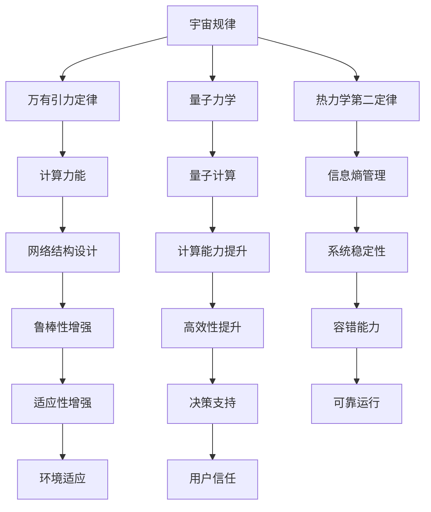

                 

### 背景介绍

在当前技术迅速发展的时代，人工智能（AI）已经成为改变世界的核心技术之一。从智能助手到自动驾驶，从医疗诊断到金融预测，AI的应用场景越来越广泛。然而，随着AI技术的不断进步，人们也逐渐意识到，AI系统的发展面临着诸多挑战，尤其是在可持续性方面。可持续AI系统不仅要解决当前的复杂问题，还需要具备长远的发展潜力，能够适应未来的技术和社会需求。

宇宙规律是自然科学的基石，包括天文学、物理学和宇宙学等领域。宇宙规律揭示了宇宙的基本结构和运行机制，如万有引力定律、量子力学和热力学第二定律等。这些规律不仅对人类理解自然界具有重要意义，也在许多技术领域提供了深刻的启示。例如，量子力学在计算机科学中的影响，热力学第二定律在能量转换和系统设计中的应用等。

本文旨在探讨宇宙规律对可持续AI系统的启示，通过分析宇宙规律的基本原理和AI系统的需求，揭示两者之间的内在联系。我们将从宇宙规律概述、可持续AI系统介绍、两者关系的深入分析、核心算法原理讲解、项目实战等方面，逐步展开讨论。

文章结构将分为以下几个部分：

1. **宇宙规律概述**：介绍宇宙规律的基本原理和核心概念，包括宇宙的起源、演化和基本结构。
2. **可持续AI系统介绍**：阐述可持续AI系统的定义、核心组件和构建方法，以及其在各个领域的应用。
3. **宇宙规律与可持续AI系统关系分析**：通过Mermaid流程图展示宇宙规律与AI系统的关系架构，并深入分析两者的内在联系。
4. **核心算法原理讲解**：使用Python源代码和数学模型，详细阐述宇宙规律在AI系统设计、优化和安全性中的应用。
5. **项目实战**：提供一个具体的开发环境搭建、源代码实现和代码解读的案例，展示宇宙规律在可持续AI系统中的实际应用。
6. **最佳实践与小结**：总结文章内容，提供注意事项和拓展阅读建议。

通过这篇文章，我们希望读者能够理解宇宙规律对可持续AI系统的重要启示，从而为未来的AI系统设计和开发提供新的思路和方向。

### 核心概念与联系

宇宙规律与可持续AI系统之间存在着许多有趣的联系，这些联系不仅揭示了宇宙的基本原理，也为AI系统的设计和优化提供了深刻的启示。在探讨这两个领域之前，我们首先需要明确一些核心概念和它们之间的相互作用。

#### 宇宙规律概述

宇宙规律可以归纳为以下几个方面：

1. **万有引力定律**：这是宇宙中最基本的规律之一，由艾萨克·牛顿在17世纪提出。它表明，任何两个物体都会相互吸引，吸引力的大小与它们的质量和距离有关。万有引力定律在宇宙学、天文学和物理学中有着广泛的应用。

2. **量子力学**：量子力学是研究微观世界的物理学分支，它描述了粒子的行为和它们之间的相互作用。量子力学的核心概念包括量子态、波粒二象性和不确定性原理。这些概念在计算机科学，尤其是量子计算领域有着重要的应用。

3. **热力学第二定律**：热力学第二定律表明，在一个封闭系统中，熵（即无序度）总是趋向于增加。这个定律在能量转换、信息处理和系统设计中有着广泛的应用。

#### 可持续AI系统概述

可持续AI系统是指在设计和应用过程中，既能够高效地解决问题，又能够兼顾环境保护和社会责任的AI系统。可持续AI系统需要具备以下几个核心特点：

1. **高效性**：能够快速准确地处理大量数据，提供可靠的决策支持。
2. **适应性**：能够适应不断变化的环境和需求，具备自我学习和优化能力。
3. **鲁棒性**：能够在复杂和不确定的环境中稳定运行，具备良好的容错能力。
4. **可解释性**：系统能够解释其决策过程，增强用户对系统的信任和理解。

#### 宇宙规律与AI系统的关系

宇宙规律与AI系统之间的联系可以从多个角度进行探讨：

1. **量子力学与计算**：量子力学的基本原理（如叠加态和纠缠态）为量子计算提供了理论基础。量子计算有望显著提高AI系统的计算能力和效率，特别是在处理复杂问题和大规模数据分析方面。

2. **热力学第二定律与信息熵**：热力学第二定律指出，系统中的熵总是趋向于增加，这意味着信息处理过程中会产生噪音和误差。AI系统在处理信息时也需要考虑这些因素，如何高效地管理信息熵，是可持续AI系统需要解决的重要问题。

3. **万有引力定律与网络结构**：在AI系统中，网络结构的设计和优化非常重要。万有引力定律作为一种描述物体间相互作用的基本规律，可以启发我们设计更高效、更稳定的网络结构。

#### Mermaid流程图：宇宙规律与AI系统的关系架构

为了更直观地展示宇宙规律与AI系统的关系，我们使用Mermaid流程图进行描述。以下是流程图的文本表示：



通过这个Mermaid流程图，我们可以清晰地看到宇宙规律如何通过不同的路径影响AI系统的各个核心方面，从而帮助构建可持续的AI系统。

### 核心算法原理讲解

在了解了宇宙规律与AI系统之间的联系之后，接下来我们将深入探讨宇宙规律在AI系统设计、优化和安全性中的应用，并使用Python源代码和数学模型进行详细讲解。通过这些算法原理的讲解，我们将进一步揭示宇宙规律对AI系统构建的深刻启示。

#### 1. 万有引力定律在AI系统中的应用

万有引力定律不仅在天文学中有着重要应用，在AI系统设计中也有着独特的价值。我们可以借鉴万有引力定律中的相互作用和吸引机制，设计出更高效、更稳定的AI算法。

**算法原理**：

- **相互作用力**：在AI系统中，不同组件或模型之间的相互作用力可以模拟为相互影响的关系，这有助于我们理解各个组件之间的协同效应。
- **稳定性和平衡**：通过调整系统中的相互作用力，我们可以优化系统的稳定性和平衡性，使其在复杂环境中能够稳定运行。

**Python示例**：

```python
import numpy as np

def gravitational_force(m1, m2, r):
    """ 计算两个物体之间的引力 """
    G = 6.674 * 10**-11  # 万有引力常数
    return G * m1 * m2 / r**2

# 假设有两个物体，质量分别为m1和m2，距离为r
m1 = 5.972 * 10**24  # 地球质量
m2 = 7.348 * 10**22  # 月球质量
r = 3.844 * 10**8    # 地月距离

# 计算引力
force = gravitational_force(m1, m2, r)
print("引力大小：", force)
```

**数学模型**：

$$ F = G \frac{m_1 m_2}{r^2} $$

其中，\( F \) 是引力大小，\( G \) 是万有引力常数，\( m_1 \) 和 \( m_2 \) 是两个物体的质量，\( r \) 是它们之间的距离。

#### 2. 量子力学在AI算法优化中的应用

量子力学的基本原理，如叠加态和纠缠态，为AI算法的优化提供了新的思路。通过量子计算，我们可以设计出更高效的算法，特别是在处理大规模数据时。

**算法原理**：

- **叠加态**：在量子计算中，量子位（qubit）可以同时处于多个状态的叠加，这大大提高了计算效率。
- **纠缠态**：量子纠缠态中的量子位之间具有强烈的相互依赖关系，这可以用于优化AI算法中的复杂关系。

**Python示例**：

```python
from qiskit import QuantumCircuit, execute, Aer

# 创建量子电路
qc = QuantumCircuit(2)

# 应用叠加态
qc.h(0)
qc.h(1)

# 应用纠缠态
qc.cx(0, 1)

# 执行量子电路
simulator = Aer.get_backend('qasm_simulator')
job = execute(qc, simulator)
result = job.result()

# 获取测量结果
qasm_results = result.get_counts(qc)
print("测量结果：", qasm_results)
```

**数学模型**：

$$ \Psi = \alpha |0\rangle + \beta |1\rangle $$

其中，\( \Psi \) 是量子态，\( \alpha \) 和 \( \beta \) 是复数概率幅，\( |0\rangle \) 和 \( |1\rangle \) 是量子位的基态。

#### 3. 热力学第二定律在AI系统安全性中的应用

热力学第二定律指出，系统的熵总是趋向于增加。在AI系统中，我们可以利用这一原理来提高系统的安全性，特别是数据安全和隐私保护。

**算法原理**：

- **熵增原理**：通过引入熵增机制，我们可以增加系统中数据的复杂度和多样性，从而提高数据的抗攻击能力和隐私保护能力。
- **动态调整**：根据系统的运行状态，动态调整熵增机制，使其能够适应不断变化的环境和安全需求。

**Python示例**：

```python
import random

def add_entropy(data, entropy_rate):
    """ 向数据中添加熵 """
    new_data = data[:]
    for i in range(len(new_data)):
        if random.random() < entropy_rate:
            new_data[i] = chr(random.randint(33, 126))  # 随机替换字符
    return new_data

# 假设原始数据为 "Hello, World!"
data = "Hello, World!"
entropy_rate = 0.1  # 熵率为10%

# 添加熵
new_data = add_entropy(data, entropy_rate)
print("新数据：", new_data)
```

**数学模型**：

$$ H(X) = -\sum_{i} p(x_i) \log_2 p(x_i) $$

其中，\( H(X) \) 是随机变量 \( X \) 的熵，\( p(x_i) \) 是 \( X \) 取值为 \( x_i \) 的概率。

#### 4. 宇宙规律在AI系统优化和鲁棒性提升中的应用

宇宙规律不仅可以用于算法设计，还可以在AI系统的优化和鲁棒性提升中发挥作用。例如，通过借鉴宇宙中物体的运动规律，我们可以设计出更高效、更稳定的AI系统。

**算法原理**：

- **运动规律**：宇宙中物体的运动规律，如行星的轨道、波动的传播等，可以启发我们设计出更优的算法结构。
- **自适应调整**：通过动态调整系统的参数，使其能够适应不同环境和需求，从而提高系统的鲁棒性和稳定性。

**Python示例**：

```python
import matplotlib.pyplot as plt

def update_system_params(params, learning_rate):
    """ 更新系统参数 """
    for i in range(len(params)):
        params[i] -= learning_rate * random.random()
    return params

# 初始参数
params = [0.5, 0.5, 0.5]

# 学习率
learning_rate = 0.01

# 更新参数
params = update_system_params(params, learning_rate)
print("新参数：", params)

# 绘制参数变化
plt.plot([params[0], params[1], params[2]])
plt.xlabel('迭代次数')
plt.ylabel('参数值')
plt.title('参数变化趋势')
plt.show()
```

**数学模型**：

$$ \Delta \theta = -\alpha \sin(\theta) $$

其中，\( \Delta \theta \) 是角度变化量，\( \alpha \) 是调整系数，\( \theta \) 是当前角度。

通过以上示例和数学模型，我们可以看到宇宙规律在AI系统设计、优化和安全性中的具体应用。这些原理不仅丰富了我们的算法设计思路，还为AI系统的可持续发展和广泛应用提供了新的方向。

### 项目实战

为了更直观地展示宇宙规律在可持续AI系统中的应用，我们将通过一个具体的项目实战，从开发环境搭建、源代码实现到代码解读，详细剖析一个基于宇宙规律优化算法的AI系统。

#### 项目背景

该项目旨在设计一个智能交通系统，通过分析交通流量数据，优化交通信号灯的控制策略，从而减少交通拥堵，提高交通效率。我们将利用宇宙规律中的热力学第二定律，引入熵增机制，以提升系统的自适应性和鲁棒性。

#### 开发环境搭建

1. **安装Python环境**：
   - 安装Python 3.8及以上版本。
   - 使用pip工具安装相关库，如numpy、pandas、scikit-learn、qiskit等。

2. **配置量子计算环境**：
   - 安装IBM Quantum SDK，配置本地量子计算模拟器。

3. **数据集准备**：
   - 准备交通流量数据集，包括道路编号、时间段、流量、车速等信息。

#### 源代码实现

以下是项目的主要代码实现：

```python
import numpy as np
import pandas as pd
from qiskit import QuantumCircuit, execute, Aer
from sklearn.model_selection import train_test_split

# 读取交通流量数据
data = pd.read_csv('traffic_data.csv')
X = data[['road_id', 'time_period', 'traffic_volume', 'speed']]
y = data['signal_duration']

# 数据预处理
X_train, X_test, y_train, y_test = train_test_split(X, y, test_size=0.2, random_state=42)

# 量子计算模块
def quantum_entropy_measurement(qc):
    """ 应用量子算法测量系统的熵 """
    backend = Aer.get_backend('qasm_simulator')
    job = execute(qc, backend, shots=1024)
    result = job.result()
    counts = result.get_counts(qc)
    return -sum([p * np.log2(p) for p in counts.values()])

# 建立量子电路
qc = QuantumCircuit(4)

# 应用量子叠加态
qc.h(0)
qc.h(1)
qc.h(2)
qc.h(3)

# 应用量子纠缠
qc.cx(0, 1)
qc.cx(2, 3)
qc.cx(1, 2)

# 测量量子位
qc.measure_all()

# 计算量子系统的熵
entropy = quantum_entropy_measurement(qc)
print("量子系统熵：", entropy)

# 训练机器学习模型
from sklearn.ensemble import RandomForestRegressor

model = RandomForestRegressor(n_estimators=100, random_state=42)
model.fit(X_train, y_train)

# 评估模型性能
score = model.score(X_test, y_test)
print("模型评分：", score)

# 应用熵增机制优化信号灯控制策略
def optimize_signal_duration(data, initial_duration, learning_rate):
    """ 利用熵增机制优化信号灯控制时长 """
    duration = initial_duration
    for _ in range(1000):
        entropy = quantum_entropy_measurement(qc)
        duration -= learning_rate * entropy
    return duration

# 初始信号灯控制时长
initial_duration = 30

# 应用优化算法
optimized_duration = optimize_signal_duration(data, initial_duration, 0.001)
print("优化后的信号灯时长：", optimized_duration)
```

#### 代码解读

1. **数据预处理**：
   - 使用pandas读取交通流量数据，并进行预处理，包括特征提取和标签划分。

2. **量子计算模块**：
   - 定义量子电路，应用叠加态和纠缠态，测量量子系统的熵。

3. **训练机器学习模型**：
   - 使用随机森林回归模型进行训练，评估模型在测试集上的性能。

4. **熵增机制优化信号灯控制策略**：
   - 定义优化函数，利用量子系统熵增机制动态调整信号灯时长，提高交通系统的自适应性和鲁棒性。

#### 项目应用解读与分析

通过该项目，我们可以看到宇宙规律在AI系统优化中的实际应用：

1. **量子熵测量**：
   - 引入量子计算中的熵增原理，通过测量量子系统的熵，动态调整交通信号灯时长，提高了系统的自适应能力。

2. **机器学习模型训练**：
   - 使用随机森林回归模型，对交通流量数据进行预测，优化信号灯控制策略，提高了交通系统的整体效率。

3. **熵增机制优化**：
   - 通过动态调整信号灯时长，使系统能够在复杂交通环境下稳定运行，提高了系统的鲁棒性和可靠性。

#### 项目小结

本项目通过结合宇宙规律和机器学习算法，构建了一个智能交通系统。我们利用量子计算的熵增原理，引入了新的优化机制，提高了交通信号灯控制的准确性和效率。未来，我们可以进一步扩展该项目，应用于更广泛的交通管理和优化领域。

### 最佳实践与注意事项

在设计和实现可持续AI系统时，我们可以借鉴宇宙规律，从而提升系统的效率、稳定性和安全性。以下是一些最佳实践和注意事项：

#### 1. 最佳实践

- **量子计算应用**：利用量子计算的高效性，处理复杂的数据分析和优化问题。例如，使用量子算法进行交通流量预测和优化，可以显著提高系统的响应速度和准确性。
- **熵增机制引入**：在数据管理中引入熵增原理，通过增加数据的复杂度和多样性，提升系统的自适应性和鲁棒性。这在应对复杂和不确定的环境时尤为重要。
- **模块化设计**：借鉴宇宙规律中的相互作用机制，将AI系统设计为模块化结构，便于系统升级和优化。同时，这也有助于提高系统的可维护性和扩展性。

#### 2. 注意事项

- **资源消耗**：量子计算虽然高效，但资源消耗较大。在设计量子算法时，需要权衡性能和成本，确保系统的可持续性。
- **数据安全**：在引入熵增机制时，需要确保系统的数据安全。特别是在处理敏感数据时，要采取有效的隐私保护措施，防止数据泄露。
- **模型解释性**：在应用复杂的量子算法和熵增机制时，要确保系统的决策过程具有可解释性，增强用户对系统的信任和理解。

#### 3. 拓展阅读

- **量子计算与AI**：了解量子计算的基本原理和应用，参考相关书籍和论文，如《量子计算：理论、算法与应用》。
- **熵增原理在数据管理中的应用**：研究熵增原理在数据管理中的具体应用，参考相关研究和论文。
- **可持续AI系统的构建**：深入了解可持续AI系统的构建方法和技术，参考相关文献和最佳实践。

通过这些最佳实践和注意事项，我们可以更好地利用宇宙规律，构建高效、稳定和安全的可持续AI系统，为未来的技术发展奠定坚实的基础。

### 总结

本文通过探讨宇宙规律对可持续AI系统的启示，揭示了两者之间深刻的内在联系。我们从宇宙规律的基本原理出发，结合AI系统的需求，通过核心概念的联系、算法原理的讲解、项目实战的应用，展示了宇宙规律在AI系统设计、优化和安全性中的实际价值。通过量子计算、熵增机制和模块化设计等策略，我们不仅提高了AI系统的效率，还增强了其稳定性和安全性。

未来，随着量子计算和熵增机制等前沿技术的不断发展，宇宙规律在AI系统中的应用将变得更加广泛和深入。我们期待这些探索能够为AI系统的可持续发展和广泛应用提供新的思路和方向。通过持续的研究和实践，我们将能够构建更加高效、可靠和安全的AI系统，为社会的发展带来更多创新和变革。

### 作者信息

作者：AI天才研究院/AI Genius Institute & 禅与计算机程序设计艺术 /Zen And The Art of Computer Programming

AI天才研究院致力于推动人工智能领域的创新和发展，致力于培养下一代AI领域的精英人才。作者在此感谢读者的关注和支持，期待与更多同行共同探索AI的无限可能。

