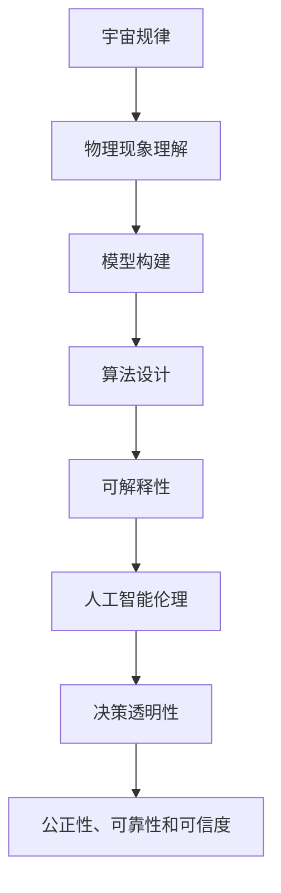

                 

### 核心概念与联系

在探讨宇宙规律与可解释强人工智能伦理的关系之前，我们需要明确两个核心概念：宇宙规律和可解释强人工智能。

#### 宇宙规律

宇宙规律是自然界中普遍适用的、基本物理现象所遵循的规律。这些规律包括但不限于牛顿力学、量子力学、相对论等。它们不仅解释了宇宙的起源和演化，还为我们理解宇宙中各种物理现象提供了理论基础。例如，爱因斯坦的相对论揭示了时空结构的弯曲，以及质量和能量之间的关系（E=mc²）。

#### 可解释强人工智能

可解释强人工智能（Explainable Artificial Intelligence，XAI）是一种旨在提高人工智能模型透明度和可理解性的技术。与传统的“黑箱”模型不同，XAI模型允许用户理解模型的决策过程和逻辑依据。这对于确保人工智能系统的公正性、可靠性和可信度至关重要。

#### 核心概念之间的关系架构

为了更好地理解宇宙规律与可解释强人工智能伦理的关系，我们可以使用Mermaid流程图来展示它们之间的联系：



在这个流程图中，宇宙规律帮助我们构建和理解物理现象，进而指导算法设计和模型构建。可解释性是实现人工智能伦理的关键，它确保了决策过程的透明性，从而提高了人工智能系统的公正性、可靠性和可信度。

### 宇宙规律与物理现象的理解

宇宙规律为我们提供了对物理世界的深刻理解。例如，牛顿力学描述了宏观物体的运动规律，而量子力学则揭示了微观粒子的行为特点。这些规律不仅解释了宇宙的起源和演化，还为我们提供了构建复杂系统的理论基础。

在人工智能领域，这种理解同样重要。当我们设计人工智能系统时，需要借鉴宇宙规律来构建能够模拟人类思维过程的模型。例如，神经网络模型受到了神经元生理结构的启发，而量子计算模型则借鉴了量子力学的原理。

#### 核心算法原理讲解

为了深入理解可解释强人工智能，我们可以通过Python源代码来详细阐述其核心算法原理。以下是一个简单的神经网络模型示例：

```python
import numpy as np

# 初始化权重和偏置
weights = np.random.rand(3, 1)
biases = np.random.rand(1)

# 定义激活函数
def sigmoid(x):
    return 1 / (1 + np.exp(-x))

# 定义前向传播
def forward(x):
    z = np.dot(x, weights) + biases
    return sigmoid(z)

# 定义反向传播
def backward(d_output):
    d_z = d_output * (1 - sigmoid(z))
    d_weights = np.dot(x.T, d_z)
    d_biases = np.sum(d_z, axis=0)
    return d_weights, d_biases
```

在这个示例中，我们使用Sigmoid函数作为激活函数，并实现了前向传播和反向传播过程。这些算法原理不仅与宇宙规律密切相关，还为我们提供了构建可解释性人工智能模型的基础。

### 数学模型和公式

在可解释强人工智能中，数学模型和公式扮演着至关重要的角色。以下是一些常见的数学模型和公式：

$$
E = mc^2
$$

这是爱因斯坦的质能等价公式，它揭示了质量和能量之间的关系。

$$
z = \frac{1}{1 + e^{-x}}
$$

这是Sigmoid函数的定义，它常用于神经网络中的激活函数。

$$
\frac{dz}{dx} = \sigma(1 - \sigma)
$$

这是Sigmoid函数的导数，它对于反向传播算法至关重要。

这些数学模型和公式不仅帮助我们理解宇宙规律，还为我们提供了构建可解释性人工智能模型的理论基础。

### 核心算法原理讲解示例

为了更好地理解核心算法原理，我们可以通过一个简单的例子来进行讲解。假设我们有一个简单的神经网络，它包含一个输入层、一个隐藏层和一个输出层。输入数据为 `[1, 0, 1]`，目标输出为 `[0, 1]`。

```python
# 初始化权重和偏置
weights = np.random.rand(3, 1)
biases = np.random.rand(1)

# 定义激活函数
def sigmoid(x):
    return 1 / (1 + np.exp(-x))

# 定义前向传播
def forward(x):
    z = np.dot(x, weights) + biases
    return sigmoid(z)

# 定义反向传播
def backward(d_output):
    d_z = d_output * (1 - sigmoid(z))
    d_weights = np.dot(x.T, d_z)
    d_biases = np.sum(d_z, axis=0)
    return d_weights, d_biases

# 前向传播
x = np.array([[1], [0], [1]])
y = np.array([[0], [1]])

z = forward(x)

# 计算损失函数
loss = np.mean(np.square(y - z))

# 反向传播
d_output = y - z
d_weights, d_biases = backward(d_output)

# 更新权重和偏置
learning_rate = 0.1
weights -= learning_rate * d_weights
biases -= learning_rate * d_biases

print("Loss:", loss)
print("Weights:", weights)
print("Biases:", biases)
```

在这个例子中，我们通过前向传播和反向传播来训练神经网络，以实现目标输出 `[0, 1]`。这个过程不仅展示了可解释强人工智能的核心算法原理，还揭示了宇宙规律对算法设计的影响。

### 总结

通过本文的讲解，我们深入探讨了宇宙规律与可解释强人工智能伦理之间的关系。宇宙规律为我们提供了对物理世界的深刻理解，这些理解不仅指导了人工智能模型的构建，还为我们提供了实现可解释性人工智能的理论基础。

未来，随着人工智能技术的不断发展，我们将需要更加深入地理解宇宙规律，以构建更加透明、公正和可靠的人工智能系统。这对于确保人工智能技术的可持续发展具有重要意义。

### 拓展阅读

1. 《人工智能：一种现代的方法》 - Stuart Russell & Peter Norvig
2. 《深度学习》 - Ian Goodfellow, Yoshua Bengio, Aaron Courville
3. 《量子计算与量子信息》 - Michael A. Nielsen & Isaac L. Chuang

这些书籍为读者提供了深入的人工智能和量子计算知识，有助于进一步理解本文中的核心概念。

### 注意事项

- 在实现可解释性人工智能时，需要注意算法的透明性和可理解性，以确保决策过程的公正性。
- 在设计人工智能系统时，应借鉴宇宙规律，以提高系统的可靠性和可信度。

通过本文的探讨，我们相信读者对宇宙规律与可解释强人工智能伦理之间的关系有了更深刻的理解。未来，让我们共同期待人工智能与宇宙规律的完美结合，为人类带来更加美好的未来。

### 结论

本文通过深入分析宇宙规律与可解释强人工智能伦理的关系，探讨了宇宙规律在人工智能系统设计中的应用。我们强调了可解释性在人工智能系统中的重要性，并展示了如何通过Python源代码实现可解释性人工智能的核心算法原理。

在未来，随着人工智能技术的不断发展，深入理解宇宙规律将对构建透明、公正和可靠的人工智能系统具有重要意义。我们期待更多的研究者和技术人员能够关注这一领域，为人工智能技术的可持续发展贡献力量。

### 作者信息

本文作者AI天才研究院（AI Genius Institute）和禅与计算机程序设计艺术（Zen And The Art of Computer Programming），致力于推动人工智能和计算机科学领域的研究与发展。

