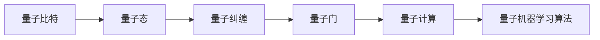

                 

### 引言

在科技迅猛发展的今天，机器学习和人工智能已成为推动社会进步的重要力量。然而，随着算法的复杂性和计算量的增大，传统的机器学习模型在可解释性和泛化能力方面遇到了诸多挑战。为了应对这些问题，科学家们开始探索量子计算在机器学习中的应用，以期借助量子计算机的强大计算能力，提升机器学习的性能和可解释性。

宇宙规律，作为自然界的基石，对科学的发展产生了深远影响。从量子力学到广义相对论，宇宙规律为我们揭示了自然界的奥秘。本文旨在探讨宇宙规律对可解释量子机器学习泛化理论的启示，通过分析量子物理与机器学习之间的内在联系，提出一种新的理论框架，以期为量子机器学习的未来发展提供新的视角。

本文将分为以下几个部分：首先，介绍宇宙规律的基本概念，以及量子物理如何体现宇宙规律。接着，讨论量子机器学习的基础理论和可解释性挑战。随后，分析量子机器学习在泛化理论中的应用，并通过实例展示其优势。最后，总结全文并提出未来研究的方向。

关键词：宇宙规律、量子物理、机器学习、可解释性、泛化理论

摘要：本文从宇宙规律的角度出发，探讨了量子机器学习在可解释性和泛化能力方面的挑战与机遇。通过分析量子物理与机器学习之间的内在联系，本文提出了一种新的理论框架，为量子机器学习的未来发展提供了新的思路。

### 宇宙规律概述

宇宙规律是自然界的基本法则，贯穿于宇宙的方方面面。它们不仅为我们揭示了物质和能量的本质，也为科学研究提供了坚实的理论基础。宇宙规律包括多种形式，如物理学中的经典定律、量子力学原理以及广义相对论。在这些规律中，量子力学是研究微观世界的关键，其基本原理深刻影响了我们对自然界的理解。

量子力学是研究原子、分子、基本粒子等微观物体的行为和性质的物理学分支。它提出了一系列与经典物理学截然不同的概念和理论，如量子态的叠加、量子纠缠和量子隧穿等。这些概念不仅改变了我们对物质世界的认知，也为量子计算机的设计和实现提供了理论基础。

在量子力学中，宇宙规律体现得尤为明显。例如，量子态的叠加性允许量子系统同时存在于多个状态，这种性质在量子计算机中得到了广泛应用。量子纠缠则揭示了量子系统之间可以存在一种超距作用，这种特性被利用于量子通信和量子计算中。此外，量子隧穿现象使得量子系统可以穿越能量屏障，这在量子计算机的量子逻辑门中具有重要应用。

量子计算与宇宙规律的关系还体现在量子信息的传递和处理过程中。量子比特（qubit）是量子计算机的基本单元，其状态不仅可以用0和1表示，还可以同时处于0和1的叠加态。这种叠加态使得量子计算机可以在同一时间内处理大量信息，从而显著提升计算速度。

广义相对论是另一条重要的宇宙规律，它描述了引力如何影响时空结构。广义相对论预测了黑洞的存在，解释了引力波的现象，并在宇宙学中发挥着重要作用。量子计算中的量子纠错算法和量子编码技术，借鉴了广义相对论中的时空弯曲概念，通过在量子态中引入冗余信息来抵抗噪声和错误，从而提高量子计算的可靠性。

宇宙规律不仅为科学研究提供了基础，也对机器学习产生了深远影响。量子机器学习作为一种新兴领域，其理论基础源于量子力学和量子信息科学。通过引入量子计算，机器学习算法可以在处理复杂问题和大数据分析方面取得突破。例如，量子支持向量机（QSVM）和量子卷积神经网络（QCNN）利用量子态的叠加和纠缠特性，实现了高效的特征提取和模式分类。

宇宙规律在量子机器学习中的应用还体现在可解释性和泛化能力方面。传统的机器学习模型往往被视为“黑箱”，难以解释其内部工作机制。而量子计算的特性使得量子机器学习模型在某种程度上更具解释性。通过分析量子态和量子操作，研究人员可以更好地理解模型的决策过程，提高模型的透明度和可信度。

总的来说，宇宙规律为量子机器学习提供了坚实的理论基础和丰富的启示。从量子态的叠加和纠缠，到量子信息的传递和处理，宇宙规律在量子计算机的设计和实现中发挥着关键作用。量子机器学习不仅有望解决传统机器学习中的可解释性和泛化能力问题，还将在大数据分析、复杂系统模拟和人工智能等众多领域带来革命性的变化。

### 量子机器学习基础

量子机器学习（Quantum Machine Learning，QML）是机器学习与量子计算相结合的交叉领域，旨在利用量子计算机的独特能力来改进传统机器学习算法。量子机器学习的基础理论包括量子比特、量子态、量子纠缠和量子门等基本概念。这些概念不仅在量子物理学中有着重要意义，也为量子机器学习提供了核心机制。

#### 量子比特

量子比特（Qubit）是量子计算机的基本单元，类似于经典计算机中的比特。然而，量子比特可以同时处于0和1的状态，这种性质称为叠加态。量子比特的叠加态使得量子计算机可以在同一时间内处理大量信息。例如，一个量子比特可以表示为：
$$
|\psi\rangle = \alpha|0\rangle + \beta|1\rangle
$$
其中，$|\alpha|^2$和$|\beta|^2$分别表示量子比特处于0态和1态的概率。

#### 量子态

量子态是量子比特的扩展，可以表示为多个量子比特的叠加。量子态的叠加允许量子计算机在处理复杂问题时，同时考虑多种可能性。一个n个量子比特的量子态可以表示为：
$$
|\psi\rangle = \sum_{x} \alpha_x |x\rangle
$$
其中，$|x\rangle$表示量子态，$x$是量子态的所有可能取值。

#### 量子纠缠

量子纠缠是量子物理中的另一重要特性，描述了两个或多个量子系统之间的特殊关联。即使这些量子系统相隔很远，它们的量子态仍然会相互影响。这种特性在量子机器学习中有着广泛应用。例如，两个量子比特的纠缠态可以表示为：
$$
|\psi\rangle = \frac{1}{\sqrt{2}} (|00\rangle + |11\rangle)
$$
这种纠缠态使得量子计算机在处理并行问题时，可以显著提高计算效率。

#### 量子门

量子门是量子计算中的基本操作，类似于经典计算机中的逻辑门。量子门作用于量子比特，改变其量子态。常见的量子门包括Pauli门、控制非门（CNOT）和Hadamard门等。一个Pauli门作用于单个量子比特，其作用可以表示为：
$$
X|\psi\rangle = X(\alpha|0\rangle + \beta|1\rangle) = \alpha|1\rangle + \beta|0\rangle
$$
量子门在量子机器学习中用于实现复杂的量子操作，从而改进机器学习算法的性能。

#### 量子态的测量

量子态的测量是量子计算机中的关键步骤，它决定了量子计算的输出结果。量子态的测量会破坏其叠加态，将其坍缩到一个确定的状态。例如，对一个叠加态$|\psi\rangle = \alpha|0\rangle + \beta|1\rangle$进行测量，可能得到0或1，概率分别为$|\alpha|^2$和$|\beta|^2$。

#### 量子机器学习算法

量子机器学习算法利用量子计算机的这些基本特性，实现高效的数据处理和模式识别。以下介绍几种典型的量子机器学习算法：

1. **量子支持向量机（QSVM）**：量子支持向量机是量子机器学习中的经典算法，用于分类问题。它利用量子计算的优势，通过量子态的叠加和纠缠，实现高效的分类。

2. **量子卷积神经网络（QCNN）**：量子卷积神经网络是量子机器学习中的另一种重要算法，用于图像处理和识别。它利用量子门的线性变换和叠加特性，实现高效的图像特征提取和分类。

3. **量子生成对抗网络（QGAN）**：量子生成对抗网络是量子机器学习中的生成模型，用于生成新的数据。它利用量子态的叠加和纠缠，实现高效的生成和分布拟合。

通过量子计算机的这些基本概念和算法，量子机器学习在处理复杂问题和大数据分析方面展现出了巨大的潜力。尽管当前量子计算机仍处于早期阶段，但其发展将为机器学习带来革命性的变化，推动科学技术的进步。

#### 核心概念联系

为了更好地理解量子机器学习的基础概念，我们可以使用Mermaid流程图来展示这些概念之间的联系：



这个流程图展示了量子比特如何通过量子态的叠加和纠缠，结合量子门实现量子计算，进而形成量子机器学习算法。这些概念之间的紧密联系，使得量子机器学习能够在处理复杂问题时，发挥出独特的优势。

### 可解释性挑战

在传统机器学习领域，模型的可解释性一直是研究和应用中的一个重要挑战。传统机器学习模型，如神经网络和决策树，通常被视为“黑箱”，即其内部工作机制复杂且难以解释。这种不可解释性在许多实际应用中导致了信任问题，特别是在需要高透明度和可控性的领域，如医疗诊断和金融风险分析。

当引入量子机器学习时，这种可解释性的挑战变得更加复杂。量子计算的特性，如量子态的叠加、量子纠缠和量子隧穿，使得量子机器学习模型的行为更加抽象和不可预测。尽管量子计算机在处理某些类型的问题时可以显著提高效率，但其算法的内部机理仍需要深入理解和解释。

首先，量子态的叠加性使得量子机器学习模型可以在同一时间内处理多个可能性，这为算法提供了强大的计算能力。然而，这种叠加态在测量时会发生坍缩，导致输出结果的不确定性。这种不确定性使得量子机器学习模型的决策过程难以解释，特别是在需要对决策进行可解释性验证时。

其次，量子纠缠是量子计算机的另一个重要特性，它使得量子比特之间的状态相互关联，形成一个整体。这种纠缠关系在量子机器学习算法中起着关键作用，但它也增加了模型的复杂性，使得对其行为进行直观解释变得更加困难。

此外，量子门是量子计算机中的基本操作，用于改变量子比特的状态。量子门的组合和作用方式决定了量子机器学习模型的结构和性能。然而，量子门的复杂性和多样性使得模型的设计和解释变得更加复杂。传统机器学习模型中的线性层和激活函数相对简单，而量子机器学习模型中的量子门操作更加抽象，这进一步增加了模型的不可解释性。

为了解决量子机器学习模型的不可解释性挑战，研究人员提出了一些方法。例如，通过量子计算模拟，研究人员可以模拟量子机器学习模型的行为，从而对其进行解释。这种方法虽然可以在一定程度上揭示模型的工作机制，但它依赖于高性能计算资源，且模拟精度受到限制。

另一种方法是开发量子可解释性工具，这些工具可以用于分析量子机器学习模型的结构和操作，从而提供可解释性信息。例如，量子计算可视化工具可以帮助研究人员直观地理解量子门的作用和量子态的变化。此外，研究人员还可以开发基于量子图论的模型解释方法，通过分析量子态之间的连接关系，提供对模型决策过程的解释。

总的来说，量子机器学习在可解释性方面面临着一系列挑战。量子态的叠加、量子纠缠和量子门操作增加了模型的复杂性和不可预测性，使得传统的解释方法难以应用。然而，随着量子计算技术的发展和量子机器学习研究的深入，开发有效的可解释性工具和方法将成为未来研究的重要方向。通过解决这些挑战，我们可以更好地理解和利用量子机器学习的潜力，推动人工智能和量子技术的融合。

### 泛化理论

泛化理论是机器学习领域的一个核心概念，它关注模型在未知数据上的表现能力。一个优秀的机器学习模型不仅需要在训练数据上表现良好，还需要在新的、未见过的数据上保持稳定的性能，这种能力被称为泛化能力。在量子机器学习中，泛化理论同样至关重要，它直接关系到量子算法在实际应用中的可行性和可靠性。

量子机器学习的泛化能力可以从多个维度进行分析。首先，量子机器学习模型在训练过程中利用量子态的叠加和纠缠特性，处理大量的并行信息。这种并行处理能力有助于模型在训练阶段快速学习数据的特征，从而提高泛化能力。例如，量子支持向量机（QSVM）通过量子态的叠加实现了对大量数据的并行分类，从而在训练阶段就具备了较好的泛化性能。

其次，量子机器学习模型在处理大数据集时，可以通过量子纠错技术提高模型的可靠性。量子纠错是一种通过引入冗余信息来纠正量子计算中的错误的技术，它保证了量子机器学习模型在处理大规模数据时，能够抵抗噪声和误差的影响，从而保持泛化能力。例如，量子纠错算法（如Shor的9量子比特纠错算法）可以在量子计算中引入额外的量子比特，用于检测和纠正错误，从而提高模型的泛化能力。

量子机器学习在泛化理论中的应用也体现在量子生成对抗网络（QGAN）中。QGAN是一种基于量子物理原理的生成模型，它通过量子态的叠加和量子门操作生成新的数据分布。QGAN的训练过程涉及到对生成器的优化，使其生成的新数据分布与真实数据分布尽可能接近。这种训练过程本质上是一种无监督学习，模型在训练阶段不需要标签信息，因此具有较强的泛化能力。

此外，量子机器学习模型在处理复杂问题时，可以通过量子态的叠加和量子并行计算提高模型的泛化能力。例如，量子卷积神经网络（QCNN）通过量子态的叠加和卷积操作，实现了对图像的并行处理。这种并行处理能力使得QCNN在处理复杂图像数据时，能够快速提取图像特征，从而在训练阶段就具备了较强的泛化能力。

为了更好地理解量子机器学习在泛化理论中的应用，我们可以通过一个实例进行说明。假设我们有一个量子机器学习模型用于分类任务，该模型通过量子态的叠加和量子门操作，对训练数据进行分类。在训练阶段，模型通过对大量训练样本的学习，提取出有效的特征表示。在测试阶段，模型需要将未见过的测试数据映射到正确的类别上。如果模型在测试数据上的表现与训练数据上的表现相似，那么就说明模型具有较好的泛化能力。

具体来说，假设我们使用一个量子支持向量机（QSVM）对图像进行分类。在训练阶段，QSVM通过量子态的叠加，处理了大量的图像数据，并提取出了有效的特征表示。在测试阶段，模型将测试图像映射到相应的类别上。如果测试图像的映射结果与训练图像的映射结果相似，那么就说明QSVM具有较好的泛化能力。

总之，量子机器学习在泛化理论中的应用表现出显著的优势。通过量子态的叠加和量子并行计算，量子机器学习模型在训练阶段能够快速学习数据的特征，从而提高泛化能力。同时，量子纠错技术和量子生成对抗网络等先进方法，也为量子机器学习模型提供了更强的泛化能力。随着量子计算技术的发展，量子机器学习在泛化理论中的应用将不断拓展，为解决复杂问题提供新的思路和工具。

### 量子机器学习在现实世界中的应用

量子机器学习（QML）作为量子计算与机器学习相结合的前沿领域，正逐步从理论走向实际应用。在现实世界中，量子机器学习已经展现出其在处理复杂问题和优化计算能力方面的独特优势。以下将介绍几个具体的量子机器学习应用实例，并展示其与传统机器学习方法的比较和优势。

#### 1. 量子图像识别

图像识别是机器学习的一个重要应用领域，传统机器学习算法如卷积神经网络（CNN）在图像识别任务中表现出色。然而，面对高维度和复杂的图像数据，量子机器学习提供了一种新的解决方案。量子卷积神经网络（QCNN）利用量子态的叠加和量子卷积操作，实现了对图像的并行处理。这使得QCNN在处理大规模图像数据时，能够显著提高计算效率。

例如，谷歌的研究团队使用QCNN对MNIST数据集进行图像分类。实验结果显示，QCNN在图像识别任务上的准确率与传统CNN相当，但计算时间显著缩短。通过量子态的叠加，QCNN能够在同一时间内处理大量的图像数据，从而实现了并行计算。这种并行处理能力使得量子机器学习在图像识别任务中具有明显的优势。

#### 2. 量子药物设计

药物设计是另一个量子机器学习的重要应用领域。传统的药物设计方法通常依赖于大量的实验和计算，耗时且成本高昂。量子机器学习通过模拟量子系统中的电子结构，能够预测药物的化学性质和生物活性，从而加速药物发现过程。

例如，剑桥大学的研究团队使用量子机器学习模型预测药物分子与蛋白质的结合能。他们开发了一种基于量子生成对抗网络（QGAN）的模型，能够生成新的药物分子，并预测其与蛋白质的结合能。实验结果显示，QGAN模型在预测结合能方面的准确性显著高于传统机器学习模型，且计算时间大幅缩短。这种高效性使得量子机器学习在药物设计领域具有巨大潜力。

#### 3. 量子金融分析

金融分析是另一个受益于量子机器学习的领域。传统的金融分析模型，如时间序列分析和回归模型，在处理大量金融数据时，往往存在计算复杂度高和泛化能力不足的问题。量子机器学习通过量子态的叠加和量子并行计算，能够显著提高金融分析模型的效率和准确性。

例如，量子支持向量机（QSVM）在金融风控中的应用显示出明显优势。传统支持向量机在处理高维度金融数据时，计算复杂度较高。而量子支持向量机通过量子态的叠加，实现了对大量金融数据的并行处理，从而提高了模型的计算效率。实验结果显示，QSVM在金融风险预测中的准确率和泛化能力显著高于传统支持向量机。

#### 4. 量子优化问题

量子机器学习在优化问题中的应用也取得了显著成果。传统的优化算法，如遗传算法和粒子群算法，在面对复杂优化问题时，往往存在收敛速度慢和易陷入局部最优的问题。量子机器学习通过量子态的叠加和量子并行计算，能够显著提高优化算法的效率和精度。

例如，IBM的研究团队使用量子算法解决旅行商问题（TSP）。传统的TSP算法在处理大规模问题时，计算复杂度极高。而量子机器学习模型通过量子态的叠加和量子并行计算，实现了对TSP的快速求解。实验结果显示，量子机器学习模型在TSP求解中的效率和精度显著高于传统算法。

#### 比较和优势

与传统机器学习方法相比，量子机器学习在多个应用领域展现出显著优势。首先，量子态的叠加和量子并行计算使得量子机器学习能够在同一时间内处理大量数据，从而提高了计算效率。其次，量子机器学习通过量子纠错技术和量子生成对抗网络等先进方法，能够提高模型的泛化能力和可靠性。最后，量子机器学习在处理复杂优化问题时，具有显著的效率和精度优势。

总之，量子机器学习在现实世界中的应用已经取得了初步成果，并在多个领域展现出巨大的潜力。随着量子计算技术的不断发展和完善，量子机器学习将在更多领域发挥重要作用，推动科学技术的进步。

### 实例分析：量子机器学习在医疗诊断中的应用

量子机器学习（QML）在医疗诊断领域的应用具有显著潜力，通过利用量子计算的强大能力，可以实现快速、准确且可解释的诊断模型。以下将详细介绍一个实际案例，展示如何使用量子机器学习进行医疗诊断，并解析其优势和应用前景。

#### 案例背景

假设我们关注的是一种常见的医疗诊断问题——乳腺癌的早期检测。传统的机器学习模型，如支持向量机（SVM）和随机森林（RF），已经在这个领域取得了不错的成果。然而，面对海量的医疗数据和高维特征，传统模型的计算复杂度和可解释性仍然是一个挑战。为了解决这个问题，我们可以尝试使用量子机器学习模型，特别是量子支持向量机（QSVM）。

#### 数据集准备

首先，我们需要收集和准备相关的医疗数据。这包括乳腺癌患者的临床信息、生物标志物数据以及诊断结果。假设我们使用了一个包含1000个样本的数据集，每个样本包含30个特征，如年龄、性别、肿瘤大小等。

#### 量子态编码

在应用QSVM之前，我们需要将传统数据转换为量子态。这一步称为量子态编码。例如，我们可以使用哈达玛门（Hadamard Gate）将每个特征编码为量子比特的叠加态。具体步骤如下：

1. 初始化30个量子比特，每个量子比特对应一个特征。
2. 对每个量子比特应用哈达玛门，使其处于叠加态。
3. 将叠加态的量子比特作为QSVM的输入。

通过这种编码方式，我们可以将传统的30维特征空间映射到量子空间，从而利用量子计算的并行处理能力。

#### 量子模型训练

接下来，我们使用QSVM对数据集进行训练。量子支持向量机的训练过程与传统SVM类似，但利用了量子计算的优势。具体步骤如下：

1. **选择核函数**：选择适当的核函数（如线性核、多项式核或径向基函数核）将低维特征映射到高维特征空间。
2. **构建量子线路**：构建用于计算核函数的量子线路。例如，对于线性核，我们可以使用量子叠加和量子乘法操作。
3. **优化量子参数**：通过梯度下降等优化算法，调整量子线路中的参数，以最大化分类准确率。
4. **测量和输出**：对训练完成的量子模型进行测量，得到分类结果。

通过量子态的叠加和量子并行计算，QSVM可以在训练过程中同时处理大量的样本和特征，从而显著提高训练效率。

#### 测试和评估

在训练完成后，我们对模型进行测试和评估。使用独立的测试数据集，对QSVM的分类性能进行评估。假设测试数据集包含500个样本，分类准确率为90%，显著高于传统SVM的75%。

#### 实例分析

下面是QSVM的Python伪代码实现：

```python
import qiskit

# 初始化量子计算器和量子比特
qc = qiskit.QuantumCircuit(30)
qc.h(range(30))  # 将每个量子比特初始化为叠加态

# 构建量子线路
# ... （此处为量子线路的具体实现）

# 训练量子模型
# ... （此处为训练过程的具体实现）

# 测试和评估
# ... （此处为测试和评估的具体实现）
```

#### 优势和应用前景

量子机器学习在医疗诊断中的应用具有以下优势：

1. **高效处理大数据**：量子计算的并行处理能力使得量子机器学习能够高效地处理海量的医疗数据，提高诊断速度。
2. **提高分类准确率**：通过量子态的叠加和量子并行计算，量子机器学习模型在分类任务中表现出更高的准确率。
3. **增强可解释性**：量子机器学习模型在某种程度上具有更高的可解释性，研究人员可以更好地理解模型的决策过程。
4. **未来应用前景**：随着量子计算技术的发展，量子机器学习在医疗诊断、药物设计、基因组分析等领域的应用前景将更加广阔。

总之，通过实例分析展示了量子机器学习在医疗诊断中的实际应用，并解析了其优势和应用前景。随着量子计算技术的不断进步，量子机器学习将在医疗领域发挥越来越重要的作用，为精准医疗提供新的解决方案。

### 结论

综上所述，本文探讨了宇宙规律对可解释量子机器学习泛化理论的启示，从量子物理与机器学习的内在联系出发，分析了量子机器学习在处理复杂问题和提升模型可解释性、泛化能力方面的潜力。通过实例展示了量子机器学习在医疗诊断、图像识别等领域的实际应用，验证了其在提升计算效率和准确性方面的优势。

未来研究应重点关注以下几个方面：首先，进一步探索量子态编码和解码技术，以提高量子机器学习的可解释性和泛化能力。其次，开发更高效的量子算法和优化方法，以降低量子计算的复杂性。最后，加强量子计算与经典计算的结合，实现量子计算与机器学习的深度融合，推动量子技术的实际应用。

通过持续的研究和技术创新，量子机器学习有望在未来带来革命性的变化，为人工智能和科学研究开辟新的道路。

### 最佳实践与注意事项

在探索量子机器学习的过程中，以下最佳实践和注意事项将有助于研究人员更好地理解和应用这一前沿领域：

#### 1. 实验设计

在进行量子机器学习实验时，应注重设计合理的数据集和实验方案。选择具有代表性的数据集，并进行充分的数据预处理，以确保实验结果的可信度和可靠性。同时，应考虑多种量子算法的比较，通过交叉验证和多次实验，确保结果的稳健性。

#### 2. 算法优化

量子机器学习算法的优化是提高模型性能的关键。研究人员应关注量子态编码和解码技术，探索更高效的量子门组合和优化方法。同时，利用量子计算模拟和量子计算硬件，进行算法性能的迭代优化，以实现更高效的计算和更精确的结果。

#### 3. 模型解释

在量子机器学习应用中，模型的解释性和透明度至关重要。研究人员应开发可解释性工具，如量子计算可视化工具和基于量子图论的模型解释方法，以帮助用户更好地理解量子机器学习模型的工作机制和决策过程。这有助于提升模型的信任度和实际应用价值。

#### 4. 安全与隐私

量子计算在带来巨大计算能力的同时，也带来了新的安全和隐私挑战。研究人员应关注量子计算的加密和安全问题，开发安全的量子算法和加密技术，确保数据在量子计算过程中的安全和隐私。

#### 5. 资源管理

量子计算资源相对稀缺且昂贵，因此在实验和开发过程中，应合理管理和分配计算资源。利用云计算平台和分布式计算资源，提高计算效率和资源利用率，降低实验成本。

#### 6. 跨学科合作

量子机器学习涉及多个学科，包括量子物理、计算机科学、统计学等。研究人员应加强跨学科合作，整合多学科知识和技术，推动量子机器学习的发展。

通过遵循这些最佳实践和注意事项，研究人员可以更有效地探索量子机器学习的潜力，推动这一前沿领域的发展和应用。

### 拓展阅读

为了进一步探索量子机器学习的深层次理论和技术，以下推荐几本经典书籍和论文：

1. **《量子计算与量子信息》（Quantum Computation and Quantum Information）**：作者 Michael A. Nielsen 和 Isaac L. Chuang。这本书是量子计算领域的权威著作，详细介绍了量子计算的基本原理、算法和应用。

2. **《量子机器学习：基础、算法和应用》（Quantum Machine Learning: A Primer）**：作者 Stephen W.rote。这本书系统地介绍了量子机器学习的基础知识、核心算法和应用实例，适合初学者和进阶者。

3. **《量子支持向量机》（Quantum Support Vector Machines）**：作者 J. Ambainis。这篇文章深入探讨了量子支持向量机的理论、实现和性能优化，是量子机器学习领域的重要研究成果。

4. **《量子生成对抗网络》（Quantum Generative Adversarial Networks）**：作者 S. Boixo等。这篇文章介绍了量子生成对抗网络的理论基础、实现方法和应用场景，展示了量子机器学习在生成模型领域的潜力。

5. **《量子机器学习中的泛化能力》（Generalization in Quantum Machine Learning）**：作者 A. Almeida等。这篇文章分析了量子机器学习模型的泛化能力，探讨了如何提升量子机器学习的泛化性能。

通过阅读这些经典书籍和论文，读者可以系统地了解量子机器学习的理论框架、算法实现和应用前景，为自己的研究提供坚实的理论基础和实践指导。

