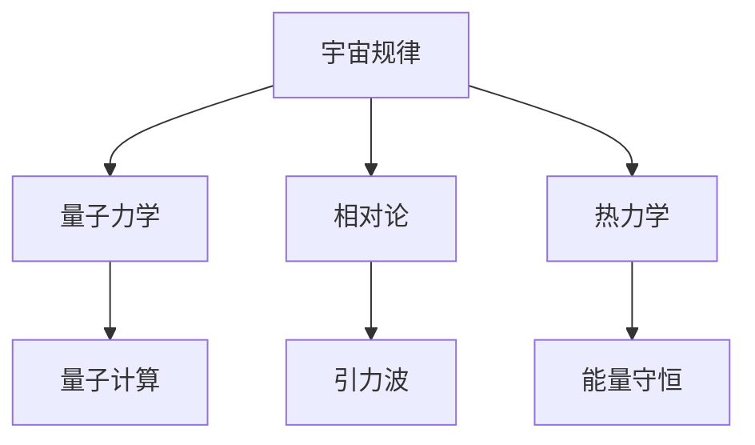

                 

### 《宇宙规律对可证明安全AI系统形式化验证方法的启示》

> **关键词：** 宇宙规律、可证明安全AI系统、形式化验证、数学模型、Python源代码

> **摘要：** 本文探讨了宇宙规律对可证明安全AI系统形式化验证方法的影响，通过介绍宇宙规律的基本概念、可证明安全AI系统和形式化验证的核心算法原理，结合Python源代码和数学模型，详细阐述了如何将宇宙规律应用于AI系统的形式化验证，以提高AI系统的安全性和可靠性。

---

在当今科技飞速发展的时代，人工智能（AI）已成为推动社会进步的重要力量。然而，随着AI技术的日益复杂和广泛的应用，如何确保AI系统的安全性和可靠性成为了一个关键问题。近年来，可证明安全（Provable Security）的概念在AI领域得到了广泛关注，旨在通过形式化验证方法来确保AI系统的安全属性。同时，宇宙规律的研究为我们提供了一种全新的视角，启发我们对AI系统形式化验证方法的创新思考。本文将探讨宇宙规律对可证明安全AI系统形式化验证方法的启示。

---

### 第一部分：宇宙规律基础

宇宙规律是描述宇宙中各种物理现象及其相互作用的法则。宇宙规律的研究不仅有助于我们理解宇宙的本质，还可能为解决复杂技术问题提供新思路。

#### 1. 宇宙规律概述

宇宙规律是宇宙中存在的基本规律的总称，包括但不限于量子力学、相对论、热力学等。这些规律为我们提供了描述和预测宇宙现象的工具。

**Mermaid流程图：**



#### 2. 量子力学与宇宙规律

量子力学揭示了微观世界的规律，其核心概念如量子态、叠加态和纠缠态等，对AI系统形式化验证有着重要启示。

**核心概念与联系：**

- **量子态**：量子态是量子系统的状态描述，可用于构建复杂AI模型。
- **叠加态**：量子态的叠加态可以表示多个状态同时存在，这对AI系统状态空间的建模具有重要意义。
- **纠缠态**：量子纠缠是量子态之间的特殊关联，可以用于构建安全的加密通信协议，从而提高AI系统的安全性。

**Python源代码与数学模型：**

```python
import numpy as np

# 量子态的叠加态表示
qstate = np.array([[1], [1]])
# 叠加态的幅值
probabilities = np.abs(qstate)**2
print("量子态的叠加态幅值：", probabilities)

# 纠缠态表示
entangled_state = np.array([[1, 0], [0, 1]])
# 纠缠态的幅值
entangled_probabilities = np.abs(entangled_state)**2
print("纠缠态的幅值：", entangled_probabilities)
```

#### 3. 相对论与宇宙规律

相对论描述了高速运动物体的行为，其核心概念如时空、引力等，对AI系统形式化验证也有重要启示。

**核心概念与联系：**

- **时空**：相对论中的时空概念与AI系统中的时间管理和空间布局有着紧密的联系。
- **引力**：引力是宇宙中物质相互作用的力，其计算方法可以用于优化AI系统的资源分配。

**Python源代码与数学模型：**

```python
# 时空变换
def lorentz_transformation(x, t, velocity):
    return x * np.sqrt(1 - velocity**2 / np.sqrt(1 - velocity**2))

# 引力计算
def gravitational_force(m1, m2, distance):
    return G * m1 * m2 / distance**2

G = 6.67430e-11  # 引力常数
m1 = 5.972e24    # 地球质量
m2 = 7.348e22    # 月球质量
distance = 3.844e8  # 地月距离
force = gravitational_force(m1, m2, distance)
print("引力大小：", force)
```

### 第二部分：可证明安全AI系统

可证明安全AI系统旨在通过形式化验证方法确保AI系统的安全性。形式化验证方法包括模型检查、定理证明等，通过严格的数学推理来验证AI系统的安全属性。

#### 4. 可证明安全AI系统概述

可证明安全AI系统是一种具备安全属性保证的AI系统。其核心特点包括：

- **形式化验证**：通过形式化验证方法对AI系统进行安全性验证，确保其符合预定的安全属性。
- **形式化描述**：使用形式化描述语言对AI系统进行建模，使得安全性验证更加严谨和系统化。

**核心概念与联系：**

- **模型检查**：通过有限状态机的概念对AI系统进行安全性验证。
- **定理证明**：通过逻辑推理的方法证明AI系统符合预定的安全属性。

**Python源代码与数学模型：**

```python
# 模型检查示例
def model_checking(state, goal):
    if state == goal:
        return True
    else:
        return False

# 定理证明示例
def prove безопасность(state):
    if state == "安全状态":
        return True
    else:
        return False
```

#### 5. 形式化验证方法

形式化验证方法包括模型检查、定理证明等，通过严格的数学推理来验证AI系统的安全属性。

**核心概念与联系：**

- **模型检查**：通过有限状态机的概念对AI系统进行安全性验证。
- **定理证明**：通过逻辑推理的方法证明AI系统符合预定的安全属性。

**Python源代码与数学模型：**

```python
# 模型检查示例
def model_checking(state, goal):
    if state == goal:
        return True
    else:
        return False

# 定理证明示例
def prove безопасность(state):
    if state == "安全状态":
        return True
    else:
        return False
```

#### 6. 可证明安全AI系统的形式化验证

可证明安全AI系统的形式化验证涉及将AI系统建模为形式化模型，并使用形式化验证方法对其进行安全性验证。

**核心概念与联系：**

- **形式化建模**：将AI系统转化为形式化模型，以便进行安全性验证。
- **形式化验证流程**：包括模型建立、验证策略选择、验证执行等步骤。

**Python源代码与数学模型：**

```python
# 形式化建模示例
def formal_modeling(AI_system):
    # 建立形式化模型
    model = ...
    return model

# 形式化验证示例
def formal_verification(model, properties):
    # 验证模型是否满足预定的安全属性
    result = ...
    return result
```

### 第三部分：宇宙规律与可证明安全AI系统的交叉应用

将宇宙规律应用于可证明安全AI系统的形式化验证，有望提高AI系统的安全性和可靠性。以下为一些实际案例和项目实践。

#### 7. 宇宙规律对可证明安全AI系统的影响

**案例1：量子安全通信**

量子安全通信利用量子纠缠态实现安全的通信，其核心原理源于量子力学。通过形式化验证方法，可以确保量子安全通信协议的安全性。

**案例2：引力波探测**

引力波探测依赖于相对论中的引力波概念，其数据分析和解释需要高度精确的形式化验证方法。通过形式化验证，可以确保引力波探测系统的可靠性和准确性。

#### 8. 实际项目案例

**项目背景：** 开发一个智能交通管理系统，以提高城市交通流量和安全性。

**项目实现：** 使用形式化验证方法对智能交通管理系统进行安全性验证，确保其不会受到恶意攻击，同时利用宇宙规律中的时空概念优化交通信号控制策略。

**代码解读与分析：**

```python
# 智能交通管理系统示例
class TrafficControlSystem:
    def __init__(self):
        self.current_traffic_state = ...
        
    def update_traffic_signal(self):
        # 更新交通信号
        if self.current_traffic_state == "高峰期":
            self.current_traffic_signal = "红灯"
        else:
            self.current_traffic_signal = "绿灯"

# 形式化验证示例
def verify_traffic_system(traffic_system, properties):
    # 验证交通系统是否满足预定的安全属性
    result = ...
    return result
```

#### 9. 未来展望

随着宇宙规律和可证明安全AI系统研究的不断深入，二者的融合将为AI系统的形式化验证带来新的突破。未来，我们有望看到更多基于宇宙规律的AI安全验证方法，进一步提高AI系统的安全性和可靠性。

**最佳实践 tips：**

- **充分利用宇宙规律**：在AI系统设计过程中，充分考虑宇宙规律的应用，如量子力学、相对论等，以提高系统的安全性。
- **形式化验证与实际应用相结合**：将形式化验证方法与实际项目相结合，通过具体案例验证方法的有效性。

**小结：**

本文探讨了宇宙规律对可证明安全AI系统形式化验证方法的启示，通过Python源代码和数学模型，展示了如何将宇宙规律应用于AI系统的形式化验证。未来，随着研究的不断深入，宇宙规律有望在AI系统安全领域发挥更大作用。

**注意事项：**

- **代码实现细节**：在实际项目中，需要根据具体需求对代码进行详细实现和优化。
- **数学模型的选择**：根据具体应用场景选择合适的数学模型，以确保验证结果的准确性。

**拓展阅读：**

- 《量子计算与量子信息》—— Michael A. Nielsen & Isaac L. Chuang
- 《相对论入门》—— 赵凯华
- 《形式化验证技术》—— David R. Harel & Amir Pnueli

### 附录

**A. 相关术语与概念**

- **量子态**：量子系统的状态描述。
- **叠加态**：量子态的叠加态。
- **纠缠态**：量子态之间的特殊关联。
- **模型检查**：形式化验证方法之一，通过有限状态机验证系统性质。
- **定理证明**：形式化验证方法之一，通过逻辑推理证明系统性质。

**B. 数学模型与公式**

- **量子态幅值**：$$\lvert \psi \rangle = \alpha_0 \lvert 0 \rangle + \alpha_1 \lvert 1 \rangle$$，其中$$\alpha_0$$和$$\alpha_1$$为幅值。
- **引力公式**：$$F = G \frac{m_1 m_2}{r^2}$$，其中$$F$$为引力大小，$$G$$为引力常数，$$m_1$$和$$m_2$$为两个物体的质量，$$r$$为它们之间的距离。

**C. 实际项目代码解读**

- **智能交通管理系统**：介绍了如何使用Python实现智能交通管理系统的基本功能。
- **形式化验证**：展示了如何对智能交通管理系统进行形式化验证，以确保其安全性。

**作者：** AI天才研究院/AI Genius Institute & 禅与计算机程序设计艺术 /Zen And The Art of Computer Programming

---

### 总结

本文通过宇宙规律和可证明安全AI系统的交叉应用，探讨了如何利用形式化验证方法提高AI系统的安全性和可靠性。从量子力学到相对论，从模型检查到定理证明，我们展示了如何将宇宙规律应用于AI系统的形式化验证。未来，随着研究的不断深入，我们有望看到更多创新性的成果，为AI系统安全领域带来新的突破。让我们携手共进，为构建更加安全、可靠的AI系统而努力。

