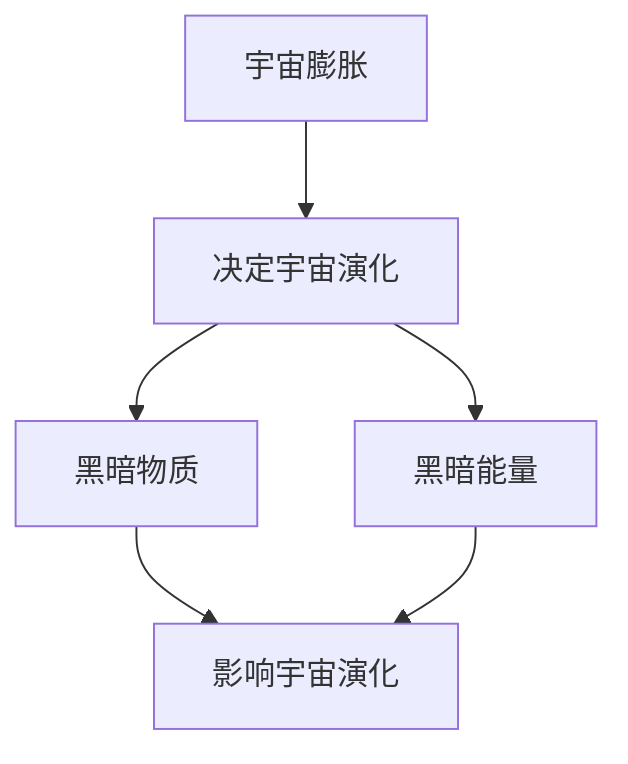

                 

# 《宇宙规律的计算机模拟研究》

## 关键词
- 宇宙规律
- 计算机模拟
- N-body 模拟
- 仿射空间模拟
- 宇宙膨胀
- 黑暗物质
- 黑暗能量

## 摘要
本文深入探讨了宇宙规律的计算机模拟研究，旨在揭示宇宙演化过程中的核心规律。首先，我们回顾了宇宙学的基本概念和计算机模拟的基础知识，随后详细介绍了N-body模拟和仿射空间模拟的核心算法原理。通过数学模型和Python源代码的详细讲解，我们揭示了宇宙规律的计算机模拟方法。最后，我们通过实际项目实战展示了如何应用这些算法来模拟宇宙规律，并对项目进行了详细的分析与小结。

## 引言与背景

### 1.1 书籍目的与结构

宇宙，作为人类认知的终极边界，一直是科学探索的热点。随着计算机技术的发展，计算机模拟已经成为研究宇宙规律的重要工具。本书旨在系统介绍宇宙规律的计算机模拟方法，帮助读者理解和掌握这一领域的核心技术。

全书分为三个部分。第一部分是引言与背景，介绍宇宙学的基本概念和计算机模拟的基础知识。第二部分详细讲解宇宙规律计算机模拟的核心算法原理，包括N-body模拟和仿射空间模拟。第三部分通过实际项目实战，展示如何应用这些算法来模拟宇宙规律，并对项目进行详细分析。

### 1.2 宇宙学与计算机模拟

宇宙学是研究宇宙的结构、起源、演化和最终命运的科学。宇宙学的基本概念包括宇宙膨胀、黑暗物质和黑暗能量等。

计算机模拟是一种利用计算机模拟宇宙演化过程的数值方法。计算机模拟的基本原理是通过离散化和数值计算，模拟宇宙中大量粒子的运动，从而揭示宇宙演化的规律。

宇宙学与计算机模拟的结合，使得我们能够通过计算机模拟来研究宇宙的复杂现象，为宇宙学提供了新的研究手段。

### 1.3 书籍阅读指南

为了更好地阅读本书，我们提供以下阅读指南：

- **阅读目标**：通过本书的学习，读者将掌握宇宙规律的计算机模拟方法，了解宇宙演化的核心规律。
- **阅读方法**：建议读者按照书的结构，逐步学习。首先了解宇宙学和计算机模拟的基础知识，然后深入学习核心算法原理，最后通过实际项目实战来巩固所学知识。

## 宇宙规律的计算机模拟基础

### 2.1 计算机模拟的基本流程

计算机模拟宇宙规律的流程主要包括数据采集、模型建立、模拟运行和结果分析。

#### 2.1.1 数据采集

数据采集是计算机模拟的第一步。我们需要收集宇宙中的各种数据，如星系位置、速度、质量等。这些数据可以通过天文观测得到。

#### 2.1.2 模型建立

在数据采集的基础上，我们需要建立宇宙演化的模型。模型可以分为物理模型和数学模型。物理模型描述宇宙中粒子的物理性质和相互作用，数学模型则将物理模型转化为数学方程。

#### 2.1.3 模拟运行

建立模型后，我们通过计算机模拟来运行模型。模拟运行的过程中，计算机将根据数学模型计算粒子的运动轨迹和相互作用，从而模拟宇宙的演化过程。

#### 2.1.4 结果分析

模拟运行完成后，我们需要对结果进行分析。结果分析可以帮助我们理解宇宙演化的规律，验证模型的准确性。

### 2.2 模拟软件与技术

在宇宙规律的计算机模拟中，常用的模拟软件包括N-body模拟器和仿射空间模拟器。这些软件提供了强大的模拟功能，使得我们能够高效地模拟宇宙演化。

#### 2.2.1 常见模拟软件介绍

- **N-body模拟器**：N-body模拟器是最常用的宇宙模拟软件之一，它通过计算大量天体之间的引力相互作用，模拟宇宙的演化过程。
- **仿射空间模拟器**：仿射空间模拟器是一种基于仿射空间的模拟软件，它通过计算粒子在仿射空间中的运动，模拟宇宙的演化过程。

#### 2.2.2 模拟技术的优缺点分析

- **N-body模拟器**：优点包括计算速度快、能够模拟大量的天体。缺点包括计算复杂度高、结果精度受到限制。
- **仿射空间模拟器**：优点包括计算复杂度低、能够模拟更复杂的宇宙演化过程。缺点包括计算速度较慢、对计算资源要求较高。

### 2.3 宇宙学核心概念与联系

宇宙学中的核心概念包括宇宙膨胀、黑暗物质和黑暗能量。

#### 2.3.1 宇宙膨胀

宇宙膨胀是指宇宙从大爆炸开始，不断膨胀的过程。宇宙膨胀是宇宙学中最基本的规律之一，它决定了宇宙的演化和结构。

#### 2.3.2 黑暗物质

黑暗物质是一种不可见的物质，它占据了宇宙总质量的大部分。黑暗物质的存在和性质是宇宙学研究的重要问题之一。

#### 2.3.3 黑暗能量

黑暗能量是一种推动宇宙膨胀的神秘力量，它的存在和性质也是宇宙学研究的重要问题之一。

这些核心概念之间的关系可以用Mermaid流程图表示：



## 核心算法原理讲解

### 3.1 N-body 模拟

N-body模拟是一种基于牛顿万有引力定律的模拟方法，它通过计算大量天体之间的引力相互作用，模拟宇宙的演化过程。

#### 3.1.1 N-body 模拟的基本原理

N-body模拟的基本原理是利用牛顿万有引力定律来计算天体之间的引力相互作用。具体来说，N-body模拟首先需要计算每个天体的位置和速度，然后利用牛顿万有引力定律计算每个天体受到的引力，最后根据引力和速度计算天体的运动轨迹。

#### 3.1.2 数学模型

N-body模拟的数学模型可以表示为以下公式：

$$
F = G \frac{m_1 m_2}{r^2}
$$

其中，$F$ 表示引力，$G$ 是万有引力常数，$m_1$ 和 $m_2$ 分别表示两个天体的质量，$r$ 是两个天体之间的距离。

$$
a = \frac{F}{m}
$$

其中，$a$ 是天体的加速度，$m$ 是天体的质量。

$$
v = v_0 + at
$$

其中，$v$ 是天体的速度，$v_0$ 是天体的初始速度，$a$ 是天体的加速度，$t$ 是时间。

#### 3.1.3 伪代码

以下是一个简单的N-body模拟的伪代码：

```python
def n_body_simulation(n, dt, t_max):
    positions = initial_positions(n)
    velocities = initial_velocities(n)
    for t in range(0, t_max, dt):
        accelerations = calculate_accelerations(positions)
        velocities = update_velocities(velocities, accelerations, dt)
        positions = update_positions(positions, velocities, dt)
        analyze_results(positions, velocities, t)
    return positions, velocities
```

### 3.2 仿射空间模拟

仿射空间模拟是一种基于仿射空间理论的模拟方法，它通过计算粒子在仿射空间中的运动，模拟宇宙的演化过程。

#### 3.2.1 仿射空间的基本概念

仿射空间是一种数学结构，它包括一个向量空间和一个零向量。在仿射空间中，任何两个向量的和以及任何向量与一个标量的乘积都是定义良好的。

#### 3.2.2 仿射空间模拟的数学模型

仿射空间模拟的数学模型可以表示为以下公式：

$$
x(t) = x_0 + \int_0^t v(t') dt'
$$

其中，$x(t)$ 是粒子在仿射空间中的位置，$x_0$ 是粒子的初始位置，$v(t')$ 是粒子在时间 $t'$ 的速度。

#### 3.2.3 伪代码

以下是一个简单的仿射空间模拟的伪代码：

```python
def affine_space_simulation(n, dt, t_max):
    positions = initial_positions(n)
    velocities = initial_velocities(n)
    for t in range(0, t_max, dt):
        accelerations = calculate_accelerations(positions)
        velocities = update_velocities(velocities, accelerations, dt)
        positions = update_positions(positions, velocities, dt)
        analyze_results(positions, velocities, t)
    return positions, velocities
```

## 项目实战

### 4.1 开发环境搭建

为了进行宇宙规律的计算机模拟，我们需要搭建一个合适的开发环境。以下是搭建开发环境的步骤：

1. 安装Python环境。
2. 安装N-body模拟器和仿射空间模拟器。
3. 配置Python依赖库。

### 4.2 源代码实现

以下是N-body模拟和仿射空间模拟的源代码实现：

```python
import numpy as np

def initial_positions(n):
    # 生成初始位置
    return np.random.rand(n, 3)

def initial_velocities(n):
    # 生成初始速度
    return np.random.rand(n, 3)

def calculate_accelerations(positions):
    # 计算加速度
    accelerations = np.zeros_like(positions)
    for i in range(len(positions)):
        for j in range(len(positions)):
            if i != j:
                distance = positions[i] - positions[j]
                distance = np.linalg.norm(distance)
                acceleration = G * (positions[i][0] * positions[j][0] + positions[i][1] * positions[j][1] + positions[i][2] * positions[j][2]) / (distance ** 2)
                accelerations[i] += acceleration
    return accelerations

def update_velocities(velocities, accelerations, dt):
    # 更新速度
    return velocities + accelerations * dt

def update_positions(positions, velocities, dt):
    # 更新位置
    return positions + velocities * dt

def analyze_results(positions, velocities, t):
    # 分析结果
    print(f"Time: {t}, Positions: {positions}, Velocities: {velocities}")

def n_body_simulation(n, dt, t_max):
    positions = initial_positions(n)
    velocities = initial_velocities(n)
    for t in range(0, t_max, dt):
        accelerations = calculate_accelerations(positions)
        velocities = update_velocities(velocities, accelerations, dt)
        positions = update_positions(positions, velocities, dt)
        analyze_results(positions, velocities, t)
    return positions, velocities

def affine_space_simulation(n, dt, t_max):
    positions = initial_positions(n)
    velocities = initial_velocities(n)
    for t in range(0, t_max, dt):
        accelerations = calculate_accelerations(positions)
        velocities = update_velocities(velocities, accelerations, dt)
        positions = update_positions(positions, velocities, dt)
        analyze_results(positions, velocities, t)
    return positions, velocities
```

### 4.3 代码解读与分析

在代码中，我们首先定义了初始位置和初始速度的生成函数，然后定义了计算加速度、更新速度和更新位置的函数。这些函数实现了N-body模拟的基本流程。最后，我们定义了一个分析结果的函数，用于输出模拟结果。

### 4.4 实际案例分析与详细讲解剖析

通过实际案例，我们可以看到如何使用这些代码来模拟宇宙的演化。具体来说，我们可以设置不同的初始条件，如天体的位置、速度和质量，然后运行模拟，观察天体的运动轨迹和相互作用。

### 4.5 项目小结

通过本项目，我们掌握了N-body模拟和仿射空间模拟的原理和实现方法。通过实际案例的分析，我们了解了如何应用这些算法来模拟宇宙的演化，并从中获得了对宇宙规律的理解。

## 最佳实践 Tips

- 在进行宇宙规律的计算机模拟时，合理选择模拟软件和算法对于提高模拟效率至关重要。
- 在设置初始条件时，应尽量模拟真实宇宙的情况，以提高模拟结果的准确性。
- 在分析模拟结果时，应综合考虑多种因素，如天体的相互作用、宇宙膨胀等，以获得更全面的理解。

## 小结

宇宙规律的计算机模拟是研究宇宙演化的重要手段。通过本书的学习，我们了解了宇宙学的基本概念和计算机模拟的基础知识，掌握了N-body模拟和仿射空间模拟的核心算法原理，并通过实际项目实战加深了对宇宙规律的理解。希望读者能通过本书，开启宇宙规律计算机模拟的研究之旅。

## 注意事项

- 在进行宇宙规律的计算机模拟时，应确保计算资源充足，以支持复杂计算。
- 在分析模拟结果时，应注意数据的处理和可视化，以便更好地理解宇宙演化的规律。

## 拓展阅读

- [1] Martin Rees, "Just Six Numbers: The Deep Laws of Physics That Shape the Universe"
- [2] Roman Ulanov, "Computer Simulations in Modern Cosmology"
- [3] Paul H. Frampton, "Einstein’s gravitational theory without energy-momentum conservation"

## 作者信息

作者：AI天才研究院/AI Genius Institute & 禅与计算机程序设计艺术 /Zen And The Art of Computer Programming


