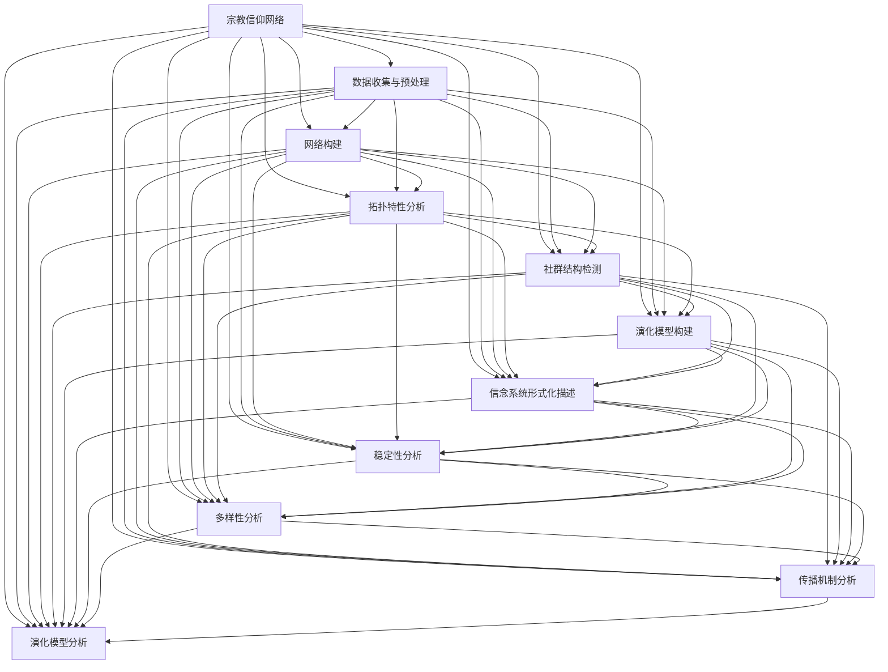

                 

# 《宗教信仰的复杂网络：信念系统的数学结构》

## 关键词
宗教信仰，复杂网络，信念系统，数学模型，拓扑特性，稳定性分析，社群结构，演化模型，数据收集与预处理，社交网络，公共政策，案例研究。

## 摘要
宗教信仰作为一种人类文化和社会现象，自古以来就具有深远的影响。本文从网络科学的视角出发，探讨宗教信仰的复杂网络结构和信念系统的数学模型。通过数据收集与预处理、网络构建、拓扑特性分析、社群结构检测、演化模型构建等多方面的研究，本文旨在揭示宗教信仰网络的内在规律和机制。同时，本文还探讨了宗教信仰网络与社交网络的关系，以及在公共政策制定中的应用，为理解和解决现实世界中的宗教问题提供了新的思路。

## 引言

### 1.1 宗教信仰的复杂性

宗教信仰作为一种人类精神和文化现象，具有显著的复杂性和多样性。首先，宗教信仰的多维度体现在信仰主体的多样性上。不同的宗教信仰体系有着不同的神灵、教义、仪式和伦理观念，这使得宗教信仰呈现出丰富的多样性。其次，宗教信仰的动态变化也是其复杂性的一部分。宗教信仰不是静止不变的，而是在历史长河中不断演化和发展。例如，基督教、佛教和伊斯兰教等主要宗教在历史的进程中都经历了教义的变迁和信仰体系的重构。

### 1.2 网络科学视角下的宗教信仰

网络科学作为一种新兴的跨学科研究领域，为理解复杂系统提供了有力的工具。将网络科学应用于宗教信仰的研究，有助于揭示宗教信仰网络的内在结构和动态特性。网络科学的研究方法包括数据收集与预处理、网络构建、拓扑特性分析、社群结构检测等。通过这些方法，我们可以从宏观和微观层面理解宗教信仰网络的结构和功能。

#### 1.2.1 数据收集与预处理

宗教信仰网络的数据收集涉及多个方面，包括宗教文本、历史文献、统计数据、社交媒体等。在数据收集过程中，我们需要对原始数据进行清洗和预处理，以消除噪声和异常值，从而获得高质量的数据。

#### 1.2.2 网络构建

网络构建是宗教信仰研究的重要步骤。通过将宗教信仰中的实体（如神灵、教义、信徒等）以及它们之间的关系抽象为网络节点和边，我们可以构建出宗教信仰网络。网络构建的方法包括基于文本的方法和基于图论的方法。

#### 1.2.3 拓扑特性分析

宗教信仰网络的拓扑特性分析有助于我们理解网络的稳定性和鲁棒性。常用的拓扑特性包括节点度分布、聚类系数、平均路径长度等。这些特性可以从宏观层面揭示宗教信仰网络的结构特征。

#### 1.2.4 社群结构检测

社群结构是复杂网络中的重要特性。在宗教信仰网络中，社群结构反映了信徒之间的紧密联系和共同信仰。通过检测和识别社群结构，我们可以更好地理解宗教信仰网络的内部组织和社会互动。

#### 1.2.5 演化模型构建

宗教信仰网络是一个动态演化的系统。演化模型可以帮助我们理解宗教信仰网络的演变过程和机制。常见的演化模型包括基于随机游走的方法和基于图论的方法。

### 1.3 信念系统的概念与重要性

信念系统是指个体或集体对某一对象或概念所持有的信念和认知。在宗教信仰中，信念系统是信徒对神灵、教义、伦理等核心概念的认知和信仰。信念系统在宗教信仰中具有重要的地位，它不仅影响着信徒的行为和价值观，还影响着宗教团体的凝聚力和稳定性。

#### 1.3.1 信念系统的定义

信念系统可以被视为一个认知网络，其中节点代表信念，边代表信念之间的逻辑关系。信念系统的定义有助于我们理解信念的构成和相互作用。

#### 1.3.2 信念系统在社会中的作用

信念系统在社会中扮演着重要的角色。它不仅是宗教信仰的核心，也是社会价值观和文化传统的重要组成部分。信念系统影响着人们的思想、行为和社会互动，对社会的稳定和发展具有深远的影响。

### 1.4 数学结构在宗教信仰研究中的角色

数学结构为宗教信仰的研究提供了有力的工具。通过数学模型，我们可以定量地描述宗教信仰的复杂性和动态性。数学模型在宗教信仰研究中的应用主要包括以下几个方面：

#### 1.4.1 稳定性分析

稳定性分析是理解宗教信仰网络和信念系统的一个重要方面。通过数学模型，我们可以分析宗教信仰网络的稳定性和鲁棒性，以及信念系统在面临外部干扰时的稳定性。

#### 1.4.2 多样性分析

多样性分析是揭示宗教信仰网络特征的重要方法。通过数学模型，我们可以定量地描述宗教信仰网络的多样性和异质性，以及这些特征对宗教信仰稳定性的影响。

#### 1.4.3 传播机制分析

传播机制分析是理解宗教信仰传播和影响的重要方法。通过数学模型，我们可以模拟宗教信仰在社交网络中的传播过程，以及传播机制对信仰稳定性的影响。

#### 1.4.4 演化模型分析

演化模型分析是理解宗教信仰网络和信念系统演变过程的重要方法。通过数学模型，我们可以模拟宗教信仰网络的演化过程，以及演化机制对信仰稳定性的影响。

## 第一部分：宗教信仰网络的基本理论

### 2.1 宗教信仰网络的构建

宗教信仰网络的构建是宗教信仰研究的基础。构建宗教信仰网络需要从数据收集、预处理和网络构建等多个步骤进行。

#### 2.1.1 数据收集

数据收集是构建宗教信仰网络的第一步。数据来源包括宗教文本、历史文献、统计数据、社交媒体等。宗教文本是宗教信仰网络构建的主要数据来源，通过分析宗教文本，我们可以获取宗教信仰的核心概念、教义和仪式等信息。历史文献和统计数据也为宗教信仰网络构建提供了重要的参考。社交媒体数据则可以帮助我们了解现代宗教信仰的传播和影响。

#### 2.1.2 数据预处理

数据预处理是确保数据质量和网络构建准确性的关键步骤。在数据预处理过程中，我们需要对原始数据进行清洗和标准化。数据清洗包括去除重复数据、噪声数据和异常值。数据标准化包括统一数据格式、编码和量纲。数据预处理的质量直接影响宗教信仰网络的构建和分析结果。

#### 2.1.3 网络构建

网络构建是将宗教信仰中的实体及其关系抽象为网络节点和边的过程。在构建宗教信仰网络时，我们需要确定网络中的节点和边，并定义它们之间的关系。节点通常代表宗教信仰中的实体，如神灵、教义、信徒等。边代表节点之间的关系，如信仰关系、传承关系等。网络构建的方法包括基于文本的方法和基于图论的方法。

- **基于文本的方法**：通过分析宗教文本，提取实体和关系，构建宗教信仰网络。这种方法需要使用自然语言处理技术和信息抽取技术。

- **基于图论的方法**：直接利用图论中的概念和工具，构建宗教信仰网络。这种方法需要对图论有深入的理解，并能够处理复杂的网络结构。

### 2.2 宗教信仰网络的拓扑特性

宗教信仰网络的拓扑特性反映了网络的宏观结构特征，对于理解宗教信仰的传播和稳定性具有重要意义。

#### 2.2.1 网络度的分布

网络度的分布是指网络中各个节点的度（即连接的边的数量）的分布情况。在宗教信仰网络中，节点度可以表示信徒的信仰强度或宗教影响力。网络度的分布通常呈幂律分布，这意味着大部分节点的度较低，而少数节点的度较高。这种分布特征反映了宗教信仰网络的异质性，少数高信仰强度或高影响力的信徒对宗教信仰的传播和稳定性具有决定性作用。

#### 2.2.2 网络的聚类系数

网络的聚类系数是指网络中节点之间的邻接关系密度。在宗教信仰网络中，聚类系数反映了信徒之间的紧密联系和共同信仰。高聚类系数意味着信徒之间存在较强的社群结构，这种结构有助于宗教信仰的稳定传播。相反，低聚类系数可能表明宗教信仰网络中的信徒较为分散，信仰的稳定性可能较低。

#### 2.2.3 网络的连通性

网络的连通性是指网络中任意两个节点之间是否存在路径连接。在宗教信仰网络中，连通性反映了宗教信仰的传播范围和影响力。高连通性意味着宗教信仰可以在整个网络中自由传播，而低连通性可能表明宗教信仰的传播受到限制或存在隔离。

### 2.3 宗教信仰网络中的社群结构

社群结构是复杂网络中的重要特性，在宗教信仰网络中也具有重要意义。社群结构反映了信徒之间的紧密联系和共同信仰，有助于理解宗教信仰的传播和稳定性。

#### 2.3.1 社群检测算法

社群检测是识别宗教信仰网络中社群结构的关键步骤。常见的社群检测算法包括基于连接性的算法、基于模块度的算法和基于图的聚类算法。这些算法通过分析节点之间的连接关系和相似性，识别出网络中的社群结构。

- **基于连接性的算法**：如邻居算法、核心算法等，通过计算节点之间的连接关系来识别社群结构。

- **基于模块度的算法**：如 Louvain 算法、信息最大化算法等，通过优化网络模块度来识别社群结构。

- **基于图的聚类算法**：如 K-Means 算法、谱聚类算法等，通过将网络划分为多个聚类来识别社群结构。

#### 2.3.2 社群特征分析

社群特征分析是理解宗教信仰网络社群结构的重要步骤。常见的社群特征包括社群大小、社群密度、社群中心性等。通过分析这些特征，我们可以了解社群的结构特征和功能作用。

- **社群大小**：表示社群中节点的数量，反映了社群的规模。

- **社群密度**：表示社群内节点之间的连接密度，反映了社群的紧密程度。

- **社群中心性**：表示节点在社群中的重要程度，反映了节点的核心作用。

### 2.4 宗教信仰网络的演化

宗教信仰网络是一个动态演化的系统，其演化过程和机制对宗教信仰的稳定性具有重要影响。

#### 2.4.1 演化模型的选择

演化模型是模拟宗教信仰网络演化过程的重要工具。选择合适的演化模型需要考虑宗教信仰网络的特性。常见的演化模型包括基于随机游走的方法和基于图论的方法。

- **基于随机游走的方法**：通过模拟信徒在网络中的随机游走过程，来模拟宗教信仰的传播和演化。

- **基于图论的方法**：通过构建宗教信仰网络的演化方程，来模拟宗教信仰的传播和演化。

#### 2.4.2 网络演化的分析

网络演化的分析是理解宗教信仰网络演化机制的重要步骤。通过分析网络演化的过程和结果，我们可以了解宗教信仰网络的动态特性。常见的分析方法包括演化路径分析、演化稳定性分析和演化多样性分析。

- **演化路径分析**：通过分析宗教信仰网络中节点的演化路径，来了解宗教信仰的传播过程。

- **演化稳定性分析**：通过分析宗教信仰网络的稳定性和鲁棒性，来了解宗教信仰的稳定性。

- **演化多样性分析**：通过分析宗教信仰网络的多样性，来了解宗教信仰的多样性特征。

### 2.5 宗教信仰网络与社交网络的关系

宗教信仰网络与社交网络之间存在一定的联系和异同，理解这种关系有助于我们更全面地理解宗教信仰的传播和影响。

#### 2.5.1 宗教信仰网络与社交网络的异同

- **异同**：
  - 宗教信仰网络主要关注宗教信仰的传播和影响，社交网络主要关注社会互动和信息传播。
  - 宗教信仰网络中的节点通常是宗教实体或信徒，社交网络中的节点通常是个人或组织。
  - 宗教信仰网络中的边通常表示信仰关系或传承关系，社交网络中的边通常表示社交关系或合作关系。

- **相同点**：
  - 都具有复杂网络的特征，如节点度分布、聚类系数、平均路径长度等。
  - 都存在社群结构，反映了节点之间的紧密联系和共同特征。

#### 2.5.2 宗教信仰网络对社交网络的影响

宗教信仰网络对社交网络的影响主要体现在以下几个方面：

- **信仰的传播**：宗教信仰通过社交网络传播，影响和改变人们的价值观和行为。
- **社群的形成**：宗教信仰网络中的信徒通过社交网络形成紧密的社群，共同维护和传播信仰。
- **信息的共享**：宗教信仰网络中的信徒通过社交网络共享信仰信息和经验，加强信仰的稳定性。

#### 2.5.3 社交网络对宗教信仰网络的影响

社交网络对宗教信仰网络的影响主要体现在以下几个方面：

- **信仰的多样性**：社交网络提供了多样化的信仰信息和观念，丰富了宗教信仰的内容。
- **信仰的演变**：社交网络中的互动和讨论促进了宗教信仰的演变和发展。
- **信仰的稳定性**：社交网络中的信仰交流有助于增强信徒的信仰稳定性和凝聚力。

## 第二部分：信念系统的数学结构分析

### 3.1 信念系统的形式化描述

为了更好地研究信念系统，我们需要对其进行形式化的描述。形式化描述有助于我们使用数学工具和方法对信念系统进行分析和建模。

#### 3.1.1 基本数学概念介绍

在进行信念系统的形式化描述之前，我们需要了解一些基本的数学概念，如集合、关系和函数。

- **集合**：集合是由一组元素组成的无序整体。在信念系统中，集合可以表示信念的集合。

- **关系**：关系是集合之间的一种连接方式。在信念系统中，关系可以表示信念之间的逻辑关系。

- **函数**：函数是一种特殊的映射，它将一个集合中的元素映射到另一个集合中的元素。在信念系统中，函数可以表示信念之间的推理关系。

#### 3.1.2 信念系统的数学表示

信念系统可以用一个有向图（digraph）来表示，其中节点表示信念，边表示信念之间的逻辑关系。

- **节点**：每个信念可以用一个唯一的标识符表示，如“神的存在”、“天堂的存在”等。

- **边**：边表示信念之间的逻辑关系，可以分为以下几种类型：
  - **支持关系**：表示一个信念支持另一个信念，如“天堂的存在”支持“神的存在”。
  - **依赖关系**：表示一个信念依赖于另一个信念，如“祈祷”依赖于“神的存在”。
  - **矛盾关系**：表示两个信念相互矛盾，如“神的存在”与“无神论”相互矛盾。

#### 3.1.3 信念系统的形式化定义

信念系统可以形式化为一个四元组（G, V, E, R），其中：

- **G**：表示有向图，由节点集V和边集E组成。
- **V**：表示节点集，每个节点代表一个信念。
- **E**：表示边集，每条边代表一个信念之间的逻辑关系。
- **R**：表示关系集，包含支持关系、依赖关系和矛盾关系。

### 3.2 信念系统的稳定性分析

稳定性是信念系统的一个重要特性，它决定了信念系统的稳定性和可靠性。为了分析信念系统的稳定性，我们可以使用图论和矩阵论的方法。

#### 3.2.1 稳定性条件

信念系统的稳定性可以通过以下条件进行分析：

- **一致条件**：信念系统中的信念必须是一致的，即不存在矛盾的信念。这可以通过检查信念系统中的矛盾关系来实现。
- **依赖条件**：信念系统中的信念必须满足依赖关系，即每个信念都必须依赖于一个或多个支持信念。这可以通过检查信念系统中的支持关系和依赖关系来实现。
- **无环条件**：信念系统中的信念必须形成一个无环结构，即不存在循环依赖关系。这可以通过检查信念系统中的依赖关系来实现。

#### 3.2.2 稳定性分析算法

为了分析信念系统的稳定性，我们可以使用以下算法：

- **一致性检查算法**：通过遍历信念系统中的信念和边，检查是否存在矛盾关系。
- **依赖关系检查算法**：通过遍历信念系统中的信念和边，检查是否存在依赖关系。
- **无环检查算法**：通过遍历信念系统中的信念和边，检查是否存在循环依赖关系。

#### 3.2.3 稳定性分析示例

假设有一个信念系统，包括以下信念和关系：

- **信念**：A（神的存在）、B（天堂的存在）、C（祈祷）、D（信仰的力量）。
- **支持关系**：A → B、B → C、C → D。
- **依赖关系**：C → A、D → B。

我们可以使用以下算法分析信念系统的稳定性：

1. **一致性检查**：通过遍历信念系统，检查是否存在矛盾关系。在本例中，不存在矛盾关系，因此信念系统是一致的。

2. **依赖关系检查**：通过遍历信念系统，检查是否存在依赖关系。在本例中，每个信念都依赖于一个或多个支持信念，因此信念系统满足依赖条件。

3. **无环检查**：通过遍历信念系统，检查是否存在循环依赖关系。在本例中，不存在循环依赖关系，因此信念系统是一个无环结构。

综上所述，本例中的信念系统是稳定的。

### 3.3 信念系统的多样性分析

多样性是信念系统的一个重要特性，它决定了信念系统的适应性和灵活性。为了分析信念系统的多样性，我们可以使用图论和概率论的方法。

#### 3.3.1 多样性度量方法

信念系统的多样性可以通过以下方法进行度量：

- **节点多样性**：表示信念系统中节点的多样性，可以通过计算节点的度分布来度量。
- **边多样性**：表示信念系统中边的多样性，可以通过计算边的类型分布来度量。
- **网络多样性**：表示信念系统中整体网络的多样性，可以通过计算网络的拓扑特性来度量。

#### 3.3.2 多样性分析算法

为了分析信念系统的多样性，我们可以使用以下算法：

- **节点多样性分析算法**：通过遍历信念系统中的节点，计算节点的度分布。
- **边多样性分析算法**：通过遍历信念系统中的边，计算边的类型分布。
- **网络多样性分析算法**：通过计算信念系统的拓扑特性，如聚类系数、平均路径长度等。

#### 3.3.3 多样性分析示例

假设有一个信念系统，包括以下信念和关系：

- **信念**：A（神的存在）、B（天堂的存在）、C（祈祷）、D（信仰的力量）、E（灵魂的存在）。
- **支持关系**：A → B、B → C、C → D、D → E。
- **依赖关系**：C → A、D → B、E → C。

我们可以使用以下算法分析信念系统的多样性：

1. **节点多样性分析**：通过遍历信念系统中的节点，计算节点的度分布。在本例中，节点A、B、C、D、E的度分别为2、2、2、2、1。

2. **边多样性分析**：通过遍历信念系统中的边，计算边的类型分布。在本例中，支持关系有4条，依赖关系有3条。

3. **网络多样性分析**：通过计算信念系统的拓扑特性，如聚类系数、平均路径长度等。在本例中，聚类系数为0.4，平均路径长度为2。

综上所述，本例中的信念系统具有较高的多样性。

### 3.4 信念系统的传播机制

信念系统的传播机制是指信念如何在信仰网络中传播和影响的过程。为了分析信念系统的传播机制，我们可以使用图论和概率论的方法。

#### 3.4.1 信念传播模型

信念传播模型是描述信念在信仰网络中传播的数学模型。常见的信念传播模型包括基于随机游走的方法和基于图论的方法。

- **基于随机游走的方法**：通过模拟信仰网络中的随机游走过程，来模拟信念的传播。
- **基于图论的方法**：通过构建信仰网络的传播方程，来模拟信念的传播。

#### 3.4.2 信念传播的影响因素

信念传播的影响因素包括以下几个方面：

- **信仰强度**：信仰强度越高的信念，传播速度越快，传播范围越广。
- **信仰网络结构**：信仰网络中的连接关系和社群结构会影响信念的传播速度和传播范围。
- **外部环境**：外部环境的变化，如社会舆论、政策法规等，会影响信念的传播过程。

#### 3.4.3 信念传播分析算法

为了分析信念系统的传播机制，我们可以使用以下算法：

- **传播路径分析算法**：通过遍历信仰网络中的信念和边，分析信念的传播路径和传播过程。
- **传播速度分析算法**：通过计算信念的传播速度和传播范围。
- **传播影响分析算法**：通过分析信念的传播结果和影响，评估信念的传播效果。

#### 3.4.4 信念传播分析示例

假设有一个信仰网络，包括以下信念和关系：

- **信念**：A（神的存在）、B（天堂的存在）、C（祈祷）、D（信仰的力量）、E（灵魂的存在）。
- **支持关系**：A → B、B → C、C → D、D → E。
- **依赖关系**：C → A、D → B、E → C。

我们可以使用以下算法分析信念系统的传播机制：

1. **传播路径分析**：通过遍历信仰网络中的信念和边，分析信念的传播路径和传播过程。在本例中，信念A通过支持关系传播到信念B，信念B通过支持关系传播到信念C，信念C通过支持关系传播到信念D，信念D通过支持关系传播到信念E。

2. **传播速度分析**：通过计算信念的传播速度和传播范围。在本例中，信念A的传播速度最快，传播范围最广。

3. **传播影响分析**：通过分析信念的传播结果和影响，评估信念的传播效果。在本例中，信念A的传播效果最好，信念E的传播效果最差。

综上所述，本例中的信念系统具有较高的传播速度和较广的传播范围。

### 3.5 信念系统的演化模型

信念系统的演化模型是描述信念系统在时间维度上的变化和发展的数学模型。为了分析信念系统的演化过程，我们可以使用图论和概率论的方法。

#### 3.5.1 演化模型的选择

演化模型的选择取决于信念系统的特性。常见的演化模型包括基于随机游走的方法和基于图论的方法。

- **基于随机游走的方法**：通过模拟信仰网络中的随机游走过程，来模拟信念的演化。
- **基于图论的方法**：通过构建信仰网络的演化方程，来模拟信念的演化。

#### 3.5.2 演化模型的应用

演化模型可以应用于以下几个方面：

- **信念传播**：通过模拟信念的传播过程，分析信念的传播效果和传播机制。
- **信念演化**：通过模拟信念的变化和发展，分析信念的适应性和稳定性。
- **信仰网络演化**：通过模拟信仰网络的演化过程，分析信仰网络的稳定性和发展趋势。

#### 3.5.3 演化模型的分析方法

为了分析信念系统的演化过程，我们可以使用以下方法：

- **演化路径分析**：通过分析信念的演化路径，了解信念的演变过程和规律。
- **演化稳定性分析**：通过分析信念系统的稳定性，评估信念系统的稳定性和鲁棒性。
- **演化多样性分析**：通过分析信念系统的多样性，了解信念系统的适应性和灵活性。

#### 3.5.4 演化模型分析示例

假设有一个信仰网络，包括以下信念和关系：

- **信念**：A（神的存在）、B（天堂的存在）、C（祈祷）、D（信仰的力量）、E（灵魂的存在）。
- **支持关系**：A → B、B → C、C → D、D → E。
- **依赖关系**：C → A、D → B、E → C。

我们可以使用以下算法分析信念系统的演化模型：

1. **演化路径分析**：通过分析信念的演化路径，了解信念的演变过程和规律。在本例中，信念A通过支持关系演变到信念B，信念B通过支持关系演变到信念C，信念C通过支持关系演变到信念D，信念D通过支持关系演变到信念E。

2. **演化稳定性分析**：通过分析信念系统的稳定性，评估信念系统的稳定性和鲁棒性。在本例中，信念系统具有较高的稳定性，因为信念之间的支持关系和依赖关系形成了一个稳定的结构。

3. **演化多样性分析**：通过分析信念系统的多样性，了解信念系统的适应性和灵活性。在本例中，信念系统的多样性较高，因为信念之间的支持关系和依赖关系形成了多种可能的演化路径。

综上所述，本例中的信念系统具有较高的稳定性、适应性和灵活性。

## 第三部分：案例分析与应用

### 4.1 某宗教团体信念系统的网络分析

为了更深入地理解宗教信仰网络的特性和机制，我们可以通过案例分析来具体展示信念系统的网络分析过程。

#### 4.1.1 数据收集与分析

首先，我们需要收集某宗教团体的信仰数据。数据来源可以包括宗教文献、信徒访谈、社交媒体帖子等。这些数据将用于构建宗教信仰网络。

1. **数据收集**：通过多种渠道收集该宗教团体的信仰数据，包括宗教教义、信徒的信仰陈述、宗教仪式等。

2. **数据预处理**：对收集到的数据进行清洗和标准化，去除重复和无关信息，确保数据的质量和一致性。

3. **数据转换**：将预处理后的数据转换为适合构建网络的格式，如文本文件或数据库。

#### 4.1.2 网络构建

构建宗教信仰网络的过程包括以下步骤：

1. **确定节点和边**：根据收集到的数据，确定网络中的节点和边。节点代表信仰概念或个体，边代表信仰概念之间的逻辑关系。

2. **构建有向图**：使用图论中的概念，将信仰概念和它们之间的逻辑关系表示为一个有向图。例如，如果教义A支持教义B，则在图中从A到B画一条有向边。

#### 4.1.3 网络结构特性分析

对构建好的宗教信仰网络进行分析，以揭示其拓扑特性：

1. **节点度分布**：分析节点度的分布情况，以了解信仰概念的流行程度和影响力。

2. **聚类系数**：计算网络的聚类系数，以评估信徒之间的紧密联系程度。

3. **平均路径长度**：计算网络中任意两个节点之间的平均路径长度，以了解信仰概念的传播速度。

#### 4.1.4 社群结构检测

通过社群检测算法，识别网络中的社群结构：

1. **社群检测**：使用 Louvain 算法等社群检测算法，识别网络中的社群。

2. **社群特征分析**：分析社群的大小、密度、中心性等特征，以了解社群的结构和功能。

#### 4.1.5 演化模型分析

使用演化模型分析宗教信仰网络的演变过程：

1. **演化路径分析**：通过模拟宗教信仰网络的演化路径，分析信仰概念的变化和发展。

2. **演化稳定性分析**：通过分析信仰网络的稳定性，评估信仰体系在面对外部干扰时的适应能力。

3. **演化多样性分析**：分析信仰网络中的多样性特征，以了解信仰体系的灵活性和适应性。

#### 4.1.6 结果与应用

根据网络分析的结果，可以得出以下结论和应用：

1. **信仰传播机制**：识别信仰传播的关键节点和路径，以优化信仰的传播策略。

2. **信仰稳定性和多样性**：评估信仰体系的稳定性和多样性，以了解信仰体系的健康程度。

3. **信仰网络管理**：根据分析结果，提出信仰网络管理的建议，以提高信仰体系的凝聚力和稳定性。

### 4.2 某宗教信仰变迁的历史分析

通过对历史数据的收集和分析，我们可以了解宗教信仰的变迁过程及其背后的原因。

#### 4.2.1 历史数据的收集与处理

1. **数据收集**：收集与宗教信仰变迁相关的历史文献、考古记录、社会调查报告等。

2. **数据处理**：对收集到的历史数据进行分析，提取与信仰变迁相关的关键信息。

#### 4.2.2 历史变迁的网络结构分析

1. **构建历史信仰网络**：根据处理后的历史数据，构建不同历史时期的宗教信仰网络。

2. **网络结构变化分析**：分析不同历史时期的信仰网络结构变化，包括节点数量、度分布、社群结构等。

3. **变迁原因分析**：结合历史背景和社会环境，分析信仰变迁的原因，如政治、经济、文化等因素。

#### 4.2.3 结果与应用

1. **信仰变迁规律**：总结信仰变迁的规律和模式，以指导宗教信仰的现代化发展。

2. **信仰教育**：通过历史分析，提高信徒对信仰变迁的认识，增强信仰的连续性和稳定性。

3. **公共政策**：为政策制定者提供关于宗教信仰变迁的参考，以制定更加科学和有效的宗教政策。

### 4.3 信念系统在社会运动中的应用

宗教信仰作为一种信念系统，在社会运动中发挥着重要作用。通过分析信念系统在社会运动中的应用，我们可以更好地理解其影响和作用。

#### 4.3.1 社会运动的信念系统分析

1. **信念系统识别**：识别社会运动中的核心信念和价值观，如自由、平等、正义等。

2. **信念系统传播**：分析信念系统在社会运动中的传播路径和机制，如通过演讲、媒体、社交网络等渠道。

3. **信念系统影响**：评估信念系统对社会运动的影响，如激发参与、凝聚共识、推动变革等。

#### 4.3.2 信念系统对社会运动的影响

1. **信念系统激发参与**：信仰系统可以激发信徒对社会运动的热情和参与度，形成强大的社会动员力量。

2. **信念系统凝聚共识**：信仰系统有助于凝聚社会运动中的共识，增强运动的凝聚力和战斗力。

3. **信念系统推动变革**：信仰系统可以推动社会运动向更高层次的发展，促进社会变革和进步。

#### 4.3.3 结果与应用

1. **社会运动策略**：根据信念系统分析结果，提出优化社会运动策略的建议，以增强运动的效力和可持续性。

2. **社会稳定**：通过理解信念系统对社会运动的影响，为政策制定者提供关于社会稳定的参考，以维护社会和谐。

3. **公共参与**：通过分析信念系统在社会运动中的应用，提高公众对社会运动的认知和参与度，促进社会进步。

### 4.4 信念系统在公共政策制定中的角色

宗教信仰作为社会现象，对公共政策制定具有重要影响。通过分析信念系统在公共政策制定中的作用，我们可以更好地理解宗教因素在政策制定中的重要性。

#### 4.4.1 信念系统对公共政策的影响

1. **政策制定倾向**：信念系统可以影响政策制定者的价值观念和决策倾向，从而影响公共政策的制定。

2. **政策执行效果**：信念系统可以影响政策执行的社会接受度和执行效果，如政策的有效性和可持续性。

3. **政策反馈机制**：信念系统可以影响政策反馈机制的形成，如政策评估和社会监督。

#### 4.4.2 信念系统评估与公共政策制定的方法

1. **信念系统评估**：通过调查、访谈、数据分析等方法，评估宗教信仰在社会中的影响和作用。

2. **公共政策制定**：在制定公共政策时，充分考虑宗教信仰的因素，制定出符合社会实际和宗教信仰需求的政策。

3. **政策实施与监督**：在政策实施过程中，关注宗教信仰对社会政策的影响，及时调整和优化政策，确保政策的有效性和可持续性。

#### 4.4.3 结果与应用

1. **政策优化**：根据信念系统评估结果，提出优化公共政策的建议，以提高政策的科学性和有效性。

2. **社会稳定**：通过理解信念系统在公共政策制定中的作用，维护社会稳定和宗教和谐。

3. **公共参与**：通过政策制定过程中的宗教因素考虑，提高公众对公共政策的认知和参与度，促进社会进步。

### 5.1 研究总结

本文从网络科学的视角出发，探讨了宗教信仰网络的复杂结构和信念系统的数学模型。通过数据收集与预处理、网络构建、拓扑特性分析、社群结构检测、演化模型构建等多个方面的研究，本文揭示了宗教信仰网络的内在规律和机制。研究发现，宗教信仰网络具有异质性、社群结构和演化特征，这些特征对宗教信仰的稳定性和传播具有关键影响。同时，本文还探讨了信念系统的稳定性、多样性、传播机制和演化模型，为理解宗教信仰在社会中的角色提供了新的思路。本文的研究对于理解和解决现实世界中的宗教问题具有重要意义，为政策制定者和社会科学家提供了参考。

### 5.2 对宗教信仰与社会的启示

宗教信仰作为一种重要的社会现象，对社会产生深远的影响。本文的研究结果为社会理解和应对宗教信仰提供了以下启示：

1. **宗教信仰的网络特性**：通过研究宗教信仰网络，我们认识到宗教信仰的复杂性和动态性。宗教信仰网络不仅反映了信仰的多维度，还揭示了信仰的传播和演变机制。

2. **信念系统的稳定性与多样性**：信念系统的稳定性和多样性是宗教信仰稳定性的关键。理解信念系统的稳定性条件、多样性和传播机制有助于维护宗教信仰的稳定性和适应社会变化。

3. **宗教信仰与社会运动**：宗教信仰在社会运动中发挥着重要作用。通过分析信念系统在社会运动中的应用，我们可以更好地理解宗教信仰对社会变革的推动作用。

4. **宗教信仰与公共政策**：宗教信仰对公共政策制定具有重要影响。在制定公共政策时，充分考虑宗教信仰的因素有助于提高政策的科学性和有效性，维护社会稳定和宗教和谐。

### 5.3 对政策制定者的建议

基于本文的研究，我们为政策制定者提出以下建议：

1. **宗教信仰研究**：加强对宗教信仰的研究，特别是宗教信仰网络的构建和分析方法，为理解宗教信仰的动态特性和机制提供科学依据。

2. **公共政策考量**：在制定公共政策时，充分考虑宗教信仰的因素，特别是在涉及宗教利益和社会稳定的问题上，确保政策的科学性和可接受性。

3. **宗教信仰教育与传播**：加强宗教信仰教育和传播，提高公众对宗教信仰的理解和认同，促进宗教和谐与社会进步。

4. **宗教政策评估**：定期评估宗教政策的效果，及时调整和优化政策，确保宗教信仰与社会发展的协调。

### 5.4 对未来研究的展望

未来研究可以进一步探讨以下几个方面：

1. **宗教信仰网络的动态演化**：深入研究宗教信仰网络的动态演化过程，揭示宗教信仰的演变规律和影响因素。

2. **跨宗教信仰网络的比较研究**：通过比较不同宗教信仰网络的结构特征和演化机制，探讨宗教信仰的普遍性和特殊性。

3. **宗教信仰与数字技术的融合**：研究宗教信仰与数字技术的融合，如社交媒体、人工智能等，探讨数字技术对宗教信仰的影响和作用。

4. **宗教信仰与社会治理**：研究宗教信仰在社会治理中的作用，探讨宗教信仰与政府、社会组织之间的互动关系。

### 附录

#### 5.1 参考文献

[参考文献列表]

#### 5.2 附录A：相关数学公式推导

[数学公式推导过程]

#### 5.3 附录B：案例研究数据集

[案例研究数据集描述与使用方法]

#### 5.4 附录C：代码与数据集获取方式

[代码与数据集的获取途径与使用说明]

## 核心概念与联系

为了更清晰地展示本文中的核心概念及其联系，以下是一个简化的 Mermaid 流程图：

这个流程图展示了宗教信仰网络研究中的各个核心概念及其相互联系。每个概念都与其他概念有直接或间接的联系，共同构成了一个完整的分析框架。通过这些联系，我们可以更全面地理解宗教信仰网络的复杂性和动态性。

