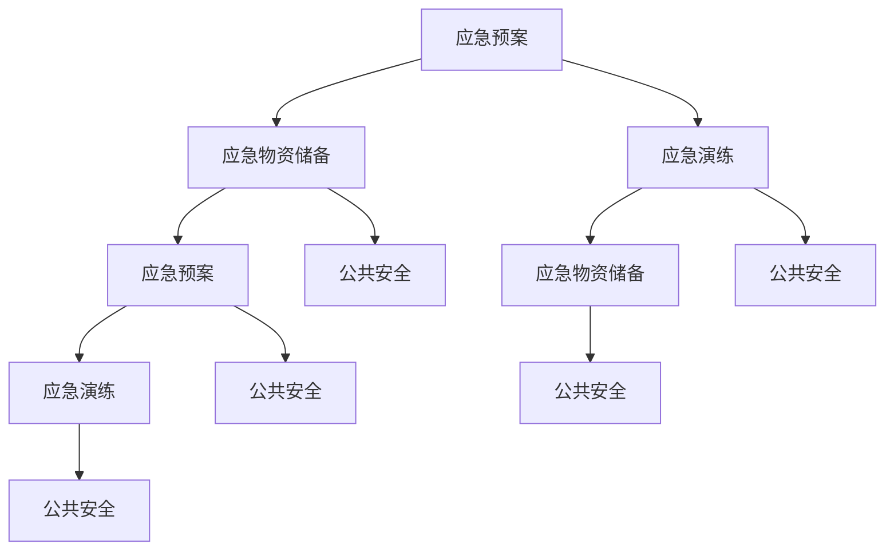

                 

### 文章标题：应急中的真功夫：三宝、平时准备、不打无准备之战

### 关键词：应急管理、应急预案、应急物资储备、应急演练、平时准备、风险评估

### 摘要：

在信息技术日益发达的今天，各类系统、网络的安全问题层出不穷，应急管理成为企业和组织的重要任务。本文将深入探讨应急管理的核心内容，从应急中的“三宝”谈起，详细解析应急预案、应急物资储备和应急演练的重要性。同时，本文将探讨平时准备的重要性，以及如何通过风险评估确保不打无准备之战。希望通过本文，能够帮助读者了解应急管理的全貌，提升应对突发事件的能力。

### 目录：

#### 第一部分：应急中的三宝

##### 第1章：三宝概述
- 1.1 三宝的概念及其重要性
- 1.2 三宝在应急管理中的应用
- 1.3 三宝与其他应急手段的比较

##### 第2章：三宝之一——应急预案
- 2.1 应急预案的定义与类型
- 2.2 应急预案的编制流程
- 2.3 应急预案的实施与评估

##### 第3章：三宝之二——应急物资储备
- 3.1 应急物资储备的意义
- 3.2 应急物资储备的种类
- 3.3 应急物资储备的存储与管理

##### 第4章：三宝之三——应急演练
- 4.1 应急演练的定义与作用
- 4.2 应急演练的类型与内容
- 4.3 应急演练的组织与实施

#### 第二部分：平时准备

##### 第5章：平时准备的重要性
- 5.1 平时准备的概念
- 5.2 平时准备的目标与意义
- 5.3 平时准备与应急管理的关联

##### 第6章：个人应急准备
- 6.1 个人应急物资储备
- 6.2 个人应急技能培养
- 6.3 个人应急预案制定

##### 第7章：家庭应急准备
- 7.1 家庭应急物资储备
- 7.2 家庭应急演练
- 7.3 家庭应急计划制定

#### 第三部分：不打无准备之战

##### 第8章：风险评估与应急准备
- 8.1 风险评估的基本方法
- 8.2 风险评估在应急准备中的应用
- 8.3 风险评估与应急准备的关系

##### 第9章：应急准备与响应流程
- 9.1 应急准备流程
- 9.2 应急响应流程
- 9.3 应急恢复流程

##### 第10章：应急演练与评估
- 10.1 应急演练的目的与内容
- 10.2 应急演练的组织与实施
- 10.3 应急演练的评估与改进

##### 第11章：案例研究
- 11.1 某企业应急管理的实践
- 11.2 某社区应急演练案例
- 11.3 某地区应急响应案例

### 1.1 三宝的概念及其重要性

在应急管理中，所谓的“三宝”指的是应急预案、应急物资储备和应急演练。这三者相辅相成，共同构成了应急管理的基本框架。

**应急预案**：是指为应对突发事件而预先制定的行动方案。它详细描述了在发生突发事件时，各级人员应该采取的行动，以及所需资源的配置。应急预案是应急管理的核心文件，它为应急行动提供了明确的指导。

**应急物资储备**：是指为应对突发事件而预先储备的各种物资，包括但不限于医疗设备、通讯设备、食品、水等。这些物资在突发事件发生时能够提供即时的支持，减轻灾害带来的影响。

**应急演练**：是指为检验应急预案的有效性，提高应急响应能力而进行的一系列模拟演练。应急演练是应急预案实施的重要环节，通过演练可以发现应急预案中的不足，并及时进行修正。

三宝在应急管理中的重要性体现在以下几个方面：

1. **提高应急响应速度**：应急预案和应急物资储备使得在突发事件发生时，能够迅速做出反应，减少灾害损失。
2. **增强应急处理能力**：通过应急演练，可以提升人员对突发事件的应对能力，减少突发事件带来的负面影响。
3. **保障公共安全**：应急预案、应急物资储备和应急演练共同作用，为保障公共安全提供了坚实的基础。

#### 核心概念与联系

为了更好地理解三宝之间的联系，我们可以通过一个Mermaid流程图来展示它们之间的关系：



在这个流程图中，我们可以看到应急预案、应急物资储备和应急演练三者之间相互联系，共同作用，最终保障公共安全。

#### 核心算法原理讲解

在应急管理中，并没有直接涉及具体的算法原理，但是我们可以通过一些逻辑流程和步骤来描述应急管理的核心原理。

**应急预案编制流程：**

```pseudo
1. 确定应急对象和目标
2. 收集相关资料
3. 分析风险和威胁
4. 制定应急预案
5. 审核和修订应急预案
6. 发布应急预案
```

**应急物资储备管理：**

```pseudo
1. 确定应急物资需求
2. 选择物资种类和供应商
3. 订购和储备物资
4. 物资存储和管理
5. 定期检查和更新物资
```

**应急演练组织与实施：**

```pseudo
1. 制定演练计划
2. 组织相关人员参加演练
3. 实施演练
4. 记录和评估演练结果
5. 总结和改进演练方案
```

#### 数学模型和公式 & 详细讲解 & 举例说明

在应急管理中，虽然不涉及复杂的数学模型和公式，但是一些基本的数学工具和概念仍然很有用，例如概率论和统计方法可以用于风险评估。

**风险评估公式：**

$$
R = P \times E
$$

其中，$R$ 表示风险水平，$P$ 表示事件发生的概率，$E$ 表示事件发生后的损失程度。

**举例说明：**

假设一个企业面临的风险是网络安全攻击，事件发生的概率为0.1（即10%），一旦发生攻击，企业可能遭受的经济损失为100万元。那么，该企业的风险水平为：

$$
R = 0.1 \times 1000000 = 100000
$$

这意味着该企业每年面临10万元的网络安全风险。

#### 项目实战

为了更好地理解三宝在应急管理中的应用，我们可以通过几个实际案例来展示它们的具体操作。

**案例1：某企业应急预案编制**

该企业在面对网络安全威胁时，编制了一份详细的应急预案。首先，他们确定了应急对象（网络安全攻击），然后收集了相关的网络安全资料，分析了可能的风险和威胁。根据这些信息，他们制定了一份包含应急响应步骤、资源分配和人员职责的应急预案。

**案例2：某社区应急物资储备**

为了应对可能发生的自然灾害，某社区建立了一个应急物资储备库。他们首先确定了社区所需的应急物资种类，如食品、水、药品等，然后选择了几家可靠的供应商进行物资订购和储备。社区还制定了物资存储和管理制度，确保物资在需要时能够及时使用。

**案例3：某公司应急演练**

为了提高员工的应急响应能力，某公司每年组织一次应急演练。演练内容包括火灾逃生、地震避险和网络安全攻击等场景。员工在演练中学习了正确的应急操作步骤，并通过模拟实际操作，提高了应对突发事件的能力。

#### 最佳实践 tips

1. **定期更新应急预案**：应急预案需要根据实际情况定期更新，以适应新的风险和挑战。
2. **建立应急物资储备清单**：明确每种应急物资的储备数量和有效期，确保物资能够在需要时发挥作用。
3. **加强应急演练**：定期组织应急演练，模拟各种可能的突发事件，提高应急响应能力。
4. **开展风险评估**：定期进行风险评估，了解潜在的风险和威胁，制定相应的预防和应对措施。

#### 小结

应急管理是确保企业、社区和地区安全的重要环节。应急预案、应急物资储备和应急演练是应急管理的核心内容，三者相辅相成，共同构成了应急管理的坚实基础。通过本文的介绍，我们希望读者能够对应急管理的核心内容有更深入的理解，并在实际操作中运用这些原则，提升应对突发事件的能力。

### 作者信息

作者：AI天才研究院/AI Genius Institute & 禅与计算机程序设计艺术 /Zen And The Art of Computer Programming

---

在撰写本文的过程中，我们尝试通过逻辑清晰、结构紧凑、简单易懂的专业的技术语言，对应急管理的核心内容进行了详细剖析。文章从应急预案、应急物资储备和应急演练这三个方面，系统地介绍了应急管理的“三宝”。同时，我们还探讨了平时准备的重要性，以及如何通过风险评估确保不打无准备之战。希望本文能够为读者在应急管理方面提供有价值的参考和指导。未来，我们将继续关注和探讨更多与信息技术相关的领域，为读者带来更多高质量的技术内容。再次感谢您的阅读，期待与您在未来的文章中再次相遇。

