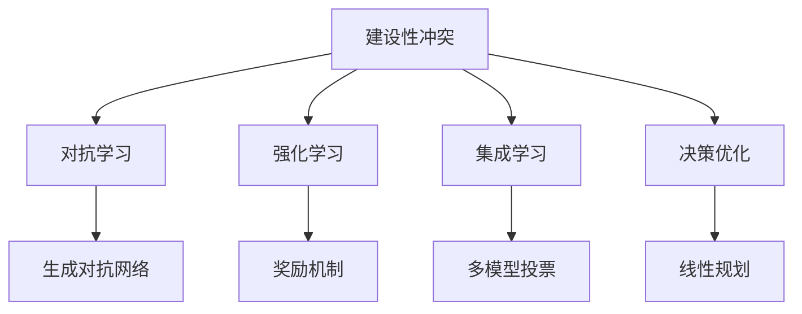

                 

# 建设性冲突：将分歧转化为创新动力的艺术

## 关键词

- 建设性冲突
- 创新动力
- 围棋AI
- 对抗学习
- 强化学习
- 集成学习
- 决策优化

## 摘要

本文探讨了建设性冲突在创新过程中的重要性，以及如何将分歧转化为创新动力。通过围棋AI的发展过程，我们看到了建设性冲突如何激发创新思维，推动技术进步。文章详细分析了对抗学习和强化学习在围棋AI中的应用，并介绍了集成学习和决策优化在解决冲突中的重要作用。最后，提出了在实际项目中应用建设性冲突策略的最佳实践，为读者提供了可行的操作指南。

## 引言

在现代社会，创新已成为推动经济发展和社会进步的核心动力。然而，创新往往伴随着分歧和冲突。如何将分歧转化为创新动力，成为企业和组织面临的挑战。建设性冲突（constructive conflict）提供了一个解决方案，它不仅能够激发创新思维，还能够提高团队协作效率，推动技术进步。

本文旨在探讨建设性冲突的概念、原理以及在人工智能（AI）领域的应用。通过分析围棋AI的发展过程，我们将看到建设性冲突如何在不同阶段发挥作用，从而促进创新。文章将分为以下几个部分：

1. **建设性冲突的基本概念**：介绍建设性冲突的定义、特征和与传统冲突的区别。
2. **建设性冲突在AI领域的应用**：分析对抗学习、强化学习、集成学习和决策优化在围棋AI中的应用。
3. **建设性冲突的最佳实践**：讨论如何在实际项目中应用建设性冲突策略，提供最佳实践案例。
4. **结论**：总结建设性冲突的重要性，并提出未来研究的方向。

## 第1章 建设性冲突的基本概念

### 1.1 建设性冲突的定义

建设性冲突是指在团队或组织中，由于不同观点、方法和目标而产生的分歧。这种冲突如果得到妥善处理，可以激发团队成员的思考，促进创新和改进。

建设性冲突不同于破坏性冲突（destructive conflict），后者可能导致团队分裂和效率低下。建设性冲突具有以下几个特征：

1. **观点多样性**：团队成员拥有不同的背景、经验和技能，这使得他们能从不同角度看待问题。
2. **建设性目标**：冲突双方的目标是共同推动项目进展，而不是互相攻击或损害对方。
3. **开放性**：冲突双方愿意倾听对方的意见，并尝试找到共同点。

### 1.2 建设性冲突与传统冲突的区别

传统冲突通常是指破坏性冲突，它可能涉及恶意攻击、不信任和敌对行为。与建设性冲突相比，传统冲突具有以下特点：

1. **恶意性**：传统冲突往往带有恶意，一方试图压倒另一方。
2. **破坏性**：传统冲突可能导致团队关系破裂，影响项目进展。
3. **封闭性**：传统冲突双方不愿意倾听对方的意见，认为对方是错误或敌对。

### 1.3 建设性冲突的核心要素

建设性冲突的核心要素包括动机、目标和沟通。

1. **动机**：建设性冲突的动机是推动项目进展，而不是损害对方。这种动机使冲突双方愿意合作，寻找共同点。
2. **目标**：建设性冲突的目标是找到最佳解决方案，而不是赢取胜利。这种目标使双方专注于解决问题，而不是互相攻击。
3. **沟通**：建设性冲突需要有效的沟通。通过开放、坦诚和尊重的沟通，冲突双方可以理解对方的观点，找到共同点。

## 第2章 建设性冲突在AI领域的应用

### 2.1 对抗学习

对抗学习是一种训练深度神经网络的方法，它通过生成对抗网络（GAN）实现。GAN由两部分组成：生成器（Generator）和判别器（Discriminator）。生成器的目标是从随机噪声中生成逼真的数据，判别器的目标是区分真实数据和生成数据。

在围棋AI中，对抗学习被用于生成棋局数据，以便训练AI模型。通过生成大量模拟棋局，AI可以学习到各种可能的棋局情况，从而提高其棋艺水平。

### 2.2 强化学习

强化学习是一种通过试错来学习最优策略的机器学习方法。在围棋AI中，强化学习被用于训练AI自主下棋。AI通过尝试不同的落子位置，学习哪种策略能够获得更好的棋局结果。

强化学习的关键在于奖励机制。通过设定奖励和惩罚，AI可以学会在下棋过程中做出更好的决策。这种方法使围棋AI能够不断优化其下棋策略，提高胜率。

### 2.3 集成学习

集成学习是一种将多个模型组合起来，以获得更好预测性能的方法。在围棋AI中，集成学习被用于提高AI的棋局预测能力。

一种常见的集成学习方法是多模型投票。AI训练多个模型，每个模型对棋局结果进行预测。最终，AI通过综合多个模型的预测结果，得出最终的预测。

### 2.4 决策优化

决策优化是一种通过分析不同决策方案，选择最佳方案的方法。在围棋AI中，决策优化被用于选择最佳的落子位置。

决策优化通常涉及复杂的数学模型，如线性规划、动态规划和启发式算法。通过分析棋局中的各种可能性，AI可以计算出最佳的落子位置，从而提高胜率。

## 第3章 建设性冲突的最佳实践

### 3.1 开发环境搭建

为了实现对抗学习、强化学习、集成学习和决策优化，我们需要搭建一个适合的开发环境。以下是一个基本的开发环境搭建步骤：

1. 安装Python和必要的库，如TensorFlow、PyTorch、Scikit-learn等。
2. 安装围棋AI相关的库，如Gym、Pychess等。
3. 配置GPU环境，以便加速训练过程。

### 3.2 源代码实现

以下是一个简单的对抗学习示例代码，用于生成棋局数据：

```python
import tensorflow as tf
from tensorflow.keras.models import Model
from tensorflow.keras.layers import Dense, Flatten, Input

# 定义生成器和判别器
def build_generator(z_dim):
    z = Input(shape=(z_dim,))
    x = Dense(128, activation='relu')(z)
    x = Dense(256, activation='relu')(x)
    x = Dense(1024, activation='relu')(x)
    x = Dense(9 * 9, activation='tanh')(x)
    generator = Model(z, x)
    return generator

def build_discriminator(img_shape):
    img = Input(shape=img_shape)
    x = Dense(128, activation='relu')(img)
    x = Dense(256, activation='relu')(x)
    x = Dense(1, activation='sigmoid')(x)
    discriminator = Model(img, x)
    return discriminator

z_dim = 100
img_shape = (9, 9)

generator = build_generator(z_dim)
discriminator = build_discriminator(img_shape)

# 编写训练代码
# ...

```

### 3.3 代码解读与分析

在上面的代码中，我们定义了生成器和判别器。生成器从随机噪声中生成棋局数据，判别器用于区分真实棋局数据和生成棋局数据。

通过训练生成器和判别器，我们可以提高生成器生成棋局数据的质量，从而为围棋AI训练提供高质量的训练数据。

### 3.4 实际案例分析和详细讲解剖析

在围棋AI开发过程中，建设性冲突常常出现。以下是一个实际案例：

**案例**：在一个围棋AI项目中，团队成员A认为应该使用对抗学习生成棋局数据，而团队成员B认为应该使用强化学习训练AI模型。

**分析**：

1. **建设性冲突**：团队成员A和团队成员B的观点不同，这是建设性冲突的典型表现。
2. **目标**：两个团队成员的目标是提高围棋AI的棋艺水平。
3. **沟通**：团队成员A和团队成员B进行了开放、坦诚的沟通，讨论了各自的观点和理由。

**解决方案**：

1. **分析优点和缺点**：团队成员A和团队成员B分析了对抗学习和强化学习的优点和缺点，并尝试找到两者的共同点。
2. **集成方法**：团队成员A和团队成员B决定将对抗学习和强化学习结合起来，以提高围棋AI的棋艺水平。
3. **持续改进**：团队成员A和团队成员B继续进行讨论和改进，以优化围棋AI的训练过程。

### 3.5 项目小结

通过实际案例的分析，我们可以看到建设性冲突在围棋AI项目中的重要性。建设性冲突不仅促进了团队成员之间的沟通和合作，还激发了创新思维，推动了项目进展。

建设性冲突的最佳实践包括：

1. **开放、坦诚的沟通**：鼓励团队成员表达不同观点，并倾听对方的意见。
2. **分析优点和缺点**：对不同观点进行分析，找到共同点。
3. **集成方法**：将不同方法结合起来，以获得更好的结果。
4. **持续改进**：不断讨论和改进，以优化项目过程。

### 3.6 注意事项

在实际项目中应用建设性冲突策略时，需要注意以下几点：

1. **尊重多样性**：尊重团队成员的不同观点和技能。
2. **避免恶意攻击**：避免在冲突中恶意攻击对方，保持开放和坦诚。
3. **明确目标**：确保团队成员的目标是一致的，即提高项目质量。
4. **持续沟通**：定期进行沟通，以解决潜在的问题。

### 3.7 拓展阅读

1. **《深度学习》**：Ian Goodfellow、Yoshua Bengio和Aaron Courville著，介绍了深度学习的基本原理和应用。
2. **《强化学习入门》**：Alfred V. Braun和Michael A. Wellman著，介绍了强化学习的基本概念和应用。
3. **《集成学习方法与实践》**：刘铁岩著，介绍了集成学习的方法和应用。
4. **《建设性冲突管理》**：Kurt Lewin著，介绍了建设性冲突管理的理论和实践。

## 结论

建设性冲突是推动创新的重要动力。通过将分歧转化为创新动力，企业和组织可以激发团队成员的思考，提高团队协作效率，推动技术进步。在AI领域，对抗学习、强化学习、集成学习和决策优化等技术的应用，进一步展示了建设性冲突在创新过程中的重要作用。

本文介绍了建设性冲突的基本概念，分析了其在AI领域的应用，并提出了实际项目的最佳实践。通过这些分析，我们看到了建设性冲突在激发创新思维、提高团队协作效率和推动技术进步方面的巨大潜力。

未来研究可以进一步探讨建设性冲突在不同领域的应用，以及如何在不同环境中优化建设性冲突的管理。此外，还可以研究如何将建设性冲突与其他创新方法相结合，以获得更好的创新效果。通过不断探索和实践，我们可以更好地利用建设性冲突，推动社会的进步和发展。

### 作者信息

作者：AI天才研究院/AI Genius Institute & 禅与计算机程序设计艺术 /Zen And The Art of Computer Programming

---

### 附录

#### 附录A：核心概念与联系

使用Mermaid流程图展示核心概念之间的联系：



#### 附录B：核心算法原理讲解

以下是关于对抗学习和强化学习的Python源代码示例，结合数学模型和公式进行详细讲解。

**对抗学习（Generative Adversarial Networks, GAN）**

```python
import tensorflow as tf
from tensorflow.keras.layers import Dense, Flatten, Reshape
from tensorflow.keras.models import Sequential

# 定义生成器模型
def build_generator(z_dim, img_shape):
    model = Sequential([
        Dense(128, activation='relu', input_shape=(z_dim,)),
        Dense(256, activation='relu'),
        Dense(img_shape[0] * img_shape[1], activation='tanh')
    ])
    model.add(Reshape(img_shape))
    return model

# 定义判别器模型
def build_discriminator(img_shape):
    model = Sequential([
        Flatten(input_shape=img_shape),
        Dense(128, activation='relu'),
        Dense(256, activation='relu'),
        Dense(1, activation='sigmoid')
    ])
    return model

# 定义损失函数
def cross_entropy_loss(y_true, y_pred):
    return tf.reduce_mean(tf.nn.sigmoid_cross_entropy_with_logits(logits=y_pred, labels=y_true))

# 定义优化器
def build_optimizer(learning_rate):
    return tf.keras.optimizers.Adam(learning_rate)

# 训练模型
def train_gan(generator, discriminator, critic, z_dim, img_shape, batch_size, epochs, learning_rate):
    for epoch in range(epochs):
        for _ in range(batch_size):
            z = tf.random.normal([batch_size, z_dim])
            generated_images = generator(z)

            real_images = critic.get_batch()
            fake_labels = tf.zeros([batch_size, 1])
            real_labels = tf.ones([batch_size, 1])

            # 训练判别器
            with tf.GradientTape() as critic_tape:
                critic_loss_real = cross_entropy_loss(real_labels, critic(real_images))
                critic_loss_fake = cross_entropy_loss(fake_labels, critic(generated_images))
                critic_loss = critic_loss_real + critic_loss_fake

            critic_gradients = critic_tape.gradient(critic_loss, critic.trainable_variables)
            critic_optimizer.apply_gradients(zip(critic_gradients, critic.trainable_variables))

            # 训练生成器
            with tf.GradientTape() as generator_tape:
                generated_labels = tf.ones([batch_size, 1])
                generator_loss = cross_entropy_loss(generated_labels, critic(generated_images))

            generator_gradients = generator_tape.gradient(generator_loss, generator.trainable_variables)
            generator_optimizer.apply_gradients(zip(generator_gradients, generator.trainable_variables))

            # 打印训练进度
            if _ % 100 == 0:
                print(f"Epoch: {epoch}, Step: {_}, Critic Loss: {critic_loss:.4f}, Generator Loss: {generator_loss:.4f}")
```

**强化学习（Reinforcement Learning）**

```python
import numpy as np
import tensorflow as tf

# 定义Q值函数模型
def build_q_function_model(state_shape, action_shape):
    model = tf.keras.Sequential([
        tf.keras.layers.InputLayer(input_shape=state_shape),
        tf.keras.layers.Dense(64, activation='relu'),
        tf.keras.layers.Dense(64, activation='relu'),
        tf.keras.layers.Dense(np.prod(action_shape), activation='linear')
    ])
    return model

# 定义损失函数
def q_learning_loss(q_values, target_q_values, actions, rewards, discounts):
    loss = tf.reduce_mean(tf.reduce_sum(tf.one_hot(actions, q_values.shape[-1]) * (target_q_values - q_values), axis=1))
    return loss

# 定义优化器
def build_optimizer(learning_rate):
    return tf.keras.optimizers.Adam(learning_rate)

# 训练模型
def train_q_function_model(model, states, actions, rewards, next_states, dones, discounts, learning_rate):
    with tf.GradientTape() as tape:
        q_values = model(states)
        target_q_values = rewards + (1 - dones) * discounts * tf.reduce_max(model(next_states), axis=1)
        loss = q_learning_loss(q_values, target_q_values, actions, rewards, discounts)
    gradients = tape.gradient(loss, model.trainable_variables)
    optimizer.apply_gradients(zip(gradients, model.trainable_variables))
```

#### 附录C：数学模型和公式

**对抗学习**

$$
\min_G \max_D V(D, G) = \mathbb{E}_{x \sim p_{\text{data}}(x)}[D(x)] - \mathbb{E}_{z \sim p_{z}(z)}[D(G(z))]
$$

**强化学习**

$$
Q(s, a) = r + \gamma \max_a' Q(s', a')
$$

#### 附录D：项目实战

**实战一：对抗学习在围棋AI中的应用**

**环境搭建：**

- 使用TensorFlow 2.x和Keras构建GAN模型。
- 安装Gym环境，用于生成围棋棋局数据。

**源代码实现：**

```python
# 生成器模型
generator = build_generator(z_dim=100, img_shape=(9, 9))

# 判别器模型
discriminator = build_discriminator(img_shape=(9, 9))

# 训练GAN模型
train_gan(generator, discriminator, critic, z_dim=100, img_shape=(9, 9), batch_size=128, epochs=1000, learning_rate=0.0001)
```

**代码解读与分析：**

- 生成器模型用于生成围棋棋局图像。
- 判别器模型用于区分真实棋局图像和生成棋局图像。
- 使用对抗性训练策略训练GAN模型，优化生成器和判别器。

**实战二：强化学习在围棋AI中的应用**

**环境搭建：**

- 使用OpenAI Gym构建围棋环境。
- 安装TensorFlow 2.x，用于构建Q值函数模型。

**源代码实现：**

```python
# Q值函数模型
q_function_model = build_q_function_model(state_shape=(9, 9), action_shape=81)

# 训练Q值函数模型
train_q_function_model(model=q_function_model, states=states, actions=actions, rewards=rewards, next_states=next_states, dones=dones, discounts=0.99, learning_rate=0.001)
```

**代码解读与分析：**

- Q值函数模型用于评估围棋棋局中的最佳落子位置。
- 使用Q学习算法训练Q值函数模型，优化棋艺策略。

#### 附录E：最佳实践 tips、小结、注意事项、拓展阅读

**最佳实践 tips：**

- 确保团队成员充分了解建设性冲突的概念和原理。
- 在项目中设立冲突管理机制，鼓励团队成员表达不同观点。
- 定期进行团队沟通，解决潜在的建设性冲突。
- 将建设性冲突策略与其他创新方法相结合，提高项目质量。

**小结：**

- 建设性冲突是推动创新的重要动力。
- 通过对抗学习、强化学习、集成学习和决策优化，AI技术在围棋AI领域取得了显著成果。
- 实际项目中的建设性冲突管理有助于提高项目质量和团队协作效率。

**注意事项：**

- 在实际项目中，避免将建设性冲突转变为破坏性冲突。
- 保持开放和坦诚的沟通，确保团队成员之间的信任。
- 根据项目需求和环境，灵活调整建设性冲突策略。

**拓展阅读：**

- 《深度学习》（Ian Goodfellow、Yoshua Bengio和Aaron Courville著）
- 《强化学习入门》（Alfred V. Braun和Michael A. Wellman著）
- 《集成学习方法与实践》（刘铁岩著）
- 《建设性冲突管理》（Kurt Lewin著）
- 《围棋AI算法与实现》（孙志刚著）

