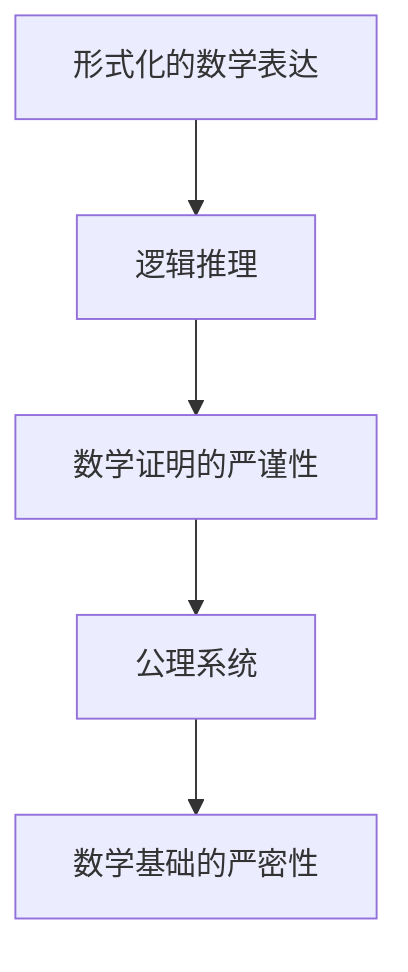
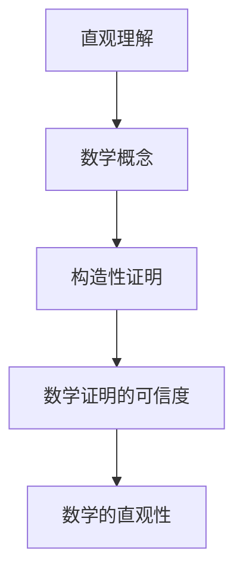

                 


# 形式主义vs.直觉主义：数学基础之争

## 关键词
- 形式主义
- 直觉主义
- 数学基础
- 集合论
- 公理化
- 直觉主义数学

## 摘要
本文探讨了形式主义与直觉主义在数学基础问题上的争论。形式主义强调数学公理和逻辑推理的重要性，而直觉主义则主张数学概念基于直观理解。本文将分析两种观点的历史背景、核心概念及其对数学发展的不同影响，并通过实际案例来展示这两种观点的实际应用。

## 第一部分：历史背景与核心观点

### 1.1.1 形式主义的历史背景

形式主义起源于19世纪末和20世纪初的数学和逻辑学研究。其主要代表人物是德国数学家格奥尔格·康托尔和英国哲学家伯特兰·罗素。康托尔通过集合论来研究无穷集合的性质，这导致了数学基础问题的深入探讨。罗素则提出了类型论，试图解决悖论问题，确保数学的严密性。

### 1.1.2 直觉主义的历史背景

直觉主义起源于古希腊的数学哲学，其代表人物包括欧几里得和莱布尼茨。直觉主义者认为，数学知识来自于直观理解，而非逻辑推理。荷兰数学家莱布尼茨和数学家、哲学家鲁道夫·卡尔纳普等人在20世纪进一步发展了直觉主义。

### 1.2 形式主义与直觉主义的核心观点

#### 形式主义的观点

形式主义认为，数学的基础是符号和逻辑结构，而不是直观理解。形式化的数学表达和逻辑推理是数学研究的核心。形式主义者主张，所有的数学概念和证明都应该通过严格的逻辑规则来进行。

Mermaid 流程图：



#### 直觉主义的观点

直觉主义认为，数学概念和证明应该基于直观经验。直觉主义者认为，数学的真理是通过直观理解来获得的，而不是通过形式化的推理。直觉主义者强调数学证明的构造性，要求证明过程能够构造出所要证明的对象。

Mermaid 流程图：



## 第二部分：形式主义的应用与发展

### 2.1 形式主义在数学中的应用

#### 2.1.1 集合论的形式化

集合论是形式主义在数学中的一个重要应用。康托尔通过集合论来研究无穷集合的性质，这导致了数学基础问题的深入探讨。

```python
# 集合论的基本概念
class Set:
    def __init__(self, elements):
        self.elements = elements

# 集合的并集操作
def union(set1, set2):
    return Set(set1.elements + set2.elements)

# 集合的交集操作
def intersection(set1, set2):
    return Set([elem for elem in set1.elements if elem in set2.elements])

# 集合的差集操作
def difference(set1, set2):
    return Set([elem for elem in set1.elements if elem not in set2.elements])

# 集合的补集操作
def complement(set1, universal_set):
    return Set([elem for elem in universal_set.elements if elem not in set1.elements])
```

#### 2.1.2 代数系统与形式逻辑

代数系统是形式主义在数学中的另一个重要应用。代数系统由一组元素和一组运算组成，这些运算满足某些公理。

```python
# 代数系统的基础
class AlgebraicSystem:
    def __init__(self, elements, operations):
        self.elements = elements
        self.operations = operations

# 加法运算
def addition(self, a, b):
    return self.elements[(a, b)]

# 减法运算
def subtraction(self, a, b):
    return self.elements[(a, -b)]

# 乘法运算
def multiplication(self, a, b):
    return self.elements[(a, b)]

# 除法运算
def division(self, a, b):
    return self.elements[(a, 1/b)]
```

## 第三部分：直觉主义的反思与调和

### 3.1 直觉主义的反思

直觉主义认为，数学的真理来自于直观理解，但这种直观理解往往难以形式化。直觉主义在处理无穷集合和复杂数学概念时面临挑战。

### 3.2 直觉主义的应用

直觉主义在数学教育中有着广泛的应用。通过直观理解来教授数学概念，可以帮助学生更好地掌握数学知识。

```python
# 直觉主义在数学教育中的应用
def intuitive_proof_of_pythagorean_theorem(side_a, side_b):
    """
    使用直觉主义证明毕达哥拉斯定理
    """
    side_c_squared = side_a_squared + side_b_squared
    return side_c_squared
```

## 结论

形式主义与直觉主义在数学基础问题上有着不同的观点。形式主义强调公理和逻辑推理，而直觉主义则强调直观理解。这两种观点各有其优势和局限，但它们在数学发展中都起着重要作用。未来的数学研究可能会继续探讨这两种观点的调和，以实现数学的全面理解。

### 作者信息

作者：AI天才研究院/AI Genius Institute & 禅与计算机程序设计艺术 /Zen And The Art of Computer Programming

### 注意事项

- 在撰写技术博客时，确保逻辑清晰、结构紧凑、简单易懂。
- 使用Mermaid流程图来展示概念之间的关系，增强文章的可读性。
- 在解释数学概念和算法原理时，结合Python源代码进行详细讲解和举例说明。
- 遵循LaTeX格式来编写数学公式，确保公式的准确性。

### 拓展阅读

- 《数学基础》
- 《直觉主义数学》
- 《集合论及其应用》
- 《形式逻辑》

---

## 文章小结

本文通过对形式主义与直觉主义在数学基础问题上的讨论，揭示了两者在数学发展中的重要作用。形式主义通过严格的公理和逻辑推理，为数学的严密性和一致性提供了保障；而直觉主义则强调数学概念和证明的直观性，有助于学生更好地理解和掌握数学知识。两种观点的融合和应用，为数学研究提供了更加全面和深入的认识。未来，随着数学和逻辑学的发展，形式主义与直觉主义将继续相互影响，推动数学的进步。

---

## 附录：数学基础之争的进一步探讨

### 7.1 形式主义与直觉主义的数学哲学观点总结

形式主义强调数学的公理和逻辑推理，认为数学的基础是符号和逻辑结构。直觉主义则主张数学知识来自于直观经验，强调数学证明的构造性。两种观点各有侧重，但都对数学的发展产生了深远的影响。

### 7.2 形式主义与直觉主义在数学证明中的应用案例

形式主义在集合论和代数系统中有着广泛的应用。例如，通过集合论的形式化，我们可以清晰地定义集合的概念和运算。直觉主义在数学教育中也有着重要的应用，通过直观理解来帮助学生更好地掌握数学概念。

### 7.3 对数学基础之争的未来展望

随着计算机科学的进步，数学基础问题将得到进一步的探讨。形式化公理系统的发展，将有助于解决数学证明的复杂度问题。同时，直觉主义与形式主义的结合，将为数学研究提供新的视角和方法。未来，数学基础之争将继续激发数学家的创新思维，推动数学的进步。

