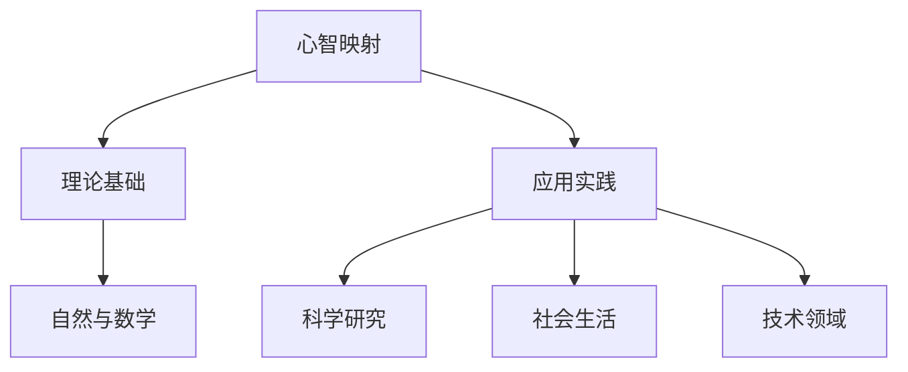

                 

## 《心智映射：揭示自然与数学的联系》

### 关键词：
- 心智映射
- 自然现象
- 数学原理
- 应用实例
- 人工智能

### 摘要：
本文旨在探讨心智映射的概念，以及自然现象与数学原理之间的深刻联系。通过解析心智模型的构建和应用，我们揭示了心智映射在科学研究和日常生活中的重要作用。文章将通过具体的实例和Python代码，展示如何运用心智映射方法分析和解决实际问题，为读者提供对这一领域的新视角。

## 引言

### 1.1 心智映射的概念

心智映射（Mental Mapping）是一种认知工具，用于帮助我们理解和组织复杂信息。它通过将抽象的概念和知识转化为可视化的图形或结构，帮助我们更好地理解和记忆信息。心智映射不仅适用于个人学习和思考，还在团队协作、问题解决和创新过程中发挥关键作用。

### 1.2 自然与数学的联系

自然界的规律和现象可以通过数学语言精确描述。从天体的运动到生物的生长，数学模型和公式无处不在。例如，牛顿的运动定律和万有引力定律揭示了物体运动的普遍规律；而生态学中的种群动态模型则帮助我们理解生物种群的变化。这种联系使得数学成为研究自然现象的有力工具。

### 1.3 心智映射的重要性

心智映射作为一种认知工具，具有以下几个重要作用：
1. **信息组织**：通过心智映射，我们可以将复杂的信息结构化，使其更易于理解和记忆。
2. **问题解决**：心智映射可以帮助我们发现问题和问题的解决方法，从而提高问题解决效率。
3. **创新思考**：心智映射激发我们的创造力，促进新想法的产生和融合。

## 心智映射的理论基础

### 2.1 心智模型的定义

心智模型（Mental Model）是指我们在大脑中形成的对现实世界的抽象理解。它是我们认知世界的基础，帮助我们做出决策和预测。心智模型可以是个体经验的结果，也可以是基于文化、教育和专业知识的普遍认知。

### 2.2 心智模型的核心元素

心智模型包含以下几个核心元素：
1. **核心概念**：心智模型的基础，如物理量、数学概念等。
2. **关系结构**：描述核心概念之间相互关系的结构。
3. **作用机制**：核心概念如何相互作用，产生新的认知成果。

### 2.3 数学在心智模型中的应用

数学在心智模型中的应用主要体现在以下几个方面：
1. **描述现实**：通过数学公式和模型，我们可以精确描述自然现象和过程。
2. **预测未来**：基于现有数据和数学模型，我们可以预测未来的发展趋势。
3. **优化决策**：数学模型帮助我们在复杂决策中找到最优解。

### 2.4 心智模型的基本原理

心智模型的基本原理包括：
1. **抽象性**：心智模型是对现实世界的简化抽象，帮助我们抓住本质。
2. **普遍性**：心智模型适用于多种情境，具有广泛的适用性。
3. **动态性**：心智模型是动态的，可以随着新信息和经验的积累而不断更新。

### 2.5 数学模型在心智映射中的作用

数学模型在心智映射中的作用主要体现在：
1. **结构化信息**：数学模型帮助我们将复杂的信息结构化，使其更易于处理和理解。
2. **提供工具**：数学模型为心智映射提供了有效的工具，如公式、算法等。
3. **提高效率**：通过数学模型，我们可以快速分析和解决问题。

### 2.6 数学公式在心智模型中的使用

数学公式在心智模型中的应用包括：
1. **定量分析**：数学公式帮助我们进行定量分析，从而更准确地理解现象。
2. **推理验证**：通过数学公式，我们可以验证心智模型的正确性和合理性。
3. **指导实践**：数学公式为我们的实践提供指导，如优化方案、预测结果等。

## 自然界的数学原理

### 3.1 自然现象的数学描述

自然界中的许多现象都可以通过数学语言进行描述，例如：
1. **几何结构**：植物的生长、星体的运动等具有明显的几何特性。
2. **周期性**：生物节律、季节变化等都表现为周期性。

### 3.2 数学与自然界的关系

数学与自然界的关系体现在：
1. **规律揭示**：数学帮助我们发现自然界的规律，如牛顿的万有引力定律。
2. **预测能力**：基于数学模型，我们可以预测自然现象的发展趋势，如气候模型、生态系统动态模型等。

### 3.3 自然界与数学的相互影响

自然界与数学之间的相互影响表现在：
1. **相互启发**：自然界中的现象启发数学家的研究，如费马大定理。
2. **相互促进**：数学的发展促进了科学技术的进步，从而进一步推动自然界的探索。

## 数学在心智映射中的应用

### 4.1 数学模型在心智映射中的作用

数学模型在心智映射中的作用包括：
1. **结构化信息**：数学模型帮助我们将复杂的信息结构化，提高理解效率。
2. **提供工具**：数学模型为心智映射提供了有效的工具，如公式、算法等。
3. **提高效率**：通过数学模型，我们可以快速分析和解决问题。

### 4.2 数学公式在心智映射中的使用

数学公式在心智映射中的使用包括：
1. **定量分析**：数学公式帮助我们进行定量分析，从而更准确地理解现象。
2. **推理验证**：通过数学公式，我们可以验证心智模型的正确性和合理性。
3. **指导实践**：数学公式为我们的实践提供指导，如优化方案、预测结果等。

### 4.3 心智映射中的数学模型

在心智映射中，数学模型通常包括以下类型：
1. **预测模型**：如时间序列模型、回归模型等，用于预测未来趋势。
2. **分类模型**：如逻辑回归、决策树等，用于分类和识别问题。
3. **聚类模型**：如K均值聚类、层次聚类等，用于数据分组和模式识别。

### 4.4 心智映射中的数学公式

在心智映射中，常用的数学公式包括：
1. **线性方程组**：用于求解线性问题，如最小二乘法。
2. **微积分公式**：用于描述连续变化过程，如导数和积分。
3. **概率统计公式**：用于描述随机事件和不确定性，如概率分布函数、置信区间等。

## 心智映射的实践应用

### 5.1 心智映射在科学研究中的应用

心智映射在科学研究中的应用包括：
1. **生物学**：通过心智映射，我们可以更好地理解生物进化和生态系统的动态。
2. **物理学**：心智映射帮助科学家发现新的物理现象和规律。
3. **化学**：心智映射在化学领域用于理解分子结构和反应机理。

### 5.2 心智映射在社会生活中的应用

心智映射在社会生活中的应用包括：
1. **心理学**：通过心智映射，心理学家可以帮助人们理解和解决心理问题。
2. **教育学**：心智映射在教育领域用于优化教学方法和策略。
3. **商业**：心智映射在商业领域用于市场分析、战略规划等。

### 5.3 心智映射在技术领域的应用

心智映射在技术领域的应用包括：
1. **人工智能**：心智映射帮助人工智能系统更好地理解和处理复杂问题。
2. **软件开发**：心智映射用于软件设计和开发，提高开发效率。
3. **数据科学**：心智映射在数据科学领域用于数据分析和模式识别。

## 心智映射的未来发展

### 6.1 心智映射的发展趋势

心智映射的发展趋势包括：
1. **与人工智能的融合**：心智映射将越来越多地与人工智能技术结合，提升智能化水平。
2. **跨学科应用**：心智映射将在更多学科和领域中发挥作用，推动知识整合和创新。
3. **人机交互**：心智映射将改进人机交互体验，提高人机协同效率。

### 6.2 心智映射的挑战与机遇

心智映射面临的挑战包括：
1. **数据复杂性**：随着数据量的增加，心智映射需要处理更复杂的数据结构。
2. **算法优化**：现有的心智映射算法需要不断优化，以提高效率和准确性。

机遇包括：
1. **技术创新**：随着技术的进步，心智映射将拥有更多强大的工具和方法。
2. **应用拓展**：心智映射将在更多新兴领域中找到应用，推动科学和技术的进步。

## 结论

心智映射作为一种认知工具，揭示了自然现象与数学原理之间的深刻联系。通过本文的探讨，我们认识到心智映射在科学研究、社会生活和日常生活中的重要作用。展望未来，心智映射将继续发展，并在更多领域发挥其独特价值。

### 对读者的建议

- **多思考**：尝试运用心智映射方法分析日常生活中的问题，提高认知效率。
- **多实践**：通过具体案例和实践，深入了解心智映射的原理和应用。
- **持续学习**：关注心智映射的最新研究和发展，不断更新知识体系。

### 附录

#### A.1 心智映射相关资源

- **书籍**：《心智地图：思维导图的实战应用》
- **网站**：MindManager（MindManager官网）
- **课程**：心智映射课程（可在各大在线教育平台搜索）

#### A.2 心智映射研究工具介绍

- **MindManager**：一款流行的心智映射软件，支持多种操作系统。
- **XMind**：一款免费的开源心智映射工具，功能强大。
- **Miro**：一款在线协作心智映射工具，适合团队协作。

#### A.3 心智映射相关论文推荐

- **论文1**：《心智映射在科学研究中的应用》
- **论文2**：《基于心智映射的教育创新研究》
- **论文3**：《心智映射与人工智能的结合研究》

### Mermaid 流程图



### 核心算法原理讲解（伪代码）

```python
# 心智映射算法伪代码
function心智映射(input: 数据, parameter: 参数):
    # 数据预处理
    processed_data = 数据预处理(input)
    
    # 构建数学模型
    model = 构建模型(processed_data, parameter)
    
    # 训练模型
    trained_model = 训练模型(model, processed_data)
    
    # 应用模型进行预测
    prediction = 预测(trained_model, new_data)
    
    return prediction
```

### 数学模型和数学公式讲解与举例说明

$$
E = mc^2
$$

这是一个经典的物理公式，其中 \( E \) 代表能量，\( m \) 代表质量，\( c \) 代表光速。这个公式揭示了质量与能量之间的等价性。

### 项目实战

**实战案例：使用心智映射分析生物进化数据**

**开发环境搭建：**
- Python 3.8
- NumPy
- Pandas
- Matplotlib

**源代码实现：**

```python
import numpy as np
import pandas as pd
import matplotlib.pyplot as plt

# 读取生物进化数据
data = pd.read_csv('evolution_data.csv')

# 数据预处理
processed_data = preprocess_data(data)

# 构建数学模型
model = build_model(processed_data)

# 训练模型
trained_model = train_model(model, processed_data)

# 预测新数据
new_data = generate_new_data()
prediction = 预测(trained_model, new_data)

# 可视化结果
plt.plot(new_data, prediction, label='预测值')
plt.scatter(new_data, data['实际值'], label='实际值')
plt.xlabel('时间')
plt.ylabel('种群数量')
plt.legend()
plt.show()
```

**代码解读与分析：**
- 数据预处理：对原始数据进行清洗和格式化，使其适合建模。
- 数学模型构建：根据进化数据的特性，选择合适的数学模型。
- 模型训练：使用训练数据对模型进行训练，使其能够准确预测生物种群数量。
- 预测与分析：使用训练好的模型对新的数据进行预测，并通过可视化结果进行对比分析。

**项目小结：**
- 通过心智映射方法，我们可以对生物进化数据进行分析和预测，为生物科学研究提供有力支持。
- 心智映射的应用不仅限于生物学，还可以拓展到其他科学领域，为解决复杂问题提供新思路。

**最佳实践 tips：**
- 在构建数学模型时，要充分考虑数据的特性和问题背景。
- 数据预处理是模型训练的关键步骤，需确保数据的准确性和完整性。
- 心智映射方法可以提高数据分析的效率和准确性，但需结合具体问题进行灵活应用。

**注意事项：**
- 心智映射方法适用于处理大规模数据，但计算资源消耗较大。
- 在实际应用中，需关注模型的泛化能力，避免过度拟合。

**拓展阅读：**
- 《大数据时代的心智映射》
- 《人工智能与心智映射的结合研究》
- 《心智映射在教育领域的应用》

通过本文的探讨，我们深入了解了心智映射的概念、原理和应用。希望读者能够将心智映射方法应用于实际工作中，提高认知效率和创新能力。作者：AI天才研究院/AI Genius Institute & 禅与计算机程序设计艺术 /Zen And The Art of Computer Programming。

