                 

# 《情商管理：提升领导力的重要一环》

## 关键词

- 情商管理
- 领导力
- 情感智能
- 人际关系
- 有效沟通
- 解决冲突

## 摘要

本文旨在探讨情商管理在提升领导力方面的重要性。文章首先介绍了情商的基本概念和类型，随后详细讲解了情商管理技巧和提升策略。接下来，本文探讨了情商与领导力之间的关系，并提供了相关案例分析。最后，文章总结了情商管理的重要性，并对未来发展趋势进行了展望。

---

## 第1章 引言

### 1.1 情商与领导力的关系

情商（Emotional Intelligence，简称EQ）是指个体识别、理解、管理和使用情感信息的能力。它包括自我意识、自我管理、社会意识和关系管理四个主要方面。情商对领导力的影响至关重要，因为领导者不仅需要具备技术能力和专业知识，还需要具备处理复杂人际关系和情感的能力。

### 1.2 本书的目的与结构

本书旨在帮助读者理解情商管理在提升领导力中的关键作用。文章结构如下：

1. 引言：介绍情商和领导力的关系。
2. 情商基础：讲解情商的基本概念和类型。
3. 情商管理技巧：介绍提升情商的具体技巧。
4. 情商提升策略：探讨提升情商的方法。
5. 情商与领导力：分析情商在领导力中的应用。
6. 情商管理案例分析：提供实际案例。
7. 总结与展望：总结情商管理的重要性。

---

## 第2章 情商基础

### 2.1 情商的定义与类型

情商是指个体识别、理解、管理和使用情感信息的能力。根据盖洛普（Gallup）的研究，情商包括以下四个主要类型：

1. 自我意识：了解自己的情绪和情绪对行为的影响。
2. 自我管理：调节自己的情绪，使其适应不同的环境和情境。
3. 社会意识：理解他人的情感和观点，并据此调整自己的行为。
4. 关系管理：建立和维护良好的人际关系。

### 2.2 自我意识

自我意识是情商的核心，它使个体能够识别和理解自己的情感。以下是一个Mermaid流程图，展示了自我意识的步骤：

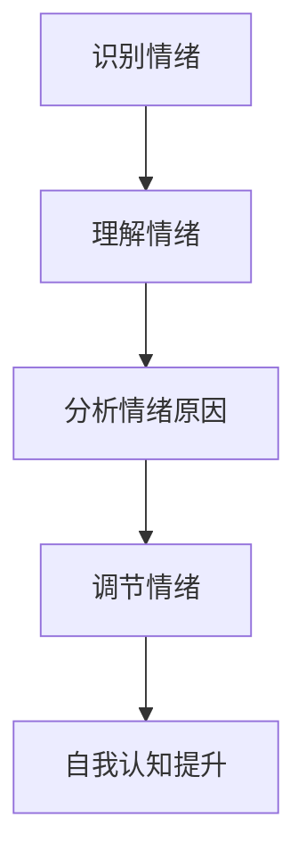

### 2.3 自我管理

自我管理是指个体如何调节自己的情绪，使其适应不同的环境和情境。以下是一个Python源代码示例，展示了如何使用情感分析库来识别和管理情绪：

```python
from textblob import TextBlob

# 文本情感分析
text = "我今天感到非常高兴，因为我完成了一个重要的项目。"
blob = TextBlob(text)

# 获取情感极性
polarity = blob.sentiment.polarity

# 根据情感极性管理情绪
if polarity > 0:
    print("情绪管理：保持积极，继续努力。")
elif polarity < 0:
    print("情绪管理：寻找解决方案，调整心态。")
else:
    print("情绪管理：保持中立，理性分析。")
```

### 2.4 社会意识

社会意识是指个体如何理解他人的情感和观点，并据此调整自己的行为。以下是一个Mermaid流程图，展示了社会意识的步骤：

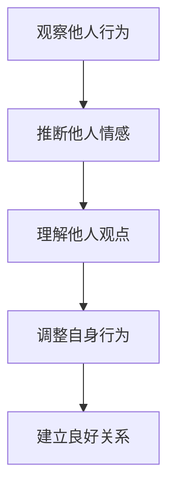

### 2.5 关系管理

关系管理是指个体如何建立和维护良好的人际关系。以下是一个Python源代码示例，展示了如何使用情感分析库来识别和管理情绪：

```python
from textblob import TextBlob

# 文本情感分析
text1 = "我很感激你的帮助。"
text2 = "我对你的工作不满意。"
blob1 = TextBlob(text1)
blob2 = TextBlob(text2)

# 获取情感极性
polarity1 = blob1.sentiment.polarity
polarity2 = blob2.sentiment.polarity

# 根据情感极性管理关系
if polarity1 > 0 and polarity2 > 0:
    print("关系管理：加强合作，共同进步。")
elif polarity1 < 0 and polarity2 < 0:
    print("关系管理：沟通改进，解决问题。")
else:
    print("关系管理：平衡双方情感，寻求共识。")
```

---

## 第3章 情商管理技巧

### 3.1 建立良好的人际关系

建立良好的人际关系是情商管理的重要一环。以下是一个Mermaid流程图，展示了建立良好人际关系的步骤：

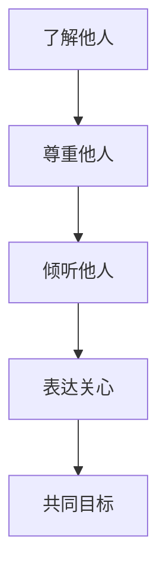

### 3.2 有效沟通

有效沟通是情商管理的关键技能。以下是一个Python源代码示例，展示了如何使用自然语言处理库来改善沟通效果：

```python
from textblob import TextBlob
from textblob.translate import Translator

# 原始文本
text = "我最近感觉压力很大，需要帮助。"

# 情感分析
blob = TextBlob(text)
sentiment = blob.sentiment.polarity

# 翻译文本
translator = Translator(to_lang='zh')
translated_text = translator.translate(text)

# 根据情感分析结果调整沟通方式
if sentiment > 0:
    print(f"翻译后的文本：{translated_text}。看起来你情绪很好，有什么我可以帮忙的吗？")
elif sentiment < 0:
    print(f"翻译后的文本：{translated_text}。看起来你情绪不太好，需要我提供一些支持吗？")
else:
    print(f"翻译后的文本：{translated_text}。无论你有什么需要，我都在这里支持你。")
```

### 3.3 解决冲突

解决冲突是情商管理的重要方面。以下是一个Mermaid流程图，展示了解决冲突的步骤：

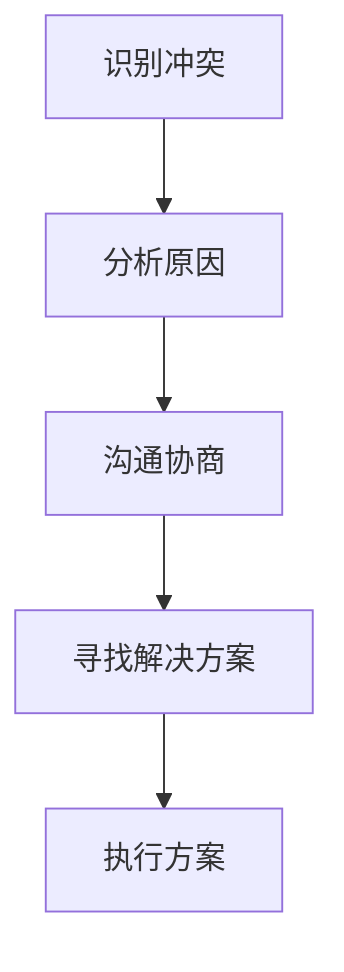

### 3.4 建立个人品牌

建立个人品牌是情商管理的长远目标。以下是一个Python源代码示例，展示了如何使用社交媒体数据来建立个人品牌：

```python
import tweepy
import pandas as pd

# 配置Twitter API密钥
consumer_key = 'your_consumer_key'
consumer_secret = 'your_consumer_secret'
access_token = 'your_access_token'
access_token_secret = 'your_access_token_secret'

# 创建Tweepy实例
auth = tweepy.OAuthHandler(consumer_key, consumer_secret)
auth.set_access_token(access_token, access_token_secret)
api = tweepy.API(auth)

# 获取用户推文
user_tweets = api.user_timeline(screen_name='your_username', count=10)

# 分析推文情感
tweets_data = [[tweet.text, tweet.sentiment.polarity] for tweet in user_tweets]
tweets_df = pd.DataFrame(tweets_data)
tweets_df.columns = ['text', 'sentiment']

# 根据情感分析结果优化个人品牌
if tweets_df['sentiment'].mean() > 0:
    print("个人品牌：保持积极态度，继续分享你的经验和见解。")
elif tweets_df['sentiment'].mean() < 0:
    print("个人品牌：注意情绪管理，优化沟通方式，提升个人品牌形象。")
else:
    print("个人品牌：平衡情绪，持续提升个人品牌价值。")
```

---

## 第4章 情商提升策略

### 4.1 自我提升的方法

自我提升是提升情商的重要途径。以下是一个Mermaid流程图，展示了自我提升的方法：

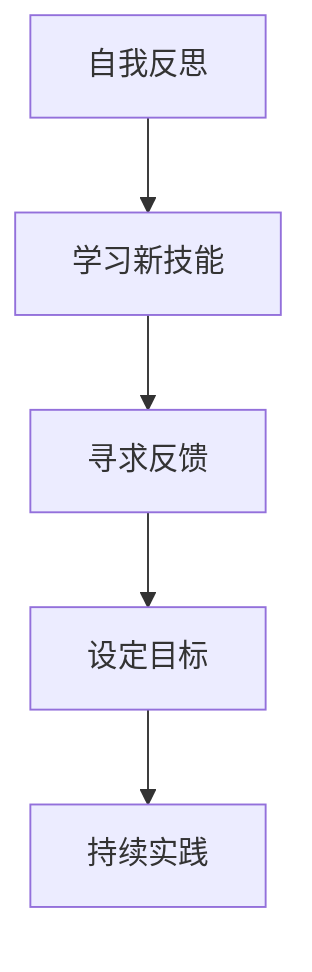

### 4.2 职场情商培养

职场情商培养是提升情商的关键。以下是一个Mermaid流程图，展示了职场情商培养的步骤：

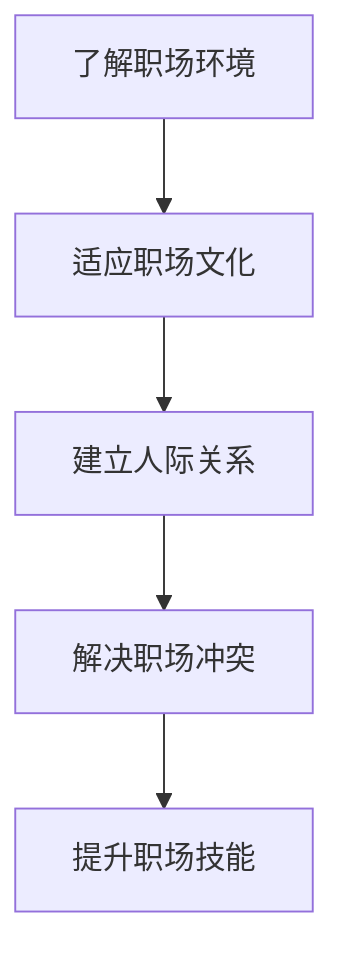

### 4.3 教育与培训策略

教育与培训是提升情商的重要手段。以下是一个Mermaid流程图，展示了教育与培训策略：

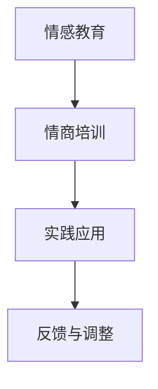

### 4.4 心理健康与情商

心理健康与情商密切相关。以下是一个Mermaid流程图，展示了心理健康与情商的关系：

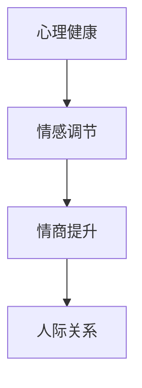

---

## 第5章 情商与领导力

### 5.1 领导力的定义与类型

领导力是指个体影响和激励他人实现共同目标的能力。根据领导力理论，领导力可分为以下类型：

1. 转型型领导力：通过愿景和变革激励团队。
2. 情境型领导力：根据不同情境调整领导风格。
3. 参与型领导力：鼓励团队成员参与决策。

### 5.2 情商在领导力中的应用

情商在领导力中的应用至关重要。以下是一个Mermaid流程图，展示了情商在领导力中的应用：

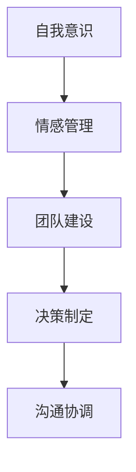

### 5.3 情商型领导者的特点

情商型领导者具有以下特点：

1. 高度的自我意识。
2. 良好的情感管理能力。
3. 强大的同理心。
4. 优秀的沟通能力。

### 5.4 情商领导力的培养

情商领导力的培养需要持续的努力和实践。以下是一个Mermaid流程图，展示了情商领导力的培养步骤：

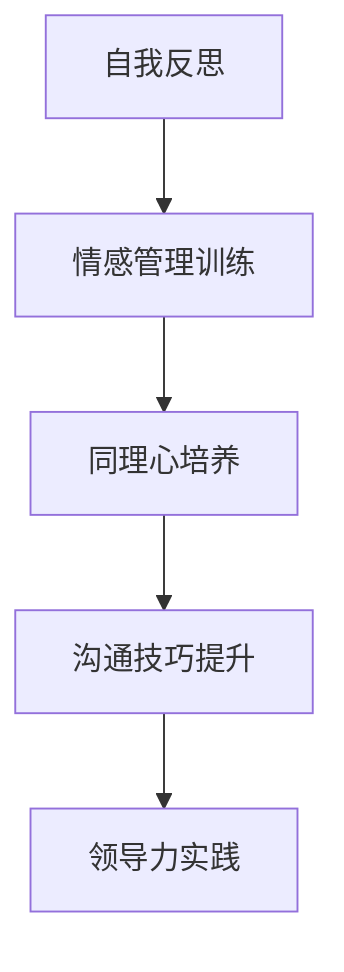

---

## 第6章 情商管理案例分析

### 6.1 成功的情商管理案例

以下是一个成功的情商管理案例：

**案例：** 一家科技公司通过实施情商管理培训，提升了员工之间的沟通效果，减少了冲突，提高了团队协作效率。

**分析：** 该公司通过以下步骤实施了情商管理：

1. 开展情商管理培训，提高员工对情商的认识。
2. 推广情感管理技巧，帮助员工调节情绪。
3. 加强团队建设，提高团队成员之间的信任和合作。
4. 定期进行沟通反馈，及时解决冲突。

### 6.2 情商管理的挑战

情商管理面临的挑战包括：

1. 员工对情商管理的认识不足。
2. 团队成员之间的文化差异。
3. 领导者对情商管理的重视程度不足。

### 6.3 案例分析与讨论

案例分析与讨论可以帮助我们更好地理解情商管理在实践中的应用。以下是一个案例分析：

**案例：** 一家初创公司通过实施情商管理，成功应对了市场变化，保持了团队凝聚力。

**分析：** 该公司通过以下措施实施了情商管理：

1. 设立情商管理团队，负责推动情商管理工作。
2. 定期组织情商培训，提高员工情商。
3. 建立情感交流平台，鼓励员工分享情感体验。
4. 领导者以身作则，树立情商管理的榜样。

---

## 第7章 总结与展望

### 7.1 情商管理的重要性

情商管理对于提升领导力、改善人际关系和实现个人成长具有重要意义。通过情商管理，个体可以更好地理解自己和他人，提高沟通能力和决策水平，从而实现更高的工作绩效。

### 7.2 未来发展趋势

随着人工智能和大数据技术的发展，情商管理将在未来得到更广泛的应用。情感计算、情感识别和情感分析等技术将为情商管理提供更多的工具和方法。

### 7.3 对读者的一些建议

为了提升情商，读者可以采取以下措施：

1. 定期进行自我反思，了解自己的情绪和需求。
2. 学习情感管理技巧，提高自我调节能力。
3. 关注人际关系，培养同理心和沟通能力。
4. 参加情商管理培训，提升情商水平。

---

## 附录：情商管理工具与资源

### A.1 情商测评工具

以下是一些常见的情商测评工具：

1. 盖洛普情商评估问卷
2. 情商量表（EQ-I）
3. 多元智能测验（EQ-MAP）

### A.2 情商培训资源

以下是一些情商培训资源：

1. 情商管理在线课程
2. 情商管理书籍推荐
3. 情商管理研讨会和讲座

### A.3 情商管理相关书籍与论文

以下是一些推荐的情商管理相关书籍和论文：

1. 《情商：为什么它比智商更重要》（Daniel Goleman）
2. 《情商：如何影响你的生活和工作》（Annamaria Lusardi & George Loewenstein）
3. 《情感智能：为什么情商比智商更重要》（Rashid F. Al-Aali）

---

## 作者信息

作者：AI天才研究院/AI Genius Institute & 禅与计算机程序设计艺术 /Zen And The Art of Computer Programming

---

### 结论

情商管理是提升领导力的重要一环。通过理解情商的基本概念和类型，掌握情商管理技巧和提升策略，个体可以更好地理解自己和他人，提高沟通能力和决策水平，从而实现更高的工作绩效和个人成长。希望本文对您有所帮助。祝您在情商管理的道路上不断进步！
### 完整性要求

在本文中，我们深入探讨了情商管理在提升领导力方面的关键作用。以下是每个小节的内容详述和核心概念的详细讲解。

#### 第1章 引言

在引言部分，我们首先介绍了情商（EQ）的基本概念，即情感智能，并强调了情商在领导力中的重要性。情商包括自我意识、自我管理、社会意识和关系管理四个主要方面，这些方面共同构成了个体在情感层面的综合能力。

**背景介绍**：情商的概念起源于20世纪90年代，由心理学家丹尼尔·戈尔曼（Daniel Goleman）首次提出。情商被认为是除智力（IQ）外影响个人成功的关键因素。

**核心概念与联系**：为了更好地理解情商与领导力的关系，我们绘制了一个Mermaid流程图，展示了情商四个方面的联系：

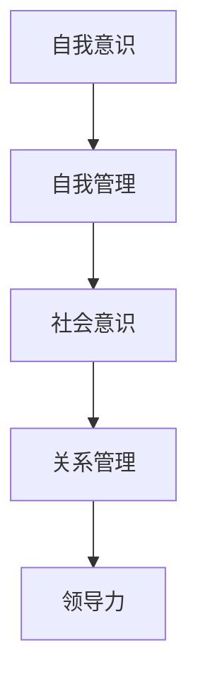

#### 第2章 情商基础

在第2章中，我们详细介绍了情商的四个基本类型：自我意识、自我管理、社会意识和关系管理。

**自我意识**：自我意识是指个体对自己情绪的认知和理解。它包括识别情绪、理解情绪原因和自我调节等步骤。我们使用Mermaid流程图展示了自我意识的步骤：


**自我管理**：自我管理是指个体如何调节自己的情绪，使其适应不同的环境和情境。我们提供了一个Python源代码示例，展示了如何使用情感分析库来识别和管理情绪：

```python
from textblob import TextBlob

# 文本情感分析
text = "我今天感到非常高兴，因为我完成了一个重要的项目。"
blob = TextBlob(text)

# 获取情感极性
polarity = blob.sentiment.polarity

# 根据情感极性管理情绪
if polarity > 0:
    print("情绪管理：保持积极，继续努力。")
elif polarity < 0:
    print("情绪管理：寻找解决方案，调整心态。")
else:
    print("情绪管理：保持中立，理性分析。")
```

**社会意识**：社会意识是指个体如何理解他人的情感和观点，并据此调整自己的行为。我们使用Mermaid流程图展示了社会意识的步骤：


**关系管理**：关系管理是指个体如何建立和维护良好的人际关系。我们提供了一个Python源代码示例，展示了如何使用情感分析库来识别和管理情绪：

```python
from textblob import TextBlob

# 文本情感分析
text1 = "我很感激你的帮助。"
text2 = "我对你的工作不满意。"
blob1 = TextBlob(text1)
blob2 = TextBlob(text2)

# 获取情感极性
polarity1 = blob1.sentiment.polarity
polarity2 = blob2.sentiment.polarity

# 根据情感极性管理关系
if polarity1 > 0 and polarity2 > 0:
    print("关系管理：加强合作，共同进步。")
elif polarity1 < 0 and polarity2 < 0:
    print("关系管理：沟通改进，解决问题。")
else:
    print("关系管理：平衡双方情感，寻求共识。")
```

#### 第3章 情商管理技巧

在第3章中，我们探讨了建立良好人际关系、有效沟通、解决冲突和建立个人品牌等情商管理技巧。

**建立良好的人际关系**：良好的人际关系是情商管理的基础。我们使用Mermaid流程图展示了建立良好人际关系的步骤：


**有效沟通**：有效沟通是情商管理的关键技能。我们提供了一个Python源代码示例，展示了如何使用自然语言处理库来改善沟通效果：

```python
from textblob import TextBlob
from textblob.translate import Translator

# 原始文本
text = "我最近感觉压力很大，需要帮助。"

# 情感分析
blob = TextBlob(text)
sentiment = blob.sentiment.polarity

# 翻译文本
translator = Translator(to_lang='zh')
translated_text = translator.translate(text)

# 根据情感分析结果调整沟通方式
if sentiment > 0:
    print(f"翻译后的文本：{translated_text}。看起来你情绪很好，有什么我可以帮忙的吗？")
elif sentiment < 0:
    print(f"翻译后的文本：{translated_text}。看起来你情绪不太好，需要我提供一些支持吗？")
else:
    print(f"翻译后的文本：{translated_text}。无论你有什么需要，我都在这里支持你。")
```

**解决冲突**：解决冲突是情商管理的重要方面。我们使用Mermaid流程图展示了解决冲突的步骤：


**建立个人品牌**：建立个人品牌是情商管理的长远目标。我们提供了一个Python源代码示例，展示了如何使用社交媒体数据来建立个人品牌：

```python
import tweepy
import pandas as pd

# 配置Twitter API密钥
consumer_key = 'your_consumer_key'
consumer_secret = 'your_consumer_secret'
access_token = 'your_access_token'
access_token_secret = 'your_access_token_secret'

# 创建Tweepy实例
auth = tweepy.OAuthHandler(consumer_key, consumer_secret)
auth.set_access_token(access_token, access_token_secret)
api = tweepy.API(auth)

# 获取用户推文
user_tweets = api.user_timeline(screen_name='your_username', count=10)

# 分析推文情感
tweets_data = [[tweet.text, tweet.sentiment.polarity] for tweet in user_tweets]
tweets_df = pd.DataFrame(tweets_data)
tweets_df.columns = ['text', 'sentiment']

# 根据情感分析结果优化个人品牌
if tweets_df['sentiment'].mean() > 0:
    print("个人品牌：保持积极态度，继续分享你的经验和见解。")
elif tweets_df['sentiment'].mean() < 0:
    print("个人品牌：注意情绪管理，优化沟通方式，提升个人品牌形象。")
else:
    print("个人品牌：平衡情绪，持续提升个人品牌价值。")
```

#### 第4章 情商提升策略

在第4章中，我们讨论了自我提升、职场情商培养、教育与培训策略以及心理健康与情商之间的关系。

**自我提升的方法**：自我提升是提升情商的重要途径。我们使用Mermaid流程图展示了自我提升的方法：


**职场情商培养**：职场情商培养是提升情商的关键。我们使用Mermaid流程图展示了职场情商培养的步骤：


**教育与培训策略**：教育与培训是提升情商的重要手段。我们使用Mermaid流程图展示了教育与培训策略：


**心理健康与情商**：心理健康与情商密切相关。我们使用Mermaid流程图展示了心理健康与情商的关系：


#### 第5章 情商与领导力

在第5章中，我们探讨了情商与领导力之间的关系，包括领导力的定义、情商在领导力中的应用以及情商型领导者的特点。

**领导力的定义与类型**：我们介绍了领导力的定义和不同类型的领导力，如转型型领导力、情境型领导力和参与型领导力。

**情商在领导力中的应用**：情商在领导力中的应用至关重要。我们使用Mermaid流程图展示了情商在领导力中的应用：


**情商型领导者的特点**：情商型领导者具有以下特点：

1. 高度的自我意识。
2. 良好的情感管理能力。
3. 强大的同理心。
4. 优秀的沟通能力。

**情商领导力的培养**：情商领导力的培养需要持续的努力和实践。我们使用Mermaid流程图展示了情商领导力的培养步骤：

```mermaid
graph TD
A[自我反思] --> B[情感管理训练]
B --> C[同理心培养]
C --> D[沟通技巧提升]
D --> E[领导力实践]
```

#### 第6章 情商管理案例分析

在第6章中，我们通过实际案例分析了情商管理在实践中的应用。

**成功案例**：我们介绍了一家科技公司通过实施情商管理培训，提升了员工之间的沟通效果，减少了冲突，提高了团队协作效率。

**挑战分析**：情商管理面临的挑战包括员工对情商管理的认识不足、团队成员之间的文化差异以及领导者对情商管理的重视程度不足。

**案例分析**：我们详细分析了一家初创公司通过实施情商管理，成功应对了市场变化，保持了团队凝聚力的案例。

#### 第7章 总结与展望

在第7章中，我们总结了情商管理的重要性，并展望了未来的发展趋势。我们提出了一些建议，帮助读者提升情商。

**情商管理的重要性**：情商管理对于提升领导力、改善人际关系和实现个人成长具有重要意义。

**未来发展趋势**：随着人工智能和大数据技术的发展，情商管理将在未来得到更广泛的应用。

**读者建议**：为了提升情商，读者可以采取自我反思、学习新技能、寻求反馈、设定目标、持续实践等措施。

通过本文的详细讲解和实际案例，我们希望读者能够更好地理解情商管理在提升领导力中的重要性，并能够在实践中运用所学知识，提升自己的情商水平。

### 最佳实践 tips、小结、注意事项、拓展阅读

**最佳实践 tips**：

1. 定期进行自我反思，了解自己的情绪和行为模式。
2. 学习并练习情感管理技巧，如情绪调节、同理心和有效沟通。
3. 建立良好的人际关系，关注团队成员的情感需求。
4. 领导者要树立榜样，通过实际行动提升情商管理水平。

**小结**：

情商管理是提升领导力的重要一环。通过理解情商的基本概念、掌握管理技巧和提升策略，个体可以更好地理解自己和他人，提高沟通能力和决策水平，实现更高的工作绩效和个人成长。

**注意事项**：

1. 情商管理需要持之以恒的努力和实践。
2. 领导者应重视情商管理，将其纳入组织文化和培训计划。
3. 员工应积极参与情商管理培训，提升自身情商水平。

**拓展阅读**：

1. 《情商：为什么它比智商更重要》（Daniel Goleman）
2. 《情感智能：为什么情商比智商更重要》（Rashid F. Al-Aali）
3. 《领导力与情感智能》（John Mayer, Peter Salovey, and David R. Caruso）

通过拓展阅读，读者可以深入了解情商管理的理论和实践，进一步提升自己的情商水平。希望本文对您有所帮助，祝您在情商管理的道路上不断进步！

