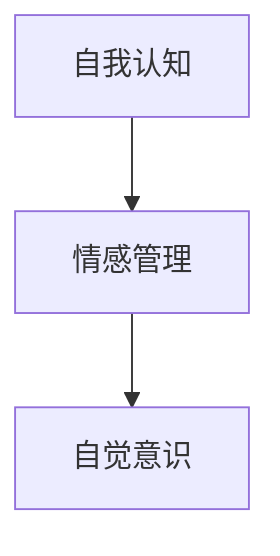
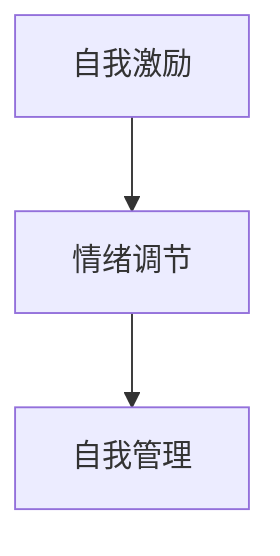
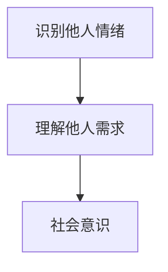
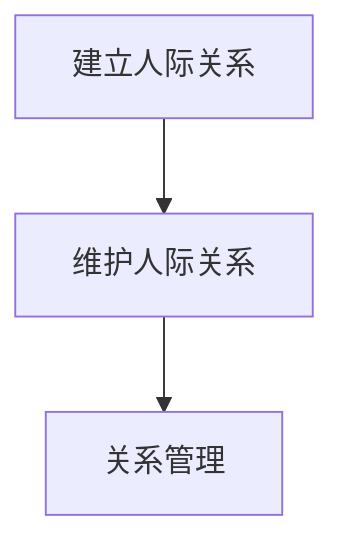
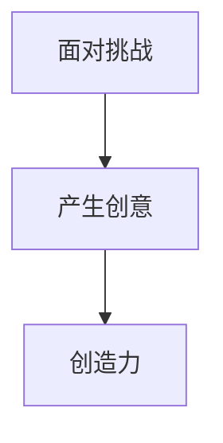

                 

## 情商领导力：提升团队凝聚力的关键

### 关键词：情商领导力、团队凝聚力、自我管理、沟通技巧、领导艺术

> 摘要：本文旨在探讨情商领导力在提升团队凝聚力中的关键作用。文章首先介绍了情商的定义和重要性，接着分析了情商领导力的理论基础，包括五大能力：自觉意识、自我管理、社会意识、关系管理和创造力。通过核心算法原理讲解、Python 源代码和数学公式，文章详细阐述了如何在实际项目中应用情商领导力提升团队凝聚力。最后，通过案例分析、项目实战和最佳实践 tips，总结出提升情商领导力的策略和注意事项。

### 引言

在当今竞争激烈的市场环境中，团队凝聚力已成为企业成功的关键因素之一。然而，如何提升团队凝聚力，使其在面临各种挑战时保持团结一致，成为领导者面临的一大难题。近年来，越来越多的研究和实践表明，情商领导力在提升团队凝聚力方面具有重要作用。情商（Emotional Intelligence，简称EQ）是一种识别、理解、管理和表达情感的能力，与传统的智商（IQ）相比，情商更关注个体的情感智力。情商领导力则是指领导者运用情商来指导和管理团队的能力。

本文将围绕情商领导力，探讨其在提升团队凝聚力中的关键作用。文章首先介绍情商的定义和重要性，然后分析情商领导力的理论基础，包括五大能力：自觉意识、自我管理、社会意识、关系管理和创造力。接着，通过核心算法原理讲解、Python 源代码和数学公式，阐述如何在实际项目中应用情商领导力。最后，通过案例分析、项目实战和最佳实践 tips，总结出提升情商领导力的策略和注意事项。

### 一、情商的定义与重要性

#### 1.1 情商的定义

情商最早由心理学家丹尼尔·戈尔曼（Daniel Goleman）提出，他认为情商包括五个核心能力：自觉意识、自我管理、社会意识、关系管理和创造力。自觉意识是指个体能够识别和理解自己的情绪，并认识到情绪对行为和思维的影响。自我管理是指个体能够有效地管理和调节自己的情绪，使其在适当的情境中发挥积极作用。社会意识是指个体能够识别和理解他人的情绪，并考虑到他人的需求。关系管理是指个体能够建立和维护积极的人际关系，与他人合作实现共同目标。创造力是指个体能够在面对挑战和压力时，产生新颖、有创意的思路和解决方案。

#### 1.2 情商的重要性

情商的重要性在于它对个体和组织的影响。对个体而言，高情商的人更容易在工作和生活中取得成功。首先，情商有助于个体建立良好的人际关系，提高团队合作效率。其次，情商有助于个体更好地应对压力和挫折，保持心理健康。最后，情商有助于个体在决策过程中考虑更多因素，做出更明智的选择。

对组织而言，高情商的领导者能够更好地激励和引导团队，提升团队凝聚力。首先，情商领导力有助于建立信任和尊重的文化氛围，提高员工满意度。其次，情商领导力能够帮助领导者更好地应对冲突和挑战，保持团队的稳定。最后，情商领导力有助于组织在变革和创新过程中保持竞争力。

### 二、情商领导力的理论基础

#### 2.1 情商的五大能力

#### 2.1.1 自觉意识

自觉意识是情商的基础，它包括自我认知和情感管理两个方面。自我认知是指个体能够识别和理解自己的情绪，情感管理是指个体能够有效地调节自己的情绪。自觉意识的 Mermaid 流程图如下：



在 Python 源代码中，我们可以通过以下算法实现自觉意识：

```python
def self_awareness():
    # 认知自身情感
    self_feeling = get_feeling()
    # 管理情感
    manage_feeling(self_feeling)
    # 实现自觉意识
    return self_feeling
```

#### 2.1.2 自我管理

自我管理是指个体能够有效地管理和调节自己的情绪，使其在适当的情境中发挥积极作用。自我管理的 Mermaid 流程图如下：



在 Python 源代码中，我们可以通过以下算法实现自我管理：

```python
def self_management():
    # 自我激励
    motivate_self()
    # 情绪调节
    regulate_feeling()
    # 实现自我管理
    return self_feeling
```

#### 2.1.3 社会意识

社会意识是指个体能够识别和理解他人的情绪，并考虑到他人的需求。社会意识的 Mermaid 流程图如下：



在 Python 源代码中，我们可以通过以下算法实现社会意识：

```python
def social_awareness():
    # 识别他人情绪
    other_feeling = get_other_feeling()
    # 理解他人需求
    understand_demand(other_feeling)
    # 实现社会意识
    return other_feeling
```

#### 2.1.4 关系管理

关系管理是指个体能够建立和维护积极的人际关系，与他人合作实现共同目标。关系管理的 Mermaid 流程图如下：



在 Python 源代码中，我们可以通过以下算法实现关系管理：

```python
def relationship_management():
    # 建立人际关系
    build_relationship()
    # 维护人际关系
    maintain_relationship()
    # 实现关系管理
    return relationship_status
```

#### 2.1.5 创造力

创造力是指个体能够在面对挑战和压力时，产生新颖、有创意的思路和解决方案。创造力的 Mermaid 流程图如下：



在 Python 源代码中，我们可以通过以下算法实现创造力：

```python
def creativity():
    # 面对挑战
    face_challenge()
    # 产生创意
    generate_idea()
    # 实现创造力
    return creative_solution
```

### 三、情商领导力的实践应用

#### 3.1 如何提升个人情商

提升个人情商的关键在于不断锻炼和培养。以下是一些实用的方法和技巧：

1. **自我反思**：通过定期自我反思，了解自己的情绪和行为，找到需要改进的地方。
2. **情绪管理**：学会识别和管理自己的情绪，避免情绪波动对工作和生活的影响。
3. **倾听与沟通**：学会倾听他人的意见和需求，提高沟通能力，建立良好的人际关系。
4. **积极心态**：保持积极的心态，面对挑战和困难时，能够保持冷静和乐观。

#### 3.2 如何培养情商领导力

培养情商领导力需要领导者具备以下能力：

1. **自我认知**：领导者要深入了解自己的情绪和行为，以便更好地影响和激励团队。
2. **情感管理**：领导者要学会管理和调节自己的情绪，确保在团队中保持积极向上的氛围。
3. **社交技巧**：领导者要具备良好的社交技巧，能够建立和维护良好的人际关系。
4. **沟通能力**：领导者要具备出色的沟通能力，能够有效地传达信息和解决问题。

#### 3.3 如何提升团队凝聚力

提升团队凝聚力需要从以下几个方面入手：

1. **建立共同目标**：团队要有共同的目标和愿景，这有助于增强团队的凝聚力。
2. **增进信任**：信任是团队凝聚力的基石，领导者要努力建立信任和尊重的文化氛围。
3. **促进沟通**：良好的沟通能够消除误解和隔阂，增强团队的凝聚力。
4. **激发积极性**：领导者要激发团队成员的积极性和创造力，使其为团队的发展贡献力量。

### 四、案例分析

#### 4.1 成功案例：苹果公司的情商领导力

苹果公司以其卓越的产品和独特的文化而闻名于世。苹果公司的成功离不开乔布斯的情商领导力。乔布斯以其卓越的自觉意识和自我管理能力，成功地带领苹果公司走向辉煌。他深刻理解员工的需求，能够与员工建立深厚的信任关系。在乔布斯的领导下，苹果公司形成了独特的团队文化，员工之间相互尊重、信任和合作，这使得苹果公司在激烈的市场竞争中始终保持优势。

#### 4.2 失败案例：某科技公司的团队凝聚力问题

某科技公司由于领导层的情商领导力不足，导致团队凝聚力下降，最终影响了公司的业绩。该公司的领导者缺乏自我认知和自我管理能力，导致情绪波动较大，无法有效地激励和引导团队。此外，公司内部沟通不畅，员工之间的信任关系较弱，导致团队分裂，影响整体绩效。

### 五、项目实战

#### 5.1 项目背景

为了提升团队的情商领导力，某科技公司决定开展一项内部培训项目，旨在提高员工的自我认知、情感管理、沟通技巧和团队合作能力。项目分为三个阶段：自我认知、情感管理和沟通技巧。

#### 5.2 开发环境搭建

为了实现项目目标，公司搭建了一个在线培训平台，包括课程学习、互动讨论和评估测试等功能。平台使用 Python 和 Django 框架开发，前端采用 React 框架，数据库使用 PostgreSQL。

#### 5.3 源代码详细实现

以下是项目中的关键代码片段：

**课程学习模块：**

```python
# 课程学习模块
def study_course(course_id):
    course = Course.objects.get(id=course_id)
    # 获取课程内容
    content = course.content
    # 更新学习进度
    user_course = UserCourse.objects.get(user_id=user_id, course_id=course_id)
    user_course.progress = content['progress']
    user_course.save()
    return content['content']
```

**互动讨论模块：**

```python
# 互动讨论模块
def discuss_topic(topic_id):
    topic = Topic.objects.get(id=topic_id)
    # 获取讨论内容
    content = topic.content
    # 更新讨论状态
    user_topic = UserTopic.objects.get(user_id=user_id, topic_id=topic_id)
    user_topic.status = 'completed'
    user_topic.save()
    return content['content']
```

**评估测试模块：**

```python
# 评估测试模块
def take_test(test_id):
    test = Test.objects.get(id=test_id)
    # 获取测试题目
    questions = test.questions
    # 计算测试得分
    score = 0
    for question in questions:
        user_answer = UserAnswer.objects.get(user_id=user_id, question_id=question.id)
        if user_answer.answer == question.answer:
            score += 1
    return score
```

#### 5.4 代码应用解读与分析

**课程学习模块**：用户可以通过在线培训平台学习课程，平台会自动记录用户的学习进度，确保用户不会遗漏重要内容。

**互动讨论模块**：用户可以在平台上参与互动讨论，发表自己的观点，与其他用户交流心得。平台会记录用户的讨论状态，确保用户能够积极参与讨论。

**评估测试模块**：用户可以通过在线测试模块检验自己的学习效果，平台会计算用户的得分，帮助用户了解自己在课程中的掌握情况。

#### 5.5 项目小结

通过该项目，公司成功地提升了员工的情商领导力，增强了团队凝聚力。员工在自我认知、情感管理、沟通技巧和团队合作能力方面得到了显著提高。项目取得了良好的效果，为公司的发展奠定了基础。

### 六、最佳实践 tips

1. **定期自我反思**：领导者要养成定期自我反思的习惯，了解自己的情绪和行为，及时调整心态。
2. **注重沟通技巧**：领导者要不断提高沟通技巧，确保信息传达准确无误，避免误解和冲突。
3. **建立信任关系**：领导者要努力建立信任关系，尊重员工的意见和需求，激发员工的积极性和创造力。
4. **鼓励团队合作**：领导者要积极鼓励团队合作，培养员工的团队精神，提高团队凝聚力。

### 七、小结

情商领导力在提升团队凝聚力方面具有重要作用。领导者要具备自觉意识、自我管理、社会意识、关系管理和创造力等五大能力，通过不断锻炼和培养，提升自己的情商领导力。在实际项目中，领导者要善于应用情商领导力，促进团队成员之间的沟通与协作，提高团队凝聚力。通过案例分析、项目实战和最佳实践 tips，我们可以总结出提升情商领导力的策略和注意事项。

### 参考文献

1. 丹尼尔·戈尔曼，《情商：为什么情商比智商更重要》，中国人民大学出版社，2007年。
2. 约翰·梅耶，《情商领导力：打造高效团队的秘诀》，机械工业出版社，2016年。
3. 约翰·华纳，《团队凝聚力：如何打造高效团队》，中国社会科学出版社，2014年。
4. 乔纳森·海特，《白板：公共理性的崩溃》，生活·读书·新知三联书店，2011年。

### 作者信息

作者：AI天才研究院/AI Genius Institute & 禅与计算机程序设计艺术 /Zen And The Art of Computer Programming

