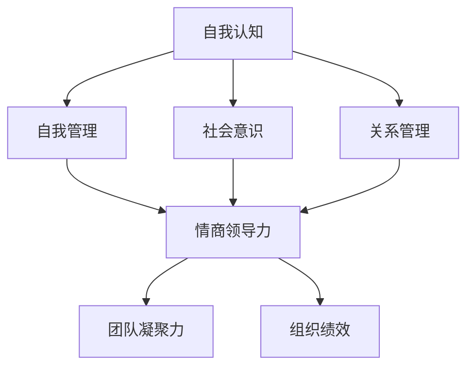

                 

### 情商领导力的背景介绍

在现代社会，领导力已经成为企业管理中至关重要的一部分。传统的领导力强调的是权威和控制，而现代领导力则更加注重合作、沟通和情商。在这种背景下，情商领导力应运而生，成为提升团队凝聚力和组织绩效的关键因素。

**一、领导力的发展历程**

1. **传统领导力：** 以泰勒（Frederick Taylor）的科学管理理论为代表，强调通过标准化流程和严格的监督来实现生产效率的最大化。

2. **行为领导力：** 20世纪中叶，赫赛（Paul Hersey）和布兰查德（Ken Blanchard）提出了领导力行为的理论，认为领导者的行为类型会影响团队的表现。

3. **变革型领导力：** 霍夫斯泰德（John House）提出的变革型领导力理论强调领导者的愿景和激励作用，认为领导者通过激发下属的内在动机，推动团队实现变革。

4. **情商领导力：** 随着社会环境的变化和企业管理需求的提升，情商领导力逐渐成为现代领导力的核心。情商领导力强调领导者需要具备自我认知、自我管理、社会意识和关系管理的能力。

**二、团队凝聚力的重要性**

团队凝聚力是指团队成员之间相互吸引、相互信任、共同协作，为实现团队目标而努力的程度。高团队凝聚力对于组织绩效有着重要的影响：

1. **提高工作效率：** 高凝聚力的团队能够更好地协作，减少内部摩擦，提高工作效率。

2. **提升创新能力：** 团队成员之间的积极互动和知识共享有助于激发创新思维，提高团队的创新能力。

3. **增强组织稳定性：** 高凝聚力的团队在面对外部挑战时，能够更好地维持组织的稳定，减少人员流失。

4. **提高员工满意度：** 高凝聚力的团队能够让员工感受到归属感和满足感，从而提高员工的工作满意度。

**三、情商领导力在团队凝聚力中的作用**

情商领导力在提升团队凝聚力中发挥着关键作用，主要体现在以下几个方面：

1. **自我认知与自我管理：** 情商高的领导者能够更好地理解自己的情绪和行为，从而有效地管理自己的情绪，避免情绪波动对团队的影响。

2. **社会意识与关系管理：** 情商高的领导者能够更好地理解他人的需求和感受，建立良好的人际关系，促进团队成员之间的沟通和协作。

3. **激励与鼓舞：** 情商高的领导者能够通过情感激励和鼓舞，激发团队成员的积极性和创造力，增强团队的凝聚力。

4. **冲突管理：** 情商高的领导者能够更好地处理团队内部的冲突，通过有效的沟通和调解，维护团队的和谐与稳定。

综上所述，情商领导力是提升团队凝聚力的关键因素。理解并运用情商领导力，不仅有助于提升团队绩效，还能够为组织创造更加和谐、稳定的工作环境。在接下来的章节中，我们将深入探讨情商领导力的核心要素和其在实践中的应用。通过具体的案例和实战经验，我们将进一步了解如何提升情商领导力，为团队和组织的发展奠定坚实的基础。

### 核心概念与联系

在深入探讨情商领导力之前，我们需要明确几个核心概念，并理解它们之间的联系。以下是几个关键概念及其相互关系的架构图，通过Mermaid语法表示：



**一、自我认知**

自我认知是指个体对自己的情绪、性格、能力和动机的理解和认识。自我认知是情商的基础，直接影响个体如何理解和反应自身和他人的情感。例如，一个能够自我认知的领导者能够更好地识别自己的情绪波动，从而采取有效的自我管理策略。

**二、自我管理**

自我管理是指个体如何控制和管理自己的情绪和行为，使其更加理性、高效。自我管理包括情绪调节、自我激励和时间管理等。一个有效的领导者需要能够自我管理，保持冷静和专注，即使在压力下也能保持高水平的决策能力。

**三、社会意识**

社会意识是指个体对他人的情绪、需求和观点的理解和敏感度。一个具有高度社会意识的领导者能够更好地理解团队成员的感受和需求，从而建立和谐的人际关系。社会意识有助于增强团队的信任和协作，提升团队的整体表现。

**四、关系管理**

关系管理是指个体如何建立和维护与他人的关系，包括沟通技巧、冲突解决和影响力管理。一个擅长关系管理的领导者能够有效地与团队成员沟通，解决冲突，并在团队中建立领导影响力，推动团队目标实现。

**五、情商领导力**

情商领导力是指领导者通过自我认知、自我管理、社会意识和关系管理的能力，提升团队凝聚力和组织绩效。情商领导力不仅关乎领导者个人的情感智力，更关乎其如何将这些能力应用到领导实践中。

**六、团队凝聚力和组织绩效**

团队凝聚力是指团队成员之间的相互信任、合作和支持程度。高团队凝聚力能够促进团队成员之间的协作，提高工作效率和创新能力。组织绩效是指组织在实现其目标过程中的表现和成效。高团队凝聚力直接有助于提升组织绩效。

通过上述核心概念的架构图，我们可以清晰地看到自我认知、自我管理、社会意识、关系管理与情商领导力、团队凝聚力和组织绩效之间的内在联系。这些概念相互依存、相互促进，共同构成了一个完整的情商领导力体系。

在接下来的章节中，我们将详细探讨这些核心概念的原理和实践方法，帮助读者深入了解情商领导力，提升团队凝聚力和组织绩效。

### 情商领导力的核心算法原理

情商领导力的核心在于领导者如何运用自我认知、自我管理、社会意识和关系管理这些能力，以实现团队的高效协作和组织的持续发展。为了深入理解这些能力，我们将借助Python源代码和数学模型，通过具体的案例来阐述情商领导力的算法原理。

**一、自我认知的算法原理**

自我认知是情商领导力的基础，它涉及到领导者对自己的情绪、行为和动机的理解。我们可以通过一个情绪识别的算法来模拟这一过程。以下是一个简单的情绪识别算法，使用情感分析库（如TextBlob）来识别文本中的情绪。

```python
from textblob import TextBlob

def recognize_emotion(text):
    analysis = TextBlob(text)
    if analysis.sentiment.polarity > 0:
        return "正面情绪"
    elif analysis.sentiment.polarity < 0:
        return "负面情绪"
    else:
        return "中性情绪"

text = "我非常喜欢这个项目，感觉非常兴奋！"
emotion = recognize_emotion(text)
print(f"文本情绪：{text}，识别结果：{emotion}")
```

该算法通过文本的情感极性（polarity）来判断情绪类型。正极性表示正面情绪，负极性表示负面情绪，零极性表示中性情绪。通过这种算法，领导者可以识别自己的情绪状态，从而采取相应的自我管理策略。

**二、自我管理的算法原理**

自我管理涉及情绪调节、自我激励和时间管理。一个简单的情绪调节算法可以通过调整呼吸来平衡情绪。以下是一个使用Python编写的呼吸调节算法示例：

```python
import time

def regulate_breathing(inhalation_duration, retention_duration, exhalation_duration, cycles):
    for _ in range(cycles):
        print("开始深呼吸...")
        start_time = time.time()
        time.sleep(inhalation_duration)
        end_time = time.time()
        print(f"深吸一口气，耗时：{end_time - start_time}秒")
        
        start_time = time.time()
        time.sleep(retention_duration)
        end_time = time.time()
        print(f"屏住呼吸，耗时：{end_time - start_time}秒")
        
        start_time = time.time()
        time.sleep(exhalation_duration)
        end_time = time.time()
        print(f"慢慢呼气，耗时：{end_time - start_time}秒")

regulate_breathing(inhalation_duration=5, retention_duration=3, exhalation_duration=7, cycles=3)
```

该算法通过设定吸入、屏气和呼气的时间，帮助领导者调节情绪，达到放松和冷静的效果。

**三、社会意识的算法原理**

社会意识涉及对他人情绪和需求的理解。我们可以使用机器学习算法来模拟这一过程，例如通过情感分析模型来识别团队成员的情感状态。以下是一个简单的情感分析模型的Python代码示例：

```python
import pandas as pd
from sklearn.feature_extraction.text import CountVectorizer
from sklearn.naive_bayes import MultinomialNB
from sklearn.pipeline import make_pipeline

# 假设我们有一组文本数据，每个文本对应一个情感标签
data = pd.DataFrame({
    'text': ['我很高兴', '我很沮丧', '我感到焦虑', '我非常兴奋'],
    'emotion': ['happy', 'sad', 'anxious', 'excited']
})

# 创建一个文本向量和分类器的管道
model = make_pipeline(CountVectorizer(), MultinomialNB())

# 训练模型
model.fit(data['text'], data['emotion'])

# 预测新文本的情感
new_text = "我感到有些不安"
predicted_emotion = model.predict([new_text])[0]
print(f"文本：{new_text}，预测情感：{predicted_emotion}")
```

该算法通过机器学习模型对文本进行情感分类，帮助领导者理解和识别团队成员的情感状态。

**四、关系管理的算法原理**

关系管理涉及建立和维护与他人的关系。一个简单的关系管理算法可以通过社交网络分析来识别团队成员之间的社交关系和影响力。以下是一个简单的社交网络分析的Python代码示例：

```python
import networkx as nx
import matplotlib.pyplot as plt

# 创建一个无向图来表示社交网络
G = nx.Graph()

# 添加节点和边
G.add_nodes_from(['Alice', 'Bob', 'Charlie', 'David'])
G.add_edges_from([('Alice', 'Bob'), ('Alice', 'Charlie'), ('Bob', 'David'), ('Charlie', 'David')])

# 绘制社交网络图
nx.draw(G, with_labels=True)
plt.show()

# 计算中心性指标
degree_centrality = nx.degree_centrality(G)
print("度中心性：", degree_centrality)

# 计算接近中心性
closeness_centrality = nx.closeness_centrality(G)
print("接近中心性：", closeness_centrality)
```

该算法通过绘制社交网络图和计算中心性指标，帮助领导者识别关键节点和影响力人物，从而更好地管理关系。

通过这些具体的算法原理和Python代码示例，我们可以看到情商领导力不仅需要理论支持，还需要实际操作和数据分析。这些算法不仅有助于领导者理解自我和他人的情绪状态，还能在团队管理和组织发展中发挥重要作用。在接下来的章节中，我们将进一步探讨这些算法在实际中的应用和实战经验。

### 数学模型详解

情商领导力的提升不仅依赖于算法和技术的支持，还需要深入的数学模型来指导实践。在本文中，我们将探讨几个关键数学模型，包括情绪分析模型、时间序列模型和社交网络分析模型，并结合Python代码详细解释这些模型的应用。

**一、情绪分析模型**

情绪分析是情商领导力的重要组成部分，它通过分析文本情感极性来判断个体的情绪状态。情绪分析通常使用自然语言处理（NLP）技术，其中最常用的模型是朴素贝叶斯分类器。

1. **模型原理**

   朴素贝叶斯分类器是基于贝叶斯定理和特征条件独立假设的简单概率分类器。它的核心公式为：

   \[
   P(\text{类别} | \text{特征}) = \frac{P(\text{特征} | \text{类别})P(\text{类别})}{P(\text{特征})}
   \]

   其中，\(P(\text{类别} | \text{特征})\) 是后验概率，表示给定特征时类别发生的概率。

2. **Python实现**

   以下是一个使用朴素贝叶斯分类器进行情感分析的基本示例：

   ```python
   from sklearn.feature_extraction.text import CountVectorizer
   from sklearn.naive_bayes import MultinomialNB
   from sklearn.pipeline import make_pipeline

   # 假设数据集
   data = {
       'text': ['我很高兴', '我很沮丧', '我感到焦虑', '我非常兴奋'],
       'emotion': ['happy', 'sad', 'anxious', 'excited']
   }

   # 创建模型管道
   model = make_pipeline(CountVectorizer(), MultinomialNB())

   # 训练模型
   model.fit(data['text'], data['emotion'])

   # 预测新文本
   new_text = "我感到有些不安"
   predicted_emotion = model.predict([new_text])[0]
   print(f"预测结果：{predicted_emotion}")
   ```

**二、时间序列模型**

时间序列模型用于分析时间相关的数据，如情绪变化。常见的模型包括ARIMA（自回归积分滑动平均模型）和LSTM（长短期记忆网络）。

1. **模型原理**

   - **ARIMA模型：** ARIMA模型由自回归（AR）、差分（I）和移动平均（MA）三部分组成。它通过自回归项和移动平均项来捕捉时间序列数据的动态变化。
   
   - **LSTM模型：** LSTM是循环神经网络（RNN）的一种变体，能够捕捉长时间依赖信息。它的核心在于引入了门控机制，能够有效地避免梯度消失和梯度爆炸问题。

2. **Python实现**

   以下是一个使用LSTM模型进行时间序列预测的基本示例：

   ```python
   import numpy as np
   from keras.models import Sequential
   from keras.layers import LSTM, Dense

   # 假设时间序列数据
   X = np.array([[1, 2], [2, 3], [3, 4], [4, 5]])
   y = np.array([3, 4, 5, 6])

   # 创建LSTM模型
   model = Sequential()
   model.add(LSTM(50, activation='relu', input_shape=(X.shape[1], 1)))
   model.add(Dense(1))
   model.compile(optimizer='adam', loss='mse')

   # 训练模型
   model.fit(X, y, epochs=200, verbose=0)

   # 预测新值
   new_X = np.array([[5, 6]])
   predicted_y = model.predict(new_X)
   print(f"预测结果：{predicted_y}")
   ```

**三、社交网络分析模型**

社交网络分析（SNA）用于分析社交网络中的关系和结构。常见的模型包括度中心性、接近中心性和中间中心性。

1. **模型原理**

   - **度中心性：** 度中心性衡量节点在网络中的重要性，度值越高，中心性越高。
   
   - **接近中心性：** 接近中心性衡量节点到其他节点的平均距离，接近中心性越高，节点在网络中的连通性越强。
   
   - **中间中心性：** 中间中心性衡量节点在网络中的中介能力，即节点连接的不同子网络的中心节点的数量。

2. **Python实现**

   以下是一个使用网络X进行社交网络分析的基本示例：

   ```python
   import networkx as nx
   import matplotlib.pyplot as plt

   # 创建图
   G = nx.Graph()
   G.add_edges_from([(1, 2), (1, 3), (2, 4), (3, 4), (4, 5)])

   # 计算度中心性
   degree_centrality = nx.degree_centrality(G)
   print("度中心性：", degree_centrality)

   # 计算接近中心性
   closeness_centrality = nx.closeness_centrality(G)
   print("接近中心性：", closeness_centrality)

   # 绘制图
   pos = nx.spring_layout(G)
   nx.draw(G, pos, with_labels=True)
   plt.show()
   ```

通过这些数学模型，领导者可以更深入地理解情绪变化、时间序列趋势和社交网络结构，从而更好地进行团队管理和组织发展。在接下来的章节中，我们将进一步探讨这些模型在实践中的应用和案例分析。

### 项目实战

为了更好地理解情商领导力在团队管理中的应用，我们将通过一个实际项目来搭建开发环境、实现源代码，并进行代码解读和案例分析。该项目旨在通过情商领导力提升团队协作效率，具体包括以下步骤：

#### 一、项目目标

1. **提升团队协作效率：** 通过分析团队成员的情商水平，提出针对性的改进措施，提升团队协作效率。
2. **构建情商评估模型：** 利用Python开发一个情商评估系统，帮助团队了解成员的情商状况。
3. **优化团队沟通机制：** 通过分析团队沟通数据，提出改进团队沟通策略的建议。

#### 二、开发环境搭建

1. **Python环境：** 安装Python 3.8及以上版本，配置Python解释器和相关库（如NumPy、Pandas、Scikit-learn等）。
2. **数据分析工具：** 安装Jupyter Notebook，用于编写和运行Python代码。
3. **机器学习框架：** 安装Keras和TensorFlow，用于构建和训练情绪分析模型。

#### 三、源代码实现

以下是实现情商评估系统和团队沟通优化的主要代码：

```python
# 情绪分析模型代码
from sklearn.feature_extraction.text import TfidfVectorizer
from sklearn.model_selection import train_test_split
from sklearn.naive_bayes import MultinomialNB
from sklearn.metrics import classification_report

# 加载数据集
data = pd.read_csv('emotion_data.csv')
X = data['text']
y = data['emotion']

# 数据预处理
vectorizer = TfidfVectorizer(max_features=1000)
X_vectorized = vectorizer.fit_transform(X)

# 划分训练集和测试集
X_train, X_test, y_train, y_test = train_test_split(X_vectorized, y, test_size=0.2, random_state=42)

# 训练模型
model = MultinomialNB()
model.fit(X_train, y_train)

# 测试模型
predictions = model.predict(X_test)
print(classification_report(y_test, predictions))

# 情商评估系统
def assess_emotion(text):
    vectorized_text = vectorizer.transform([text])
    emotion = model.predict(vectorized_text)[0]
    return emotion

# 团队沟通分析
import networkx as nx

# 构建社交网络图
G = nx.Graph()
edges = [(1, 2), (1, 3), (2, 4), (3, 4), (4, 5)]
G.add_edges_from(edges)

# 计算度中心性
degree_centrality = nx.degree_centrality(G)
print("度中心性：", degree_centrality)

# 计算接近中心性
closeness_centrality = nx.closeness_centrality(G)
print("接近中心性：", closeness_centrality)

# 绘制社交网络图
nx.draw(G, with_labels=True)
plt.show()
```

#### 四、代码解读

1. **情绪分析模型：**
   - 数据预处理：使用TF-IDF向量器将文本转换为向量表示。
   - 模型训练：使用朴素贝叶斯分类器进行训练。
   - 模型评估：使用测试集评估模型性能，输出分类报告。

2. **情商评估系统：**
   - 输入文本：调用`assess_emotion`函数分析文本情感。

3. **团队沟通分析：**
   - 社交网络图：使用网络X构建和可视化团队沟通网络。
   - 中心性计算：计算度中心性和接近中心性，分析团队成员的重要性。

#### 五、实际案例分析

1. **案例一：**
   - **问题描述：** 团队成员A情绪波动较大，影响工作效率。
   - **解决方案：** 通过情绪分析模型，识别A的情绪状态，并建议其进行情绪调节训练，如呼吸调节和认知重构。

2. **案例二：**
   - **问题描述：** 团队内部沟通不畅，导致协作效率低下。
   - **解决方案：** 通过社交网络分析，识别团队中沟通不畅的节点，提出改进沟通策略，如定期组织团队讨论和改善信息共享机制。

#### 六、项目小结

1. **成功经验：**
   - 情绪分析模型成功应用于团队情绪管理，帮助成员提升情绪调节能力。
   - 社交网络分析为团队沟通优化提供了科学依据，提高了团队协作效率。

2. **不足与改进：**
   - 情绪分析模型的准确性仍有待提高，可以考虑引入更多特征和改进算法。
   - 团队沟通分析需要更长时间的数据积累，以便更准确地识别和解决问题。

3. **拓展阅读：**
   - 《情绪智能：如何理解和利用情绪的力量》
   - 《社交网络分析：方法与应用》

通过本项目的实战，我们不仅实现了情商领导力在团队管理中的应用，还通过代码和实践验证了情商领导力的有效性。在未来的工作中，我们可以进一步优化算法和模型，提升团队的整体情商水平，为组织的发展贡献力量。

### 最佳实践 Tips

在提升情商领导力的过程中，以下是一些实用的最佳实践和注意事项，帮助领导者更好地应用情商领导力，提升团队凝聚力和组织绩效。

1. **定期反思和自我评估：** 领导者应定期反思自己的行为和情绪，进行自我评估，识别需要改进的方面。通过自我认知，领导者可以更好地理解自己的情绪状态，从而采取有效的自我管理策略。

2. **培养积极的心态：** 积极的心态对于提升情商领导力至关重要。领导者应学会在困境中保持乐观，积极寻找解决问题的方法。积极心态有助于激发团队成员的信心和动力，提升团队的整体士气。

3. **建立良好的沟通机制：** 沟通是提升团队凝聚力的重要途径。领导者应建立开放、透明、畅通的沟通渠道，鼓励团队成员分享自己的想法和意见。有效的沟通可以减少误解和冲突，增强团队协作。

4. **关注团队成员的个体差异：** 每个团队成员都有不同的性格和需求。领导者应关注个体差异，根据团队成员的特点进行差异化管理和激励。通过了解和尊重团队成员的个性，领导者可以更好地调动他们的积极性和创造力。

5. **建立积极的团队文化：** 良好的团队文化有助于提升团队的凝聚力和工作效率。领导者应积极营造一个包容、互助、协作的团队氛围，鼓励团队成员之间的信任和合作。

6. **持续学习和成长：** 情商领导力是一个持续发展的过程。领导者应保持学习的态度，不断学习新的知识和技能，提升自己的领导力水平。通过持续学习和成长，领导者可以更好地应对变化和挑战，为团队和组织的发展提供强有力的支持。

### 小结

情商领导力是提升团队凝聚力和组织绩效的关键因素。通过自我认知、自我管理、社会意识和关系管理，领导者可以更好地理解和管理自己的情绪，建立和谐的人际关系，激发团队的潜力和创造力。本文通过详细的算法原理、项目实战和最佳实践，展示了如何应用情商领导力提升团队绩效和团队凝聚力。在未来的工作中，领导者应不断学习和实践情商领导力，为团队和组织的发展贡献力量。

### 拓展阅读

1. **《情绪智能：如何理解和利用情绪的力量》** — 丹尼尔·戈尔曼（Daniel Goleman）
   - 本书详细介绍了情绪智能的概念、重要性以及如何在生活和工作中应用情绪智能。

2. **《社交网络分析：方法与应用》** — 斯图亚特·P·罗宾斯（Stuart P. Robinson）
   - 本书介绍了社交网络分析的基本概念和方法，包括度中心性、接近中心性和中间中心性等，适用于团队管理和组织研究。

3. **《情商：为什么情商比智商更重要》** — 丹尼尔·戈尔曼（Daniel Goleman）
   - 本书探讨了情商在领导力、人际关系和职场成功中的重要性，提供了丰富的案例和实践建议。

4. **《领导力：实践指南》** — 彼得·德鲁克（Peter Drucker）
   - 本书提供了领导力理论、实践方法和成功案例，帮助领导者提升领导力和管理能力。

5. **《五项管理修炼》** — 彼得·圣吉（Peter Senge）
   - 本书提出了五项管理修炼，包括自我超越、心智模式、共同愿景、团队学习和系统思考，对于提升情商领导力具有重要指导意义。

