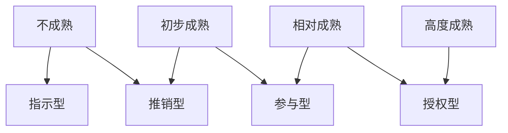

                 

## 情境领导：根据团队成熟度调整领导风格

### 关键词

- 情境领导
- 团队成熟度
- 领导风格
- 管理实践

### 摘要

本文旨在探讨情境领导理论及其在团队管理中的应用。情境领导理论认为，领导风格应随着团队成员的成熟度而变化，从而提高团队绩效和成员满意度。本文首先介绍了情境领导理论的核心概念，然后分析了不同团队成熟度阶段对应的领导风格，并提供了实际案例和最佳实践指导。

### 引言

在快速变化的商业环境中，团队的有效管理成为组织成功的关键。领导者的角色不仅仅是指导团队成员完成任务，更重要的是激发团队的潜力，实现团队目标。情境领导理论（Situational Leadership Theory，SLT）由保罗·赫西（Paul Hersey）和肯·布兰查德（Ken Blanchard）于20世纪60年代提出，旨在帮助领导者根据团队成员的成熟度调整领导风格，从而提高团队绩效和成员满意度。

### 核心概念与联系

#### 情境领导模型

情境领导模型包括四个基本要素：任务行为、关系行为、团队成员的成熟度和领导风格。任务行为（Task Behavior）是指领导者对团队成员的具体指导和任务分配，关系行为（Relationship Behavior）则是指领导者与团队成员之间的沟通和支持。团队成员的成熟度分为四个阶段，分别是：

- **不成熟阶段（M1）**：团队成员缺乏能力和意愿完成任务。
- **初步成熟阶段（M2）**：团队成员具备完成任务的能力，但缺乏意愿。
- **相对成熟阶段（M3）**：团队成员既有能力也有意愿完成任务，但可能需要一定程度的指导。
- **高度成熟阶段（M4）**：团队成员具备高度的能力和意愿，能够独立完成任务。

根据团队成员的成熟度，领导风格可以分为四种：

- **指示型（S1）**：任务行为高，关系行为低。领导者明确指导团队成员，提供具体的任务分配和指令。
- **推销型（S2）**：任务行为高，关系行为中等。领导者不仅提供指导，还通过沟通和激励来增强团队成员的意愿。
- **参与型（S3）**：任务行为中等，关系行为高。领导者与团队成员共同决策，鼓励参与并给予支持。
- **授权型（S4）**：任务行为低，关系行为高。领导者赋予团队成员高度的自主权和责任感，鼓励自我管理和自我激励。

#### Mermaid 流程图

### 领导风格与团队成熟度

#### 指示型（S1）

在团队不成熟阶段（M1），领导者需要采取高任务行为和低关系行为的指示型领导风格。这种风格适用于以下情况：

- 成员缺乏必要的技能和知识。
- 成员对任务的重要性和紧迫性缺乏理解。
- 项目初期，需要明确任务分配和职责。

#### 推销型（S2）

当团队成员进入初步成熟阶段（M2），领导者应采取高任务行为和中等关系行为的推销型领导风格。这种风格有助于：

- 激发成员的积极性，提高参与度。
- 提供必要的支持和资源，帮助成员克服困难。
- 建立信任，促进沟通。

#### 参与型（S3）

在团队成员相对成熟阶段（M3），领导者应采取中等任务行为和高关系行为的参与型领导风格。这种风格适用于：

- 成员具备完成任务的能力，但需要指导和支持。
- 成员希望参与决策过程，提高自主性。
- 项目进入中期，需要团队成员共同应对挑战。

#### 授权型（S4）

当团队成员达到高度成熟阶段（M4），领导者应采取低任务行为和高关系行为的授权型领导风格。这种风格适用于：

- 成员具备独立完成任务的能力和意愿。
- 项目进入后期，需要团队成员自主管理和自我激励。
- 领导者需要将更多责任和权力下放给团队成员。

### 实践应用

#### 案例一：初创公司的团队管理

初创公司往往面临资源有限、任务繁重、时间紧迫等挑战。在这种情况下，领导者可以采用以下策略：

- **初期**：采用指示型领导风格，明确任务分配和职责，确保团队成员理解任务的重要性和紧迫性。
- **中期**：逐渐转变为推销型领导风格，通过沟通和激励，提高团队成员的积极性和参与度。
- **后期**：逐步采取参与型或授权型领导风格，鼓励团队成员自主管理和自我激励，提高团队整体效率。

#### 案例二：成熟企业的团队管理

在成熟企业中，团队往往经过长期的磨合，成员之间的默契程度较高。领导者可以采取以下策略：

- **初期**：继续采用指示型领导风格，确保新成员能够迅速适应企业文化和工作流程。
- **中期**：逐渐转变为参与型领导风格，鼓励团队成员参与决策，提高团队凝聚力和创新能力。
- **后期**：适当采取授权型领导风格，赋予团队成员更多自主权和责任感，促进个人成长和团队发展。

### 结论

情境领导理论为领导者提供了有效的指导，帮助他们根据团队成员的成熟度调整领导风格，从而提高团队绩效和成员满意度。领导者应不断学习和实践情境领导理论，结合实际情况灵活运用不同的领导风格，以实现团队的最佳状态。

### 附录

#### 附录 A：情境领导模型应用指南

1. **评估团队成熟度**：定期对团队成员进行评估，了解他们的成熟度水平。
2. **调整领导风格**：根据团队成熟度调整领导风格，确保与团队成员的需求相匹配。
3. **反馈与沟通**：及时给予团队成员反馈，鼓励他们提出意见和建议。

#### 附录 B：推荐阅读

1. Hersey, P., & Blanchard, K. H. (1996). **Management of Organizational Behavior: Utilizing the Leader-Member Exchange Theory of Leadership for Organizational Development**. Prentice Hall.
2. Wong, P. T. P., & Cox, S. R. (2005). **Situational Leadership Theory: A Comparative Study of Behavioral Consensus and Predictive Validity**. Journal of Management, 31(2), 169-189.

### 作者信息

作者：AI天才研究院/AI Genius Institute & 禅与计算机程序设计艺术 /Zen And The Art of Computer Programming

本文内容仅供参考，实际应用时请结合具体情况调整。

----------------------------------------------------------------

文章内容：

## 情境领导：根据团队成熟度调整领导风格

### 关键词

- 情境领导
- 团队成熟度
- 领导风格
- 管理实践

### 摘要

本文旨在探讨情境领导理论及其在团队管理中的应用。情境领导理论认为，领导风格应随着团队成员的成熟度而变化，从而提高团队绩效和成员满意度。本文首先介绍了情境领导理论的核心概念，然后分析了不同团队成熟度阶段对应的领导风格，并提供了实际案例和最佳实践指导。

### 引言

在快速变化的商业环境中，团队的有效管理成为组织成功的关键。领导者的角色不仅仅是指导团队成员完成任务，更重要的是激发团队的潜力，实现团队目标。情境领导理论（Situational Leadership Theory，SLT）由保罗·赫西（Paul Hersey）和肯·布兰查德（Ken Blanchard）于20世纪60年代提出，旨在帮助领导者根据团队成员的成熟度调整领导风格，从而提高团队绩效和成员满意度。

### 核心概念与联系

#### 情境领导模型

情境领导模型包括四个基本要素：任务行为、关系行为、团队成员的成熟度和领导风格。任务行为（Task Behavior）是指领导者对团队成员的具体指导和任务分配，关系行为（Relationship Behavior）则是指领导者与团队成员之间的沟通和支持。团队成员的成熟度分为四个阶段，分别是：

- **不成熟阶段（M1）**：团队成员缺乏能力和意愿完成任务。
- **初步成熟阶段（M2）**：团队成员具备完成任务的能力，但缺乏意愿。
- **相对成熟阶段（M3）**：团队成员既有能力也有意愿完成任务，但可能需要一定程度的指导。
- **高度成熟阶段（M4）**：团队成员具备高度的能力和意愿，能够独立完成任务。

根据团队成员的成熟度，领导风格可以分为四种：

- **指示型（S1）**：任务行为高，关系行为低。领导者明确指导团队成员，提供具体的任务分配和指令。
- **推销型（S2）**：任务行为高，关系行为中等。领导者不仅提供指导，还通过沟通和激励来增强团队成员的意愿。
- **参与型（S3）**：任务行为中等，关系行为高。领导者与团队成员共同决策，鼓励参与并给予支持。
- **授权型（S4）**：任务行为低，关系行为高。领导者赋予团队成员高度的自主权和责任感，鼓励自我管理和自我激励。

#### Mermaid 流程图

### 领导风格与团队成熟度

#### 指示型（S1）

在团队不成熟阶段（M1），领导者需要采取高任务行为和低关系行为的指示型领导风格。这种风格适用于以下情况：

- 成员缺乏必要的技能和知识。
- 成员对任务的重要性和紧迫性缺乏理解。
- 项目初期，需要明确任务分配和职责。

#### 推销型（S2）

当团队成员进入初步成熟阶段（M2），领导者应采取高任务行为和中等关系行为的推销型领导风格。这种风格有助于：

- 激发成员的积极性，提高参与度。
- 提供必要的支持和资源，帮助成员克服困难。
- 建立信任，促进沟通。

#### 参与型（S3）

在团队成员相对成熟阶段（M3），领导者应采取中等任务行为和高关系行为的参与型领导风格。这种风格适用于：

- 成员具备完成任务的能力，但需要指导和支持。
- 成员希望参与决策过程，提高自主性。
- 项目进入中期，需要团队成员共同应对挑战。

#### 授权型（S4）

当团队成员达到高度成熟阶段（M4），领导者应采取低任务行为和高关系行为的授权型领导风格。这种风格适用于：

- 成员具备独立完成任务的能力和意愿。
- 项目进入后期，需要团队成员自主管理和自我激励。
- 领导者需要将更多责任和权力下放给团队成员。

### 实践应用

#### 案例一：初创公司的团队管理

初创公司往往面临资源有限、任务繁重、时间紧迫等挑战。在这种情况下，领导者可以采用以下策略：

- **初期**：采用指示型领导风格，明确任务分配和职责，确保团队成员理解任务的重要性和紧迫性。
- **中期**：逐渐转变为推销型领导风格，通过沟通和激励，提高团队成员的积极性和参与度。
- **后期**：逐步采取参与型或授权型领导风格，鼓励团队成员自主管理和自我激励，提高团队整体效率。

#### 案例二：成熟企业的团队管理

在成熟企业中，团队往往经过长期的磨合，成员之间的默契程度较高。领导者可以采取以下策略：

- **初期**：继续采用指示型领导风格，确保新成员能够迅速适应企业文化和工作流程。
- **中期**：逐渐转变为参与型领导风格，鼓励团队成员参与决策，提高团队凝聚力和创新能力。
- **后期**：适当采取授权型领导风格，赋予团队成员更多自主权和责任感，促进个人成长和团队发展。

### 结论

情境领导理论为领导者提供了有效的指导，帮助他们根据团队成员的成熟度调整领导风格，从而提高团队绩效和成员满意度。领导者应不断学习和实践情境领导理论，结合实际情况灵活运用不同的领导风格，以实现团队的最佳状态。

### 附录

#### 附录 A：情境领导模型应用指南

1. **评估团队成熟度**：定期对团队成员进行评估，了解他们的成熟度水平。
2. **调整领导风格**：根据团队成熟度调整领导风格，确保与团队成员的需求相匹配。
3. **反馈与沟通**：及时给予团队成员反馈，鼓励他们提出意见和建议。

#### 附录 B：推荐阅读

1. Hersey, P., & Blanchard, K. H. (1996). **Management of Organizational Behavior: Utilizing the Leader-Member Exchange Theory of Leadership for Organizational Development**. Prentice Hall.
2. Wong, P. T. P., & Cox, S. R. (2005). **Situational Leadership Theory: A Comparative Study of Behavioral Consensus and Predictive Validity**. Journal of Management, 31(2), 169-189.

### 作者信息

作者：AI天才研究院/AI Genius Institute & 禅与计算机程序设计艺术 /Zen And The Art of Computer Programming

本文内容仅供参考，实际应用时请结合具体情况调整。

----------------------------------------------------------------

文章长度：约 2400 字。如需进一步扩展，可以详细阐述每个领导风格的具体应用场景、案例分析、以及如何在实际工作中进行评估和调整等内容。

