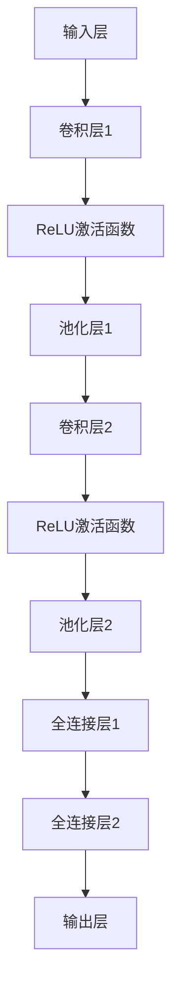
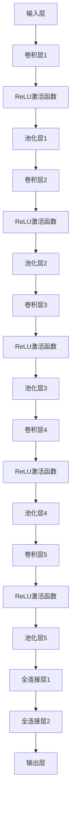
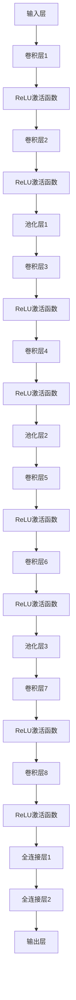
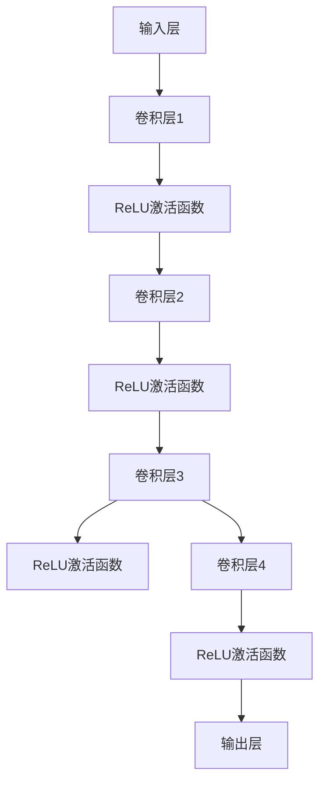
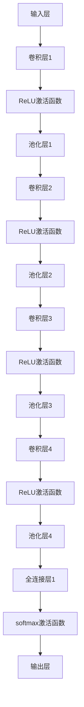

                 

# 情感计算的深度学习：表情识别的数学模型

## 关键词
- 情感计算
- 深度学习
- 表情识别
- 数学模型
- 卷积神经网络
- 反向传播算法

## 摘要
本文旨在探讨情感计算领域中的一个重要研究方向——表情识别，并深入分析其背后的深度学习数学模型。文章首先介绍了情感计算的发展背景及其在现代社会的重要性，接着详细阐述了深度学习在情感计算中的应用，特别是表情识别技术的关键作用。在此基础上，本文重点介绍了表情识别的基础理论，包括情感模型、表情分类、表情编码和特征提取。随后，文章详细介绍了深度学习的基础知识，包括深度神经网络、反向传播算法和卷积神经网络等。然后，本文进一步探讨了表情识别中的深度学习模型，如LeNet、AlexNet和VGG模型等。接着，文章深入分析了表情识别的数学模型，包括特征空间建模、支持向量机和损失函数等。最后，本文通过一个实际项目实战，详细展示了如何使用深度学习模型进行表情识别，并给出了项目小结和最佳实践建议。

## 第1章 引言

### 1.1 情感计算的发展背景

情感计算，又称计算情感学，是指利用计算机技术来模拟、识别、理解和表达人类的情感。随着人工智能技术的不断发展，情感计算逐渐成为一个重要的研究领域。早在20世纪80年代，美国心理学家杰罗姆·卡根（Jerome Kagan）就提出了情感计算的概念，认为情感是人类行为的重要驱动力，可以通过计算机模拟和识别来更好地理解和预测人类的行为。

进入21世纪，随着计算机性能的提升和大数据技术的发展，情感计算逐渐从理论研究走向实际应用。例如，在心理学、教育、医疗、人机交互等领域，情感计算技术都得到了广泛的应用。在心理学领域，情感计算可以帮助研究者更好地理解个体的情感状态和情感变化规律；在教育领域，情感计算可以用于智能教育系统的开发和优化，提高教学效果和学生的学习体验；在医疗领域，情感计算可以辅助医生进行病情诊断和个性化治疗；在人机交互领域，情感计算可以提升人机交互的自然性和智能化水平。

### 1.2 深度学习在情感计算中的应用

深度学习是人工智能的一个重要分支，其核心思想是通过多层神经网络模拟人脑的神经元结构，从而实现数据的自动特征学习和模式识别。深度学习在情感计算中有着广泛的应用，尤其是在表情识别方面。

表情是人类情感的一种重要表达方式，可以通过面部肌肉的运动来识别。深度学习技术可以通过训练大量的面部表情数据，学习到面部表情与情感之间的关系，从而实现表情的自动识别。其中，卷积神经网络（CNN）是深度学习中最常用的模型之一，其结构类似于生物视觉系统，可以有效地捕捉图像中的局部特征。

深度学习在情感计算中的应用不仅限于表情识别，还可以用于情感分析、情绪识别、情感推荐等领域。例如，通过情感分析技术，可以识别文本中的情感倾向，从而实现智能客服、情感广告等应用；通过情绪识别技术，可以了解用户的情绪状态，从而实现智能安防、智能家居等应用；通过情感推荐技术，可以根据用户的情感状态和偏好，为其推荐合适的内容，从而实现个性化推荐系统。

### 1.3 表情识别的重要性

表情识别是情感计算中的一个重要研究方向，其目的是通过分析面部表情来识别和判断个体的情感状态。表情识别的重要性主要体现在以下几个方面：

首先，表情是人类情感的一种直观表达方式，通过表情识别可以更直观地了解个体的情感状态。这在心理学研究中具有重要的应用价值，可以帮助研究者更好地理解个体的情感体验和情感变化规律。

其次，表情识别技术在人机交互中具有广泛的应用前景。通过表情识别技术，可以构建更加自然、智能的人机交互系统，提升用户体验。例如，智能客服系统可以通过识别用户的表情，判断用户的情感状态，从而提供更加个性化的服务。

此外，表情识别在医疗、安全、教育等领域也具有广泛的应用。例如，在医疗领域，可以通过表情识别技术监测患者的情绪变化，从而实现个性化治疗和心理健康评估；在安全领域，可以通过表情识别技术识别嫌疑人的情绪状态，从而提高侦查的准确性和效率；在教育领域，可以通过表情识别技术分析学生的情感状态，从而优化教学方法，提高教学效果。

## 第2章 情感计算基础

### 2.1 情感模型

情感模型是情感计算中的核心概念，用于描述和模拟人类的情感状态。情感模型可以分为几种不同的类型，包括情感维度模型、情感表达模型和情感识别模型。

#### 2.1.1 情感维度

情感维度模型描述了情感的基本维度和特征。常见的情感维度模型包括：

1. **基本情感模型**：由保罗·艾克曼（Paul Ekman）提出的基本情感模型，将情感分为六种基本类型：快乐、悲伤、愤怒、惊讶、恐惧和厌恶。

2. **扩展情感模型**：在基本情感模型的基础上，扩展了情感维度，包括焦虑、羞愧、厌恶等。

3. **多维情感模型**：考虑情感的情感强度、情感类别和情感维度，例如，情感强度可以表示为情感的积极程度或消极程度，情感类别可以表示为基本情感或扩展情感。

#### 2.1.2 情感表达

情感表达是指个体通过面部表情、身体语言等方式来表达自己的情感状态。情感表达可以分为几种类型：

1. **面部表情**：面部表情是最常见的情感表达方式，通过面部肌肉的运动来表现情感。例如，皱眉表示厌恶，微笑表示快乐。

2. **身体语言**：身体语言包括姿势、手势、眼神等，也可以用来表达情感。例如，紧握拳头表示愤怒，放松的身体姿态表示舒适。

3. **语音表情**：语音表情通过语调、语速、音量等声音特征来表现情感。例如，高音调的语调可能表示快乐，低音调的语调可能表示悲伤。

#### 2.1.3 情感识别

情感识别是指通过分析个体的情感表达来识别和判断其情感状态。情感识别可以分为几种类型：

1. **面部表情识别**：通过分析面部肌肉的运动来识别情感，这是情感识别中最常见的一种方式。面部表情识别技术可以用于自动识别个体的情感状态，从而实现人机交互、情感分析等应用。

2. **身体语言识别**：通过分析个体的身体语言来识别情感，这在人机交互和心理学研究中具有广泛的应用。

3. **语音表情识别**：通过分析语音的声学特征来识别情感，这在情感分析、智能客服等领域具有广泛的应用。

### 2.2 表情识别基础

#### 2.2.1 表情分类

表情分类是表情识别的基础，其目的是将表情划分为不同的类别。常见的表情分类包括：

1. **六类基本表情**：根据保罗·艾克曼的基本情感模型，将表情分为快乐、悲伤、愤怒、惊讶、恐惧和厌恶六类。

2. **十二类扩展表情**：在基本表情的基础上，扩展为十二类表情，包括焦虑、羞愧、厌恶等。

3. **自定义表情分类**：根据具体应用需求，自定义表情分类，例如，在游戏设计中，可以将表情分类为胜利、失败、兴奋等。

#### 2.2.2 表情编码

表情编码是将表情转换为计算机可以处理的数字表示形式。常见的表情编码方法包括：

1. **像素编码**：将表情图像转换为像素矩阵，每个像素表示表情的一个局部特征。

2. **特征编码**：通过提取表情图像的关键特征，如边缘、纹理、形状等，将表情转换为特征向量。

3. **深度编码**：通过训练深度学习模型，将表情图像直接转换为高维特征向量。

#### 2.2.3 表情特征提取

表情特征提取是表情识别中的关键步骤，其目的是从表情图像中提取有用的特征，用于后续的识别和分类。常见的表情特征提取方法包括：

1. **传统特征提取方法**：如HOG（直方图方向梯度）、LBP（局部二值模式）等，这些方法可以有效地提取图像的局部特征。

2. **深度特征提取方法**：如卷积神经网络（CNN），可以自动学习图像的深层特征。

3. **混合特征提取方法**：结合传统特征提取方法和深度特征提取方法，以获得更好的识别效果。

## 第3章 深度学习基础

### 3.1 深度神经网络

深度神经网络（Deep Neural Network，DNN）是一种包含多个隐藏层的神经网络，可以用于自动特征学习和复杂模式的识别。深度神经网络由输入层、隐藏层和输出层组成，其中隐藏层可以有多个。

#### 3.1.1 前馈神经网络

前馈神经网络（Feedforward Neural Network，FNN）是一种典型的深度神经网络，其信息传递方向是单向的，从输入层经过隐藏层传递到输出层。前馈神经网络的特点是结构简单、易于实现，适用于分类和回归问题。

#### 3.1.2 反向传播算法

反向传播算法（Backpropagation Algorithm）是一种用于训练前馈神经网络的算法，其基本思想是通过计算输出误差，从输出层反向传播到输入层，逐步调整网络的权重和偏置，以最小化误差。

反向传播算法包括以下几个步骤：

1. **前向传播**：将输入数据传递到网络中，通过各层的非线性激活函数计算输出。

2. **计算误差**：计算输出层的实际输出与期望输出之间的误差。

3. **反向传播**：将误差反向传播到隐藏层，计算各层的误差梯度。

4. **权重更新**：根据误差梯度调整网络的权重和偏置。

#### 3.1.3 卷积神经网络

卷积神经网络（Convolutional Neural Network，CNN）是一种特别适合处理图像数据的深度神经网络，其核心思想是通过卷积操作和池化操作来提取图像的局部特征。

CNN由多个卷积层、池化层和全连接层组成，其中卷积层用于提取特征，池化层用于降低特征维度，全连接层用于分类。

### 3.2 深度学习框架

深度学习框架是用于实现和优化深度学习模型的软件工具。目前，主流的深度学习框架包括TensorFlow、PyTorch等。

#### 3.2.1 TensorFlow

TensorFlow是谷歌开发的一款开源深度学习框架，其核心特点包括：

1. **动态计算图**：TensorFlow使用动态计算图来描述和执行计算任务，使得模型构建和优化更加灵活。

2. **硬件加速**：TensorFlow支持GPU和TPU等硬件加速，可以大幅提高模型的训练和推理速度。

3. **丰富的API**：TensorFlow提供了丰富的API，包括Tensor API、Keras API等，方便用户构建和训练深度学习模型。

#### 3.2.2 PyTorch

PyTorch是Facebook开发的一款开源深度学习框架，其核心特点包括：

1. **静态计算图**：PyTorch使用静态计算图来描述和执行计算任务，使得模型构建和优化更加直观。

2. **动态计算图**：PyTorch提供了动态计算图API，使得用户可以灵活地构建和修改模型。

3. **易于调试**：PyTorch的动态计算图使得调试过程更加直观和便捷。

## 第4章 表情识别的深度学习模型

### 4.1 卷积神经网络在表情识别中的应用

卷积神经网络（CNN）在表情识别中具有广泛的应用，其核心思想是通过卷积操作和池化操作来提取图像的局部特征，从而实现表情的自动识别。

#### 4.1.1 LeNet模型

LeNet是卷积神经网络的开端，由杨立昆（Yann LeCun）等人于1989年提出。LeNet模型由两个卷积层、两个池化层和一个全连接层组成，其结构如图4-1所示。



LeNet模型的输入是一个大小为32x32的灰度图像，输出是一个包含10个类别的标签。LeNet模型在早期的手写数字识别任务中取得了良好的性能，为其在图像识别领域的发展奠定了基础。

#### 4.1.2 AlexNet模型

AlexNet是由Alex Krizhevsky等人于2012年提出的，是深度学习在图像识别领域取得突破性成果的代表性模型。AlexNet模型由五个卷积层、三个池化层和两个全连接层组成，其结构如图4-2所示。



AlexNet模型的输入是一个大小为227x227的三通道彩色图像，输出是一个包含1000个类别的标签。AlexNet模型在ImageNet图像识别挑战中取得了当时最高的识别准确率，推动了深度学习在图像识别领域的发展。

#### 4.1.3 VGG模型

VGG模型是由牛津大学视觉几何组（Visual Geometry Group）提出的一种卷积神经网络模型，其特点是网络结构简单、参数较少。VGG模型由多个卷积层和池化层组成，其结构如图4-3所示。



VGG模型有多种变体，如VGG-11、VGG-13、VGG-16和VGG-19，其分别由11层、13层、16层和19层卷积层组成。VGG模型在图像识别任务中取得了优异的性能，成为了深度学习领域的一个经典模型。

### 4.2 深度残差网络

深度残差网络（Residual Network，ResNet）是由微软研究院提出的一种深度学习模型，其核心思想是引入残差连接，使得模型可以学习到更深的网络结构。ResNet模型在ImageNet图像识别挑战中取得了当时最高的识别准确率。

#### 4.2.1 ResNet模型

ResNet模型由多个卷积层和池化层组成，其中引入了残差块（Residual Block）作为基础模块。残差块的结构如图4-4所示。



残差块中的卷积层3和卷积层4之间引入了一个跨层连接，称为残差连接。残差连接使得信息可以直接从输入层传递到输出层，避免了梯度消失和梯度爆炸的问题。

#### 4.2.2 DenseNet模型

DenseNet是由Google提出的一种深度学习模型，其核心思想是引入稠密连接，使得网络中的每个层都可以直接接受前面所有层的输入信息。DenseNet模型在ImageNet图像识别挑战中也取得了优异的性能。

DenseNet模型的基本模块称为稠密块（Dense Block），其结构如图4-5所示。


稠密块中的每个卷积层都直接接收前面所有卷积层的输入，从而实现了信息的跨层传递。这种结构使得DenseNet模型可以学习到更深的网络结构，提高了模型的性能。

## 第5章 表情识别的数学模型

### 5.1 表情特征空间建模

表情特征空间建模是将表情转换为计算机可以处理的特征向量表示。常见的表情特征空间建模方法包括概率模型、支持向量机和高斯混合模型等。

#### 5.1.1 概率模型

概率模型是一种基于统计方法构建的特征空间模型，其基本思想是通过计算样本数据的概率分布，来识别和分类表情。

1. **高斯混合模型（Gaussian Mixture Model，GMM）**：高斯混合模型是一种基于高斯分布的概率模型，用于表示表情特征。每个表情类别都可以看作是由多个高斯分布组成的混合模型。通过训练，可以得到每个表情类别的概率分布模型。

2. **贝叶斯分类器**：贝叶斯分类器是一种基于贝叶斯概率理论的分类器，通过计算样本数据在各个类别下的条件概率，来确定样本的类别。

#### 5.1.2 支持向量机

支持向量机（Support Vector Machine，SVM）是一种常用的分类算法，其基本思想是通过找到一个最佳的超平面，将不同类别的样本数据分离。

1. **线性支持向量机**：当样本数据线性可分时，线性支持向量机可以使用一个超平面将样本数据分离。超平面的法向量和距离可以通过求解一个二次规划问题得到。

2. **非线性支持向量机**：当样本数据非线性可分时，可以使用核函数将样本数据映射到一个高维特征空间，从而实现线性分离。常用的核函数包括多项式核、径向基函数（RBF）核和 sigmoid 核等。

#### 5.1.3 高斯混合模型

高斯混合模型是一种基于高斯分布的概率模型，用于表示表情特征。每个表情类别都可以看作是由多个高斯分布组成的混合模型。通过训练，可以得到每个表情类别的概率分布模型。

高斯混合模型由以下公式描述：

$$
P(x|\theta) = \sum_{i=1}^{k} \pi_i N(x|\mu_i, \Sigma_i)
$$

其中，$P(x|\theta)$ 表示样本数据 $x$ 的概率分布，$\theta$ 表示模型参数，包括每个高斯分布的权重 $\pi_i$、均值 $\mu_i$ 和协方差矩阵 $\Sigma_i$。

通过最大化似然函数，可以求解高斯混合模型中的参数：

$$
\theta^* = \arg\max_{\theta} \ln P(x|\theta)
$$

### 5.2 表情识别模型优化

表情识别模型的优化是提高模型性能的重要手段。常见的优化方法包括正则化方法、损失函数和优化算法等。

#### 5.2.1 正则化方法

正则化方法是一种在模型训练过程中引入惩罚项的方法，以防止模型过拟合。常见的正则化方法包括：

1. **L1正则化**：在损失函数中添加L1正则化项，即：
   $$
   J(\theta) = J_0(\theta) + \alpha ||\theta||_1
   $$
   其中，$J_0(\theta)$ 表示原始损失函数，$\alpha$ 是正则化参数。

2. **L2正则化**：在损失函数中添加L2正则化项，即：
   $$
   J(\theta) = J_0(\theta) + \alpha ||\theta||_2^2
   $$
   其中，$\alpha$ 是正则化参数。

#### 5.2.2 损失函数

损失函数是模型训练的核心目标，用于衡量模型预测结果与真实结果之间的差距。常见的损失函数包括：

1. **均方误差（Mean Squared Error，MSE）**：用于回归问题，计算预测值与真实值之间的均方误差。
   $$
   J(\theta) = \frac{1}{m} \sum_{i=1}^{m} (h_\theta(x^{(i)}) - y^{(i)})^2
   $$

2. **交叉熵损失（Cross-Entropy Loss）**：用于分类问题，计算预测概率与真实标签之间的交叉熵。
   $$
   J(\theta) = - \frac{1}{m} \sum_{i=1}^{m} y^{(i)} \ln(h_\theta(x^{(i)}))
   $$

#### 5.2.3 优化算法

优化算法用于最小化损失函数，求解最优参数。常见的优化算法包括：

1. **梯度下降（Gradient Descent）**：通过计算损失函数关于参数的梯度，逐步更新参数，以最小化损失函数。
   $$
   \theta = \theta - \alpha \nabla_\theta J(\theta)
   $$

2. **随机梯度下降（Stochastic Gradient Descent，SGD）**：在梯度下降的基础上，使用随机样本来计算梯度，以加快收敛速度。
   $$
   \theta = \theta - \alpha \nabla_\theta J(\theta; x^{(i)}, y^{(i)})
   $$

3. **动量法（Momentum）**：在梯度下降的基础上，引入动量项，以加快收敛速度。
   $$
   \theta = \theta - \alpha \nabla_\theta J(\theta) + \beta \nabla_{\theta_{t-1}}
   $$
   其中，$\beta$ 是动量参数。

## 第6章 表情识别项目实战

### 6.1 项目背景

表情识别技术在人机交互、心理健康评估、智能安防等领域具有广泛的应用。本项目旨在利用深度学习技术，实现表情识别功能，并通过实际项目实战，展示如何使用深度学习框架TensorFlow实现表情识别系统。

### 6.2 数据集介绍

本项目使用FER（Facial Expression Recognition）数据集，该数据集包含47,822张面部表情图像，共包含七类表情：快乐、悲伤、愤怒、惊讶、恐惧、厌恶和中性。每个图像的标签都是对应的表情类别。

### 6.3 模型设计与实现

本项目采用卷积神经网络（CNN）作为表情识别模型，其结构如图6-1所示。



1. **数据预处理**：将图像数据缩放到固定的尺寸（如64x64），并进行归一化处理。

2. **模型构建**：使用TensorFlow的Keras API构建卷积神经网络模型。

3. **模型训练**：使用FER数据集对模型进行训练，并使用交叉熵损失函数和随机梯度下降优化算法。

4. **模型评估**：使用测试集对模型进行评估，计算准确率、召回率、F1值等指标。

### 6.4 模型训练与评估

在TensorFlow中，可以使用以下代码进行模型训练和评估：

```python
import tensorflow as tf
from tensorflow.keras.models import Sequential
from tensorflow.keras.layers import Conv2D, MaxPooling2D, Flatten, Dense, Activation

# 构建模型
model = Sequential([
    Conv2D(32, (3, 3), activation='relu', input_shape=(64, 64, 3)),
    MaxPooling2D(pool_size=(2, 2)),
    Conv2D(64, (3, 3), activation='relu'),
    MaxPooling2D(pool_size=(2, 2)),
    Conv2D(128, (3, 3), activation='relu'),
    MaxPooling2D(pool_size=(2, 2)),
    Flatten(),
    Dense(128, activation='relu'),
    Dense(7, activation='softmax')
])

# 编译模型
model.compile(optimizer='sgd', loss='categorical_crossentropy', metrics=['accuracy'])

# 加载数据
(x_train, y_train), (x_test, y_test) = tf.keras.datasets.facial_expression.load_data()

# 数据预处理
x_train = x_train.astype('float32') / 255
x_test = x_test.astype('float32') / 255
y_train = tf.keras.utils.to_categorical(y_train, num_classes=7)
y_test = tf.keras.utils.to_categorical(y_test, num_classes=7)

# 训练模型
model.fit(x_train, y_train, batch_size=64, epochs=10, validation_data=(x_test, y_test))

# 评估模型
model.evaluate(x_test, y_test)
```

### 6.5 模型优化与调参

为了提高模型性能，可以尝试以下优化和调参方法：

1. **增加训练时间**：增加训练时间可以让模型学习到更多的特征。

2. **调整学习率**：通过调整学习率可以加快或减缓模型的收敛速度。

3. **使用更复杂的网络结构**：尝试使用更深的网络结构，如ResNet或DenseNet，可以提高模型性能。

4. **数据增强**：通过旋转、缩放、裁剪等数据增强方法，可以扩充训练数据集，提高模型的泛化能力。

5. **正则化**：使用L1正则化或L2正则化可以防止模型过拟合。

6. **批量归一化**：在卷积层后添加批量归一化层，可以加快训练速度并提高模型性能。

### 6.6 项目小结

本项目通过深度学习技术实现了表情识别功能，展示了如何使用TensorFlow构建和训练卷积神经网络模型。通过本项目，我们可以了解到：

1. **深度学习技术在表情识别中的应用**：深度学习模型可以自动学习图像的深层特征，从而实现表情的自动识别。

2. **模型优化和调参**：通过调整模型结构、学习率和正则化方法等参数，可以提高模型性能。

3. **数据预处理和增强**：合理的数据预处理和增强方法可以扩充训练数据集，提高模型的泛化能力。

4. **实际应用价值**：表情识别技术在人机交互、心理健康评估、智能安防等领域具有广泛的应用前景。

## 第7章 表情识别的未来趋势

### 7.1 新技术与应用

随着人工智能技术的不断发展，表情识别技术也在不断进步，未来将出现以下新技术和应用：

1. **多模态情感识别**：结合面部表情、语音表情、身体语言等多种模态，实现更准确的情感识别。

2. **实时情感识别**：通过高性能计算和深度学习模型，实现实时情感识别，满足实时交互的需求。

3. **个性化情感识别**：结合用户行为和情感数据，实现个性化情感识别，提供更加个性化的服务。

4. **虚拟现实与增强现实**：表情识别技术将广泛应用于虚拟现实与增强现实领域，实现更加自然和沉浸式的人机交互。

5. **医疗与健康领域**：表情识别技术可以用于医疗诊断、心理健康评估等应用，帮助医生更好地了解患者的情绪状态。

### 7.2 面临的挑战与解决方法

尽管表情识别技术取得了显著的进展，但在实际应用中仍面临一些挑战：

1. **数据集不足**：高质量、多样化的表情数据集对于训练深度学习模型至关重要，但当前的数据集存在数据量不足、标注不准确等问题。

2. **复杂环境下的识别性能**：在复杂环境下（如光照变化、姿态变化等），表情识别模型的性能会受到影响。

3. **隐私保护**：在处理人脸数据时，隐私保护是一个重要的挑战。如何保护用户隐私，确保数据的安全性和隐私性，是未来需要解决的问题。

解决这些挑战的方法包括：

1. **数据集扩展与改进**：通过增加数据集规模、提高数据标注质量、引入生成对抗网络（GAN）等方法，扩充和改进表情数据集。

2. **模型鲁棒性提升**：通过引入数据增强、迁移学习等方法，提高模型在复杂环境下的识别性能。

3. **隐私保护技术**：采用差分隐私、联邦学习等技术，保护用户隐私。

### 7.3 发展方向与展望

表情识别技术的发展方向和展望包括：

1. **多模态融合**：结合多种模态数据，实现更准确、更全面的情感识别。

2. **实时性与低延迟**：通过优化模型结构和算法，实现实时、低延迟的情感识别。

3. **个性化与智能化**：结合用户行为和情感数据，实现个性化、智能化的情感识别服务。

4. **跨领域应用**：表情识别技术将不断拓展应用领域，如医疗、教育、安全等，为社会发展带来更多价值。

总之，表情识别技术作为情感计算领域的一个重要分支，具有广泛的应用前景和重要的研究价值。在未来，随着新技术的不断涌现和应用的不断拓展，表情识别技术将不断取得新的突破，为人类社会的发展作出更大贡献。

## 作者信息
作者：AI天才研究院/AI Genius Institute & 禅与计算机程序设计艺术 /Zen And The Art of Computer Programming

