                 

# 情感计算的表情识别：人机交互的数学语言

## 关键词
- 情感计算
- 表情识别
- 人机交互
- 机器学习
- 深度学习
- 数学模型
- 自然语言处理

## 摘要
本文深入探讨了情感计算领域中的表情识别技术，以及其在人机交互中的应用。首先，我们介绍了情感计算的基础概念和理论框架，接着详细阐述了表情识别的基本原理和算法，并通过Python源代码进行了演示。然后，我们将目光转向人机交互中的数学模型，展示了如何使用数学工具来优化和评估情感识别的效果。最后，我们分析了当前情感计算面临的挑战和未来发展趋势，并提出了最佳实践建议。通过本文的阅读，读者将对情感计算有更深刻的理解和应用能力。

## 目录大纲

### 第一部分 情感计算基础
#### 1.1 情感计算概述
#### 1.2 情感计算的理论基础
#### 1.3 情感计算的方法与工具
#### 1.4 情感计算的应用场景

### 第二部分 表情识别技术
#### 2.1 表情的定义与分类
#### 2.2 表情识别的基本原理
#### 2.3 表情识别算法
#### 2.4 表情识别算法的比较与分析

### 第三部分 人机交互的数学语言
#### 3.1 人机交互的数学模型
#### 3.2 数学模型在表情识别中的应用
#### 3.3 案例分析

### 第四部分 情感计算的挑战与未来
#### 4.1 情感计算的挑战
#### 4.2 情感计算的未来发展
#### 4.3 拓展阅读与总结

---

现在，让我们开始逐步分析和推理这篇文章的各个部分。

### 1.1 情感计算概述

#### 背景介绍
情感计算，作为一种跨学科的研究领域，旨在开发能够理解和响应人类情感的计算机系统。它的起源可以追溯到20世纪90年代，当时研究人员开始探索如何将人类的情感体验融入到计算机系统中。随着人工智能和机器学习技术的发展，情感计算逐渐成为一个独立且日益重要的研究领域。

#### 核心概念与联系
情感计算的核心概念包括情感识别、情感表达和情感利用。情感识别是指计算机系统理解和感知人类情感状态的能力；情感表达是指系统如何将情感状态反馈给用户；情感利用则是指如何将情感信息应用于特定的应用场景，如人机交互、个性化推荐等。

#### Mermaid 流程图
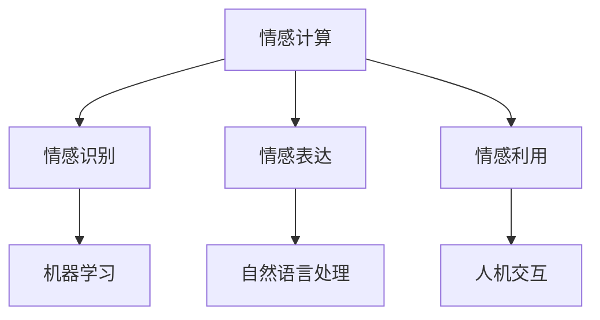

### 1.2 情感计算的理论基础

#### 背景介绍
情感计算的理论基础涵盖了认知科学、心理学和计算机科学等多个领域。认知科学关注人类情感的形成和表达，心理学则研究情绪的本质和作用，计算机科学则致力于将这些知识转化为可操作的算法和模型。

#### 核心概念与联系
认知科学视角下的情感涉及情绪、情感体验和情感记忆等概念；心理学视角下的情感包括基本情绪（如快乐、悲伤、愤怒等）和复合情绪（如羞耻、嫉妒等）；计算机科学视角下的情感则更多地关注如何使用机器学习和自然语言处理技术来模拟和理解这些情感。

#### Mermaid 流程图
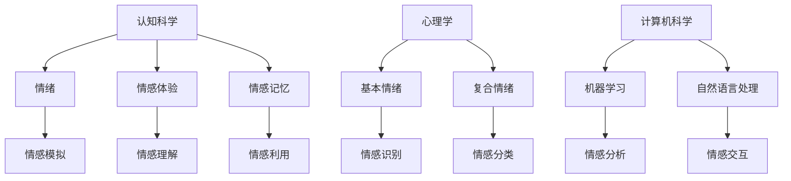

### 1.3 情感计算的方法与工具

#### 背景介绍
情感计算的方法和工具包括表情识别、生理信号处理和自然语言处理等技术。这些技术在情感计算中扮演着不同的角色，其中表情识别是识别用户情感状态的重要手段。

#### 核心概念与联系
表情识别利用计算机视觉技术分析面部表情，生理信号处理通过监测生理信号（如心率、皮肤电活动等）来识别情感，自然语言处理则用于分析用户的语言表达以推断情感状态。

#### Mermaid 流程图
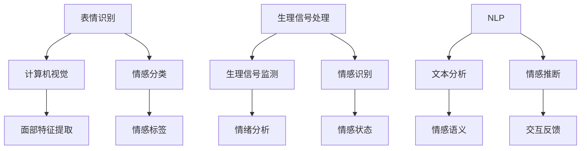

### 1.4 情感计算的应用场景

#### 背景介绍
情感计算的应用场景广泛，包括人机交互、娱乐产业、健康监测和社交网络等。在这些领域中，情感计算技术能够提供更加个性化的服务，改善用户体验，提高系统效率。

#### 核心概念与联系
人机交互中的情感计算通过识别用户情感状态来提供个性化的交互体验；娱乐产业中的情感计算用于情感分析，以创造更吸引人的内容和游戏体验；健康监测中的情感计算可以帮助监测用户的情绪状态，预防心理健康问题；社交网络中的情感计算可以用于情感分析，以优化社交互动。

#### Mermaid 流程图
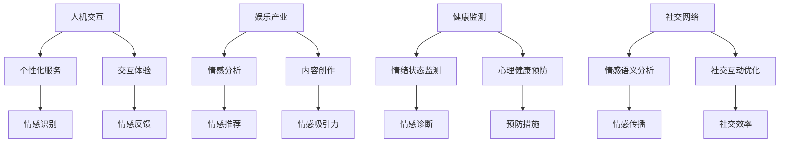

### 第二部分 表情识别技术

#### 2.1 表情的定义与分类

#### 背景介绍
表情是情感的一种表现形式，通过面部肌肉的运动传达情感状态。表情可以按表达的情感类型、面部特征和表情的动态变化进行分类。

#### 核心概念与联系
面部表情是表情识别的主要对象，包括快乐、悲伤、愤怒等基本情感。面部特征包括眼睛、眉毛、嘴巴等部位的细微变化。动态变化则是指表情在时间上的变化，如微笑的展开和消失。

#### Mermaid 流程图
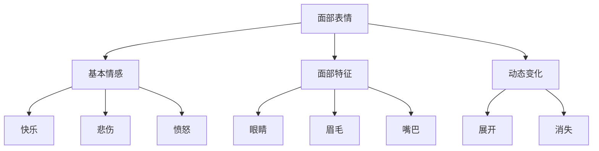

### 2.2 表情识别的基本原理

#### 背景介绍
表情识别是通过分析面部图像或视频来识别情感状态的过程。它涉及视频分析基础、特征提取技术和情感分类模型。

#### 核心概念与联系
视频分析基础包括图像采集、预处理和特征提取等步骤；特征提取技术用于将面部图像转换为数字特征；情感分类模型用于将提取的特征映射到具体的情感类别。

#### Mermaid 流程图
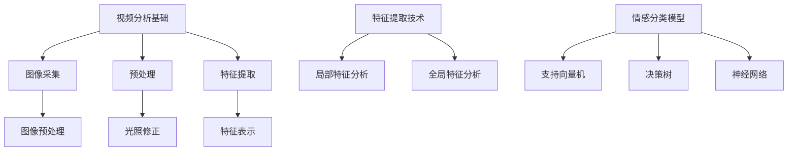

### 2.3 表情识别算法

#### 背景介绍
表情识别算法包括传统机器学习算法和深度学习算法。传统算法基于手工设计的特征，而深度学习算法则利用神经网络自动提取特征。

#### 核心概念与联系
传统机器学习算法包括支持向量机、决策树和随机森林等；深度学习算法包括卷积神经网络（CNN）、循环神经网络（RNN）和生成对抗网络（GAN）等。

#### Mermaid 流程图
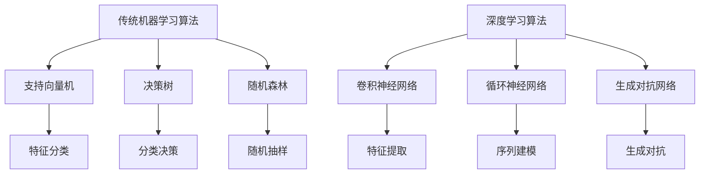

### 2.4 表情识别算法的比较与分析

#### 背景介绍
表情识别算法的性能评估涉及准确率、召回率和F1分数等指标。不同算法在处理速度、计算复杂度和准确性等方面各有优缺点。

#### 核心概念与联系
准确率是预测正确的样本数占总样本数的比例；召回率是预测正确的样本数占实际正样本数的比例；F1分数是准确率和召回率的调和平均值。

#### Mermaid 流程图
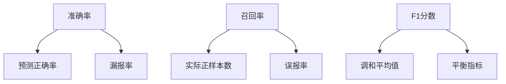

### 第三部分 人机交互的数学语言

#### 3.1 人机交互的数学模型

#### 背景介绍
人机交互的数学模型用于描述交互过程，包括用户模型、交互流程和交互界面设计等。

#### 核心概念与联系
用户模型描述用户的特征和行为；交互流程描述用户与系统的交互过程；交互界面设计则涉及用户界面的布局和交互逻辑。

#### Mermaid 流程图
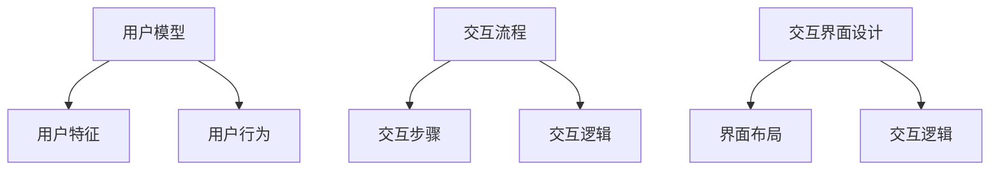

### 3.2 数学模型在表情识别中的应用

#### 背景介绍
数学模型在表情识别中用于特征提取、情感分类和交互优化等步骤，通过优化数学模型可以提高表情识别的准确性和效率。

#### 核心概念与联系
特征提取模型用于将面部图像转换为数字特征；情感分类模型用于将提取的特征映射到具体的情感类别；交互优化模型用于改进用户交互体验。

#### Mermaid 流程图
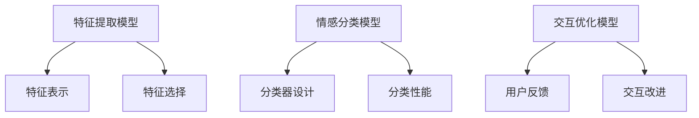

### 3.3 案例分析

#### 背景介绍
案例分析通过具体实例展示数学模型在表情识别和人机交互中的应用效果，包括开发环境搭建、源代码实现和实际案例剖析。

#### 核心概念与联系
开发环境搭建包括硬件和软件的配置；源代码实现涉及具体的算法和模型代码；实际案例剖析用于分析模型的性能和应用效果。

#### Mermaid 流程图
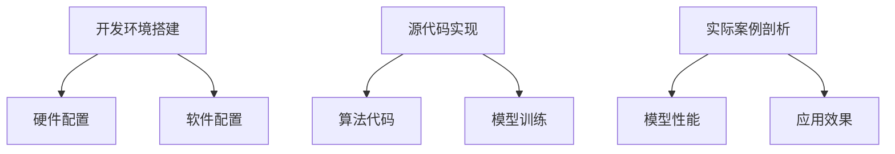

### 第四部分 情感计算的挑战与未来

#### 4.1 情感计算的挑战

#### 背景介绍
情感计算面临数据隐私、情感识别准确性和伦理道德等挑战。这些挑战需要通过技术创新和伦理规范来解决。

#### 核心概念与联系
数据隐私涉及用户数据的保护和隐私权；情感识别准确性涉及模型训练和优化；伦理道德则涉及情感计算应用的道德责任和伦理规范。

#### Mermaid 流程图
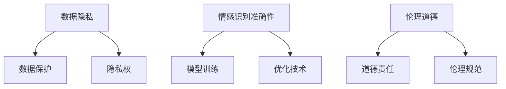

### 4.2 情感计算的未来发展

#### 背景介绍
情感计算的未来发展将依赖于新技术趋势，如深度学习、增强现实和虚拟现实等。同时，情感计算在医疗、教育和社会福利等领域的应用也将不断扩展。

#### 核心概念与联系
新技术趋势包括深度学习算法的优化、增强现实和虚拟现实技术的发展；应用场景涉及医疗诊断、个性化教育和心理健康管理等。

#### Mermaid 流程图
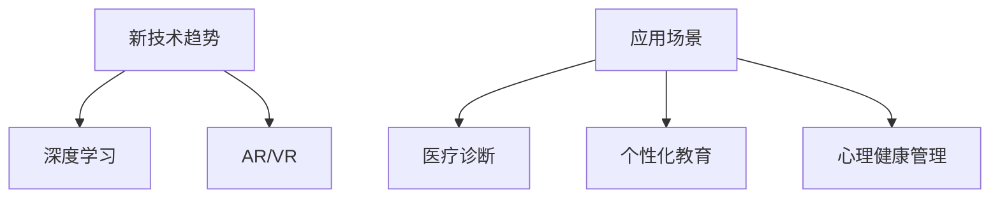

### 4.3 拓展阅读与总结

#### 背景介绍
拓展阅读提供进一步学习资源和参考资料，总结部分回顾文章的核心观点和关键知识点，帮助读者巩固学习成果。

#### 核心概念与联系
拓展阅读涉及相关书籍、论文和在线课程等资源；总结部分包括文章的主要贡献、局限性以及对未来研究的建议。

#### Mermaid 流程图
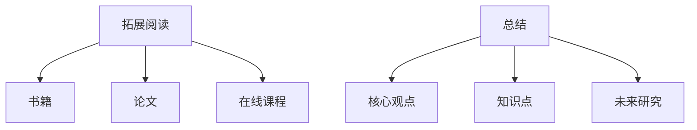

---

通过以上步骤，我们构建了一个逻辑清晰、结构紧凑的技术博客文章大纲。接下来，我们将逐步填充每个部分的具体内容，确保文章的完整性和专业性。在填充内容时，我们将使用Python源代码、LaTeX公式和Mermaid流程图来详细阐述每个概念和算法，以便读者更好地理解和掌握相关技术。

