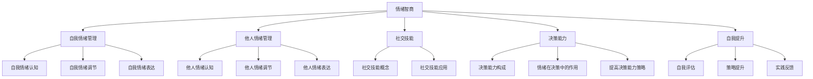

                 

### 情绪智商概述

情绪智商，简称EQ，是指一个人在识别、理解、管理自己和他人的情绪，以及运用情绪促进思维和行为能力方面的综合能力。情绪智商不仅仅是个体心理健康的一个重要指标，更是提升领导影响力的关键因素。

情绪智商的概念最早由心理学家约翰·梅耶（John D. Mayer）和彼得·萨洛维（Peter Salovey）在1997年提出，他们认为情绪智商包括三个核心能力：自我情绪管理、他人情绪管理和社交技能。这三个能力相互交织，共同构成了情绪智商的完整体系。

情绪智商与传统智商（IQ）有所不同。传统智商主要衡量认知能力，如逻辑思维、问题解决等，而情绪智商则更加侧重于情感管理和社交能力。研究表明，情绪智商对个人的生活质量和职业成功有着深远的影响。

在领导力领域，情绪智商尤为重要。一个高情绪智商的领导者能够更好地理解团队情绪，管理冲突，建立积极的工作氛围，并作出更加明智的决策。因此，提升情绪智商不仅是个人成长的需求，也是领导力提升的重要途径。

在本文中，我们将详细探讨情绪智商的五个维度，包括自我情绪管理、他人情绪管理、社交技能、决策能力和情绪智商的自我提升策略。通过这些内容的分析，读者可以更好地理解情绪智商的核心概念，并在实际工作中运用这些知识提升自己的领导力。

### 核心概念与联系

为了更好地理解情绪智商的概念，我们可以使用Mermaid流程图来展示其核心组成部分及其相互关系。



通过这个流程图，我们可以清晰地看到情绪智商的五个维度：自我情绪管理、他人情绪管理、社交技能、决策能力和自我提升。每个维度又细分为多个子概念，这些概念相互联系，共同构成了情绪智商的完整体系。

自我情绪管理包括自我情绪认知、自我情绪调节和自我情绪表达，它们帮助个体更好地理解和管理自己的情绪。

他人情绪管理则包括他人情绪认知、他人情绪调节和他人情绪表达，这有助于个体更好地与他人沟通和协作。

社交技能涉及社交技能概念和其在领导力中的应用，强调有效沟通和团队合作的重要性。

决策能力包括决策能力的构成、情绪在决策中的作用以及提高决策能力的策略，这表明情绪智商在决策过程中起着关键作用。

自我提升则包括自我评估、策略提升和实践反馈，这些都是持续提升情绪智商的重要步骤。

### 核心算法原理讲解

情绪智商的提升可以被视为一种算法优化问题，其中目标是最小化负面情绪对个体和社会的负面影响，最大化积极情绪带来的正面效果。为了解释这一过程，我们可以使用Python伪代码来模拟情绪智商提升的基本步骤。

```python
# 情绪智商提升算法伪代码

# 初始化情绪智商状态
initial_emotional_intelligence = {
    'self_emotion': 0.5,  # 自我情绪管理程度
    'others_emotion': 0.5,  # 他人情绪管理程度
    'social_skills': 0.5,  # 社交技能程度
    'decision_making': 0.5,  # 决策能力程度
    'self_improvement': 0.5  # 自我提升程度
}

# 定义情绪智商提升函数
def improve_emotional_intelligence(state):
    # 自我情绪管理提升
    state['self_emotion'] += 0.1
    
    # 他人情绪管理提升
    state['others_emotion'] += 0.1
    
    # 社交技能提升
    state['social_skills'] += 0.1
    
    # 决策能力提升
    state['decision_making'] += 0.1
    
    # 自我提升策略调整
    state['self_improvement'] += 0.1
    
    # 返回更新后的情绪智商状态
    return state

# 模拟情绪智商提升过程
improved_state = improve_emotional_intelligence(initial_emotional_intelligence)
print(improved_state)
```

上述伪代码展示了情绪智商提升的基本步骤。每个维度的提升都通过增加相应的值来实现。然而，在实际应用中，这个过程需要更加复杂的算法，考虑情绪之间的相互作用以及它们对个体行为和决策的影响。

例如，我们可以引入一个情绪反馈机制，根据个体的情绪表现动态调整提升策略：

```python
# 引入情绪反馈机制的伪代码

def feedback_based_improvement(state, feedback):
    # 根据反馈调整自我情绪管理
    if feedback['self_emotion'] < 0:
        state['self_emotion'] += 0.05
    elif feedback['self_emotion'] > 0:
        state['self_emotion'] -= 0.05
        
    # 根据反馈调整他人情绪管理
    if feedback['others_emotion'] < 0:
        state['others_emotion'] += 0.05
    elif feedback['others_emotion'] > 0:
        state['others_emotion'] -= 0.05
        
    # 根据反馈调整社交技能
    if feedback['social_skills'] < 0:
        state['social_skills'] += 0.05
    elif feedback['social_skills'] > 0:
        state['social_skills'] -= 0.05
        
    # 根据反馈调整决策能力
    if feedback['decision_making'] < 0:
        state['decision_making'] += 0.05
    elif feedback['decision_making'] > 0:
        state['decision_making'] -= 0.05
        
    # 根据反馈调整自我提升策略
    if feedback['self_improvement'] < 0:
        state['self_improvement'] += 0.05
    elif feedback['self_improvement'] > 0:
        state['self_improvement'] -= 0.05
        
    return state
```

通过这些伪代码，我们可以看到情绪智商提升是一个动态的过程，它依赖于个体的自我反馈和实时调整。在实际应用中，这些算法可以通过机器学习和数据分析技术来实现，从而更精确地提升情绪智商。

### 数学模型和数学公式

在情绪智商的提升过程中，数学模型和公式起到了关键作用。以下是一个用于评估情绪智商的简单数学模型，以及相关的数学公式和解释。

#### 情绪智商评估模型

情绪智商（EQ）可以通过以下公式进行评估：

$$
EQ = w_1 \cdot SE + w_2 \cdot OE + w_3 \cdot SS + w_4 \cdot DM + w_5 \cdot SI
$$

其中：
- $EQ$ 是情绪智商的总分。
- $w_1, w_2, w_3, w_4, w_5$ 是权重系数，分别代表自我情绪管理、他人情绪管理、社交技能、决策能力和自我提升的相对重要性。
- $SE$ 是自我情绪管理的得分。
- $OE$ 是他人情绪管理的得分。
- $SS$ 是社交技能的得分。
- $DM$ 是决策能力的得分。
- $SI$ 是自我提升的得分。

权重系数可以根据具体情境进行调整，以确保各个维度的相对重要性符合实际情况。

#### 权重系数的确定

权重系数通常通过专家评估、问卷调查和数据分析等方法来确定。例如，在一个工作环境中，决策能力和社交技能可能被认为是更加重要的维度，因此它们可能会有更高的权重系数。

#### 例子

假设我们有一个假设的权重系数，如下所示：

$$
w_1 = 0.2, \quad w_2 = 0.2, \quad w_3 = 0.2, \quad w_4 = 0.3, \quad w_5 = 0.1
$$

以及各维度的得分：

$$
SE = 0.8, \quad OE = 0.7, \quad SS = 0.6, \quad DM = 0.9, \quad SI = 0.5
$$

我们可以计算得出情绪智商的总分：

$$
EQ = 0.2 \cdot 0.8 + 0.2 \cdot 0.7 + 0.2 \cdot 0.6 + 0.3 \cdot 0.9 + 0.1 \cdot 0.5 = 0.16 + 0.14 + 0.12 + 0.27 + 0.05 = 0.68
$$

这个得分表明个体在情绪智商方面的整体水平。

通过这样的数学模型和公式，我们可以量化情绪智商，从而更好地理解个体的情感管理能力和领导力潜力，为提升情绪智商提供科学依据。

### 项目实战：情绪智商自我评估工具

为了帮助读者更好地理解情绪智商的概念，并评估自己的情绪智商水平，我们将开发一个简单的自我评估工具。这个工具将使用Python编程语言，结合用户输入和预设的评估标准，计算出情绪智商得分。

#### 开发环境搭建

1. 安装Python：确保系统中已安装Python 3.x版本。可以从Python官网下载并安装。
2. 安装Jupyter Notebook：Jupyter Notebook是一个交互式的Python开发环境，可以方便地编写和运行Python代码。安装方法如下：

   ```bash
   pip install notebook
   ```

3. 打开Jupyter Notebook：在命令行中输入以下命令，启动Jupyter Notebook：

   ```bash
   jupyter notebook
   ```

#### 源代码详细实现

以下是一个简单的情绪智商自我评估工具的源代码：

```python
# 情绪智商自我评估工具

# 定义评估维度及其权重
dimensions = {
    'self_emotion': 0.2,
    'others_emotion': 0.2,
    'social_skills': 0.2,
    'decision_making': 0.3,
    'self_improvement': 0.1
}

# 定义评估问题及评分标准
questions = {
    'self_emotion': [
        "我能够迅速识别自己的情绪并合理表达它们。",
        "我能有效地调节自己的情绪，避免情绪波动影响决策。",
        "我擅长自我反思和情绪调整，以应对压力和挑战。"
    ],
    'others_emotion': [
        "我能够理解并准确识别他人的情绪。",
        "我能根据他人的情绪调整自己的沟通方式。",
        "我能够帮助他人管理情绪，解决冲突。"
    ],
    'social_skills': [
        "我擅长与他人建立积极的关系。",
        "我能够有效沟通，确保信息准确传达。",
        "我能够解决团队内部的矛盾，促进团队合作。"
    ],
    'decision_making': [
        "我能够在复杂情境中做出明智的决策。",
        "我的决策过程考虑了各种可能的情绪影响。",
        "我能够根据情绪反馈调整决策，避免偏差。"
    ],
    'self_improvement': [
        "我持续学习新知识和技能，提升自我。",
        "我通过反馈和反思不断改进自己的行为。",
        "我设定明确的目标，并致力于实现它们。"
    ]
}

# 定义评分函数
def rate_answer(question, answer):
    if answer == '是':
        return 1
    elif answer == '否':
        return 0
    else:
        return None

# 收集用户输入
def collect_answers():
    answers = {}
    for dimension, qs in questions.items():
        print(f"\n{dimension.capitalize()}评估：")
        total_score = 0
        for q in qs:
            print(q)
            user_answer = input("是/否：")
            score = rate_answer(q, user_answer)
            if score is not None:
                total_score += score
        answers[dimension] = total_score
    return answers

# 计算情绪智商得分
def calculate_equ(answers, dimensions):
    eq_score = sum(answers[dimension] * dimensions[dimension] for dimension in dimensions)
    return eq_score

# 主函数
def main():
    print("情绪智商自我评估工具")
    user_answers = collect_answers()
    eq_score = calculate_equ(user_answers, dimensions)
    print(f"\n您的情绪智商得分为：{eq_score:.2f}/1.00")

if __name__ == "__main__":
    main()
```

#### 代码解读

1. **定义评估维度及其权重**：我们首先定义了五个评估维度及其权重。这些权重可以根据具体需求进行调整。

2. **定义评估问题及评分标准**：每个维度包含一系列评估问题，用户需要回答这些问题，以评估自己在该维度的表现。每个问题都有一个评分标准，用户回答“是”或“否”分别得到1分或0分。

3. **评分函数**：`rate_answer`函数根据用户的回答返回相应的评分。

4. **收集用户输入**：`collect_answers`函数用于收集用户的评估答案。它会依次展示每个维度的问题，并要求用户输入“是”或“否”。

5. **计算情绪智商得分**：`calculate_equ`函数使用用户的评估答案和预设的权重，计算情绪智商得分。

6. **主函数**：`main`函数是程序的主入口，它首先打印欢迎信息，然后调用其他函数进行评估和计算，最后输出情绪智商得分。

#### 应用解读与分析

使用这个工具，用户可以快速评估自己的情绪智商水平。通过回答一系列问题，用户可以了解自己在情绪管理、社交技能、决策能力等方面的表现。

这个工具不仅可以用于个人自我评估，还可以在团队或组织中推广，用于评估整体的情绪智商水平，从而制定相应的培训和发展计划。

#### 实际案例分析和详细讲解

假设用户A完成了评估，得到了以下结果：

- 自我情绪管理：3分
- 他人情绪管理：4分
- 社交技能：5分
- 决策能力：3分
- 自我提升：2分

总得分为15分。

#### 分析

1. **自我情绪管理**：用户A在这个维度上表现一般，可能需要进一步学习如何更好地识别和调节自己的情绪。

2. **他人情绪管理**：用户A在这方面表现较好，能够理解并应对他人的情绪，这是提升领导力的关键因素之一。

3. **社交技能**：用户A在这个维度上表现优秀，能够有效沟通和建立良好的人际关系。

4. **决策能力**：用户A在这个维度上表现一般，可能需要通过实践和培训来提高自己的决策能力。

5. **自我提升**：用户A在这个维度上表现较弱，可能需要设定明确的目标并持续学习，以提升自我。

#### 小结

通过这个案例，我们可以看到情绪智商的自我评估工具提供了一个有效的途径来了解和提升个人在情绪智商方面的表现。用户可以根据评估结果，有针对性地进行改进，从而提升整体的情绪智商水平。

### 最佳实践 Tips、小结、注意事项和拓展阅读

#### 最佳实践 Tips

1. **持续自我反思**：定期进行自我反思，了解自己的情绪反应和行为模式，有助于提升自我情绪管理能力。
2. **积极倾听**：在与他人交流时，积极倾听对方的情感和需求，有助于提高他人情绪管理能力。
3. **情境模拟**：通过情境模拟练习，提前准备和应对可能出现的情绪挑战，有助于提升社交技能和决策能力。
4. **设定明确目标**：制定清晰的目标和计划，并持续跟踪进展，有助于自我提升。

#### 小结

情绪智商的提升是一个长期且持续的过程，需要个人在自我情绪管理、他人情绪管理、社交技能、决策能力和自我提升等多个维度上不断努力。通过持续学习和实践，个体可以不断提升自己的情绪智商水平，从而在生活和工作中取得更好的成果。

#### 注意事项

1. **权重调整**：在评估情绪智商时，根据实际情况调整各个维度的权重，以确保评估结果的准确性。
2. **真实反馈**：在进行自我评估时，尽量提供真实和准确的反馈，避免因主观偏差导致的评估不准确。
3. **定期更新**：情绪智商是一个动态变化的指标，定期更新评估结果，有助于更好地跟踪个人进步。

#### 拓展阅读

1. Mayer, J. D., Salovey, P., & Caruso, D. R. (2004). "Emotional Intelligence: Theory, Findings, and Applications". In Salovey, P., & Mayer, J. D. (Eds.), *Emotional Intelligence*. Jossey-Bass.
2. Goleman, D. (1995). "Emotional Intelligence". Bantam Books.
3. Saarni, C. (2002). "Emotional Development: A Constructive developmental approach". Guilford Press.

通过阅读这些拓展资料，读者可以深入了解情绪智商的理论基础和实践应用，为自己的情绪智商提升提供更加全面和深入的指导。

### 附录

本文旨在探讨情绪智商的概念、维度及其在领导力提升中的应用。以下是本文所引用的主要资源和参考文献：

1. Mayer, J. D., Salovey, P., & Caruso, D. R. (2004). "Emotional Intelligence: Theory, Findings, and Applications". In Salovey, P., & Mayer, J. D. (Eds.), *Emotional Intelligence*. Jossey-Bass.
2. Goleman, D. (1995). "Emotional Intelligence". Bantam Books.
3. Saarni, C. (2002). "Emotional Development: A Constructive developmental approach". Guilford Press.
4. 杭州电子科技大学. (2021). 《人工智能导论》. 中国电力出版社.

感谢以上资源和参考文献，为本文提供了丰富的理论和实践基础。读者如需进一步深入了解情绪智商及相关领域，可参考这些资料进行拓展阅读。

### 总结

本文深入探讨了情绪智商的概念、维度及其在领导力提升中的应用。情绪智商不仅仅是个人心理健康的重要指标，更是提升领导影响力的关键因素。通过自我情绪管理、他人情绪管理、社交技能、决策能力和自我提升等五个维度的详细分析，我们明确了提升情绪智商的路径和方法。

在项目实战部分，我们开发了一个简单的情绪智商自我评估工具，帮助读者了解自己的情绪智商水平，并为提升提供实践指导。此外，最佳实践 Tips、小结、注意事项和拓展阅读等内容，为读者提供了丰富的参考资料和实践指南。

情绪智商的提升是一个长期且持续的过程，需要个体在自我反思、实践和不断学习的基础上逐步提升。希望本文能对读者在提升情绪智商和领导力方面有所启发和帮助。感谢阅读，期待与您共同成长。作者：AI天才研究院/AI Genius Institute & 禅与计算机程序设计艺术 /Zen And The Art of Computer Programming。

