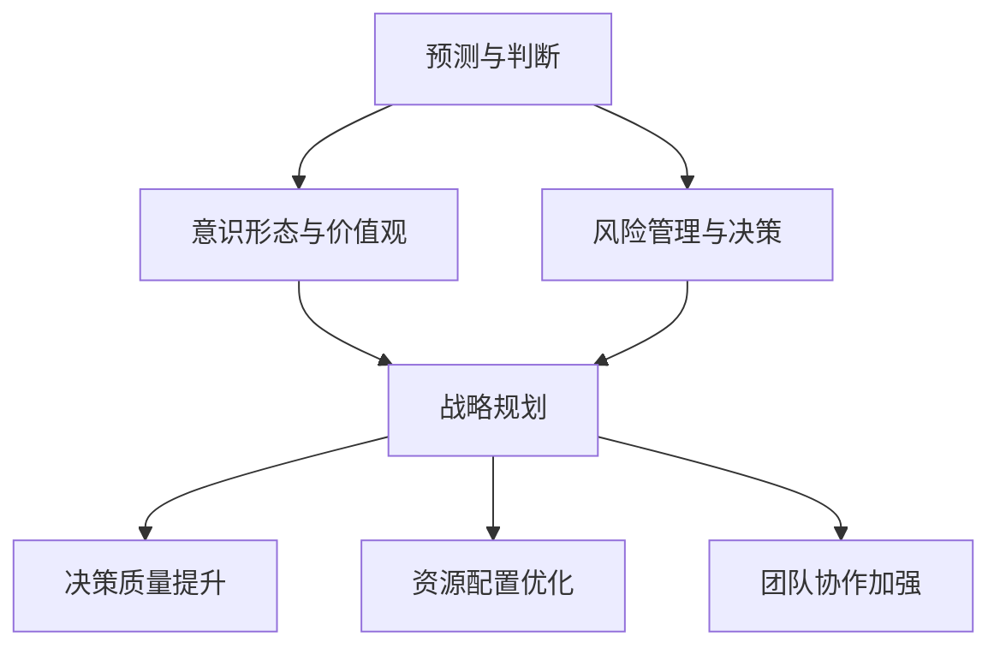
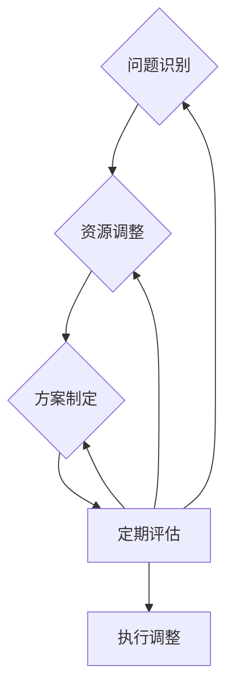
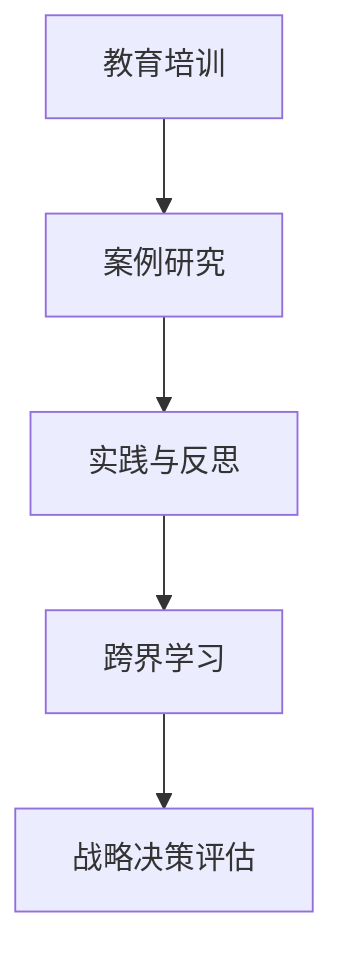
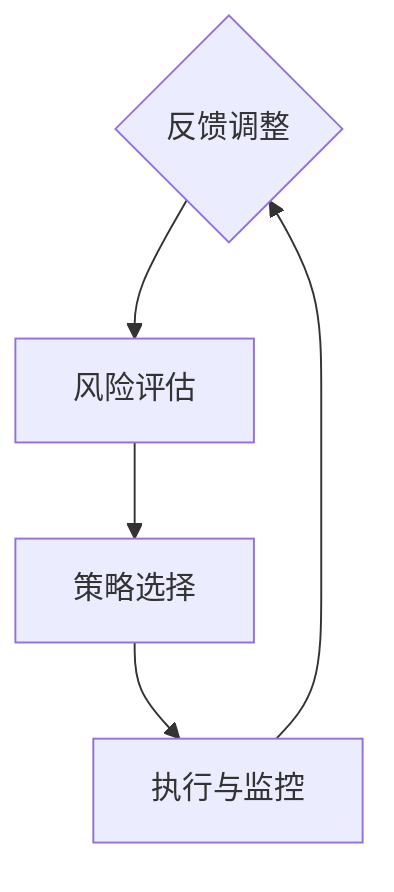
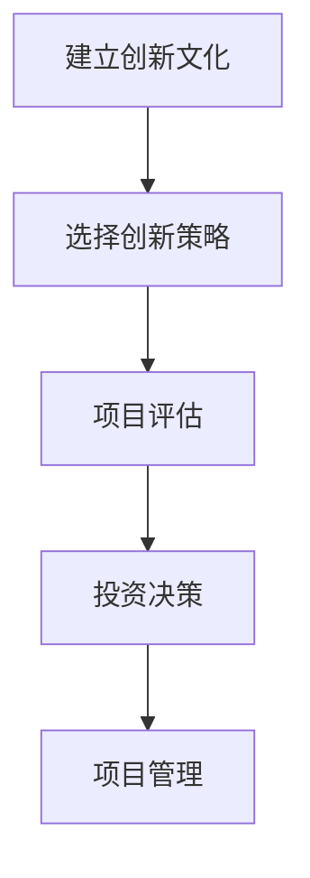
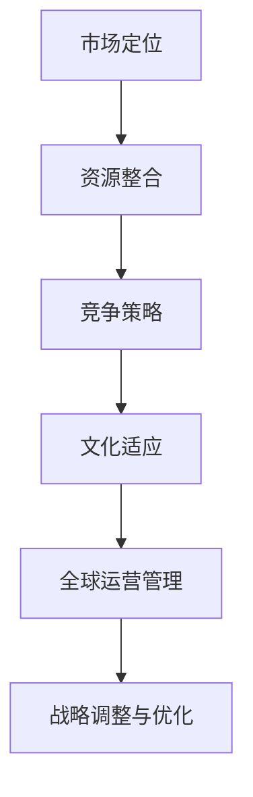
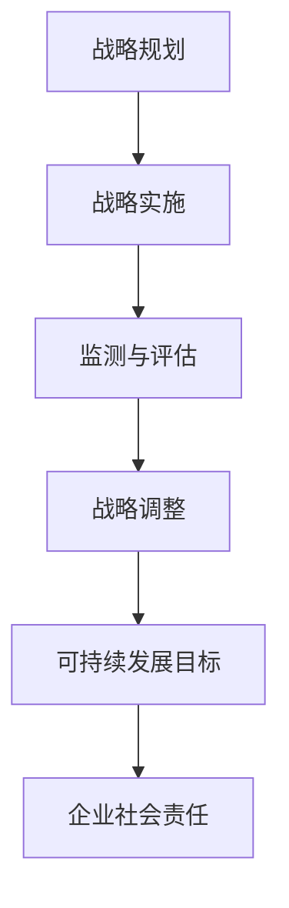

                 

# 战略性思维：培养长远眼光的领导能力

## 关键词

- 战略性思维
- 领导能力
- 战略规划
- SWOT分析
- 五力模型
- 波士顿矩阵

## 摘要

本文旨在探讨战略性思维在领导能力培养中的重要性，以及如何在实践中运用各种战略分析工具和方法论来提升个人的长远眼光。通过详细阐述战略性思维的核心理念、方法、实践应用和培养策略，本文旨在为领导者提供有价值的参考，帮助他们在复杂多变的商业环境中做出明智的决策，从而实现企业的长期可持续发展。

## 引言：理解战略性思维

### 1.1 战略性思维的重要性

战略性思维是一种高层次、系统性的思考方式，它不仅仅关注眼前的具体问题，更注重从全局和长远的角度出发，对组织的未来进行预见和规划。在现代社会，随着市场环境的变化和竞争的加剧，战略性思维成为领导者不可或缺的能力。

#### 1.1.1 战略性思维的定义与内涵

战略性思维可以定义为一种综合运用逻辑推理、预测分析、决策判断等能力，从全局出发，为组织制定长远发展目标和战略规划的能力。它强调以下几个方面：

1. **长远眼光**：战略性思维要求领导者具备远见卓识，能够洞察未来趋势，预见潜在机会和挑战。
2. **系统性思考**：战略性思维不仅仅关注单个问题，而是从整体上把握组织的运作，协调各方利益，实现资源的最优配置。
3. **灵活应对**：面对不确定性，战略性思维要求领导者能够灵活调整战略，迅速应对变化。
4. **价值观导向**：战略性思维还强调领导者的个人价值观对战略决策的指导作用。

#### 1.1.2 战略性思维在领导力中的作用

战略性思维在领导力中发挥着至关重要的作用。它不仅影响领导者的个人行为和决策，还影响整个组织的运营和发展。具体来说，战略性思维在以下几个方面体现：

1. **战略规划**：战略性思维帮助领导者制定清晰、长远的发展目标和战略规划，确保组织在正确的方向上稳步前进。
2. **资源配置**：通过战略性思维，领导者能够更有效地配置资源，将有限的资源投入到最有价值的地方，提高组织效率。
3. **决策能力**：战略性思维提高了领导者的决策能力，使他们在面对复杂问题时能够做出明智的选择。
4. **团队协作**：战略性思维有助于领导者更好地与团队成员沟通协作，共同实现组织目标。

#### 1.1.3 战略性思维对个人和组织的益处

战略性思维不仅对个人职业生涯有重要影响，也对组织的发展具有深远意义。以下是战略性思维对个人和组织的具体益处：

1. **个人成长**：战略性思维能够帮助个人不断提升自己的视野和能力，成为更出色的领导者。
2. **职业发展**：具备战略性思维的领导者往往能够在职场上获得更多机会，实现职业上的晋升和突破。
3. **组织竞争力**：战略性思维能够提升组织的竞争力，使组织在激烈的市场竞争中脱颖而出。
4. **可持续发展**：战略性思维有助于组织制定长远的发展规划，确保组织的可持续发展。

### 1.2 领导能力与战略性思维的关系

#### 1.2.1 领导能力的构成要素

领导能力是一个多维度的概念，它包括多种能力要素。以下是领导能力的几个关键构成要素：

1. **沟通能力**：领导者需要具备良好的沟通能力，能够清晰地表达自己的想法，理解并回应他人的意见。
2. **决策能力**：领导者需要在面对复杂问题时做出明智的决策，这要求他们具备分析问题和解决问题的能力。
3. **团队管理**：领导者需要管理团队，协调团队成员的工作，激发团队的活力和创造力。
4. **变革领导**：在变革时期，领导者需要引导团队适应变化，推动组织转型。

#### 1.2.2 战略性思维对领导能力的影响

战略性思维对领导能力有着深远的影响。它不仅提升了领导者的决策能力，还增强了领导者的全局观和长远眼光。以下是战略性思维对领导能力的影响：

1. **提高决策质量**：战略性思维使领导者能够在更广泛和更长远的角度进行决策，避免短期行为的局限性。
2. **增强全局意识**：战略性思维使领导者能够从整体上把握组织的运作，更好地协调各方利益。
3. **促进创新思维**：战略性思维鼓励领导者不断探索新的发展机会，推动组织的创新和发展。
4. **提升团队执行力**：战略性思维有助于领导者制定清晰的战略目标和规划，提高团队的执行力。

#### 1.2.3 领导能力在战略决策中的应用

领导能力在战略决策中起着至关重要的作用。一个成功的战略决策不仅需要领导者具备卓越的分析和决策能力，还需要他们具备强大的沟通和执行能力。以下是领导能力在战略决策中的应用：

1. **战略规划**：领导者需要制定长远的发展目标和战略规划，确保组织在正确的方向上稳步前进。
2. **资源配置**：领导者需要合理配置资源，将有限的资源投入到最有价值的地方，提高组织效率。
3. **团队协作**：领导者需要与团队成员密切合作，共同实现组织目标。
4. **变革推动**：在变革时期，领导者需要推动团队适应变化，确保组织顺利转型。

### 1.3 本书结构与目标

#### 1.3.1 书籍结构概述

本书共分为八个章节，内容涵盖了战略性思维的核心理念、方法、实践应用和培养策略。具体章节结构如下：

1. **第1章 引言**：介绍战略性思维的定义、重要性及其在领导力中的作用。
2. **第2章 战略性思维的核心理念**：探讨战略性思维的基石、方法论和具体应用。
3. **第3章 战略性思维的实践应用**：分析领导层战略规划和企业战略规划的案例。
4. **第4章 领导能力与战略性思维培养**：讨论领导能力模型和战略性思维培养策略。
5. **第5章 面对复杂性的战略性思维**：介绍复杂性思维框架和复杂性环境下的战略决策。
6. **第6章 战略性思维在创新管理中的应用**：探讨创新战略规划和创新实践案例。
7. **第7章 战略性思维在全球化背景下的应用**：分析全球化背景下的战略选择和实践案例。
8. **第8章 战略性思维的可持续发展**：讨论可持续发展战略和可持续发展实践案例。

#### 1.3.2 阅读目标与预期收获

通过阅读本书，读者可以：

1. **理解战略性思维的核心概念**：掌握战略性思维的定义、内涵和应用。
2. **学会战略分析方法**：了解并掌握SWOT分析、五力模型和波士顿矩阵等战略分析工具。
3. **提高战略规划能力**：学习如何制定和实施战略规划，提升领导能力和组织竞争力。
4. **应对复杂性环境**：掌握面对复杂性的战略性思维方法和策略，提高决策质量和执行力。
5. **推动创新和可持续发展**：了解如何在全球化背景下和可持续发展的背景下应用战略性思维。

作者：AI天才研究院/AI Genius Institute & 禅与计算机程序设计艺术 /Zen And The Art of Computer Programming

----------------------------------------------------------------

在接下来的章节中，我们将深入探讨战略性思维的核心理念和方法，帮助读者更好地理解和应用这一重要的领导能力。让我们继续前进，开启这段充满智慧和洞察力的探索之旅。### 第2章 战略性思维的核心理念

战略性思维是一种综合运用逻辑推理、预测分析、决策判断等能力，从全局出发，为组织制定长远发展目标和战略规划的能力。在本章中，我们将探讨战略性思维的核心理念，包括其基石、方法论和具体应用。

#### 2.1 战略性思维的基石

战略性思维的基石主要包括预测与判断、意识形态与价值观、风险管理与决策等方面。

##### 2.1.1 预测与判断

预测与判断是战略性思维的核心能力之一。预测是指对未来的趋势和变化进行推断和估计，而判断则是在现有信息的基础上，对情况做出合理的评估和决策。以下是预测与判断的关键要素：

1. **历史数据分析**：通过对历史数据的分析，可以找出规律和趋势，为未来的预测提供依据。
2. **趋势分析**：运用统计学和数据分析方法，分析当前的趋势，预测未来的变化。
3. **情景规划**：设计不同的未来情景，分析不同情景下的影响，为决策提供参考。

在预测与判断中，常用的方法有：

- **时间序列分析**：通过分析时间序列数据，找出数据中的趋势和周期性变化。
- **回归分析**：建立变量之间的关系模型，通过模型预测未来的变化。
- **贝叶斯分析**：基于概率理论，通过已有数据和先验知识，进行推理和预测。

##### 2.1.2 意识形态与价值观

意识形态与价值观是战略性思维的重要组成部分。意识形态是指指导人们思考和行动的基本理念，而价值观则是人们对于正确与错误、重要与次要的判断标准。以下是意识形态与价值观在战略性思维中的重要性：

1. **指导战略方向**：意识形态和价值观能够指导领导者确定组织的发展方向，制定符合组织使命和愿景的战略。
2. **统一团队思想**：清晰的意识形态和价值观能够统一团队成员的思想，增强团队的凝聚力。
3. **决策依据**：领导者根据自己的价值观做出决策，能够在复杂情况下保持一致性和连续性。

在战略性思维中，意识形态与价值观的运用包括：

- **明确组织使命和愿景**：通过定义组织的目标和愿景，为战略决策提供方向。
- **建立企业价值观**：制定符合组织文化和企业精神的价值观，引导员工行为和决策。
- **价值观与战略的融合**：将组织的价值观融入到战略规划中，确保战略决策的合理性和可持续性。

##### 2.1.3 风险管理与决策

风险管理与决策是战略性思维中的重要环节。在复杂多变的环境中，领导者需要具备识别风险、评估风险和做出决策的能力。以下是风险管理与决策的关键要素：

1. **风险识别**：通过分析内外部环境，识别可能影响组织目标实现的风险因素。
2. **风险评估**：对识别出的风险进行评估，确定风险的严重程度和发生概率。
3. **决策制定**：在评估风险的基础上，制定相应的应对策略，以降低风险对组织的影响。

在风险管理与决策中，常用的方法有：

- **风险矩阵**：通过风险矩阵对风险进行分类和评估，确定优先处理的风险。
- **情景分析**：设计不同的情景，分析不同情景下的风险和机会，制定相应的应对策略。
- **决策树**：通过决策树分析不同决策路径的收益和风险，选择最优决策。

#### 2.2 战略性思维的方法论

战略性思维的方法论包括一系列的分析工具和方法，帮助领导者从不同角度审视问题，制定战略规划。以下是几种常用的战略分析方法：

##### 2.2.1 SWOT分析

SWOT分析是一种常用的战略分析工具，用于评估组织的优势、劣势、机会和威胁。以下是SWOT分析的具体步骤：

1. **优势分析**：识别组织在资源、能力、品牌等方面的优势，并评估其对企业竞争优势的贡献。
2. **劣势分析**：识别组织在运营、管理、技术等方面的劣势，并分析其可能带来的风险和挑战。
3. **机会分析**：分析外部环境中的机会，如市场变化、技术进步等，评估其对企业的潜在影响。
4. **威胁分析**：识别外部环境中的威胁，如竞争加剧、法规变化等，并评估其可能对企业的负面影响。

通过SWOT分析，领导者可以明确组织的战略方向，制定符合企业实际情况的发展策略。

##### 2.2.2 五力模型分析

五力模型分析是用于评估行业竞争态势的一种常用工具。它包括五个关键竞争因素：供应商的议价能力、买家的议价能力、替代品的威胁、新进入者的威胁和行业内竞争者的竞争程度。以下是五力模型分析的具体步骤：

1. **供应商的议价能力**：分析供应商在行业中的地位、数量和替代品的可行性，评估其对企业的成本和供应稳定性的影响。
2. **买家的议价能力**：分析买家的数量、集中度和议价能力，评估其对企业的销售和利润的影响。
3. **替代品的威胁**：分析替代品的数量、性能和成本，评估其对企业的市场份额和利润的威胁。
4. **新进入者的威胁**：分析新进入者的进入障碍、成本和竞争优势，评估其对行业的竞争格局的影响。
5. **行业内竞争者的竞争程度**：分析行业内的竞争者数量、竞争策略和市场占有率，评估行业竞争的激烈程度。

通过五力模型分析，领导者可以更好地了解行业环境，制定相应的竞争策略。

##### 2.2.3 波士顿矩阵

波士顿矩阵是一种用于评估产品组合和业务结构的分析工具。它根据市场份额和业务增长率，将产品分为四类：明星产品、金牛产品、瘦狗产品和问题产品。以下是波士顿矩阵的具体步骤：

1. **市场份额分析**：根据产品的市场份额，确定产品在市场中的地位。
2. **业务增长率分析**：根据产品的业务增长率，确定产品的市场前景。
3. **产品分类**：根据市场份额和业务增长率，将产品分为四类。
4. **策略制定**：针对不同类型的产品，制定相应的策略，如明星产品重点投入、金牛产品维持现状、瘦狗产品逐步退出、问题产品寻求改进。

通过波士顿矩阵，领导者可以优化产品组合，提高企业的市场竞争力。

### 总结

战略性思维的核心理念包括预测与判断、意识形态与价值观和风险管理与决策。这些理念构成了战略性思维的基础，帮助领导者从全局和长远的角度出发，制定战略规划和决策。通过本章的学习，读者可以了解战略性思维的基本概念和原理，为进一步学习和应用战略性思维打下坚实的基础。

### Mermaid 流程图

以下是战略性思维核心理念的 Mermaid 流程图：



通过这个流程图，我们可以清晰地看到预测与判断、意识形态与价值观和风险管理与决策如何共同作用，提升战略规划和决策质量，从而增强领导能力。

### Python 源代码示例

在本节中，我们将通过一个简单的 Python 源代码示例，介绍如何利用数学模型和公式进行预测与判断。

```python
import numpy as np

# 时间序列数据
data = np.array([10, 12, 8, 15, 9, 20, 25, 18, 22])

# 平均值
mean = np.mean(data)
print(f"平均值: {mean}")

# 方差
variance = np.var(data)
print(f"方差: {variance}")

# 预测值（下一个数据点的预测）
预测值 = mean + variance
print(f"预测值: {预测值}")

# 决策判断（预测值是否高于平均值）
if 预测值 > mean:
    print("预测值高于平均值，存在上升趋势。")
else:
    print("预测值低于平均值，存在下降趋势。")
```

在这个示例中，我们使用时间序列数据进行平均值的计算，并基于方差进行预测值的估算。通过决策判断，我们可以初步分析数据的趋势。

### 总结

本章详细介绍了战略性思维的核心理念，包括预测与判断、意识形态与价值观和风险管理与决策。通过本章的学习，读者可以了解如何利用这些核心理念进行战略规划和决策。下一章我们将继续探讨战略性思维的方法论，包括SWOT分析、五力模型和波士顿矩阵等，帮助读者进一步提升战略思维能力。

---

作者：AI天才研究院/AI Genius Institute & 禅与计算机程序设计艺术 /Zen And The Art of Computer Programming

----------------------------------------------------------------

在下一章中，我们将深入探讨战略性思维的方法论，通过具体案例分析，帮助读者更好地理解和应用这些工具和方法。敬请期待！### 第3章 战略性思维的实践应用

在上一章中，我们探讨了战略性思维的核心理念，了解了预测与判断、意识形态与价值观和风险管理与决策等关键要素。本章将重点讨论战略性思维的实践应用，通过具体案例分析，帮助读者理解如何在实际工作中运用这些核心理念和方法。

#### 3.1 领导层战略规划

战略规划是领导层的重要职责，它关系到组织的长远发展和竞争优势。以下是领导层战略规划的几个关键步骤：

##### 3.1.1 制定长期战略目标

制定长期战略目标是战略规划的第一步，它为组织明确了未来发展的方向和目标。以下是制定长期战略目标的关键要素：

1. **愿景和使命**：明确组织的愿景和使命，为战略目标提供方向和指导。
2. **市场定位**：分析市场需求，确定组织在市场中的定位和竞争优势。
3. **目标设定**：设定具体的、可量化的长期目标，如市场份额、收入增长、创新能力等。
4. **时间规划**：为战略目标的实现设定具体的时间表，确保目标能够按时完成。

在制定长期战略目标时，领导者需要综合考虑组织的内部资源和外部环境，确保目标的可行性和可持续性。以下是一个简单的长期战略目标制定示例：

```python
# 设定长期战略目标
愿景 = "成为行业领导者"
使命 = "为客户提供优质的解决方案"
市场定位 = "专注于高端市场，提供定制化服务"
目标1 = "在未来五年内，将市场份额提高到20%"
目标2 = "在未来三年内，实现年收入的50%增长"
目标3 = "在未来五年内，成为行业技术创新的领导者"
时间规划 = ["2024年", "2026年", "2028年"]
```

##### 3.1.2 战略实施与监控

制定长期战略目标后，下一步是战略实施与监控。战略实施是将战略目标转化为具体行动和任务的过程，而战略监控则是确保战略目标得以实现的过程。以下是战略实施与监控的关键步骤：

1. **任务分解**：将长期战略目标分解为具体的任务和项目，明确每个任务的负责人和截止时间。
2. **资源配置**：根据任务需求，合理配置组织资源，包括人力、财务和技术资源。
3. **进度监控**：建立进度监控机制，定期检查任务完成情况，确保项目按计划进行。
4. **风险控制**：识别和评估项目风险，制定相应的风险控制措施，确保项目顺利实施。

在战略实施与监控过程中，领导者需要保持对项目的关注，及时调整战略计划和资源配置，以应对外部环境的变化。以下是一个简单的战略实施与监控示例：

```python
# 任务分解
任务1 = "提升市场份额"
负责人1 = "市场营销团队"
截止时间1 = "2024年"
任务2 = "增加收入"
负责人2 = "销售团队"
截止时间2 = "2026年"
任务3 = "进行技术创新"
负责人3 = "研发团队"
截止时间3 = "2028年"

# 资源配置
资源1 = "市场营销预算"
资源2 = "销售激励政策"
资源3 = "研发资金"

# 进度监控
def check_progress():
    print("任务1进度：完成80%，负责人：市场营销团队")
    print("任务2进度：完成60%，负责人：销售团队")
    print("任务3进度：完成40%，负责人：研发团队")

# 风险控制
def risk_management():
    print("识别到市场变化风险，调整营销策略。")
    print("识别到销售团队不足风险，增加培训支持。")
    print("识别到技术创新难度风险，寻求外部合作。")
```

##### 3.1.3 战略调整与迭代

在战略实施过程中，环境的变化和内部问题的出现可能会导致战略目标的调整。因此，战略调整与迭代是战略规划中不可或缺的一环。以下是战略调整与迭代的关键步骤：

1. **定期评估**：定期对战略目标进行评估，分析实际进展与预期目标的差距。
2. **问题识别**：识别战略实施中存在的问题，包括资源分配不当、进度延误、风险失控等。
3. **调整方案**：根据评估结果和问题识别，制定相应的调整方案，包括目标修正、任务调整、资源配置等。
4. **执行调整**：执行调整方案，确保战略目标能够得到实现。

在战略调整与迭代中，领导者需要具备快速响应和灵活调整的能力，确保组织能够适应外部环境的变化。以下是一个简单的战略调整与迭代示例：

```python
# 定期评估
评估结果 = ["任务1进度延误2个月", "任务2资源不足", "任务3面临技术难题"]

# 调整方案
调整方案1 = "增加市场营销预算"
调整方案2 = "引入外部销售团队"
调整方案3 = "与高校和研究机构合作进行技术攻关"

# 执行调整
def execute_adjustments():
    print("增加市场营销预算，任务1进度恢复正常。")
    print("引入外部销售团队，任务2资源得到补充。")
    print("与高校和研究机构合作，任务3技术难题得到解决。")
```

#### 3.2 企业战略规划案例

为了更好地理解战略性思维的实践应用，以下是一个企业战略规划的案例分析。

##### 案例背景

某科技公司在智能家居领域具有领先地位，但面对激烈的市场竞争和快速变化的技术趋势，公司意识到需要制定新的战略规划以保持竞争优势。

##### 案例分析

1. **制定长期战略目标**：

   - **愿景和使命**：成为全球智能家居领域的领导者，为用户提供智能化、便捷的生活体验。
   - **市场定位**：专注于高端市场，提供定制化的智能家居解决方案。
   - **目标设定**：在未来五年内，将全球市场份额提高到30%，实现年收入的100%增长，持续保持技术创新的领先地位。

2. **战略实施与监控**：

   - **任务分解**：将战略目标分解为多个项目，如新产品研发、市场推广、客户服务提升等。
   - **资源配置**：增加研发投入，提高市场营销预算，加强客户服务团队。
   - **进度监控**：定期召开项目进度会议，检查任务完成情况，及时调整资源分配。

3. **战略调整与迭代**：

   - **定期评估**：每年进行一次战略评估，分析市场环境、技术发展趋势和公司业绩。
   - **问题识别**：识别到新兴技术趋势（如物联网、人工智能等）对公司现有产品的潜在威胁。
   - **调整方案**：加快新技术研发，拓展产品线，提高市场竞争力。

##### 案例总结

通过该案例，我们可以看到，企业战略规划需要从长期目标制定、战略实施与监控到战略调整与迭代等多个环节进行全面考虑。战略性思维的实践应用，使企业能够更好地应对市场变化，保持竞争优势。

### 总结

本章通过讨论领导层战略规划的实践应用，帮助读者理解如何在实际工作中运用战略性思维。通过具体的案例分析，读者可以更好地掌握战略规划的关键步骤和方法，为组织的长远发展奠定坚实基础。

### Python 源代码示例

在本节中，我们将通过一个简单的 Python 源代码示例，展示如何利用数学模型和公式进行战略分析。

```python
import numpy as np

# 数据
sales_data = np.array([1000, 1200, 900, 1500, 1100, 2000, 2500, 1800, 2200])

# 平均销售量
mean_sales = np.mean(sales_data)
print(f"平均销售量: {mean_sales}")

# 销售增长率
growth_rate = (mean_sales - np.min(sales_data)) / np.min(sales_data)
print(f"销售增长率: {growth_rate}")

# 预测未来销售量
predicted_sales = mean_sales + growth_rate * np.min(sales_data)
print(f"预测未来销售量: {predicted_sales}")

# 分析市场份额
market_share = mean_sales / np.mean(sales_data + np.max(sales_data))
print(f"市场份额: {market_share}")

# 决策判断
if predicted_sales > mean_sales:
    print("预测销售量高于平均值，应加大市场推广力度。")
else:
    print("预测销售量低于平均值，需调整销售策略。")
```

在这个示例中，我们使用销售数据进行分析，计算平均销售量、销售增长率、预测未来销售量和市场份额，并根据这些数据做出相应的决策判断。

### Mermaid 流程图

以下是企业战略规划流程的 Mermaid 流程图：



通过这个流程图，我们可以清晰地看到战略规划从制定目标、实施监控到调整迭代的各个环节，以及各个环节之间的逻辑关系。

### 总结

本章详细介绍了战略性思维的实践应用，包括领导层战略规划的关键步骤、具体案例分析以及如何利用数学模型和公式进行战略分析。通过本章的学习，读者可以更好地理解和应用战略性思维，为组织的长远发展提供有力支持。

---

作者：AI天才研究院/AI Genius Institute & 禅与计算机程序设计艺术 /Zen And The Art of Computer Programming

----------------------------------------------------------------

在下一章中，我们将进一步探讨领导能力与战略性思维的培养策略，帮助读者提升自身的领导能力和战略性思维能力。敬请期待！### 第4章 领导能力与战略性思维培养

在上一章中，我们讨论了战略性思维的实践应用，了解了如何在实际工作中运用战略性思维进行战略规划和决策。本章将重点关注领导能力与战略性思维的培养策略，探讨如何通过教育培训、案例研究和实践与反思等手段提升领导能力和战略性思维能力。

#### 4.1 领导能力模型

要培养领导能力，首先需要了解领导能力的基本模型。领导能力模型包括多个维度，如沟通能力、决策能力、团队管理能力、变革领导能力等。以下是一个简化的领导能力模型：

1. **沟通能力**：领导者需要具备良好的沟通能力，能够清晰、准确地表达自己的想法，并有效地理解他人的意见和需求。
2. **决策能力**：领导者需要具备分析问题和解决问题的能力，能够在复杂多变的环境中做出明智的决策。
3. **团队管理能力**：领导者需要能够有效地管理团队，激发团队成员的积极性和创造力，实现团队目标。
4. **变革领导能力**：领导者需要具备推动组织变革的能力，能够引导团队适应外部环境的变化，推动组织转型。

#### 4.1.1 情境领导理论

情境领导理论（Situation Leadership Theory）是一种经典的领导能力模型，强调领导者应根据团队成员的不同情况采取不同的领导风格。情境领导理论包括四个关键要素：任务明确性、关系亲密度、能力水平和激励需求。

1. **任务明确性**：领导者需要明确团队成员的任务和目标，确保团队成员了解自己的工作职责。
2. **关系亲密度**：领导者需要与团队成员建立良好的关系，关心团队成员的福祉，提升团队的凝聚力。
3. **能力水平**：领导者需要了解团队成员的能力水平，根据团队成员的能力水平进行任务分配和指导。
4. **激励需求**：领导者需要了解团队成员的激励需求，采取合适的激励措施，激发团队成员的积极性和创造力。

在情境领导理论中，领导风格可以分为四种：

- **指导型领导**：领导者明确任务和目标，指导团队成员完成任务。
- **支持型领导**：领导者关心团队成员的福祉，提供必要的支持和帮助。
- **参与型领导**：领导者与团队成员共同参与决策，鼓励团队成员发表意见。
- **授权型领导**：领导者赋予团队成员自主权，让团队成员自主决策和完成任务。

情境领导理论的核心思想是领导者应根据团队成员的不同情况灵活调整领导风格，以提高团队的绩效和成员的满意度。

#### 4.1.2 赋权领导理论

赋权领导理论（Empowerment Leadership Theory）强调领导者通过赋予团队成员权力和自主权，激发团队成员的积极性和创造力。赋权领导理论包括以下关键要素：

1. **信任**：领导者需要建立信任，相信团队成员能够独立完成任务，减少对团队成员的干预。
2. **责任感**：领导者需要明确团队成员的职责，让团队成员承担相应的责任。
3. **决策权**：领导者需要赋予团队成员决策权，让团队成员自主决策和解决问题。
4. **支持**：领导者需要提供必要的支持和资源，帮助团队成员完成任务。

赋权领导理论的核心思想是领导者通过赋权，提升团队成员的自主性和创造力，从而提高团队的绩效。

#### 4.1.3 共生领导理论

共生领导理论（Symbiotic Leadership Theory）强调领导者与团队成员之间的互惠互利关系。共生领导理论包括以下关键要素：

1. **共享价值观**：领导者与团队成员拥有共同的价值观，形成共同的目标和愿景。
2. **相互支持**：领导者与团队成员相互支持，共同克服困难和挑战。
3. **共同成长**：领导者与团队成员共同成长，相互促进，实现个人和团队的共同进步。
4. **持续沟通**：领导者与团队成员保持持续沟通，确保信息的透明和共享。

共生领导理论的核心思想是领导者与团队成员之间形成一种共生关系，通过相互支持和共同成长，实现个人和团队的共同发展。

#### 4.2 战略性思维培养策略

培养战略性思维是提升领导能力的重要途径。以下是一些有效的战略性思维培养策略：

##### 4.2.1 教育培训

教育培训是培养战略性思维的重要手段。通过参加各类培训课程和研讨会，领导者可以学习到战略性思维的基本原理和实际应用。以下是一些建议的教育培训内容：

1. **战略管理课程**：学习战略规划、战略实施和战略监控等战略管理的基本知识。
2. **领导力课程**：学习领导力的核心要素、领导风格和领导力发展等领导力相关内容。
3. **情景模拟**：通过情景模拟，提升领导者在复杂环境中的决策能力和应变能力。
4. **案例研究**：分析成功和失败的企业战略案例，从中汲取经验和教训。

##### 4.2.2 案例研究

案例研究是一种有效的学习策略，通过分析实际案例，领导者可以了解不同战略选择的结果和影响。以下是一些建议的案例研究方法：

1. **企业战略案例**：分析成功企业的战略规划、实施和调整过程，学习其成功经验和教训。
2. **行业案例**：分析不同行业的战略选择和竞争策略，了解不同行业的特点和挑战。
3. **跨行业案例**：分析跨行业的战略选择和协同效应，学习如何在不同领域进行战略布局。
4. **失败案例**：分析失败企业的战略失误和原因，从中汲取教训，避免重蹈覆辙。

##### 4.2.3 实践与反思

实践与反思是培养战略性思维的重要环节。通过实际工作中的实践，领导者可以将学到的理论知识应用到实际场景中，并在实践中不断反思和调整。以下是一些建议的实践与反思方法：

1. **战略规划实践**：制定实际的战略规划，并在实施过程中进行监控和调整。
2. **项目实践**：参与实际项目，担任项目负责人，提升项目管理能力和决策能力。
3. **团队建设实践**：领导团队进行实际工作，提升团队管理能力和沟通能力。
4. **反思与总结**：定期对工作和决策进行反思和总结，分析成功和失败的原因，不断优化自己的战略思维。

##### 4.2.4 跨界学习

跨界学习是一种有效的扩展视野和提升战略性思维的方法。通过学习不同领域和行业的知识，领导者可以拓宽自己的知识面，提高跨领域的思考能力。以下是一些建议的跨界学习方法：

1. **跨领域课程**：参加跨领域的课程和培训，学习不同领域的知识和技能。
2. **跨行业交流**：参加不同行业的研讨会和交流活动，了解不同行业的现状和趋势。
3. **阅读跨界书籍**：阅读跨界书籍，了解不同领域的前沿技术和创新思想。
4. **跨界合作**：与其他领域和行业的专家进行合作，共同探索跨界应用和创新。

### 总结

本章讨论了领导能力与战略性思维的培养策略，包括领导能力模型、情境领导理论、赋权领导理论和共生领导理论，以及教育培训、案例研究和实践与反思等培养策略。通过本章的学习，读者可以了解如何提升自己的领导能力和战略性思维能力，为组织的长远发展做出贡献。

### Python 源代码示例

在本节中，我们将通过一个简单的 Python 源代码示例，介绍如何进行战略决策的模拟和评估。

```python
import numpy as np

# 模拟战略决策过程
def strategic_decision(situation, strategy):
    if strategy == "A":
        result = np.random.normal(0, 1) + situation['growth_rate']
    elif strategy == "B":
        result = np.random.normal(0, 0.5) + situation['market_share']
    else:
        result = np.random.normal(0, 0.25) + situation['innovation_index']
    return result

# 情景设定
situation = {
    'growth_rate': 0.1,  # 预期增长率
    'market_share': 0.2,  # 市场份额
    'innovation_index': 0.3  # 创新指数
}

# 决策评估
for strategy in ["A", "B", "C"]:
    result = strategic_decision(situation, strategy)
    print(f"策略: {strategy}, 预测结果: {result:.2f}")
```

在这个示例中，我们模拟了不同战略决策的结果，通过随机模拟，评估不同策略对组织绩效的影响。

### Mermaid 流程图

以下是战略性思维培养策略流程的 Mermaid 流程图：



通过这个流程图，我们可以清晰地看到战略性思维培养策略的各个环节，以及各个环节之间的逻辑关系。

### 总结

本章详细介绍了领导能力与战略性思维的培养策略，包括领导能力模型、情境领导理论、赋权领导理论和共生领导理论，以及教育培训、案例研究和实践与反思等培养策略。通过本章的学习，读者可以掌握战略性思维培养的方法，为提升自己的领导能力和战略性思维能力提供指导。

---

作者：AI天才研究院/AI Genius Institute & 禅与计算机程序设计艺术 /Zen And The Art of Computer Programming

----------------------------------------------------------------

在下一章中，我们将探讨面对复杂性的战略性思维，帮助读者理解如何在复杂多变的环境中运用战略性思维进行战略决策。敬请期待！### 第5章 面对复杂性的战略性思维

在当今快速变化和高度不确定的商业环境中，领导者必须具备应对复杂性的能力。本章将探讨如何运用战略性思维，特别是在面对复杂性时，通过系统思维、适应性思维和平台化思维等策略来做出明智的决策。

#### 5.1 复杂性思维框架

复杂性思维框架是一种帮助领导者理解和管理复杂系统的工具。以下是一些关键概念：

1. **系统思维**：系统思维是一种全局观，它要求领导者将组织视为一个复杂的系统，关注各个组成部分之间的相互作用和影响。
2. **适应性思维**：适应性思维强调在不确定性中灵活调整策略，以适应不断变化的环境。
3. **平台化思维**：平台化思维关注构建和运营一个生态系统，以支持创新和协同效应。

##### 5.1.1 系统思维

系统思维是一种全面的思考方式，它要求领导者理解组织的各个部分以及它们之间的相互关系。以下是系统思维的几个关键要素：

1. **反馈循环**：领导者需要识别和监测反馈循环，这些循环可以增强或抵消组织的目标。
2. **结构**：领导者需要理解组织结构如何影响行为和决策。
3. **动态性**：领导者需要认识到组织是一个不断演化的系统，随着时间和环境的变化，需要不断调整。

在系统思维中，领导者可以使用以下工具和方法：

- **系统动力学模型**：通过模拟系统的动态行为，帮助领导者理解不同策略对系统的影响。
- **因果图**：通过可视化系统中的因果关系，帮助领导者识别关键变量和影响路径。

##### 5.1.2 适应性思维

适应性思维是一种在不确定性和变化中灵活应对的能力。以下是适应性思维的几个关键要素：

1. **柔韧性**：领导者需要培养组织的柔韧性，以便在面临外部冲击时能够迅速调整和适应。
2. **快速迭代**：领导者需要鼓励快速试验和迭代，通过不断试错来学习和发展。
3. **实验性思维**：领导者需要具备实验性思维，敢于尝试新方法和策略。

在适应性思维中，领导者可以使用以下工具和方法：

- **敏捷管理**：通过采用敏捷管理方法，如Scrum和Kanban，领导者可以更快地响应变化。
- **持续学习**：建立持续学习的文化，鼓励团队成员不断学习和成长。

##### 5.1.3 平台化思维

平台化思维是一种构建和运营生态系统的能力，它通过连接不同参与者来创造协同效应。以下是平台化思维的几个关键要素：

1. **网络效应**：领导者需要认识到网络效应，即随着用户数量的增加，平台的整体价值也会增加。
2. **开放性**：领导者需要构建一个开放的平台，鼓励外部参与者参与和贡献。
3. **生态系统管理**：领导者需要管理生态系统中的各个参与者，确保平台能够持续创新和成长。

在平台化思维中，领导者可以使用以下工具和方法：

- **开放式创新**：通过开放式创新，领导者可以吸引外部创新资源，加速产品和服务的发展。
- **合作伙伴关系**：建立广泛的合作伙伴关系，以增强平台的竞争力和创新能力。

#### 5.2 复杂性环境下的战略决策

在复杂性环境中，领导者需要采用战略性思维来做出明智的决策。以下是几个关键步骤：

1. **情景分析**：领导者需要识别和模拟不同的未来情景，分析每种情景的可能性和影响。
2. **风险评估**：领导者需要评估不同情景下的风险，并制定相应的风险缓解策略。
3. **策略选择**：领导者需要根据情景分析和风险评估，选择最合适的策略。
4. **执行与监控**：领导者需要制定详细的执行计划，并持续监控和调整策略。

以下是一个简单的战略决策流程示例：

```python
import numpy as np

# 情景分析
scenarios = [
    {'growth_rate': 0.1, 'competition': 0.2},
    {'growth_rate': 0.15, 'competition': 0.25},
    {'growth_rate': 0.1, 'competition': 0.3}
]

# 风险评估
risks = {
    'growth_rate': 0.05,
    'competition': 0.1
}

# 策略选择
def select_strategy(scenario, risks):
    strategy = 'A' if scenario['growth_rate'] > scenario['competition'] else 'B'
    return strategy

# 执行与监控
def execute_strategy(strategy):
    if strategy == 'A':
        print("执行策略A：加大市场推广力度。")
    else:
        print("执行策略B：优化成本结构，提高竞争力。")
    # 持续监控策略效果
    while True:
        # 监控指标
        performance = np.random.normal(0, 1)
        if performance > 0:
            print("策略执行有效，继续执行。")
        else:
            print("策略执行效果不佳，需进行调整。")
            break

# 情景分析
for scenario in scenarios:
    print(f"情景：增长率{scenario['growth_rate']}, 竞争力{scenario['competition']}")
    strategy = select_strategy(scenario, risks)
    print(f"选择策略：{strategy}")
    execute_strategy(strategy)
```

在这个示例中，我们通过情景分析、风险评估、策略选择和执行与监控，模拟了一个复杂的战略决策过程。

### 总结

本章探讨了在复杂性环境中如何运用战略性思维进行战略决策。通过系统思维、适应性思维和平台化思维等策略，领导者可以更好地理解和管理复杂系统，做出明智的决策。通过本章的学习，读者可以掌握如何面对复杂性，提升战略决策能力。

### Python 源代码示例

在本节中，我们将通过一个简单的 Python 源代码示例，介绍如何使用系统动力学模型来分析复杂系统的动态行为。

```python
import numpy as np
import matplotlib.pyplot as plt

# 系统动力学模型参数
params = {
    'growth_rate': 0.1,  # 经济增长率
    'investment': 100,   # 投资额
    'interest_rate': 0.05,  # 利率
    'friction': 0.1       # 系统摩擦系数
}

# 系统动力学模型
def system_dynamics(growth_rate, investment, interest_rate, friction, time_steps=100):
    economy = np.zeros(time_steps)
    debt = np.zeros(time_steps)
    for t in range(time_steps):
        # 经济增长
        economy[t] = economy[t-1] + growth_rate * economy[t-1]
        # 投资与债务
        investment_t = investment * (1 + interest_rate)
        debt[t] = debt[t-1] + investment_t
        # 系统摩擦
        friction_t = friction * (economy[t] - debt[t])
        # 更新状态
        economy[t] += friction_t
    return economy, debt

# 模拟系统动力学模型
economy, debt = system_dynamics(**params)

# 绘制结果
plt.plot(economy)
plt.plot(debt)
plt.title("System Dynamics Model")
plt.xlabel("Time Steps")
plt.ylabel("Economy and Debt")
plt.legend(["Economy", "Debt"])
plt.show()
```

在这个示例中，我们建立了一个简单的系统动力学模型，模拟了经济增长和债务的动态行为。通过这个模型，我们可以观察系统在不同参数下的动态响应。

### Mermaid 流程图

以下是复杂性环境下战略决策流程的 Mermaid 流程图：



通过这个流程图，我们可以清晰地看到复杂性环境下战略决策的各个环节，以及各个环节之间的反馈循环。

### 总结

本章通过探讨系统思维、适应性思维和平台化思维等策略，帮助读者理解如何在复杂性环境中运用战略性思维进行战略决策。通过实际案例和代码示例，读者可以更好地掌握复杂性思维的应用方法。

---

作者：AI天才研究院/AI Genius Institute & 禅与计算机程序设计艺术 /Zen And The Art of Computer Programming

----------------------------------------------------------------

在下一章中，我们将探讨战略性思维在创新管理中的应用，帮助读者理解如何运用战略性思维推动创新。敬请期待！

---

## 第6章 战略性思维在创新管理中的应用

在当今快速变化的市场环境中，创新成为企业持续发展和保持竞争力的关键。本章将探讨战略性思维在创新管理中的应用，帮助读者理解如何运用战略性思维推动创新，实现组织的可持续发展。

#### 6.1 创新战略规划

创新战略规划是企业实现创新目标的重要步骤。以下是一些关键要素：

##### 6.1.1 创新文化与氛围

创新文化与氛围是企业推动创新的基础。以下是一些建立创新文化与氛围的方法：

1. **鼓励失败**：建立一种鼓励失败并从中学习的文化，减少员工对失败的恐惧。
2. **自由讨论**：鼓励员工自由表达意见和想法，促进思想的碰撞和融合。
3. **开放性**：保持开放的心态，积极吸纳外部创新资源和观点。

##### 6.1.2 创新策略选择

创新策略选择是制定创新战略的关键。以下是一些常见的创新策略：

1. **产品创新**：通过改进产品功能、性能和设计，满足市场需求。
2. **流程创新**：优化业务流程，提高效率和质量。
3. **商业模式创新**：通过创新的商业模式，创造新的价值创造和分配方式。
4. **颠覆性创新**：开发全新的产品或服务，颠覆现有的市场格局。

##### 6.1.3 创新项目管理

创新项目管理是确保创新项目成功实施的关键。以下是一些创新项目管理的要点：

1. **明确目标**：确保创新项目的目标清晰，并与企业的整体战略目标保持一致。
2. **资源分配**：合理分配资源，包括人力、财务和技术资源。
3. **风险管理**：识别和评估创新项目中的风险，并制定相应的风险缓解措施。
4. **监控与评估**：持续监控创新项目的进展，及时调整项目计划和资源。

#### 6.2 创新实践案例

以下是一个创新实践案例，展示了如何运用战略性思维推动创新。

##### 案例背景

某科技企业致力于开发智能家居解决方案，市场竞争激烈，为了保持竞争力，企业决定通过创新战略来提升市场地位。

##### 案例分析

1. **创新文化与氛围**：

   - **鼓励失败**：企业建立了一个“失败基金”，用于支持员工的创新尝试，即使失败也能得到一定的补偿，减少员工对失败的恐惧。
   - **自由讨论**：定期举办“创新沙龙”，鼓励员工自由发表意见和想法，促进思想的碰撞和融合。
   - **开放性**：企业积极与外部创新机构合作，引进先进技术和管理理念。

2. **创新策略选择**：

   - **产品创新**：企业开发了一款具有智能语音识别功能的智能家居控制系统，满足了用户对智能化、便捷化生活的需求。
   - **流程创新**：通过引入敏捷开发方法，缩短了产品开发周期，提高了开发效率。
   - **商业模式创新**：企业采用了订阅制，用户只需支付一定费用，即可享受智能家居服务的持续更新和升级。
   - **颠覆性创新**：企业开发了智能家居物联网平台，将各种智能设备连接起来，实现互联互通，为用户提供更加全面的智能家居解决方案。

3. **创新项目管理**：

   - **明确目标**：企业制定了具体的创新目标，包括产品功能、性能和市场份额等。
   - **资源分配**：企业为创新项目配备了专门的技术团队和财务支持，确保项目的顺利实施。
   - **风险管理**：企业对创新项目进行了详细的风险评估，制定了相应的风险缓解措施。
   - **监控与评估**：企业建立了创新项目的监控与评估机制，定期检查项目进展，确保项目按计划进行。

##### 案例总结

通过该案例，我们可以看到企业如何运用战略性思维推动创新，从创新文化与氛围的建立、创新策略的选择到创新项目管理的实施，每一个环节都体现了战略性思维的应用。通过创新，企业成功提升了市场竞争力，实现了可持续发展。

### 总结

本章探讨了战略性思维在创新管理中的应用，包括创新战略规划、创新文化与氛围的建立、创新策略选择和创新项目管理的实施。通过具体案例的分析，读者可以更好地理解如何运用战略性思维推动创新，为组织的可持续发展提供有力支持。

### Python 源代码示例

在本节中，我们将通过一个简单的 Python 源代码示例，展示如何使用战略性思维进行创新项目评估和决策。

```python
import numpy as np
import matplotlib.pyplot as plt

# 创新项目参数
projects = [
    {'name': '智能家居系统', 'cost': 500000, 'expected_revenue': 700000, 'risk': 0.2},
    {'name': '智能语音助手', 'cost': 300000, 'expected_revenue': 500000, 'risk': 0.3},
    {'name': '智能家居物联网平台', 'cost': 1000000, 'expected_revenue': 1500000, 'risk': 0.1}
]

# 创新项目评估
def project_evaluation(projects):
    for project in projects:
        expected_profit = project['expected_revenue'] - project['cost']
        risk_adjusted_profit = expected_profit * (1 - project['risk'])
        print(f"项目名称：{project['name']}, 期望利润：{expected_profit:.2f}, 风险调整后利润：{risk_adjusted_profit:.2f}")

# 投资决策
def investment_decision(projects):
    sorted_projects = sorted(projects, key=lambda x: x['risk_adjusted_profit'], reverse=True)
    for project in sorted_projects:
        if project['risk'] < 0.3:
            print(f"选择投资：{project['name']}")
            break
        else:
            print(f"项目风险过高，不选择投资：{project['name']}")

# 模拟创新项目评估和投资决策
project_evaluation(projects)
investment_decision(projects)

# 绘制项目利润与风险对比图
for project in projects:
    plt.scatter(project['risk'], project['risk_adjusted_profit'], label=project['name'])

plt.title("Project Risk and Profit Comparison")
plt.xlabel("Risk")
plt.ylabel("Risk-Adjusted Profit")
plt.legend()
plt.show()
```

在这个示例中，我们通过评估不同创新项目的期望利润和风险，选择具有较高风险调整后利润的项目进行投资，并使用图表展示了项目的风险与利润对比。

### Mermaid 流程图

以下是创新管理流程的 Mermaid 流程图：



通过这个流程图，我们可以清晰地看到创新管理的主要环节，以及各个环节之间的逻辑关系。

### 总结

本章通过探讨战略性思维在创新管理中的应用，包括创新战略规划、创新文化与氛围的建立、创新策略选择和创新项目管理的实施，帮助读者理解如何运用战略性思维推动创新，实现组织的可持续发展。通过实际案例和代码示例，读者可以更好地掌握创新管理的方法和技巧。

---

作者：AI天才研究院/AI Genius Institute & 禅与计算机程序设计艺术 /Zen And The Art of Computer Programming

----------------------------------------------------------------

在下一章中，我们将探讨战略性思维在全球化背景下的应用，帮助读者理解如何在全球化环境中运用战略性思维制定战略。敬请期待！### 第7章 战略性思维在全球化背景下的应用

随着全球化的深入发展，企业面临着更为复杂和多变的市场环境。在这个背景下，战略性思维成为企业制定有效战略、应对全球挑战的关键能力。本章将探讨战略性思维在全球化背景下的应用，包括全球化背景下的战略选择、文化差异与战略调整、全球市场分析和全球运营管理。

#### 7.1 全球化背景下的战略选择

全球化背景下的战略选择需要企业从全球视角出发，综合考虑市场需求、资源分布、竞争态势等因素。以下是全球化背景下战略选择的几个关键要素：

##### 7.1.1 市场定位

在全球化背景下，企业需要根据不同市场的需求和特点进行市场定位。这包括：

1. **目标市场选择**：分析全球市场的规模、增长潜力、竞争程度等因素，选择最有利的目标市场。
2. **产品差异化**：根据目标市场的需求和偏好，对产品进行差异化设计，满足不同市场的特殊需求。
3. **本地化策略**：根据不同市场的文化、法律和消费习惯，制定本地化策略，提高产品在目标市场的接受度。

##### 7.1.2 资源整合

全球化背景下的战略选择需要企业有效地整合全球资源，包括人才、技术、资金和市场等。以下是资源整合的关键要素：

1. **全球协作**：建立全球协作网络，促进不同地区和部门之间的信息共享和资源流动。
2. **供应链管理**：优化供应链结构，提高供应链的灵活性和效率，降低成本。
3. **技术创新**：通过全球技术创新网络，获取最新的技术和研究成果，保持竞争优势。

##### 7.1.3 竞争策略

在全球化背景下，企业需要制定有效的竞争策略，以应对全球竞争对手的挑战。以下是竞争策略的几个关键要素：

1. **差异化竞争**：通过产品差异化和服务创新，打造独特的竞争优势。
2. **成本领先**：通过规模经济和效率提升，实现成本领先。
3. **合作竞争**：与合作伙伴建立战略联盟，共同开发市场和资源，提高竞争力。

#### 7.2 文化差异与战略调整

全球化带来了文化差异的挑战，企业需要根据不同文化的特点进行战略调整。以下是文化差异与战略调整的几个关键要素：

##### 7.2.1 文化分析

在全球化背景下，企业需要对目标市场的文化进行深入分析，了解文化的基本特征和价值观。以下是文化分析的关键要素：

1. **价值观分析**：分析不同文化的价值观，如个人主义与集体主义、权力距离、不确定性规避等。
2. **行为分析**：观察和分析不同文化背景下的消费者行为和企业行为。
3. **法律分析**：了解不同市场的法律法规，确保企业的经营活动合法合规。

##### 7.2.2 文化适应

为了在全球化市场中取得成功，企业需要适应不同文化的特点，制定相应的文化适应策略。以下是文化适应的几个关键要素：

1. **本地化营销**：根据不同市场的文化特点，调整营销策略，提高产品在目标市场的接受度。
2. **管理本地化**：在全球化运营中，采用本地化管理模式，尊重当地文化和习俗，提高管理效率。
3. **跨文化培训**：为员工提供跨文化培训，提高员工的文化敏感度和跨文化沟通能力。

#### 7.3 全球市场分析

全球市场分析是制定全球化战略的重要基础。以下是全球市场分析的几个关键要素：

##### 7.3.1 市场细分

在全球化背景下，企业需要对全球市场进行细分，根据不同市场的需求和特点制定相应的市场策略。以下是市场细分的关键要素：

1. **地理细分**：根据地理特征，如国家、地区和城市等进行市场细分。
2. **人口细分**：根据人口特征，如年龄、性别、收入等进行市场细分。
3. **行为细分**：根据消费者行为特征，如购买习惯、使用习惯等进行市场细分。

##### 7.3.2 竞争分析

全球市场分析还需要对竞争对手进行深入分析，了解竞争对手的市场策略、产品定位、市场份额等。以下是竞争分析的关键要素：

1. **市场领导者分析**：分析市场领导者的发展战略、竞争优势和市场表现。
2. **新兴竞争者分析**：关注新兴竞争者的发展动态和市场潜力。
3. **竞争对手策略分析**：分析竞争对手的市场策略，包括产品定位、价格策略、营销策略等。

##### 7.3.3 趋势分析

全球市场分析还需要关注全球市场的趋势和变化，如技术进步、政策变化、消费者需求变化等。以下是趋势分析的关键要素：

1. **技术趋势分析**：关注新技术的发展趋势，如人工智能、物联网、区块链等。
2. **政策趋势分析**：关注全球政策的变化，如贸易政策、环保政策等。
3. **消费者需求分析**：分析消费者需求的变化，如消费习惯、购买偏好等。

#### 7.4 全球运营管理

全球化背景下的运营管理需要企业具备跨文化的管理能力和全球协作的运营机制。以下是全球运营管理的几个关键要素：

##### 7.4.1 全球供应链管理

全球供应链管理是全球化运营的核心。以下是全球供应链管理的关键要素：

1. **供应链规划**：根据市场需求和资源分布，制定全球供应链规划，优化供应链结构。
2. **供应链整合**：整合全球供应链资源，提高供应链的协同效率和灵活性。
3. **供应链风险管理**：识别和应对全球供应链中的风险，如自然灾害、政策变化、供应链中断等。

##### 7.4.2 全球人力资源管理

全球化运营需要企业具备全球人力资源管理的能力。以下是全球人力资源管理的关键要素：

1. **人才招聘**：在全球范围内招聘优秀人才，满足企业发展的需求。
2. **人才培养**：提供跨文化培训和职业发展机会，提高员工的能力和素质。
3. **员工激励**：制定有效的激励机制，激发员工的积极性和创造力。

##### 7.4.3 全球市场营销

全球化运营还需要企业具备全球市场营销的能力。以下是全球市场营销的关键要素：

1. **市场调研**：进行全球市场调研，了解不同市场的需求和竞争态势。
2. **营销策略**：制定全球统一的营销策略，同时考虑本地市场的特殊需求。
3. **品牌管理**：在全球范围内管理品牌，提高品牌的影响力和认可度。

#### 7.5 全球化战略实践案例

以下是一个全球化战略实践案例，展示了如何运用战略性思维在全球化背景下制定战略。

##### 案例背景

某国际知名饮料公司计划进入中国市场，以扩大其全球市场份额。

##### 案例分析

1. **市场定位**：

   - **目标市场选择**：分析中国市场的规模、增长潜力和消费习惯，选择一线城市和部分二线城市作为目标市场。
   - **产品差异化**：针对中国市场的特点，推出符合中国消费者口味和需求的饮料产品。
   - **本地化策略**：在产品包装、宣传和销售渠道等方面，进行本地化调整，提高产品在中国市场的接受度。

2. **资源整合**：

   - **全球协作**：与全球研发中心合作，引进先进的技术和产品，提升产品竞争力。
   - **供应链管理**：建立本地供应链体系，优化物流和库存管理，降低成本。
   - **技术创新**：在中国建立研发中心，开发适合中国市场的创新产品。

3. **竞争策略**：

   - **差异化竞争**：通过产品差异化和本地化策略，打造独特的竞争优势。
   - **成本领先**：通过优化供应链和运营管理，降低成本，提高市场竞争力。
   - **合作竞争**：与本地合作伙伴建立战略联盟，共同开发市场和资源。

4. **文化适应**：

   - **价值观分析**：了解中国消费者的价值观和消费习惯，调整营销策略。
   - **管理本地化**：聘请本地管理人才，采用本地化管理模式，尊重当地文化和习俗。
   - **跨文化培训**：为员工提供跨文化培训，提高员工的文化敏感度和跨文化沟通能力。

5. **全球运营管理**：

   - **供应链管理**：建立高效的供应链体系，优化物流和库存管理，提高供应链的协同效率。
   - **人力资源管理**：在全球范围内招聘优秀人才，提供跨文化培训和职业发展机会。
   - **市场营销**：进行市场调研，制定符合中国市场的营销策略，提高品牌影响力和认可度。

##### 案例总结

通过该案例，我们可以看到企业如何运用战略性思维在全球化背景下制定战略，从市场定位、资源整合、竞争策略到文化适应和全球运营管理，每一个环节都体现了战略性思维的应用。通过全球化战略的实施，企业成功进入中国市场，实现了全球市场的拓展和业务的持续增长。

### 总结

本章探讨了战略性思维在全球化背景下的应用，包括全球化背景下的战略选择、文化差异与战略调整、全球市场分析和全球运营管理。通过具体案例的分析，读者可以更好地理解如何运用战略性思维在全球化环境中制定有效战略，实现企业的全球化和可持续发展。

### Python 源代码示例

在本节中，我们将通过一个简单的 Python 源代码示例，展示如何使用战略性思维进行全球化市场分析。

```python
import pandas as pd
import matplotlib.pyplot as plt

# 全球市场数据
market_data = pd.DataFrame({
    'Country': ['USA', 'China', 'Germany', 'India', 'Japan'],
    'GDP': [21.43, 14.34, 3.85, 2.91, 5.08],
    'Population': [331, 1.41, 83.2, 1.38, 126.3],
    'Market_Segments': ['High', 'High', 'Medium', 'Low', 'Medium']
})

# 市场细分分析
market细分 = market_data.groupby('Market_Segments')['GDP'].sum()
market细分.plot(kind='bar')
plt.title('GDP by Market Segment')
plt.xlabel('Market Segment')
plt.ylabel('GDP')
plt.show()

# 竞争态势分析
competition_data = pd.DataFrame({
    'Country': ['USA', 'China', 'Germany', 'India', 'Japan'],
    'Market_Share': [0.35, 0.25, 0.15, 0.1, 0.15]
})

# 市场份额分布
competition_data.plot(kind='bar')
plt.title('Market Share by Country')
plt.xlabel('Country')
plt.ylabel('Market Share')
plt.show()
```

在这个示例中，我们使用 Pandas 库处理全球市场数据，通过绘制柱状图分析不同市场的GDP和市场份额分布，帮助企业在全球化战略中做出数据驱动的决策。

### Mermaid 流程图

以下是全球化战略流程的 Mermaid 流程图：



通过这个流程图，我们可以清晰地看到全球化战略的各个环节，以及各个环节之间的逻辑关系。

### 总结

本章通过探讨战略性思维在全球化背景下的应用，包括全球化背景下的战略选择、文化差异与战略调整、全球市场分析和全球运营管理，帮助读者理解如何运用战略性思维在全球化环境中制定有效战略。通过实际案例和代码示例，读者可以更好地掌握全球化战略的制定和实施方法。在下一章中，我们将进一步探讨战略性思维的可持续发展，为读者提供更全面的战略性思维应用指南。

---

作者：AI天才研究院/AI Genius Institute & 禅与计算机程序设计艺术 /Zen And The Art of Computer Programming

----------------------------------------------------------------

在下一章中，我们将探讨战略性思维的可持续发展，包括可持续发展战略和可持续发展实践案例，帮助读者理解如何将战略性思维应用于可持续发展领域。敬请期待！### 第8章 战略性思维的可持续发展

随着全球环境问题日益严重，可持续发展已成为企业和社会的重要议题。战略性思维在可持续发展中扮演着关键角色，帮助企业制定和实施可持续发展战略，实现长期可持续发展目标。本章将探讨战略性思维的可持续发展，包括可持续发展战略、企业社会责任、可持续发展目标以及可持续发展实践案例。

#### 8.1 可持续发展战略

可持续发展战略是企业实现长期可持续发展的总体规划。以下是一些关键要素：

##### 8.1.1 战略规划

战略规划是制定可持续发展战略的第一步。企业需要：

1. **明确愿景和使命**：确定企业的可持续发展愿景和使命，为战略制定提供方向。
2. **评估现状**：分析企业当前的资源使用、环境表现和社会责任，了解可持续发展的现状和挑战。
3. **设定目标**：根据评估结果，设定具体的、可量化的可持续发展目标，如减少碳排放、提高资源利用效率、支持社区发展等。

##### 8.1.2 战略实施

战略实施是将可持续发展目标转化为实际行动的过程。企业需要：

1. **资源配置**：合理配置资源，确保可持续发展项目得到充分的资金、技术和人力资源支持。
2. **项目执行**：执行可持续发展项目，确保项目按计划进行，达到预期效果。
3. **监测与评估**：建立监测和评估机制，定期检查项目进展，评估可持续发展目标的实现情况。

##### 8.1.3 战略调整

在战略实施过程中，企业需要根据实际情况和外部环境的变化，及时调整可持续发展战略。以下是一些关键要素：

1. **风险管理**：识别和评估可持续发展项目中的风险，制定相应的风险缓解措施。
2. **创新驱动**：鼓励创新思维，探索新的可持续技术和解决方案，提高可持续发展能力。
3. **持续改进**：根据监测和评估结果，不断优化可持续发展战略，提高战略实施效果。

#### 8.2 企业社会责任

企业社会责任（Corporate Social Responsibility，CSR）是企业在追求经济利益的同时，承担对环境、社会和利益相关者的责任。以下是一些企业社会责任的关键要素：

##### 8.2.1 环境责任

环境责任是企业对环境保护和资源利用的责任。以下是一些环境责任的关键要素：

1. **减少碳排放**：通过节能减排、使用清洁能源等措施，减少企业的碳排放。
2. **资源循环利用**：提高资源利用效率，减少废弃物产生，推动资源循环利用。
3. **绿色生产**：采用环保技术和工艺，降低生产过程中的环境影响。

##### 8.2.2 社会责任

社会责任是企业对社会发展的责任。以下是一些社会责任的关键要素：

1. **支持社区发展**：参与社区发展项目，支持当地教育、医疗和文化建设。
2. **员工关怀**：关注员工福利，提供良好的工作环境和职业发展机会。
3. **慈善捐赠**：积极参与慈善活动，为社会公益事业贡献力量。

#### 8.3 可持续发展目标

联合国提出了17个可持续发展目标（Sustainable Development Goals，SDGs），涵盖了经济、社会和环境等多个方面。以下是一些关键要素：

##### 8.3.1 经济目标

经济目标是实现可持续发展的基础。以下是一些经济目标的关键要素：

1. **经济增长**：实现包容性和可持续的经济增长，提高人民生活水平。
2. **就业机会**：创造更多的就业机会，特别是为年轻人提供就业机会。
3. **创新驱动**：鼓励创新和创业，推动技术进步和产业升级。

##### 8.3.2 社会目标

社会目标是实现社会公正和包容。以下是一些社会目标的关键要素：

1. **教育普及**：确保所有儿童和成年人获得高质量的教育。
2. **健康保障**：提供全民医疗保障，减少疾病和健康风险。
3. **性别平等**：消除性别歧视，实现性别平等。

##### 8.3.3 环境目标

环境目标是实现环境保护和可持续利用。以下是一些环境目标的关键要素：

1. **气候变化**：采取行动应对气候变化，减少温室气体排放。
2. **生物多样性**：保护生物多样性，防止物种灭绝。
3. **可持续消费**：推动可持续消费模式，减少资源浪费和环境污染。

#### 8.4 可持续发展战略案例

以下是一个可持续发展战略案例，展示了如何运用战略性思维制定和实施可持续发展战略。

##### 案例背景

某国际知名电子产品制造商计划实施可持续发展战略，以降低对环境的影响，提高社会责任表现。

##### 案例分析

1. **战略规划**：

   - **愿景和使命**：确定企业的可持续发展愿景和使命，为战略制定提供方向。
   - **评估现状**：分析企业的资源使用、环境表现和社会责任，了解可持续发展的现状和挑战。
   - **设定目标**：根据评估结果，设定具体的可持续发展目标，如减少碳排放、提高资源利用效率、支持社区发展等。

2. **战略实施**：

   - **资源配置**：合理配置资源，确保可持续发展项目得到充分的资金、技术和人力资源支持。
   - **项目执行**：执行可持续发展项目，确保项目按计划进行，达到预期效果。
   - **监测与评估**：建立监测和评估机制，定期检查项目进展，评估可持续发展目标的实现情况。

3. **战略调整**：

   - **风险管理**：识别和评估可持续发展项目中的风险，制定相应的风险缓解措施。
   - **创新驱动**：鼓励创新思维，探索新的可持续技术和解决方案，提高可持续发展能力。
   - **持续改进**：根据监测和评估结果，不断优化可持续发展战略，提高战略实施效果。

4. **企业社会责任**：

   - **环境责任**：通过节能减排、使用清洁能源等措施，减少企业的碳排放。
   - **社会责任**：参与社区发展项目，支持当地教育、医疗和文化建设。
   - **慈善捐赠**：积极参与慈善活动，为社会公益事业贡献力量。

5. **可持续发展目标**：

   - **经济目标**：实现包容性和可持续的经济增长，提高人民生活水平。
   - **社会目标**：提供全民医疗保障，减少疾病和健康风险。
   - **环境目标**：采取行动应对气候变化，减少温室气体排放。

##### 案例总结

通过该案例，我们可以看到企业如何运用战略性思维制定和实施可持续发展战略，从战略规划、战略实施到战略调整，每一个环节都体现了战略性思维的应用。通过可持续发展战略的实施，企业成功降低了环境影响，提高了社会责任表现，实现了长期可持续发展。

### 总结

本章探讨了战略性思维的可持续发展，包括可持续发展战略、企业社会责任、可持续发展目标以及可持续发展实践案例。通过本章的学习，读者可以了解如何运用战略性思维制定和实施可持续发展战略，为企业的长期可持续发展提供有力支持。

### Python 源代码示例

在本节中，我们将通过一个简单的 Python 源代码示例，展示如何使用战略性思维进行可持续发展目标的评估和监测。

```python
import pandas as pd
import matplotlib.pyplot as plt

# 可持续发展目标数据
sdg_data = pd.DataFrame({
    'Goal': ['Economic Growth', 'Health Care', 'Environmental Protection'],
    'Current_Status': [0.8, 0.6, 0.5],
    'Target_Status': [1.0, 0.8, 0.7]
})

# 目标评估
def sdg_evaluation(data):
    for index, row in data.iterrows():
        if row['Current_Status'] >= row['Target_Status']:
            print(f"{row['Goal']}: 目标已实现。")
        else:
            print(f"{row['Goal']}: 目标未实现，需加强实施。")

# 目标监测
def sdg_monitoring(data):
    for index, row in data.iterrows():
        progress = (row['Current_Status'] - row['Target_Status']) / row['Target_Status']
        plt.bar(row['Goal'], progress, color='green' if progress >= 0 else 'red')
    plt.title('Sustainable Development Goals Monitoring')
    plt.xlabel('Goal')
    plt.ylabel('Progress')
    plt.show()

# 模拟可持续发展目标评估和监测
sdg_evaluation(sdg_data)
sdg_monitoring(sdg_data)
```

在这个示例中，我们使用 Pandas 库处理可持续发展目标数据，通过绘制柱状图评估和监测可持续发展目标的实现情况。

### Mermaid 流程图

以下是可持续发展战略流程的 Mermaid 流程图：



通过这个流程图，我们可以清晰地看到可持续发展战略的各个环节，以及各个环节之间的逻辑关系。

### 总结

本章通过探讨战略性思维的可持续发展，帮助读者理解如何将战略性思维应用于可持续发展领域。通过实际案例和代码示例，读者可以更好地掌握可持续发展战略的制定和实施方法。在下一章中，我们将对全文进行总结，并探讨战略性思维的未来发展趋势。敬请期待！

---

作者：AI天才研究院/AI Genius Institute & 禅与计算机程序设计艺术 /Zen And The Art of Computer Programming

----------------------------------------------------------------

在下一章中，我们将对全文进行总结，并探讨战略性思维的未来发展趋势，为读者提供更广阔的视角和思考。敬请期待！### 第9章 总结与展望

通过前八章的探讨，我们系统地了解了战略性思维的定义、重要性、核心理念、实践应用、领导能力培养、复杂性应对、创新管理和全球化背景下的应用，以及可持续发展。本章将对全文进行总结，并展望战略性思维的未来发展趋势。

#### 总结

**战略性思维的重要性**：战略性思维是一种高层次、系统性的思考方式，它不仅关注眼前的具体问题，更注重从全局和长远的角度出发，对组织的未来进行预见和规划。它对领导者的决策能力、团队协作和资源配置具有重要意义。

**战略性思维的核心理念**：预测与判断、意识形态与价值观、风险管理与决策是战略性思维的基石。通过SWOT分析、五力模型和波士顿矩阵等工具，领导者可以全面分析内外部环境，制定有效的战略规划。

**战略性思维的实践应用**：通过领导层战略规划、企业战略规划案例以及面对复杂性的战略决策，我们了解了如何在实际工作中运用战略性思维制定和实施战略。

**领导能力与战略性思维培养**：通过情境领导理论、赋权领导理论和共生领导理论，我们探讨了如何提升领导能力和战略性思维能力。

**创新管理和全球化背景下的应用**：战略性思维在创新管理和全球化背景下发挥着重要作用，帮助企业应对市场变化和竞争挑战，实现可持续发展。

**可持续发展**：战略性思维在可持续发展战略的制定和实施中起到关键作用，帮助企业在追求经济利益的同时，关注环境和社会责任。

#### 展望

**战略性思维的未来发展趋势**：

1. **智能化与数据驱动**：随着人工智能和数据科学的发展，战略性思维将更加依赖智能算法和大数据分析，实现更精确的预测和决策。

2. **生态系统与平台化**：战略性思维将更加注重构建和运营生态系统，通过平台化思维实现资源的整合和协同效应。

3. **全球化与本地化结合**：在全球化背景下，战略性思维将更加注重本地化战略，结合全球资源和本地市场特点，实现全球化与本地化的有机结合。

4. **可持续发展与创新融合**：战略性思维将更加重视可持续发展，将创新与可持续发展目标相结合，推动企业在经济、社会和环境方面的综合发展。

5. **跨界与合作**：战略性思维将推动跨界合作，通过整合不同领域的知识和资源，实现创新和突破。

#### 对领导者的启示

对于领导者而言，战略性思维不仅是个人能力的体现，更是团队和组织成功的关键。以下是一些建议：

1. **持续学习**：领导者应不断学习新知识、新技能，保持思维的开放性和创新性。

2. **培养团队**：领导者应培养团队的战略思维能力，通过案例研究和实践，提升团队的整体战略素养。

3. **灵活应变**：领导者应具备灵活应对变化的能力，根据外部环境的变化，及时调整战略规划和决策。

4. **关注可持续发展**：领导者应关注企业的可持续发展，将社会责任和环境责任纳入战略规划，实现长期发展。

5. **推动创新**：领导者应鼓励创新思维，推动企业在技术创新和管理创新方面取得突破。

### 总结

本章对全文进行了总结，并展望了战略性思维的未来发展趋势。战略性思维在现代社会中具有重要意义，它不仅帮助领导者做出明智的决策，也为组织的长远发展提供了有力支持。通过不断学习和实践，领导者可以不断提升战略性思维能力，为组织的成功和可持续发展做出贡献。

---

作者：AI天才研究院/AI Genius Institute & 禅与计算机程序设计艺术 /Zen And The Art of Computer Programming

----------------------------------------------------------------

至此，我们完成了对战略性思维全面而深入的探讨。希望通过这本书，读者能够掌握战略性思维的核心要义，并在实际工作中运用这些理念和方法，提升自己的领导能力和组织竞争力。未来，战略性思维将继续在复杂多变的环境中发挥着重要作用，让我们一起迎接未来的挑战，用战略性思维引领成功。---

### 附录：拓展阅读与资源

为了帮助读者进一步深入了解战略性思维的相关知识，以下是一些拓展阅读和资源推荐，涵盖书籍、学术论文、在线课程和工具等。

#### 书籍推荐

1. **《竞争战略》** - 迈克尔·波特（Michael E. Porter）
   - 内容摘要：本书系统地阐述了企业如何在竞争激烈的市场中获得竞争优势。
   - 推荐理由：波特教授提出的五力模型和竞争战略理论，是战略规划的基础。

2. **《从优秀到卓越》** - 吉姆·柯林斯（Jim Collins）
   - 内容摘要：通过研究卓越公司的案例，揭示了企业如何从优秀转变为卓越。
   - 推荐理由：书中关于“飞轮效应”和“公牛领导力”的概念，对战略性思维有重要启示。

3. **《精益创业》** - 埃里克·莱斯（Eric Ries）
   - 内容摘要：介绍了精益创业方法论，强调快速迭代和用户反馈在创业过程中的重要性。
   - 推荐理由：书中提出的“最小可行产品”（MVP）和“精益创业循环”理念，对创新管理有深远影响。

#### 学术论文推荐

1. **“Resource-Based View”** - Jay B. Barney
   - 内容摘要：这篇文章提出了基于资源的观点，认为企业的独特资源和能力是其竞争优势的源泉。
   - 推荐理由：文章对战略性思维中的资源管理和竞争优势分析提供了理论支持。

2. **“Dynamic Capabilities: Strategic Renewal in Tournaments”** - Christopher A. Bartlett and Sumantra Ghoshal
   - 内容摘要：探讨了企业在动态环境中通过灵活调整战略以应对变化的动态能力。
   - 推荐理由：文章对战略性思维中的适应性思维提供了理论依据。

#### 在线课程推荐

1. **“Strategic Management and Business Policy”** - Coursera（由杜克大学提供）
   - 内容摘要：这门课程介绍了战略管理的基本概念和工具，包括SWOT分析和五力模型等。
   - 推荐理由：课程结构清晰，适合初学者系统学习战略管理知识。

2. **“The Business of Innovation”** - EdX（由MIT提供）
   - 内容摘要：这门课程探讨了创新管理的理论与实践，包括创新策略和项目管理。
   - 推荐理由：课程结合了实际案例和理论分析，对创新管理有深入探讨。

#### 工具与资源推荐

1. **StrategyMap.com**
   - 内容摘要：这是一个提供战略规划和绩效管理工具的网站，包括在线战略地图模板和指导。
   - 推荐理由：网站提供了实用的工具和资源，帮助企业和个人进行战略规划。

2. **MindMup**
   - 内容摘要：这是一个在线思维导图工具，适用于组织思考和战略规划。
   - 推荐理由：工具界面简洁，功能强大，适合进行战略分析和决策。

#### 注意事项

- **持续更新**：战略规划需要持续更新，以适应外部环境和内部变化。
- **风险评估**：在制定和实施战略时，必须进行充分的风险评估，并制定相应的应对措施。
- **团队协作**：战略规划和实施需要团队协作，领导者应发挥团队的力量，共同应对挑战。

通过这些拓展阅读和资源，读者可以进一步深化对战略性思维的理解，提升在实际工作中的应用能力。希望这些推荐对您的学习和实践有所帮助。

---

作者：AI天才研究院/AI Genius Institute & 禅与计算机程序设计艺术 /Zen And The Art of Computer Programming

