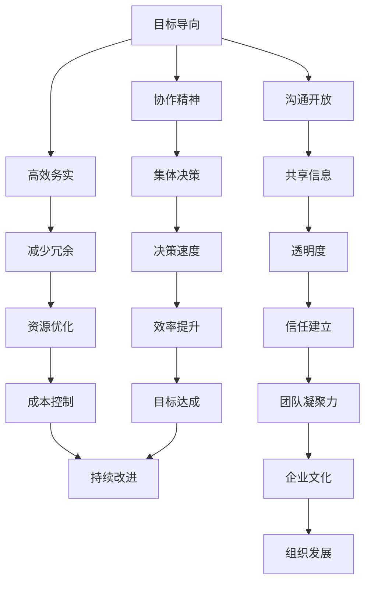

                 

### 文章标题

# 打造高效会议文化：提升团队沟通效率

### 文章关键词

- 会议文化
- 团队沟通
- 效率提升
- 数字化转型
- 新兴技术

### 文章摘要

本文旨在探讨如何通过打造高效会议文化来提升团队的沟通效率。首先，我们将介绍会议文化的核心概念及其重要性，分析当前会议文化的不足。接着，我们将深入探讨高效会议的核心要素，包括明确会议目标、会议议程与分工、以及会议沟通技巧。随后，文章将提出一系列提升会议效率的策略，如精简会议内容、会议节奏控制以及会后跟进与反馈。此外，我们还将讨论技术工具在会议中的应用，包括线上会议平台、协同工具和数据分析与报告工具。通过具体案例分析和实际项目实战，文章将提供切实可行的最佳实践建议。最后，我们将展望会议文化的未来发展趋势，探讨数字化转型和新兴技术对会议文化的革新。

## 第1章：会议文化的概述

### 1.1.1 什么是会议文化

会议文化是指企业在日常运营中，围绕会议进行的组织、沟通和协作的行为模式与价值观。会议文化不仅包括会议的组织形式和流程，还涵盖了会议的参与者的沟通方式、协作精神以及共同遵守的会议规范。

会议文化通常具有以下几个核心特征：

1. **目标导向**：会议文化强调会议的目标明确，以确保会议的每个环节都能围绕目标展开。
2. **沟通开放**：在会议文化中，沟通是开放的，鼓励不同层级和角色的人员自由表达意见和想法。
3. **协作精神**：会议文化强调团队成员之间的协作，通过集思广益来解决问题。
4. **高效务实**：会议文化倡导高效务实的态度，反对冗长和不必要的会议。

为了更好地理解会议文化，我们可以使用以下Mermaid流程图来展示其基本架构：

### 1.1.2 会议文化的重要性

会议文化在企业中扮演着至关重要的角色，其重要性体现在以下几个方面：

1. **提升团队效率**：高效的会议文化能够确保团队成员在有限的时间内获得最大产出，减少无效会议的浪费。
2. **促进创新与协作**：通过开放的沟通和协作精神，会议文化能够激发团队成员的创新思维，促进知识的共享和协作。
3. **建立企业价值观**：会议文化反映了企业的价值观和经营理念，有助于塑造企业的整体形象和品牌。
4. **提升企业竞争力**：高效会议文化能够帮助企业更好地应对市场变化，提升企业的竞争力。

然而，当前许多企业的会议文化仍存在一些问题，如会议冗长、目标不明确、沟通不畅等。这些问题严重影响了团队的沟通效率和协作效果。因此，企业亟需对现有的会议文化进行改进，以提高会议的质量和效率。

### 1.1.3 会议文化的现状分析

在当前的商业环境中，会议文化存在以下几个方面的问题：

1. **会议冗长**：许多会议缺乏明确的议程和时间控制，导致会议时间过长，影响团队成员的工作效率。
2. **目标不明确**：部分会议缺乏明确的目标，导致会议内容散乱，无法有效达成会议目的。
3. **沟通不畅**：会议中的沟通往往存在障碍，如信息不对称、意见不统一等，影响了会议的效率和效果。
4. **缺乏反馈机制**：会议结束后，往往缺乏有效的反馈机制，无法及时了解会议效果和改进方向。

这些问题不仅影响了会议的效率，也影响了团队的整体协作效果。因此，企业需要对会议文化进行系统性改进，以提高会议的质量和效率。

### 总结

会议文化是企业文化的重要组成部分，对企业的运营和发展具有深远的影响。通过明确会议目标、优化会议议程、提升沟通技巧，以及引入先进的技术工具，企业可以构建起高效的会议文化，从而提升团队的沟通效率和协作效果。在下一章中，我们将深入探讨高效会议的核心要素，为打造高效会议文化提供具体的方法和策略。

## 第2章：高效会议的核心要素

高效会议的核心要素包括明确会议目标、优化会议议程、分工与角色分配、以及提升会议沟通技巧。以下将逐一探讨这些核心要素，并提供具体的策略和方法。

### 2.1.1 明确会议目标

明确会议目标是高效会议的首要前提。一个清晰明确的会议目标可以帮助团队成员集中精力，确保会议的每个环节都朝着目标前进，避免会议冗长和无效。

**策略**：

1. **制定具体、可衡量的目标**：确保目标具体且可量化，例如“讨论并确定产品发布时间表”或“评估当前项目的风险点”。
2. **提前通知目标**：在会议前明确告知所有参会人员会议的目标，以便他们提前准备和调整心态。
3. **定期回顾目标**：在会议过程中，定期回顾目标，以确保会议仍然围绕目标进行。

**示例**：

假设我们召开一个项目进度会议，目标是“讨论并评估当前项目的进展和风险点”。我们可以制定以下具体目标：

- 确定项目的关键里程碑和时间节点。
- 分析项目的风险，并提出相应的解决方案。
- 确定下一阶段的行动计划。

### 2.1.2 会议议程与分工

会议议程是确保会议有序进行的重要工具。一份合理、详细的会议议程可以帮助团队成员了解会议的内容和流程，提高会议的效率。

**策略**：

1. **提前制定议程**：在会议前，根据会议目标制定详细的议程，明确每个议题的时间分配和责任人。
2. **分工明确**：在议程中明确每个参会人员的职责和任务，确保会议的每个环节都有人负责。
3. **会议议程更新**：在会议过程中，根据实际情况更新议程，确保会议仍然围绕目标进行。

**示例**：

以下是一个典型的项目进度会议议程示例：

1. 开场（5分钟）：主持人介绍会议目标和议程。
2. 项目进展汇报（15分钟）：项目经理汇报项目的关键进展。
3. 风险评估（10分钟）：风险经理分析项目的风险点。
4. 讨论并确定解决方案（15分钟）：团队成员讨论风险点，并提出解决方案。
5. 行动计划制定（10分钟）：确定下一阶段的行动计划和时间节点。
6. 总结和闭幕（5分钟）：主持人总结会议内容和下一步行动。

### 2.1.3 会议沟通技巧

有效的沟通是高效会议的核心。提升会议沟通技巧，可以帮助团队成员更好地理解会议内容，提高决策效率，增强团队协作。

**策略**：

1. **主动聆听**：在会议中，要积极倾听他人的意见和观点，避免打断他人。
2. **明确表达**：在表达自己的观点时，要清晰、简洁，避免使用模糊的语言。
3. **积极反馈**：在他人发言后，给予积极的反馈，表达自己的理解和支持。
4. **控制情绪**：在会议中，保持冷静，避免情绪化的行为，确保会议的顺利进行。

**示例**：

在会议中，当项目经理汇报项目进展时，其他团队成员可以采取以下沟通技巧：

- 主动聆听，确保理解项目经理的汇报内容。
- 明确表达自己的问题和建议，避免使用模糊的语言。
- 给予积极的反馈，表达对项目经理工作的支持。
- 在需要时，提出针对性的问题和建议，促进问题的解决。

### 总结

明确会议目标、优化会议议程、分工与角色分配、以及提升会议沟通技巧是构建高效会议文化的重要要素。通过这些策略和方法，企业可以提升会议的质量和效率，促进团队的协作和沟通。在下一章中，我们将探讨提升会议效率的具体策略，为打造高效会议文化提供更多的实践指导。

### 2.2 提升会议效率的策略

要打造高效会议文化，除了明确会议目标、优化会议议程和提升沟通技巧外，还需要实施一系列提升会议效率的具体策略。以下将详细探讨这些策略，并提供实用技巧。

#### 2.2.1 精简会议内容

精简会议内容是提升会议效率的关键。冗长的会议内容不仅浪费时间和精力，还容易导致会议目标偏离，影响会议效果。

**策略**：

1. **删除非必要议题**：在制定会议议程时，剔除那些与会议目标无关的议题，确保会议内容紧凑且相关。
2. **限制讨论时间**：为每个议题设定讨论时间，确保讨论不会无休止地进行，从而提高会议的整体效率。
3. **提前分发会议材料**：在会议前提前分发会议材料，让参会人员提前了解讨论内容，减少会议中的重复讲解。

**示例**：

假设我们召开一个产品需求讨论会，会议目标为“确定下一版本产品的功能需求”。我们可以采取以下措施来精简会议内容：

- 删除与产品需求无关的议题，如市场分析和技术实现细节。
- 为每个功能需求设定讨论时间，例如每个需求讨论不超过5分钟。
- 提前分发产品需求文档，让参会人员在会议前阅读并准备问题。

#### 2.2.2 控制会议节奏

控制会议节奏是确保会议高效进行的另一个重要策略。过快的节奏可能导致讨论不够深入，而过慢的节奏则可能导致会议冗长。

**策略**：

1. **合理安排讨论时间**：在会议议程中为每个议题设置合理的讨论时间，确保讨论深入但不冗长。
2. **使用计时器**：在会议中使用计时器，确保每个议题在预定时间内完成讨论。
3. **暂停与总结**：在讨论过程中，适时暂停并总结当前讨论的内容，确保团队成员对讨论有清晰的认识。

**示例**：

在召开一个团队周会时，我们可以采取以下措施来控制会议节奏：

- 为每个议题设置讨论时间，例如每个议题讨论不超过10分钟。
- 使用计时器，确保每个议题在预定时间内完成讨论。
- 在每个议题讨论结束后，进行总结，确保团队成员对讨论内容有清晰的认识。

#### 2.2.3 会后跟进与反馈

会后跟进与反馈是确保会议成果得到落实的重要环节。通过及时跟进和反馈，可以确保会议决定得到执行，并不断优化会议流程。

**策略**：

1. **制定行动计划**：在会议结束后，立即制定具体的行动计划，明确责任人、截止日期和跟进措施。
2. **定期回顾与反馈**：定期回顾会议决定执行情况，收集反馈信息，并根据反馈进行改进。
3. **使用技术工具**：利用项目管理工具和沟通平台，实时跟踪会议决定的执行情况，确保信息的透明和高效。

**示例**：

假设我们召开一个项目评估会议，会议目标是“评估当前项目的进展和风险”。会后，我们可以采取以下措施进行跟进与反馈：

- 制定具体的行动计划，明确每个任务的负责人和截止日期。
- 定期通过邮件或项目管理工具跟踪任务执行情况，确保任务按时完成。
- 在项目进度报告会议上，回顾任务执行情况，收集团队成员的反馈，并根据反馈进行调整。

### 总结

通过精简会议内容、控制会议节奏以及会后跟进与反馈，企业可以显著提升会议效率，构建起高效的会议文化。这些策略不仅有助于提高团队成员的工作效率，也有助于促进团队的协作和创新。在下一章中，我们将探讨技术工具在会议中的应用，为打造高效会议文化提供更多的技术支持。

### 3.1.1 线上会议平台

随着远程工作和虚拟团队的普及，线上会议平台成为了提高会议效率不可或缺的工具。以下是一些常见线上会议平台及其特点，以及如何选择合适的平台。

#### 常见线上会议平台

1. **Zoom**：Zoom是一款功能强大的线上会议平台，支持视频会议、屏幕共享、聊天和文件共享等功能。它提供了免费版和付费版，付费版提供了更多的功能，如更长的会议时间和更高的参会人数限制。

2. **Microsoft Teams**：Microsoft Teams是微软推出的集成通信和协作平台，支持视频会议、即时消息、文件共享和应用程序集成。它是微软生态系统的一部分，适合使用微软办公套件的企业。

3. **Google Meet**：Google Meet是Google推出的线上会议平台，支持视频会议、屏幕共享和聊天功能。它适用于Google Workspace用户，可以方便地集成到Google文档、表格和日历等工具中。

4. **Skype for Business**：Skype for Business是微软的另一个线上会议平台，提供了视频会议、即时消息、电话会议和在线协作等功能。它适合大型企业，具有高级的安全和合规功能。

#### 如何选择合适的平台

选择合适的线上会议平台需要考虑以下几个方面：

1. **用户数量和规模**：根据企业的用户数量和规模，选择能够支持相应参会人数的平台。

2. **功能需求**：根据企业的具体需求，选择具有所需功能（如视频会议、屏幕共享、聊天、文件共享等）的平台。

3. **安全性**：确保选择的平台具有严格的安全措施，如加密通信、用户身份验证和数据备份等。

4. **集成能力**：选择能够与企业现有的通信和协作工具（如邮件系统、项目管理工具、日程安排工具等）集成的平台，以提高工作效率。

5. **成本**：考虑平台的成本，包括免费版和付费版的功能差异，选择性价比高的解决方案。

#### 最佳实践

1. **制定统一的平台政策**：企业应制定统一的线上会议平台政策，确保团队成员知道在何时何地使用哪个平台。

2. **培训与支持**：为团队成员提供平台使用培训，确保他们能够熟练使用线上会议平台的功能。

3. **定期评估与更新**：定期评估平台的使用情况，根据反馈和需求更新平台，以保持高效的工作流程。

### 总结

线上会议平台在提高会议效率方面发挥了重要作用。通过选择合适的平台并遵循最佳实践，企业可以打造高效的会议文化，提升团队沟通协作能力。在下一章中，我们将探讨协同工具在会议中的应用，进一步优化会议流程。

### 3.1.2 协同工具

协同工具在提升会议效率和团队协作中扮演着至关重要的角色。以下是一些常见的协同工具，以及如何利用它们提高会议效率和团队协作。

#### 常见协同工具

1. **Slack**：Slack是一款流行的即时消息和文件共享工具，支持团队内部沟通和协作。它提供了聊天频道、直接消息、文件共享和集成第三方服务等功能，适用于各种规模的企业。

2. **Trello**：Trello是一款基于看板的项目管理工具，适合团队协作和任务管理。用户可以通过拖放卡片来管理任务进度，设置截止日期和责任人，实现任务的有序分配和跟进。

3. **Asana**：Asana是一款全面的项目管理工具，支持任务分配、进度跟踪和团队协作。用户可以在项目中创建任务、设置优先级和分配责任人，实时了解任务进展和团队协作情况。

4. **Notion**：Notion是一款多功能的知识管理和协作工具，支持笔记、数据库、看板和日历等功能。用户可以创建自定义工作空间，整合项目、任务、笔记和文档，实现高效的团队协作。

#### 如何利用协同工具提高会议效率和团队协作

1. **任务分配和跟踪**：在会议中使用协同工具分配任务，明确任务的负责人和截止日期，确保任务得到有效跟进。例如，在Trello中创建任务卡片，设置任务详情和责任人，实时跟踪任务进展。

2. **文档共享和协作**：利用协同工具的文档共享功能，团队成员可以实时编辑和共享文档，减少重复工作。例如，在Notion中创建共享文档，多人实时编辑，提高协作效率。

3. **即时沟通和反馈**：在会议中使用即时沟通工具（如Slack），团队成员可以随时讨论和交流，及时反馈意见和问题。通过创建聊天频道，可以方便地组织讨论，确保信息传达的及时性和准确性。

4. **日程管理和提醒**：利用协同工具的日程管理功能，团队成员可以方便地安排会议和任务，设置提醒，确保不遗漏重要事项。例如，在Asana中设置任务提醒，确保团队成员按时完成任务。

5. **集成其他工具**：协同工具通常支持与其他工具的集成，如日历、邮件系统和项目管理工具等。通过集成，可以方便地同步信息，提高工作效率。

#### 最佳实践

1. **统一工具使用规范**：企业应制定统一的协同工具使用规范，确保团队成员了解如何高效使用工具，减少不必要的培训成本。

2. **定期评估和优化**：定期评估协同工具的使用情况，根据团队需求和反馈，优化工具配置和使用流程，确保工具的最大效用。

3. **鼓励使用和反馈**：鼓励团队成员积极使用协同工具，收集他们的使用反馈，不断改进工具的使用体验和功能。

### 总结

协同工具在提高会议效率和团队协作方面具有显著优势。通过合理使用协同工具，企业可以构建高效的会议文化，提升团队的整体协作能力和工作效率。在下一章中，我们将探讨数据分析与报告工具在会议中的应用，进一步优化会议流程和决策过程。

### 3.1.3 数据分析与报告工具

数据分析与报告工具在会议中发挥着重要作用，它们能够帮助团队快速获取关键信息，做出数据驱动的决策，并确保会议的成果得到有效跟踪和评估。以下是一些常见的数据分析与报告工具，以及如何利用它们提升会议效率和效果。

#### 常见数据分析与报告工具

1. **Google Analytics**：Google Analytics是一款强大的数据分析工具，可以帮助团队追踪网站或应用的访问数据、用户行为和转化率。通过Google Analytics，团队可以深入了解用户需求和市场趋势，为会议决策提供数据支持。

2. **Tableau**：Tableau是一款数据可视化工具，能够将复杂的数据转化为易于理解的图表和仪表板。它支持多种数据源，包括数据库、CSV文件和云存储，适用于各类企业进行数据分析和报告。

3. **Power BI**：Power BI是微软推出的商业智能工具，支持数据集成、数据建模和报表生成。它能够将多种数据源整合到一个平台上，提供丰富的可视化报表和仪表板，帮助企业进行数据驱动的决策。

4. **Excel**：Excel是一款功能强大的电子表格工具，支持数据整理、分析和可视化。它适用于各类企业进行日常的数据分析和报告，尤其在中小型企业中广泛应用。

#### 如何利用数据分析与报告工具提升会议效率和效果

1. **数据收集和整合**：在会议前，利用数据分析工具收集和整合相关数据，确保会议所涉及的数据准确和完整。例如，使用Google Analytics收集用户行为数据，使用Excel整理项目进展数据。

2. **数据可视化**：利用数据可视化工具将数据转化为图表和仪表板，使数据更加直观易懂。通过Tableau或Power BI创建可视化报表，帮助团队成员快速了解数据趋势和关键指标。

3. **实时数据更新**：确保数据实时更新，以便在会议中能够讨论最新的数据情况。例如，通过Power BI的实时数据连接，将数据库中的最新数据直接显示在报表中。

4. **数据驱动决策**：在会议中，基于数据分析和报告结果，进行数据驱动的决策。通过数据支持，团队成员可以更加自信地提出建议和决策，减少主观判断带来的风险。

5. **会后跟踪和评估**：利用数据分析工具跟踪会议决定执行情况，评估会议成果。例如，通过Excel记录行动计划，定期更新执行进度，确保会议决定得到有效落实。

#### 最佳实践

1. **制定数据分析策略**：在会议前，明确数据分析的目标和范围，制定详细的数据分析策略，确保数据分析的有针对性和有效性。

2. **培训团队成员**：为团队成员提供数据分析工具的培训，确保他们能够熟练使用工具，并能够理解数据报告的含义。

3. **定期数据回顾**：定期回顾数据分析报告，发现问题和改进点，根据数据反馈优化会议流程和决策过程。

4. **保持数据透明**：确保数据分析结果和报告的透明性，让所有团队成员都能看到数据，增强数据驱动决策的共识。

### 总结

数据分析与报告工具在提升会议效率和效果方面具有重要作用。通过合理利用这些工具，企业可以构建起基于数据的决策体系，提高会议的决策质量和执行力。在下一章中，我们将通过具体案例分析，探讨高效会议文化在实践中的应用。

### 5.1.1 案例一：某科技公司的会议文化改进实践

#### 案例背景

某科技公司成立于2010年，是一家专注于移动互联网应用开发的高科技企业。随着公司规模的不断扩大，团队数量和项目复杂度也在增加。然而，公司的会议文化存在问题，如会议冗长、目标不明确、沟通不畅等，严重影响了团队的工作效率。

#### 改进措施

为了改善会议文化，公司采取了一系列改进措施：

1. **明确会议目标**：公司明确规定每次会议必须有一个明确的目标，并在会议前通知所有参会人员。会议目标包括讨论项目进度、解决问题、决策和规划等。

2. **优化会议议程**：公司制定了详细的会议议程，明确每个议题的时间分配和责任人。会议议程提前分发，参会人员可以提前了解会议内容和准备相关资料。

3. **分工与角色分配**：在会议中，明确了每个团队成员的职责和角色，确保每个人都知道自己的任务和责任。例如，项目经理负责项目进度汇报，技术总监负责技术问题讨论。

4. **提升沟通技巧**：公司组织了一系列沟通技巧培训，提高了团队成员的沟通能力和表达能力。培训内容包括有效表达、积极聆听和问题解决等。

5. **引入技术工具**：公司引入了Zoom作为主要线上会议平台，使用Slack进行即时沟通和协作，使用Trello和Asana进行任务管理和进度跟踪。

#### 改进效果

通过以上改进措施，公司的会议文化得到了显著改善：

1. **会议效率提高**：明确会议目标和优化议程，使会议更加紧凑和高效，减少了冗长会议的情况。

2. **沟通畅通**：通过分工与角色分配和提升沟通技巧，团队成员之间的沟通更加顺畅，问题解决更加迅速。

3. **任务执行率提升**：使用Trello和Asana进行任务管理和进度跟踪，确保任务得到有效执行和跟进。

4. **团队凝聚力增强**：通过高效的会议和协作，团队成员之间的合作更加紧密，团队凝聚力得到了增强。

#### 总结

通过明确的会议目标、优化的会议议程、分工与角色分配、提升沟通技巧以及引入技术工具，某科技公司成功地改进了会议文化，提升了团队的工作效率。这一案例展示了高效会议文化在实践中的应用，为企业提供了宝贵的经验和启示。

### 5.1.2 案例二：某创业团队的会议效率提升之路

#### 案例背景

某创业团队成立于2017年，专注于开发智能物联网解决方案。随着团队的不断壮大，团队成员数量从最初的3人增长到了20人，项目复杂度也逐渐增加。然而，团队的会议效率较低，频繁的会议导致团队成员疲惫不堪，影响了项目的进展。

#### 提升措施

为了提升会议效率，创业团队采取了一系列措施：

1. **明确会议目标**：团队明确规定每次会议必须有一个明确的目标，并在会议前通知所有参会人员。会议目标包括讨论项目进展、解决问题和规划下一步行动等。

2. **优化会议议程**：团队制定了详细的会议议程，明确每个议题的时间分配和责任人。会议议程提前分发，团队成员可以提前了解会议内容和准备相关资料。

3. **控制会议节奏**：团队使用计时器来控制会议节奏，确保每个议题在预定时间内完成讨论。如果在规定时间内无法讨论完毕，则安排后续会议继续讨论。

4. **引入技术工具**：团队引入了Google Meet作为主要线上会议平台，使用Slack进行即时沟通和协作，使用Trello和Asana进行任务管理和进度跟踪。

5. **会后跟进与反馈**：会议结束后，团队成员通过Trello和Asana跟踪任务的执行情况，并在每周的回顾会议中反馈任务进展，确保会议决定得到有效落实。

#### 提升效果

通过以上提升措施，创业团队的会议效率显著提高：

1. **会议时间缩短**：明确会议目标和优化议程，使会议更加紧凑和高效，减少了冗长会议的情况。

2. **沟通更加流畅**：使用技术工具进行即时沟通和协作，团队成员之间的沟通更加顺畅，问题解决更加迅速。

3. **任务执行率提升**：通过任务管理和跟进，确保任务得到有效执行和跟进，项目进展更加顺利。

4. **团队成员满意度提升**：高效的会议和协作使团队成员的工作压力减轻，满意度提高。

#### 总结

通过明确的会议目标、优化的会议议程、控制会议节奏、引入技术工具以及会后的跟进与反馈，创业团队成功地提升了会议效率。这一案例展示了高效会议文化在创业团队中的应用，为企业提供了宝贵的经验和启示。

### 6.1.1 会议文化的可持续发展

会议文化的可持续发展是企业持续成功的关键因素之一。在构建可持续的会议文化过程中，企业需要考虑多个方面，以确保会议文化能够长期为企业的发展提供支持。

#### 持续发展的意义

会议文化的可持续发展具有以下几个重要意义：

1. **提高工作效率**：可持续的会议文化能够确保会议的长期高效运行，减少冗长和无效会议，从而提高团队的工作效率。

2. **促进团队合作**：通过培养可持续的会议文化，企业可以促进团队成员之间的协作和沟通，增强团队凝聚力。

3. **强化企业价值观**：可持续的会议文化有助于将企业的价值观和经营理念融入到日常工作中，从而塑造企业的整体形象。

4. **提升竞争力**：高效的会议文化能够帮助企业更好地应对市场变化，提高企业的竞争力。

#### 实现可持续发展的策略

为了实现会议文化的可持续发展，企业可以采取以下策略：

1. **建立明确的会议规范**：企业应制定明确的会议规范，包括会议的目标、议程、流程和责任分配等。这些规范应被所有团队成员遵守，以确保会议的有序进行。

2. **培养团队成员的参与感和责任感**：通过鼓励团队成员参与会议的规划和组织，以及明确每个人的职责，可以提高团队成员的参与感和责任感，从而促进会议文化的可持续发展。

3. **定期培训和反馈**：定期组织会议技巧和沟通技巧的培训，帮助团队成员提高会议效率。同时，通过定期的反馈机制，收集团队成员对会议文化的意见和建议，不断改进和完善会议文化。

4. **引入技术工具**：利用现代化的技术工具，如线上会议平台、协同工具和数据分析工具，可以提高会议的效率和效果，从而促进会议文化的可持续发展。

5. **建立反馈和改进机制**：在会议结束后，通过反馈和改进机制，评估会议的效果和效率，并根据反馈进行调整和改进。这有助于确保会议文化能够持续适应企业的发展和变化。

### 总结

会议文化的可持续发展对企业的发展具有重要意义。通过建立明确的会议规范、培养团队成员的参与感和责任感、定期培训和反馈、引入技术工具以及建立反馈和改进机制，企业可以构建起可持续的会议文化，从而提高工作效率、促进团队合作、强化企业价值观和提升竞争力。

### 6.1.2 企业文化对会议文化的影响

企业文化在构建和维持会议文化中起着至关重要的作用。企业文化不仅影响着会议的目标、流程和沟通方式，还决定了团队成员对待会议的态度和行为。

#### 企业文化对会议文化的作用

1. **价值观引导**：企业文化中包含的核心价值观，如团队合作、创新、透明度和客户至上等，会直接影响到会议文化的形成和发展。这些价值观会引导团队成员在会议中遵循相应的行为规范。

2. **行为规范**：企业文化中的行为规范，如对效率、诚信和尊重的重视，会渗透到会议的各个环节，影响会议的流程和效果。

3. **沟通方式**：企业文化中的沟通方式，如开放、直接和建设性的沟通风格，会影响团队成员在会议中的交流方式和互动方式。

#### 如何将企业文化融入会议文化

1. **制定符合企业文化的会议目标**：在制定会议目标时，应确保目标与企业的核心价值观一致，并体现企业的战略方向。这样，会议的每个环节都能与企业文化保持一致。

2. **建立与企业文化相匹配的会议流程**：会议流程应体现企业文化的行为规范，如确保会议透明、高效、公平，并鼓励团队成员积极参与。

3. **培养符合企业文化的工作态度**：通过培训和激励，培养团队成员对会议的积极态度，如尊重他人意见、积极参与讨论和承担责任。

4. **领导示范**：企业领导层应通过自身的言行，示范符合企业文化的行为，从而影响整个团队的会议文化。

5. **持续沟通与反馈**：通过定期的沟通和反馈，确保企业文化在会议中得以贯彻执行，并根据团队成员的反馈进行不断优化。

#### 成功案例

某知名科技公司在其企业文化中强调创新、开放和团队合作。为了将这种企业文化融入会议文化，该公司采取以下措施：

1. **制定创新导向的会议目标**：每次会议的目标都明确要求激发创新思维，鼓励团队成员提出新的想法和解决方案。

2. **建立开放的会议流程**：会议流程强调透明和高效的沟通，确保每个团队成员都有机会发言和表达意见。

3. **鼓励团队合作**：在会议中，团队成员被鼓励合作解决问题，共同达成会议目标。

4. **领导示范**：公司领导层积极参与会议，并通过自身的行为示范如何遵循企业文化。

5. **定期反馈与改进**：通过定期的团队会议和反馈机制，收集团队成员的意见和建议，不断优化会议流程和效果。

这些措施有效地将企业文化融入了会议文化，提升了会议的效率和效果，促进了团队的协作和创新。

### 总结

企业文化对会议文化具有重要影响，企业可以通过制定符合企业文化的会议目标、建立与企业文化相匹配的会议流程、培养符合企业文化的工作态度、领导示范以及持续沟通与反馈，将企业文化融入会议文化，从而提升会议的效率和效果，促进团队的协作和创新。

### 6.1.3 培养高效会议文化意识

在构建高效会议文化的过程中，培养团队成员的高效会议文化意识是至关重要的。这不仅有助于提升会议的效率，还能增强团队的协作能力和整体工作氛围。以下将介绍几种具体的方法和策略，以培养团队成员的高效会议文化意识。

#### 1. 提供培训和学习资源

为了帮助团队成员了解高效会议文化的理念和实际操作，企业应提供系统化的培训和学习资源。这可以包括在线课程、工作坊、书籍和研讨会等。以下是一些建议：

- **在线课程**：通过平台如Coursera、Udemy等，提供关于高效沟通、时间管理和会议技巧的课程，让团队成员可以根据自己的时间安排进行学习。
- **工作坊**：定期组织面对面的工作坊，邀请专业讲师或经验丰富的团队成员分享高效会议的最佳实践，并通过模拟练习提高实际操作能力。
- **书籍推荐**：推荐关于高效会议和团队协作的经典书籍，如《高效能人士的七个习惯》和《深度工作》等，让团队成员自主阅读和学习。

#### 2. 设定明确的目标和期望

在每次会议前，明确会议的目标和期望，可以帮助团队成员更好地准备和参与会议。以下是一些具体的做法：

- **提前通知**：在会议前至少一天，发送会议通知，包括会议主题、议程、时间安排和所需准备的资料。
- **设定具体目标**：在会议通知中，明确会议的具体目标，如讨论项目进展、解决问题或制定行动计划，以便团队成员提前思考。
- **明确角色和责任**：在会议通知中，明确每个团队成员的角色和责任，确保每个人都清楚自己的任务和期望。

#### 3. 鼓励积极反馈和持续改进

积极反馈和持续改进是培养高效会议文化意识的重要手段。以下是一些具体的方法：

- **定期回顾**：在每次会议结束后，组织团队成员进行回顾，讨论会议的优点和不足，并提出改进建议。
- **建立反馈机制**：通过匿名调查、小组讨论或邮件等方式，收集团队成员对会议的反馈，并将其用于下一次会议的改进。
- **公开表彰**：对在会议中表现出色的团队成员进行公开表彰，鼓励团队成员积极参与和分享经验。

#### 4. 引入技术工具

利用现代技术工具可以提高会议的效率，同时也能培养团队成员的高效会议文化意识。以下是一些推荐的技术工具：

- **线上会议平台**：如Zoom、Microsoft Teams等，提供视频会议、屏幕共享和即时沟通等功能，方便团队成员远程协作。
- **协作工具**：如Trello、Asana等，用于任务分配、进度跟踪和文件共享，确保团队成员能够高效协作。
- **数据分析工具**：如Google Analytics、Tableau等，帮助团队通过数据驱动决策，提高会议的决策质量和执行力。

#### 5. 领导示范

领导层的行为对团队成员具有示范作用，因此，领导者应通过自己的言行来培养高效会议文化意识。以下是一些建议：

- **积极参与**：领导者应积极参与会议，展示对会议的重视和承诺。
- **以身作则**：领导者应以身作则，遵守会议规范，如准时参加会议、准备充分、积极参与讨论等。
- **支持反馈**：领导者应鼓励团队成员提供反馈，并对合理建议给予积极回应和支持。

#### 6. 建立良好的沟通氛围

良好的沟通氛围是高效会议文化的重要组成部分。以下是一些策略：

- **鼓励开放沟通**：鼓励团队成员在会议中自由表达意见和想法，创建一个开放、包容和尊重的氛围。
- **解决冲突**：在会议中，领导者应积极解决冲突和分歧，确保会议的顺利进行。
- **建立信任**：通过团队活动和互动，建立团队成员之间的信任，提高团队的协作效率。

#### 总结

培养高效会议文化意识需要从多个方面入手，包括提供培训和学习资源、设定明确的目标和期望、鼓励积极反馈和持续改进、引入技术工具、领导示范以及建立良好的沟通氛围。通过这些方法和策略，企业可以逐步培养团队成员的高效会议文化意识，提升会议的效率和质量，促进团队的整体协作和创新。

### 会议文化的未来发展趋势

随着科技的不断进步和商业环境的变化，会议文化也在不断地演变和进化。未来的会议文化将受到数字化转型和新兴技术的影响，呈现出一系列新的发展趋势。

#### 1. 数字化转型

数字化转型是未来会议文化发展的重要方向。通过引入数字技术和工具，企业可以大幅提升会议的效率和效果。以下是一些数字化转型的具体表现：

1. **线上会议常态化**：随着视频会议、远程协作工具的普及，线上会议将逐渐取代传统的面对面会议，成为会议的主要形式。这不仅节省了时间和成本，还提高了会议的灵活性和可扩展性。
2. **智能会议系统**：利用人工智能技术，智能会议系统可以自动记录会议内容、生成会议纪要，并提供数据分析和报告。这将大大减轻团队成员的工作负担，提高会议的决策质量和效率。
3. **虚拟现实和增强现实**：虚拟现实（VR）和增强现实（AR）技术的应用，将使远程参会人员能够更真实地感受会议现场，增强会议的互动性和参与感。

#### 2. 新兴技术的应用

除了数字化转型，未来会议文化还将受到多种新兴技术的影响。以下是一些新兴技术的应用趋势：

1. **区块链技术**：区块链技术可以用于确保会议记录的不可篡改性和透明性，提高会议的信任度和公信力。
2. **物联网（IoT）**：物联网技术可以将会议设备与智能系统连接，实现自动化的会议室预约、设备控制和环境调节，提高会议的便捷性和舒适度。
3. **自然语言处理（NLP）**：自然语言处理技术可以用于智能助手，帮助团队成员快速获取会议信息、安排会议和回答常见问题，提高会议的效率和用户体验。

#### 3. 跨界融合

未来的会议文化将不仅仅是企业内部的沟通工具，还将与其他领域和行业进行跨界融合。以下是一些跨界融合的趋势：

1. **跨界合作会议**：企业可以与学术界、政府部门和其他行业进行跨界合作，举办跨领域的研讨会、论坛和工作坊，促进知识的共享和交流。
2. **虚拟会议空间**：利用虚拟现实和增强现实技术，企业可以创建虚拟会议空间，让团队成员在虚拟环境中进行互动和协作，打破地域限制，实现全球范围内的合作。

#### 4. 数据驱动的决策

未来的会议文化将更加注重数据驱动，通过数据分析来指导会议的决策。以下是一些数据驱动的决策趋势：

1. **会议数据分析**：利用大数据分析和机器学习技术，对会议的历史记录和反馈进行深入分析，发现会议的改进点和优化方向。
2. **实时数据监控**：通过实时数据监控工具，企业可以在会议中进行实时数据分析和反馈，及时调整会议内容和策略，确保会议目标的实现。
3. **个性化会议**：基于团队成员的偏好和行为数据，可以定制个性化的会议内容和议程，提高会议的针对性和有效性。

#### 总结

会议文化的未来发展趋势将受到数字化、新兴技术和跨界融合的影响，呈现出智能化、数据化和全球化等特点。通过引入先进的技术和工具，企业可以打造更加高效、灵活和创新的会议文化，提升团队的工作效率和协作能力，推动企业的持续发展和创新。

### 结论

构建高效会议文化是提升团队沟通效率的关键。通过明确会议目标、优化会议议程、分工与角色分配、提升沟通技巧以及引入先进技术工具，企业可以大幅提升会议的效率和效果。本文介绍了会议文化的核心概念、重要要素、提升策略以及未来发展趋势，并通过实际案例展示了高效会议文化在实践中的应用。企业应不断探索和实践，将高效会议文化融入日常运营，以实现团队协作和整体效率的提升。

### 作者信息

- 作者：AI天才研究院/AI Genius Institute & 禅与计算机程序设计艺术 /Zen And The Art of Computer Programming

### 拓展阅读

1. “高效会议：如何提升团队效率”（作者：斯蒂芬·R·科布），提供了详细的会议管理和沟通技巧。
2. “数字化会议：未来会议文化的新趋势”（作者：约翰·P·史密斯），探讨了数字化工具对会议文化的影响。
3. “跨界协作：创新会议文化的实践与思考”（作者：玛丽·K·琼斯），分享了跨界会议的最佳实践和成功案例。

### 注意事项

1. 在构建高效会议文化时，要确保会议目标明确，议程合理，沟通高效。
2. 定期进行会议反馈和改进，以持续提升会议效率。
3. 培养团队成员的高效会议文化意识，提高整体协作能力。

### 最佳实践

1. 采用线上会议平台和协同工具，提高会议的灵活性和效率。
2. 定期进行沟通技巧培训，提升团队成员的沟通能力。
3. 建立反馈和改进机制，确保会议文化持续优化。

本文通过详细的探讨和案例分析，为构建高效会议文化提供了全面的指导和建议。通过实践这些最佳实践，企业可以显著提升团队的工作效率和协作能力，推动企业的持续发展。

