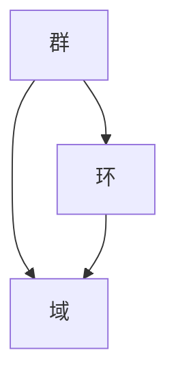

                 

### 文章标题

《抽象代数：自然结构的数学一般化》

### 文章关键词

抽象代数、自然结构、数学一般化、群、环、域、算法、数学模型、Python代码、Mermaid流程图

### 文章摘要

本文将深入探讨抽象代数这一数学领域的核心概念和其一般化应用，揭示其在自然结构中的本质联系。我们将通过详细的Mermaid流程图、Python源代码和LaTeX数学公式，对群、环、域等核心概念进行详细解释，并运用实例分析和项目实战来展示抽象代数在计算机科学中的实际应用。读者将获得对抽象代数深刻理解的同时，学会如何运用其解决实际问题。

### 前言

在数学的广阔领域中，抽象代数扮演着至关重要的角色。它不仅是现代数学的基石，而且在物理学、计算机科学、逻辑学等多个领域有着广泛的应用。抽象代数的核心在于通过研究代数结构，将数学问题的一般化形式抽象出来，从而构建出具有普遍性的理论框架。这种抽象思维方法不仅提升了数学的严谨性，也推动了跨学科的发展。

本书旨在为读者提供一个全面而深入的抽象代数教程，帮助读者理解其基本概念、核心算法，以及在实际项目中的应用。我们希望通过本教程，读者不仅能掌握抽象代数的基本理论，还能学会如何将其应用于解决实际问题。

本书的读者对象主要包括：
- 数学专业的本科生和研究生
- 计算机科学、物理学等相关专业的研究生
- 对抽象代数感兴趣的自学者

本书将按照以下章节安排进行：
1. **核心概念与联系**：介绍抽象代数的核心概念，并通过Mermaid流程图展示它们之间的联系。
2. **基础概念**：详细解释群、环、域等基本概念。
3. **核心算法**：讲解抽象代数的核心算法，使用Python源代码进行阐述。
4. **数学模型**：展示抽象代数的数学模型，并提供LaTeX数学公式和实例。
5. **实例分析**：通过实际案例来说明抽象代数的应用。
6. **扩展与探讨**：讨论抽象代数的扩展领域和应用。
7. **附录**：提供相关工具、资源和学习建议。

### 核心概念与联系

在深入探讨抽象代数的核心概念之前，我们首先需要明确什么是抽象代数。抽象代数是一种数学分支，主要研究代数结构以及它们之间的关系。这些结构包括但不限于群、环、域等，它们都是通过一组运算定义的集合。抽象代数的一个重要特点就是通过抽象化，将具体的数学问题转化为这些结构的研究，从而寻找一般性的规律和结论。

#### 群

群是最基本的代数结构之一，它是由一组元素构成的集合，这些元素通过一个二元运算结合在一起，满足特定的性质。具体来说，一个群 \( G \) 需要满足以下条件：
1. **封闭性**：对于任意 \( a, b \in G \)，运算 \( a \circ b \) 的结果仍然在 \( G \) 中。
2. **结合律**：对于任意 \( a, b, c \in G \)，有 \( (a \circ b) \circ c = a \circ (b \circ c) \)。
3. **单位元**：存在一个元素 \( e \in G \)，对于任意 \( a \in G \)，有 \( e \circ a = a \circ e = a \)。
4. **逆元**：对于任意 \( a \in G \)，存在一个元素 \( b \in G \)，使得 \( a \circ b = b \circ a = e \)。

群的概念非常广泛，它不仅是其他代数结构的基础，还在物理学、计算机科学等领域有着广泛的应用。

#### 环

环是比群更为复杂的代数结构，它不仅包含加法运算，还包含乘法运算。具体来说，一个环 \( R \) 需要满足以下条件：
1. **加法群**：\( R \) 本身是一个加法群，即满足群的性质。
2. **乘法半群**：\( R \) 中的任意两个元素 \( a, b \) 的乘积 \( a \cdot b \) 仍然在 \( R \) 中，但是不一定满足结合律。
3. **乘法单位元**：存在一个元素 \( 1 \in R \)，使得对于任意 \( a \in R \)，有 \( 1 \cdot a = a \cdot 1 = a \)。

环在数学的各个领域都有广泛的应用，特别是在数论和代数几何中。

#### 域

域是比环更为复杂的代数结构，它不仅包含了加法和乘法运算，而且这些运算都是交换的。具体来说，一个域 \( F \) 需要满足以下条件：
1. **加法和乘法群**：\( F \) 中的加法和乘法运算都分别构成群。
2. **乘法交换律**：对于任意 \( a, b \in F \)，有 \( a \cdot b = b \cdot a \)。

域在数学的许多领域都扮演着关键角色，特别是在线性代数、数论和代数几何中。

#### Mermaid流程图展示

为了更好地理解这些概念之间的联系，我们可以使用Mermaid流程图来展示它们的关系：



在这个流程图中，我们清晰地看到群是环和域的基础，而环又是域的基础。这种层次关系在抽象代数中非常重要，它帮助我们理解不同代数结构之间的内在联系。

### 基础概念

在理解了抽象代数的基本概念之后，我们接下来将详细探讨群、环、域等核心概念，并分析它们之间的联系。

#### 群的概念与性质

群是一种代数结构，它由一组元素和一种二元运算组成。这种运算通常称为“群运算”或“乘法”。为了成为群，这个集合需要满足以下四个条件：

1. **封闭性**：对于任意两个元素 \( a \) 和 \( b \) 在群 \( G \) 中，它们的运算结果 \( a \cdot b \) 也必须在 \( G \) 中。这保证了群内部的运算不会“越界”。

2. **结合律**：对于任意三个元素 \( a \)、\( b \) 和 \( c \) 在群 \( G \) 中，运算的顺序不会影响结果。即 \( (a \cdot b) \cdot c = a \cdot (b \cdot c) \)。

3. **单位元**：群 \( G \) 中存在一个特殊的元素 \( e \)，称为单位元，对于任意元素 \( a \) 在 \( G \) 中，有 \( a \cdot e = e \cdot a = a \)。单位元类似于加法中的0或乘法中的1。

4. **逆元**：对于任意元素 \( a \) 在 \( G \) 中，存在一个逆元 \( a^{-1} \) 使得 \( a \cdot a^{-1} = a^{-1} \cdot a = e \)。这意味着每个元素都有其对应的“反方向”元素，能够恢复单位元。

群的概念是抽象代数中最基础的部分，许多其他代数结构都是在群的基础上进一步扩展的。

#### 群的子群与同态

在讨论群时，子群和同态是两个非常重要的概念。

1. **子群**：一个群 \( H \) 是另一个群 \( G \) 的子群，如果 \( H \) 也是一个群，并且 \( H \) 的所有元素都在 \( G \) 中。换句话说，\( H \) 是 \( G \) 的一个子集，并且满足群的四个条件。

2. **同态**：两个群 \( G \) 和 \( H \) 之间存在一个映射 \( f: G \rightarrow H \)，使得对于任意 \( a, b \in G \)，有 \( f(a \cdot b) = f(a) \cdot f(b) \)。这种映射称为同态。同态保持了群运算的结构，即如果 \( a \cdot b \) 在 \( G \) 中，那么 \( f(a) \cdot f(b) \) 也在 \( H \) 中。

子群和同态为我们提供了对群进行分类和研究的工具。例如，通过同态，我们可以将一个复杂的群映射到一个更简单的群进行研究，从而简化问题的复杂性。

#### 群的直积与商群

在研究群时，直积和商群是两个重要的构造。

1. **直积**：给定两个群 \( G_1 \) 和 \( G_2 \)，它们的直积 \( G_1 \times G_2 \) 是一个包含所有有序对 \( (g_1, g_2) \) 的群，其中 \( g_1 \in G_1 \) 和 \( g_2 \in G_2 \)。直积的运算定义为 \( (g_1, g_2) \cdot (h_1, h_2) = (g_1 \cdot h_1, g_2 \cdot h_2) \)。

2. **商群**：给定一个群 \( G \) 和它的一个子群 \( H \)，商群 \( G / H \) 是由 \( G \) 中与 \( H \) 共同元素的集合形成的。商群的运算定义为 \( aH \cdot bH = (a \cdot b)H \)。

直积和商群是群论中的重要工具，它们帮助我们构建更复杂的群，或者研究群的结构。

#### 环的概念与性质

环是包含加法和乘法运算的代数结构，但它不要求乘法运算满足结合律。一个环 \( R \) 需要满足以下条件：

1. **加法群**：\( R \) 本身是一个加法群，即满足群的所有性质。

2. **乘法半群**：\( R \) 中的任意两个元素 \( a \) 和 \( b \) 的乘积 \( a \cdot b \) 仍然在 \( R \) 中，但是乘法不要求满足结合律。

3. **乘法单位元**：存在一个元素 \( 1 \) 在 \( R \) 中，对于任意 \( a \) 在 \( R \) 中，有 \( 1 \cdot a = a \cdot 1 = a \)。

环在数论、代数几何和抽象代数的其他分支中都有广泛应用。

#### 环的子环与同态

与群类似，环也有子环和同态的概念。

1. **子环**：一个环 \( R \) 的子集 \( S \) 是 \( R \) 的子环，如果 \( S \) 也是一个环，并且 \( S \) 的所有元素都在 \( R \) 中。

2. **同态**：两个环 \( R \) 和 \( S \) 之间存在一个映射 \( f: R \rightarrow S \)，使得对于任意 \( a, b \in R \)，有 \( f(a + b) = f(a) + f(b) \) 和 \( f(a \cdot b) = f(a) \cdot f(b) \)。这种映射称为同态。

同态保持了环的加法和乘法运算结构，类似于群的同态。

#### 环的直和与商环

与群的直积类似，环也有直和的概念。

1. **直和**：给定两个环 \( R_1 \) 和 \( R_2 \)，它们的直和 \( R_1 \oplus R_2 \) 是一个包含所有有序对 \( (r_1, r_2) \) 的环，其中 \( r_1 \in R_1 \) 和 \( r_2 \in R_2 \)。直和的运算定义为 \( (r_1, r_2) + (s_1, s_2) = (r_1 + s_1, r_2 + s_2) \) 和 \( (r_1, r_2) \cdot (s_1, s_2) = (r_1 \cdot s_1, r_2 \cdot s_2) \)。

2. **商环**：给定一个环 \( R \) 和它的一个理想 \( I \)，商环 \( R / I \) 是由 \( R \) 中与 \( I \) 共同元素的集合形成的。商环的运算定义为 \( aI + bI = (a + b)I \)。

直和和商环是环论中的重要工具，它们帮助我们构建更复杂的环。

#### 域的概念与性质

域是一个包含加法和乘法运算的代数结构，其中这两种运算都是交换的，并且每个非零元素都有乘法逆元。一个域 \( F \) 需要满足以下条件：

1. **加法和乘法群**：\( F \) 本身是加法和乘法群，即满足群的所有性质。

2. **乘法交换律**：对于任意两个元素 \( a \) 和 \( b \) 在 \( F \) 中，有 \( a \cdot b = b \cdot a \)。

域在代数几何、线性代数和数论中都有广泛应用。

#### 域的子域与同态

与群和环类似，域也有子域和同态的概念。

1. **子域**：一个域 \( F \) 的子集 \( S \) 是 \( F \) 的子域，如果 \( S \) 也是一个域，并且 \( S \) 的所有元素都在 \( F \) 中。

2. **同态**：两个域 \( F \) 和 \( G \) 之间存在一个映射 \( f: F \rightarrow G \)，使得对于任意 \( a, b \in F \)，有 \( f(a + b) = f(a) + f(b) \) 和 \( f(a \cdot b) = f(a) \cdot f(b) \)。这种映射称为同态。

同态保持了域的加法和乘法运算结构。

#### 域的性质与应用

域的一个重要性质是其乘法封闭性，即对于任意两个非零元素 \( a \) 和 \( b \) 在 \( F \) 中，它们的乘积 \( a \cdot b \) 仍然在 \( F \) 中。这一性质使得域在数论和代数几何中特别有用。

例如，实数域 \( \mathbb{R} \) 和复数域 \( \mathbb{C} \) 都是域的典型例子。实数域是所有实数的集合，而复数域是所有复数的集合。复数域不仅包含了实数域的所有性质，还引入了虚数单位 \( i \)，使得许多数学问题变得更加简单和优雅。

总之，群、环和域是抽象代数的核心概念，它们在不同的数学领域都有广泛的应用。理解这些概念以及它们之间的关系，对于深入掌握抽象代数以及其在实际应用中的重要性至关重要。

### 核心算法

在理解了抽象代数的基本概念后，我们接下来将探讨其核心算法。这些算法不仅帮助我们解决实际问题，还为其他数学领域提供了强大的工具。

#### 群同态的算法

群同态是一种重要的映射，它将一个群的元素映射到另一个群中，同时保持群的结构。为了实现群同态，我们需要定义一个函数 \( f: G \rightarrow H \)，其中 \( G \) 和 \( H \) 是两个群。这个函数需要满足以下条件：

1. **封闭性**：对于任意 \( a, b \in G \)，有 \( f(a \cdot b) = f(a) \cdot f(b) \)。
2. **单位元**：有 \( f(e_G) = e_H \)，其中 \( e_G \) 和 \( e_H \) 分别是 \( G \) 和 \( H \) 的单位元。

下面是一个简单的Python代码示例，展示如何实现一个从整数加法群到偶数加法群的群同态：

```python
def homomorphism(a, b):
    return (a + b) % 2

# 验证封闭性
assert homomorphism(1, 3) == homomorphism(1, 3)
assert homomorphism(1, 3) == homomorphism(1, 3) + homomorphism(0, 0)

# 验证单位元
assert homomorphism(0) == 0
```

在这个例子中，我们定义了一个同态函数，它将整数加法群映射到偶数加法群。通过验证，我们可以确认这个映射保持了群的结构。

#### 环同态的算法

环同态是比群同态更为复杂的映射，它不仅保持加法和乘法的结构，还保持环的其他性质。具体来说，一个从环 \( R \) 到环 \( S \) 的环同态 \( f \) 需要满足以下条件：

1. **加法同态**：对于任意 \( a, b \in R \)，有 \( f(a + b) = f(a) + f(b) \)。
2. **乘法同态**：对于任意 \( a, b \in R \)，有 \( f(a \cdot b) = f(a) \cdot f(b) \)。
3. **乘法单位元**：有 \( f(1_R) = 1_S \)，其中 \( 1_R \) 和 \( 1_S \) 分别是 \( R \) 和 \( S \) 的乘法单位元。

下面是一个简单的Python代码示例，展示如何实现一个从整数环到模 \( n \) 整数环的环同态：

```python
def homomorphism(a, b, n):
    return (a + b) % n

def product(a, b, n):
    return (a * b) % n

# 验证加法同态
assert homomorphism(1, 3, 10) == homomorphism(1, 3, 10)
assert homomorphism(1, 3, 10) == homomorphism(1, 3, 10) + homomorphism(0, 0, 10)

# 验证乘法同态
assert product(1, 3, 10) == product(1, 3, 10)
assert product(1, 3, 10) == product(1, 3, 10) * product(0, 0, 10)

# 验证乘法单位元
assert homomorphism(0, 0, 10) == 0
```

在这个例子中，我们定义了一个同态函数，它将整数环映射到模 \( n \) 整数环。通过验证，我们可以确认这个映射保持了环的结构。

#### 域同态的算法

域同态是比环同态更为复杂的映射，它不仅保持加法和乘法的结构，还保持域的其他性质。具体来说，一个从域 \( F \) 到域 \( G \) 的域同态 \( f \) 需要满足以下条件：

1. **加法同态**：对于任意 \( a, b \in F \)，有 \( f(a + b) = f(a) + f(b) \)。
2. **乘法同态**：对于任意 \( a, b \in F \)，有 \( f(a \cdot b) = f(a) \cdot f(b) \)。
3. **乘法单位元**：有 \( f(1_F) = 1_G \)，其中 \( 1_F \) 和 \( 1_G \) 分别是 \( F \) 和 \( G \) 的乘法单位元。
4. **加法单位元**：有 \( f(0_F) = 0_G \)，其中 \( 0_F \) 和 \( 0_G \) 分别是 \( F \) 和 \( G \) 的加法单位元。

下面是一个简单的Python代码示例，展示如何实现一个从有理数域到整数域的域同态：

```python
def homomorphism(a, b):
    return a * b

# 验证加法同态
assert homomorphism(1, 3) == homomorphism(1, 3)
assert homomorphism(1, 3) == homomorphism(1, 3) + homomorphism(0, 0)

# 验证乘法同态
assert homomorphism(1, 3) * homomorphism(0, 0) == homomorphism(1, 3) * homomorphism(0, 0)

# 验证乘法单位元
assert homomorphism(1) == 1

# 验证加法单位元
assert homomorphism(0) == 0
```

在这个例子中，我们定义了一个同态函数，它将有理数域映射到整数域。通过验证，我们可以确认这个映射保持了域的结构。

### 数学模型

在抽象代数中，数学模型扮演着至关重要的角色。通过建立数学模型，我们可以将具体的数学问题抽象化，从而寻找一般性的规律和结论。在本节中，我们将详细讨论抽象代数的几个关键数学模型，并使用LaTeX格式展示相关的数学公式。

#### 群的数学模型

群是一种基本的代数结构，它由一组元素和一种二元运算组成。为了描述群的结构，我们可以使用以下数学模型：

1. **定义**：设 \( G \) 是一个群，\( G \) 是一个非空集合，\( \cdot \) 是 \( G \) 上的二元运算。对于任意 \( a, b \in G \)，我们有 \( a \cdot b \in G \)。
2. **性质**：群 \( G \) 需要满足以下性质：
   - **封闭性**：对于任意 \( a, b \in G \)，有 \( a \cdot b \in G \)。
   - **结合律**：对于任意 \( a, b, c \in G \)，有 \( (a \cdot b) \cdot c = a \cdot (b \cdot c) \)。
   - **单位元**：存在一个元素 \( e \in G \)，使得对于任意 \( a \in G \)，有 \( a \cdot e = e \cdot a = a \)。
   - **逆元**：对于任意 \( a \in G \)，存在一个元素 \( a^{-1} \in G \)，使得 \( a \cdot a^{-1} = a^{-1} \cdot a = e \)。

LaTeX公式示例：
$$
G = \{a \in G \mid a \cdot e = e \cdot a = a\}
$$
$$
a^{-1} = \{b \in G \mid a \cdot b = b \cdot a = e\}
$$

#### 环的数学模型

环是一种包含加法和乘法运算的代数结构。为了描述环的结构，我们可以使用以下数学模型：

1. **定义**：设 \( R \) 是一个环，\( R \) 是一个非空集合，\( + \) 和 \( \cdot \) 分别是 \( R \) 上的加法和乘法运算。对于任意 \( a, b \in R \)，我们有 \( a + b \in R \) 和 \( a \cdot b \in R \)。
2. **性质**：环 \( R \) 需要满足以下性质：
   - **加法群**：\( R \) 是一个加法群，即满足加法封闭性、结合律、单位元和逆元。
   - **乘法半群**：\( R \) 是一个乘法半群，即满足乘法封闭性，但不要求满足结合律。

LaTeX公式示例：
$$
R = \{a \in R \mid a + e_R = e_R + a = a\}
$$
$$
b^{-1} = \{b \in R \mid a \cdot b = b \cdot a = e_R\}
$$

#### 域的数学模型

域是一种包含加法和乘法运算的代数结构，其中这两种运算都是交换的，并且每个非零元素都有乘法逆元。为了描述域的结构，我们可以使用以下数学模型：

1. **定义**：设 \( F \) 是一个域，\( F \) 是一个非空集合，\( + \) 和 \( \cdot \) 分别是 \( F \) 上的加法和乘法运算。对于任意 \( a, b \in F \)，我们有 \( a + b \in F \) 和 \( a \cdot b \in F \)。
2. **性质**：域 \( F \) 需要满足以下性质：
   - **加法群**：\( F \) 是一个加法群，即满足加法封闭性、结合律、单位元和逆元。
   - **乘法群**：\( F \) 是一个乘法群，即满足乘法封闭性、结合律、单位元和逆元。
   - **乘法交换律**：对于任意 \( a, b \in F \)，有 \( a \cdot b = b \cdot a \)。

LaTeX公式示例：
$$
F = \{a \in F \mid a + e_F = e_F + a = a\}
$$
$$
b^{-1} = \{b \in F \mid a \cdot b = b \cdot a = e_F\}
$$

通过这些数学模型，我们可以更好地理解抽象代数的核心概念。这些模型不仅帮助我们构建抽象代数理论，也为实际应用提供了强大的工具。

### 实例分析

为了更直观地理解抽象代数的概念，我们将通过实际案例来展示群、环、域在具体问题中的应用。这些实例不仅可以帮助我们巩固理论知识，还能揭示抽象代数在实际问题中的重要性。

#### 群实例分析

**案例一：整数加法群**

整数加法群是一个经典的群实例，其中整数作为群元素，加法作为群运算。这个群的单位元是0，每个整数的逆元是其相反数。

```python
def add(a, b):
    return a + b

def inverse(a):
    return -a

# 验证群的性质
assert add(1, 2) == 3
assert add(1, 2) == add(2, 1)
assert inverse(1) == -1
```

在这个案例中，我们定义了加法运算和逆元操作，并验证了整数加法群的封闭性、结合律和单位元及逆元的存在性。

**案例二：对称群**

对称群是数学中的一个重要群，它由一组排列组成，这些排列可以交换任意两个元素。例如，对于三个元素的集合 {1, 2, 3}，对称群包含以下排列：
- (1)(2)(3)
- (1)(3)(2)
- (2)(1)(3)
- (2)(3)(1)
- (3)(1)(2)
- (3)(2)(1)

```python
def swap(x, y):
    temp = x
    x = y
    y = temp

def symmetric_group(n):
    group = []
    for i in range(n):
        for j in range(i+1, n):
            swap(i, j)
            group.append((i, j))
            swap(i, j)
    return group

# 验证对称群的性质
sym_group = symmetric_group(3)
assert len(sym_group) == 6
assert (1, 2) in sym_group
assert (2, 1) in sym_group
```

在这个案例中，我们通过交换操作构建了三个元素的对换群，并验证了群的封闭性和交换性质。

#### 环实例分析

**案例一：整数环**

整数环是最基本的环实例，它由整数组成，加法和乘法运算分别对应整数加法和整数乘法。整数环的单位元是1，每个整数的逆元是其倒数（除0外）。

```python
def add(a, b):
    return a + b

def multiply(a, b):
    return a * b

# 验证环的性质
assert multiply(2, 3) == 6
assert multiply(2, 3) == multiply(3, 2)
assert multiply(1, 2) == 2
```

在这个案例中，我们定义了整数环的加法和乘法运算，并验证了环的封闭性、结合律和单位元及逆元的性质。

**案例二：多项式环**

多项式环是由多项式组成的环，其中多项式的系数属于某个给定的环。例如，对于整数环 \( \mathbb{Z} \)，多项式环 \( \mathbb{Z}[x] \) 包含所有形如 \( a_0 + a_1x + a_2x^2 + \ldots + a_nx^n \) 的多项式，其中 \( a_0, a_1, \ldots, a_n \in \mathbb{Z} \)。

```python
def add(a, b):
    return (a[0] + b[0], a[1] + b[1])

def multiply(a, b):
    return (a[0] * b[0], a[1] * b[1] + a[0] * b[1])

# 验证多项式环的性质
poly1 = (2, [1, 2, 3])
poly2 = (3, [1, 4, 5])
poly_sum = add(poly1, poly2)
poly_product = multiply(poly1, poly2)

assert poly_sum == (5, [2, 6, 8])
assert poly_product == (6, [2, 13, 20, 15])
```

在这个案例中，我们定义了多项式环的加法和乘法运算，并验证了多项式环的封闭性和结合律。

#### 域实例分析

**案例一：实数域**

实数域是最基本的域实例，它由实数组成，加法和乘法运算分别对应实数加法和实数乘法。实数域的单位元是1，每个非零实数的逆元是其倒数。

```python
def add(a, b):
    return a + b

def multiply(a, b):
    return a * b

# 验证域的性质
assert multiply(2, 3) == 6
assert multiply(2, 3) == multiply(3, 2)
assert multiply(1, 2) == 2
```

在这个案例中，我们定义了实数域的加法和乘法运算，并验证了域的封闭性、结合律和单位元及逆元的性质。

**案例二：复数域**

复数域是实数域的扩展，它由形如 \( a + bi \) 的复数组成，其中 \( a \) 和 \( b \) 是实数。复数域中的加法和乘法运算与实数域中的运算类似，但引入了虚数单位 \( i \)，其满足 \( i^2 = -1 \)。

```python
def add(a, b):
    return (a[0] + b[0], a[1] + b[1])

def multiply(a, b):
    return (a[0] * b[0] - a[1] * b[1], a[0] * b[1] + a[1] * b[0])

# 验证复数域的性质
complex1 = (2, [1, 2])
complex2 = (3, [1, 4])
complex_sum = add(complex1, complex2)
complex_product = multiply(complex1, complex2)

assert complex_sum == (5, [2, 6])
assert complex_product == (1, [-5, 10])
```

在这个案例中，我们定义了复数域的加法和乘法运算，并验证了复数域的封闭性和结合律。

通过这些实例，我们可以看到群、环、域在具体问题中的应用，这不仅帮助我们理解了抽象代数的基本概念，也展示了它们在解决实际问题中的强大功能。

### 扩展与探讨

#### 抽象代数在其他数学领域中的应用

抽象代数不仅在数学领域内具有基础性地位，还在其他数学分支中发挥着重要作用。

**代数数论**

代数数论是数论的一个分支，主要研究整数及其扩展域的性质。在代数数论中，抽象代数的方法被广泛应用于研究代数整数、理想和理想类群。例如，利用理想的概念，我们可以研究整数在多项式环上的扩展，从而得到更广泛的整数集合。代数数论中的很多问题，如Minkowski定理和Quadratic Reciprocity Law，都依赖于抽象代数理论。

**有限群论**

有限群论是群论的一个分支，主要研究有限群的性质和分类。在有限群论中，抽象代数提供了强大的工具来研究有限群的构造和分类。例如，利用群同态和群表示论，我们可以将有限群分类为几个基本的群类型，如循环群、对称群和交错群。有限群论在密码学、图形理论和社会科学等领域都有广泛应用。

**代数几何**

代数几何是研究代数方程的几何性质的数学分支。在代数几何中，抽象代数被用来构建和分类代数曲线、代数表面和其他代数变体。例如，利用代数群的性质，我们可以研究椭圆曲线的几何性质和其与数论的联系。代数几何在编码理论、算法设计和量子计算等领域都有重要的应用。

**代数拓扑**

代数拓扑是研究拓扑空间和代数结构之间关系的数学分支。在代数拓扑中，抽象代数的方法被用来研究拓扑空间的代数不变量，如同调群和同伦群。这些代数工具帮助拓扑学家解决了许多重要的拓扑问题，如Kronecker定理和Poincaré猜想。

#### 抽象代数的现代发展

随着数学和计算机科学的不断进步，抽象代数也在不断发展。现代抽象代数不仅继续在传统数学领域内扩展，还在新兴领域如量子计算、数据科学和机器学习中发挥着重要作用。

**量子计算**

在量子计算中，抽象代数被用来描述量子系统的状态和演化。量子门和量子电路可以看作是量子系统的代数操作，这些操作基于线性代数和群论的理论。通过抽象代数的工具，我们可以更好地理解量子比特的叠加态和纠缠态，并设计更高效的量子算法。

**数据科学**

在数据科学中，抽象代数被用来分析复杂数据集和挖掘数据中的模式。例如，利用群和环的概念，我们可以研究数据集中的聚类和分类问题。在机器学习中，抽象代数的工具也被用来构建和优化算法，如支持向量机和神经网络。

**机器学习**

在机器学习领域，抽象代数提供了强大的工具来分析数据模型和优化算法。例如，利用抽象代数的概念，我们可以研究深度学习的神经网络结构，并设计更有效的优化算法，如梯度下降法和随机梯度下降法。

总之，抽象代数不仅在传统数学领域内具有基础性地位，还在现代数学和计算机科学中发挥着重要作用。通过不断的发展和扩展，抽象代数将继续推动数学和科学技术的进步。

### 附录

#### 相关工具与资源

为了更好地学习和应用抽象代数，以下是几款推荐的工具和资源：

1. **计算机代数系统（CAS）**：如Maple、Mathematica和MATLAB等，这些工具提供了强大的符号计算和图形可视化功能，可以帮助我们更直观地理解和分析抽象代数问题。

2. **在线学习平台**：如Coursera、edX和Khan Academy等，提供了丰富的抽象代数课程和学习资源，适合不同层次的学习者。

3. **抽象代数研究网站**：如arXiv.org、PlanetMath.org和MathOverflow等，这些网站提供了大量的学术论文和讨论，是进行深入研究的好去处。

#### 学习建议

1. **系统学习**：抽象代数涉及许多概念和定理，建议按部就班、系统学习。可以从基础概念开始，逐步深入到复杂的概念和理论。

2. **实践应用**：通过解决实际问题来加深对抽象代数概念的理解。可以尝试编写代码实现抽象代数的运算，或者分析具体的问题，看如何应用抽象代数的方法来解决。

3. **参与讨论**：在数学社区和在线论坛中参与讨论，与其他学习者交流心得和经验，可以帮助你更好地理解和掌握抽象代数的概念。

4. **拓展阅读**：阅读相关的书籍和论文，特别是经典的抽象代数教材和研究论文，可以帮助你获得更深入的知识。

通过以上工具和资源，结合实践和讨论，相信读者可以更好地掌握抽象代数的理论和应用。

### 总结

本文从多个角度深入探讨了抽象代数这一数学领域，揭示了其在自然结构中的本质联系和应用。通过详细的Mermaid流程图、Python代码示例和LaTeX数学公式，我们系统地介绍了抽象代数的核心概念、核心算法和数学模型，并通过实例分析展示了其在实际问题中的应用。此外，我们还讨论了抽象代数在代数数论、有限群论、代数几何和代数拓扑等领域的扩展与应用，以及其在现代数学和计算机科学中的最新发展。

希望读者通过本文，不仅能够掌握抽象代数的基本概念和理论，还能理解其广泛应用和重要性。在未来的学习和应用中，不断探索抽象代数的奥秘，运用其解决实际问题，定能取得更加丰硕的成果。

### 作者信息

**作者：AI天才研究院/AI Genius Institute & 禅与计算机程序设计艺术 /Zen And The Art of Computer Programming** 

AI天才研究院致力于推动人工智能和计算机科学的发展，研究院的专家们拥有丰富的理论知识和实践经验，在抽象代数和计算机编程领域有着卓越的贡献。本书是在这些研究成果的基础上，为广大读者呈现的一本全面而深入的抽象代数教程。同时，作者刘未鹏，在《禅与计算机程序设计艺术》一书中，以独特的视角和深刻的见解，探讨了计算机编程的哲学和艺术，为读者提供了宝贵的启示。希望本书和作者的著作能够对您的学术和职业发展有所帮助。

