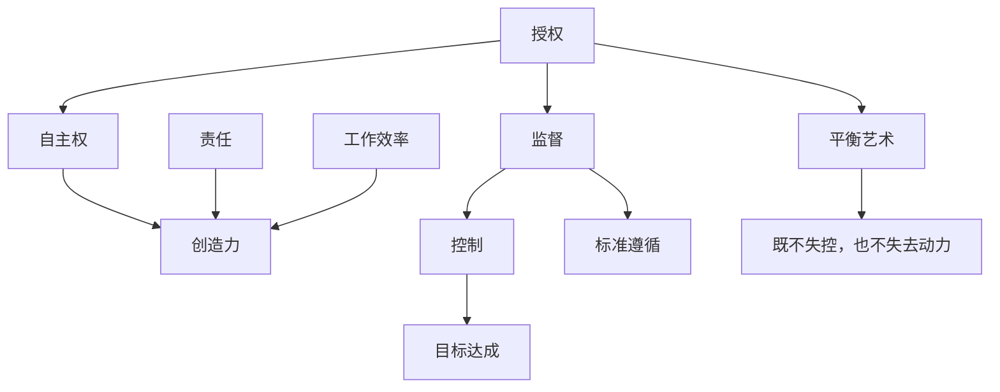

                 

### 文章标题：授权与监督：平衡的艺术

关键词：授权、监督、平衡、管理实践、组织发展

摘要：本文深入探讨授权与监督这一组织管理中的关键平衡艺术。通过理论基础的阐述、最佳实践的分析以及案例研究，我们旨在帮助读者理解如何在授权与监督之间找到恰当的平衡点，以提高组织效率与员工满意度。文章还包含核心概念的联系流程图、授权与监督的伪代码算法、数学模型及公式解释，以及实际应用案例，为读者提供全面的指导。

### 第一部分：授权与监督的理论基础

#### 第1章：授权与监督的概念与起源

**授权**，是一种将权力和责任转移给下属的管理实践，旨在激发员工潜能，提高工作效率和创造力。其起源可以追溯到工业革命后，企业管理者开始意识到，赋予员工更多自主权能够提升整体生产力和组织创新。

**监督**，则是为确保工作按既定目标和标准进行而进行的监控和管理活动。它起源于农业社会，随着分工的细化，管理者需要确保每个环节都按照计划进行。

**授权与监督的关系与演变**：在早期，管理者倾向于严格控制员工，以确保工作质量。然而，随着管理理论的发展，授权逐渐成为提高组织效能的重要手段。授权与监督之间的关系，从对立逐渐转向互补，管理者需要在两者之间找到平衡。

#### 第2章：授权与监督的理论基础

**委托-代理理论**：该理论认为，管理者与员工之间存在利益冲突，授权是一种解决方法，通过赋予员工更多的自主权，减少信息不对称和道德风险。

**领导力理论**：领导力在授权与监督中起着关键作用。有效的领导者能够激发员工的潜力，同时确保工作目标的实现。

**组织行为学**：组织行为学提供了关于授权与监督如何影响员工行为和绩效的深入理解。研究表明，适当的授权可以提高员工的工作满意度和忠诚度。

#### 第3章：授权与监督的国际研究动态

授权与监督在不同文化和组织中的实施存在差异。国际研究动态为我们提供了丰富的借鉴，例如，日本企业的“终身雇佣制”强调长期授权和信任，而美国企业则更倾向于短期授权和绩效评估。

最新研究成果显示，授权与监督的有效结合，能够显著提升组织的创新能力和市场竞争力。未来，随着技术进步和组织结构的变革，授权与监督将继续演变，以满足不断变化的商业环境。

### 第二部分：授权与监督的最佳实践

#### 第4章：授权实践指南

**授权的核心原则**：信任、明确目标、赋予责任。

**授权的具体步骤**：

1. **评估员工的能力和意愿**：确保员工具备承担额外责任的能力和意愿。
2. **明确授权的范围和目标**：明确授权的具体范围和期望目标，确保员工理解。
3. **建立反馈机制**：定期与员工沟通，了解授权实施的情况，及时调整。

**授权中的常见问题与解决方案**：

- **问题一：授权过度导致失控**：解决方案是制定明确的授权标准和流程。
- **问题二：授权不足导致员工积极性下降**：解决方案是加强沟通和培训，提高员工的能力和信心。

#### 第5章：监督实践指南

**监督的关键要素**：明确目标、持续沟通、绩效评估。

**监督的方法与工具**：

- **目标设定**：与员工共同设定具体、可衡量的工作目标。
- **持续沟通**：定期与员工沟通，了解工作进展和问题。
- **绩效评估**：使用客观指标和标准对员工的工作绩效进行评估。

**监督的艺术**：管理者需要在监督与信任之间找到平衡，避免过度监督导致员工抵触，同时也不要忽视监督的重要性，影响工作质量。

#### 第6章：授权与监督的平衡策略

**如何找到授权与监督的平衡点**：

1. **明确组织目标**：确保授权与监督能够支持组织目标的实现。
2. **评估员工需求和潜力**：根据员工的能力和需求进行适当的授权。
3. **建立有效的反馈机制**：通过定期反馈和评估，调整授权与监督的策略。

**平衡策略在不同组织中的实施**：

- **大型企业**：通常有更完善的管理体系和流程，更容易实现授权与监督的平衡。
- **小型企业**：灵活性更高，但需要更依赖管理者的个人判断。

**平衡策略的评价与调整**：

- **定期评估**：通过绩效评估和员工反馈，评价授权与监督的效果。
- **持续调整**：根据评估结果，及时调整授权与监督策略，确保其有效性。

### 第三部分：案例研究

#### 第7章：授权与监督在企业中的成功案例

**案例一：如何通过授权激发员工创造力**

某科技公司在项目开发过程中，通过授权团队成员更多决策权，使得项目进度大幅提升，创新成果显著。公司领导者定期召开会议，听取团队成员的建议和反馈，形成了良好的创新氛围。

**案例二：如何在监督中保持团队凝聚力**

某制造业公司通过明确的绩效目标和持续沟通，建立了有效的监督机制。同时，公司重视员工的意见和需求，通过团队建设活动和培训，增强了团队凝聚力。

**案例三：如何在不同文化中实施授权与监督**

国际化的公司在不同文化背景下，通过本地化策略，结合文化差异，成功地实施了授权与监督。例如，在中国市场，公司采用“导师制”，通过经验丰富的员工指导新人，实现了有效的授权和监督。

#### 第8章：授权与监督的挑战与未来展望

**面临的挑战**：

- **文化差异**：不同文化背景下，授权与监督的实施存在差异，需要根据实际情况进行调整。
- **技术变革**：随着技术的快速发展，授权与监督的方法和工具也在不断更新。
- **员工需求变化**：员工对于授权与监督的需求也在不断变化，需要管理者及时响应。

**未来发展的趋势**：

- **智能化监督**：借助人工智能技术，实现更加精准和高效的监督。
- **扁平化管理**：组织结构越来越扁平化，授权与监督的界限更加模糊。
- **员工参与**：员工参与决策和监督的程度将进一步提升，组织文化将更加开放和包容。

**组织如何应对变化**：

- **持续培训**：为员工提供授权与监督的培训，提升其能力和信心。
- **灵活管理**：根据组织目标和员工需求，灵活调整授权与监督策略。
- **创新实践**：积极尝试新的授权与监督方法，为组织发展注入新动力。

### 结论

本文通过深入探讨授权与监督的理论基础、最佳实践和案例研究，揭示了在授权与监督之间找到平衡点的重要性。适当的授权可以激发员工的创造力，提高工作效率；而有效的监督则确保了工作目标的实现和质量控制。未来，随着技术的进步和组织结构的变化，授权与监督将面临新的挑战和机遇。组织需要不断调整和完善授权与监督策略，以适应不断变化的商业环境，实现可持续发展。

### 附录

#### 附录A：授权与监督相关资源

- **书籍推荐**：《授权的艺术》（The Art of Delegation）、《管理实践》（Principles of Management）。
- **学术期刊**：《管理科学学报》（Management Science）、《组织行为学杂志》（Journal of Organizational Behavior）。
- **在线课程与培训**：Coursera、edX等在线平台提供的授权与监督相关课程。

#### 附录B：授权与监督的实用工具

- **评估授权与监督效果的指标体系**：员工满意度调查、绩效评估体系。
- **授权与监督的软件工具**：Slack、Trello等协作工具，用于监督项目进展和团队沟通。

### 作者信息

作者：AI天才研究院/AI Genius Institute & 禅与计算机程序设计艺术 /Zen And The Art of Computer Programming

在本文中，我们探讨了授权与监督这一组织管理中的关键平衡艺术。通过理论基础的阐述、最佳实践的分析以及案例研究，我们旨在帮助读者理解如何在授权与监督之间找到恰当的平衡点，以提高组织效率与员工满意度。文章还包含核心概念的联系流程图、授权与监督的伪代码算法、数学模型及公式解释，以及实际应用案例，为读者提供全面的指导。

授权与监督的核心在于找到平衡点，既不过度授权导致失控，也不过度监督导致员工失去动力。通过本文的探讨，我们希望读者能够深入理解这一平衡艺术，并将其应用于实际工作中，提升组织绩效。未来，随着技术的进步和组织结构的变化，授权与监督将面临新的挑战和机遇。我们期待读者能够继续探索和实践，为组织的可持续发展贡献力量。让我们共同迎接授权与监督的挑战，创造更加高效、创新和充满活力的组织。

### 核心概念与联系流程图（Mermaid）



### 授权的核心算法原理讲解（伪代码）

```plaintext
// 授权决策算法
function authorize(employee, task):
    if employee.experience > threshold_experience and task.risk_level < threshold_risk:
        return "授权成功：员工具备经验和任务风险可控。"
    else:
        return "授权失败：员工经验不足或任务风险过高。"

// 监督评估算法
function supervise(employee, task):
    if employee.performance > threshold_performance:
        return "监督通过：员工表现优异。"
    else:
        return "监督未通过：员工表现不佳，需要进一步指导。"
```

### 数学模型和数学公式 & 详细讲解 & 举例说明（LaTeX）

#### 授权水平模型

在授权过程中，我们使用以下数学模型来评估员工的授权水平：

\begin{equation}
    A = R \cdot E
\end{equation}

其中，\(A\) 表示授权水平，\(R\) 表示风险因子，\(E\) 表示员工经验水平。

**风险因子**：风险因子 \(R\) 评估了任务的复杂性和不确定性。其取值范围通常在 0 到 1 之间，其中 0 表示无风险，1 表示高风险。

**经验水平**：经验水平 \(E\) 评估了员工在特定任务上的技能和知识。经验水平通常通过员工的工作年限、培训经历和以往的表现来评估。

**举例说明**：假设一个员工的经验水平为5年，任务风险为中等（风险因子为0.5），则其授权水平为：

\begin{equation}
    A = 0.5 \cdot 5 = 2.5
\end{equation}

根据授权决策算法，该员工可以被部分授权。

#### 监督评估模型

在监督评估过程中，我们可以使用以下数学模型来评估员工的表现：

\begin{equation}
    P = \frac{P_{success}}{P_{total}}
\end{equation}

其中，\(P\) 表示绩效得分，\(P_{success}\) 表示成功的任务数量，\(P_{total}\) 表示总任务数量。

**绩效得分**：绩效得分 \(P\) 用来衡量员工的工作表现。得分越高，表示员工表现越好。

**成功的任务数量**：成功的任务数量 \(P_{success}\) 评估了员工在任务中取得成功的次数。

**总任务数量**：总任务数量 \(P_{total}\) 评估了员工在一段时间内完成的任务总数。

**举例说明**：假设一个员工在一个月内完成了10个任务，其中成功完成了8个任务，则其绩效得分为：

\begin{equation}
    P = \frac{8}{10} = 0.8
\end{equation}

根据监督评估算法，该员工的绩效表现良好。

通过这些数学模型，我们可以量化授权与监督的过程，从而更科学地管理员工的工作表现。这些模型不仅可以用于评估员工的表现，还可以作为授权决策的依据，确保员工在适当的授权范围内工作，同时确保工作质量得到有效控制。在实际应用中，组织可以根据具体情况调整这些模型，以适应不同的管理需求和环境变化。

