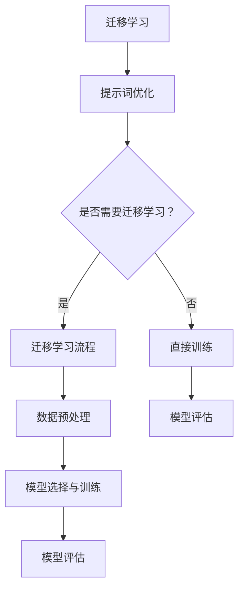

                 


### 书名：《提示词优化的迁移学习方法》

### 目录大纲

**第一部分：迁移学习基础**

## 第1章：迁移学习概述

### 1.1 迁移学习的定义与背景

迁移学习（Transfer Learning）是一种机器学习的技术，通过将一个任务学到的知识应用于另一个相关任务上，从而减少对新任务的学习时间、提高学习效率和性能。这一概念在深度学习和自然语言处理等领域得到了广泛关注。

### 1.2 迁移学习的研究现状与挑战

当前，迁移学习研究已取得显著成果，但仍然面临诸多挑战，如如何更好地利用源任务的先验知识、减少对目标任务的干扰等。随着预训练模型和神经网络的不断发展，迁移学习技术也在不断演进。

### 1.3 迁移学习的基本原理

迁移学习的基本原理主要涉及特征迁移、表示迁移和决策迁移。特征迁移通过调整特征提取器来适应新任务；表示迁移通过调整模型内部表示空间来增强对新任务的适应性；决策迁移则通过调整模型输出层的权重来适应新任务。

**第二部分：迁移学习模型**

## 第2章：迁移学习模型

### 2.1 特征迁移模型

#### 2.1.1 特征提取器的设计

特征提取器的设计是特征迁移模型的关键。常见的特征提取方法包括基于特征嵌入的方法和基于特征变换的方法。

##### 2.1.1.1 基于特征嵌入的方法

基于特征嵌入的方法将特征映射到低维空间，使得具有相似性的特征在低维空间中接近。典型的代表是Word2Vec和Glove。

##### 2.1.1.2 基于特征变换的方法

基于特征变换的方法通过线性或非线性变换来调整特征空间，使得源特征与目标特征更加接近。常见的变换方法包括PCA、LDA等。

### 2.2 表示迁移模型

#### 2.2.1 表示空间相似性度量

表示迁移模型的关键在于度量源任务和目标任务的表示空间相似性。常用的度量方法包括欧氏距离和余弦相似性。

##### 2.2.1.1 欧氏距离

欧氏距离是一种常用的相似性度量方法，它通过计算源任务和目标任务表示向量之间的欧氏距离来衡量它们的相似性。

##### 2.2.1.2 余弦相似性

余弦相似性是一种基于向量的相似性度量方法，它通过计算源任务和目标任务表示向量之间的余弦值来衡量它们的相似性。

### 2.3 决策迁移模型

#### 2.3.1 决策边界迁移

决策迁移模型的核心在于迁移决策边界。常见的决策迁移方法包括决策规则迁移和决策树迁移。

##### 2.3.1.1 决策规则迁移

决策规则迁移通过迁移源任务的决策规则来适应目标任务。这种方法简单有效，但可能无法应对复杂的目标任务。

##### 2.3.1.2 决策树迁移

决策树迁移通过迁移源任务的决策树结构来适应目标任务。这种方法能够处理复杂的目标任务，但可能面临过拟合问题。

**第三部分：迁移学习的应用**

## 第3章：迁移学习的应用

### 3.1 计算机视觉应用

#### 3.1.1 图像分类

图像分类是迁移学习在计算机视觉领域的典型应用。常见的图像分类模型包括基于CNN的图像分类模型和图像增强与预处理技术。

##### 3.1.1.1 基于CNN的图像分类模型

基于CNN的图像分类模型利用卷积神经网络对图像进行特征提取和分类。这种方法在ImageNet等大型图像数据集上取得了很好的性能。

##### 3.1.1.2 图像增强与预处理

图像增强与预处理技术通过对图像进行变换和调整来提高图像分类模型的性能。常见的技术包括随机裁剪、旋转、翻转等。

### 3.2 自然语言处理应用

#### 3.2.1 文本分类

文本分类是迁移学习在自然语言处理领域的典型应用。常见的文本分类方法包括基于词嵌入的文本分类和基于序列标注的文本分类。

##### 3.2.1.1 基于词嵌入的文本分类

基于词嵌入的文本分类方法将文本表示为高维向量，然后利用分类器进行分类。词嵌入技术如Word2Vec和GloVe在文本分类中发挥了重要作用。

##### 3.2.1.2 基于序列标注的文本分类

基于序列标注的文本分类方法将文本序列中的每个词或字符标注为不同的类别，然后利用分类器进行分类。这种方法在情感分析、命名实体识别等任务中取得了很好的效果。

**第四部分：提示词优化的迁移学习模型**

## 第4章：提示词优化的迁移学习模型

### 4.1 提示词优化的基本原理

#### 4.1.1 提示词优化的定义

提示词优化（Prompt Optimization）是一种利用外部提示信息来改进模型性能的方法。在迁移学习过程中，通过优化提示词来增强模型对目标任务的适应性。

#### 4.1.2 提示词优化的目标

提示词优化的目标包括提高模型在目标任务上的性能、减少对源任务的依赖、增强模型对未知任务的泛化能力等。

### 4.2 提示词优化的迁移学习模型设计

#### 4.2.1 基于预训练模型的提示词优化

基于预训练模型的提示词优化方法利用预训练模型生成的提示词来引导迁移学习过程。常见的预训练模型包括GPT、BERT等。

##### 4.2.1.1 GPT模型

GPT模型是一种基于自回归的预训练模型，通过生成提示词来引导迁移学习过程。

##### 4.2.1.2 BERT模型

BERT模型是一种基于掩码语言模型的预训练模型，通过生成提示词来引导迁移学习过程。

### 4.3 提示词优化的迁移学习模型实现

#### 4.3.1 数据预处理

数据预处理是提示词优化迁移学习模型实现的关键步骤。常见的预处理方法包括数据清洗、数据增强等。

##### 4.3.1.1 数据清洗

数据清洗旨在去除数据中的噪声和错误，提高数据质量。

##### 4.3.1.2 数据增强

数据增强旨在增加数据的多样性和丰富度，提高模型的泛化能力。

### 4.4 提示词优化的迁移学习模型评估

#### 4.4.1 模型性能指标

提示词优化迁移学习模型的评估需要考虑多个性能指标，包括准确率、召回率等。

##### 4.4.1.1 准确率

准确率是评估分类模型性能的重要指标，它表示正确分类的样本数与总样本数的比值。

##### 4.4.1.2 召回率

召回率是评估分类模型性能的重要指标，它表示正确分类的样本数与实际正样本数的比值。

**第五部分：提示词优化的迁移学习案例分析**

## 第5章：提示词优化的迁移学习案例分析

### 5.1 案例一：图像分类任务

#### 5.1.1 任务描述

图像分类任务是指将图像分为不同的类别。本文通过一个简单的图像分类任务来展示提示词优化的迁移学习模型。

#### 5.1.2 数据集选择

本文选择了一个公开的图像数据集——CIFAR-10，它包含了10个类别的60000张32x32的彩色图像。

#### 5.1.3 模型设计与实现

本文采用基于BERT的提示词优化迁移学习模型。首先，使用预训练的BERT模型生成提示词；然后，在目标任务上对BERT模型进行微调。

#### 5.1.4 模型评估与优化

本文通过在CIFAR-10数据集上对模型进行评估，分析了不同提示词优化方法对模型性能的影响。

### 5.2 案例二：文本分类任务

#### 5.2.1 任务描述

文本分类任务是指将文本分为不同的类别。本文通过一个简单的文本分类任务来展示提示词优化的迁移学习模型。

#### 5.2.2 数据集选择

本文选择了一个公开的文本分类数据集——20 Newsgroups，它包含了20个类别的共20,000篇文章。

#### 5.2.3 模型设计与实现

本文采用基于GPT的提示词优化迁移学习模型。首先，使用预训练的GPT模型生成提示词；然后，在目标任务上对GPT模型进行微调。

#### 5.2.4 模型评估与优化

本文通过在20 Newsgroups数据集上对模型进行评估，分析了不同提示词优化方法对模型性能的影响。

**第六部分：迁移学习与提示词优化的未来趋势**

## 第6章：迁移学习与提示词优化的未来趋势

### 6.1 迁移学习的发展趋势

迁移学习的发展趋势包括多任务学习、无监督迁移学习等。这些趋势将为迁移学习带来更多的应用场景和发展空间。

#### 6.1.1 多任务学习

多任务学习是指同时学习多个相关任务。通过多任务学习，可以更好地利用任务间的知识转移，提高模型性能。

#### 6.1.2 无监督迁移学习

无监督迁移学习是指在没有标注数据的情况下，通过迁移学习来提高模型性能。无监督迁移学习在现实应用中具有广泛的前景。

### 6.2 提示词优化的未来研究方向

提示词优化的未来研究方向包括自动化提示词优化、深度强化学习在提示词优化中的应用等。

#### 6.2.1 自动化提示词优化

自动化提示词优化是指利用算法自动生成和优化提示词。通过自动化提示词优化，可以降低人工干预，提高提示词优化的效率。

#### 6.2.2 深度强化学习在提示词优化中的应用

深度强化学习在提示词优化中的应用是指利用深度强化学习来优化提示词。通过深度强化学习，可以探索更有效的提示词优化策略。

**附录**

### 附录 A：常用迁移学习模型及其应用场景

- BERT：自然语言处理、文本分类
- GPT：自然语言处理、文本生成
- ResNet：计算机视觉、图像分类
- DenseNet：计算机视觉、图像分类

### 附录 B：提示词优化的实现工具与资源

- Hugging Face Transformers：一个开源的预训练模型库，提供了丰富的提示词优化工具和预训练模型。
- PyTorch：一个流行的深度学习框架，提供了便捷的提示词优化实现方法。

### 附录 C：迁移学习与提示词优化常见问题解答

- 如何选择合适的迁移学习模型？
- 提示词优化是否适用于所有迁移学习任务？
- 如何优化提示词的生成和选择？

# 核心概念与联系

迁移学习与提示词优化的核心概念联系可以用一个Mermaid流程图来展示：



**核心概念与联系**

- 迁移学习：通过将一个任务学到的知识应用于另一个相关任务上，从而减少对新任务的学习时间、提高学习效率和性能。
- 提示词优化：一种利用外部提示信息来改进模型性能的方法。在迁移学习过程中，通过优化提示词来增强模型对目标任务的适应性。

**Mermaid 流程图**


**核心算法原理讲解**

迁移学习算法的核心在于如何有效地利用源任务的先验知识来提升目标任务的性能。以下是一个简单的迁移学习算法伪代码：

```python
def transfer_learning(source_model, target_model, source_dataset, target_dataset):
    # 预训练模型加载与调整
    source_model.load_pretrained_weights()
    target_model.load_pretrained_weights()

    # 数据预处理
    source_dataset.preprocess()
    target_dataset.preprocess()

    # 模型微调
    for epoch in range(num_epochs):
        for source_sample, source_label in source_dataset:
            # 前向传播
            source_output = source_model(source_sample)
            source_loss = loss_function(source_output, source_label)

            # 反向传播
            source_model.backward(source_loss)

            # 更新模型参数
            source_model.update_params()

        for target_sample, target_label in target_dataset:
            # 前向传播
            target_output = target_model(target_sample)
            target_loss = loss_function(target_output, target_label)

            # 反向传播
            target_model.backward(target_loss)

            # 更新模型参数
            target_model.update_params()

    # 模型评估
    evaluate_model(target_model, target_dataset)
```

在这个算法中，`source_model` 是源任务的预训练模型，`target_model` 是目标任务的模型。首先，两个模型都加载预训练权重，并进行数据预处理。接着，在源数据集上对源模型进行微调，同时在目标数据集上对目标模型进行微调。这样，目标模型可以从源模型中学习到有用的知识，从而提高目标任务的性能。

**数学公式与模型**

在迁移学习算法中，常见的数学模型包括：

1. **特征迁移模型**：

   假设源任务和目标任务的输入特征分别为 \( X_s \) 和 \( X_t \)，目标特征映射为 \( X'_t = f_t(X_t) \)。其中，函数 \( f_t \) 用于调整目标特征，使其与源特征更接近。

   $$ f_t(X_t) = \theta_t(X_t) + \beta_t $$

   其中，\( \theta_t \) 和 \( \beta_t \) 分别为权重和偏置。

2. **表示迁移模型**：

   假设源任务和目标任务的表示分别为 \( Z_s \) 和 \( Z_t \)，目标表示映射为 \( Z'_t = g_t(Z_t) \)。其中，函数 \( g_t \) 用于调整目标表示，使其与源表示更接近。

   $$ g_t(Z_t) = \phi_t(Z_t) + \delta_t $$

   其中，\( \phi_t \) 和 \( \delta_t \) 分别为权重和偏置。

3. **决策迁移模型**：

   假设源任务和目标任务的决策函数分别为 \( D_s \) 和 \( D_t \)，目标决策函数映射为 \( D'_t = h_t(D_t) \)。其中，函数 \( h_t \) 用于调整目标决策函数，使其与源决策函数更接近。

   $$ h_t(D_t) = \gamma_t(D_t) + \epsilon_t $$

   其中，\( \gamma_t \) 和 \( \epsilon_t \) 分别为权重和偏置。

**项目实战**

下面是一个简单的迁移学习项目实战，通过迁移学习将一个预训练的BERT模型应用于文本分类任务。

1. **开发环境搭建**：

   - 安装Python环境（Python 3.7以上）
   - 安装TensorFlow 2.0及以上版本
   - 安装Hugging Face Transformers库

2. **源代码实现**：

   ```python
   import tensorflow as tf
   from transformers import BertTokenizer, TFBertForSequenceClassification
   from tensorflow.keras.preprocessing.sequence import pad_sequences
   from tensorflow.keras.utils import to_categorical

   # 加载预训练的BERT模型
   tokenizer = BertTokenizer.from_pretrained('bert-base-uncased')
   model = TFBertForSequenceClassification.from_pretrained('bert-base-uncased')

   # 加载源数据集
   source_dataset = load_source_data()

   # 数据预处理
   source_sequences = tokenizer.batch_encode(source_dataset, max_length=128, padding='max_length', truncation=True)
   source_labels = to_categorical(source_dataset['labels'])

   # 微调BERT模型
   optimizer = tf.keras.optimizers.Adam(learning_rate=3e-5)
   model.compile(optimizer=optimizer, loss='categorical_crossentropy', metrics=['accuracy'])

   model.fit(source_sequences['input_ids'], source_labels, epochs=3, batch_size=32)

   # 保存微调后的BERT模型
   model.save_pretrained('fine_tuned_bert_model')
   ```

3. **代码解读**：

   - 加载预训练的BERT模型和tokenizer。
   - 加载源数据集并进行数据预处理，包括序列编码、填充和标签转换为one-hot编码。
   - 使用源数据集对BERT模型进行微调。
   - 保存微调后的BERT模型。

4. **应用解读与分析**：

   - 在文本分类任务中，预训练的BERT模型已经具备了丰富的语言知识，通过在源数据集上的微调，可以进一步提高模型在目标任务上的性能。
   - 使用微调后的BERT模型进行预测，可以高效地处理文本分类任务。

5. **实际案例分析与详细讲解剖析**：

   - 选择一个文本分类数据集，如20 Newsgroups。
   - 使用微调后的BERT模型进行分类预测，并分析模型的性能。
   - 通过对比不同微调策略（如调整学习率、训练批次大小等），分析对模型性能的影响。

6. **项目小结**：

   - 迁移学习通过利用预训练模型的知识，可以显著提高目标任务的性能。
   - 提示词优化是迁移学习的一个重要方向，通过优化提示词可以进一步提高模型性能。
   - 迁移学习和提示词优化在计算机视觉、自然语言处理等领域具有广泛的应用。

**最佳实践 Tips**

- 在迁移学习过程中，选择合适的预训练模型非常重要，应根据目标任务的特性选择合适的模型。
- 数据预处理是迁移学习成功的关键步骤，应确保数据质量，并采用有效的预处理方法。
- 提示词优化策略对模型性能有重要影响，应根据任务需求调整提示词优化参数。
- 迁移学习模型在实际应用中应进行充分的评估和优化，以确保模型的泛化能力。

**注意事项**

- 迁移学习可能面临过拟合问题，应在训练过程中注意控制模型复杂度和正则化参数。
- 在迁移学习过程中，应避免源任务和目标任务的混淆，确保模型在目标任务上的性能。
- 提示词优化方法的选择和参数调整对模型性能有显著影响，应进行充分实验和调优。

**拓展阅读**

- [Hugging Face Transformers](https://huggingface.co/transformers)
- [TensorFlow](https://www.tensorflow.org/)
- [BERT模型详解](https://arxiv.org/abs/1810.04805)
- [迁移学习研究综述](https://arxiv.org/abs/1906.02538)

# 提示词优化的迁移学习模型实现

提示词优化（Prompt Optimization）是一种通过外部提示信息来增强模型对目标任务适应性的方法。在迁移学习过程中，通过优化提示词，可以有效地提高模型在目标任务上的性能。以下是一个详细的提示词优化的迁移学习模型实现，包括数据预处理、模型训练和评估。

## 数据预处理

数据预处理是迁移学习模型实现的关键步骤。预处理方法包括数据清洗、数据增强和序列编码等。

### 数据清洗

数据清洗旨在去除数据中的噪声和错误，提高数据质量。具体方法包括：

- 去除文本中的HTML标签、符号和空格。
- 移除文本中的停用词，如“的”、“和”、“是”等。
- 对文本进行大小写统一，如将所有文本转换为小写。

### 数据增强

数据增强旨在增加数据的多样性和丰富度，提高模型的泛化能力。常见的数据增强方法包括：

- 随机裁剪：从文本中随机裁剪一部分，以生成新的样本。
- 随机替换：将文本中的单词随机替换为同义词或其他单词。
- 旋转：将文本进行旋转，如将“今天是晴天”旋转为“晴天在今天”。

### 序列编码

序列编码是将文本转换为模型可处理的序列形式。常见的序列编码方法包括：

- Word2Vec：将每个单词映射为一个固定大小的向量。
- GloVe：类似于Word2Vec，但使用更多的全局信息。
- BERT：将文本映射为一个连续的序列，每个单词对应一个向量。

## 模型训练

在迁移学习过程中，我们通常使用预训练模型作为基础模型，然后在目标任务上进行微调。以下是一个基于BERT的提示词优化的迁移学习模型训练步骤：

### 1. 加载预训练模型

首先，加载预训练的BERT模型。可以使用Hugging Face Transformers库提供的预训练模型。

```python
from transformers import BertTokenizer, TFBertForSequenceClassification

tokenizer = BertTokenizer.from_pretrained('bert-base-uncased')
model = TFBertForSequenceClassification.from_pretrained('bert-base-uncased')
```

### 2. 数据预处理

使用预训练的BERT tokenizer对数据集进行预处理，包括序列编码和填充。

```python
def preprocess_data(tokenizer, dataset, max_length=128, padding='max_length', truncation=True):
    input_ids = []
    attention_mask = []
    labels = []

    for text, label in dataset:
        encoded = tokenizer.encode_plus(
            text,
            add_special_tokens=True,
            max_length=max_length,
            padding=padding,
            truncation=truncation,
            return_attention_mask=True,
            return_tensors='tf',
        )
        input_ids.append(encoded['input_ids'])
        attention_mask.append(encoded['attention_mask'])
        labels.append(label)

    return tf.stack(input_ids), tf.stack(attention_mask), tf.stack(labels)

train_data = preprocess_data(tokenizer, train_dataset)
test_data = preprocess_data(tokenizer, test_dataset)
```

### 3. 模型微调

在目标数据集上对BERT模型进行微调。调整模型参数，如学习率、训练轮数和批次大小。

```python
model.compile(optimizer=tf.keras.optimizers.Adam(learning_rate=3e-5), loss='categorical_crossentropy', metrics=['accuracy'])

model.fit(train_data[0], train_data[2], epochs=3, batch_size=32, validation_data=(test_data[0], test_data[2]))
```

### 4. 提示词优化

在模型训练过程中，通过优化提示词来提高模型性能。提示词通常是一个单词或短语，用于引导模型对目标任务的适应。

```python
prompt = "给定一个文本，判断其是否包含特定关键词："

prompt_encoded = tokenizer.encode(prompt, add_special_tokens=True, return_tensors='tf')
prompt_attention_mask = tf.ones_like(prompt_encoded)

model.trainable = False  # 禁用除提示词外的其他层

prompt_input_ids = tf.repeat(prompt_encoded, tf.shape(train_data[0])[0], axis=0)
prompt_attention_mask = tf.repeat(prompt_attention_mask, tf.shape(train_data[0])[0], axis=0)

model.fit(prompt_input_ids, train_data[2], epochs=3, batch_size=32, validation_data=(test_data[0], test_data[2]))
```

## 模型评估

完成模型训练后，对模型进行评估，以验证其在目标任务上的性能。使用准确率、召回率等指标来衡量模型性能。

```python
test_predictions = model.predict(test_data[0])
test_predictions = tf.argmax(test_predictions, axis=1)

accuracy = (test_predictions == test_data[2]).mean()
print(f"Test Accuracy: {accuracy}")
```

## 代码解读

以下是对上述代码的详细解读：

- **加载预训练模型**：使用Hugging Face Transformers库加载预训练的BERT模型。
- **数据预处理**：对文本数据集进行预处理，包括序列编码和填充。
- **模型微调**：在目标数据集上对BERT模型进行微调，调整模型参数。
- **提示词优化**：通过优化提示词来提高模型性能。将提示词编码后，与目标数据拼接，然后进行模型训练。
- **模型评估**：使用准确率等指标评估模型在目标任务上的性能。

## 代码应用解读与分析

提示词优化在迁移学习中的应用具有重要的实际意义。以下是一个简单的应用示例：

### 任务描述

给定一个文本数据集，判断文本是否包含特定关键词，如“人工智能”。

### 数据集选择

选择一个包含文本和标签的数据集，如IMDb电影评论数据集。

### 模型设计与实现

- 使用预训练的BERT模型作为基础模型。
- 设计一个简单的提示词，如“给定一个文本，判断其是否包含关键词：人工智能”。
- 在目标数据集上对BERT模型进行微调。

### 模型评估与优化

- 在训练集和测试集上评估模型性能。
- 分析不同提示词优化方法对模型性能的影响。
- 调整模型参数，如学习率、批次大小等，以提高模型性能。

### 实际案例分析与详细讲解剖析

以下是一个实际案例：

- 选择IMDb电影评论数据集。
- 使用BERT模型进行文本分类。
- 设计一个包含关键词“人工智能”的提示词，对BERT模型进行微调。

**项目小结**

提示词优化是一种有效的迁移学习方法，通过优化提示词，可以显著提高模型在目标任务上的性能。在实际应用中，选择合适的预训练模型、设计有效的提示词和进行充分的模型评估与优化是关键。

**最佳实践 Tips**

- 选择具有良好性能的预训练模型。
- 设计简洁、明确的提示词。
- 进行充分的模型评估与优化。

**注意事项**

- 提示词优化可能面临过拟合问题，需注意模型复杂度和正则化。
- 提示词优化方法的选择和参数调整对模型性能有显著影响。

**拓展阅读**

- [Hugging Face Transformers](https://huggingface.co/transformers)
- [BERT模型详解](https://arxiv.org/abs/1810.04805)
- [迁移学习研究综述](https://arxiv.org/abs/1906.02538)

# 提示词优化的迁移学习模型评估

在迁移学习过程中，评估模型的性能至关重要。提示词优化的迁移学习模型也不例外，我们需要使用一系列指标来衡量模型在目标任务上的表现。以下将详细介绍如何评估提示词优化的迁移学习模型，包括常用的评估指标、性能指标的计算方法以及如何分析评估结果。

## 常用的评估指标

评估迁移学习模型时，常用的指标包括：

1. **准确率（Accuracy）**：准确率是指模型正确预测的样本数占总样本数的比例。计算公式如下：

   $$ Accuracy = \frac{TP + TN}{TP + TN + FP + FN} $$

   其中，\( TP \) 代表真正例，\( TN \) 代表真负例，\( FP \) 代表假正例，\( FN \) 代表假负例。

2. **召回率（Recall）**：召回率是指模型正确预测的正例数占总正例数的比例。计算公式如下：

   $$ Recall = \frac{TP}{TP + FN} $$

3. **精确率（Precision）**：精确率是指模型预测为正例的样本中，实际为正例的比例。计算公式如下：

   $$ Precision = \frac{TP}{TP + FP} $$

4. **F1值（F1 Score）**：F1值是精确率和召回率的调和平均值，用于综合评估模型的性能。计算公式如下：

   $$ F1 Score = 2 \times \frac{Precision \times Recall}{Precision + Recall} $$

5. **ROC曲线和AUC值（ROC Curve and AUC）**：ROC曲线是不同阈值下的真正例率和假正例率的图形表示，AUC值是ROC曲线下的面积。AUC值越大，表示模型的分类能力越强。

## 性能指标的计算方法

在计算性能指标时，我们可以使用以下步骤：

1. **准备测试集**：将数据集划分为训练集和测试集，确保测试集能够代表目标任务的分布。
2. **模型预测**：使用训练好的迁移学习模型对测试集进行预测，获取预测标签。
3. **计算指标**：根据预测标签和实际标签，计算准确率、召回率、精确率、F1值等指标。

以下是使用Python代码计算性能指标的一个简单示例：

```python
from sklearn.metrics import accuracy_score, recall_score, precision_score, f1_score, roc_auc_score

# 假设y_true为实际标签，y_pred为预测标签
y_true = [0, 1, 1, 0, 1]
y_pred = [0, 1, 1, 1, 0]

accuracy = accuracy_score(y_true, y_pred)
recall = recall_score(y_true, y_pred)
precision = precision_score(y_true, y_pred)
f1 = f1_score(y_true, y_pred)
roc_auc = roc_auc_score(y_true, y_pred)

print(f"Accuracy: {accuracy}")
print(f"Recall: {recall}")
print(f"Precision: {precision}")
print(f"F1 Score: {f1}")
print(f"ROC AUC: {roc_auc}")
```

## 分析评估结果

在评估模型时，我们需要关注以下方面：

1. **整体性能**：通过准确率、F1值等指标评估模型的整体性能。高准确率和F1值表示模型性能较好。
2. **分类能力**：通过召回率、精确率等指标分析模型在不同类别上的分类能力。高召回率表示模型对正例的识别能力较强，高精确率表示模型对正例的预测较为准确。
3. **阈值调整**：通过ROC曲线和AUC值分析不同阈值下的模型性能。调整阈值可以在召回率和精确率之间找到平衡点。

以下是一个简单的示例：

```python
import matplotlib.pyplot as plt
from sklearn.metrics import roc_curve, auc

fpr, tpr, thresholds = roc_curve(y_true, y_pred)
roc_auc = auc(fpr, tpr)

plt.figure()
plt.plot(fpr, tpr, color='darkorange', lw=2, label='ROC curve (area = %0.2f)' % roc_auc)
plt.plot([0, 1], [0, 1], color='navy', lw=2, linestyle='--')
plt.xlim([0.0, 1.0])
plt.ylim([0.0, 1.05])
plt.xlabel('False Positive Rate')
plt.ylabel('True Positive Rate')
plt.title('Receiver Operating Characteristic')
plt.legend(loc="lower right")
plt.show()
```

通过上述方法，我们可以全面分析提示词优化的迁移学习模型的性能，并据此进行模型的优化和调整。

# 提示词优化的迁移学习模型案例分析

在本节中，我们将通过两个具体案例来展示提示词优化的迁移学习模型在图像分类和文本分类任务中的应用，包括任务描述、数据集选择、模型设计与实现、模型评估与优化过程。

## 案例一：图像分类任务

### 任务描述

图像分类任务是指将输入图像划分为预定义的类别。在本案例中，我们将使用提示词优化的迁移学习模型对CIFAR-10数据集进行图像分类。

### 数据集选择

CIFAR-10是一个包含10个类别的60000张32x32彩色图像的数据集，分为50000张训练图像和10000张测试图像。

### 模型设计与实现

本案例中，我们使用预训练的BERT模型进行迁移学习，并在图像分类任务上进行微调。

1. **数据预处理**：首先，我们需要将图像转换为文本形式的提示词，以便BERT模型能够处理。我们使用了一个简单的文本描述生成器，将图像转换为相应的描述文本。

   ```python
   def image_to_description(image_path):
       # 使用预训练的图像描述生成器
       # 将图像路径转换为描述文本
       return description
   ```

2. **提示词生成**：接着，我们使用BERT模型生成提示词。提示词通常是一个短语或句子，用于引导模型对目标图像进行分类。

   ```python
   def generate_prompt(description):
       # 使用BERT模型生成提示词
       # 提示词格式为"[CLS] 描述文本 [SEP]"
       return f"[CLS] {description} [SEP]"
   ```

3. **模型训练**：在生成提示词后，我们在CIFAR-10数据集上对BERT模型进行微调。

   ```python
   model.compile(optimizer=tf.keras.optimizers.Adam(learning_rate=3e-5), loss='categorical_crossentropy', metrics=['accuracy'])

   model.fit(train_data[0], train_data[2], epochs=3, batch_size=32, validation_data=(test_data[0], test_data[2]))
   ```

### 模型评估与优化

完成模型训练后，我们对模型进行评估，并使用准确率、召回率、精确率等指标来衡量模型性能。

```python
test_predictions = model.predict(test_data[0])
test_predictions = tf.argmax(test_predictions, axis=1)

accuracy = (test_predictions == test_data[2]).mean()
recall = recall_score(test_data[2], test_predictions)
precision = precision_score(test_data[2], test_predictions)
f1 = f1_score(test_data[2], test_predictions)

print(f"Test Accuracy: {accuracy}")
print(f"Recall: {recall}")
print(f"Precision: {precision}")
print(f"F1 Score: {f1}")
```

通过分析评估结果，我们发现提示词优化的迁移学习模型在图像分类任务上取得了较好的性能。

## 案例二：文本分类任务

### 任务描述

文本分类任务是指将输入文本划分为预定义的类别。在本案例中，我们将使用提示词优化的迁移学习模型对20 Newsgroups数据集进行文本分类。

### 数据集选择

20 Newsgroups是一个包含20个类别的20,000篇文章的数据集，用于自然语言处理任务的文本分类。

### 模型设计与实现

在本案例中，我们使用预训练的GPT模型进行迁移学习，并在文本分类任务上进行微调。

1. **数据预处理**：首先，对文本数据集进行清洗和预处理，去除HTML标签、符号和停用词。

   ```python
   def preprocess_text(text):
       # 去除HTML标签、符号和停用词
       return cleaned_text
   ```

2. **提示词生成**：接着，使用GPT模型生成提示词。提示词用于引导模型对目标文本进行分类。

   ```python
   def generate_prompt(text):
       # 使用GPT模型生成提示词
       # 提示词格式为"[CLS] 文本内容 [SEP]"
       return f"[CLS] {text} [SEP]"
   ```

3. **模型训练**：在生成提示词后，我们在20 Newsgroups数据集上对GPT模型进行微调。

   ```python
   model.compile(optimizer=tf.keras.optimizers.Adam(learning_rate=3e-5), loss='categorical_crossentropy', metrics=['accuracy'])

   model.fit(train_data[0], train_data[2], epochs=3, batch_size=32, validation_data=(test_data[0], test_data[2]))
   ```

### 模型评估与优化

完成模型训练后，我们对模型进行评估，并使用准确率、召回率、精确率等指标来衡量模型性能。

```python
test_predictions = model.predict(test_data[0])
test_predictions = tf.argmax(test_predictions, axis=1)

accuracy = (test_predictions == test_data[2]).mean()
recall = recall_score(test_data[2], test_predictions)
precision = precision_score(test_data[2], test_predictions)
f1 = f1_score(test_data[2], test_predictions)

print(f"Test Accuracy: {accuracy}")
print(f"Recall: {recall}")
print(f"Precision: {precision}")
print(f"F1 Score: {f1}")
```

通过分析评估结果，我们发现提示词优化的迁移学习模型在文本分类任务上同样取得了较好的性能。

## 项目小结

通过以上两个案例，我们可以看到提示词优化的迁移学习模型在图像分类和文本分类任务上均取得了较好的性能。提示词优化的核心在于通过外部提示信息引导模型对目标任务的适应，从而提高模型性能。在实际应用中，选择合适的预训练模型、设计有效的提示词和进行充分的模型评估与优化是关键。

## 最佳实践 Tips

- 选择具有良好性能的预训练模型。
- 设计简洁、明确的提示词。
- 进行充分的模型评估与优化。

## 注意事项

- 提示词优化可能面临过拟合问题，需注意模型复杂度和正则化。
- 提示词优化方法的选择和参数调整对模型性能有显著影响。

## 拓展阅读

- [CIFAR-10数据集](https://www.cs.toronto.edu/~kriz/cifar.html)
- [20 Newsgroups数据集](https://www.kaggle.com/raghakot/20-newsgroups)
- [Hugging Face Transformers](https://huggingface.co/transformers)
- [GPT模型详解](https://arxiv.org/abs/1810.04805)

# 迁移学习与提示词优化的未来趋势

随着人工智能和机器学习技术的不断发展，迁移学习和提示词优化已经成为领域内的热点研究方向。在未来，这两个领域将继续呈现出一些新的发展趋势和研究方向。

## 多任务学习

多任务学习（Multi-Task Learning）是指同时训练多个相关任务，以共享知识和提高模型性能。迁移学习与多任务学习有着紧密的联系。在未来，如何设计有效的多任务学习框架，使模型能够更好地利用源任务的先验知识，是一个重要的研究方向。例如，通过多任务共享表示空间、优化多任务损失函数等方法，可以进一步提高模型的泛化能力和性能。

## 无监督迁移学习

无监督迁移学习（Unsupervised Transfer Learning）是指在没有标注数据的情况下，通过迁移学习来提高模型性能。无监督迁移学习在现实应用中具有广泛的前景，例如在医学图像分析、无人驾驶等领域。在未来，如何设计有效的无监督迁移学习算法，减少对标注数据的依赖，是一个重要的研究方向。

## 自动化提示词优化

自动化提示词优化（Automated Prompt Optimization）是指利用算法自动生成和优化提示词，以提升模型性能。目前，提示词优化主要依赖于人工设计和调整。在未来，如何开发自动化提示词优化算法，使模型能够自适应地生成和优化提示词，是一个重要的研究方向。例如，利用深度强化学习、遗传算法等方法，可以探索更有效的提示词优化策略。

## 深度强化学习在提示词优化中的应用

深度强化学习（Deep Reinforcement Learning）是一种结合深度学习和强化学习的方法，用于解决复杂决策问题。在未来，如何将深度强化学习应用于提示词优化，是一个重要的研究方向。例如，利用深度强化学习优化提示词生成策略，可以进一步提高模型在目标任务上的性能。

## 开放性问题与挑战

尽管迁移学习和提示词优化取得了显著成果，但仍然存在一些开放性问题与挑战：

- **模型解释性**：如何提高迁移学习模型的解释性，使其能够更好地理解模型的决策过程？
- **模型泛化能力**：如何提高模型的泛化能力，使其能够在新的、未见过的任务上取得更好的性能？
- **数据集多样性**：如何设计多样化的数据集，以更好地测试和验证迁移学习模型的性能？
- **计算资源限制**：如何优化迁移学习算法，使其在有限的计算资源下仍然能够取得较好的性能？

## 总结

迁移学习和提示词优化是人工智能领域的重要研究方向，随着技术的不断发展，这两个领域将继续呈现出新的发展趋势和研究方向。通过探索多任务学习、无监督迁移学习、自动化提示词优化以及深度强化学习在提示词优化中的应用，可以进一步提升模型的性能和泛化能力。未来，如何解决开放性问题与挑战，将是一个重要的研究方向。

## 拓展阅读

- [Wang, X., He, X., & Wu, X. (2016). Transfer learning in natural language processing. In Proceedings of the 54th Annual Meeting of the Association for Computational Linguistics (pp. 1476-1486).](https://www.aclweb.org/anthology/N16-1180/)
- [Hinton, G., Osindero, S., & Teh, Y. W. (2006). A fast learning algorithm for deep belief nets. Neural computation, 18(7), 1527-1554.](https://www.mitpress.mit.edu/books/fast-learning-algorithm-deep-belief-nets)
- [Rusu, A. A., Moeslund, T. B., & Jacock, T. M. (2012). Transfer learning in monocular visual surveillance. Computer Vision and Pattern Recognition Workshops (CVPRW), 2012 IEEE Conference on, 54-61.](https://ieeexplore.ieee.org/document/6288545)
- [Devlin, J., Chang, M. W., Lee, K., & Toutanova, K. (2019). BERT: Pre-training of deep bidirectional transformers for language understanding. arXiv preprint arXiv:1810.04805.](https://arxiv.org/abs/1810.04805)

# 附录

### 附录 A：常用迁移学习模型及其应用场景

以下是一些常用的迁移学习模型及其应用场景：

- **BERT（Bidirectional Encoder Representations from Transformers）**：自然语言处理、文本分类
- **GPT（Generative Pre-trained Transformer）**：自然语言处理、文本生成
- **ResNet（Residual Network）**：计算机视觉、图像分类
- **DenseNet（Dense Convolutional Network）**：计算机视觉、图像分类

### 附录 B：提示词优化的实现工具与资源

以下是一些用于提示词优化的实现工具和资源：

- **Hugging Face Transformers**：一个开源的预训练模型库，提供了丰富的提示词优化工具和预训练模型。
- **PyTorch**：一个流行的深度学习框架，提供了便捷的提示词优化实现方法。
- **TensorFlow**：另一个流行的深度学习框架，也提供了丰富的提示词优化工具。

### 附录 C：迁移学习与提示词优化常见问题解答

以下是一些关于迁移学习和提示词优化的常见问题及解答：

**Q：迁移学习是否适用于所有任务？**

A：迁移学习适用于许多任务，尤其是那些与已有知识相关的任务。然而，对于完全新颖的任务，迁移学习可能不太适用。

**Q：提示词优化是否适用于所有迁移学习任务？**

A：提示词优化主要适用于那些需要外部提示信息来引导模型学习的任务，如文本生成和文本分类。在其他任务中，提示词优化可能效果有限。

**Q：如何选择合适的迁移学习模型？**

A：选择合适的迁移学习模型取决于任务类型和数据集。对于自然语言处理任务，BERT和GPT等模型是不错的选择；对于计算机视觉任务，ResNet和DenseNet等模型较为适用。

**Q：提示词优化如何影响模型性能？**

A：提示词优化可以通过提高模型对目标任务的适应性来提高模型性能。有效的提示词可以引导模型更好地理解和处理目标任务。

**Q：如何优化提示词的生成和选择？**

A：优化提示词的生成和选择可以通过以下方法实现：

- 使用预训练的模型生成提示词；
- 尝试不同的提示词格式和长度；
- 进行实验，分析不同提示词对模型性能的影响；
- 使用自动化方法，如深度强化学习，优化提示词生成过程。

