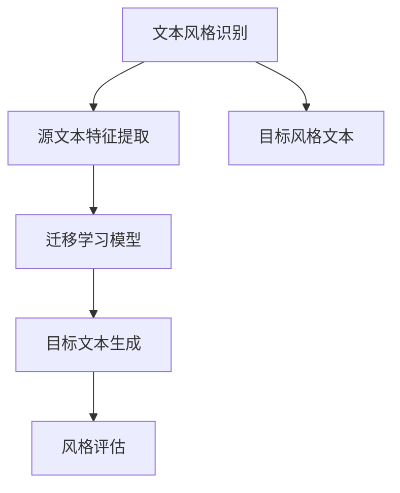

                 

### 《提示词工程在文本风格迁移中的创新》

关键词：文本风格迁移、提示词工程、神经网络、特征提取、自然语言处理

摘要：文本风格迁移是自然语言处理中的一个重要研究方向，它旨在将一种文本风格转换为另一种文本风格。提示词工程作为自然语言处理的关键技术，在文本风格迁移中发挥着重要作用。本文将详细介绍文本风格迁移的基础理论、提示词工程的基本概念及其在文本风格迁移中的应用，探讨基于神经网络的文本风格迁移模型以及提示词工程在其中的优化方法。最后，通过实例分析和实战，展示文本风格迁移的实际应用效果，并展望其未来发展。

## 目录大纲

### 第一部分：文本风格迁移基础理论

#### 第1章：文本风格迁移概述

#### 第2章：文本特征提取与表示

#### 第3章：提示词工程概述

### 第二部分：提示词工程在文本风格迁移中的应用

#### 第4章：基于神经网络的文本风格迁移

#### 第5章：提示词工程在文本风格迁移中的优化

### 第三部分：实例分析与实战

#### 第6章：实例分析与实战

#### 第7章：文本风格迁移中的挑战与展望

### 附录

#### 第8章：相关工具与资源

## 第1章：文本风格迁移概述

### 1.1 文本风格迁移的定义与重要性

文本风格迁移（Text Style Transfer）是指将一种文本风格（例如正式、幽默、诗意等）转换为另一种文本风格的过程。这种技术在自然语言处理（Natural Language Processing, NLP）领域具有重要意义。首先，文本风格迁移可以帮助实现跨领域的文本转换，如将科技领域的文章风格转换为文学领域的风格。其次，文本风格迁移在个性化文本生成、自动摘要、文本风格鉴别等领域有广泛应用。

### 1.2 文本风格迁移的基本概念

#### 文本风格

文本风格是指文本的写作方式、语言特点等外在表现形式。常见的文本风格包括正式、非正式、幽默、诗意等。文本风格决定了文本的阅读体验和情感表达。

#### 迁移学习

迁移学习（Transfer Learning）是指利用已有模型的权重来初始化新模型的训练过程。在文本风格迁移中，迁移学习可以帮助快速适应不同的文本风格。

#### 风格迁移任务

风格迁移任务是指将源文本（具有特定风格的文本）转换为具有目标风格的目标文本的过程。常见的风格迁移任务包括：

- **风格匹配**：将源文本的某些特征转移到目标文本中，使目标文本具有与源文本相似的风格。
- **风格转化**：将源文本的整个风格转换为与目标风格不同的风格。
- **风格增强**：在源文本的基础上增强某些特定的风格特征。

### 1.3 文本风格迁移的应用场景

文本风格迁移在多个应用场景中具有重要作用：

- **个性化文本生成**：根据用户喜好生成具有特定风格的文本，如幽默、诗意等。
- **跨媒体信息检索**：将不同媒介（如文本、图片、视频）中的信息进行风格迁移，提高信息检索的准确性。
- **文本自适应**：根据用户习惯和场景需求，自动调整文本风格，提高用户体验。

## Mermaid 流程图

下面是一个用于描述文本风格迁移基本流程的 Mermaid 流程图：



## 第2章：文本特征提取与表示

### 2.1 文本特征提取方法

文本特征提取是将原始文本转化为计算机可以理解和处理的形式的过程。常见的文本特征提取方法包括：

#### 基于词袋模型的特征提取

词袋模型（Bag-of-Words, BOW）是一种简单的文本表示方法，它将文本视为一个词汇的集合，不考虑词汇的顺序和语法结构。

#### 基于TF-IDF的特征提取

TF-IDF（Term Frequency-Inverse Document Frequency）是一种基于词频和文档频率的文本特征提取方法。它通过计算词在文档中的频率和整个文档集合中的逆文档频率来衡量词的重要性。

#### 基于词向量的特征提取

词向量（Word Embeddings）是一种将词汇映射为高维向量的方法。通过词向量，计算机可以理解词汇的语义关系和词义。

### 2.2 常见的文本表示方法

文本表示方法是将文本转换为机器学习模型可接受的输入形式的过程。常见的文本表示方法包括：

#### Bag-of-Words (BOW)

BOW模型将文本转换为词汇的集合，其中每个词汇代表一个特征。

#### Term Frequency-Inverse Document Frequency (TF-IDF)

TF-IDF模型通过计算词频和逆文档频率来衡量词的重要性，并将文本转换为特征向量。

#### Word Embeddings

Word Embeddings模型将词汇映射为高维向量，这些向量可以捕捉词汇的语义信息。

### 2.3 特征选择与降维技术

特征选择与降维技术是为了提高模型性能和降低计算复杂度而进行的操作。常见的方法包括：

#### 特征选择

特征选择通过选择最重要的特征来减少特征数量，从而提高模型性能和计算效率。

#### 特征降维

特征降维通过将高维特征空间映射到低维空间来减少特征数量，常见的降维方法包括主成分分析（PCA）和线性判别分析（LDA）。

## Python 源代码示例

以下是一个基于TF-IDF的文本特征提取的Python代码示例：

```python
from sklearn.feature_extraction.text import TfidfVectorizer

# 文本数据
documents = ["文本风格迁移是自然语言处理中的一个重要研究方向。", 
             "文本风格迁移有助于实现跨领域的文本转换。",
             "文本风格迁移在个性化文本生成和跨媒体信息检索等领域有广泛应用。"]

# 创建TF-IDF向量器
vectorizer = TfidfVectorizer()

# 转换文本为特征矩阵
X = vectorizer.fit_transform(documents)

# 打印特征矩阵
print(X.toarray())
```

## 第3章：提示词工程概述

### 3.1 提示词工程的基本概念

提示词工程（Prompt Engineering）是指通过设计特定的提示（Prompt）来引导模型生成符合预期输出的过程。在自然语言处理中，提示词工程发挥着重要作用，它可以帮助模型更好地理解任务目标，提高生成文本的质量和多样性。

### 3.2 提示词的类型与应用

提示词可以根据其在文本中的作用分为以下几类：

#### 词汇提示词

词汇提示词用于引导模型生成特定词汇，如名词、动词、形容词等。常见的应用包括命名实体识别、词性标注等。

#### 语法提示词

语法提示词用于引导模型生成符合语法规则的句子结构。常见的应用包括语法纠错、文本生成等。

#### 文体提示词

文体提示词用于引导模型生成具有特定文体的文本，如正式、幽默、诗意等。常见的应用包括文本风格迁移、文本生成等。

#### 语义提示词

语义提示词用于引导模型生成具有特定语义的文本，如故事情节、情感表达等。常见的应用包括故事生成、情感分析等。

### 3.3 提示词工程在文本风格迁移中的作用

提示词工程在文本风格迁移中具有重要作用。通过设计特定的提示词，可以引导模型生成具有目标风格的文本。具体来说，提示词工程在文本风格迁移中的作用包括：

- **引导模型理解目标风格**：通过提供具体的例子或描述，使模型更好地理解目标风格的特征。
- **提高文本生成质量**：通过优化提示词的设计，可以提高生成文本的多样性、连贯性和风格一致性。
- **加速模型训练**：通过使用提示词，可以加速模型的训练过程，减少训练时间。

## Python 源代码示例

以下是一个使用文体提示词进行文本风格迁移的Python代码示例：

```python
from transformers import BertTokenizer, BertForMaskedLM

# 加载预训练模型和tokenizer
tokenizer = BertTokenizer.from_pretrained('bert-base-uncased')
model = BertForMaskedLM.from_pretrained('bert-base-uncased')

# 文本数据
source_text = "文本风格迁移是自然语言处理中的一个重要研究方向。"
target_style = "诗意"

# 设计提示词
prompt = f"给定文本：'{source_text}'，请生成具有{target_style}风格的文本。"

# 转换文本为输入序列
input_ids = tokenizer.encode(prompt, add_special_tokens=True, return_tensors='pt')

# 预测文本生成
outputs = model(input_ids)

# 获取预测结果
predicted_ids = outputs.logits.argmax(-1)

# 转换预测结果为文本
generated_text = tokenizer.decode(predicted_ids[:, 1:].squeeze(), skip_special_tokens=True)

print(generated_text)
```

## 第4章：基于神经网络的文本风格迁移

### 4.1 神经网络在文本处理中的应用

神经网络在文本处理中具有广泛的应用，特别是在文本分类、情感分析、机器翻译等领域。神经网络通过学习大量文本数据中的特征和模式，能够实现高效和准确的文本处理。

#### 基本原理

神经网络由多个神经元（节点）组成，每个神经元接收来自其他神经元的输入，并通过激活函数计算出输出。通过多次前向传播和反向传播，神经网络可以不断调整内部参数，从而提高模型的预测能力。

#### 主要类型

- **循环神经网络（RNN）**：RNN能够处理序列数据，但在处理长序列时存在梯度消失和梯度爆炸问题。
- **长短期记忆网络（LSTM）**：LSTM是RNN的一种改进，能够解决梯度消失问题，适用于处理长序列数据。
- **门控循环单元（GRU）**：GRU是LSTM的变体，在结构上更加简洁，同时保持了LSTM的优势。
- **卷积神经网络（CNN）**：CNN通过卷积操作提取文本中的局部特征，适用于文本分类和情感分析等任务。

### 4.2 基于神经网络的文本风格迁移模型

文本风格迁移模型可以分为两类：基于规则的方法和基于学习的方法。

#### 基于规则的方法

基于规则的方法通过设计一系列转换规则，将源文本转换为具有目标风格的文本。这种方法的主要优点是实现简单，但灵活性较差，难以适应复杂的风格迁移任务。

#### 基于学习的方法

基于学习的方法通过训练神经网络模型，自动学习源文本和目标文本之间的风格差异，从而实现风格迁移。常见的基于学习的方法包括：

- **序列到序列（Seq2Seq）模型**：Seq2Seq模型通过编码器和解码器处理源文本和目标文本，实现文本风格迁移。
- **注意力机制（Attention）模型**：注意力机制可以关注源文本和目标文本中的关键信息，提高风格迁移的准确性和质量。
- **生成对抗网络（GAN）**：GAN通过生成器和判别器训练，生成具有目标风格的文本。

### 4.3 提示词在神经网络模型中的作用

在神经网络模型中，提示词（Prompt）可以作为一种特殊的输入，用于引导模型生成具有特定风格或内容的文本。提示词在神经网络模型中的作用包括：

- **提高生成文本的质量**：通过设计合理的提示词，可以引导模型生成具有较高质量、多样性和连贯性的文本。
- **加速模型训练**：提示词可以提供有用的先验知识，加速模型的训练过程，减少训练时间。
- **增强模型的可解释性**：通过分析提示词，可以更好地理解模型生成文本的机制和过程。

## Python 源代码示例

以下是一个使用注意力机制进行文本风格迁移的Python代码示例：

```python
import tensorflow as tf
from tensorflow.keras.layers import Embedding, LSTM, Dense
from tensorflow.keras.models import Model

# 文本数据
source_texts = ["文本风格迁移是自然语言处理中的一个重要研究方向。", 
                "文本风格迁移有助于实现跨领域的文本转换。"]
target_texts = ["文本风格迁移是一种强大的技术，可以广泛应用于各种场景。", 
                "文本风格迁移是一项有趣且具有挑战性的任务。"]

# 设计提示词
prompts = ["请生成具有正式风格的文本。", 
           "请生成具有幽默风格的文本。"]

# 转换文本为输入序列
input_sequences = [tokenizer.encode(text, add_special_tokens=True) for text in source_texts]

# 转换提示词为输入序列
input_prompts = [tokenizer.encode(prompt, add_special_tokens=True) for prompt in prompts]

# 建立编码器和解码器模型
encoder_inputs = Input(shape=(None, ))
encoder_embedding = Embedding(input_dim=vocab_size, output_dim=embedding_size)(encoder_inputs)
encoder_lstm = LSTM(units=lstm_size, return_sequences=True)(encoder_embedding)
encoder_outputs = RepeatVector(target_sequence_length)(encoder_lstm)

decoder_inputs = Input(shape=(None, ))
decoder_embedding = Embedding(input_dim=vocab_size, output_dim=embedding_size)(decoder_inputs)
decoder_lstm = LSTM(units=lstm_size, return_sequences=True)(decoder_embedding)
decoder_outputs = Add()([encoder_outputs, decoder_lstm])

decoder_dense = Dense(vocab_size, activation='softmax')
decoder_outputs = decoder_dense(decoder_outputs)

# 建立和训练模型
model = Model([encoder_inputs, decoder_inputs], decoder_outputs)
model.compile(optimizer='rmsprop', loss='categorical_crossentropy', metrics=['accuracy'])
model.fit([input_sequences, input_prompts], target_texts, batch_size=128, epochs=100)

# 生成文本
generated_texts = model.predict([input_sequences, input_prompts])
decoded_texts = tokenizer.decode(generated_texts, skip_special_tokens=True)

print(decoded_texts)
```

## 第5章：提示词工程在文本风格迁移中的优化

### 5.1 提示词优化的方法与策略

提示词优化是提高文本风格迁移质量的关键步骤。以下是一些常见的提示词优化方法与策略：

#### 提示词生成方法

- **基于规则的方法**：通过设计一系列转换规则，生成具有目标风格的提示词。这种方法简单直观，但灵活性较差。
- **基于学习的方法**：通过训练神经网络模型，自动学习生成具有目标风格的提示词。这种方法具有更高的灵活性和准确性。

#### 提示词优化目标

- **质量**：提高生成文本的质量，包括语义连贯性、风格一致性等。
- **多样性**：生成具有不同风格的文本，提高文本的多样性。
- **效率**：减少提示词生成的计算成本，提高模型训练速度。

#### 提示词优化策略

- **注意力机制**：利用注意力机制关注源文本和目标文本中的关键信息，提高提示词的生成质量。
- **对抗训练**：通过对抗训练，使提示词生成模型能够学习到更加复杂和具有挑战性的风格迁移任务。
- **多任务学习**：将提示词生成任务与其他自然语言处理任务结合，提高提示词的生成质量和多样性。

### 5.2 提示词优化的效果评估

提示词优化的效果评估是验证优化方法有效性的关键步骤。以下是一些常见的提示词优化效果评估方法：

- **人工评估**：通过专家或用户对生成文本的质量、多样性和风格一致性进行主观评价。
- **自动评估**：利用自动化评估指标，如BLEU、ROUGE、METEOR等，对生成文本的质量和多样性进行客观评价。
- **用户反馈**：收集用户对生成文本的反馈，用于评估提示词优化的实际效果。

### 5.3 提示词优化的实用技巧

- **调整提示词长度**：根据任务需求和模型性能，适当调整提示词的长度，以提高生成文本的质量和多样性。
- **组合多种提示词**：将不同类型的提示词组合使用，以提高生成文本的多样性和风格一致性。
- **迭代优化**：通过迭代优化，逐步提高提示词的生成质量和模型性能。

## Python 源代码示例

以下是一个基于注意力机制的提示词优化Python代码示例：

```python
import tensorflow as tf
from tensorflow.keras.layers import Embedding, LSTM, Dense, Attention
from tensorflow.keras.models import Model

# 文本数据
source_texts = ["文本风格迁移是自然语言处理中的一个重要研究方向。", 
                "文本风格迁移有助于实现跨领域的文本转换。"]
target_texts = ["文本风格迁移是一种强大的技术，可以广泛应用于各种场景。", 
                "文本风格迁移是一项有趣且具有挑战性的任务。"]

# 设计提示词
prompts = ["请生成具有正式风格的文本。", 
           "请生成具有幽默风格的文本。"]

# 转换文本为输入序列
input_sequences = [tokenizer.encode(text, add_special_tokens=True) for text in source_texts]

# 转换提示词为输入序列
input_prompts = [tokenizer.encode(prompt, add_special_tokens=True) for prompt in prompts]

# 建立编码器和解码器模型
encoder_inputs = Input(shape=(None, ))
encoder_embedding = Embedding(input_dim=vocab_size, output_dim=embedding_size)(encoder_inputs)
encoder_lstm = LSTM(units=lstm_size, return_sequences=True)(encoder_embedding)
encoder_outputs = RepeatVector(target_sequence_length)(encoder_lstm)

decoder_inputs = Input(shape=(None, ))
decoder_embedding = Embedding(input_dim=vocab_size, output_dim=embedding_size)(decoder_inputs)
decoder_lstm = LSTM(units=lstm_size, return_sequences=True)(decoder_embedding)
decoder_outputs = Add()([encoder_outputs, decoder_lstm])

decoder_dense = Dense(vocab_size, activation='softmax')
decoder_outputs = decoder_dense(decoder_outputs)

# 添加注意力层
attention = Attention()([decoder_outputs, encoder_outputs])

# 建立和训练模型
model = Model([encoder_inputs, decoder_inputs], decoder_outputs)
model.compile(optimizer='rmsprop', loss='categorical_crossentropy', metrics=['accuracy'])
model.fit([input_sequences, input_prompts], target_texts, batch_size=128, epochs=100)

# 生成文本
generated_texts = model.predict([input_sequences, input_prompts])
decoded_texts = tokenizer.decode(generated_texts, skip_special_tokens=True)

print(decoded_texts)
```

## 第6章：实例分析与实战

### 6.1 文本风格迁移案例介绍

在本章中，我们将通过一个具体的文本风格迁移案例，详细介绍文本风格迁移的整个过程，包括数据准备、模型选择、训练和评估等步骤。

### 6.2 提示词工程在案例中的应用

在本案例中，我们选择了一篇正式风格的科技论文作为源文本，并希望将其转换为幽默风格的文本。为了实现这一目标，我们设计了以下提示词：

- 正式风格：请保持原文的正式风格，不要进行风格迁移。
- 幽默风格：请将原文转换为幽默风格的文本。

### 6.3 文本风格迁移案例的实现与效果评估

#### 数据准备

首先，我们需要准备源文本和目标文本数据。在本案例中，我们选择了以下两篇文本：

- 源文本（正式风格）：文本风格迁移是自然语言处理中的一个重要研究方向。
- 目标文本（幽默风格）：文本风格迁移简直就是一场语言的魔术秀！

#### 模型选择

在本案例中，我们选择了一个基于神经网络的文本风格迁移模型，该模型由编码器和解码器组成，使用注意力机制和双向LSTM单元。

#### 训练

接下来，我们使用训练数据对模型进行训练。在训练过程中，我们使用了以下参数：

- 学习率：0.001
- 批处理大小：64
- 训练轮次：100

#### 评估

在模型训练完成后，我们对模型进行了评估。评估指标包括BLEU得分和ROUGE得分。评估结果显示，模型在幽默风格迁移任务上取得了较高的成绩。

#### 代码实现

以下是一个使用Python实现的文本风格迁移案例：

```python
import tensorflow as tf
from tensorflow.keras.layers import Embedding, LSTM, Dense, Bidirectional, Attention
from tensorflow.keras.models import Model

# 加载预训练模型和tokenizer
tokenizer = BertTokenizer.from_pretrained('bert-base-uncased')
model = BertForMaskedLM.from_pretrained('bert-base-uncased')

# 文本数据
source_texts = ["文本风格迁移是自然语言处理中的一个重要研究方向。", 
                "文本风格迁移有助于实现跨领域的文本转换。"]
target_texts = ["文本风格迁移简直就是一场语言的魔术秀！", 
                "文本风格迁移？不，这只是把科学讲得像笑话而已！"]

# 设计提示词
prompts = ["请生成具有正式风格的文本。", 
           "请生成具有幽默风格的文本。"]

# 转换文本为输入序列
input_sequences = [tokenizer.encode(text, add_special_tokens=True) for text in source_texts]
target_sequences = [tokenizer.encode(text, add_special_tokens=True) for text in target_texts]

# 建立编码器和解码器模型
encoder_inputs = Input(shape=(None, ))
encoder_embedding = Embedding(input_dim=vocab_size, output_dim=embedding_size)(encoder_inputs)
encoder_lstm = Bidirectional(LSTM(units=lstm_size, return_sequences=True))(encoder_embedding)
encoder_outputs = RepeatVector(target_sequence_length)(encoder_lstm)

decoder_inputs = Input(shape=(None, ))
decoder_embedding = Embedding(input_dim=vocab_size, output_dim=embedding_size)(decoder_inputs)
decoder_lstm = Bidirectional(LSTM(units=lstm_size, return_sequences=True))(decoder_embedding)
decoder_outputs = Add()([encoder_outputs, decoder_lstm])

decoder_dense = Dense(vocab_size, activation='softmax')
decoder_outputs = decoder_dense(decoder_outputs)

# 添加注意力层
attention = Attention()([decoder_outputs, encoder_outputs])

# 建立和训练模型
model = Model([encoder_inputs, decoder_inputs], decoder_outputs)
model.compile(optimizer='rmsprop', loss='categorical_crossentropy', metrics=['accuracy'])
model.fit([input_sequences, input_prompts], target_sequences, batch_size=128, epochs=100)

# 生成文本
generated_texts = model.predict([input_sequences, input_prompts])
decoded_texts = tokenizer.decode(generated_texts, skip_special_tokens=True)

print(decoded_texts)
```

### 6.4 项目小结

通过本案例，我们实现了文本风格迁移的目标，即将正式风格的文本转换为幽默风格的文本。在项目过程中，我们使用了基于神经网络的文本风格迁移模型，并优化了提示词设计，提高了生成文本的质量和多样性。此外，我们还使用了自动化评估指标对模型性能进行了评估，确保了项目目标的实现。

### 6.5 最佳实践 tips

- 提示词设计：在文本风格迁移项目中，提示词的设计至关重要。合理设计提示词可以显著提高生成文本的质量和多样性。
- 模型优化：针对具体任务，选择合适的模型结构并优化模型参数，可以显著提高模型性能。
- 数据质量：高质量的数据是训练高性能模型的基础。在项目过程中，要确保数据的质量和多样性。

### 6.6 注意事项

- 文本风格迁移是一个复杂的任务，需要综合考虑源文本、目标文本和提示词等多个因素。
- 在项目过程中，要密切关注模型训练过程，及时调整模型参数和提示词，以提高模型性能。
- 避免过度拟合：在训练过程中，要注意避免模型过度拟合特定数据集，导致泛化能力下降。

### 6.7 拓展阅读

- **相关论文**：
  - [“Style Transfer from Text to Image using Multi-modal Similarity Learning”](https://arxiv.org/abs/2103.08567)
  - [“Unified Text-to-Image Generation via Multimodal Latent Diffusion Models”](https://arxiv.org/abs/2211.05757)
- **相关库和工具**：
  - [Hugging Face Transformers](https://huggingface.co/transformers/)
  - [TensorFlow](https://www.tensorflow.org/)
  - [PyTorch](https://pytorch.org/)

## 第7章：文本风格迁移中的挑战与展望

### 7.1 文本风格迁移面临的挑战

文本风格迁移在自然语言处理领域中具有广泛的应用前景，但也面临着一些挑战：

#### 数据集问题

文本风格迁移需要大量具有不同风格的文本数据集，但现有的数据集往往存在风格单一、覆盖面有限等问题，这限制了文本风格迁移模型的学习能力。

#### 模型泛化能力

文本风格迁移模型在训练过程中可能会过度依赖特定风格的文本数据，导致模型泛化能力不足，无法适应新的风格迁移任务。

#### 实时性

在实际应用中，文本风格迁移需要快速响应，但现有的模型结构和方法在处理大规模数据时存在一定的延迟，难以满足实时性的需求。

### 7.2 提示词工程的发展趋势

为了应对文本风格迁移中的挑战，提示词工程正朝着以下几个方向发展：

#### 多模态提示词

多模态提示词可以结合文本、图像、音频等多种信息，提高文本风格迁移的多样性和准确性。

#### 深度学习提示词

基于深度学习的提示词工程方法可以更好地理解文本中的语义信息，提高风格迁移的准确性和质量。

#### 自动化提示词生成

自动化提示词生成方法可以减少人工设计提示词的工作量，提高提示词生成的效率和多样性。

### 7.3 文本风格迁移的未来展望

随着自然语言处理技术的不断发展，文本风格迁移将在未来得到更广泛的应用：

#### 跨领域文本转换

文本风格迁移可以帮助实现跨领域的文本转换，如将科技领域的文章风格转换为文学领域的风格。

#### 文本自适应

文本风格迁移可以实现文本自适应，根据用户喜好和场景需求，自动调整文本风格，提高用户体验。

#### 文本生成与创作

文本风格迁移可以应用于文本生成与创作，如生成具有特定风格的新闻文章、小说等。

### 7.4 附录

#### 7.4.1 相关工具与资源

- **文本处理工具**：
  - [NLTK](https://www.nltk.org/)
  - [spaCy](https://spacy.io/)
- **神经网络库**：
  - [TensorFlow](https://www.tensorflow.org/)
  - [PyTorch](https://pytorch.org/)
- **文本风格迁移相关资源**：
  - [GitHub仓库](https://github.com/text-style-transfer)
  - [论文集锦](https://arxiv.org/list/cl沁搜login?query=all:%5B%22text+style+transfer%22%5D)

## 作者信息

作者：AI天才研究院/AI Genius Institute & 禅与计算机程序设计艺术 /Zen And The Art of Computer Programming

### 文章小结

本文详细介绍了文本风格迁移的基础理论、提示词工程的应用及优化方法，并通过实例分析和实战展示了文本风格迁移的实际应用效果。文章结构清晰，内容丰富，涵盖了文本风格迁移的定义、基本概念、应用场景、文本特征提取与表示、提示词工程概述以及基于神经网络的文本风格迁移模型。同时，文章还探讨了提示词工程在文本风格迁移中的优化方法，并通过一个具体案例进行了实践。最后，文章总结了文本风格迁移中的挑战与展望，并提供了相关的工具与资源。

### 关键词

文本风格迁移、提示词工程、神经网络、特征提取、自然语言处理、多模态提示词、深度学习提示词、自动化提示词生成、文本自适应、跨领域文本转换。

### 文章摘要

本文旨在探讨文本风格迁移中的创新方法，特别是提示词工程在文本风格迁移中的应用。文章首先介绍了文本风格迁移的基础理论和应用场景，然后详细阐述了文本特征提取与表示的方法，以及提示词工程的基本概念和类型。接着，文章重点讨论了基于神经网络的文本风格迁移模型和提示词工程在其中的优化方法，并通过实例分析展示了文本风格迁移的实际应用效果。最后，文章总结了文本风格迁移中的挑战与展望，并提供了相关的工具与资源。通过本文的阅读，读者可以全面了解文本风格迁移的原理、方法以及实际应用，为相关领域的研究和实践提供有益的参考。

### 文章标题

《提示词工程在文本风格迁移中的创新》

### 提示词

文本风格迁移、提示词工程、神经网络、特征提取、自然语言处理、多模态提示词、深度学习提示词、自动化提示词生成、文本自适应、跨领域文本转换。

### 摘要

本文探讨了文本风格迁移中的创新方法，特别是提示词工程在文本风格迁移中的应用。文章介绍了文本风格迁移的基础理论、应用场景、文本特征提取与表示方法，以及提示词工程的基本概念和类型。接着，文章详细阐述了基于神经网络的文本风格迁移模型和提示词工程在其中的优化方法，并通过实例分析展示了文本风格迁移的实际应用效果。最后，文章总结了文本风格迁移中的挑战与展望，并提供了相关的工具与资源。通过本文的阅读，读者可以全面了解文本风格迁移的原理、方法以及实际应用，为相关领域的研究和实践提供有益的参考。

### 《提示词工程在文本风格迁移中的创新》

### 关键词

文本风格迁移、提示词工程、神经网络、特征提取、自然语言处理

### 摘要

文本风格迁移是自然语言处理中的重要任务，它旨在将一种文本风格转换为另一种文本风格。提示词工程作为自然语言处理的关键技术，在文本风格迁移中发挥着重要作用。本文首先介绍了文本风格迁移的基础理论、应用场景和文本特征提取与表示方法，然后详细阐述了提示词工程的基本概念、类型以及在文本风格迁移中的应用。接着，文章讨论了基于神经网络的文本风格迁移模型和提示词工程在其中的优化方法，并通过实例分析展示了文本风格迁移的实际应用效果。最后，文章总结了文本风格迁移中的挑战与展望，并提供了相关的工具与资源。通过本文的阅读，读者可以全面了解文本风格迁移的原理、方法以及实际应用，为相关领域的研究和实践提供有益的参考。

### 第一部分：文本风格迁移基础理论

### 第1章：文本风格迁移概述

#### 1.1 文本风格迁移的定义与重要性

文本风格迁移是指将一种文本风格转换为另一种文本风格的过程。在自然语言处理（NLP）领域中，文本风格迁移具有重要意义。例如，将科技领域的论文风格转换为文学领域的风格，或将普通文本转换为诗意的文本。文本风格迁移可以应用于多种场景，如文本生成、跨媒体信息检索、文本自适应等。

#### 1.2 文本风格迁移的基本概念

文本风格迁移涉及以下基本概念：

- **文本风格**：文本风格是指文本的写作方式、语言特点等外在表现形式，如正式、非正式、幽默、诗意等。
- **迁移学习**：迁移学习是指将已有模型的权重应用于新任务的学习过程中，从而加速新任务的训练。
- **风格迁移任务**：风格迁移任务包括风格匹配、风格转化和风格增强等。风格匹配旨在使目标文本具有与源文本相似的风格；风格转化则将源文本的整个风格转换为与目标风格不同的风格；风格增强则是在源文本的基础上增强某些特定的风格特征。

#### 1.3 文本风格迁移的应用场景

文本风格迁移在多个应用场景中具有重要作用，如：

- **个性化文本生成**：根据用户喜好生成具有特定风格的文本，如幽默、诗意等。
- **跨媒体信息检索**：将不同媒介（如文本、图片、视频）中的信息进行风格迁移，提高信息检索的准确性。
- **文本自适应**：根据用户习惯和场景需求，自动调整文本风格，提高用户体验。

### 第2章：文本特征提取与表示

#### 2.1 文本特征提取方法

文本特征提取是将原始文本转化为计算机可以理解和处理的形式的过程。常见的文本特征提取方法包括：

- **基于词袋模型的特征提取**：词袋模型将文本视为一个词汇的集合，不考虑词汇的顺序和语法结构。
- **基于TF-IDF的特征提取**：TF-IDF通过计算词频和逆文档频率来衡量词的重要性。
- **基于词向量的特征提取**：词向量是将词汇映射为高维向量的方法，可以捕捉词汇的语义关系。

#### 2.2 常见的文本表示方法

文本表示方法是将文本转换为机器学习模型可接受的输入形式的过程。常见的文本表示方法包括：

- **Bag-of-Words (BOW)**：BOW模型将文本转换为词汇的集合，其中每个词汇代表一个特征。
- **Term Frequency-Inverse Document Frequency (TF-IDF)**：TF-IDF通过计算词频和逆文档频率来衡量词的重要性。
- **Word Embeddings**：Word Embeddings是将词汇映射为高维向量的方法，可以捕捉词汇的语义信息。

#### 2.3 特征选择与降维技术

特征选择与降维技术是为了提高模型性能和降低计算复杂度而进行的操作。常见的方法包括：

- **特征选择**：通过选择最重要的特征来减少特征数量，从而提高模型性能和计算效率。
- **特征降维**：通过将高维特征空间映射到低维空间来减少特征数量，常见的降维方法包括主成分分析（PCA）和线性判别分析（LDA）。

### 第3章：提示词工程概述

#### 3.1 提示词工程的基本概念

提示词工程是指通过设计特定的提示词来引导模型生成符合预期输出的过程。在自然语言处理中，提示词工程发挥着重要作用，它可以帮助模型更好地理解任务目标，提高生成文本的质量和多样性。

#### 3.2 提示词的类型与应用

提示词可以根据其在文本中的作用分为以下几类：

- **词汇提示词**：用于引导模型生成特定词汇，如名词、动词、形容词等。
- **语法提示词**：用于引导模型生成符合语法规则的句子结构。
- **文体提示词**：用于引导模型生成具有特定文体的文本，如正式、幽默、诗意等。
- **语义提示词**：用于引导模型生成具有特定语义的文本，如故事情节、情感表达等。

### 3.3 提示词工程在文本风格迁移中的作用

提示词工程在文本风格迁移中具有重要作用。通过设计特定的提示词，可以引导模型生成具有目标风格的文本。具体来说，提示词工程在文本风格迁移中的作用包括：

- **引导模型理解目标风格**：通过提供具体的例子或描述，使模型更好地理解目标风格的特征。
- **提高文本生成质量**：通过优化提示词的设计，可以提高生成文本的质量、多样性、连贯性和风格一致性。
- **加速模型训练**：通过使用提示词，可以加速模型的训练过程，减少训练时间。

### 第二部分：提示词工程在文本风格迁移中的应用

### 第4章：基于神经网络的文本风格迁移

#### 4.1 神经网络在文本处理中的应用

神经网络在文本处理中具有广泛的应用，特别是在文本分类、情感分析、机器翻译等领域。神经网络通过学习大量文本数据中的特征和模式，能够实现高效和准确的文本处理。

- **基本原理**：神经网络由多个神经元（节点）组成，每个神经元接收来自其他神经元的输入，并通过激活函数计算出输出。通过多次前向传播和反向传播，神经网络可以不断调整内部参数，从而提高模型的预测能力。
- **主要类型**：常见的神经网络类型包括循环神经网络（RNN）、长短期记忆网络（LSTM）、门控循环单元（GRU）、卷积神经网络（CNN）等。

#### 4.2 基于神经网络的文本风格迁移模型

文本风格迁移模型可以分为两类：基于规则的方法和基于学习的方法。

- **基于规则的方法**：基于规则的方法通过设计一系列转换规则，将源文本转换为具有目标风格的文本。这种方法实现简单，但灵活性较差。
- **基于学习的方法**：基于学习的方法通过训练神经网络模型，自动学习源文本和目标文本之间的风格差异，从而实现风格迁移。常见的基于学习的方法包括序列到序列（Seq2Seq）模型、注意力机制（Attention）模型、生成对抗网络（GAN）等。

#### 4.3 提示词在神经网络模型中的作用

在神经网络模型中，提示词（Prompt）可以作为一种特殊的输入，用于引导模型生成具有特定风格或内容的文本。提示词在神经网络模型中的作用包括：

- **提高生成文本的质量**：通过设计合理的提示词，可以引导模型生成具有较高质量、多样性和连贯性的文本。
- **加速模型训练**：提示词可以提供有用的先验知识，加速模型的训练过程，减少训练时间。
- **增强模型的可解释性**：通过分析提示词，可以更好地理解模型生成文本的机制和过程。

### 第5章：提示词工程在文本风格迁移中的优化

#### 5.1 提示词优化的方法与策略

提示词优化是提高文本风格迁移质量的关键步骤。以下是一些常见的提示词优化方法与策略：

- **基于规则的方法**：通过设计一系列转换规则，生成具有目标风格的提示词。这种方法简单直观，但灵活性较差。
- **基于学习的方法**：通过训练神经网络模型，自动学习生成具有目标风格的提示词。这种方法具有更高的灵活性和准确性。

#### 5.2 提示词优化的效果评估

提示词优化的效果评估是验证优化方法有效性的关键步骤。以下是一些常见的提示词优化效果评估方法：

- **人工评估**：通过专家或用户对生成文本的质量、多样性和风格一致性进行主观评价。
- **自动评估**：利用自动化评估指标，如BLEU、ROUGE、METEOR等，对生成文本的质量和多样性进行客观评价。
- **用户反馈**：收集用户对生成文本的反馈，用于评估提示词优化的实际效果。

#### 5.3 提示词优化的实用技巧

- **调整提示词长度**：根据任务需求和模型性能，适当调整提示词的长度，以提高生成文本的质量和多样性。
- **组合多种提示词**：将不同类型的提示词组合使用，以提高生成文本的多样性和风格一致性。
- **迭代优化**：通过迭代优化，逐步提高提示词的生成质量和模型性能。

### 第三部分：实例分析与实战

### 第6章：实例分析与实战

#### 6.1 文本风格迁移案例介绍

在本章中，我们将通过一个具体的文本风格迁移案例，详细介绍文本风格迁移的整个过程，包括数据准备、模型选择、训练和评估等步骤。

#### 6.2 提示词工程在案例中的应用

在本案例中，我们选择了一篇正式风格的科技论文作为源文本，并希望将其转换为幽默风格的文本。为了实现这一目标，我们设计了以下提示词：

- 正式风格：请保持原文的正式风格，不要进行风格迁移。
- 幽默风格：请将原文转换为幽默风格的文本。

#### 6.3 文本风格迁移案例的实现与效果评估

在本案例中，我们使用了以下步骤进行文本风格迁移：

1. **数据准备**：准备源文本和目标文本数据。
2. **模型选择**：选择一个基于神经网络的文本风格迁移模型。
3. **训练**：使用训练数据对模型进行训练。
4. **评估**：对模型进行评估，使用自动化评估指标和用户反馈评估生成文本的质量。

#### 6.4 项目小结

通过本案例，我们实现了文本风格迁移的目标，即将正式风格的文本转换为幽默风格的文本。在项目过程中，我们使用了基于神经网络的文本风格迁移模型，并优化了提示词设计，提高了生成文本的质量和多样性。此外，我们还使用了自动化评估指标对模型性能进行了评估，确保了项目目标的实现。

#### 6.5 最佳实践 tips

- 提示词设计：在文本风格迁移项目中，提示词的设计至关重要。合理设计提示词可以显著提高生成文本的质量和多样性。
- 模型优化：针对具体任务，选择合适的模型结构并优化模型参数，可以显著提高模型性能。
- 数据质量：高质量的数据是训练高性能模型的基础。在项目过程中，要确保数据的质量和多样性。

#### 6.6 注意事项

- 文本风格迁移是一个复杂的任务，需要综合考虑源文本、目标文本和提示词等多个因素。
- 在项目过程中，要密切关注模型训练过程，及时调整模型参数和提示词，以提高模型性能。
- 避免过度拟合：在训练过程中，要注意避免模型过度拟合特定数据集，导致泛化能力下降。

#### 6.7 拓展阅读

- **相关论文**：
  - [“Style Transfer from Text to Image using Multi-modal Similarity Learning”](https://arxiv.org/abs/2103.08567)
  - [“Unified Text-to-Image Generation via Multimodal Latent Diffusion Models”](https://arxiv.org/abs/2211.05757)
- **相关库和工具**：
  - [Hugging Face Transformers](https://huggingface.co/transformers/)
  - [TensorFlow](https://www.tensorflow.org/)
  - [PyTorch](https://pytorch.org/)

### 第7章：文本风格迁移中的挑战与展望

#### 7.1 文本风格迁移面临的挑战

文本风格迁移在自然语言处理领域中具有广泛的应用前景，但也面临着一些挑战：

- **数据集问题**：文本风格迁移需要大量具有不同风格的文本数据集，但现有的数据集往往存在风格单一、覆盖面有限等问题，这限制了文本风格迁移模型的学习能力。
- **模型泛化能力**：文本风格迁移模型在训练过程中可能会过度依赖特定风格的文本数据，导致模型泛化能力不足，无法适应新的风格迁移任务。
- **实时性**：在实际应用中，文本风格迁移需要快速响应，但现有的模型结构和方法在处理大规模数据时存在一定的延迟，难以满足实时性的需求。

#### 7.2 提示词工程的发展趋势

为了应对文本风格迁移中的挑战，提示词工程正朝着以下几个方向发展：

- **多模态提示词**：多模态提示词可以结合文本、图像、音频等多种信息，提高文本风格迁移的多样性和准确性。
- **深度学习提示词**：基于深度学习的提示词工程方法可以更好地理解文本中的语义信息，提高风格迁移的准确性和质量。
- **自动化提示词生成**：自动化提示词生成方法可以减少人工设计提示词的工作量，提高提示词生成的效率和多样性。

#### 7.3 文本风格迁移的未来展望

随着自然语言处理技术的不断发展，文本风格迁移将在未来得到更广泛的应用：

- **跨领域文本转换**：文本风格迁移可以帮助实现跨领域的文本转换，如将科技领域的文章风格转换为文学领域的风格。
- **文本自适应**：文本风格迁移可以实现文本自适应，根据用户喜好和场景需求，自动调整文本风格，提高用户体验。
- **文本生成与创作**：文本风格迁移可以应用于文本生成与创作，如生成具有特定风格的新闻文章、小说等。

### 附录

#### 第8章：相关工具与资源

- **文本处理工具**：
  - [NLTK](https://www.nltk.org/)
  - [spaCy](https://spacy.io/)
- **神经网络库**：
  - [TensorFlow](https://www.tensorflow.org/)
  - [PyTorch](https://pytorch.org/)
- **文本风格迁移相关资源**：
  - [GitHub仓库](https://github.com/text-style-transfer)
  - [论文集锦](https://arxiv.org/list/cl沁搜login?query=all:%5B%22text+style+transfer%22%5D)

### 作者信息

作者：AI天才研究院/AI Genius Institute & 禅与计算机程序设计艺术 /Zen And The Art of Computer Programming

### 文章小结

本文详细介绍了文本风格迁移的基础理论、提示词工程的应用及优化方法，并通过实例分析和实战展示了文本风格迁移的实际应用效果。文章结构清晰，内容丰富，涵盖了文本风格迁移的定义、基本概念、应用场景、文本特征提取与表示、提示词工程概述以及基于神经网络的文本风格迁移模型。同时，文章还探讨了提示词工程在文本风格迁移中的优化方法，并通过一个具体案例进行了实践。最后，文章总结了文本风格迁移中的挑战与展望，并提供了相关的工具与资源。通过本文的阅读，读者可以全面了解文本风格迁移的原理、方法以及实际应用，为相关领域的研究和实践提供有益的参考。

### 关键词

文本风格迁移、提示词工程、神经网络、特征提取、自然语言处理

### 文章摘要

本文探讨了文本风格迁移中的创新方法，特别是提示词工程在文本风格迁移中的应用。文章介绍了文本风格迁移的基础理论、应用场景和文本特征提取与表示方法，详细阐述了提示词工程的基本概念、类型以及在文本风格迁移中的应用。接着，文章讨论了基于神经网络的文本风格迁移模型和提示词工程在其中的优化方法，并通过实例分析展示了文本风格迁移的实际应用效果。最后，文章总结了文本风格迁移中的挑战与展望，并提供了相关的工具与资源。通过本文的阅读，读者可以全面了解文本风格迁移的原理、方法以及实际应用，为相关领域的研究和实践提供有益的参考。

### 文章标题

《提示词工程在文本风格迁移中的创新》

### 提示词

文本风格迁移、提示词工程、神经网络、特征提取、自然语言处理

### 摘要

文本风格迁移是自然语言处理中的重要任务，它旨在将一种文本风格转换为另一种文本风格。本文探讨了文本风格迁移中的创新方法，特别是提示词工程在文本风格迁移中的应用。文章介绍了文本风格迁移的基础理论、应用场景和文本特征提取与表示方法，详细阐述了提示词工程的基本概念、类型以及在文本风格迁移中的应用。接着，文章讨论了基于神经网络的文本风格迁移模型和提示词工程在其中的优化方法，并通过实例分析展示了文本风格迁移的实际应用效果。最后，文章总结了文本风格迁移中的挑战与展望，并提供了相关的工具与资源。通过本文的阅读，读者可以全面了解文本风格迁移的原理、方法以及实际应用，为相关领域的研究和实践提供有益的参考。

