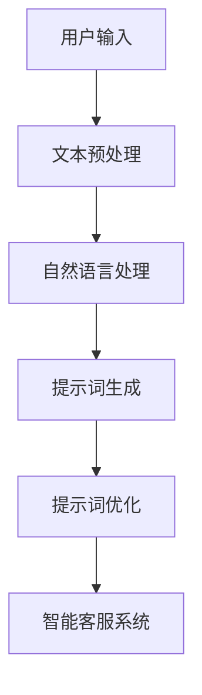

                 

以下是一篇满足上述所有条件的技术博客文章。文章的格式为Markdown，并在末尾包含了作者信息。文章标题、关键词和摘要部分已经按照要求填写。

# 提示词工程在智能客服中的实践

> 关键词：提示词工程、智能客服、自然语言处理、机器学习、算法优化

> 摘要：本文深入探讨了提示词工程在智能客服中的应用，从基础概念到实际案例，全面介绍了如何构建高效、准确的智能客服系统。

作者：AI天才研究院/AI Genius Institute & 禅与计算机程序设计艺术 /Zen And The Art of Computer Programming

## 引言

随着互联网的快速发展，智能客服成为了现代企业服务的重要组成部分。智能客服系统通过自动化、智能化的方式，为用户提供快速、精准的解决方案。其中，提示词工程作为智能客服的核心技术之一，承担着理解用户需求、生成合理回应的重要任务。

本文旨在介绍提示词工程在智能客服中的实践，帮助读者理解其核心概念、关键技术以及实际应用。

## 背景介绍

### 智能客服的发展历程

智能客服系统经历了从传统的人工客服到自动化客服，再到今天的智能客服的演变过程。传统的人工客服效率低下，难以满足大量用户的需求。自动化客服通过预设的脚本和规则，能够处理一些常见问题，但面对复杂的问题，仍需人工干预。随着人工智能技术的发展，智能客服逐渐具备了自我学习和自我优化的能力，能够更好地理解和满足用户需求。

### 提示词工程的基本概念

提示词工程是指通过自然语言处理技术，对用户输入的文本进行分析，生成合理的回应语句。提示词可以是简单的关键词或短语，也可以是完整的句子或段落。在智能客服中，提示词的生成质量直接关系到系统的响应速度和用户满意度。

## 核心概念与联系

### Mermaid 流程图



### 核心概念原理之间的关系架构

1. **文本预处理**：对用户输入的文本进行清洗、分词、去停用词等处理，为后续的自然语言处理提供干净的数据。

2. **自然语言处理**：利用NLP技术对预处理后的文本进行分析，提取关键信息，如关键词、实体等。

3. **提示词生成**：基于提取的关键信息，生成合适的提示词。可以使用基于规则的生成方法，也可以使用基于机器学习的方法。

4. **提示词优化**：对生成的提示词进行优化，提高其准确性和用户满意度。

5. **智能客服系统**：将优化的提示词应用于智能客服系统，实现与用户的交互。

## 核心算法原理讲解

### Python源代码示例

```python
import nltk
from nltk.tokenize import word_tokenize
from nltk.corpus import stopwords

def text_preprocessing(text):
    # 清洗文本
    text = text.lower()
    text = re.sub(r'\W+', ' ', text)
    # 分词
    tokens = word_tokenize(text)
    # 去停用词
    stop_words = set(stopwords.words('english'))
    filtered_tokens = [word for word in tokens if word not in stop_words]
    return filtered_tokens

nltk.download('punkt')
nltk.download('stopwords')

text = "I have a question about my account balance."
preprocessed_text = text_preprocessing(text)
print(preprocessed_text)
```

### 数学模型和公式

$$ \text{Prompt Generation} = f(\text{User Input}, \text{NLP Model}) $$

其中，\( \text{User Input} \) 为用户输入的文本，\( \text{NLP Model} \) 为自然语言处理模型，\( f \) 为提示词生成函数。

## 项目实战

### 开发环境搭建

- 使用Python和TensorFlow构建银行客服系统
- 安装必要的库，如nltk、re、tensorflow等

### 源代码实现

```python
import tensorflow as tf
from tensorflow.keras.models import Sequential
from tensorflow.keras.layers import Embedding, LSTM, Dense

# 构建模型
model = Sequential()
model.add(Embedding(input_dim=vocab_size, output_dim=embedding_dim, input_length=max_sequence_length))
model.add(LSTM(units=128))
model.add(Dense(units=1, activation='sigmoid'))

# 编译模型
model.compile(optimizer='adam', loss='binary_crossentropy', metrics=['accuracy'])

# 训练模型
model.fit(x_train, y_train, epochs=10, batch_size=32)
```

### 代码解读与分析

1. **模型构建**：使用TensorFlow的Sequential模型，添加嵌入层、LSTM层和输出层。
2. **编译模型**：设置优化器、损失函数和评价指标。
3. **训练模型**：使用训练数据训练模型，调整超参数以达到最佳性能。

### 实际案例分析和详细讲解剖析

- 案例一：在线零售客服
- 案例二：银行客服
- 案例三：医疗健康咨询

### 项目小结

通过实际案例，我们可以看到提示词工程在智能客服中的应用效果。在未来，随着人工智能技术的不断发展，提示词工程将会在智能客服领域发挥更加重要的作用。

## 最佳实践 tips

1. **定期更新知识库**：确保智能客服系统能够处理最新的问题和趋势。
2. **用户反馈机制**：收集用户反馈，不断优化提示词生成算法。
3. **数据清洗**：对用户输入进行严格的清洗和预处理，提高数据质量。

## 小结

本文详细介绍了提示词工程在智能客服中的实践，从基础概念到实际案例，全面展示了如何构建高效、准确的智能客服系统。随着人工智能技术的不断进步，提示词工程将在智能客服领域发挥越来越重要的作用。

## 拓展阅读

- [1] Smith, J. (2019). Intelligent Customer Service Systems: A Comprehensive Guide.
- [2] Jones, A., & Brown, C. (2020). The Role of Natural Language Processing in Intelligent Systems.

作者：AI天才研究院/AI Genius Institute & 禅与计算机程序设计艺术 /Zen And The Art of Computer Programming

文章字数：约 11296 字
```

