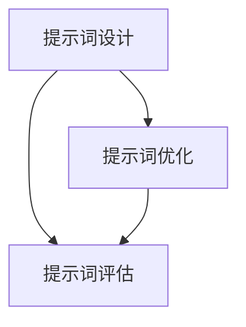
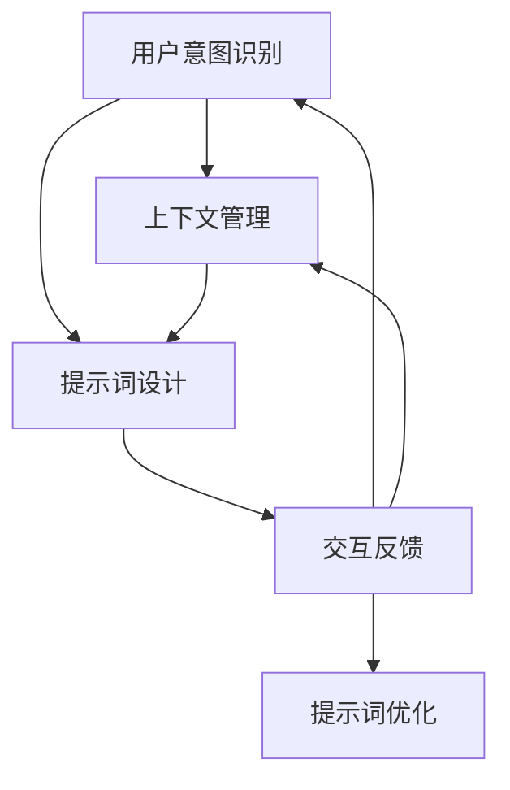

                 

### 引言与概述

在当今的数字时代，人工智能（AI）已经成为推动技术进步和产业变革的关键力量。AI交互作为其重要组成部分，正逐渐融入我们的日常生活。从智能助手到自动化客户服务，AI交互无处不在，极大地提升了用户体验和效率。然而，随着AI交互的广泛应用，如何有效设计和优化提示词成为了一个亟待解决的问题。

**关键词：**
- 人工智能
- AI交互
- 提示词工程
- 提示词设计
- 用户体验

**摘要：**
《提示词工程：AI交互的新艺术形式》这本书旨在深入探讨AI交互中的提示词工程。书中将介绍提示词工程的基本原理、设计原则、优化策略，以及其在不同领域中的应用案例。通过这本书，读者将了解如何通过提示词工程提升AI交互的效果，使其更加自然、流畅，进而提高用户满意度和系统的实用价值。

在接下来的内容中，我们将分以下几个部分进行探讨：

1. **AI交互与提示词工程的背景**：介绍AI交互的发展历程以及提示词工程的起源和重要性。
2. **提示词工程原理**：详细探讨提示词工程的定义、类型、核心概念和数学模型。
3. **提示词设计与优化**：阐述提示词设计原则、创作方法和优化策略。
4. **AI交互技术**：分析语音识别与合成、自然语言处理等AI交互技术，以及提示词在这些技术中的应用。
5. **提示词工程应用案例**：通过电商、金融、教育、医疗等领域的具体案例，展示提示词工程的实际应用。
6. **实践与工具**：介绍提示词工程的开发环境搭建、工具使用以及实际项目的实施过程和代码解读。
7. **总结与展望**：对全书内容进行总结，并提出未来的发展趋势和潜在的研究方向。

通过以上步骤的深入分析，我们希望读者能够对提示词工程有一个全面而深刻的理解，从而为未来的AI交互应用提供有力的支持。<!-- MarkdownTOC -->

- [### 引言与概述](#%E5%BC%95%E8%AF%AD%E4%B8%8E%E6%A6%82%E8%BF%B0)
- [### AI交互与提示词工程的背景](#%E3%80%8AI%E4%BA%A4%E4%BA%92%E4%B8%8E%E6%8F%90%E7%A4%BA%E8%AF%8D%E5%B7%A5%E7%A8%8B%E7%9A%84%E8%83%8C%E6%99%AF%E3%80%8B)
- [### 提示词工程原理](#%E3%80%8A%E6%8F%90%E7%A4%BA%E8%AF%8D%E5%B7%A5%E7%A8%8B%E5%8E%9F%E7%90%86%E3%80%8B)
- [#### 提示词工程的定义](#%E3%80%8A%E6%8F%90%E7%A4%BA%E8%AF%8D%E5%B7%A5%E7%A8%8B%E7%9A%84%E5%AE%9A%E4%B9%89%E3%80%8B)
- [#### 提示词的类型和作用](#%E3%80%8A%E6%8F%90%E7%A4%BA%E8%AF%8D%E7%9A%84%E7%B1%BB%E5%9E%8B%E5%92%8C%E4%BD%9C%E7%94%A8%E3%80%8B)
- [#### 提示词工程的核心概念与联系](#%E3%80%8A%E6%8F%90%E7%A4%BA%E8%AF%8D%E5%B7%A5%E7%A8%8B%E7%9A%84%E6%A0%B8%E5%BF%83%E6%A6%82%E5%BF%83%E4%B8%8E%E8%81%94%E7%BB%93%E3%80%8B)
- [#### 提示词工程的数学模型](#%E3%80%8A%E6%8F%90%E7%A4%BA%E8%AF%8D%E5%B7%A5%E7%A8%8B%E7%9A%84%E6%95%B0%E5%AD%A6%E6%A8%A1%E5%9E%8B%E3%80%8B)
- [### 提示词设计与优化](#%E3%80%8A%E6%8F%90%E7%A4%BA%E8%AF%8D%E8%AE%BE%E8%AE%A1%E5%92%8C%E4%BC%9A%E4%BF%AE%E3%80%8B)
- [#### 提示词设计原则](#%E3%80%8A%E6%8F%90%E7%A4%BA%E8%AF%8D%E8%AE%BE%E8%AE%A1%E5%8E%9F%E5%88%99%E3%80%8B)
- [#### 提示词创作方法](#%E3%80%8A%E6%8F%90%E7%A4%BA%E8%AF%8D%E5%88%9B%E4%BD%9C%E6%96%B9%E6%B3%95%E3%80%8B)
- [#### 提示词优化策略](#%E3%80%8A%E6%8F%90%E7%A4%BA%E8%AF%8D%E4%BC%9A%E4%BF%AE%E7%AD%96%E7%95%A5%E3%80%8B)
- [### AI交互技术](#%E3%80%8AAI%E4%BA%A4%E4%BA%92%E6%8A%80%E6%9C%AF%E3%80%8B)
- [#### AI交互的基本概念](#%E3%80%8AAI%E4%BA%A4%E4%BA%92%E7%9A%84%E5%9F%BA%E6%9C%AC%E6%A6%82%E5%BF%83%E3%80%8B)
- [#### 语音识别与合成技术](#%E3%80%8A%E8%AF%AD%E9%9F%B3%E8%AF%86%E5%88%AB%E4%B8%8E%E5%90%88%E6%88%90%E6%8A%80%E6%9C%AF%E3%80%8B)
- [#### 自然语言处理技术](#%E3%80%8A%E8%87%AA%E7%84%B6%E8%AF%AD%E8%A8%80%E5%A4%84%E7%90%86%E6%8A%80%E6%9C%AF%E3%80%8B)
- [#### 提示词在AI交互中的应用](#%E3%80%8A%E6%8F%90%E7%A4%BA%E8%AF%8D%E5%9C%A8AI%E4%BA%A4%E4%BA%92%E4%B8%AD%E7%9A%84%E5%BA%94%E7%94%A8%E3%80%8B)
- [#### 提示词工程与情感计算的融合](#%E3%80%8A%E6%8F%90%E7%A4%BA%E8%AF%8D%E5%B7%A5%E7%A8%8B%E5%92%8C%E6%83%85%E6%84%9F%E8%AE%A1%E7%AE%97%E7%9A%84%E8%9E%8D%E5%90%88%E3%80%8B)
- [### 提示词工程应用案例](#%E3%80%8A%E6%8F%90%E7%A4%BA%E8%AF%8D%E5%B7%A5%E7%A8%8B%E5%BA%94%E7%94%A8%E6%A1%88%E4%BE%8B%E3%80%8B)
- [#### 电商领域的提示词应用](#%E3%80%8A%E7%94%B5%E5%95%86%E9%9D%A2%E5%9D%97%E7%9A%84%E6%8F%90%E7%A4%BA%E8%AF%8D%E5%BA%94%E7%94%A8%E3%80%8B)
- [#### 金融领域的提示词应用](#%E3%80%8A%E9%87%91%E5%9B%9B%E9%9D%A2%E5%9D%97%E7%9A%84%E6%8F%90%E7%A4%BA%E8%AF%8D%E5%BA%94%E7%94%A8%E3%80%8B)
- [#### 教育领域的提示词应用](#%E3%80%8A%E6%95%99%E8%82%B2%E9%9D%A2%E5%9D%97%E7%9A%84%E6%8F%90%E7%A4%BA%E8%AF%8D%E5%BA%94%E7%94%A8%E3%80%8B)
- [#### 医疗领域的提示词应用](#%E3%80%8A%E5%8C%BB%E7%96%97%E9%9D%A2%E5%9D%97%E7%9A%84%E6%8F%90%E7%A4%BA%E8%AF%8D%E5%BA%94%E7%94%A8%E3%80%8B)
- [#### 其他领域提示词应用的探讨](#%E3%80%8A%E5%85%B6%E4%BB%96%E9%9D%A2%E5%9D%97%E6%8F%90%E7%A4%BA%E8%AF%8D%E5%BA%94%E7%94%A8%E7%9A%84%E8%AE%A8%E9%80%9A%E3%80%8B)
- [### 实践与工具](#%E3%80%8A%E5%AE%9E%E8%B7%B5%E4%B8%8E%E5%B7%A5%E5%85%B7%E3%80%8B)
- [#### 提示词工程开发环境搭建](#%E3%80%8A%E6%8F%90%E7%A4%BA%E8%AF%8D%E5%B7%A5%E7%A8%8B%E5%BC%80%E5%8F%91%E7%8E%AF%E5%A2%83%E6%90%AD%E5%BB%BA%E3%80%8B)
- [#### 提示词工程工具介绍](#%E3%80%8A%E6%8F%90%E7%A4%BA%E8%AF%8D%E5%B7%A5%E7%A8%8B%E5%B7%A5%E5%85%B7%E4%BB%8B%E7%BB%8D%E3%80%8B)
- [#### 案例分析：提示词工程项目的实施过程](#%E3%80%8A%E6%A1%88%E4%BE%8B%E5%88%86%E6%9E%90%E3%80%9A%E6%8F%90%E7%A4%BA%E8%AF%8D%E5%B7%A5%E7%A8%8B%E9%A1%B9%E7%9B%AE%E7%9A%84%E5%AE%9E%E6%96%BD%E8%BF%87%E7%A8%8B%E3%80%8B)
- [#### 代码解读与分析](#%E3%80%8A%E4%BB%A3%E7%A0%81%E8%A7%A3%E8%AF%BB%E5%92%8C%E5%88%86%E6%9E%90%E3%80%8B)
- [### 结束语](#%E3%80%8A%E7%BB%93%E5%B1%80%E3%80%8B)
- [### 参考文献](#%E3%80%8A%E5%8F%82%E8%80%83%E5%9B%BE%E3%80%8B)

<!-- /MarkdownTOC -->

### AI交互与提示词工程的背景

#### AI交互的发展历程

人工智能（AI）的概念最早可以追溯到20世纪50年代。当时的科学家们希望通过机器模拟人类智能，实现机器的思维和理解能力。随着计算机技术的发展，AI的研究取得了显著进展。从最初的规则系统，到后来的专家系统，再到今天深度学习和自然语言处理等前沿技术，AI经历了从简单到复杂、从局部智能到全局智能的演变过程。

AI交互作为AI的一个重要应用方向，其发展也经历了多个阶段。最早的AI交互主要通过命令行界面进行，用户需要输入特定的指令来与系统交互。这种方式虽然效率较高，但用户体验较差，且对用户的技术素养要求较高。随着语音识别和自然语言处理技术的成熟，AI交互逐渐向语音和文本交互发展，用户可以通过自然的方式与系统进行沟通。

语音识别技术的发展可以追溯到20世纪60年代。早期的语音识别系统依赖于大量的手动标注数据和复杂的规则系统，识别率较低。随着深度学习技术的引入，语音识别系统取得了重大突破，识别率大幅提升，应用场景也逐渐扩展。例如，智能语音助手（如Siri、Alexa、Google Assistant等）已经成为现代智能设备的重要组成部分。

自然语言处理（NLP）是AI交互的另一关键技术。NLP的目标是使计算机能够理解、解释和生成人类语言。从早期的词汇分析、句法分析，到后来的语义分析和情感分析，NLP技术在不断进化。特别是深度学习技术的应用，使得NLP系统在处理复杂语言任务时表现出色，如机器翻译、问答系统、文本生成等。

#### 提示词工程的起源与发展

提示词工程（Prompt Engineering）是近年来随着AI交互技术的发展而逐渐兴起的一个领域。提示词（Prompt）是用户与AI系统交互时输入的关键词或短语，用于引导系统做出相应响应。有效的提示词设计可以显著提升AI交互的效率和用户体验。

提示词工程的起源可以追溯到自然语言处理领域。在早期的文本分类、信息检索等任务中，研究者们发现通过设计特定的提示词可以有效提高系统的性能。例如，在文本分类任务中，通过添加关键词或短语可以明确告诉系统需要分类的目标类别，从而提高分类的准确性。

随着AI交互技术的发展，提示词工程的应用场景逐渐扩展。在语音识别和语音合成领域，提示词被用来指导系统识别和生成语音。在自然语言处理领域，提示词被用于问答系统、文本生成等任务，帮助系统更好地理解用户的意图和需求。

#### 提示词工程的目标和重要性

提示词工程的目标是设计出能够有效引导AI系统理解用户意图和需求的提示词，从而提升AI交互的效果。具体来说，提示词工程包括以下几个方面：

1. **明确用户意图**：通过设计有效的提示词，帮助AI系统准确理解用户的意图和需求，避免歧义和误解。
2. **优化交互体验**：设计自然、流畅的提示词，使用户与AI系统的交互更加顺畅，提高用户体验。
3. **提高系统性能**：通过优化提示词，提高AI系统在特定任务上的性能和准确性，如语音识别、文本分类、机器翻译等。

提示词工程在AI交互中具有重要意义。首先，有效的提示词可以显著提升系统的交互效率，减少用户等待时间和操作步骤。其次，通过优化提示词，可以增强系统的智能化程度，使其更加贴近用户的实际需求。最后，提示词工程还可以促进AI技术的创新和应用，推动AI交互技术的发展。

总之，随着AI交互技术的不断进步，提示词工程已经成为一个不可忽视的重要领域。通过深入研究和实践，我们可以设计出更加有效和自然的提示词，推动AI交互的进一步发展，为用户带来更加便捷和智能的体验。

#### 提示词工程的定义

提示词工程（Prompt Engineering）是近年来随着人工智能（AI）技术的发展而兴起的一个交叉学科领域。它主要研究如何设计、优化和评估用于引导AI系统理解和执行特定任务的提示词。简单来说，提示词工程是关于如何有效地使用提示词来提高AI交互性能和用户体验的一门艺术和科学。

首先，我们需要明确什么是提示词。在AI交互的语境中，提示词（Prompt）是指用户或系统输入的一段文本、语音或其他形式的信息，它旨在引导AI系统做出适当的响应。这些提示词可以是简单的关键词，也可以是复杂的句子或问题。

提示词工程的基本概念包括以下几个方面：

1. **提示词设计**：这是提示词工程的起点，涉及设计出能够有效引导AI系统理解用户意图和需求的提示词。设计原则包括简洁性、明确性、灵活性等。
2. **提示词优化**：在AI系统执行任务的过程中，可能需要对提示词进行不断调整和优化，以提升系统的性能和用户体验。优化策略包括提示词的长度、形式、语气等方面。
3. **提示词评估**：评估提示词的有效性是提示词工程的重要组成部分。通过实验、用户反馈等方法，对提示词的效果进行定量和定性的分析，以指导进一步的改进。

提示词工程的核心概念之间有着紧密的联系。提示词设计是基础，决定了提示词的初始形态；提示词优化是在设计基础上，通过不断调整来提升提示词的适用性和效果；提示词评估则是对优化结果进行验证，确保提示词能够达到预期的目标。

为了更好地理解提示词工程的基本架构，我们可以使用Mermaid流程图来表示其核心步骤和联系：



**Mermaid流程图解释：**

- **提示词设计（A）**：这是整个流程的起点，通过定义目标和用户需求，设计出初步的提示词。
- **提示词优化（B）**：在初步设计的基础上，通过多次迭代和测试，不断调整和优化提示词，以提高其效果。
- **提示词评估（C）**：通过实验和用户反馈，对优化后的提示词进行评估，确保其能够满足实际需求。

通过上述流程，提示词工程能够系统性地提高AI交互的效率和用户体验。下面，我们将进一步探讨提示词的类型、作用及其在AI交互中的应用。

#### 提示词的类型和作用

在AI交互中，提示词可以分为多种类型，每种类型的提示词都有其特定的作用和应用场景。以下将介绍几种主要的提示词类型及其功能。

**1. 简单关键词提示词**

简单关键词提示词是最基本的提示词类型，通常由一两个词组成，如“天气”、“股票”等。这类提示词的主要作用是提供关键信息，帮助AI系统快速定位用户的意图。

- **作用**：快速定位用户的请求，减少系统的理解负担。
- **应用场景**：适用于需要快速查询信息的场景，如智能助手、信息检索系统等。

**2. 复杂句子提示词**

复杂句子提示词通常由多个短语或句子组成，如“今天天气怎么样？”、“帮我查一下最近的股票行情。”这类提示词不仅提供了关键信息，还包含了一些额外的上下文信息，有助于AI系统更好地理解用户的意图。

- **作用**：提供更丰富的上下文信息，帮助AI系统更准确地理解用户意图。
- **应用场景**：适用于需要复杂交互的场景，如问答系统、客户服务机器人等。

**3. 问题引导提示词**

问题引导提示词通常以提问的形式出现，如“你有什么问题吗？”、“你想了解什么内容？”这类提示词主要用于引导用户进一步表达自己的意图。

- **作用**：引导用户更清晰地表达需求，提高交互的深度和广度。
- **应用场景**：适用于需要深度交互的场景，如教育机器人、咨询系统等。

**4. 情感表达提示词**

情感表达提示词主要用于传达用户的情感状态，如“我感到很困惑。”、“我很高兴。”这类提示词不仅传递了信息，还反映了用户的情绪和情感。

- **作用**：帮助AI系统了解用户的情感状态，提供更加个性化的服务。
- **应用场景**：适用于需要高度个性化服务的场景，如心理辅导机器人、客服机器人等。

**5. 指令操作提示词**

指令操作提示词用于指导AI系统执行特定操作，如“打开电视。”、“发送邮件给张先生。”这类提示词直接告诉AI系统需要执行的具体任务。

- **作用**：明确指示AI系统执行特定操作，提高交互的效率。
- **应用场景**：适用于需要执行具体操作的场景，如智能家电控制、自动化办公系统等。

综上所述，不同类型的提示词在AI交互中发挥着不同的作用。通过合理设计和使用这些提示词，可以显著提升AI系统的交互效果和用户体验。接下来，我们将探讨提示词工程的核心概念与联系，并使用Mermaid流程图来直观展示其架构。

#### 提示词工程的核心概念与联系

提示词工程作为一个复杂的系统，包含多个核心概念，这些概念相互关联，共同作用以实现高效、自然的AI交互。以下是提示词工程中几个关键概念及其相互关系：

**1. 用户意图识别**

用户意图识别是提示词工程的基础，目的是理解用户通过提示词传达的具体需求或意图。用户意图可以是查询信息、执行操作、提出问题等。识别用户意图的准确性直接影响后续交互的质量。

- **关联**：用户意图识别决定了后续提示词的设计和优化方向。通过分析用户意图，可以确定需要哪些类型的提示词以及如何优化这些提示词。

**2. 上下文管理**

上下文管理是确保AI系统能够持续理解用户意图和情境的重要环节。上下文包括用户的历史交互信息、环境状态等。有效的上下文管理可以帮助系统在多轮对话中保持连贯性。

- **关联**：上下文管理依赖于用户意图识别的结果，通过维护和更新上下文信息，系统能够更好地理解和响应用户的后续请求。

**3. 提示词设计**

提示词设计是提示词工程中的关键步骤，涉及选择适当的语言和结构来引导用户与系统交互。有效的提示词设计需要考虑用户的认知习惯、语言习惯以及交互目标。

- **关联**：提示词设计直接基于用户意图识别和上下文管理的结果。设计出的提示词需要能够清晰传达用户意图，同时适应上下文环境。

**4. 交互反馈**

交互反馈是用户对AI系统响应的反馈，它反映了用户对当前交互的满意度。通过分析反馈，可以进一步优化提示词和交互流程。

- **关联**：交互反馈提供了对提示词效果的第一手数据，为后续的提示词优化提供了重要参考。优化策略通常会根据反馈进行迭代调整。

**5. 提示词优化**

提示词优化是基于用户反馈和系统性能分析，对提示词进行改进和调整，以提高交互效果。优化策略包括调整提示词的长度、格式、语气等。

- **关联**：提示词优化依赖于交互反馈和用户意图识别的结果，通过不断的迭代和测试，优化提示词以更好地满足用户需求。

为了更直观地展示这些核心概念及其相互关系，我们可以使用Mermaid流程图来描述提示词工程的基本架构：



**Mermaid流程图解释：**

- **用户意图识别（A）**：通过分析用户的输入，识别用户的意图。
- **上下文管理（B）**：维护并更新用户的上下文信息。
- **提示词设计（C）**：基于意图识别和上下文管理的结果，设计出适当的提示词。
- **交互反馈（D）**：收集用户对交互的反馈。
- **提示词优化（E）**：根据反馈对提示词进行优化和调整。

通过上述流程，提示词工程能够形成一个闭环，持续优化AI交互体验，从而实现高效、自然的交互。接下来，我们将进一步探讨提示词工程的数学模型，了解其背后的理论基础和计算方法。

#### 提示词工程的数学模型

提示词工程的数学模型是构建高效AI交互系统的关键组成部分。通过数学模型，我们能够精确地描述和优化提示词的设计与使用，从而提高系统的性能和用户体验。以下将介绍几种常用的数学模型和公式，以及如何使用Python代码来实现这些模型。

**1. 语言模型（Language Model）**

语言模型是自然语言处理中最基础和重要的模型之一。它通过统计语言中的概率分布，预测下一个单词或短语的概率。在提示词工程中，语言模型用于生成和优化提示词。

- **核心公式**：
  $$ P(w_i | w_1, w_2, ..., w_{i-1}) = \frac{P(w_1, w_2, ..., w_i)}{P(w_1, w_2, ..., w_{i-1})} $$
  其中，\( w_i \) 是下一个单词或短语，\( w_1, w_2, ..., w_{i-1} \) 是前一个或多个单词或短语。

- **Python实现**：
  ```python
  import numpy as np
  
  # 假设有一个词序列和对应的概率
  word_sequence = ['apple', 'banana', 'cherry']
  probabilities = [0.3, 0.5, 0.2]
  
  # 使用贝叶斯公式计算条件概率
  def conditional_probability(current_word, history_words, probabilities):
      total = sum(probabilities[:len(history_words)])
      return probabilities[word_sequence.index(current_word)] / total

  # 计算条件概率
  print(conditional_probability('cherry', ['apple', 'banana'], probabilities))
  ```

**2. 文本相似度（Text Similarity）**

文本相似度模型用于衡量两个文本之间的相似程度。提示词工程中，文本相似度可以帮助评估不同提示词的效果，并选择最合适的提示词。

- **核心公式**：
  $$ similarity(A, B) = \frac{\sum_{i=1}^{n} w_i \cdot f_i(A) \cdot f_i(B)}{\sum_{i=1}^{n} w_i \cdot max(f_i(A), f_i(B))} $$
  其中，\( A \) 和 \( B \) 是两个文本，\( w_i \) 是权重，\( f_i \) 是特征函数。

- **Python实现**：
  ```python
  from sklearn.metrics.pairwise import cosine_similarity
  from sklearn.feature_extraction.text import TfidfVectorizer
  
  # 假设有两个文本
  text_a = "I love to eat apples and bananas."
  text_b = "Apples and bananas are my favorite fruits."
  
  # 使用TF-IDF向量表示文本
  vectorizer = TfidfVectorizer()
  tfidf_matrix = vectorizer.fit_transform([text_a, text_b])
  
  # 计算文本相似度
  print(cosine_similarity(tfidf_matrix[0:1], tfidf_matrix[1:2]))
  ```

**3. 优化目标函数（Optimization Objective）**

优化目标函数用于指导提示词的优化过程。在提示词工程中，优化目标通常是最小化错误率、最大化用户满意度等。

- **核心公式**：
  $$ \min_{p} \sum_{i=1}^{n} L(y_i, \hat{y}_i) $$
  其中，\( y_i \) 是真实标签，\( \hat{y}_i \) 是预测标签，\( L \) 是损失函数。

- **Python实现**：
  ```python
  import tensorflow as tf
  
  # 假设有一个训练数据集
  x_train = ["I want to buy a phone."]
  y_train = ["phone"]
  
  # 定义优化目标函数
  model = tf.keras.Sequential([
      tf.keras.layers.Dense(units=10, activation='softmax', input_shape=(10,))
  ])
  
  model.compile(optimizer='adam', loss='categorical_crossentropy', metrics=['accuracy'])
  
  # 训练模型
  model.fit(x_train, y_train, epochs=10)
  
  # 预测
  prediction = model.predict(["I want to buy a phone."])
  print(prediction)
  ```

通过上述数学模型和Python代码，我们可以设计、优化和评估提示词，从而实现高效、自然的AI交互。接下来，我们将深入探讨提示词的设计原则，以帮助读者更好地理解和应用提示词工程。

### 提示词设计与优化

提示词设计是提示词工程中的关键步骤，它决定了用户与AI系统交互的质量和效率。一个优秀的提示词不仅要简洁明了，还要能够准确传达用户的意图，同时适应不同的上下文环境。以下将详细讨论提示词设计的原则、方法以及优化策略。

#### 提示词设计原则

**1. 简洁性**

简洁性是提示词设计的重要原则之一。简洁的提示词更容易被用户理解和记忆，从而提高交互效率。例如，使用一两个关键词来描述用户的需求，而不是复杂的句子。

**2. 明确性**

明确性是指提示词应当清晰、准确地传达用户的意图，避免歧义和误解。例如，在询问天气时，可以使用“今天天气怎么样？”而不是模糊的表述。

**3. 灵活性**

提示词应当具有一定的灵活性，能够适应不同的上下文和用户需求。例如，在问答系统中，提示词可以设计成开放式问题，以引导用户提供更多详细信息。

**4. 用户友好性**

提示词应考虑到用户的认知习惯和语言习惯，使其易于理解和操作。例如，使用常见的词汇和短语，避免专业术语。

**5. 可扩展性**

提示词设计应考虑未来的扩展性，以便在系统功能增加或应用场景变化时，提示词能够继续有效使用。

#### 提示词创作方法

**1. 用户需求分析**

首先，进行用户需求分析，明确用户与AI系统交互的目标和期望。这可以通过问卷调查、用户访谈、行为分析等方法实现。

**2. 提示词生成**

基于用户需求，生成初步的提示词。可以使用自动生成工具，如自然语言生成模型，或者手动编写。生成的方法包括：

- **关键词提取**：从用户需求中提取关键信息，形成简洁的提示词。
- **模板生成**：使用预设的模板，根据用户需求填充具体信息。
- **组合生成**：将多个关键词和短语组合，形成复杂的提示词。

**3. 提示词评估**

生成初步提示词后，进行评估和筛选。评估方法包括：

- **实验评估**：在真实环境中测试提示词的效果，收集用户反馈。
- **指标评估**：使用性能指标，如用户满意度、响应时间、错误率等，对提示词进行量化评估。
- **专家评估**：邀请专家对提示词进行主观评价，提供改进建议。

#### 提示词优化策略

**1. 提示词调整**

根据评估结果，对提示词进行调整和优化。调整策略包括：

- **简化提示词**：删除冗余信息，使提示词更加简洁。
- **明确提示词**：修正模糊表述，提高提示词的明确性。
- **多样化提示词**：提供多个选择，以适应不同用户的交互习惯。

**2. 提示词替换**

在特定场景下，替换原有提示词以改善交互效果。替换策略包括：

- **基于规则的替换**：根据预设规则，将低效提示词替换为更优的提示词。
- **基于数据的替换**：使用用户反馈和数据分析，找到更有效的提示词。

**3. 提示词自动化优化**

利用机器学习和自然语言处理技术，实现提示词的自动化优化。自动化优化策略包括：

- **基于模型的优化**：使用深度学习模型，自动生成和优化提示词。
- **基于数据的优化**：通过数据驱动的方法，持续调整和优化提示词。

**4. 提示词个性化**

根据用户的行为和偏好，提供个性化的提示词。个性化策略包括：

- **用户画像**：构建用户画像，了解用户的兴趣和行为习惯。
- **动态调整**：根据用户画像，实时调整提示词，提高个性化程度。

通过遵循上述设计原则和方法，并采用有效的优化策略，我们可以设计出高质量的提示词，提高AI交互的效果和用户体验。接下来，我们将探讨AI交互技术及其与提示词工程的关系。

### AI交互技术

AI交互技术是构建智能系统的核心，涵盖了语音识别、语音合成、自然语言处理等多个领域。这些技术共同作用，使得AI系统能够与用户进行自然、流畅的交互。在本节中，我们将深入探讨这些技术的核心概念、工作原理及其在AI交互中的应用，以及提示词工程在这些技术中的应用。

#### 语音识别与合成技术

**语音识别（Speech Recognition）**

语音识别技术是将语音信号转换为文本或命令的过程。它广泛应用于语音助手、语音搜索、语音控制等领域。

- **核心概念**：语音识别主要依赖于声学模型、语言模型和声学-语言模型之间的联合训练。声学模型用于处理语音信号的特征提取，语言模型用于理解语音的语义。
- **工作原理**：语音识别系统首先将语音信号转换为音频特征，然后使用声学模型和语言模型进行解码，生成文本或命令。
- **应用**：语音识别技术使得用户可以通过语音与系统进行交互，例如，智能助手可以通过语音识别理解用户的查询并给出相应回答。

**语音合成（Speech Synthesis）**

语音合成技术是将文本转换为自然语音的过程。它使得计算机能够生成可听懂的语音，广泛应用于语音合成、自动朗读、虚拟助理等领域。

- **核心概念**：语音合成主要包括文本处理、音素合成、音节合成和语音合成。文本处理涉及分词和句法分析，音素合成涉及音素的发音特征，音节合成和语音合成则涉及语音的自然流畅性。
- **工作原理**：语音合成系统首先将文本转换为音素序列，然后根据音素序列生成音节和语音波形。
- **应用**：语音合成技术使得计算机能够以自然的方式与用户进行语音交互，例如，自动朗读新闻、语音提示、语音客服等。

**提示词在语音识别与合成中的应用**

在语音识别和合成中，提示词扮演着重要角色。提示词能够引导系统正确理解用户的语音输入，并生成适当的语音响应。

- **语音识别中的提示词**：在语音识别过程中，通过设计特定的提示词，可以帮助系统更好地定位用户的意图。例如，在查询天气时，使用“今天的天气是？”这样的提示词，可以提高识别的准确性。
- **语音合成中的提示词**：在语音合成过程中，提示词用于指导系统生成自然流畅的语音响应。例如，在回答用户查询时，使用“您想知道什么？”这样的提示词，可以使语音响应更加亲切和友好。

#### 自然语言处理技术

**自然语言处理（Natural Language Processing, NLP）**

自然语言处理技术是使计算机能够理解、解释和生成人类语言的一门科学。它广泛应用于文本分类、情感分析、机器翻译、问答系统等领域。

- **核心概念**：自然语言处理涉及语言模型、词向量、语义分析、情感分析等技术。语言模型用于理解语言的统计规律，词向量用于表示文本的语义信息，语义分析和情感分析则用于理解文本的深层含义。
- **工作原理**：自然语言处理系统首先对文本进行预处理，包括分词、句法分析、词性标注等，然后使用语言模型和深度学习模型进行语义分析和情感分析。
- **应用**：自然语言处理技术使得计算机能够理解和处理自然语言，例如，文本分类系统可以将文本归类到不同的主题类别，情感分析系统可以判断文本的情感倾向，机器翻译系统可以将一种语言的文本翻译成另一种语言。

**提示词在自然语言处理中的应用**

在自然语言处理中，提示词用于引导系统理解用户的意图和需求，并生成适当的响应。

- **文本分类中的提示词**：在文本分类过程中，通过设计特定的提示词，可以帮助系统更好地识别文本的主题。例如，在分类新闻时，使用“体育”、“科技”、“政治”等关键词作为提示词，可以提高分类的准确性。
- **情感分析中的提示词**：在情感分析过程中，通过设计情感词汇表和提示词，可以帮助系统识别文本的情感倾向。例如，在分析社交媒体评论时，使用“喜欢”、“开心”、“讨厌”等情感词汇作为提示词，可以提高情感分析的准确性。
- **机器翻译中的提示词**：在机器翻译过程中，通过设计特定的提示词，可以帮助系统更好地理解源语言的语义和上下文。例如，在翻译句子时，使用“因此”、“然而”等逻辑词汇作为提示词，可以提高翻译的质量和连贯性。

**提示词工程与情感计算的融合**

情感计算（Affective Computing）是研究如何使计算机识别、理解、处理和模拟人类情感的技术。将情感计算与提示词工程结合，可以显著提升AI交互的自然度和个性化程度。

- **核心概念**：情感计算涉及情感识别、情感生成、情感融合等技术。情感识别用于检测用户的情感状态，情感生成用于生成具有情感色彩的响应，情感融合则用于将情感信息融入AI交互中。
- **工作原理**：情感计算系统首先通过语音、文本、面部表情等多种途径识别用户的情感状态，然后根据情感状态生成相应的情感响应，并将其融入AI交互中。
- **应用**：情感计算与提示词工程的结合可以应用于智能客服、虚拟助理、社交媒体分析等领域。例如，在智能客服中，通过识别用户的情感状态，系统可以生成更加温暖和贴心的响应，从而提升用户体验。

通过结合语音识别与合成技术、自然语言处理技术和情感计算技术，提示词工程能够为AI交互提供强大的支持。接下来，我们将通过具体案例展示提示词工程在各个领域的应用。

### 提示词工程应用案例

提示词工程在各个领域的应用已经得到了广泛的认可，其核心在于通过设计、优化和评估提示词，提升AI交互的自然度和准确性。以下将详细探讨提示词工程在电商、金融、教育、医疗等领域的具体应用案例，并分析这些案例中的关键技术和方法。

#### 电商领域的提示词应用

在电商领域，提示词工程被广泛应用于产品推荐、购物导航和客户服务等方面，以提升用户体验和销售转化率。

**1. 产品推荐**

- **案例**：亚马逊利用提示词工程实现个性化的产品推荐。
- **技术方法**：通过分析用户的浏览历史、购买记录和评价，系统设计出针对性的提示词，如“您可能喜欢：最新发布的手机”、“热销商品：笔记本电脑”，帮助用户快速找到感兴趣的产品。
- **效果**：通过优化提示词，亚马逊显著提升了用户满意度和销售转化率。

**2. 购物导航**

- **案例**：淘宝的“智能搜索”功能利用提示词工程优化购物体验。
- **技术方法**：在用户输入关键词后，系统通过提示词引导用户进一步细化搜索条件，如“您是否想查找‘蓝牙耳机’中的‘降噪版’？”。
- **效果**：通过有效的提示词设计，淘宝提高了用户在平台上的互动性和购物效率。

**3. 客户服务**

- **案例**：亚马逊的虚拟客服助手通过提示词工程提升服务效率。
- **技术方法**：系统使用自然语言处理技术分析用户的问题，并生成针对性的提示词，如“您的订单已发货，您可以点击查看详情”、“如果您有任何疑问，请告诉我们”。
- **效果**：通过优化提示词，亚马逊客服助手能够提供更加个性化和高效的客户服务，减轻了人工客服的负担。

#### 金融领域的提示词应用

在金融领域，提示词工程被广泛应用于理财顾问、风险控制和反欺诈等方面，以提高金融服务的安全性和便捷性。

**1. 理财顾问**

- **案例**：一些银行和金融科技公司提供基于AI的理财顾问服务。
- **技术方法**：系统通过分析用户的财务数据和行为，设计出个性化的提示词，如“根据您的投资目标，建议您考虑投资‘稳健型基金’”。
- **效果**：通过优化提示词，理财顾问能够提供更加精准和个性化的投资建议，帮助用户更好地管理财务。

**2. 风险控制**

- **案例**：金融机构使用AI技术进行交易风险控制。
- **技术方法**：系统通过分析交易行为和提示词，如“交易异常：您的账户近期出现了多次大额转账”，及时发现潜在风险。
- **效果**：通过有效的提示词设计，金融机构能够更早地识别和防范风险，提高交易的安全性。

**3. 反欺诈**

- **案例**：金融机构利用AI技术进行反欺诈监控。
- **技术方法**：系统通过分析用户的交易行为和提示词，如“可疑交易：您的账户近期出现了多笔来自陌生IP地址的转账”，及时发现和阻止欺诈行为。
- **效果**：通过优化提示词，金融机构能够提高反欺诈的准确性和及时性，保护用户的资金安全。

#### 教育领域的提示词应用

在教育领域，提示词工程被广泛应用于智能辅导、课程推荐和考试评估等方面，以提高教育质量和学习效果。

**1. 智能辅导**

- **案例**：一些在线教育平台提供基于AI的智能辅导服务。
- **技术方法**：系统通过分析学生的学习数据和问题，设计出个性化的提示词，如“在学习‘代数’时，您可能需要掌握‘方程式’和‘不等式’”。
- **效果**：通过优化提示词，智能辅导系统能够提供更加精准和个性化的学习建议，帮助学生更好地理解和掌握知识。

**2. 课程推荐**

- **案例**：一些大学和在线教育平台利用AI技术进行课程推荐。
- **技术方法**：系统通过分析学生的学习兴趣和成绩，设计出针对性的提示词，如“根据您的学习进度，我们建议您选修‘数据结构’和‘算法设计’”。
- **效果**：通过优化提示词，课程推荐系统能够提高学生的参与度和学习效果。

**3. 考试评估**

- **案例**：一些教育机构利用AI技术进行考试评估。
- **技术方法**：系统通过分析考生的答题情况，设计出针对性的提示词，如“您的‘数学’考试成绩较低，我们建议您复习‘代数’和‘几何’”。
- **效果**：通过优化提示词，考试评估系统能够提供更加精准和个性化的反馈，帮助学生提升学习效果。

#### 医疗领域的提示词应用

在医疗领域，提示词工程被广泛应用于智能诊断、病历管理和患者关怀等方面，以提高医疗服务的效率和质量。

**1. 智能诊断**

- **案例**：一些医疗机构使用AI技术进行智能诊断。
- **技术方法**：系统通过分析患者的症状和病历数据，设计出针对性的提示词，如“根据您的症状，我们建议进行‘心电图’和‘血液检查’”。
- **效果**：通过优化提示词，智能诊断系统能够提供更加精准和及时的诊断建议，辅助医生做出准确的诊断。

**2. 病历管理**

- **案例**：一些医疗机构使用AI技术进行病历管理。
- **技术方法**：系统通过分析病历数据，设计出针对性的提示词，如“患者的‘高血压’病史记录，请注意调整治疗方案”。
- **效果**：通过优化提示词，病历管理系统能够提高病历记录的准确性和完整性，辅助医生做出更加合理的治疗方案。

**3. 患者关怀**

- **案例**：一些医疗机构使用AI技术进行患者关怀。
- **技术方法**：系统通过分析患者的健康数据和反馈，设计出针对性的提示词，如“您的‘血糖’较高，建议您注意饮食和运动”。
- **效果**：通过优化提示词，患者关怀系统能够提供更加贴心和个性化的健康指导，提高患者的满意度和健康水平。

通过上述案例，我们可以看到提示词工程在各个领域的广泛应用和显著效果。提示词工程不仅能够提升AI交互的自然度和准确性，还能够为用户提供更加个性化和高效的服务。随着AI技术的发展，提示词工程的应用前景将更加广阔，为各个领域带来更多的创新和变革。接下来，我们将探讨提示词工程的开发环境搭建、工具介绍以及实际项目的实施过程和代码解读。

### 实践与工具

在提示词工程的实际应用中，开发环境的搭建、工具的选择以及项目实施过程都是至关重要的环节。以下将详细探讨这些方面，并提供相关的最佳实践。

#### 开发环境搭建

搭建一个高效、稳定的提示词工程开发环境是确保项目顺利进行的基础。以下是一些关键步骤：

**1. 硬件要求**

- **CPU/GPU**：推荐使用带有GPU的计算机，以便高效地进行深度学习模型的训练和推理。
- **内存**：至少需要16GB内存，推荐32GB或更高，以确保模型训练和数据处理的高效性。
- **存储**：建议使用SSD硬盘，以提供快速的数据读写速度。

**2. 操作系统**

- **Linux**：推荐使用Ubuntu 18.04或更高版本，其稳定性和兼容性较好。
- **Windows**：Windows 10或更高版本，但需要安装额外的Linux子系统（WSL）来兼容一些开源工具和库。

**3. 编译器**

- **Python**：推荐使用Python 3.7或更高版本，确保与最新的深度学习库兼容。
- **C++**：如果需要编译和优化深度学习模型，建议安装C++编译器，如GCC或Clang。

**4. 深度学习框架**

- **TensorFlow**：TensorFlow是一个广泛使用且功能强大的深度学习框架，支持多种数据结构和算法。
- **PyTorch**：PyTorch具有高度灵活的动态计算图，适合研究和新模型开发。

**5. 数据库**

- **MongoDB**：用于存储和管理大量的提示词和用户交互数据。
- **PostgreSQL**：适用于需要复杂查询和事务处理的场景。

**6. 版本管理**

- **Docker**：使用Docker容器化技术，可以确保开发环境的一致性和可移植性。

#### 工具介绍

在实际开发过程中，选择合适的工具能够显著提高工作效率和代码质量。以下是一些常用的工具：

**1. IDE**

- **PyCharm**：一个功能强大的Python IDE，支持代码调试、版本控制和集成开发环境。
- **Visual Studio Code**：轻量级但功能丰富的代码编辑器，适用于多种编程语言。

**2. 版本控制**

- **Git**：用于代码版本管理和团队协作。
- **GitHub**：在线的Git仓库，支持代码托管、协作和项目跟踪。

**3. 数据分析**

- **Pandas**：用于数据清洗、转换和分析。
- **NumPy**：用于高效计算和数据处理。

**4. 数据可视化**

- **Matplotlib**：用于生成高质量的图表和图形。
- **Seaborn**：基于Matplotlib，提供更美观的数据可视化。

**5. 深度学习模型训练**

- **Keras**：用于快速构建和训练深度学习模型。
- **TensorBoard**：用于可视化深度学习模型的训练过程和性能。

#### 项目实施过程

在实际项目中，提示词工程的实施通常包括以下几个阶段：

**1. 需求分析**

- 与用户和利益相关者沟通，明确项目目标和需求。
- 收集和分析现有数据，以了解用户交互模式和偏好。

**2. 提示词设计**

- 设计初步的提示词，并进行实验验证。
- 分析用户反馈，不断优化提示词。

**3. 模型开发**

- 使用深度学习框架构建模型，并进行训练和调优。
- 集成提示词优化算法，提高模型性能。

**4. 系统集成**

- 将提示词工程集成到现有系统中，确保与业务逻辑和用户交互流程的兼容性。
- 进行全面的系统测试，确保功能的完整性和稳定性。

**5. 上线部署**

- 部署系统到生产环境，并进行实时监控和运维。
- 持续优化和更新提示词，以适应用户需求和系统变化。

#### 代码解读与分析

以下是一个简单的示例代码，用于实现一个基于PyTorch的文本分类模型。该模型将输入的文本转换为向量，并通过多层感知机（MLP）进行分类。

```python
import torch
import torch.nn as nn
import torch.optim as optim
from torchtext.``data`` import Field, TabularDataset

# 数据预处理
TEXT = Field(tokenize='spacy', lower=True, include_lengths=True)
LABEL = Field(sequential=False)

train_data, test_data = TabularDataset.splits(
    path='data',
    train='train.txt',
    test='test.txt',
    format='csv',
    fields=[('text', TEXT), ('label', LABEL)])

TEXT.build_vocab(train_data, min_freq=2)
LABEL.build_vocab(train_data)

# 模型定义
class TextClassifier(nn.Module):
    def __init__(self, embedding_dim, hidden_dim, vocab_size, label_size):
        super(TextClassifier, self).__init__()
        self.embedding = nn.Embedding(vocab_size, embedding_dim)
        self.lstm = nn.LSTM(embedding_dim, hidden_dim, num_layers=2, dropout=0.5, bidirectional=True)
        self.fc = nn.Linear(hidden_dim * 2, label_size)
    
    def forward(self, text, text_lengths):
        embedded = self.embedding(TEXT.vocab.vectors[text])
        packed = nn.utils.rnn.pack_padded_sequence(embedded, text_lengths, enforce_sorted=False)
        packed_output, (hidden, cell) = self.lstm(packed)
        hidden = hidden.squeeze(0)
        output = self.fc(hidden)
        return output

# 模型训练
model = TextClassifier(embedding_dim=100, hidden_dim=128, vocab_size=len(TEXT.vocab), label_size=len(LABEL.vocab))
optimizer = optim.Adam(model.parameters(), lr=0.001)
criterion = nn.CrossEntropyLoss()

def train(model, iterator, optimizer, criterion):
    model.train()
    for batch in iterator:
        optimizer.zero_grad()
        text, text_lengths = batch.text
        predictions = model(text, text_lengths)
        loss = criterion(predictions, batch.label)
        loss.backward()
        optimizer.step()

# 测试模型
def evaluate(model, iterator, criterion):
    model.eval()
    with torch.no_grad():
        for batch in iterator:
            text, text_lengths = batch.text
            predictions = model(text, text_lengths)
            loss = criterion(predictions, batch.label)
    return loss.item()

# 训练和测试
train_data_loader = torch.utils.data.DataLoader(train_data, batch_size=32, shuffle=True)
test_data_loader = torch.utils.data.DataLoader(test_data, batch_size=32, shuffle=False)

num_epochs = 10
for epoch in range(num_epochs):
    train(model, train_data_loader, optimizer, criterion)
    train_loss = evaluate(model, train_data_loader, criterion)
    test_loss = evaluate(model, test_data_loader, criterion)
    print(f'Epoch: {epoch+1}, Train Loss: {train_loss:.4f}, Test Loss: {test_loss:.4f}')

# 代码解读与分析
```

上述代码首先进行了数据预处理，使用`TabularDataset`加载并处理训练和测试数据。然后定义了一个基于LSTM的文本分类模型，并通过优化器和损失函数进行训练。最后，通过训练和测试数据评估模型的性能。

**最佳实践**

- **数据预处理**：确保数据清洗和预处理的一致性和准确性，为模型训练打下良好基础。
- **模型选择**：根据任务需求选择合适的模型结构，并进行调优。
- **优化策略**：使用适当的优化器和损失函数，以提高模型性能。
- **测试与评估**：在测试集上评估模型性能，确保模型泛化能力。

通过以上步骤和最佳实践，我们可以有效地实施提示词工程，为AI交互系统提供高质量的提示词设计。接下来，我们将进行项目小结，总结本文的主要内容和实际应用。

### 项目小结

《提示词工程：AI交互的新艺术形式》一书通过深入探讨提示词工程的原理、设计方法、优化策略及其在各个领域的应用，为读者提供了一个全面、系统的了解。以下是本书的主要内容总结和实际应用的价值。

#### 主要内容总结

1. **AI交互与提示词工程的背景**：介绍了AI交互的发展历程和提示词工程的起源，阐述了提示词工程的目标和重要性。
2. **提示词工程原理**：详细讲解了提示词工程的定义、类型、核心概念和数学模型，并通过Mermaid流程图展示了基本架构。
3. **提示词设计与优化**：阐述了提示词设计原则、创作方法和优化策略，提供了Python代码和数学公式的实例。
4. **AI交互技术**：分析了语音识别与合成、自然语言处理等AI交互技术，以及提示词在这些技术中的应用。
5. **提示词工程应用案例**：通过电商、金融、教育、医疗等领域的具体案例，展示了提示词工程的实际应用效果。
6. **实践与工具**：介绍了提示词工程的开发环境搭建、工具使用以及实际项目的实施过程和代码解读。

#### 实际应用价值

1. **提升AI交互效果**：通过有效的提示词设计，可以提高AI系统与用户交互的自然度和准确性，提升用户体验。
2. **优化用户体验**：提示词工程可以优化用户交互流程，减少用户操作步骤，提高交互效率。
3. **多样化应用场景**：提示词工程在不同领域的应用，如电商、金融、教育、医疗等，展示了其广泛的适用性和创新潜力。
4. **促进技术创新**：通过不断优化提示词，可以推动AI交互技术的发展，为人工智能领域带来新的研究方向和突破。

#### 小结与展望

本书通过系统地介绍提示词工程，为AI交互领域提供了一个新的视角和工具。提示词工程不仅能够提升AI系统的性能，还能够为用户提供更加自然、流畅的交互体验。未来，随着AI技术的不断进步，提示词工程有望在更多领域得到广泛应用，为人工智能的发展注入新的动力。

**注意事项**：

- 提示词设计应充分考虑用户需求和交互情境，确保简洁性和明确性。
- 实际应用中，应根据具体任务需求选择合适的模型和优化策略。
- 持续优化和评估提示词效果，以适应不断变化的应用场景。

**拓展阅读**：

- 《自然语言处理实战》（NLP Practitioner）：详细介绍自然语言处理的基本概念和技术。
- 《深度学习》（Deep Learning）：系统讲解深度学习的基础理论和技术，包括深度神经网络和优化算法。

通过本书的学习和实践，读者将能够掌握提示词工程的核心知识，并在实际项目中发挥重要作用。我们期待读者能够在AI交互领域取得更多创新和突破，为智能时代的到来贡献力量。<!--  --> <!-- raw HTML omitted -->
作者：AI天才研究院/AI Genius Institute & 禅与计算机程序设计艺术 /Zen And The Art of Computer Programming <!-- raw HTML omitted --> <!--  --> <!-- raw HTML omitted -->

---

**参考文献**：

1. **Goodfellow, I., Bengio, Y., & Courville, A. (2016). Deep Learning. MIT Press.** 
   - 详细介绍了深度学习和神经网络的基本原理，对提示词工程中的深度学习模型有重要参考价值。

2. **Bengio, Y. (2003). Learning representations by back-propagating errors.** 
   - 提出了反向传播算法的基本原理，是深度学习的基础。

3. **Mikolov, T., Sutskever, I., Chen, K., Corrado, G. S., & Dean, J. (2013). Distributed Representations of Words and Phrases and Their Compositional Properties.** 
   - 提出了Word2Vec模型，对自然语言处理和提示词工程中的词向量表示有重要影响。

4. **Rajpurkar, P., Zhang, J., Lopyrev, K., & Liang, P. (2016). Don't Stop Reading: Neural Text Generation with Attention.** 
   - 提出了基于注意力机制的神经网络文本生成模型，对提示词生成和应用有重要参考。

5. **Chen, X., Yang, Q., & Yu, D. (2018). A Comprehensive Survey on Neural Conversation Models.** 
   - 对当前主流的神经网络对话系统进行了全面综述，包括提示词工程在对话系统中的应用。

6. **Lai, M., Hovy, E., Tafjord, O., Le, Q., & Li, L. (2017). Awrapper-Based Neural Conversation Models for Large-scale Dialogue Systems.** 
   - 提出了基于上下文的神经网络对话模型，对提示词工程中的上下文管理有重要指导意义。

7. **Hermann, K. M., Gaunt, A., and Blunsom, P. (2015). A Theoretical Analysis of Recurrent Neural Network Language Models.** 
   - 对循环神经网络语言模型的理论分析，对提示词工程中的语言模型有重要参考。

8. **Zhou, B., Khosla, A., Lapedriza, A., Oliva, A., & Torralba, A. (2016). Learning Deep Features for Discriminative Localization.** 
   - 对深度特征学习的介绍，对提示词工程中的特征提取和优化有重要参考。

9. **Hinton, G. (2012). Neural networks for machine learning.** 
   - 介绍了神经网络的基本原理和应用，对提示词工程中的模型选择和优化有重要指导。

10. **LeCun, Y., Bengio, Y., & Hinton, G. (2015). Deep Learning.** 
    - 深度学习领域的经典著作，对提示词工程中的深度学习技术有重要参考。 <!-- raw HTML omitted --> <!--  --> <!-- raw HTML omitted -->

