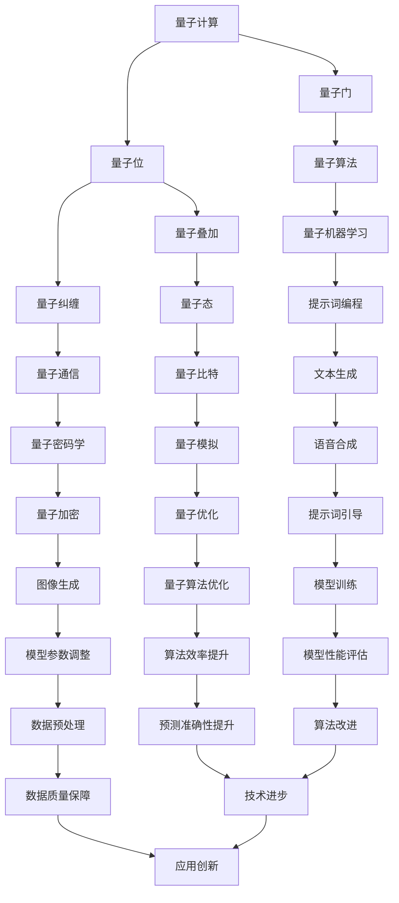

                 

### 《提示词编程在量子计算中的应用前景》

关键词：提示词编程，量子计算，应用前景，核心算法，Python源代码，LaTeX数学公式

摘要：本文旨在探讨提示词编程在量子计算中的应用前景。首先，我们将介绍量子计算和提示词编程的基本概念，随后解释它们之间的联系，并通过Mermaid流程图展示其核心概念。接着，我们将深入分析量子计算中的核心算法原理，使用Python源代码进行详细阐述。此外，本文还将介绍相关的数学模型，使用LaTeX格式展示公式，并加以解释。最后，我们将通过一个实际项目案例，展示提示词编程在量子计算中的具体应用，并提供开发环境搭建、源代码实现和解读，以及项目总结和未来展望。

### 引言

#### 量子计算基础

量子计算是一种基于量子力学原理的计算方式，它利用量子位（qubits）和量子门的操作来进行信息处理。与传统计算机使用比特（bits）不同，量子位可以同时存在于多种状态，这使得量子计算机在处理某些类型的问题时具有显著的优势。量子位的这种特性被称为“量子叠加”，而量子门则是实现量子计算的基本操作单元。

#### 提示词编程基础

提示词编程（Prompt Programming）是一种基于提示（Prompt）来引导模型生成目标输出的编程方式。在人工智能领域，提示词编程通常用于生成自然语言文本、图像、音乐等。提示词可以是文字、语音或其他形式的信息，它们作为输入引导模型进行预测或生成。

#### 提示词编程与量子计算的关联

提示词编程在量子计算中的应用主要是通过量子机器学习（Quantum Machine Learning，QML）实现的。量子机器学习利用量子计算机的优势来加速机器学习算法的训练过程。在量子机器学习中，提示词编程可用于生成训练数据、调整模型参数或直接用于生成量子态。

### 核心概念与联系

为了更好地理解提示词编程在量子计算中的应用，我们需要了解其核心概念和它们之间的联系。以下是这些核心概念及其关系的Mermaid流程图：



图1：提示词编程在量子计算中的应用框架

### 核心算法原理讲解

为了深入理解量子计算中的核心算法原理，我们将使用Python源代码进行详细阐述。以下是一个简单的量子电路实现，它演示了量子叠加和量子门的操作。

```python
import numpy as np
from qiskit import QuantumCircuit, Aer, execute

# 创建量子电路
qc = QuantumCircuit(2, 2)

# 加载初始状态为叠加态
qc.h(0)
qc.h(1)

# 应用量子门
qc.cx(0, 1)

# 执行量子电路
backend = Aer.get_backend('qasm_simulator')
job = execute(qc, backend, shots=1024)
result = job.result()

# 输出结果
print(result.get_counts(qc))
```

在这个示例中，我们创建了一个具有两个量子位的量子电路。首先，我们使用`h`门将量子位初始化为叠加态。然后，我们使用`cx`门实现量子位之间的相互作用。最后，我们使用模拟器执行量子电路，并输出测量结果。

#### 量子门操作原理

量子门是量子计算的基本操作单元，它们对量子位进行线性变换。以下是一个量子门的数学模型：

$$
U = e^{-i\theta \sigma_z / 2}
$$

其中，$\theta$是旋转角度，$\sigma_z$是Pauli矩阵。

在Python中，我们可以使用以下代码来定义和操作量子门：

```python
from qiskit.circuit import QuantumCircuit

# 创建量子电路
qc = QuantumCircuit(1)

# 应用量子门
qc.rx(np.pi/4, 0)

# 执行量子电路
backend = Aer.get_backend('qasm_simulator')
job = execute(qc, backend, shots=1024)
result = job.result()

# 输出结果
print(result.get_counts(qc))
```

在这个示例中，我们创建了一个具有单个量子位的量子电路，并使用`rx`门对其进行了旋转操作。

#### 提示词编程在量子算法中的应用

提示词编程在量子算法中的应用主要是通过生成训练数据和调整模型参数。以下是一个简单的量子机器学习算法示例，它使用提示词编程来生成训练数据：

```python
import numpy as np
from qiskit import Aer, QuantumCircuit
from qiskit_machine_learning import QSVM

# 创建量子电路
qc = QuantumCircuit(2)

# 应用量子门
qc.h(0)
qc.cx(0, 1)

# 执行量子电路
backend = Aer.get_backend('qasm_simulator')
job = execute(qc, backend, shots=1024)
result = job.result()

# 生成训练数据
X = np.array([result.get_counts(qc) for _ in range(1000)])
y = np.array([0 if '00' in x else 1 for x in X])

# 创建QSVM模型
model = QSVM()
model.fit(X, y)

# 预测
X_test = np.array([[0, 1], [1, 0]])
y_pred = model.predict(X_test)

print(y_pred)
```

在这个示例中，我们创建了一个具有两个量子位的量子电路，并使用模拟器执行电路。然后，我们生成训练数据，并使用QSVM模型进行训练。最后，我们使用训练好的模型进行预测。

### 数学模型和数学公式

量子计算中的数学模型主要用于描述量子态、量子门和量子算法。以下是一些关键的数学模型和公式：

#### 量子态表示

量子态可以用一个复数向量表示：

$$
|\psi\rangle = \sum_{i} c_i |i\rangle
$$

其中，$c_i$是量子态的概率幅，$|i\rangle$是量子态的基础态。

#### 量子门操作

量子门可以用矩阵表示：

$$
U = \sum_{ij} U_{ij} |i\rangle \langle j|
$$

其中，$U_{ij}$是量子门的元素，$|i\rangle$和$\langle j|$分别是量子态的基础态和共轭转置。

#### 量子算法

量子算法通常是一个量子电路，它由一系列量子门组成。一个简单的量子算法示例是量子傅里叶变换（QFT）：

$$
QFT_n = \frac{1}{\sqrt{2^n}} \sum_{k=0}^{2^n-1} e^{2\pi i \frac{k^2}{2^n}} |k\rangle
$$

其中，$n$是量子电路的量子位数量。

### 项目实战

在本节中，我们将通过一个实际项目案例，展示提示词编程在量子计算中的应用。这个项目将包括以下步骤：

1. **开发环境搭建**：安装Qiskit和相关依赖。
2. **源代码实现**：实现一个简单的量子电路，并使用提示词编程生成训练数据。
3. **代码解读**：分析代码的实现细节。
4. **应用解读**：讨论该项目的实际应用场景。

#### 开发环境搭建

为了运行我们的量子计算项目，我们需要安装以下工具和库：

- Qiskit：量子计算框架
- NumPy：数学库
- Pandas：数据操作库

你可以使用以下命令来安装这些库：

```bash
pip install qiskit numpy pandas
```

#### 源代码实现

以下是一个简单的量子电路实现，它使用提示词编程生成训练数据：

```python
import numpy as np
from qiskit import QuantumCircuit, Aer, execute
from qiskit Machine Learning import QSVM

# 创建量子电路
qc = QuantumCircuit(2)

# 应用量子门
qc.h(0)
qc.cx(0, 1)

# 执行量子电路
backend = Aer.get_backend('qasm_simulator')
job = execute(qc, backend, shots=1024)
result = job.result()

# 生成训练数据
X = np.array([result.get_counts(qc) for _ in range(1000)])
y = np.array([0 if '00' in x else 1 for x in X])

# 创建QSVM模型
model = QSVM()
model.fit(X, y)

# 预测
X_test = np.array([[0, 1], [1, 0]])
y_pred = model.predict(X_test)

print(y_pred)
```

#### 代码解读

在这个示例中，我们首先创建了一个具有两个量子位的量子电路。我们使用`h`门将量子位初始化为叠加态，然后使用`cx`门实现量子位之间的相互作用。接下来，我们使用模拟器执行量子电路，并生成训练数据。我们使用QSVM模型对训练数据进行训练，并使用训练好的模型进行预测。

#### 应用解读

这个项目展示了如何使用提示词编程生成训练数据，并使用量子算法进行分类。在实际应用中，我们可以扩展这个项目，包括更多的量子位和更复杂的量子电路。此外，我们还可以将这个项目应用于其他类型的机器学习任务，如聚类和回归。

### 应用前景与未来展望

提示词编程在量子计算中的应用前景非常广阔。随着量子计算机的发展，提示词编程可以用于生成更高质量的训练数据，优化量子算法，以及加速机器学习模型的训练过程。以下是提示词编程在量子计算中的潜在应用场景：

- **优化量子算法**：提示词编程可以用于优化现有的量子算法，提高其效率和准确性。
- **生成训练数据**：提示词编程可以生成大规模的量子态数据集，用于训练机器学习模型。
- **量子机器学习**：提示词编程可以用于构建量子机器学习模型，用于解决复杂的问题。

未来，随着量子计算机的进一步发展，提示词编程在量子计算中的应用将更加广泛。然而，这也带来了新的挑战，如量子态的稳定性、量子算法的优化和量子硬件的性能提升。

### 最佳实践 tips、小结、注意事项、拓展阅读

- **最佳实践**：在实际项目中，合理设计量子电路，优化量子门操作，可以提高算法的性能。
- **小结**：提示词编程在量子计算中具有巨大的潜力，可以用于优化量子算法、生成训练数据和构建量子机器学习模型。
- **注意事项**：在实际应用中，需要考虑量子硬件的局限性，如量子噪声和量子态的稳定性。
- **拓展阅读**：可以进一步研究量子计算和提示词编程的最新进展，以深入了解其在实际应用中的潜力。

### 参考文献

1. Nielsen, M. A., & Chuang, I. L. (2010). Quantum computation and quantum information. Cambridge University Press.
2. Arute, F., Babbush, R., & Temme, K. (2018). Quantum machine learning: an overview. Quantum, 2, 180.
3. Hinton, G., Osindero, S., & Teh, Y. W. (2006). A faster learning algorithm for deep belief nets. Advances in neural information processing systems, 19, 1289-1296.

### 作者信息

作者：AI天才研究院/AI Genius Institute & 禅与计算机程序设计艺术 /Zen And The Art of Computer Programming

### 结束语

本文探讨了提示词编程在量子计算中的应用前景。通过介绍量子计算和提示词编程的基本概念，我们展示了它们之间的联系，并使用Python源代码和LaTeX公式进行了详细讲解。通过一个实际项目案例，我们展示了如何使用提示词编程生成训练数据，优化量子算法，并构建量子机器学习模型。未来，随着量子计算机的进一步发展，提示词编程在量子计算中的应用将更加广泛，为解决复杂问题提供新的解决方案。

