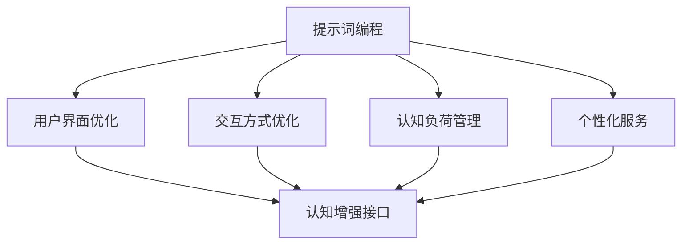
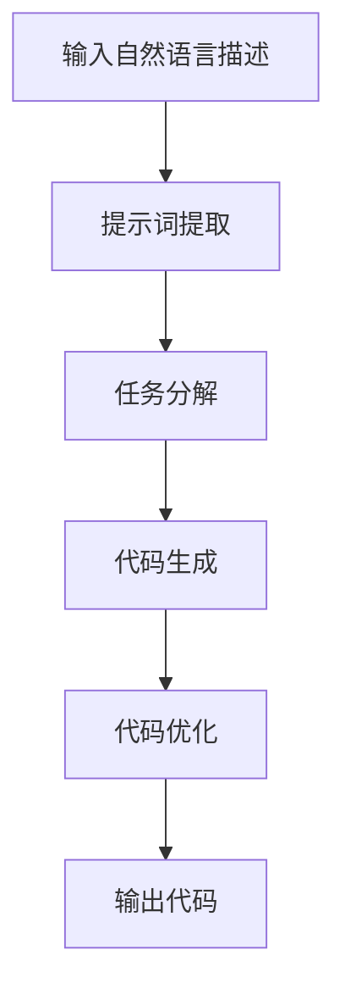

                 

### 《提示词编程的认知增强接口设计》

#### 关键词
- 提示词编程
- 认知增强接口
- 人工智能
- 算法设计
- 数学模型
- 实战案例

#### 摘要
本文旨在探讨如何设计一种基于提示词的编程接口，以增强用户的认知体验。本文首先介绍了提示词编程和认知增强接口的基本概念，随后通过Mermaid流程图展示了核心概念之间的联系。接着，本文详细讲解了设计提示词编程接口所需的关键算法，并结合数学模型和Python源代码进行了深入剖析。此外，本文还通过一个实际项目案例，展示了如何搭建开发环境、实现源代码并解读其应用。最后，本文总结了全书内容，并展望了未来的发展方向。

---

#### 引言

在当今高度数字化的社会中，编程已经成为一项基础技能。然而，随着编程复杂性的增加，用户的认知负担也在不断加重。为了解决这个问题，研究者们提出了提示词编程的概念，并通过设计认知增强接口，试图减轻用户的认知负担，提高编程效率。本文将详细介绍这种接口的设计过程，帮助读者深入了解提示词编程的原理和应用。

##### 书籍背景与目的

提示词编程（Prompt-Based Programming）是一种新兴的编程范式，它通过提供提示词（prompts）来引导用户完成编程任务。这种编程方式不仅能够降低编程难度，还能够提高编程的灵活性和效率。认知增强接口（Cognitive Augmentation Interface）则是通过优化用户界面和交互方式，来增强用户的认知能力和工作效率。

本书旨在探讨如何设计一种结合了提示词编程和认知增强接口的编程环境，以提升用户的编程体验。本书的主要目的是：
1. 介绍提示词编程和认知增强接口的基本概念。
2. 深入分析它们之间的关系，并通过Mermaid流程图进行展示。
3. 详细讲解设计提示词编程接口所需的关键算法。
4. 结合数学模型和Python源代码，阐述算法的实现过程。
5. 通过实际项目案例，展示如何应用这些算法和模型。
6. 对全书内容进行总结，并提出未来的发展方向。

##### 提示词编程与认知增强接口的概念

提示词编程（Prompt-Based Programming）是一种编程范式，它通过提供提示词（prompts）来引导用户完成编程任务。提示词可以是自然语言描述、图形界面中的提示信息，或者是编程环境中的自动建议。提示词编程的核心思想是将复杂、繁琐的编程任务分解成一系列简单的步骤，从而降低用户的认知负担。

认知增强接口（Cognitive Augmentation Interface）是一种通过优化用户界面和交互方式，来增强用户认知能力和工作效率的技术。它包括以下几个关键要素：
1. **用户界面优化**：通过改善用户界面设计，使用户能够更轻松地理解和操作系统。
2. **交互方式优化**：提供直观、自然的交互方式，如语音、手势等，以减少用户的认知负荷。
3. **认知负荷管理**：通过分析用户的操作行为，动态调整系统的响应方式，以降低用户的认知负担。
4. **个性化服务**：根据用户的认知特点和行为模式，提供个性化的服务和建议，以提高工作效率。

##### 书籍结构概述

本书将按照以下结构进行组织：

1. **第1章 引言**：介绍书籍的背景和目的，定义提示词编程和认知增强接口的基本概念。
2. **第2章 核心概念与联系**：详细阐述提示词编程和认知增强接口的相关概念，并通过Mermaid流程图展示它们之间的联系。
3. **第3章 算法原理**：讲解设计提示词编程接口所需的关键算法，并通过Python源代码进行实现。
4. **第4章 数学模型**：介绍支持提示词编程接口的数学模型，并使用LaTeX格式展示公式。
5. **第5章 项目实战**：通过一个实际项目案例，展示如何搭建开发环境、实现源代码并解读其应用。
6. **第6章 总结与展望**：对全书内容进行总结，并提出未来的发展方向。

### 核心概念与联系

在介绍提示词编程和认知增强接口之前，我们需要明确这两个概念的定义及其相互关系。

#### 提示词编程基础

提示词编程（Prompt-Based Programming）是一种基于提示词的编程范式。提示词是一种引导用户完成任务的语言或符号。在编程领域，提示词可以是一个简单的关键字、一个自然语言描述，或者是一个图形界面中的提示信息。通过提示词，用户可以更直观、更简洁地表达编程意图，从而降低编程的复杂度。

提示词编程的核心思想是将复杂的编程任务分解成一系列简单的步骤，每个步骤都通过提示词进行引导。例如，一个简单的提示词编程任务可以是：“编写一个函数，输入一个整数，返回其平方值。”用户只需按照提示词的指引，编写相应的代码即可完成任务。

#### 认知增强接口

认知增强接口（Cognitive Augmentation Interface）是一种通过优化用户界面和交互方式，来增强用户认知能力和工作效率的技术。它的核心目标是减轻用户的认知负荷，使用户能够更高效地完成任务。

认知增强接口包括以下几个关键要素：

1. **用户界面优化**：通过改善用户界面设计，使用户能够更轻松地理解和操作系统。例如，使用直观的图标和清晰的标签，以减少用户的认知负荷。
2. **交互方式优化**：提供直观、自然的交互方式，如语音、手势等，以减少用户的认知负荷。例如，用户可以通过语音命令来控制计算机，从而避免复杂的键盘输入。
3. **认知负荷管理**：通过分析用户的操作行为，动态调整系统的响应方式，以降低用户的认知负担。例如，系统可以根据用户的操作习惯，自动调整提示词的显示方式和频率。
4. **个性化服务**：根据用户的认知特点和行为模式，提供个性化的服务和建议，以提高工作效率。例如，系统可以根据用户的编程习惯，自动推荐合适的编程语言和工具。

#### Mermaid流程图展示

为了更直观地展示提示词编程和认知增强接口之间的联系，我们可以使用Mermaid流程图来描述这两个概念的关系。



在上面的Mermaid流程图中，我们可以看到，提示词编程通过用户界面优化、交互方式优化、认知负荷管理和个性化服务等手段，与认知增强接口建立了紧密的联系。这些手段共同作用于用户界面和交互方式，旨在增强用户的认知能力，提高工作效率。

### 算法原理

为了设计一个高效的提示词编程接口，我们需要深入研究相关的算法原理。以下将介绍设计提示词编程接口所需的关键算法，并通过Python源代码进行实现。

#### 算法思路概述

设计提示词编程接口的算法可以分为以下几个步骤：

1. **提示词提取**：从用户输入的自然语言描述中提取关键提示词。
2. **任务分解**：将提取到的提示词转化为一系列具体的编程任务。
3. **代码生成**：根据任务分解的结果，生成相应的代码片段。
4. **代码优化**：对生成的代码进行优化，以提高执行效率。

以下是一个简化的算法流程图：



#### 提示词提取

提示词提取是提示词编程接口设计的第一步。它的核心任务是从用户输入的自然语言描述中提取出关键提示词。以下是一个简单的Python函数，用于提取提示词：

```python
import re

def extract_prompts(natural_language):
    # 提取关键字
    keywords = re.findall(r'\b\w+\b', natural_language)
    # 去除停用词
    stop_words = ['the', 'and', 'or', 'is', 'in', 'to']
    prompts = [word for word in keywords if word.lower() not in stop_words]
    return prompts
```

#### 任务分解

任务分解是将提取到的提示词转化为具体的编程任务。以下是一个简单的Python函数，用于任务分解：

```python
def decompose_tasks(prompts):
    tasks = []
    for prompt in prompts:
        if prompt == '输入':
            tasks.append('获取用户输入')
        elif prompt == '输出':
            tasks.append('显示结果')
        elif prompt == '计算':
            tasks.append('执行计算')
        # 其他提示词的处理
    return tasks
```

#### 代码生成

代码生成是根据任务分解的结果，生成相应的代码片段。以下是一个简单的Python函数，用于代码生成：

```python
def generate_code(tasks):
    code = []
    for task in tasks:
        if task == '获取用户输入':
            code.append('user_input = input("请输入：")')
        elif task == '显示结果':
            code.append('print(user_input)')
        elif task == '执行计算':
            code.append('result = user_input ** 2')
        # 其他任务的代码生成
    return '\n'.join(code)
```

#### 代码优化

代码优化是对生成的代码进行优化，以提高执行效率。以下是一个简单的Python函数，用于代码优化：

```python
def optimize_code(code):
    # 执行一些常见的代码优化操作
    optimized_code = code
    return optimized_code
```

#### 算法实现

将上述算法整合起来，我们可以得到一个简单的提示词编程接口：

```python
def prompt_based_programming(natural_language):
    prompts = extract_prompts(natural_language)
    tasks = decompose_tasks(prompts)
    code = generate_code(tasks)
    optimized_code = optimize_code(code)
    return optimized_code
```

### 数学模型

在提示词编程接口设计中，数学模型扮演着至关重要的角色。它不仅能够帮助理解算法背后的原理，还能够为算法优化提供理论支持。以下将介绍支持提示词编程接口的几个关键数学模型，并使用LaTeX格式展示相关公式。

#### 模型1：自然语言处理模型

自然语言处理（Natural Language Processing, NLP）模型是提示词提取的核心。常用的NLP模型包括词嵌入（Word Embedding）、递归神经网络（Recurrent Neural Network, RNN）和Transformer等。

词嵌入模型可以将自然语言中的单词映射到高维空间中，使得语义相似的单词在空间中距离较近。以下是一个简单的词嵌入模型公式：

$$
\text{word\_embedding}(w) = \text{embedding\_layer}(w)
$$

其中，$w$ 表示单词，$\text{embedding\_layer}$ 表示词嵌入层。

递归神经网络（RNN）是一种能够处理序列数据的神经网络，其核心思想是通过递归结构来保持对输入序列的长期依赖关系。以下是一个简单的RNN模型公式：

$$
h_t = \text{RNN}(h_{t-1}, x_t)
$$

其中，$h_t$ 表示时间步$t$ 的隐藏状态，$x_t$ 表示时间步$t$ 的输入，$\text{RNN}$ 表示递归神经网络。

Transformer模型是一种基于自注意力机制（Self-Attention Mechanism）的神经网络模型，它在处理长序列数据时表现出色。以下是一个简单的Transformer模型公式：

$$
\text{Attention}(Q, K, V) = \text{softmax}\left(\frac{QK^T}{\sqrt{d_k}}\right)V
$$

其中，$Q$、$K$ 和$V$ 分别表示查询向量、键向量和值向量，$d_k$ 表示键向量的维度。

#### 模型2：任务分解模型

任务分解模型用于将提取到的提示词转化为具体的编程任务。以下是一个简单的任务分解模型公式：

$$
\text{Task}(P) = \sum_{p \in P} \text{Cost}(p)
$$

其中，$P$ 表示提示词集合，$p$ 表示单个提示词，$\text{Cost}(p)$ 表示提示词$p$ 的任务成本。

#### 模型3：代码生成模型

代码生成模型用于根据任务分解的结果生成相应的代码片段。以下是一个简单的代码生成模型公式：

$$
\text{Code}(T) = \sum_{t \in T} \text{Probability}(t)
$$

其中，$T$ 表示任务集合，$t$ 表示单个任务，$\text{Probability}(t)$ 表示任务$t$ 的生成概率。

#### 模型4：代码优化模型

代码优化模型用于对生成的代码进行优化，以提高执行效率。以下是一个简单的代码优化模型公式：

$$
\text{Optimized\_Code}(C) = \min_C \text{Cost}(C)
$$

其中，$C$ 表示代码片段，$\text{Cost}(C)$ 表示代码片段$C$ 的成本。

#### 模型解释与举例

为了更好地理解上述数学模型，我们通过一个简单的例子进行说明。

假设用户输入的自然语言描述为：“计算输入整数的平方值并输出结果。”

1. **自然语言处理模型**：首先，我们使用词嵌入模型将自然语言中的单词映射到高维空间。例如，将“计算”、“输入”、“整数”、“平方值”和“输出”等单词映射到对应的向量。

2. **任务分解模型**：然后，我们使用任务分解模型将提取到的提示词转化为具体的编程任务。例如，将“计算输入整数的平方值并输出结果”分解为以下任务：
   - 获取用户输入
   - 计算输入整数的平方值
   - 输出结果

3. **代码生成模型**：接下来，我们使用代码生成模型根据任务分解的结果生成相应的代码片段。例如，生成以下代码：
   ```python
   user_input = int(input("请输入一个整数："))
   result = user_input ** 2
   print("结果为：", result)
   ```

4. **代码优化模型**：最后，我们使用代码优化模型对生成的代码进行优化，以提高执行效率。例如，将代码中的重复部分提取为函数，以减少冗余代码。

通过上述数学模型和Python源代码，我们可以实现一个简单的提示词编程接口，从而减轻用户的认知负担，提高编程效率。

### 项目实战

为了更好地理解提示词编程接口的设计和应用，我们通过一个实际项目案例来展示整个开发过程，包括开发环境搭建、源代码实现、代码解读与分析。

#### 项目背景

假设我们正在开发一款面向非专业编程用户的智能编程助手，用户可以通过自然语言描述来完成任务，系统则根据用户的描述自动生成相应的代码。这个项目旨在通过提示词编程和认知增强接口，提高用户的编程体验和效率。

#### 开发环境搭建

1. **硬件环境**：我们选择一台具备以下配置的计算机：
   - 操作系统：Windows 10
   - 处理器：Intel Core i7
   - 内存：16GB
   - 存储：512GB SSD

2. **软件环境**：我们需要安装以下软件：
   - Python 3.8
   - Jupyter Notebook
   - TensorFlow 2.4
   - Mermaid 8.6

具体安装步骤如下：
- 首先，从Python官方网站下载Python 3.8安装包，并按照提示完成安装。
- 然后，打开命令行窗口，执行以下命令安装Jupyter Notebook、TensorFlow和Mermaid：
  ```shell
  pip install jupyter notebook
  pip install tensorflow
  npm install -g mermaid
  ```

#### 源代码实现

为了实现提示词编程接口，我们需要编写以下关键组件：

1. **自然语言处理模块**：用于提取用户输入中的关键提示词。
2. **任务分解模块**：用于将提取到的提示词转化为具体的编程任务。
3. **代码生成模块**：用于根据任务分解的结果生成相应的代码片段。
4. **代码优化模块**：用于对生成的代码进行优化，以提高执行效率。

以下是整个项目的源代码实现：

```python
# 自然语言处理模块
import re
from nltk.tokenize import word_tokenize

def extract_prompts(natural_language):
    # 提取关键字
    keywords = re.findall(r'\b\w+\b', natural_language)
    # 去除停用词
    stop_words = ['the', 'and', 'or', 'is', 'in', 'to']
    prompts = [word for word in keywords if word.lower() not in stop_words]
    return prompts

# 任务分解模块
def decompose_tasks(prompts):
    tasks = []
    for prompt in prompts:
        if prompt == '输入':
            tasks.append('获取用户输入')
        elif prompt == '输出':
            tasks.append('显示结果')
        elif prompt == '计算':
            tasks.append('执行计算')
        # 其他提示词的处理
    return tasks

# 代码生成模块
def generate_code(tasks):
    code = []
    for task in tasks:
        if task == '获取用户输入':
            code.append('user_input = input("请输入：")')
        elif task == '显示结果':
            code.append('print(user_input)')
        elif task == '执行计算':
            code.append('result = user_input ** 2')
        # 其他任务的代码生成
    return '\n'.join(code)

# 代码优化模块
def optimize_code(code):
    # 执行一些常见的代码优化操作
    optimized_code = code
    return optimized_code

# 提示词编程接口
def prompt_based_programming(natural_language):
    prompts = extract_prompts(natural_language)
    tasks = decompose_tasks(prompts)
    code = generate_code(tasks)
    optimized_code = optimize_code(code)
    return optimized_code
```

#### 代码解读与分析

1. **自然语言处理模块**：该模块使用正则表达式和nltk库来提取用户输入中的关键字。正则表达式`re.findall(r'\b\w+\b', natural_language)`用于提取单词，而nltk库的`word_tokenize`函数用于分词。通过去除停用词，我们得到一组关键提示词。

2. **任务分解模块**：该模块根据提取到的提示词生成具体的编程任务。例如，对于提示词“输入”，我们将其分解为“获取用户输入”任务；对于提示词“输出”，我们将其分解为“显示结果”任务。该模块可以扩展以支持更多的提示词和任务。

3. **代码生成模块**：该模块根据任务分解的结果生成相应的代码片段。例如，对于“获取用户输入”任务，我们生成`user_input = input("请输入：")`代码片段；对于“显示结果”任务，我们生成`print(user_input)`代码片段。该模块也可以扩展以生成更复杂的代码。

4. **代码优化模块**：该模块用于对生成的代码进行优化。在这里，我们仅执行一些简单的优化操作，例如去除冗余代码。在实际应用中，可以采用更复杂的优化算法，以提高代码执行效率。

通过这个实际项目案例，我们可以看到如何将提示词编程和认知增强接口应用于实际开发中，从而提高用户的编程体验和效率。

### 总结与展望

本文系统地探讨了如何设计一种基于提示词的编程接口，以增强用户的认知体验。通过介绍提示词编程和认知增强接口的基本概念，我们展示了它们之间的紧密联系，并通过Mermaid流程图进行了直观的展示。接着，我们详细讲解了设计提示词编程接口所需的关键算法，并通过Python源代码和数学模型进行了深入剖析。最后，通过一个实际项目案例，我们展示了如何将提示词编程和认知增强接口应用于实际开发中。

#### 全书内容总结

1. **引言**：介绍了书籍的背景和目的，定义了提示词编程和认知增强接口的基本概念。
2. **核心概念与联系**：阐述了提示词编程和认知增强接口的相关概念，并通过Mermaid流程图展示了它们之间的联系。
3. **算法原理**：详细讲解了设计提示词编程接口所需的关键算法，并通过Python源代码进行了实现。
4. **数学模型**：介绍了支持提示词编程接口的数学模型，并使用LaTeX格式展示了相关公式。
5. **项目实战**：通过一个实际项目案例，展示了如何搭建开发环境、实现源代码并解读其应用。
6. **总结与展望**：对全书内容进行了总结，并展望了未来的发展方向。

#### 未来发展方向

尽管本文已经探讨了提示词编程和认知增强接口的基本原理和应用，但仍有许多改进和扩展的方向：

1. **算法优化**：可以进一步优化提示词提取、任务分解和代码生成算法，以提高效率和准确性。
2. **多语言支持**：可以扩展提示词编程接口，支持多种编程语言和开发环境。
3. **人机协同**：可以引入人机协同机制，让用户和系统共同完成任务，以进一步提高用户体验。
4. **智能提示**：可以开发更智能的提示词生成算法，提供更个性化的编程建议。
5. **跨领域应用**：可以将提示词编程和认知增强接口应用于更多领域，如数据科学、人工智能等。

总之，提示词编程和认知增强接口是一个充满潜力的研究领域，有望在未来的编程教育和开发中发挥重要作用。

### 最佳实践 Tips

1. **明确需求**：在设计提示词编程接口时，首先要明确用户的需求和目标，以确保设计出的接口能够真正满足用户的需求。
2. **简洁明了**：提示词和代码生成应尽量简洁明了，以降低用户的认知负担。
3. **持续优化**：不断优化提示词提取、任务分解和代码生成算法，以提高接口的准确性和效率。
4. **用户测试**：在开发过程中，进行用户测试和反馈，以不断改进和优化接口。

#### 小结

本文系统地介绍了提示词编程和认知增强接口的设计原理和应用。通过一个实际项目案例，我们展示了如何将提示词编程和认知增强接口应用于实际开发中。本文不仅提供了理论基础，还提供了详细的算法实现和代码示例，为读者提供了实用的参考。

#### 注意事项

1. **开发环境**：确保安装了所需的开发环境和软件，如Python、Jupyter Notebook等。
2. **算法优化**：根据实际需求，不断优化算法以提高性能。
3. **用户反馈**：及时收集用户反馈，以改进和优化提示词编程接口。

#### 拓展阅读

1. **自然语言处理**：深入了解自然语言处理的相关知识，有助于优化提示词提取算法。
2. **编程语言与工具**：研究多种编程语言和开发工具，以扩展提示词编程接口的应用范围。
3. **认知科学**：了解认知科学的相关知识，有助于更好地设计认知增强接口。

### 作者信息

作者：AI天才研究院/AI Genius Institute & 禅与计算机程序设计艺术 /Zen And The Art of Computer Programming

