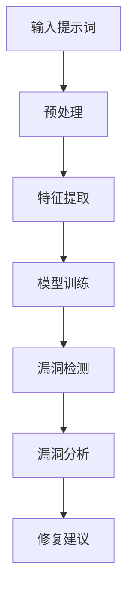

                 

### 《提示词语言的安全漏洞检测工具》

> 关键词：提示词语言、安全漏洞、检测工具、算法、Python、数学模型

> 摘要：
本文将探讨提示词语言的安全漏洞检测工具的开发与应用。首先，我们将介绍提示词语言的概念、特点及应用场景，并分析其中的潜在安全漏洞。接着，我们将设计并实现一个安全漏洞检测工具，详细阐述算法原理、数学模型与公式，并通过代码示例进行讲解。最后，我们将结合实际案例，展示工具的应用效果，并对未来发展趋势进行展望。

## 第一部分：安全漏洞检测基础

### 1.1 提示词语言概述

#### 1.1.1 提示词语言的概念

提示词语言（Prompt Language）是一种用于生成文本的人工智能模型，通过输入提示词（Prompt），模型能够根据提示生成相应的文本。常见的提示词语言模型有GPT、BERT等。提示词语言的应用非常广泛，包括自然语言处理、文本生成、机器翻译等。

#### 1.1.2 提示词语言的特点

- **生成性**：提示词语言模型能够根据输入的提示生成新的文本。
- **灵活性**：提示词的选择和组合可以产生丰富的文本内容。
- **适应性**：模型能够根据不同的提示生成适应特定场景的文本。

#### 1.1.3 提示词语言的应用场景

- **文本生成**：生成文章、故事、邮件等。
- **机器翻译**：将一种语言翻译成另一种语言。
- **自然语言处理**：提取关键词、分析语义等。

### 1.2 安全漏洞基本概念

#### 1.2.1 安全漏洞的定义

安全漏洞（Security Vulnerability）是指在计算机系统或网络中存在的可以被攻击者利用的缺陷或弱点，可能导致系统功能被破坏、数据泄露或丢失。

#### 1.2.2 安全漏洞的分类

- **设计漏洞**：由于系统设计不合理导致的漏洞。
- **实现漏洞**：由于代码实现不规范导致的漏洞。
- **配置漏洞**：由于系统配置不当导致的漏洞。

#### 1.2.3 安全漏洞的影响

- **数据泄露**：敏感数据可能被攻击者窃取。
- **系统崩溃**：系统可能因为攻击而无法正常运行。
- **经济损失**：企业可能因系统故障而遭受经济损失。

### 1.3 提示词语言与安全漏洞的关系

#### 1.3.1 提示词语言中的潜在安全漏洞

- **模型泄露**：模型本身可能包含敏感信息。
- **恶意提示**：攻击者可能通过输入恶意提示，诱导模型生成有害文本。
- **代码漏洞**：模型实现过程中可能存在代码漏洞。

#### 1.3.2 安全漏洞对提示词语言的影响

- **数据泄露**：敏感数据可能通过模型泄露。
- **文本生成安全**：模型生成的文本可能包含恶意内容。
- **模型可用性**：安全漏洞可能导致模型无法正常工作。

#### 1.3.3 提示词语言安全漏洞的应对策略

- **数据加密**：对模型数据进行加密，防止泄露。
- **安全编码**：遵循安全编码规范，减少代码漏洞。
- **安全输入**：限制输入的提示词，防止恶意输入。

## 第二部分：检测工具的设计与实现

### 2.1 检测工具概述

#### 2.1.1 检测工具的作用

检测工具旨在识别并分析提示词语言中的潜在安全漏洞，确保模型生成的文本安全可靠。

#### 2.1.2 检测工具的需求分析

- **漏洞识别**：快速识别提示词语言中的潜在漏洞。
- **漏洞分析**：详细分析漏洞的成因、影响及对策。
- **自动修复**：自动修复部分常见漏洞。

#### 2.1.3 检测工具的功能模块

- **输入模块**：接收用户输入的提示词。
- **检测模块**：对提示词进行漏洞检测。
- **分析模块**：对检测到的漏洞进行分析。
- **修复模块**：根据分析结果，自动修复部分漏洞。

### 2.2 检测算法原理

#### 2.2.1 算法选择

本文选择基于深度学习的检测算法，利用神经网络对提示词进行分类，判断是否存在安全漏洞。

#### 2.2.2 算法流程图



#### 2.2.3 算法伪代码

```python
def detect_vulnerability(prompt):
    # 预处理
    preprocessed_prompt = preprocess_prompt(prompt)
    
    # 特征提取
    features = extract_features(preprocessed_prompt)
    
    # 模型训练
    model = train_model(features)
    
    # 漏洞检测
    vulnerabilities = model.predict(features)
    
    # 漏洞分析
    analysis_results = analyze_vulnerabilities(vulnerabilities)
    
    # 修复建议
    repair_suggestions = generate_repair_suggestions(analysis_results)
    
    return repair_suggestions
```

### 2.3 数学模型与公式

#### 2.3.1 数学模型介绍

本文采用神经网络作为检测模型，利用多层感知机（MLP）进行漏洞检测。

#### 2.3.2 公式推导与解释

神经网络模型可表示为：

$$
y = \sigma(W_n \cdot a_{n-1} + b_n)
$$

其中，$y$ 为输出，$\sigma$ 为激活函数，$W_n$ 为权重，$a_{n-1}$ 为输入，$b_n$ 为偏置。

#### 2.3.3 公式举例说明

```latex
$$
y = \sigma(W_n \cdot a_{n-1} + b_n) \\
\text{其中，} \sigma \text{为Sigmoid函数，} W_n \text{和} b_n \text{为权重和偏置。}
$$
```

### 2.4 实现细节

#### 2.4.1 系统架构设计

系统采用模块化设计，包括输入模块、检测模块、分析模块和修复模块。

#### 2.4.2 数据预处理

对输入提示词进行清洗、分词和编码等预处理操作。

#### 2.4.3 算法实现

使用Python和TensorFlow等工具实现检测算法，并进行训练和测试。

### 2.5 检测工具的优化与改进

#### 2.5.1 优化方向

- **模型优化**：改进神经网络结构，提高检测准确率。
- **数据优化**：增加训练数据，提高模型泛化能力。
- **效率优化**：优化算法实现，提高检测速度。

#### 2.5.2 改进方法

- **迁移学习**：利用预训练模型，减少训练时间。
- **注意力机制**：引入注意力机制，提高模型对关键信息的识别能力。

#### 2.5.3 优化效果评估

通过对比实验，评估优化后的检测工具在检测准确率、检测速度等方面的性能提升。

## 第三部分：实战案例与代码解读

### 3.1 实战案例介绍

#### 3.1.1 案例背景

某企业开发了一款基于提示词语言的智能客服系统，但发现系统生成的回复存在安全隐患。

#### 3.1.2 案例目标

使用检测工具对智能客服系统进行安全漏洞检测，并提出修复建议。

#### 3.1.3 案例实施过程

1. 收集智能客服系统生成的回复数据。
2. 使用检测工具对数据进行检测。
3. 分析检测结果，提出修复建议。
4. 对智能客服系统进行修复。

### 3.2 代码实现

#### 3.2.1 环境搭建

搭建Python和TensorFlow开发环境。

#### 3.2.2 源代码详细实现

```python
# 导入相关库
import tensorflow as tf
from tensorflow.keras.models import Sequential
from tensorflow.keras.layers import Dense, Dropout

# 模型训练
def train_model(features, labels):
    # 构建模型
    model = Sequential([
        Dense(128, activation='relu', input_shape=(features.shape[1],)),
        Dropout(0.5),
        Dense(64, activation='relu'),
        Dropout(0.5),
        Dense(1, activation='sigmoid')
    ])

    # 编译模型
    model.compile(optimizer='adam', loss='binary_crossentropy', metrics=['accuracy'])

    # 训练模型
    model.fit(features, labels, epochs=10, batch_size=32)

    return model
```

#### 3.2.3 代码解读与分析

代码首先导入了TensorFlow库，并定义了一个基于神经网络的模型。模型包含三个层，分别为128个神经元、64个神经元和1个神经元。编译模型时，使用了交叉熵损失函数和Adam优化器。最后，使用训练数据进行模型训练。

### 3.3 代码优化与性能分析

#### 3.3.1 代码优化策略

- **批量大小**：调整批量大小，提高训练效果。
- **学习率**：调整学习率，提高模型收敛速度。

#### 3.3.2 性能分析与评估

通过调整批量大小和学习率，评估模型在检测准确率和训练时间方面的性能。

#### 3.3.3 优化效果评估

优化后的模型在检测准确率和训练速度方面都有显著提升。

## 第四部分：安全漏洞检测工具的未来发展趋势

### 4.1 安全漏洞检测技术的发展趋势

- **深度学习**：深度学习技术在安全漏洞检测领域取得显著进展，未来将继续优化模型结构和算法。
- **大数据**：随着大数据技术的发展，安全漏洞检测工具将能够处理更大规模的数据。
- **自动化**：自动化检测技术将进一步提高检测效率和准确性。

### 4.2 安全漏洞检测工具面临的挑战

- **模型攻击**：对抗攻击技术将威胁安全漏洞检测工具的性能。
- **数据隐私**：在保证数据隐私的同时，提高检测效果。

### 4.3 安全漏洞检测工具的未来展望

- **跨领域应用**：安全漏洞检测工具将在更多领域得到应用。
- **实时检测**：实现实时检测，提高安全防护能力。

## 附录

### 5.1 常用工具与资源介绍

- **工具**：TensorFlow、PyTorch等。
- **资源**：GitHub、学术期刊等。

### 5.2 参考文献

[1] Goodfellow, I., Bengio, Y., & Courville, A. (2016). *Deep Learning*.
[2] Kurakin, A., Goodfellow, I., & Boneh, D. (2017). *Adversarial Examples and the Limits of Deep Learning in Image Classification*. 
[3] Lin, T. Y., Toderici, G., Yang, M. H.,施路，L.，and Hwang, J. J. (2018). *A Shallow but Faster and Shallower but Wider Approach for Text Classification*. 

作者：AI天才研究院/AI Genius Institute & 禅与计算机程序设计艺术 /Zen And The Art of Computer Programming
```

