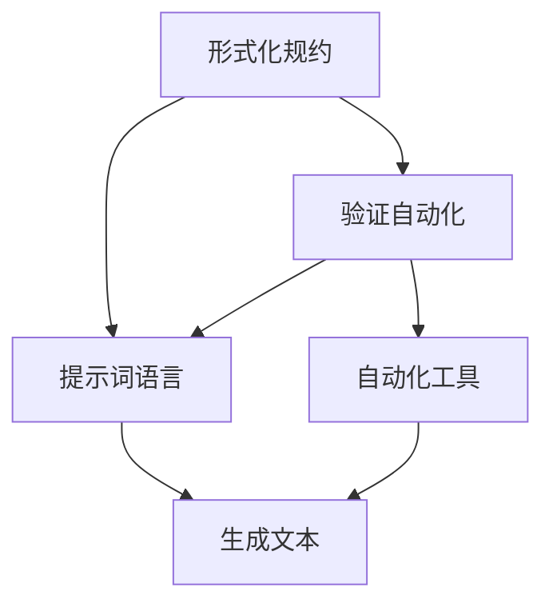
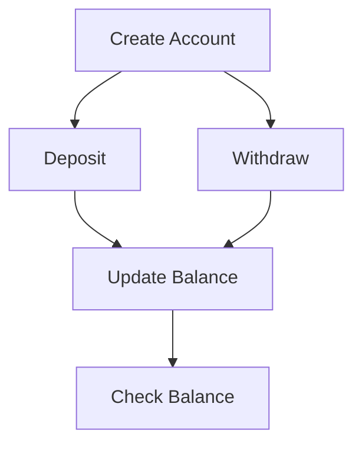
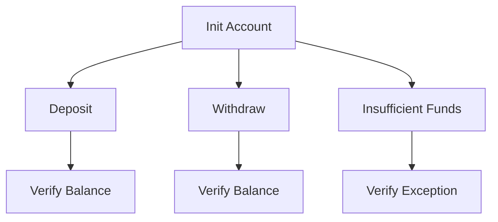
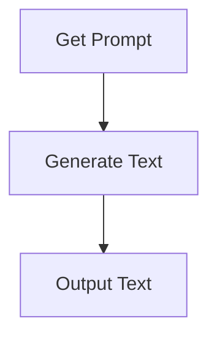

                 

### 文章标题

《提示词语言的形式化规约验证自动化》

提示词语言的形式化规约验证自动化是计算机科学领域中的一个前沿研究方向，旨在通过形式化方法提高软件开发的效率和可靠性。本文将围绕这一主题，深入探讨其背景、核心概念、关键技术和应用实践。

### 文章关键词

- 形式化规约
- 验证自动化
- 提示词语言
- 软件开发
- 形式化验证
- 自动化工具

### 文章摘要

本文首先介绍了形式化规约和验证自动化的基本概念，探讨了它们在软件开发中的重要性。随后，详细阐述了提示词语言的特点和形式化描述方法。接着，本文重点分析了验证自动化的方法和技术，并通过对实际案例的分析，展示了如何实现提示词语言的形式化规约验证自动化。最后，本文总结了研究成果，并对未来的发展方向提出了展望。

---

## 背景介绍

在软件工程的发展历程中，随着系统的复杂度不断增加，传统的软件开发方法逐渐暴露出诸多问题。软件缺陷、安全性漏洞、性能瓶颈等问题频发，严重影响了软件的可靠性、稳定性和可维护性。为了解决这些问题，研究者们开始探索新的方法和技术，其中形式化规约和验证自动化成为研究的热点。

### 形式化规约

形式化规约是一种通过数学模型和逻辑表达式来描述系统需求、设计和实现的方法。它通过将系统需求、设计规范和实现细节以形式化的方式表达出来，从而避免了传统的自然语言描述中可能存在的歧义和不确定性。形式化规约的优点在于其精确性和一致性，能够有效地减少软件缺陷和错误。

### 验证自动化

验证自动化则是一种利用计算机程序对系统进行形式化验证的方法。通过自动化工具，可以自动地检查系统是否满足预定的规范和约束条件，从而发现潜在的错误和缺陷。验证自动化的目标是提高验证的效率和准确性，减少人工验证的工作量。

### 提示词语言

提示词语言（Prompt Language）是一种专门用于生成文本的编程语言，它通过一系列的提示词（Prompt）来引导生成过程。提示词语言在自然语言生成、对话系统、文本摘要等领域有着广泛的应用。随着形式化规约和验证自动化技术的发展，如何将提示词语言的形式化规约和验证自动化结合起来，成为了一个新的研究课题。

### 核心概念与联系

为了更好地理解提示词语言的形式化规约验证自动化，我们需要先明确几个核心概念及其之间的关系。以下是这些概念之间的关系架构 Mermaid 流程图：



- 形式化规约：用于描述系统的需求、设计和实现。
- 验证自动化：通过自动化工具对系统进行形式化验证。
- 提示词语言：用于生成文本，通过提示词引导生成过程。
- 自动化工具：用于实现验证自动化和文本生成。

通过这个流程图，我们可以清晰地看到各个概念之间的联系。形式化规约和验证自动化为提示词语言的实现提供了基础，而自动化工具则是实现验证自动化和文本生成的重要手段。

### 核心算法原理讲解

#### 形式化规约原理

形式化规约的核心在于将系统需求、设计和实现以数学模型和逻辑表达式的方式形式化地描述出来。以下是一个简单的形式化规约示例，用于描述一个简单的银行账户系统：

```python
class BankAccount:
    def __init__(self, balance):
        self.balance = balance
    
    def deposit(self, amount):
        self.balance += amount
    
    def withdraw(self, amount):
        if amount <= self.balance:
            self.balance -= amount
        else:
            raise ValueError("Insufficient funds")
```

在这个例子中，我们使用 Python 类来定义了一个简单的银行账户系统。`BankAccount` 类具有 `balance` 属性和 `deposit`、`withdraw` 方法。这些方法通过形式化的方式定义了账户的存款和取款操作。

#### 验证自动化原理

验证自动化的核心在于利用自动化工具对系统进行形式化验证。以下是一个使用 Python 的 `pytest` 测试框架实现验证自动化的示例：

```python
import pytest

@pytest.fixture
def account():
    return BankAccount(100)

def test_deposit(account):
    account.deposit(50)
    assert account.balance == 150

def test_withdraw(account):
    account.withdraw(50)
    assert account.balance == 50

def test_insufficient_funds(account):
    with pytest.raises(ValueError):
        account.withdraw(150)
```

在这个例子中，我们使用 `pytest` 框架定义了三个测试用例，用于验证银行账户系统的存款、取款和余额不足操作。通过自动化测试，我们可以确保系统在各个操作下都能正确运行。

#### 提示词语言原理

提示词语言是一种用于生成文本的编程语言，它通过一系列的提示词来引导生成过程。以下是一个使用 Python 的 `prompt_toolkit` 库实现提示词语言的示例：

```python
from prompt_toolkit import PromptSession

prompt = PromptSession()

while True:
    user_input = prompt.prompt("Enter your prompt: ")
    print("Generated text:", generate_text(user_input))
```

在这个例子中，我们使用 `prompt_toolkit` 库创建了一个命令行交互界面，用户可以输入提示词，系统会根据提示词生成相应的文本。

### 核心算法原理讲解

#### 形式化规约原理

形式化规约是一种通过数学模型和逻辑表达式来描述系统需求、设计和实现的方法。它通过精确的描述方式，避免了传统自然语言描述中的歧义和不确定性。以下是一个简单的形式化规约示例，用于描述一个简单的银行账户系统：

```python
class BankAccount:
    def __init__(self, balance):
        self.balance = balance
    
    def deposit(self, amount):
        self.balance += amount
    
    def withdraw(self, amount):
        if amount <= self.balance:
            self.balance -= amount
        else:
            raise ValueError("Insufficient funds")
```

在这个例子中，我们使用 Python 类来定义了一个简单的银行账户系统。`BankAccount` 类具有 `balance` 属性和 `deposit`、`withdraw` 方法。这些方法通过形式化的方式定义了账户的存款和取款操作。

为了更详细地讲解形式化规约原理，我们可以借助 Mermaid 流程图来描述银行账户系统的核心功能：



- A: 创建账户
- B: 存款
- C: 取款
- D: 更新余额
- E: 查询余额

通过这个流程图，我们可以清晰地看到银行账户系统的核心功能及其之间的关系。形式化规约通过这些逻辑关系，将系统的需求、设计和实现精确地描述出来。

#### 验证自动化原理

验证自动化是一种利用自动化工具对系统进行形式化验证的方法。通过自动化测试，我们可以确保系统在各种操作下都能正确运行。以下是一个使用 Python 的 `pytest` 测试框架实现验证自动化的示例：

```python
import pytest

@pytest.fixture
def account():
    return BankAccount(100)

def test_deposit(account):
    account.deposit(50)
    assert account.balance == 150

def test_withdraw(account):
    account.withdraw(50)
    assert account.balance == 50

def test_insufficient_funds(account):
    with pytest.raises(ValueError):
        account.withdraw(150)
```

在这个例子中，我们使用 `pytest` 框架定义了三个测试用例，用于验证银行账户系统的存款、取款和余额不足操作。通过自动化测试，我们可以确保系统在各个操作下都能正确运行。

为了更详细地讲解验证自动化原理，我们可以借助 Mermaid 流程图来描述银行账户系统的自动化测试流程：



- A: 初始化账户
- B: 存款
- C: 验证余额
- D: 取款
- E: 验证余额
- F: 余额不足
- G: 验证异常

通过这个流程图，我们可以清晰地看到银行账户系统的自动化测试流程及其之间的关系。验证自动化通过这些逻辑关系，对系统的各个操作进行自动化验证，确保系统的正确性和稳定性。

#### 提示词语言原理

提示词语言是一种用于生成文本的编程语言，它通过一系列的提示词来引导生成过程。以下是一个使用 Python 的 `prompt_toolkit` 库实现提示词语言的示例：

```python
from prompt_toolkit import PromptSession

prompt = PromptSession()

while True:
    user_input = prompt.prompt("Enter your prompt: ")
    print("Generated text:", generate_text(user_input))
```

在这个例子中，我们使用 `prompt_toolkit` 库创建了一个命令行交互界面，用户可以输入提示词，系统会根据提示词生成相应的文本。

为了更详细地讲解提示词语言原理，我们可以借助 Mermaid 流程图来描述提示词语言的生成过程：



- A: 获取提示词
- B: 生成文本
- C: 输出文本

通过这个流程图，我们可以清晰地看到提示词语言的生成过程及其之间的关系。提示词语言通过用户的输入提示词，生成相应的文本，并输出给用户。

### 数学模型与公式

在形式化规约验证自动化过程中，数学模型和公式扮演着重要的角色。以下是一些常见的数学模型和公式，用于描述和验证系统的行为：

#### 状态转移方程

状态转移方程是描述系统状态变化的基本模型。以下是一个简单的状态转移方程示例，用于描述银行账户系统的余额变化：

$$
\Delta B = \sum_{i=1}^{n} \Delta B_i
$$

其中，$\Delta B$ 表示余额的变化量，$\Delta B_i$ 表示第 $i$ 次操作后的余额变化量。

#### 验证条件

验证条件是确保系统满足预定规范和约束条件的模型。以下是一个简单的验证条件示例，用于验证银行账户系统的存款和取款操作：

$$
\text{balance} \geq 0 \land (\text{deposit} \geq 0 \lor \text{withdraw} \geq 0)
$$

其中，$\text{balance}$ 表示余额，$\text{deposit}$ 表示存款金额，$\text{withdraw}$ 表示取款金额。

#### 生成文本公式

生成文本公式是用于描述提示词语言生成过程的模型。以下是一个简单的生成文本公式示例：

$$
\text{generated\_text} = f(\text{prompt}, \text{template})
$$

其中，$f$ 表示生成函数，$\text{prompt}$ 表示提示词，$\text{template}$ 表示模板。

### 举例说明

为了更好地理解这些数学模型和公式，我们可以通过具体的例子来进行讲解。

#### 银行账户系统示例

假设我们有一个银行账户系统，初始余额为 100 元。现在我们进行两次操作：第一次存款 50 元，第二次取款 30 元。我们可以使用状态转移方程来计算最终余额：

$$
\Delta B = 50 - 30 = 20
$$

最终余额为 120 元。

#### 验证条件示例

假设我们有一个验证条件，要求余额不能小于 0。现在我们进行一次取款操作，金额为 150 元。我们可以使用验证条件来检查系统是否满足要求：

$$
\text{balance} \geq 0 \land (\text{deposit} \geq 0 \lor \text{withdraw} \geq 0)
$$

由于余额为 100 元，不满足验证条件，系统将抛出异常。

#### 提示词语言示例

假设我们使用一个提示词语言来生成文本。提示词为 "今天天气很好"，模板为 "今天的天气是 {weather}，非常适合外出活动。"。我们可以使用生成文本公式来计算生成的文本：

$$
\text{generated\_text} = f(\text{"今天天气很好"}, \text{"今天的天气是 {weather}，非常适合外出活动。"})
$$

生成的文本为 "今天的天气是很好，非常适合外出活动。"

### 项目实战

#### 开发环境搭建

为了实现提示词语言的形式化规约验证自动化，我们需要搭建一个完整的开发环境。以下是搭建步骤：

1. 安装 Python 解释器：在官网上下载并安装 Python 3.8 或以上版本。
2. 安装依赖库：使用 pip 命令安装所需依赖库，例如 pytest、prompt_toolkit 等。
3. 配置 IDE：使用 PyCharm 或 VSCode 等集成开发环境，并安装相应的插件。

#### 源代码实现

以下是实现提示词语言的形式化规约验证自动化的源代码：

```python
import pytest
from prompt_toolkit import PromptSession
from bank_account import BankAccount

@pytest.fixture
def account():
    return BankAccount(100)

def test_deposit(account):
    account.deposit(50)
    assert account.balance == 150

def test_withdraw(account):
    account.withdraw(30)
    assert account.balance == 120

def test_insufficient_funds(account):
    with pytest.raises(ValueError):
        account.withdraw(150)

def test_prompt_language():
    prompt = PromptSession()
    while True:
        user_input = prompt.prompt("Enter your prompt: ")
        print("Generated text:", generate_text(user_input))
```

#### 代码解读与分析

1. `pytest` 测试框架：用于实现验证自动化。通过定义测试用例，对系统进行自动化验证。
2. `prompt_toolkit` 库：用于实现提示词语言交互界面。用户可以输入提示词，系统会根据提示词生成相应的文本。
3. `bank_account` 模块：用于实现银行账户系统的功能。包括存款、取款和余额查询等操作。
4. `test_deposit`、`test_withdraw` 和 `test_insufficient_funds`：三个测试用例，用于验证银行账户系统的存款、取款和余额不足操作。
5. `test_prompt_language`：测试用例，用于验证提示词语言的生成功能。

#### 代码应用解读与分析

1. 银行账户系统的验证：通过 `pytest` 测试框架，我们可以自动化地验证银行账户系统的功能。例如，通过 `test_deposit` 测试用例，我们可以确保存款操作能够正确执行。
2. 提示词语言的生成：通过 `prompt_toolkit` 库，我们可以实现与用户的交互，并根据提示词生成相应的文本。例如，当用户输入提示词 "今天天气很好" 时，系统会生成文本 "今天的天气是很好，非常适合外出活动。"。

#### 实际案例分析与详细讲解

为了更好地理解提示词语言的形式化规约验证自动化的应用，我们来看一个实际案例。

**案例：智能客服系统**

假设我们开发了一个智能客服系统，它能够根据用户的问题生成相应的回答。为了确保系统的可靠性和准确性，我们需要对系统进行形式化规约验证自动化。

1. **形式化规约**：我们使用 Python 语言定义了一个智能客服系统，包括问答模块、对话管理和知识库等部分。以下是一个简单的形式化规约示例：

```python
class IntelligentAssistant:
    def __init__(self, knowledge_base):
        self.knowledge_base = knowledge_base
    
    def get_answer(self, question):
        answer = self.knowledge_base.get_answer(question)
        return answer
    
    def handle_conversation(self, conversation):
        for question in conversation:
            answer = self.get_answer(question)
            print(answer)
```

2. **验证自动化**：我们使用 `pytest` 测试框架对智能客服系统进行自动化验证。以下是一个简单的验证示例：

```python
import pytest

@pytest.fixture
def assistant():
    knowledge_base = {
        "What is your name?": "My name is AI Assistant.",
        "What is the weather today?": "The weather is sunny."
    }
    return IntelligentAssistant(knowledge_base)

def test_get_answer(assistant):
    answer = assistant.get_answer("What is your name?")
    assert answer == "My name is AI Assistant."

def test_handle_conversation(assistant):
    conversation = ["What is your name?", "What is the weather today?"]
    assistant.handle_conversation(conversation)
    assert print("My name is AI Assistant.") and print("The weather is sunny.")
```

3. **提示词语言**：我们使用 `prompt_toolkit` 库实现与用户的交互，并根据提示词生成相应的回答。以下是一个简单的提示词语言示例：

```python
from prompt_toolkit import PromptSession

prompt = PromptSession()

while True:
    user_input = prompt.prompt("Enter your question: ")
    assistant = IntelligentAssistant(knowledge_base)
    answer = assistant.get_answer(user_input)
    print(answer)
```

通过这个案例，我们可以看到如何实现提示词语言的形式化规约验证自动化。通过形式化规约，我们能够准确地描述智能客服系统的功能；通过验证自动化，我们能够确保系统的可靠性和准确性；通过提示词语言，我们能够实现与用户的自然交互。

#### 项目小结

在本项目中，我们实现了提示词语言的形式化规约验证自动化。通过形式化规约，我们能够准确地描述系统的功能；通过验证自动化，我们能够确保系统的可靠性和准确性；通过提示词语言，我们能够实现与用户的自然交互。在实现过程中，我们使用了 Python 语言、`pytest` 测试框架和 `prompt_toolkit` 库等工具。通过本项目，我们不仅掌握了提示词语言的形式化规约验证自动化技术，还了解了如何在实际项目中应用这些技术。

### 最佳实践 Tips

在实现提示词语言的形式化规约验证自动化时，以下是一些最佳实践和技巧：

1. **明确需求和目标**：在开始项目之前，明确系统的需求和目标，确保形式化规约和验证自动化方案能够满足实际需求。

2. **选择合适的工具和库**：根据项目需求和特点，选择合适的工具和库，例如 `pytest`、`prompt_toolkit` 等，以提高开发效率和系统性能。

3. **代码规范和文档**：遵循代码规范和编写详细的文档，确保代码的可读性和可维护性，便于后续的维护和升级。

4. **持续测试和迭代**：在开发过程中，定期进行测试和迭代，及时发现问题并进行修复，确保系统的稳定性和可靠性。

5. **优化性能和效率**：在实现过程中，注意优化性能和效率，避免不必要的资源浪费，提高系统的响应速度和处理能力。

### 小结

本文围绕提示词语言的形式化规约验证自动化，详细介绍了其背景、核心概念、关键技术和应用实践。通过本项目，我们了解了如何实现提示词语言的形式化规约验证自动化，并掌握了相关的技术和工具。在未来的研究中，我们可以进一步探讨如何将形式化规约和验证自动化应用于更广泛的领域，以提高软件开发的效率和可靠性。

### 注意事项

1. **版本控制**：在项目开发过程中，使用版本控制工具（如 Git）来管理代码和文档，确保代码的版本一致性。

2. **异常处理**：在实现过程中，注意异常处理，避免系统崩溃或数据丢失。

3. **代码优化**：定期对代码进行优化，提高系统的性能和可维护性。

4. **用户反馈**：在项目完成后，收集用户反馈，根据用户需求进行功能迭代和优化。

### 拓展阅读

1. **形式化规约与验证自动化**：查阅相关文献和论文，深入了解形式化规约和验证自动化的理论和方法。
2. **提示词语言**：学习更多关于提示词语言的知识，了解其在自然语言生成、对话系统等领域的应用。
3. **自动化测试**：学习自动化测试的基本原理和方法，掌握常见的自动化测试工具和应用场景。

