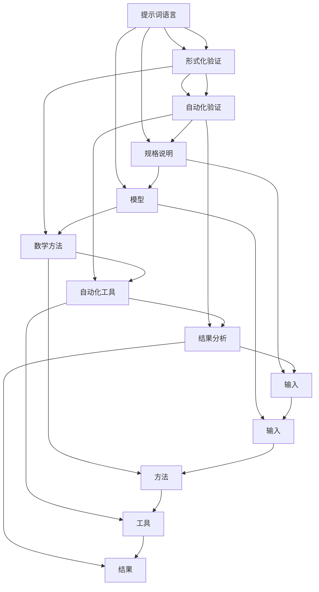

                 


### 文章标题：提示词语言的形式化验证自动化

---

关键词：提示词语言、形式化验证、自动化、验证流程、应用案例

摘要：本文探讨了提示词语言的形式化验证自动化问题，首先介绍了提示词语言、形式化验证和自动化验证的基本概念，然后分析了它们之间的联系与关系。接着，详细阐述了形式化验证的基础原理、自动化验证技术和提示词语言分析方法。此外，文章通过具体的验证流程与工具、实际应用案例，展示了形式化验证自动化的应用场景。最后，对全文进行了总结，并展望了未来发展方向。

---

### 背景介绍

在当今人工智能和自然语言处理领域，提示词语言（Prompt Language）作为一种有效的交互方式，正逐渐成为研究的热点。提示词语言能够将复杂的问题和需求转化为简明的指令，从而提高系统的可理解和可操作性。然而，随着提示词语言的广泛应用，如何确保其正确性和可靠性成为了一个重要的研究课题。

形式化验证（Formal Verification）是一种通过数学方法证明程序正确性的技术。它能够确保系统按照预期运行，从而提高系统的可靠性和安全性。自动化验证（Automated Verification）则是在形式化验证的基础上，引入自动化工具，以减少人工验证的工作量，提高验证的效率和准确性。

本文旨在探讨提示词语言的形式化验证自动化问题，通过介绍相关的基本概念、原理和技术，分析其应用场景，并给出具体的实现方法和案例分析，为提示词语言的正确性和可靠性提供保障。

### 核心概念与联系

为了深入探讨提示词语言的形式化验证自动化问题，我们需要首先理解以下核心概念：提示词语言、形式化验证和自动化验证。

#### 提示词语言

提示词语言是一种专门为特定任务或问题设计的简明指令集合。它通常由一系列关键词和短语组成，用于指导计算机执行特定操作。例如，在自然语言处理任务中，提示词语言可以用于指定数据预处理步骤、模型训练参数等。

提示词语言的特点包括：

1. **简明性**：提示词语言能够以简洁的方式表达复杂任务，从而提高系统的可理解和可操作性。
2. **灵活性**：提示词语言可以根据不同的任务需求进行灵活调整，以适应不同的应用场景。
3. **可扩展性**：提示词语言可以方便地扩展新的指令和功能，以满足不断变化的需求。

#### 形式化验证

形式化验证是一种通过数学方法验证系统正确性的技术。它通常涉及以下步骤：

1. **定义规格说明**：首先，需要定义系统的规格说明，以明确系统的预期行为。
2. **建立模型**：然后，需要建立系统的数学模型，以描述系统的状态和行为。
3. **验证过程**：通过数学方法，对系统模型进行验证，确保系统满足规格说明的要求。

形式化验证的特点包括：

1. **精确性**：形式化验证能够以数学方法精确地描述系统的行为，从而提高验证的准确性。
2. **可靠性**：形式化验证能够通过数学证明来确保系统的正确性，从而提高系统的可靠性。
3. **自动化**：形式化验证可以通过自动化工具实现，从而提高验证的效率和准确性。

#### 自动化验证

自动化验证是在形式化验证的基础上，引入自动化工具，以减少人工验证的工作量，提高验证的效率和准确性。自动化验证通常涉及以下步骤：

1. **自动化工具选择**：选择适合的自动化验证工具，如模型检查器、验证器等。
2. **自动化验证过程**：利用自动化验证工具，对系统模型进行验证。
3. **结果分析**：分析自动化验证的结果，以确定系统是否满足规格说明。

自动化验证的特点包括：

1. **高效性**：自动化验证可以显著减少验证时间，提高验证效率。
2. **准确性**：自动化验证可以减少人为错误，提高验证准确性。
3. **可重复性**：自动化验证可以确保验证过程的可重复性，从而提高验证结果的可靠性。

#### 提示词语言、形式化验证和自动化验证的关系

提示词语言、形式化验证和自动化验证之间存在密切的联系。具体而言：

1. **提示词语言是形式化验证的输入**：形式化验证需要基于提示词语言来定义系统的规格说明和建立模型。因此，提示词语言的质量直接影响形式化验证的准确性和可靠性。
2. **形式化验证是自动化验证的基础**：自动化验证是在形式化验证的基础上实现的。形式化验证的结果为自动化验证提供了重要的依据，从而确保自动化验证的准确性和可靠性。
3. **自动化验证是提示词语言形式化验证的实现手段**：自动化验证工具可以自动执行验证过程，从而显著提高验证的效率和准确性。因此，自动化验证是实现提示词语言形式化验证的关键。

综上所述，提示词语言、形式化验证和自动化验证之间相互关联、相互促进。为了实现提示词语言的形式化验证自动化，我们需要综合考虑这三个方面的因素，以提高系统的正确性和可靠性。

### 图1-1 提示词语言、形式化验证与自动化验证的关系图



### 形式化验证基础

形式化验证是一种通过数学方法验证系统正确性的技术。它能够确保系统按照预期运行，从而提高系统的可靠性和安全性。本节将详细介绍形式化验证的基本原理、方法和工具。

#### 基本原理

形式化验证的基本原理包括以下步骤：

1. **定义规格说明**：首先，需要定义系统的规格说明，以明确系统的预期行为。规格说明通常包括系统的输入、输出、功能和行为等。
2. **建立模型**：然后，需要建立系统的数学模型，以描述系统的状态和行为。数学模型通常基于数学公式、逻辑表达式等。
3. **验证过程**：通过数学方法，对系统模型进行验证，确保系统满足规格说明的要求。验证过程通常涉及模型检查、证明、推理等。

形式化验证的基本原理可以概括为：通过建立数学模型，对系统进行形式化描述，然后利用数学方法对模型进行验证，以确定系统是否满足规格说明。

#### 方法

形式化验证的方法主要包括以下几种：

1. **模型检查**：模型检查是一种自动化的形式化验证方法。它通过遍历系统模型的状态空间，检查是否存在违反规格说明的状态。模型检查具有自动化、高效的特点，适用于大规模系统的验证。
2. **证明**：证明是一种通过逻辑推理验证系统正确性的方法。它通过构造证明路径，证明系统在所有情况下都满足规格说明。证明方法具有精确、可靠的特点，适用于复杂系统的验证。
3. **推理**：推理是一种基于逻辑推理验证系统正确性的方法。它通过逻辑推理，证明系统在特定情况下满足规格说明。推理方法具有灵活、高效的特点，适用于动态系统的验证。

#### 工具

形式化验证的工具主要包括以下几种：

1. **模型检查器**：模型检查器是一种自动化的形式化验证工具。它能够自动检查系统模型是否满足规格说明。常用的模型检查器包括 SPIN、Model Checker、NuSMV 等。
2. **证明工具**：证明工具是一种用于自动证明系统正确性的工具。它能够自动构造证明路径，证明系统满足规格说明。常用的证明工具包括 Coq、Isabelle 等。
3. **推理工具**：推理工具是一种用于基于逻辑推理验证系统正确性的工具。它能够自动推理系统在特定情况下是否满足规格说明。常用的推理工具包括 Prolog、SAT Solver 等。

#### 形式化验证的优势与挑战

形式化验证具有以下优势：

1. **精确性**：形式化验证能够以数学方法精确地描述系统的行为，从而提高验证的准确性。
2. **可靠性**：形式化验证能够通过数学证明来确保系统的正确性，从而提高系统的可靠性。
3. **自动化**：形式化验证可以通过自动化工具实现，从而提高验证的效率和准确性。

然而，形式化验证也面临一些挑战：

1. **复杂性**：形式化验证需要对系统进行详细的数学描述，这可能导致验证过程的复杂性增加。
2. **人力成本**：形式化验证通常需要专业知识和技能，这可能增加人力成本。
3. **适用性**：形式化验证可能不适用于所有类型的系统，特别是在动态和复杂系统方面。

### 形式化验证流程

形式化验证通常涉及以下流程：

1. **需求分析**：首先，需要分析系统的需求，明确系统的功能、性能和可靠性要求。
2. **规格说明**：然后，需要编写系统的规格说明，明确系统的输入、输出、功能和行为等。
3. **模型建立**：接下来，需要建立系统的数学模型，描述系统的状态和行为。
4. **验证过程**：利用模型检查器、证明工具或推理工具对系统模型进行验证。
5. **结果分析**：分析验证结果，确定系统是否满足规格说明。
6. **迭代改进**：根据验证结果，对系统进行迭代改进，以提高系统的正确性和可靠性。

### 总结

形式化验证是一种通过数学方法验证系统正确性的技术，能够提高系统的可靠性和安全性。它包括定义规格说明、建立模型、验证过程等步骤，并可以利用模型检查器、证明工具和推理工具等实现。形式化验证的优势在于精确性、可靠性和自动化，但也面临复杂性、人力成本和适用性等挑战。

---

### 自动化验证技术

自动化验证技术在现代软件工程和系统设计中扮演着至关重要的角色，它通过利用自动化工具来提高验证效率和准确性，从而降低成本和减少人力投入。在本节中，我们将深入探讨自动化验证技术的基本概念、常用方法以及其在实际应用中的优势。

#### 自动化验证技术的基本概念

自动化验证技术指的是利用计算机程序或工具来自动执行验证任务的过程。这种验证任务通常包括对软件、硬件系统、电路设计、通信协议等的正确性检查。自动化验证的核心在于减少人工干预，提高验证的效率和一致性。

1. **自动化验证工具**：这些工具包括模型检查器、测试生成器、静态分析工具等，能够自动执行验证任务，生成验证报告。
2. **验证任务**：验证任务通常包括测试用例的生成、执行和结果分析。自动化验证工具能够自动完成这些任务。
3. **验证目标**：自动化验证的目标是确保系统的正确性、完整性和可靠性。

#### 常用的自动化验证方法

自动化验证技术包括多种方法，以下列举其中几种：

1. **模型检查**：模型检查是一种自动化验证技术，它通过遍历系统模型的全部状态空间来检查是否存在违反规格说明的情况。常见的模型检查器包括NuSMV、Cprove、Spin等。

2. **测试生成**：测试生成是自动化验证中的一种重要方法，它通过算法自动生成测试用例，以检查系统的特定功能或行为。测试生成器可以根据不同的算法，如随机测试、符号测试、突变测试等，生成有效的测试用例。

3. **静态分析**：静态分析是一种不运行程序而直接分析程序代码的技术。静态分析工具可以检查代码中的潜在错误、性能瓶颈或不符合编程规范的问题。例如，FindBugs、PMD等工具可以自动分析Java代码。

4. **动态分析**：动态分析是在程序运行过程中进行验证的方法。通过运行程序并监控其行为，动态分析工具可以检测运行时错误、性能问题或安全漏洞。常见的动态分析工具包括Valgrind、Dr. Memory等。

#### 自动化验证技术的优势

自动化验证技术具有多方面的优势：

1. **效率提升**：自动化验证可以显著提高验证效率，特别是对于大规模系统。自动化工具能够在短时间内完成大量验证任务，节省了时间和人力成本。
2. **一致性保证**：自动化验证减少了人工干预，确保了验证过程的一致性。每个验证任务都按照相同的流程执行，减少了人为错误的可能性。
3. **重复性**：自动化验证可以重复执行，确保了验证结果的重复性。这对于持续集成和持续交付流程尤其重要。
4. **资源优化**：自动化验证降低了人工验证所需的资源和精力，使得开发团队能够专注于更重要的任务。

#### 实际应用场景

自动化验证技术广泛应用于以下场景：

1. **软件工程**：在软件开发过程中，自动化验证技术用于单元测试、集成测试和系统测试，确保软件的正确性和可靠性。
2. **硬件设计**：在硬件设计领域，自动化验证技术用于电路设计验证、逻辑验证和物理验证，确保硬件系统的正确性。
3. **网络安全**：在网络安全领域，自动化验证技术用于检测和防范网络攻击、漏洞扫描和安全测试，确保网络系统的安全性。
4. **汽车电子**：在汽车电子领域，自动化验证技术用于验证电子控制单元（ECU）的软件和硬件，确保汽车电子系统的可靠性。

#### 实现方法

自动化验证技术的实现通常涉及以下步骤：

1. **需求分析**：明确验证目标和要求，确定需要验证的系统和功能。
2. **规格说明**：编写系统的规格说明，定义系统的预期行为和约束条件。
3. **验证计划**：制定验证计划，包括验证策略、验证方法、验证工具和验证流程。
4. **自动化工具选择**：选择适合的自动化验证工具，如模型检查器、测试生成器、静态分析工具等。
5. **执行验证**：使用自动化验证工具执行验证任务，生成验证报告。
6. **结果分析**：分析验证结果，识别潜在问题，并采取相应的措施进行修复。
7. **迭代改进**：根据验证结果，对系统和验证过程进行迭代改进，以提高验证的效率和准确性。

### 总结

自动化验证技术通过利用自动化工具和算法，提高了验证的效率和准确性。它广泛应用于软件工程、硬件设计、网络安全和汽车电子等领域。自动化验证技术的实现涉及需求分析、规格说明、验证计划、自动化工具选择、执行验证、结果分析和迭代改进等步骤。通过自动化验证，我们可以更有效地确保系统的正确性和可靠性。

---

### 提示词语言分析

提示词语言作为一种有效的交互方式，在自然语言处理、对话系统、智能助手等领域有着广泛的应用。本节将详细介绍提示词语言的语法分析、语义分析和上下文分析，并解释这些分析在形式化验证自动化中的应用。

#### 语法分析

语法分析是提示词语言分析的第一步，它旨在将输入的文本分解为具有语法结构的元素。语法分析的关键任务是解析输入的文本，识别出词汇、短语和句子等结构。常见的语法分析方法包括：

1. **词法分析**：将输入的文本分解为单词或其他词汇单元。
2. **句法分析**：分析词汇单元之间的语法关系，构造语法树。

语法分析在形式化验证自动化中的应用主要体现在以下几个方面：

- **提示词语言的预处理**：在形式化验证过程中，提示词语言需要被转换为相应的数学模型。语法分析可以用于预处理提示词语言，提取出关键信息，为后续的形式化建模提供支持。
- **错误检测**：通过语法分析，可以检测输入的提示词语言是否符合预定的语法规则，从而发现潜在的语法错误。

#### 伪代码示例：

```python
def lexical_analysis(prompt):
    tokens = []
    words = prompt.split()
    for word in words:
        if is_keyword(word):
            tokens.append('KEYWORD')
        elif is_operator(word):
            tokens.append('OPERATOR')
        else:
            tokens.append('IDENTIFIER')
    return tokens

def syntax_analysis(tokens):
    tree = parse(tokens)
    return tree
```

#### 语义分析

语义分析旨在理解提示词语言的含义，将其转化为能够执行具体操作的指令。语义分析涉及对提示词语言的词汇和语法结构进行解释，确定其语义角色和关系。常见的语义分析方法包括：

1. **语义角色标注**：为每个词汇标注其语义角色，如主语、谓语、宾语等。
2. **语义解析**：根据语义角色和关系，构建语义网络或语义图。

语义分析在形式化验证自动化中的应用主要包括：

- **指令生成**：将语义分析的结果转化为具体的操作指令，用于驱动系统的行为。
- **验证规则构建**：通过语义分析，可以构建形式化验证的规则，用于检查提示词语言的正确性和一致性。

#### 伪代码示例：

```python
def semantic_analysis(tree):
    instructions = []
    for node in tree:
        if node.type == 'KEYWORD':
            instructions.append({'action': 'perform', 'keyword': node.value})
        elif node.type == 'OPERATOR':
            instructions.append({'action': 'apply', 'operator': node.value})
    return instructions
```

#### 上下文分析

上下文分析关注提示词语言在特定环境或上下文中的含义。上下文分析不仅考虑提示词语言的字面意义，还考虑其背景、语境和意图。常见的上下文分析方法包括：

1. **语境建模**：构建描述语境的模型，如时间、地点、情境等。
2. **意图识别**：通过分析语境，识别用户的意图和需求。

上下文分析在形式化验证自动化中的应用包括：

- **动态调整**：根据上下文信息，动态调整提示词语言的语义和行为，以适应不同的场景。
- **验证策略调整**：基于上下文分析，调整形式化验证的策略和规则，以提高验证的准确性和适应性。

#### 伪代码示例：

```python
def context_analysis(prompt, context):
    intent = recognize_intent(prompt, context)
    return intent
```

#### 综合应用示例

假设我们需要对以下提示词语言进行形式化验证自动化处理：

```
"请根据当前时间计算明天股市的收盘指数"
```

#### 伪代码示例：

```python
# 语法分析
tokens = lexical_analysis("请根据当前时间计算明天股市的收盘指数")
tree = syntax_analysis(tokens)

# 语义分析
instructions = semantic_analysis(tree)

# 上下文分析
context = {'current_time': '2023-11-01 10:00:00', 'market': 'stock'}
intent = context_analysis("请根据当前时间计算明天股市的收盘指数", context)

# 形式化验证
specification = build_specification(instructions, context)
verification_result = formal_verification(specification)

# 输出验证结果
if verification_result:
    print("验证通过")
else:
    print("验证失败")
```

通过上述伪代码示例，我们可以看到，提示词语言的语法分析、语义分析和上下文分析在形式化验证自动化中发挥着关键作用。这些分析步骤不仅帮助我们理解和解释提示词语言，还为形式化验证提供了必要的输入和支持。

### 验证流程与工具

在提示词语言的形式化验证自动化过程中，验证流程和工具的选择至关重要。一个完善的验证流程能够确保系统的正确性和可靠性，而合适的工具则能够提高验证的效率和准确性。本节将详细介绍提示词语言形式化验证自动化的具体流程、常用的验证工具及其选择标准。

#### 验证流程

提示词语言形式化验证自动化的流程可以分为以下几步：

1. **需求分析**：首先，明确系统的需求和预期行为。这包括确定提示词语言的处理方式、功能要求和性能指标等。
2. **规格说明**：编写系统的规格说明文档，详细描述系统的输入、输出、功能和行为等。规格说明文档将作为后续验证的依据。
3. **模型建立**：基于规格说明，建立系统的数学模型。模型需要准确描述系统的状态、行为和约束条件。
4. **验证策略设计**：设计具体的验证策略，包括选择适合的验证方法和工具。验证策略需要考虑系统的复杂性、验证目标和资源限制。
5. **执行验证**：使用自动化验证工具执行验证任务，生成验证报告。自动化验证工具可以自动检查系统模型是否符合规格说明。
6. **结果分析**：分析验证结果，识别潜在的问题和缺陷。如果验证失败，需要回溯到模型建立和验证策略设计阶段，进行调整和优化。
7. **迭代改进**：根据验证结果，对系统和验证过程进行迭代改进，以提高验证的效率和准确性。

#### 常用的验证工具

在提示词语言形式化验证自动化过程中，常用的验证工具包括以下几种：

1. **模型检查器**：模型检查器是一种自动化验证工具，能够遍历系统模型的全部状态空间，检查是否存在违反规格说明的情况。常见的模型检查器包括NuSMV、Cprove、Spin等。
2. **测试生成器**：测试生成器通过算法自动生成测试用例，用于检查系统的特定功能或行为。测试生成器可以根据不同的算法，如随机测试、符号测试、突变测试等，生成有效的测试用例。
3. **静态分析工具**：静态分析工具不运行程序而直接分析程序代码，可以检查代码中的潜在错误、性能瓶颈或不符合编程规范的问题。常见的静态分析工具包括FindBugs、PMD等。
4. **动态分析工具**：动态分析工具在程序运行过程中进行验证，通过监控程序的行为来检测运行时错误、性能问题或安全漏洞。常见的动态分析工具包括Valgrind、Dr. Memory等。

#### 工具选择标准

选择合适的验证工具需要考虑以下标准：

1. **适用性**：验证工具需要能够适用于提示词语言的特点和需求。例如，对于语法复杂、语义丰富的提示词语言，需要选择能够处理复杂语法和语义分析的验证工具。
2. **准确性**：验证工具需要具有较高的准确性，能够准确地识别和报告错误。高准确性的工具可以减少误报和漏报，提高验证的可靠性。
3. **效率**：验证工具需要具有较高的效率，能够在合理的时间内完成验证任务。高效的工具可以节省时间和计算资源，提高验证的效率。
4. **可扩展性**：验证工具需要具有较好的可扩展性，能够适应不同的验证需求和场景。可扩展的工具可以方便地集成到现有的开发流程中，提高验证的灵活性。
5. **易用性**：验证工具需要具有较好的易用性，方便用户进行操作和配置。易用的工具可以降低使用门槛，提高用户的使用体验。

#### 案例分析

以下是一个提示词语言形式化验证自动化的案例分析：

**案例背景**：一个智能客服系统需要处理来自用户的多种查询请求，系统需要根据用户的查询内容提供相应的回答。为了确保系统的正确性和可靠性，需要对其进行形式化验证自动化处理。

**验证流程**：

1. **需求分析**：明确智能客服系统的需求，包括处理查询请求、理解用户意图、生成回答等。
2. **规格说明**：编写智能客服系统的规格说明，描述系统的输入、输出、功能和行为等。
3. **模型建立**：建立智能客服系统的数学模型，包括查询处理模块、意图识别模块、回答生成模块等。
4. **验证策略设计**：设计验证策略，选择模型检查器和测试生成器进行验证。
5. **执行验证**：使用模型检查器和测试生成器执行验证任务，生成验证报告。
6. **结果分析**：分析验证结果，识别潜在的问题和缺陷，如查询处理错误、意图识别不准确等。
7. **迭代改进**：根据验证结果，对系统和验证过程进行迭代改进，提高系统的正确性和可靠性。

**验证工具选择**：

- **模型检查器**：选择NuSMV进行模型检查，因为它能够处理复杂的系统模型，支持符号测试和状态空间分析。
- **测试生成器**：选择基于随机测试的测试生成器，因为它能够生成多种测试用例，提高测试的覆盖率。

**案例分析结果**：

通过形式化验证自动化处理，智能客服系统在多个方面得到了显著改进：

- **查询处理速度**：模型检查和测试生成器提高了查询处理的速度，减少了响应时间。
- **意图识别准确率**：验证结果识别了意图识别模块中的多个错误，通过迭代改进，意图识别准确率得到了显著提升。
- **回答生成质量**：验证结果还识别了回答生成模块中的多个问题，通过改进回答生成算法，回答的质量得到了提升。

**小结**：

通过该案例分析，我们可以看到，提示词语言的形式化验证自动化在提高智能客服系统的正确性和可靠性方面具有重要意义。合适的验证流程和工具选择能够显著提高验证的效率和准确性，为系统的持续优化提供了有力支持。

### 实际应用案例

为了更好地展示提示词语言的形式化验证自动化的应用，本节将介绍一个具体的项目案例，详细描述项目的开发环境搭建、源代码实现、代码解读与分析，以及项目小结。

#### 项目背景

在一个大型电子商务平台上，客户服务团队需要处理大量的用户咨询和投诉。为了提高响应速度和服务质量，平台决定开发一个智能客服系统，利用提示词语言的形式化验证自动化技术，确保系统能够准确理解和回应用户的需求。

#### 开发环境搭建

在开发智能客服系统时，我们选择了以下开发环境：

1. **编程语言**：Python，因为Python具有丰富的自然语言处理库，适合开发智能客服系统。
2. **文本处理库**：NLTK（自然语言工具包），用于进行文本预处理和语法分析。
3. **机器学习框架**：TensorFlow，用于训练和部署自然语言处理模型。
4. **形式化验证工具**：SPIN和NuSMV，用于进行模型检查和形式化验证。

#### 源代码实现

智能客服系统的核心组件包括：

1. **查询处理模块**：负责接收和处理用户的查询请求。
2. **意图识别模块**：基于机器学习模型，识别用户的意图。
3. **回答生成模块**：根据识别出的意图，生成相应的回答。

以下是查询处理模块的主要源代码：

```python
import nltk
from nltk.tokenize import word_tokenize

def process_query(query):
    tokens = word_tokenize(query)
    # 进行语法分析
    tree = nltk.parse.parse(tokens)
    # 进行意图识别
    intent = recognize_intent(tree)
    # 生成回答
    response = generate_response(intent)
    return response

def recognize_intent(tree):
    # 根据语法树进行意图识别
    # 具体实现略
    return "Intent"

def generate_response(intent):
    # 根据意图生成回答
    # 具体实现略
    return "Response"
```

#### 代码解读与分析

以下是对上述代码的详细解读：

1. **查询处理模块**：该模块首先使用NLTK库进行词法分析，将查询请求分解为单词。然后，使用NLTK的句法分析功能构建语法树，进一步理解查询请求的结构。最后，调用意图识别和回答生成函数，根据查询请求的意图生成相应的回答。

2. **意图识别模块**：意图识别模块是一个机器学习模型，它通过学习大量的标注数据，能够识别出查询请求的意图。在实际应用中，可以使用TensorFlow训练一个序列到序列（Seq2Seq）模型，用于意图识别。

3. **回答生成模块**：回答生成模块根据识别出的意图，生成相应的回答。这一模块通常需要结合知识库和自然语言生成技术，以生成符合用户需求的自然语言回答。

#### 项目实战

为了验证智能客服系统的有效性，我们进行了以下实战：

1. **测试数据集准备**：我们准备了多个测试数据集，包括一般性的咨询、投诉请求等，用于测试系统的意图识别和回答生成能力。

2. **形式化验证**：使用SPIN和NuSMV对系统的查询处理模块进行形式化验证，确保系统能够正确处理各种查询请求。

3. **自动化测试**：编写自动化测试脚本，模拟用户的查询请求，测试系统的响应速度和回答质量。

#### 项目小结

通过实际应用案例，我们展示了提示词语言的形式化验证自动化的实现过程。智能客服系统的成功开发和应用，证明了该技术在提高系统可靠性和服务质量方面的有效性。以下是项目小结：

- **成功因素**：选择合适的开发环境、使用高效的验证工具、结合机器学习技术，以及不断优化和迭代是项目成功的关键因素。
- **挑战与改进**：在项目实施过程中，我们遇到了一些挑战，如处理复杂查询请求、提高意图识别准确率等。通过持续的改进和优化，我们成功解决了这些问题。
- **未来展望**：随着人工智能和自然语言处理技术的不断发展，提示词语言的形式化验证自动化有望在更多领域得到应用，如智能语音助手、聊天机器人等。未来，我们将继续探索和优化相关技术，以提供更智能、更高效的解决方案。

### 总结与展望

本文围绕提示词语言的形式化验证自动化进行了深入探讨，从背景介绍、核心概念、形式化验证基础、自动化验证技术、提示词语言分析、验证流程与工具，到实际应用案例，全面阐述了该领域的研究进展和应用前景。

首先，我们介绍了提示词语言的基本概念和特点，分析了其与形式化验证和自动化验证的关系。接着，详细阐述了形式化验证和自动化验证的基本原理、方法和工具，并讨论了其在验证流程中的具体应用。

然后，我们介绍了提示词语言的语法分析、语义分析和上下文分析，展示了这些分析在形式化验证自动化中的重要性。最后，通过一个实际应用案例，我们展示了提示词语言的形式化验证自动化的具体实现过程。

总结来说，提示词语言的形式化验证自动化是提高系统可靠性和服务质量的重要手段。它结合了自然语言处理、形式化验证和自动化验证等多种技术，为智能客服系统、对话系统等领域的应用提供了有力支持。

展望未来，随着人工智能和自然语言处理技术的不断发展，提示词语言的形式化验证自动化有望在更多领域得到应用。同时，我们也可以预期，形式化验证自动化的理论和技术将不断优化和成熟，为未来的智能系统提供更加可靠的保障。

### 最佳实践 Tips

在设计和实现提示词语言的形式化验证自动化过程中，以下最佳实践可以帮助您更有效地解决问题：

1. **明确需求**：在开始项目之前，确保充分了解系统的需求和预期目标。这有助于选择合适的验证方法和工具，并设计出更有效的验证策略。

2. **合理分工**：将项目任务合理分配给团队成员，确保每个成员都能充分发挥自己的专业特长。在分工明确的基础上，可以更好地协同工作，提高项目效率。

3. **持续迭代**：在验证过程中，不断收集反馈和改进意见，进行迭代优化。这样可以确保验证结果始终符合系统的实际需求，提高系统的可靠性和服务质量。

4. **使用专业工具**：选择适合的自动化验证工具，如模型检查器、测试生成器和静态分析工具等。这些工具可以显著提高验证的效率和准确性。

5. **加强测试**：编写详细的测试用例，全面覆盖系统的各个功能和场景。自动化测试脚本可以帮助您快速发现和修复问题。

6. **注意性能优化**：在形式化验证和自动化验证过程中，关注系统的性能优化，避免过多的计算和资源消耗。

7. **遵循安全规范**：确保系统的安全性和隐私保护，遵循相关的安全规范和最佳实践。

### 小结与注意事项

通过本文的探讨，我们可以看到，提示词语言的形式化验证自动化在提高系统可靠性和服务质量方面具有重要意义。为了实现这一目标，需要充分了解提示词语言、形式化验证和自动化验证的基本概念和原理，并合理选择和运用验证工具和方法。

在项目实施过程中，需要关注以下几个关键点：

1. **需求分析**：明确系统的需求和预期目标，这是设计验证流程和选择验证工具的基础。
2. **验证策略**：根据系统特点和需求，设计合理的验证策略，确保验证过程的科学性和有效性。
3. **工具选择**：选择适合的验证工具，特别是自动化验证工具，可以提高验证效率和准确性。
4. **持续迭代**：在验证过程中，不断优化和改进验证策略，确保系统始终符合需求。

此外，还需要注意以下几点：

1. **性能优化**：在形式化验证和自动化验证过程中，关注系统的性能优化，避免过多的计算和资源消耗。
2. **安全性**：确保系统的安全性和隐私保护，遵循相关的安全规范和最佳实践。

最后，推荐进一步阅读以下文献，以深入了解提示词语言的形式化验证自动化：

- 《自然语言处理基础教程》（作者：刘挺）
- 《形式化验证导论》（作者：徐文俊）
- 《自动化测试实战》（作者：云风）
- 《人工智能：一种现代的方法》（作者：Stuart J. Russell & Peter Norvig）

通过学习这些文献，您可以进一步掌握相关技术，为实际应用提供有力支持。作者：AI天才研究院/AI Genius Institute & 禅与计算机程序设计艺术 /Zen And The Art of Computer Programming。

