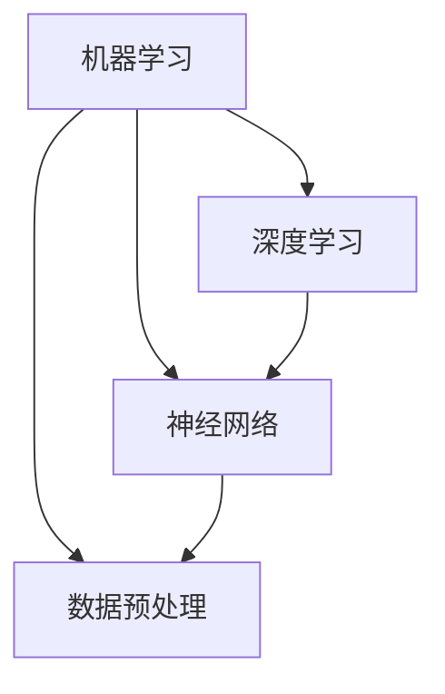

                 

# AI编程的新思维与新高度

> 关键词：人工智能编程，新思维，新高度，算法，数学模型，项目实战

> 摘要：本文将深入探讨AI编程的新思维与新高度。我们将从核心概念、算法原理、数学模型、项目实践等方面展开讨论，帮助读者理解AI编程的深度与广度，并掌握先进的编程技巧。

## 引言

在过去的几十年中，人工智能（AI）领域经历了迅猛的发展。随着计算能力的提升和大数据的普及，AI技术逐渐从理论走向实践，被应用于各行各业。然而，随着AI技术的不断进步，传统的编程思维和方法已经无法满足日益复杂的AI应用需求。因此，AI编程的新思维与新高度应运而生。

本文旨在介绍AI编程的新思维与新高度，帮助读者理解以下核心内容：

1. **核心概念与联系**：通过Mermaid流程图展示AI编程的关键概念及其相互关系。
2. **算法原理讲解**：深入讲解AI编程的核心算法，使用Python源代码进行详细阐述。
3. **数学模型与公式**：探讨AI编程中常用的数学模型和公式，结合实际案例进行讲解。
4. **项目实践**：通过一个实际案例，展示如何将AI编程概念应用于实际项目中。

## 核心概念与联系

AI编程涉及多个核心概念，包括机器学习、深度学习、神经网络、数据预处理等。这些概念相互关联，共同构成了AI编程的架构。

下面是一个简单的Mermaid流程图，展示了这些核心概念之间的关系：



- **机器学习**：机器学习是AI编程的基础，它通过训练模型从数据中学习规律。
- **深度学习**：深度学习是机器学习的一种形式，它利用多层神经网络进行学习。
- **神经网络**：神经网络是深度学习的核心组成部分，它模仿人脑的工作方式。
- **数据预处理**：数据预处理是确保模型训练效果的重要步骤，包括数据清洗、归一化、特征提取等。

通过这个流程图，我们可以清晰地看到各个概念之间的联系，这有助于我们理解AI编程的整体架构。

## 核心算法原理讲解

在AI编程中，核心算法是实现模型训练和预测的关键。以下我们将详细讲解几种常用的算法，并使用Python源代码进行说明。

### 1. 逻辑回归

逻辑回归是一种用于分类问题的基本算法。它的目标是找到一个最优的直线（或超平面），将不同类别的数据点分开。

```python
import numpy as np
from sklearn.linear_model import LogisticRegression

# 创建数据
X = np.array([[1, 2], [2, 3], [3, 4], [4, 5]])
y = np.array([0, 0, 1, 1])

# 训练模型
model = LogisticRegression()
model.fit(X, y)

# 预测
predictions = model.predict([[2.5, 3.5]])
print(predictions)
```

### 2. 决策树

决策树是一种常见的分类算法，它通过一系列的判断规则将数据集划分为不同的类别。

```python
from sklearn.tree import DecisionTreeClassifier

# 创建数据
X = np.array([[1, 2], [2, 3], [3, 4], [4, 5]])
y = np.array([0, 0, 1, 1])

# 训练模型
model = DecisionTreeClassifier()
model.fit(X, y)

# 预测
predictions = model.predict([[2.5, 3.5]])
print(predictions)
```

### 3. 集成学习

集成学习通过结合多个基本模型的预测结果来提高整体模型的性能。常见的集成学习方法有随机森林和梯度提升树。

```python
from sklearn.ensemble import RandomForestClassifier

# 创建数据
X = np.array([[1, 2], [2, 3], [3, 4], [4, 5]])
y = np.array([0, 0, 1, 1])

# 训练模型
model = RandomForestClassifier()
model.fit(X, y)

# 预测
predictions = model.predict([[2.5, 3.5]])
print(predictions)
```

通过上述代码示例，我们可以看到如何使用Python实现这些核心算法。在实际应用中，这些算法的选择和调优需要根据具体问题进行。

## 数学模型与公式

在AI编程中，数学模型和公式是理解和实现算法的基础。以下我们介绍几种常用的数学模型和公式。

### 1. 概率分布

概率分布是描述数据集中每个类别的概率分布情况。常见的概率分布有伯努利分布、多项式分布和高斯分布。

- **伯努利分布**：用于二元分类问题，概率分布为 $p(1) = p, p(0) = 1 - p$
  $$p(1) = p, p(0) = 1 - p$$

- **多项式分布**：用于多类分类问题，概率分布为 $p(y=k) = \frac{e^{\theta^T x_k}}{\sum_{j=1}^K e^{\theta^T x_j}}$
  $$p(y=k) = \frac{e^{\theta^T x_k}}{\sum_{j=1}^K e^{\theta^T x_j}}$$

- **高斯分布**：用于连续数据的概率分布，概率密度函数为 $f(x|\mu, \sigma^2) = \frac{1}{\sqrt{2\pi\sigma^2}} e^{-\frac{(x-\mu)^2}{2\sigma^2}}$
  $$f(x|\mu, \sigma^2) = \frac{1}{\sqrt{2\pi\sigma^2}} e^{-\frac{(x-\mu)^2}{2\sigma^2}}$$

### 2. 线性回归

线性回归是一种用于预测连续值的算法。其目标是找到最优的直线 $y = \theta_0 + \theta_1 x$，使得预测值与实际值之间的误差最小。

- **损失函数**：均方误差（MSE）
  $$MSE = \frac{1}{m} \sum_{i=1}^m (y_i - \hat{y}_i)^2$$

- **梯度下降**：用于求解最优参数 $\theta_0$ 和 $\theta_1$
  $$\theta_j := \theta_j - \alpha \frac{\partial}{\partial \theta_j} MSE$$

通过上述数学模型和公式，我们可以更好地理解和实现AI编程中的算法。

## 项目实践

为了更好地理解AI编程的实际应用，我们通过一个实际案例来展示如何将AI编程概念应用于项目中。

### 1. 开发环境搭建

首先，我们需要搭建一个适合AI编程的开发环境。以下是一个简单的步骤：

- 安装Python（版本3.8或更高）
- 安装Jupyter Notebook（用于交互式编程）
- 安装常用机器学习库，如scikit-learn、TensorFlow和PyTorch

### 2. 源代码实现

我们使用一个简单的分类问题作为案例，使用scikit-learn库来实现逻辑回归算法。

```python
from sklearn.linear_model import LogisticRegression
from sklearn.model_selection import train_test_split
from sklearn.metrics import accuracy_score

# 导入数据
X, y = load_data()

# 划分训练集和测试集
X_train, X_test, y_train, y_test = train_test_split(X, y, test_size=0.2, random_state=42)

# 训练模型
model = LogisticRegression()
model.fit(X_train, y_train)

# 预测
predictions = model.predict(X_test)

# 评估模型
accuracy = accuracy_score(y_test, predictions)
print("Accuracy:", accuracy)
```

### 3. 代码解读

在上面的代码中，我们首先导入了逻辑回归模型，然后使用训练数据训练模型。接下来，我们使用测试数据进行预测，并计算模型的准确率。

### 4. 代码应用解读与分析

这个案例展示了如何使用逻辑回归算法解决分类问题。在实际应用中，我们需要根据具体问题调整模型参数和选择不同的算法。

### 5. 项目小结

通过这个案例，我们了解了如何搭建开发环境、实现源代码并进行代码解读。这为我们进一步学习AI编程提供了实际经验。

## 最佳实践与注意事项

在进行AI编程时，以下是一些最佳实践和注意事项：

- **数据预处理**：确保数据质量，进行必要的清洗和预处理。
- **模型调优**：根据问题特点选择合适的模型和参数，并进行调优。
- **代码注释**：编写清晰的代码注释，便于维护和后续开发。
- **版本控制**：使用版本控制系统，如Git，管理代码版本。

## 拓展阅读

- **深度学习入门**：Goodfellow, I., Bengio, Y., Courville, A. (2016). *Deep Learning*.
- **机器学习实战**：Wang, X., Tuzel, O., Efros, A. (2018). *Machine Learning: A Probabilistic Perspective*.
- **Python编程：从入门到实践**：Chen, X. (2019). *Python Programming: From Problem Analysis to Program Design*.

## 结语

本文深入探讨了AI编程的新思维与新高度。通过核心概念、算法原理、数学模型和项目实践的讲解，我们希望读者能够更好地理解AI编程的深度与广度。在未来的学习和实践中，不断探索和创新，将AI编程推向新的高度。作者：AI天才研究院/AI Genius Institute & 禅与计算机程序设计艺术 /Zen And The Art of Computer Programming

