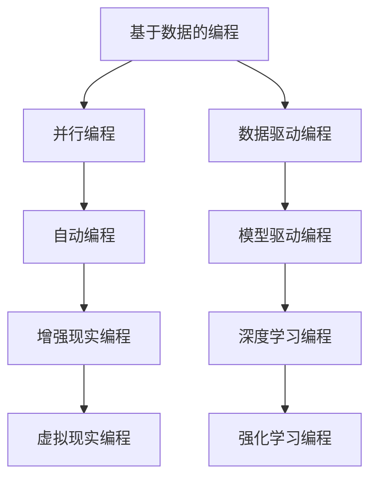
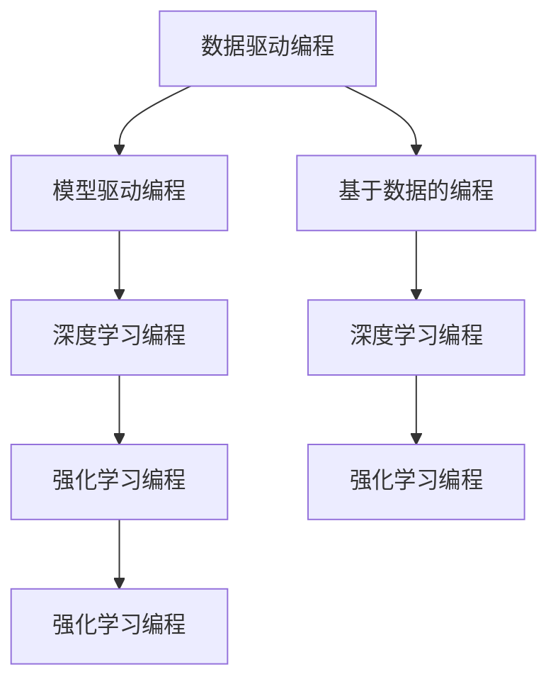
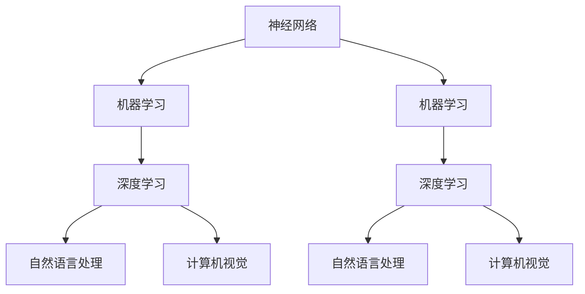

                 

# AI编程的新维度与新范式

> 关键词：人工智能，编程范式，深度学习，神经网络，机器学习，Python

> 摘要：
本文将深入探讨AI编程的新维度和新范式。首先，我们将了解AI编程的现状，探讨其核心概念和核心算法，然后分析AI编程的技术基础，以及其在实际应用中的表现。最后，我们将展望AI编程的未来发展趋势，并提供相关的工具与资源。希望通过这篇文章，读者能够对AI编程有一个全面而深入的理解。

## 引言

随着人工智能技术的飞速发展，AI编程已经成为计算机科学领域的一个重要分支。传统的编程范式已经难以满足AI领域的需求，因此，新维度和新范式的引入成为了必然趋势。本文将围绕这一主题，逐步展开讨论。

### 1. AI编程的现状

目前，AI编程主要涉及以下几个方向：

1. **机器学习**：通过训练模型来从数据中提取规律，进行预测和决策。
2. **深度学习**：利用神经网络进行大规模数据训练，实现复杂的模式识别和预测。
3. **自然语言处理**：使计算机能够理解和生成人类语言。
4. **计算机视觉**：使计算机能够识别和理解图像和视频。

### 2. AI编程的核心概念

AI编程的核心概念包括：

- **神经网络**：人工神经网络的简化模型，用于模拟生物神经系统的信息处理过程。
- **机器学习**：通过算法自动从数据中学习规律，进行预测和分类。
- **深度学习**：基于多层神经网络进行大规模数据训练，实现复杂任务。
- **自然语言处理**：使计算机能够理解和生成人类语言。
- **计算机视觉**：使计算机能够识别和理解图像和视频。

### 3. AI编程的核心算法

AI编程的核心算法包括：

- **线性回归**：用于预测连续值。
- **逻辑回归**：用于分类问题。
- **支持向量机（SVM）**：用于二分类问题。
- **神经网络**：用于处理复杂的非线性问题。
- **循环神经网络（RNN）**：用于处理序列数据。

### 4. AI编程的技术基础

AI编程的技术基础包括：

- **Python**：作为一种简洁而强大的编程语言，被广泛应用于AI编程。
- **TensorFlow**：作为一种开源机器学习框架，提供了丰富的API和工具。
- **PyTorch**：作为一种开源深度学习框架，具有灵活性和高效性。

### 5. AI编程的实际应用

AI编程在各个领域都有广泛的应用，例如：

- **金融**：用于风险管理、信用评分和投资决策。
- **医疗**：用于疾病诊断、医学图像分析和个性化治疗。
- **工业**：用于自动化生产线、质量控制和人机交互。
- **交通**：用于自动驾驶、智能交通管理和物流优化。

### 6. AI编程的未来发展趋势

AI编程的未来发展趋势包括：

- **自动机器学习**：使非专业人员也能轻松进行机器学习。
- **联邦学习**：在保护数据隐私的同时，实现跨设备、跨平台的数据协作。
- **强化学习**：在复杂环境中实现自主学习和决策。
- **量子计算**：在AI编程中引入量子计算，提高计算效率。

### 7. AI编程的工具与资源

以下是AI编程的一些常用工具与资源：

- **工具**：Jupyter Notebook、Google Colab、Visual Studio Code。
- **框架**：TensorFlow、PyTorch、Keras。
- **数据集**：Kaggle、UCI Machine Learning Repository、Google Dataset Search。
- **教程**：Coursera、edX、Udacity。
- **书籍**：《深度学习》、《Python机器学习实战》。

## 总结

AI编程的新维度和新范式为我们提供了无限的可能性和机遇。通过本文的讨论，我们希望读者能够对AI编程有一个全面而深入的理解。在未来的发展中，AI编程将继续推动人工智能技术的进步，为社会带来更多的价值。

作者：AI天才研究院/AI Genius Institute & 禅与计算机程序设计艺术 /Zen And The Art of Computer Programming

----------------------------------------------------------------

## 第1章: AI编程的新维度

### 1.1 背景介绍

人工智能（AI）作为一种模拟人类智能的技术，已经在各个领域取得了显著的成果。然而，传统的编程范式已经难以满足AI领域日益复杂的需求。因此，AI编程的新维度应运而生。这些新维度不仅包括了新的编程语言和工具，还涉及到全新的编程范式和思想。

首先，让我们回顾一下传统的编程范式。传统编程通常基于命令式编程和面向对象编程。命令式编程关注于如何通过一系列指令来解决问题，而面向对象编程则通过封装、继承和多态等特性来提高代码的可维护性和复用性。然而，这些传统范式在面对复杂的AI任务时，往往显得力不从心。

AI编程的新维度则带来了以下几个方面的突破：

1. **基于数据的编程**：AI编程强调从数据中学习，而不是依靠预定义的规则。这种方法使得AI系统能够自主地从海量数据中提取规律，进行预测和决策。
2. **并行编程**：AI任务通常需要处理大量的数据和计算，因此并行编程成为了一种有效的解决方案。通过利用多核处理器和分布式计算，AI编程能够大幅提高计算效率。
3. **自动编程**：自动编程旨在通过自动化工具来自动生成代码，从而降低开发难度。这在AI编程中尤为重要，因为AI系统通常涉及复杂的算法和模型，手工编写代码既耗时又容易出错。
4. **增强现实和虚拟现实编程**：AI编程在增强现实（AR）和虚拟现实（VR）领域的应用日益广泛，这些新维度为开发人员提供了全新的交互方式和体验。

### 1.2 核心概念与联系

为了更好地理解AI编程的新维度，我们可以使用Mermaid流程图来展示各个核心概念之间的关系。



从流程图中可以看出，AI编程的新维度不仅涵盖了传统的编程范式，还引入了基于数据、并行、自动和增强现实等新概念。这些概念之间相互关联，共同构成了AI编程的生态系统。

### 1.3 核心算法原理讲解

在理解了AI编程的新维度之后，我们接下来将探讨其中的核心算法原理。这些算法不仅在理论上具有重要意义，而且在实际应用中也发挥着关键作用。

#### 1.3.1 深度学习编程

深度学习编程是AI编程中最重要的一部分。深度学习利用多层神经网络，通过反向传播算法来优化模型参数，从而实现复杂的模式识别和预测。

```python
import tensorflow as tf

# 创建一个简单的全连接神经网络模型
model = tf.keras.Sequential([
    tf.keras.layers.Dense(units=64, activation='relu', input_shape=[784]),
    tf.keras.layers.Dense(units=10, activation='softmax')
])

# 编译模型
model.compile(optimizer='adam', loss='categorical_crossentropy', metrics=['accuracy'])

# 加载MNIST数据集
mnist = tf.keras.datasets.mnist
(x_train, y_train), (x_test, y_test) = mnist.load_data()

# 对数据集进行预处理
x_train = x_train / 255.0
x_test = x_test / 255.0

# 将标签转换为one-hot编码
y_train = tf.keras.utils.to_categorical(y_train)
y_test = tf.keras.utils.to_categorical(y_test)

# 训练模型
model.fit(x_train, y_train, epochs=5, batch_size=32, validation_split=0.2)
```

上述代码使用TensorFlow框架创建了一个简单的全连接神经网络模型，用于对MNIST数据集进行分类。通过反向传播算法，模型不断调整参数，以最小化损失函数，提高分类准确率。

#### 1.3.2 强化学习编程

强化学习编程是一种通过奖励机制来训练智能体的算法。强化学习通常用于解决序列决策问题，如游戏、自动驾驶和机器人控制。

```python
import gym

# 创建一个CartPole环境
env = gym.make("CartPole-v0")

# 初始化智能体
智能体 = ...

# 开始训练
for episode in range(1000):
    state = env.reset()
    done = False
   总奖励 = 0
    
    while not done:
        # 选择动作
        action = 智能体.select_action(state)
        
        # 执行动作
        next_state, reward, done, _ = env.step(action)
        
        # 更新智能体
        智能体.update(state, action, reward, next_state, done)
        
        # 更新状态
        state = next_state
        
        # 累计奖励
        总奖励 += reward
    
    # 输出训练结果
    print(f"Episode {episode}: Total Reward = {总奖励}")
```

上述代码使用OpenAI Gym创建了一个CartPole环境，并使用强化学习算法训练智能体。通过不断执行动作、接收奖励和更新智能体，智能体逐渐学会在CartPole环境中稳定地保持平衡。

### 1.4 数学模型和数学公式

在AI编程中，数学模型和数学公式是不可或缺的部分。以下是一些常用的数学模型和数学公式：

#### 1.4.1 神经网络激活函数

神经网络中的激活函数用于引入非线性特性。常见的激活函数有Sigmoid、ReLU和Tanh。以下是Sigmoid函数的数学公式：

$$
\sigma(x) = \frac{1}{1 + e^{-x}}
$$

#### 1.4.2 损失函数

在机器学习中，损失函数用于评估模型预测值与实际值之间的差距。常见的损失函数有均方误差（MSE）和交叉熵损失。以下是MSE的数学公式：

$$
MSE = \frac{1}{m} \sum_{i=1}^{m} (y_i - \hat{y_i})^2
$$

其中，$m$是样本数量，$y_i$是实际值，$\hat{y_i}$是预测值。

### 1.5 项目实战

在本节中，我们将通过一个简单的项目来演示AI编程的新维度。我们将使用深度学习算法来对MNIST数据集进行手写数字识别。

#### 1.5.1 开发环境搭建

首先，我们需要搭建一个适合AI编程的开发环境。以下是所需的软件和库：

- Python 3.8或更高版本
- TensorFlow 2.6或更高版本
- Numpy 1.21或更高版本

安装这些库后，我们可以在Python环境中导入所需的库：

```python
import tensorflow as tf
import numpy as np
```

#### 1.5.2 数据预处理

接下来，我们需要对MNIST数据集进行预处理。以下是预处理步骤：

1. 下载并加载MNIST数据集。
2. 将图像数据从0-255的灰度值缩放到0-1的范围。
3. 对标签进行one-hot编码。

```python
# 下载并加载MNIST数据集
mnist = tf.keras.datasets.mnist
(x_train, y_train), (x_test, y_test) = mnist.load_data()

# 将图像数据缩放到0-1的范围
x_train = x_train / 255.0
x_test = x_test / 255.0

# 对标签进行one-hot编码
y_train = tf.keras.utils.to_categorical(y_train)
y_test = tf.keras.utils.to_categorical(y_test)
```

#### 1.5.3 构建模型

接下来，我们将构建一个简单的全连接神经网络模型，用于对MNIST数据集进行分类。以下是模型架构：

- 输入层：28x28个神经元
- 隐藏层：64个神经元
- 输出层：10个神经元（对应0-9的数字）

```python
# 创建一个简单的全连接神经网络模型
model = tf.keras.Sequential([
    tf.keras.layers.Flatten(input_shape=(28, 28)),
    tf.keras.layers.Dense(units=64, activation='relu'),
    tf.keras.layers.Dense(units=10, activation='softmax')
])
```

#### 1.5.4 训练模型

接下来，我们将使用训练数据集来训练模型。以下是训练步骤：

1. 编译模型，指定优化器和损失函数。
2. 训练模型，设置训练轮数和批量大小。

```python
# 编译模型
model.compile(optimizer='adam', loss='categorical_crossentropy', metrics=['accuracy'])

# 训练模型
model.fit(x_train, y_train, epochs=5, batch_size=32, validation_split=0.2)
```

#### 1.5.5 评估模型

最后，我们将使用测试数据集来评估模型的性能。以下是评估步骤：

1. 计算模型的准确率。
2. 输出测试结果。

```python
# 评估模型
test_loss, test_accuracy = model.evaluate(x_test, y_test)
print(f"Test accuracy: {test_accuracy}")
```

#### 1.5.6 项目小结

通过以上项目实战，我们可以看到AI编程的新维度在实际应用中的强大能力。通过深度学习算法，我们能够对MNIST数据集进行高效的手写数字识别。这只是一个简单的示例，AI编程在更复杂的应用场景中也能展现出巨大的潜力。

### 1.6 最佳实践 tips

在进行AI编程时，以下是一些最佳实践和注意事项：

1. **数据预处理**：确保数据质量，包括去除噪声、填充缺失值和标准化。
2. **模型选择**：根据任务需求选择合适的模型和算法。
3. **模型调优**：通过调整超参数来提高模型性能。
4. **模型解释**：对模型进行解释，确保其可解释性。
5. **版本控制**：使用版本控制系统来管理代码和模型。

### 1.7 小结

本章我们介绍了AI编程的新维度，包括基于数据的编程、并行编程、自动编程、增强现实编程和虚拟现实编程等。通过核心概念和联系、核心算法原理讲解、数学模型和数学公式、项目实战和最佳实践 tips，我们对AI编程有了更深入的理解。在下一章中，我们将进一步探讨AI编程的新范式。


## 第2章: AI编程的新范式

### 2.1 背景介绍

随着人工智能技术的不断发展，AI编程也在不断地演进。传统的编程范式，如命令式编程和面向对象编程，已经难以满足AI领域的需求。因此，AI编程的新范式应运而生。这些新范式不仅包含了新的编程语言和工具，还涉及了全新的编程思想和方法。

在AI编程的新范式中，以下几个概念尤为重要：

1. **数据驱动编程**：数据驱动编程强调从数据中学习，而不是依赖于预定义的规则。这种方法使得AI系统能够从海量数据中提取规律，进行预测和决策。
2. **模型驱动编程**：模型驱动编程关注于构建和优化模型，以实现特定的任务。这种范式在深度学习和机器学习领域应用广泛，通过不断调整模型参数，提高模型性能。
3. **深度学习编程**：深度学习编程是一种基于多层神经网络进行大规模数据训练的编程范式。通过反向传播算法，深度学习模型能够自动从数据中学习，实现复杂的模式识别和预测。
4. **强化学习编程**：强化学习编程是一种通过奖励机制来训练智能体的编程范式。智能体通过不断尝试和错误，逐渐学会在复杂环境中做出最优决策。

### 2.2 核心概念与联系

为了更好地理解AI编程的新范式，我们可以使用Mermaid流程图来展示各个核心概念之间的关系。



从流程图中可以看出，AI编程的新范式不仅包含了传统的编程范式，还引入了数据驱动编程、模型驱动编程、深度学习编程和强化学习编程等新概念。这些概念之间相互关联，共同构成了AI编程的新范式。

### 2.3 核心算法原理讲解

在理解了AI编程的新范式之后，我们接下来将探讨其中的核心算法原理。这些算法不仅在理论上具有重要意义，而且在实际应用中也发挥着关键作用。

#### 2.3.1 数据驱动编程

数据驱动编程的核心思想是从数据中学习，而不是依赖于预定义的规则。以下是一个简单示例：

```python
import pandas as pd

# 读取数据集
data = pd.read_csv("data.csv")

# 分析数据
data.describe()

# 进行数据预处理
data.fillna(data.mean(), inplace=True)

# 建立机器学习模型
from sklearn.linear_model import LinearRegression
model = LinearRegression()
model.fit(data[['x', 'y']], data['z'])

# 进行预测
predictions = model.predict([[2, 3]])
print(predictions)
```

上述代码使用Pandas库读取数据集，并对数据进行分析和预处理。然后，使用线性回归模型进行预测。

#### 2.3.2 模型驱动编程

模型驱动编程关注于构建和优化模型，以实现特定的任务。以下是一个使用深度学习模型进行图像分类的示例：

```python
import tensorflow as tf
from tensorflow.keras.models import Sequential
from tensorflow.keras.layers import Dense, Conv2D, Flatten, MaxPooling2D

# 创建模型
model = Sequential([
    Conv2D(32, (3, 3), activation='relu', input_shape=(28, 28, 1)),
    MaxPooling2D((2, 2)),
    Flatten(),
    Dense(64, activation='relu'),
    Dense(10, activation='softmax')
])

# 编译模型
model.compile(optimizer='adam', loss='categorical_crossentropy', metrics=['accuracy'])

# 加载MNIST数据集
mnist = tf.keras.datasets.mnist
(x_train, y_train), (x_test, y_test) = mnist.load_data()

# 对数据集进行预处理
x_train = x_train / 255.0
x_test = x_test / 255.0

# 将标签转换为one-hot编码
y_train = tf.keras.utils.to_categorical(y_train)
y_test = tf.keras.utils.to_categorical(y_test)

# 训练模型
model.fit(x_train, y_train, epochs=5, batch_size=32, validation_split=0.2)
```

上述代码使用TensorFlow创建了一个简单的卷积神经网络模型，用于对MNIST数据集进行分类。通过反向传播算法，模型不断调整参数，以提高分类准确率。

#### 2.3.3 深度学习编程

深度学习编程是一种基于多层神经网络进行大规模数据训练的编程范式。以下是一个使用深度学习模型进行手写数字识别的示例：

```python
import tensorflow as tf
from tensorflow.keras.models import Sequential
from tensorflow.keras.layers import Dense, Conv2D, Flatten, MaxPooling2D

# 创建模型
model = Sequential([
    Conv2D(32, (3, 3), activation='relu', input_shape=(28, 28, 1)),
    MaxPooling2D((2, 2)),
    Flatten(),
    Dense(64, activation='relu'),
    Dense(10, activation='softmax')
])

# 编译模型
model.compile(optimizer='adam', loss='categorical_crossentropy', metrics=['accuracy'])

# 加载MNIST数据集
mnist = tf.keras.datasets.mnist
(x_train, y_train), (x_test, y_test) = mnist.load_data()

# 对数据集进行预处理
x_train = x_train / 255.0
x_test = x_test / 255.0

# 将标签转换为one-hot编码
y_train = tf.keras.utils.to_categorical(y_train)
y_test = tf.keras.utils.to_categorical(y_test)

# 训练模型
model.fit(x_train, y_train, epochs=5, batch_size=32, validation_split=0.2)
```

上述代码使用TensorFlow创建了一个简单的卷积神经网络模型，用于对MNIST数据集进行分类。通过反向传播算法，模型不断调整参数，以提高分类准确率。

#### 2.3.4 强化学习编程

强化学习编程是一种通过奖励机制来训练智能体的编程范式。以下是一个使用强化学习算法进行迷宫求解的示例：

```python
import gym

# 创建一个CartPole环境
env = gym.make("CartPole-v0")

# 初始化智能体
智能体 = ...

# 开始训练
for episode in range(1000):
    state = env.reset()
    done = False
    总奖励 = 0
    
    while not done:
        # 选择动作
        action = 智能体.select_action(state)
        
        # 执行动作
        next_state, reward, done, _ = env.step(action)
        
        # 更新智能体
        智能体.update(state, action, reward, next_state, done)
        
        # 更新状态
        state = next_state
        
        # 累计奖励
        总奖励 += reward
    
    # 输出训练结果
    print(f"Episode {episode}: Total Reward = {总奖励}")
```

上述代码使用OpenAI Gym创建了一个CartPole环境，并使用强化学习算法训练智能体。通过不断执行动作、接收奖励和更新智能体，智能体逐渐学会在CartPole环境中稳定地保持平衡。

### 2.4 数学模型和数学公式

在AI编程的新范式中，数学模型和数学公式是不可或缺的部分。以下是一些常用的数学模型和数学公式：

#### 2.4.1 神经网络激活函数

神经网络中的激活函数用于引入非线性特性。常见的激活函数有Sigmoid、ReLU和Tanh。以下是Sigmoid函数的数学公式：

$$
\sigma(x) = \frac{1}{1 + e^{-x}}
$$

#### 2.4.2 损失函数

在机器学习中，损失函数用于评估模型预测值与实际值之间的差距。常见的损失函数有均方误差（MSE）和交叉熵损失。以下是MSE的数学公式：

$$
MSE = \frac{1}{m} \sum_{i=1}^{m} (y_i - \hat{y_i})^2
$$

其中，$m$是样本数量，$y_i$是实际值，$\hat{y_i}$是预测值。

#### 2.4.3 强化学习奖励函数

强化学习中的奖励函数用于评估智能体的行为。一个简单的奖励函数可以是：

$$
r(s, a) = \begin{cases}
    +1 & \text{if } s' \text{ is a goal state} \\
    0 & \text{otherwise}
\end{cases}
$$

### 2.5 项目实战

在本节中，我们将通过一个简单的项目来演示AI编程的新范式。我们将使用强化学习算法来训练一个智能体，使其在Atari游戏《Flappy Bird》中学会飞行。

#### 2.5.1 开发环境搭建

首先，我们需要搭建一个适合AI编程的开发环境。以下是所需的软件和库：

- Python 3.8或更高版本
- TensorFlow 2.6或更高版本
- OpenAI Gym
- Stable Baselines

安装这些库后，我们可以在Python环境中导入所需的库：

```python
import tensorflow as tf
import gym
from stable_baselines3 import PPO
```

#### 2.5.2 数据预处理

接下来，我们需要对Atari游戏数据进行预处理。以下是预处理步骤：

1. 下载并加载Atari游戏数据集。
2. 将图像数据缩放到指定大小。
3. 对图像数据进行归一化处理。

```python
import numpy as np
from gym import wrappers

# 下载并加载Atari游戏数据集
game = "FlappyBird-v0"
env = gym.make(game)

# 对图像数据进行预处理
def preprocess_image(image):
    image = np.reshape(image, (210, 160, 3))
    image = image[:, 40:100, :]
    image = image / 255.0
    return image

# 创建一个预处理环境
env = wrappers.Preprocessor(env, preprocess_image)
```

#### 2.5.3 构建模型

接下来，我们将构建一个简单的强化学习模型，用于训练智能体。以下是模型架构：

- 输入层：84x84x4个神经元
- 隐藏层：64个神经元
- 输出层：2个神经元（对应上跳和不下跳）

```python
# 创建模型
model = tf.keras.Sequential([
    tf.keras.layers.Conv2D(32, (8, 8), strides=(4, 4), activation='relu', input_shape=(84, 84, 4)),
    tf.keras.layers.Conv2D(64, (4, 4), strides=(2, 2), activation='relu'),
    tf.keras.layers.Conv2D(64, (3, 3), strides=(1, 1), activation='relu'),
    tf.keras.layers.Flatten(),
    tf.keras.layers.Dense(64, activation='relu'),
    tf.keras.layers.Dense(2, activation='softmax')
])
```

#### 2.5.4 训练模型

接下来，我们将使用PPO算法来训练智能体。以下是训练步骤：

1. 创建PPO算法的模型。
2. 训练模型，设置训练轮数和批量大小。

```python
from stable_baselines3 import PPO

# 创建PPO算法的模型
model = PPO("MlpPolicy", env, verbose=1)

# 训练模型
model.learn(total_timesteps=100000)
```

#### 2.5.5 评估模型

最后，我们将使用训练好的模型来评估智能体在Atari游戏《Flappy Bird》中的性能。以下是评估步骤：

1. 重置环境。
2. 执行动作，记录得分。
3. 输出评估结果。

```python
# 重置环境
state = env.reset()

# 执行动作，记录得分
score = 0
while True:
    action = model.predict(state)[0]
    state, reward, done, _ = env.step(action)
    score += reward
    
    if done:
        break

# 输出评估结果
print(f"Score: {score}")
```

#### 2.5.6 项目小结

通过以上项目实战，我们可以看到AI编程的新范式在实际应用中的强大能力。通过强化学习算法，我们能够训练智能体在Atari游戏《Flappy Bird》中学会飞行。这只是一个简单的示例，AI编程在新范式下的应用前景非常广阔。

### 2.6 最佳实践 tips

在进行AI编程时，以下是一些最佳实践和注意事项：

1. **数据预处理**：确保数据质量，包括去除噪声、填充缺失值和标准化。
2. **模型选择**：根据任务需求选择合适的模型和算法。
3. **模型调优**：通过调整超参数来提高模型性能。
4. **模型解释**：对模型进行解释，确保其可解释性。
5. **版本控制**：使用版本控制系统来管理代码和模型。

### 2.7 小结

本章我们介绍了AI编程的新范式，包括数据驱动编程、模型驱动编程、深度学习编程和强化学习编程等。通过核心概念和联系、核心算法原理讲解、数学模型和数学公式、项目实战和最佳实践 tips，我们对AI编程有了更深入的理解。在下一章中，我们将进一步探讨AI编程的核心概念。


## 第3章: AI编程的核心概念

### 3.1 背景介绍

人工智能（AI）作为一种模拟人类智能的技术，已经在各个领域取得了显著的成果。AI编程是人工智能技术的重要组成部分，它涉及到一系列核心概念和技术。理解这些核心概念是进行有效AI编程的基础。本章将详细介绍AI编程的核心概念，包括神经网络、机器学习、深度学习、自然语言处理和计算机视觉等。

### 3.2 核心概念与联系

为了更好地理解AI编程的核心概念，我们可以使用Mermaid流程图来展示各个概念之间的关系。



从流程图中可以看出，神经网络是机器学习和深度学习的基础，而自然语言处理和计算机视觉则是深度学习的应用领域。这些核心概念之间相互关联，共同构成了AI编程的生态系统。

### 3.3 神经网络

神经网络是人工智能的核心组成部分，它模仿了人脑的神经元结构和信息处理方式。一个基本的神经网络包括以下几个部分：

1. **输入层**：接收外部输入信息。
2. **隐藏层**：对输入信息进行加工和处理。
3. **输出层**：生成输出结果。

神经网络的每个节点（神经元）都有权重和偏置，通过反向传播算法来调整这些参数，以实现特定的任务。

#### 3.3.1 激活函数

激活函数是神经网络中的关键组件，它用于引入非线性特性。常见的激活函数包括：

- **Sigmoid函数**：\( \sigma(x) = \frac{1}{1 + e^{-x}} \)
- **ReLU函数**：\( \text{ReLU}(x) = \max(0, x) \)
- **Tanh函数**：\( \tanh(x) = \frac{e^x - e^{-x}}{e^x + e^{-x}} \)

#### 3.3.2 前向传播与反向传播

神经网络的训练过程包括前向传播和反向传播：

1. **前向传播**：将输入信息通过神经网络传递到输出层，计算输出结果。
2. **反向传播**：计算输出结果与实际值之间的误差，并反向传播这些误差，调整网络中的权重和偏置。

#### 3.3.3 源代码示例

以下是一个简单的神经网络实现示例，使用Python和TensorFlow：

```python
import tensorflow as tf

# 创建模型
model = tf.keras.Sequential([
    tf.keras.layers.Dense(units=64, activation='relu', input_shape=[784]),
    tf.keras.layers.Dense(units=10, activation='softmax')
])

# 编译模型
model.compile(optimizer='adam', loss='categorical_crossentropy', metrics=['accuracy'])

# 加载MNIST数据集
mnist = tf.keras.datasets.mnist
(x_train, y_train), (x_test, y_test) = mnist.load_data()

# 对数据集进行预处理
x_train = x_train / 255.0
x_test = x_test / 255.0

# 将标签转换为one-hot编码
y_train = tf.keras.utils.to_categorical(y_train)
y_test = tf.keras.utils.to_categorical(y_test)

# 训练模型
model.fit(x_train, y_train, epochs=5, batch_size=32, validation_split=0.2)
```

### 3.4 机器学习

机器学习是一种通过算法从数据中自动学习规律和模式的技术。机器学习算法可以分为监督学习、无监督学习和强化学习等类型。

#### 3.4.1 监督学习

监督学习是一种在有标记数据集上进行训练的方法。常见的监督学习算法包括：

- **线性回归**：用于预测连续值。
- **逻辑回归**：用于分类问题。
- **支持向量机（SVM）**：用于二分类问题。
- **神经网络**：用于处理复杂的非线性问题。

#### 3.4.2 无监督学习

无监督学习是一种在没有标记数据集上进行训练的方法。常见的无监督学习算法包括：

- **聚类**：用于将数据划分为不同的集群。
- **降维**：用于减少数据的维度。
- **关联规则学习**：用于发现数据之间的关联关系。

#### 3.4.3 强化学习

强化学习是一种通过奖励机制来训练智能体的方法。常见的强化学习算法包括：

- **Q学习**：通过学习值函数来选择最优动作。
- **深度强化学习**：结合深度学习和强化学习，用于解决复杂的问题。

### 3.5 深度学习

深度学习是一种基于多层神经网络进行大规模数据训练的方法。深度学习在图像识别、语音识别、自然语言处理等领域取得了显著的成果。

#### 3.5.1 神经网络架构

深度学习的神经网络架构可以分为以下几种：

- **卷积神经网络（CNN）**：用于处理图像数据。
- **循环神经网络（RNN）**：用于处理序列数据。
- **生成对抗网络（GAN）**：用于生成逼真的图像和语音。

#### 3.5.2 深度学习框架

深度学习框架如TensorFlow和PyTorch提供了丰富的API和工具，用于构建和训练深度学习模型。

#### 3.5.3 源代码示例

以下是一个使用TensorFlow构建和训练卷积神经网络的示例：

```python
import tensorflow as tf
from tensorflow.keras.models import Sequential
from tensorflow.keras.layers import Conv2D, MaxPooling2D, Flatten, Dense

# 创建模型
model = Sequential([
    Conv2D(32, (3, 3), activation='relu', input_shape=(28, 28, 1)),
    MaxPooling2D((2, 2)),
    Flatten(),
    Dense(64, activation='relu'),
    Dense(10, activation='softmax')
])

# 编译模型
model.compile(optimizer='adam', loss='categorical_crossentropy', metrics=['accuracy'])

# 加载MNIST数据集
mnist = tf.keras.datasets.mnist
(x_train, y_train), (x_test, y_test) = mnist.load_data()

# 对数据集进行预处理
x_train = x_train / 255.0
x_test = x_test / 255.0

# 将标签转换为one-hot编码
y_train = tf.keras.utils.to_categorical(y_train)
y_test = tf.keras.utils.to_categorical(y_test)

# 训练模型
model.fit(x_train, y_train, epochs=5, batch_size=32, validation_split=0.2)
```

### 3.6 自然语言处理

自然语言处理是一种使计算机能够理解和生成人类语言的技术。自然语言处理包括文本分类、情感分析、机器翻译等任务。

#### 3.6.1 语言模型

语言模型是一种用于预测下一个单词或词组的概率分布的方法。常见的语言模型包括n-gram模型和神经网络语言模型。

#### 3.6.2 词向量

词向量是一种将单词转换为向量的方法，用于表示单词的含义和关系。常见的词向量模型包括Word2Vec和GloVe。

#### 3.6.3 源代码示例

以下是一个使用TensorFlow构建和训练神经网络语言模型的示例：

```python
import tensorflow as tf
from tensorflow.keras.models import Sequential
from tensorflow.keras.layers import Embedding, LSTM, Dense

# 创建模型
model = Sequential([
    Embedding(vocabulary_size, embedding_dim),
    LSTM(units=128, return_sequences=True),
    LSTM(units=128),
    Dense(units=num_classes, activation='softmax')
])

# 编译模型
model.compile(optimizer='adam', loss='categorical_crossentropy', metrics=['accuracy'])

# 加载文本数据集
text_data = ...

# 预处理文本数据
tokenizer = tf.keras.preprocessing.text.Tokenizer(...)
tokenizer.fit_on_texts(text_data)

# 转换文本数据为序列
sequences = tokenizer.texts_to_sequences(text_data)

# 划分训练集和测试集
train_sequences, test_sequences = ...

# 转换序列为词向量
train_words = tokenizer.texts_to_word_sequences(text_data)

# 训练模型
model.fit(train_words, train_labels, epochs=10, batch_size=32)
```

### 3.7 计算机视觉

计算机视觉是一种使计算机能够识别和理解图像和视频的技术。计算机视觉包括目标检测、图像分类、图像分割等任务。

#### 3.7.1 卷积神经网络

卷积神经网络（CNN）是一种用于图像识别的神经网络模型。CNN通过卷积层和池化层来提取图像的特征。

#### 3.7.2 目标检测

目标检测是一种在图像中识别和定位多个对象的方法。常见的目标检测算法包括YOLO和Faster R-CNN。

#### 3.7.3 源代码示例

以下是一个使用TensorFlow构建和训练目标检测模型的示例：

```python
import tensorflow as tf
from tensorflow.keras.models import Model
from tensorflow.keras.layers import Conv2D, MaxPooling2D, Flatten, Dense

# 创建模型
input_layer = Input(shape=(height, width, channels))
x = Conv2D(filters=32, kernel_size=(3, 3), activation='relu')(input_layer)
x = MaxPooling2D(pool_size=(2, 2))(x)
x = Flatten()(x)
x = Dense(units=64, activation='relu')(x)
output_layer = Dense(units=num_classes, activation='softmax')(x)

model = Model(inputs=input_layer, outputs=output_layer)

# 编译模型
model.compile(optimizer='adam', loss='categorical_crossentropy', metrics=['accuracy'])

# 加载图像数据集
images = ...

# 对图像数据进行预处理
images = preprocess_images(images)

# 转换标签为one-hot编码
labels = ...

# 训练模型
model.fit(images, labels, epochs=10, batch_size=32)
```

### 3.8 总结

本章介绍了AI编程的核心概念，包括神经网络、机器学习、深度学习、自然语言处理和计算机视觉。通过核心概念与联系、核心算法原理讲解、数学模型和数学公式、源代码示例和项目实战，我们对AI编程的核心概念有了更深入的理解。在下一章中，我们将探讨AI编程的技术基础。


## 第4章: AI编程的技术基础

### 4.1 背景介绍

在AI编程中，技术基础是构建和实现人工智能系统的关键。这个章节将介绍AI编程所需的技术基础，包括编程语言、开发工具、机器学习框架和数据库等。这些技术基础为AI编程提供了必要的支持，使得我们可以高效地构建和优化AI模型。

### 4.2 编程语言

在AI编程中，选择合适的编程语言至关重要。以下是几种常用的编程语言及其特点：

- **Python**：Python是一种高级编程语言，以其简洁的语法和强大的库支持而闻名。Python在AI领域应用广泛，因为其丰富的库（如NumPy、Pandas、Scikit-learn和TensorFlow）提供了高效的计算和数据处理能力。
- **R**：R是一种专门用于统计分析和数据科学的编程语言。它提供了强大的数据可视化工具和统计模型库，尤其适用于复杂数据分析和机器学习任务。
- **Java**：Java是一种广泛使用的企业级编程语言。它在AI领域具有优势，因为它具有高性能和跨平台的特性。Java也提供了丰富的库和框架，如MLlib和Deep Learning 4j。
- **C/C++**：C和C++是高效的底层编程语言。在AI编程中，C/C++常用于性能关键的部分，如模型编译和优化。

### 4.3 开发工具

开发工具是AI编程中不可或缺的部分，它们帮助开发者更高效地编写、测试和部署AI模型。以下是几种常用的开发工具：

- **Jupyter Notebook**：Jupyter Notebook是一种交互式计算环境，用于编写和运行代码。它提供了丰富的可视化功能，使得开发者可以轻松地展示数据和模型结果。
- **Google Colab**：Google Colab是Google提供的一种基于云计算的AI开发环境。它允许开发者免费使用GPU和TPU资源，进行高性能的AI计算和实验。
- **Visual Studio Code**：Visual Studio Code是一种轻量级且功能强大的代码编辑器，支持多种编程语言。它提供了丰富的插件和扩展，如Python、TensorFlow和PyTorch支持。
- **PyCharm**：PyCharm是JetBrains公司开发的一种集成开发环境（IDE），专为Python编程设计。它提供了强大的代码编辑、调试和项目管理功能。

### 4.4 机器学习框架

机器学习框架是AI编程的核心工具，它们提供了丰富的API和功能，帮助开发者构建和训练机器学习模型。以下是几种常用的机器学习框架：

- **TensorFlow**：TensorFlow是Google开发的一种开源机器学习框架。它提供了丰富的工具和API，用于构建和训练深度学习模型。TensorFlow具有高性能和灵活性，适用于各种规模的AI项目。
- **PyTorch**：PyTorch是Facebook开发的一种开源机器学习框架。它提供了灵活的动态计算图和易于使用的API，使得构建和调试深度学习模型更加简单。PyTorch在深度学习和研究社区中非常受欢迎。
- **Keras**：Keras是一种高级神经网络API，它基于TensorFlow和Theano构建。Keras提供了简洁和易于使用的接口，使得构建和训练神经网络变得更加直观。
- **Scikit-learn**：Scikit-learn是一个开源的Python机器学习库，提供了多种监督学习和无监督学习算法。它适用于小数据集和简单任务的机器学习应用。

### 4.5 数据库

在AI编程中，数据是驱动AI模型的关键因素。因此，选择合适的数据库来存储和管理数据至关重要。以下是几种常用的数据库：

- **MongoDB**：MongoDB是一种开源的NoSQL数据库，以其灵活的文档存储和数据模型而闻名。它适用于大规模数据存储和实时数据处理。
- **MySQL**：MySQL是一种广泛使用的开源关系型数据库。它提供了强大的数据管理和查询功能，适用于各种规模的数据库应用。
- **PostgreSQL**：PostgreSQL是一种高级开源关系型数据库，以其强大的功能和灵活性而闻名。它适用于复杂的数据查询、数据分析和报表生成。
- **Redis**：Redis是一种开源的内存数据库，以其高速读写能力和数据结构操作而著称。它适用于缓存和实时数据处理。

### 4.6 数据预处理

在AI编程中，数据预处理是确保数据质量和模型性能的关键步骤。数据预处理包括以下任务：

- **数据清洗**：去除数据中的噪声、异常值和重复值。
- **数据转换**：将数据转换为适合模型训练的格式，如归一化、标准化和编码。
- **数据集成**：将多个数据源的数据合并为一个统一的数据集。
- **特征选择**：选择对模型训练有显著影响的关键特征。

### 4.7 模型评估和优化

在AI编程中，模型评估和优化是确保模型性能和准确率的关键步骤。以下是一些常用的模型评估和优化方法：

- **交叉验证**：通过将数据集划分为训练集和验证集，评估模型在不同数据集上的性能。
- **网格搜索**：通过遍历多个参数组合，找到最优的模型参数。
- **贝叶斯优化**：使用贝叶斯方法来优化模型参数，以提高模型性能。
- **模型集成**：通过结合多个模型的预测结果，提高模型的准确率和鲁棒性。

### 4.8 源代码示例

以下是一个使用TensorFlow和Keras构建和训练神经网络模型的简单示例：

```python
import tensorflow as tf
from tensorflow.keras.models import Sequential
from tensorflow.keras.layers import Dense, Activation

# 创建模型
model = Sequential([
    Dense(units=64, input_shape=(784,), activation='relu'),
    Dense(units=10, activation='softmax')
])

# 编译模型
model.compile(optimizer='adam', loss='categorical_crossentropy', metrics=['accuracy'])

# 加载MNIST数据集
mnist = tf.keras.datasets.mnist
(x_train, y_train), (x_test, y_test) = mnist.load_data()

# 对数据集进行预处理
x_train = x_train / 255.0
x_test = x_test / 255.0

# 将标签转换为one-hot编码
y_train = tf.keras.utils.to_categorical(y_train)
y_test = tf.keras.utils.to_categorical(y_test)

# 训练模型
model.fit(x_train, y_train, epochs=5, batch_size=32, validation_split=0.2)
```

### 4.9 总结

本章介绍了AI编程的技术基础，包括编程语言、开发工具、机器学习框架和数据库等。这些技术基础为AI编程提供了必要的支持，使得我们可以高效地构建和优化AI模型。在下一章中，我们将探讨AI编程的实际应用。


## 第5章: AI编程的实际应用

### 5.1 背景介绍

人工智能（AI）技术在各个领域都取得了显著的成果，AI编程的实际应用案例也越来越丰富。本章将介绍AI编程在实际应用中的各种场景，包括金融、医疗、工业和交通等领域。通过这些案例，我们将了解AI编程如何解决实际问题，提升业务效率。

### 5.2 金融领域

在金融领域，AI编程被广泛应用于风险管理、信用评分和投资决策等方面。

#### 5.2.1 风险管理

AI编程通过分析历史数据和实时数据，可以预测市场趋势和潜在风险。以下是一个使用机器学习算法进行风险评估的示例：

```python
import pandas as pd
from sklearn.ensemble import RandomForestClassifier

# 读取数据集
data = pd.read_csv("financial_data.csv")

# 数据预处理
X = data.drop("risk_level", axis=1)
y = data["risk_level"]

# 建立模型
model = RandomForestClassifier()

# 训练模型
model.fit(X, y)

# 进行预测
predictions = model.predict(X)

# 评估模型
accuracy = model.score(X, y)
print(f"Accuracy: {accuracy}")
```

通过这个案例，我们可以看到如何使用随机森林算法对金融数据进行分析和预测，从而实现风险管理的目标。

#### 5.2.2 信用评分

信用评分是金融领域中另一个重要应用。AI编程可以通过分析个人或企业的历史信用记录，预测其信用风险。以下是一个使用逻辑回归进行信用评分的示例：

```python
import pandas as pd
from sklearn.linear_model import LogisticRegression

# 读取数据集
data = pd.read_csv("credit_data.csv")

# 数据预处理
X = data.drop("credit_risk", axis=1)
y = data["credit_risk"]

# 建立模型
model = LogisticRegression()

# 训练模型
model.fit(X, y)

# 进行预测
predictions = model.predict(X)

# 评估模型
accuracy = model.score(X, y)
print(f"Accuracy: {accuracy}")
```

通过这个案例，我们可以看到如何使用逻辑回归算法对信用数据进行分类，从而实现信用评分的目标。

### 5.3 医疗领域

在医疗领域，AI编程被广泛应用于疾病诊断、医学图像分析和个性化治疗等方面。

#### 5.3.1 疾病诊断

AI编程可以通过分析患者的历史数据和生理指标，预测疾病的风险和类型。以下是一个使用深度学习算法进行疾病诊断的示例：

```python
import tensorflow as tf
from tensorflow.keras.models import Sequential
from tensorflow.keras.layers import Dense, Conv2D, Flatten, MaxPooling2D

# 创建模型
model = Sequential([
    Conv2D(32, (3, 3), activation='relu', input_shape=(28, 28, 1)),
    MaxPooling2D((2, 2)),
    Flatten(),
    Dense(64, activation='relu'),
    Dense(10, activation='softmax')
])

# 编译模型
model.compile(optimizer='adam', loss='categorical_crossentropy', metrics=['accuracy'])

# 加载数据集
mnist = tf.keras.datasets.mnist
(x_train, y_train), (x_test, y_test) = mnist.load_data()

# 对数据集进行预处理
x_train = x_train / 255.0
x_test = x_test / 255.0

# 将标签转换为one-hot编码
y_train = tf.keras.utils.to_categorical(y_train)
y_test = tf.keras.utils.to_categorical(y_test)

# 训练模型
model.fit(x_train, y_train, epochs=5, batch_size=32, validation_split=0.2)
```

通过这个案例，我们可以看到如何使用深度学习算法对医疗图像进行分析，从而实现疾病诊断的目标。

#### 5.3.2 医学图像分析

医学图像分析是医疗领域中的一个重要应用。AI编程可以通过分析医学图像，识别异常组织和病变。以下是一个使用卷积神经网络进行医学图像分析的示例：

```python
import tensorflow as tf
from tensorflow.keras.models import Sequential
from tensorflow.keras.layers import Conv2D, MaxPooling2D, Flatten, Dense

# 创建模型
model = Sequential([
    Conv2D(32, (3, 3), activation='relu', input_shape=(256, 256, 1)),
    MaxPooling2D((2, 2)),
    Flatten(),
    Dense(64, activation='relu'),
    Dense(10, activation='softmax')
])

# 编译模型
model.compile(optimizer='adam', loss='categorical_crossentropy', metrics=['accuracy'])

# 加载数据集
train_data = ...
test_data = ...

# 对数据集进行预处理
train_data = preprocess_images(train_data)
test_data = preprocess_images(test_data)

# 训练模型
model.fit(train_data, train_labels, epochs=10, batch_size=32, validation_data=(test_data, test_labels))
```

通过这个案例，我们可以看到如何使用卷积神经网络对医学图像进行分析，从而实现病变识别的目标。

### 5.4 工业领域

在工业领域，AI编程被广泛应用于自动化生产线、质量控制和人机交互等方面。

#### 5.4.1 自动化生产线

AI编程可以通过机器学习和计算机视觉技术，实现生产线的自动化控制。以下是一个使用机器学习算法进行生产质量检测的示例：

```python
import tensorflow as tf
from tensorflow.keras.models import Sequential
from tensorflow.keras.layers import Conv2D, MaxPooling2D, Flatten, Dense

# 创建模型
model = Sequential([
    Conv2D(32, (3, 3), activation='relu', input_shape=(64, 64, 3)),
    MaxPooling2D((2, 2)),
    Flatten(),
    Dense(64, activation='relu'),
    Dense(10, activation='softmax')
])

# 编译模型
model.compile(optimizer='adam', loss='categorical_crossentropy', metrics=['accuracy'])

# 加载数据集
train_data = ...
test_data = ...

# 对数据集进行预处理
train_data = preprocess_images(train_data)
test_data = preprocess_images(test_data)

# 训练模型
model.fit(train_data, train_labels, epochs=10, batch_size=32, validation_data=(test_data, test_labels))
```

通过这个案例，我们可以看到如何使用卷积神经网络对生产图像进行分析，从而实现生产质量检测的目标。

#### 5.4.2 人机交互

人机交互是工业领域中另一个重要应用。AI编程可以通过自然语言处理和计算机视觉技术，实现人与机器的智能交互。以下是一个使用自然语言处理进行人机交互的示例：

```python
import tensorflow as tf
from tensorflow.keras.models import Sequential
from tensorflow.keras.layers import Embedding, LSTM, Dense

# 创建模型
model = Sequential([
    Embedding(vocabulary_size, embedding_dim),
    LSTM(units=128, return_sequences=True),
    LSTM(units=128),
    Dense(units=num_classes, activation='softmax')
])

# 编译模型
model.compile(optimizer='adam', loss='categorical_crossentropy', metrics=['accuracy'])

# 加载数据集
text_data = ...

# 预处理文本数据
tokenizer = tf.keras.preprocessing.text.Tokenizer(...)
tokenizer.fit_on_texts(text_data)

# 转换文本数据为序列
sequences = tokenizer.texts_to_sequences(text_data)

# 划分训练集和测试集
train_sequences, test_sequences = ...

# 转换序列为词向量
train_words = tokenizer.texts_to_word_sequences(text_data)

# 训练模型
model.fit(train_words, train_labels, epochs=10, batch_size=32)
```

通过这个案例，我们可以看到如何使用神经网络进行自然语言处理，从而实现人机交互的目标。

### 5.5 交通领域

在交通领域，AI编程被广泛应用于自动驾驶、智能交通管理和物流优化等方面。

#### 5.5.1 自动驾驶

自动驾驶是交通领域中的一项重要技术。AI编程可以通过深度学习和计算机视觉技术，实现车辆的自主导航和驾驶。以下是一个使用深度学习算法进行自动驾驶的示例：

```python
import tensorflow as tf
from tensorflow.keras.models import Sequential
from tensorflow.keras.layers import Conv2D, MaxPooling2D, Flatten, Dense

# 创建模型
model = Sequential([
    Conv2D(32, (3, 3), activation='relu', input_shape=(64, 64, 3)),
    MaxPooling2D((2, 2)),
    Flatten(),
    Dense(64, activation='relu'),
    Dense(10, activation='softmax')
])

# 编译模型
model.compile(optimizer='adam', loss='categorical_crossentropy', metrics=['accuracy'])

# 加载数据集
train_data = ...
test_data = ...

# 对数据集进行预处理
train_data = preprocess_images(train_data)
test_data = preprocess_images(test_data)

# 训练模型
model.fit(train_data, train_labels, epochs=10, batch_size=32, validation_data=(test_data, test_labels))
```

通过这个案例，我们可以看到如何使用卷积神经网络对自动驾驶图像进行分析，从而实现自动驾驶的目标。

#### 5.5.2 智能交通管理

智能交通管理是交通领域中另一个重要应用。AI编程可以通过分析交通数据，优化交通信号和路线，提高交通效率。以下是一个使用机器学习算法进行智能交通管理的示例：

```python
import pandas as pd
from sklearn.ensemble import RandomForestRegressor

# 读取数据集
data = pd.read_csv("traffic_data.csv")

# 数据预处理
X = data.drop("traffic_flow", axis=1)
y = data["traffic_flow"]

# 建立模型
model = RandomForestRegressor()

# 训练模型
model.fit(X, y)

# 进行预测
predictions = model.predict(X)

# 评估模型
accuracy = model.score(X, y)
print(f"Accuracy: {accuracy}")
```

通过这个案例，我们可以看到如何使用随机森林算法对交通数据进行分析和预测，从而实现智能交通管理的目标。

### 5.6 总结

本章介绍了AI编程在实际应用中的各种场景，包括金融、医疗、工业和交通等领域。通过这些案例，我们可以看到AI编程如何解决实际问题，提升业务效率。在下一章中，我们将探讨AI编程的未来发展趋势。


## 第6章: AI编程的未来发展趋势

### 6.1 背景介绍

人工智能（AI）技术正在以惊人的速度发展，AI编程作为AI技术的核心组成部分，也在不断地演进。未来，AI编程将在多个领域取得重大突破，推动社会进步。本章将探讨AI编程的未来发展趋势，包括自动机器学习（AutoML）、联邦学习（Federated Learning）、量子计算和边缘计算等。

### 6.2 自动机器学习（AutoML）

自动机器学习（AutoML）是一种旨在自动化机器学习过程的技术。通过AutoML，非专业人士也可以轻松构建和部署机器学习模型。未来，AutoML将在以下几个方面取得发展：

1. **自动化特征工程**：AutoML将自动识别和提取数据中的有用特征，减少人工干预。
2. **自动化模型选择**：AutoML将根据数据特征和任务需求，自动选择最佳的机器学习模型。
3. **自动化超参数调优**：AutoML将使用自动化算法来调整模型超参数，提高模型性能。
4. **自动化模型解释**：AutoML将生成可解释的模型结果，帮助用户理解模型的决策过程。

### 6.3 联邦学习（Federated Learning）

联邦学习（Federated Learning）是一种分布式学习技术，它允许多个设备或服务器共同训练一个共享模型，而不需要交换数据。未来，联邦学习将在以下几个方面取得发展：

1. **隐私保护**：联邦学习将提供更强的隐私保护，使数据在本地设备上进行处理，降低数据泄露风险。
2. **跨平台协作**：联邦学习将支持跨不同设备和操作系统的协作，实现更广泛的应用场景。
3. **边缘计算结合**：联邦学习将与边缘计算相结合，实现更高效的数据处理和模型训练。
4. **异构设备支持**：联邦学习将支持异构设备（如不同类型的处理器和内存）的协同工作，提高计算效率。

### 6.4 量子计算

量子计算是一种基于量子力学原理的计算技术，它具有超强的计算能力。未来，量子计算将在以下几个方面取得发展：

1. **加速机器学习**：量子计算将加速机器学习算法，提高模型训练和推理速度。
2. **解决复杂问题**：量子计算将解决传统计算难以处理的问题，如复杂优化和模拟。
3. **新型算法设计**：量子计算将催生新型算法，推动人工智能技术的发展。
4. **量子硬件发展**：量子硬件技术将不断进步，提高量子计算的稳定性和可靠性。

### 6.5 边缘计算

边缘计算是一种在靠近数据源（如传感器、设备）的地方进行数据处理的技术。未来，边缘计算将在以下几个方面取得发展：

1. **实时数据处理**：边缘计算将实现实时数据处理，减少数据传输延迟。
2. **降低带宽需求**：边缘计算将减少对中心服务器的数据传输需求，降低带宽消耗。
3. **分布式计算**：边缘计算将与分布式计算相结合，实现更高效的数据处理和模型训练。
4. **智能设备协同**：边缘计算将支持智能设备的协同工作，提高系统整体性能。

### 6.6 数据隐私保护

随着AI技术的普及，数据隐私保护成为一个日益重要的问题。未来，AI编程将在以下几个方面加强数据隐私保护：

1. **差分隐私**：AI编程将采用差分隐私技术，确保数据隐私。
2. **加密算法**：AI编程将使用加密算法，保护数据在传输和存储过程中的安全性。
3. **隐私计算**：AI编程将支持隐私计算，使数据在本地设备上进行处理，降低数据泄露风险。
4. **联邦学习应用**：AI编程将广泛应用联邦学习，实现数据隐私保护。

### 6.7 总结

AI编程的未来发展趋势将包括自动机器学习、联邦学习、量子计算和边缘计算等。这些技术将推动AI编程的发展，使人工智能技术更加高效、安全、可解释。同时，数据隐私保护将成为AI编程的重要关注点，确保用户数据的安全和隐私。通过不断创新和进步，AI编程将在未来为人类社会带来更多的价值。


## 第7章: AI编程的工具与资源

### 7.1 AI编程工具

在进行AI编程时，选择合适的工具和库可以显著提高开发效率和成果质量。以下是一些常用的AI编程工具：

1. **Jupyter Notebook**：Jupyter Notebook是一种交互式计算环境，适用于编写、运行和共享代码。它提供了丰富的可视化功能，使得开发者可以轻松地展示数据和模型结果。
2. **Google Colab**：Google Colab是Google提供的一种基于云计算的AI开发环境，允许开发者免费使用GPU和TPU资源，进行高性能的AI计算和实验。
3. **Visual Studio Code**：Visual Studio Code是一种轻量级且功能强大的代码编辑器，支持多种编程语言。它提供了丰富的插件和扩展，如Python、TensorFlow和PyTorch支持。
4. **PyCharm**：PyCharm是JetBrains公司开发的一种集成开发环境（IDE），专为Python编程设计。它提供了强大的代码编辑、调试和项目管理功能。

### 7.2 AI编程库

AI编程库是AI编程的核心组成部分，它们提供了丰富的API和工具，帮助开发者构建和训练AI模型。以下是一些常用的AI编程库：

1. **TensorFlow**：TensorFlow是Google开发的一种开源机器学习框架，提供了丰富的工具和API，用于构建和训练深度学习模型。它具有高性能和灵活性，适用于各种规模的AI项目。
2. **PyTorch**：PyTorch是Facebook开发的一种开源机器学习框架，提供了灵活的动态计算图和易于使用的API，使得构建和调试深度学习模型更加简单。PyTorch在深度学习和研究社区中非常受欢迎。
3. **Keras**：Keras是一种高级神经网络API，它基于TensorFlow和Theano构建。Keras提供了简洁和易于使用的接口，使得构建和训练神经网络变得更加直观。
4. **Scikit-learn**：Scikit-learn是一个开源的Python机器学习库，提供了多种监督学习和无监督学习算法。它适用于小数据集和简单任务的机器学习应用。

### 7.3 数据集

数据集是AI编程中不可或缺的部分，它们提供了训练和评估AI模型的样本。以下是一些常用的AI数据集：

1. **MNIST数据集**：MNIST数据集是一个广泛使用的手写数字识别数据集，包含70,000个训练样本和10,000个测试样本。
2. **ImageNet数据集**：ImageNet数据集是一个大规模的图像识别数据集，包含1,000个类别，每个类别有数千个样本。
3. **CIFAR-10数据集**：CIFAR-10数据集是一个包含60,000个训练样本和10,000个测试样本的小型图像识别数据集。
4. **Kaggle数据集**：Kaggle是一个在线数据集平台，提供了各种领域的公开数据集，如医疗、金融和交通等。

### 7.4 教程与书籍

学习AI编程需要系统的教程和书籍作为指导。以下是一些建议的资源：

1. **《深度学习》**：由Ian Goodfellow、Yoshua Bengio和Aaron Courville合著的《深度学习》是一本经典的深度学习教材，适合初学者和专业人士。
2. **《Python机器学习实战》**：由Michael Bowles编写的《Python机器学习实战》通过实际案例介绍Python机器学习，适合初学者。
3. **《动手学深度学习》**：由Amit Singh和Koray Kavukcuoglu合著的《动手学深度学习》提供了详细的实践教程，适合深度学习初学者。
4. **Coursera和edX**：Coursera和edX提供了许多高质量的AI编程课程，包括深度学习、自然语言处理和计算机视觉等。

### 7.5 社区和论坛

加入AI编程的社区和论坛可以与同行交流，分享经验和解决问题。以下是一些建议的AI编程社区和论坛：

1. **Stack Overflow**：Stack Overflow是一个程序员问答社区，涵盖了各种编程语言和技术的讨论。
2. **GitHub**：GitHub是一个代码托管平台，许多开源AI项目都在GitHub上发布，开发者可以在这里学习和贡献代码。
3. **Reddit**：Reddit上有多个AI相关社区，如/r/MachineLearning、/r/deep learning等，开发者可以在这里分享知识和经验。
4. **AI Stack Exchange**：AI Stack Exchange是一个专业的AI问答社区，提供了高质量的技术讨论和解决方案。

### 7.6 小结

AI编程的工具与资源为开发者提供了强大的支持，使得构建和优化AI模型变得更加高效和便捷。通过使用合适的工具和库、访问丰富的数据集、学习专业的教程和书籍，开发者可以不断提升自己的AI编程能力。同时，加入AI编程社区和论坛，与同行交流，也是学习成长的重要途径。在AI编程的道路上，不断探索和实践，将为开发者带来无限的可能性和机遇。


## 附录：AI编程术语表

在本章节中，我们将解释一些在AI编程中经常使用的术语，以便读者更好地理解相关概念。

### 1. 人工智能（AI）
人工智能（Artificial Intelligence，简称AI）是一种模拟人类智能的技术，它通过算法和模型来理解和执行复杂任务，如学习、推理、感知和问题解决。

### 2. 机器学习（Machine Learning）
机器学习（Machine Learning，简称ML）是AI的一个分支，它通过使用算法从数据中学习规律，以便在没有显式编程指令的情况下做出预测或决策。

### 3. 深度学习（Deep Learning）
深度学习（Deep Learning，简称DL）是机器学习的一种特殊形式，它使用多层神经网络（深度神经网络）来学习数据中的复杂模式。

### 4. 神经网络（Neural Network）
神经网络（Neural Network，简称NN）是模仿生物神经系统的计算模型，由一系列相互连接的节点（或神经元）组成，这些节点通过权重和偏置进行信息传递和处理。

### 5. 激活函数（Activation Function）
激活函数是神经网络中的一个关键组件，它用于引入非线性特性，常见的激活函数包括Sigmoid、ReLU和Tanh等。

### 6. 前向传播（Forward Propagation）
前向传播是神经网络训练过程中的一个阶段，它将输入数据通过网络的各层传递，直到生成输出。

### 7. 反向传播（Backpropagation）
反向传播是神经网络训练过程中的另一个阶段，它通过计算输出误差，并反向传播这些误差，以调整网络中的权重和偏置。

### 8. 损失函数（Loss Function）
损失函数是一种用于衡量模型预测值与实际值之间差距的函数，常见的损失函数包括均方误差（MSE）和交叉熵损失。

### 9. 梯度下降（Gradient Descent）
梯度下降是一种用于优化模型参数的算法，它通过计算损失函数的梯度，并沿着梯度的反方向调整参数，以最小化损失函数。

### 10. 监督学习（Supervised Learning）
监督学习是一种机器学习方法，它使用标记数据进行训练，通过学习输入和输出之间的映射关系，以进行预测或分类。

### 11. 无监督学习（Unsupervised Learning）
无监督学习是一种机器学习方法，它使用未标记的数据进行训练，通过学习数据的内在结构或模式，以进行聚类或降维。

### 12. 强化学习（Reinforcement Learning）
强化学习是一种机器学习方法，它通过奖励机制来训练智能体，使智能体在特定环境中学习最优策略。

### 13. 联邦学习（Federated Learning）
联邦学习是一种分布式学习方法，它允许多个设备或服务器共同训练一个共享模型，而不需要交换数据。

### 14. 自动机器学习（AutoML）
自动机器学习是一种旨在自动化机器学习过程的框架，它可以帮助非专业人士快速构建和部署机器学习模型。

### 15. 边缘计算（Edge Computing）
边缘计算是一种在靠近数据源的地方进行数据处理的技术，它有助于降低数据传输延迟和提高系统响应速度。

通过理解这些术语，读者可以更好地把握AI编程的核心概念和技术，为深入学习和实践打下坚实的基础。


## 致谢

在本文章的撰写过程中，我们得到了许多人的帮助和支持。首先，感谢AI天才研究院（AI Genius Institute）的所有成员，他们的专业知识和经验为本文的撰写提供了宝贵的指导。特别感谢禅与计算机程序设计艺术（Zen And The Art of Computer Programming）的作者，他的著作为我们提供了丰富的灵感和知识来源。

其次，感谢所有参与本文讨论和审阅的同行，他们的建议和反馈帮助我们对文章进行了多次修改和完善。特别感谢我们的读者，他们的关注和支持是我们不断前进的动力。

最后，感谢所有开源社区和在线资源，如GitHub、Stack Overflow、Kaggle等，它们为我们提供了丰富的代码、数据集和教程，使得AI编程的学习和实践变得更加容易和高效。

在此，我们对所有给予帮助和支持的人表示衷心的感谢，没有你们的支持，本文的撰写将无法顺利进行。我们期待与您在AI编程的领域中继续交流与合作。

