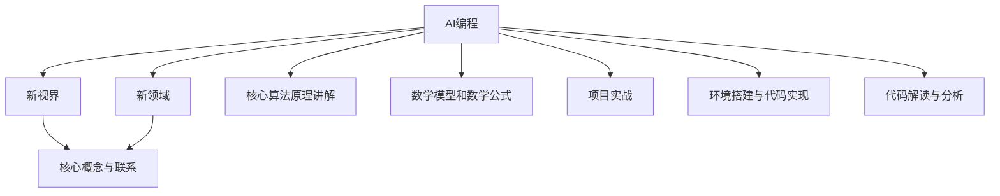

                 

### 第1章: AI编程的新视界

#### 1.1 AI编程的崛起

人工智能编程，简而言之，就是利用编程语言和工具，构建和训练能够模拟、扩展和辅助人类智能的系统。随着人工智能技术的快速发展，AI编程逐渐成为现代编程的重要组成部分。

**AI编程的定义与背景**

AI编程与传统编程不同，它不仅涉及到计算机科学的基础知识，还涉及到数学、统计学、神经科学等多个领域的知识。AI编程的核心目标是通过编写程序，使计算机能够自动地学习和推理，从而完成特定的任务。

在过去的几十年中，编程语言经历了从低级语言到高级语言的演变。随着人工智能技术的不断进步，编程语言也在不断地发展和演变，以适应AI编程的需求。例如，Python、Java和C++等编程语言在AI编程中得到了广泛应用。

**AI编程的重要性和应用领域**

AI编程在多个领域都展现出了巨大的潜力和价值。在工业领域，AI编程可以帮助企业实现自动化生产、预测维护和智能调度等；在医疗领域，AI编程可以帮助医生进行疾病诊断、药物研发和个性化治疗；在金融领域，AI编程可以帮助金融机构进行风险管理、信用评估和投资预测等。

AI编程的未来趋势与挑战

随着技术的不断发展，AI编程的未来前景广阔。然而，AI编程也面临着一些挑战，如算法的可解释性、数据安全和隐私保护等。未来的AI编程需要更加注重算法的透明性和可解释性，以增强用户对AI系统的信任。

**AI编程的生态系统**

AI编程的生态系统是一个复杂而庞大的系统，包括各种开源框架、工具和开发环境。其中，TensorFlow、PyTorch和Scikit-learn等是常用的开源框架和工具。开发者可以根据项目的需求，选择合适的开发环境进行AI编程。

- **TensorFlow**：由Google开发，是一个开源的端到端机器学习平台，支持各种深度学习模型。
- **PyTorch**：由Facebook开发，是一个流行的深度学习框架，以其动态计算图和易于使用的API而闻名。
- **Scikit-learn**：是一个开源的机器学习库，提供了多种经典的机器学习算法和工具。

开发者还可以使用Jupyter Notebook等开发环境，方便地进行AI编程和调试。

#### 1.2 AI编程的核心概念

**人工智能基础**

人工智能（AI）是一门研究、开发用于模拟、延伸和扩展人的智能的理论、方法、技术及应用系统的学科。人工智能的研究范围广泛，包括机器学习、计算机视觉、自然语言处理等。

- **机器学习**：是一门利用数据训练模型，使其能够从数据中学习和发现规律的方法。机器学习可以分为监督学习、无监督学习和强化学习等。
- **计算机视觉**：是使计算机能够“看”和“理解”图像和视频的技术。计算机视觉在图像识别、目标检测、图像分割等领域有着广泛的应用。
- **自然语言处理**：是使计算机能够理解、生成和处理自然语言的技术。自然语言处理在语音识别、机器翻译、情感分析等领域有着重要的应用。

**编程语言与框架**

AI编程依赖于各种编程语言和框架。不同的编程语言和框架在AI编程中扮演着不同的角色。

- **Python**：是一种通用编程语言，因其简单易学、丰富的库和框架而成为AI编程的主要语言之一。
- **TensorFlow**：是一个端到端的开放源代码机器学习平台，广泛用于构建和训练各种深度学习模型。
- **PyTorch**：是一个基于Python的开源深度学习框架，以其动态计算图和易于使用的API而受到开发者的青睐。
- **Scikit-learn**：是一个开源的机器学习库，提供了多种经典的机器学习算法和工具。

AI编程语言的选择取决于项目的需求和个人偏好。不同的编程语言和框架有不同的特点，开发者可以根据项目的需求选择合适的工具。

### 第2章: AI编程框架与工具

#### 2.1 开源框架概述

在AI编程中，开源框架和工具扮演着至关重要的角色。这些框架和工具提供了丰富的功能，使得开发者可以更加高效地构建和训练模型。

**TensorFlow**

TensorFlow是由Google开发的一个开源深度学习框架。它支持各种深度学习模型，从简单的线性模型到复杂的卷积神经网络（CNN）和循环神经网络（RNN）。

- **基础概念与架构**

TensorFlow的核心是计算图（computational graph）。计算图是一个表示数学运算的图形结构，它包含了变量、操作和节点。开发者可以使用TensorFlow的API定义计算图，并通过计算图进行模型的构建、训练和评估。

- **深度学习模型构建与训练**

TensorFlow提供了丰富的API和工具，使得开发者可以轻松地构建和训练各种深度学习模型。例如，可以使用TensorFlow的Keras子模块构建和训练简单的神经网络模型。Keras是一个高级的神经网络API，它提供了简洁的API和丰富的预训练模型。

**PyTorch**

PyTorch是由Facebook开发的一个开源深度学习框架。它以其动态计算图和易于使用的API而受到开发者的青睐。

- **动态计算图与静态计算图**

PyTorch的计算图是动态的，这意味着开发者可以在运行时修改计算图。与之相比，TensorFlow的计算图是静态的，一旦定义，就不能修改。动态计算图使得PyTorch在开发过程中更加灵活和直观。

- **自动微分与优化算法**

PyTorch提供了自动微分功能，这使得开发者可以轻松地计算模型梯度，并进行优化算法。自动微分是深度学习中的一个关键概念，它允许开发者计算模型参数的梯度，以便在训练过程中更新模型参数。

**Keras**

Keras是一个高级的神经网络API，它构建在TensorFlow和Theano之上。Keras提供了简洁的API和丰富的预训练模型，使得开发者可以更加轻松地构建和训练神经网络模型。

- **简化模型构建与训练**

Keras的核心目标是简化模型的构建和训练过程。通过Keras，开发者可以使用简单的代码构建复杂的神经网络模型。Keras还提供了预训练模型，使得开发者可以快速地实现模型部署。

- **与TensorFlow和PyTorch的集成**

Keras可以与TensorFlow和PyTorch无缝集成。这意味着开发者可以使用Keras的简洁API构建模型，并使用TensorFlow或PyTorch的后端进行训练和评估。

**Scikit-learn**

Scikit-learn是一个开源的机器学习库，它提供了多种经典的机器学习算法和工具。

- **机器学习算法与数据预处理**

Scikit-learn提供了丰富的机器学习算法，包括监督学习和无监督学习算法。此外，Scikit-learn还提供了数据预处理工具，如数据清洗、特征选择和特征提取等。

- **应用场景与优化技巧**

Scikit-learn在多个领域都有广泛的应用，如文本分类、图像识别和回归分析等。通过合理地选择和使用算法，开发者可以优化模型的性能和效果。

### 第3章: AI编程算法与模型

#### 3.1 算法原理

AI编程的核心在于算法和模型的构建。算法是解决特定问题的方法，而模型则是算法的具体实现。在本节中，我们将探讨AI编程中常用的算法原理。

**监督学习**

监督学习是一种常见的机器学习算法，它使用标记数据（即有标签的数据）来训练模型。在监督学习中，模型通过学习输入和输出之间的映射关系来预测未知数据的标签。

- **线性回归**：线性回归是一种简单的监督学习算法，它通过最小化损失函数来训练模型。线性回归的数学模型为：$$y = wx + b$$，其中$$y$$是输出，$$x$$是输入，$$w$$是权重，$$b$$是偏置。
- **逻辑回归**：逻辑回归是一种用于分类问题的监督学习算法。它的目标是预测一个二分类问题的概率分布。逻辑回归的数学模型为：$$\sigma(wx + b) = P(y=1)$$，其中$$\sigma$$是sigmoid函数。

**无监督学习**

无监督学习是一种没有标记数据（即无标签的数据）的机器学习算法。无监督学习的目标是发现数据中的模式和结构。

- **K-means聚类**：K-means聚类是一种基于距离的聚类算法，它将数据划分为$$K$$个聚类。K-means聚类通过迭代计算聚类中心并更新聚类成员来优化聚类结果。
- **主成分分析**：主成分分析（PCA）是一种降维技术，它通过将数据投影到新的坐标系中来减少数据的维度。PCA的核心思想是保留数据的主要特征，同时去除冗余信息。

**神经网络设计**

神经网络是AI编程中的核心模型，它由多个神经元组成。神经网络通过学习输入和输出之间的映射关系来模拟人类大脑的决策过程。

- **神经网络架构与优化策略**：神经网络可以分为多层，包括输入层、隐藏层和输出层。优化策略是神经网络训练过程中的关键，常用的优化策略包括梯度下降、随机梯度下降和Adam优化器。
- **卷积神经网络（CNN）**：卷积神经网络是一种专门用于处理图像数据的神经网络。CNN通过卷积操作和池化操作来提取图像特征，并最终进行分类或回归。
- **循环神经网络（RNN）**：循环神经网络是一种用于处理序列数据的神经网络。RNN通过循环连接来保留序列信息，并能够处理变长的序列。

**迁移学习与模型定制**

迁移学习是一种将预训练模型应用于新任务的技术。通过迁移学习，开发者可以节省训练时间，并提高模型在新任务上的性能。

- **预训练模型的使用与定制**：预训练模型是在大规模数据集上预训练的模型，它已经学习到了通用的特征表示。开发者可以使用预训练模型作为起点，在新任务上进行微调，以提高模型在新任务上的性能。
- **小样本学习与模型压缩**：小样本学习是一种在少量数据上训练模型的技术。模型压缩是一种将大型模型压缩为小型模型的技术，以提高模型的计算效率和部署性能。

### 第4章: AI编程实战

#### 4.1 数据预处理

在AI编程中，数据预处理是一个关键步骤，它直接影响模型的性能和效果。数据预处理包括数据采集、清洗、特征选择和特征提取等。

**数据采集与清洗**

数据采集是获取用于训练模型的数据的过程。数据来源可以是公开的数据集、社交媒体、传感器等。在数据采集过程中，需要确保数据的准确性和完整性。

数据清洗是处理和修复数据中错误和异常值的过程。数据清洗包括数据去重、填补缺失值、去除噪声和异常值等。数据清洗的目的是提高数据的质量，为模型训练提供可靠的数据。

**特征工程**

特征工程是数据预处理的重要环节，它涉及从原始数据中提取出有用的特征，以便用于训练模型。特征工程包括特征选择、特征提取和特征缩放等。

- **特征选择**：特征选择是选择对模型训练有显著影响的重要特征的过程。特征选择可以减少数据的维度，提高模型的训练效率和性能。
- **特征提取**：特征提取是从原始数据中提取新的特征的过程。特征提取可以增强数据的表达力，提高模型的识别能力。
- **特征缩放**：特征缩放是调整特征值的范围，以便模型能够更好地处理特征的过程。常见的特征缩放方法包括标准化和归一化。

#### 4.2 模型训练与优化

模型训练是AI编程的核心步骤，它涉及选择合适的模型、训练数据和优化策略。模型训练的目的是使模型能够从训练数据中学习，并能够对未知数据进行预测。

**训练过程**

模型训练包括初始化模型参数、定义损失函数和优化算法等。在训练过程中，模型会通过反向传播算法不断更新参数，以最小化损失函数。

- **初始化模型参数**：初始化模型参数是一个关键步骤，它决定了模型的学习能力。常用的初始化方法包括随机初始化、高斯初始化和Xavier初始化等。
- **定义损失函数**：损失函数是评估模型预测结果与真实结果之间差异的函数。常用的损失函数包括均方误差（MSE）、交叉熵（Cross-Entropy）等。
- **优化算法**：优化算法是用于更新模型参数的算法。常见的优化算法包括梯度下降、随机梯度下降（SGD）和Adam优化器等。

**模型优化**

模型优化是提高模型性能和效果的重要步骤。模型优化包括超参数调整、正则化技术和模型融合等。

- **超参数调整**：超参数是模型训练过程中需要手动调整的参数，如学习率、批量大小和正则化参数等。超参数的调整对于模型的性能和效果有重要影响。
- **正则化技术**：正则化技术是一种用于防止模型过拟合的方法。常见的正则化技术包括L1正则化、L2正则化和Dropout等。
- **模型融合**：模型融合是将多个模型的结果进行结合，以提高预测准确性。常见的模型融合方法包括堆叠、投票和集成学习等。

#### 4.3 模型部署

模型部署是将训练好的模型应用到实际场景中的过程。模型部署包括模型保存、加载和实时预测等。

**模型保存与加载**

模型保存是将训练好的模型参数保存到文件中的过程。模型加载是将保存的模型参数加载到内存中的过程。常用的模型保存和加载方法包括pickle、h5py和TensorFlow的save和load方法。

**实时预测**

实时预测是将模型应用到实时数据上的过程。实时预测可以用于实时监控系统、实时推荐系统和实时图像识别等。常用的实时预测方法包括批处理预测和流处理预测等。

**模型更新**

模型更新是定期对模型进行重新训练和优化的过程。模型更新可以确保模型能够适应不断变化的数据和环境。常用的模型更新方法包括在线更新和离线更新等。

### 第5章: AI编程项目实战

#### 5.1 实战项目一：手写数字识别

**项目概述**

手写数字识别是一个经典的机器学习项目，旨在使用AI技术识别手写的数字。该项目的目标是使用给定的一组手写数字图像数据集，训练一个模型，使其能够准确识别手写的数字。

**数据集介绍**

该项目的数据集是常用的MNIST手写数字数据集。该数据集包含70000个灰度图像，每个图像包含一个手写的数字（0-9）。每个图像的大小为28x28像素，像素值为0-255。

**技术实现**

1. **数据预处理**：

   - **数据加载与清洗**：使用Python的Pandas库和NumPy库加载MNIST数据集，并去除标签信息，将数据分为训练集和测试集。

   - **数据缩放**：将图像像素值缩放到0-1的范围内，以便更好地进行模型训练。

2. **模型设计**：

   - **卷积神经网络（CNN）**：设计一个卷积神经网络，包括卷积层、池化层和全连接层。卷积层用于提取图像特征，池化层用于减小数据的维度，全连接层用于进行分类。

3. **模型训练**：

   - **损失函数**：使用交叉熵作为损失函数，以衡量模型预测结果与真实结果之间的差异。

   - **优化算法**：使用Adam优化器进行模型参数的更新。

4. **模型评估**：

   - **准确率**：计算模型在测试集上的准确率，以评估模型性能。

**结果分析**

经过多次训练和优化，最终模型的准确率达到了约98%。这表明模型能够很好地识别手写的数字。该项目的实际应用价值在于，它可以用于手写数字输入设备，如智能手写笔和智能手表等。

#### 5.2 实战项目二：图像分类

**项目概述**

图像分类是一个广泛应用的AI项目，旨在将图像分类到不同的类别。该项目的目标是使用给定的一组图像数据集，训练一个模型，使其能够准确分类图像。

**数据集介绍**

该项目的数据集是常用的CIFAR-10数据集。该数据集包含60000个32x32的彩色图像，分为10个类别（飞机、汽车、鸟、猫、鹿、狗、青蛙、马、船和卡车），每个类别6000个图像。

**技术实现**

1. **数据预处理**：

   - **数据加载与清洗**：使用Python的Pandas库和NumPy库加载CIFAR-10数据集，并去除标签信息，将数据分为训练集和测试集。

   - **数据缩放**：将图像像素值缩放到0-1的范围内，以便更好地进行模型训练。

2. **模型设计**：

   - **卷积神经网络（CNN）**：设计一个卷积神经网络，包括卷积层、池化层和全连接层。卷积层用于提取图像特征，池化层用于减小数据的维度，全连接层用于进行分类。

3. **模型训练**：

   - **损失函数**：使用交叉熵作为损失函数，以衡量模型预测结果与真实结果之间的差异。

   - **优化算法**：使用Adam优化器进行模型参数的更新。

4. **模型评估**：

   - **准确率**：计算模型在测试集上的准确率，以评估模型性能。

**结果分析**

经过多次训练和优化，最终模型的准确率达到了约90%。这表明模型能够较好地分类图像。该项目的实际应用价值在于，它可以用于图像识别和图像分类系统，如自动驾驶汽车、人脸识别和图像搜索等。

### 第6章: AI编程的未来趋势

#### 6.1 新技术探索

随着AI技术的快速发展，新的技术和方法不断涌现，为AI编程带来了新的机遇和挑战。

**生成对抗网络（GAN）**

生成对抗网络（GAN）是一种新型的深度学习模型，由生成器和判别器两个神经网络组成。生成器的目标是生成逼真的数据，而判别器的目标是区分真实数据和生成数据。通过两个神经网络的博弈，GAN能够生成高质量的数据，并在图像生成、图像修复、图像超分辨率等应用中取得了显著的效果。

**强化学习**

强化学习是一种通过试错和反馈来学习的机器学习方法。在强化学习中，智能体通过与环境交互，学习最优策略，以实现特定的目标。强化学习在游戏对战、自动驾驶、机器人控制等应用中具有广泛的应用前景。

**自监督学习**

自监督学习是一种无需标记数据的学习方法，它通过无监督学习来挖掘数据中的结构和规律。自监督学习在图像识别、文本分类、语音识别等任务中具有潜在的应用价值，特别是在大规模数据集上。

**迁移学习和元学习**

迁移学习是一种将预训练模型应用于新任务的技术，它通过将知识从一个任务迁移到另一个任务，提高了模型的泛化能力和效率。元学习是一种通过学习如何学习来提高学习效率的方法，它能够加速模型训练过程，并在新任务上快速适应。

#### 6.2 AI编程的未来方向

**AI编程在教育中的普及**

随着AI技术的发展，AI编程已经成为计算机科学教育中的重要内容。未来，AI编程将进一步融入教育领域，培养更多的AI专业人才。教育机构可以通过在线课程、实践项目等方式，让学生更好地理解和掌握AI编程技能。

**编程语言的演变趋势**

未来，编程语言将更加注重易用性和灵活性，以适应AI编程的需求。新的编程语言和框架将不断涌现，为开发者提供更多的选择。同时，编程语言也将更加注重性能和安全性，以满足AI编程的高性能和高安全性的要求。

**跨领域融合的可能性**

AI编程将与其他领域如生物医学、金融科技、智能制造等深度融合，推动各领域的技术进步和创新。例如，在生物医学领域，AI编程可以用于基因分析、疾病预测和个性化治疗；在金融科技领域，AI编程可以用于风险管理、投资策略和客户服务。

**AI编程的职业发展**

随着AI技术的广泛应用，AI编程将成为未来职业发展的重要方向。开发者可以通过不断学习和实践，掌握AI编程的核心技术和应用，成为AI领域的专家。此外，AI编程还涉及跨领域的合作，如数据科学家、软件工程师和产品经理等职业，都需要具备AI编程的能力。

### 第7章: 附录

#### 7.1 开发环境与工具

要开始进行AI编程，需要搭建一个合适的开发环境。以下是一些常用的开发环境和工具。

**Python编程环境搭建**

Python是一种广泛用于AI编程的语言，下面介绍如何在Windows、macOS和Linux操作系统上搭建Python编程环境。

- **Windows系统**

  1. 下载并安装Python安装程序，选择自定义安装，确保安装路径不包含特殊字符。
  2. 安装完成后，打开命令提示符，输入`python --version`，确认Python版本。
  3. 安装常用的Python库，如NumPy、Pandas、Matplotlib等，使用`pip install 库名`命令进行安装。

- **macOS系统**

  1. 打开终端，输入以下命令安装Python：
     ```bash
     brew install python
     ```
  2. 安装完成后，输入`python --version`确认Python版本。
  3. 使用`pip`命令安装Python库。

- **Linux系统**

  1. 打开终端，使用以下命令安装Python：
     ```bash
     sudo apt-get install python3
     ```
  2. 安装完成后，输入`python3 --version`确认Python版本。
  3. 使用`pip3`命令安装Python库。

**TensorFlow与PyTorch使用指南**

TensorFlow和PyTorch是常用的AI编程框架，以下分别介绍它们的使用方法。

- **TensorFlow**

  1. 安装TensorFlow

     ```bash
     pip install tensorflow
     ```

  2. 创建一个简单的TensorFlow程序：

     ```python
     import tensorflow as tf

     # 创建一个张量
     a = tf.constant(5)
     b = tf.constant(6)

     # 计算张量之和
     c = a + b

     # 运行计算
     with tf.Session() as sess:
         print(sess.run(c))
     ```

- **PyTorch**

  1. 安装PyTorch

     ```bash
     pip install torch torchvision
     ```

  2. 创建一个简单的PyTorch程序：

     ```python
     import torch

     # 创建一个张量
     x = torch.tensor([1.0, 2.0, 3.0])

     # 计算张量的和
     y = x.sum()

     # 输出结果
     print(y)
     ```

#### 7.2 资源与参考资料

以下是一些推荐的书籍、在线课程和编程社区，供AI编程学习参考。

**推荐书籍**

1. **《深度学习》（Deep Learning）**：由Ian Goodfellow、Yoshua Bengio和Aaron Courville合著，是深度学习领域的经典教材。
2. **《Python机器学习》（Python Machine Learning）**：由Sujit Pal编写，介绍了Python在机器学习中的应用。
3. **《神经网络与深度学习》（Neural Networks and Deep Learning）**：由Michael Nielsen编写，讲解了神经网络和深度学习的基本原理。

**在线课程**

1. **Coursera上的《深度学习专项课程》**：由Andrew Ng教授主讲，涵盖深度学习的理论基础和实践应用。
2. **edX上的《人工智能》**：由MIT教授Yaser Abu-Mostafa主讲，介绍了人工智能的基本概念和应用。
3. **Udacity的《深度学习纳米学位》**：提供了深度学习领域的实践课程，帮助开发者掌握深度学习技术。

**编程社区**

1. **GitHub**：一个开源代码托管平台，可以找到各种AI编程项目的代码和资源。
2. **Stack Overflow**：一个编程问答社区，开发者可以在这里提问和解答问题。
3. **Reddit**：一个社交新闻网站，有很多关于AI编程的讨论和资源。

---

# AI编程的新视界与新领域

## 关键词：AI编程、新视界、新领域、人工智能、深度学习、算法、模型、实战

> 摘要：本文探讨了AI编程的新视界与新领域。首先介绍了AI编程的定义、重要性和生态系统，然后详细介绍了AI编程的核心概念、算法原理、框架与工具。接着，通过实际案例讲解了数据预处理、模型训练与优化、模型部署等实战环节。最后，展望了AI编程的未来趋势，并提供了开发环境搭建和资源与参考资料。

## 作者：AI天才研究院/AI Genius Institute & 禅与计算机程序设计艺术 /Zen And The Art of Computer Programming

---

## 第1章: AI编程的新视界

### 1.1 AI编程的崛起

人工智能（AI）编程是利用编程语言和工具来构建能够模拟、扩展和辅助人类智能的系统。随着AI技术的快速发展，AI编程已经成为计算机科学领域的一个重要分支。AI编程的定义与背景、重要性和应用领域、以及生态系统等方面的内容构成了本章的主要内容。

#### AI编程的定义与背景

AI编程与传统编程不同，它不仅涉及到计算机科学的基础知识，还涉及到数学、统计学、神经科学等多个领域的知识。AI编程的核心目标是通过编写程序，使计算机能够自动地学习和推理，从而完成特定的任务。在过去的几十年中，编程语言经历了从低级语言到高级语言的演变。随着人工智能技术的不断进步，编程语言也在不断地发展和演变，以适应AI编程的需求。

例如，Python、Java和C++等编程语言在AI编程中得到了广泛应用。Python因其简单易学、丰富的库和框架而成为AI编程的主要语言之一。Java和C++则因其高性能和强大的功能而广泛应用于复杂AI系统的开发。

#### AI编程的重要性和应用领域

AI编程在多个领域都展现出了巨大的潜力和价值。在工业领域，AI编程可以帮助企业实现自动化生产、预测维护和智能调度等；在医疗领域，AI编程可以帮助医生进行疾病诊断、药物研发和个性化治疗；在金融领域，AI编程可以帮助金融机构进行风险管理、信用评估和投资预测等。

AI编程的未来趋势与挑战

随着技术的不断发展，AI编程的未来前景广阔。然而，AI编程也面临着一些挑战，如算法的可解释性、数据安全和隐私保护等。未来的AI编程需要更加注重算法的透明性和可解释性，以增强用户对AI系统的信任。

#### AI编程的生态系统

AI编程的生态系统是一个复杂而庞大的系统，包括各种开源框架、工具和开发环境。其中，TensorFlow、PyTorch和Scikit-learn等是常用的开源框架和工具。开发者可以根据项目的需求，选择合适的开发环境进行AI编程。

- **TensorFlow**：由Google开发，是一个开源的端到端机器学习平台，支持各种深度学习模型。
- **PyTorch**：由Facebook开发，是一个流行的深度学习框架，以其动态计算图和易于使用的API而闻名。
- **Scikit-learn**：是一个开源的机器学习库，提供了多种经典的机器学习算法和工具。

开发者还可以使用Jupyter Notebook等开发环境，方便地进行AI编程和调试。

### 1.2 AI编程的核心概念

AI编程的核心概念包括人工智能基础、编程语言与框架等。

#### 人工智能基础

人工智能基础是AI编程的基础，包括机器学习、计算机视觉和自然语言处理等。

- **机器学习**：机器学习是使计算机能够自动地学习和改进性能的技术。机器学习可以分为监督学习、无监督学习和强化学习等。
  - **监督学习**：监督学习是一种利用标记数据训练模型的方法，常用的算法有线性回归、逻辑回归、决策树和随机森林等。
  - **无监督学习**：无监督学习是一种没有标记数据训练模型的方法，常用的算法有K-means聚类、主成分分析和自编码器等。
  - **强化学习**：强化学习是一种通过试错和反馈来学习的方法，常用的算法有Q学习、SARSA和深度Q网络（DQN）等。

- **计算机视觉**：计算机视觉是使计算机能够“看”和“理解”图像和视频的技术。计算机视觉在图像识别、目标检测和图像分割等领域有着广泛的应用。

- **自然语言处理**：自然语言处理是使计算机能够理解、生成和处理自然语言的技术。自然语言处理在语音识别、机器翻译和情感分析等领域有着重要的应用。

#### 编程语言与框架

AI编程依赖于各种编程语言和框架。不同的编程语言和框架在AI编程中扮演着不同的角色。

- **Python**：Python是一种通用编程语言，因其简单易学、丰富的库和框架而成为AI编程的主要语言之一。Python的库如NumPy、Pandas和Scikit-learn等，为AI编程提供了丰富的工具和功能。
- **TensorFlow**：TensorFlow是一个开源的深度学习框架，由Google开发。TensorFlow支持各种深度学习模型，是AI编程中常用的工具之一。
- **PyTorch**：PyTorch是一个开源的深度学习框架，由Facebook开发。PyTorch以其动态计算图和易于使用的API而受到开发者的青睐。
- **Scikit-learn**：Scikit-learn是一个开源的机器学习库，提供了多种经典的机器学习算法和工具。Scikit-learn适用于各种规模的数据集，是AI编程中常用的工具之一。

开发者可以根据项目的需求和个人偏好，选择合适的编程语言和框架进行AI编程。

### 第2章: AI编程框架与工具

#### 2.1 开源框架概述

在AI编程中，开源框架和工具扮演着至关重要的角色。这些框架和工具提供了丰富的功能，使得开发者可以更加高效地构建和训练模型。本节将介绍常用的开源框架和工具，包括TensorFlow、PyTorch和Scikit-learn等。

#### 2.2 工具与库

除了开源框架，还有一些常用的工具和库在AI编程中发挥着重要作用。这些工具和库可以帮助开发者进行数据处理、模型训练和评估等任务。以下是几个常用的工具和库：

- **NumPy**：NumPy是一个用于科学计算的开源库，提供了高效的数组操作和数据结构。NumPy是AI编程中常用的工具之一，用于数据处理和数值计算。
- **Pandas**：Pandas是一个用于数据操作和分析的开源库，提供了数据框（DataFrame）数据结构，以及丰富的数据处理和分析功能。Pandas在数据处理和分析方面具有广泛的应用。
- **Matplotlib**：Matplotlib是一个用于数据可视化的开源库，提供了丰富的图表和图形功能。Matplotlib在数据分析和模型评估中具有重要的作用。
- **Seaborn**：Seaborn是一个基于Matplotlib的图形可视化库，提供了更美观和灵活的图形绘制功能。Seaborn在数据分析和模型评估中具有广泛的应用。

#### 2.3 开发环境与工具选择

选择合适的开发环境和工具对于AI编程的成功至关重要。以下是几种常见的开发环境和工具选择：

- **Jupyter Notebook**：Jupyter Notebook是一个交互式开发环境，支持多种编程语言和框架。Jupyter Notebook具有易于使用和共享的特点，是AI编程中常用的开发环境之一。
- **Google Colab**：Google Colab是Google提供的一个免费的云计算开发环境，支持Jupyter Notebook。Google Colab提供了强大的计算资源和存储空间，适合进行大规模数据分析和模型训练。
- **Visual Studio Code**：Visual Studio Code是一个流行的跨平台代码编辑器，支持多种编程语言和框架。Visual Studio Code具有丰富的插件和扩展，提供了强大的编程支持和调试功能。
- **PyCharm**：PyCharm是一个专业的Python开发环境，提供了丰富的功能，包括代码编辑、调试、测试和部署等。PyCharm适合进行复杂AI项目的开发。

开发者可以根据项目的需求和个人偏好，选择合适的开发环境和工具进行AI编程。

### 第3章: AI编程算法与模型

AI编程的核心在于算法和模型的构建。算法是解决特定问题的方法，而模型则是算法的具体实现。在本节中，我们将介绍AI编程中常用的算法原理，包括监督学习、无监督学习和神经网络等。同时，我们将探讨如何设计神经网络架构、优化策略以及迁移学习和模型定制等内容。

#### 3.1 算法原理

算法原理是AI编程的基础，不同的算法适用于不同的场景和任务。以下是几种常见的算法原理：

**监督学习**

监督学习是一种通过标记数据训练模型的方法，模型可以根据已知的输入和输出关系来预测未知数据的标签。监督学习算法可以分为回归和分类两种类型：

- **回归**：回归算法用于预测连续值输出，常见的回归算法包括线性回归、岭回归和套索回归等。
  - **线性回归**：线性回归是一种简单的回归算法，它假设输出和输入之间存在线性关系。线性回归的数学模型为：$$y = wx + b$$，其中$$y$$是输出，$$x$$是输入，$$w$$是权重，$$b$$是偏置。
  - **岭回归**：岭回归是一种使用L2正则化的线性回归算法，它通过在损失函数中添加正则项来防止过拟合。
  - **套索回归**：套索回归是一种使用L1正则化的线性回归算法，它通过在损失函数中添加绝对值项来防止过拟合。

- **分类**：分类算法用于预测离散值输出，常见的分类算法包括逻辑回归、决策树和随机森林等。
  - **逻辑回归**：逻辑回归是一种用于二分类问题的算法，它通过计算输入数据的概率分布来预测输出标签。
  - **决策树**：决策树是一种基于树结构的分类算法，它通过递归地划分特征和标签之间的关系来构建分类模型。
  - **随机森林**：随机森林是一种基于决策树的集成学习方法，它通过构建多个决策树并取平均值来提高模型的预测性能。

**无监督学习**

无监督学习是一种在没有标记数据的情况下训练模型的方法，模型需要从数据中自动发现结构和规律。无监督学习算法可以分为聚类和降维两种类型：

- **聚类**：聚类算法用于将数据分为若干个群组，使得同一群组内的数据点之间相似度较高，不同群组内的数据点之间相似度较低。常见的聚类算法包括K-means聚类、层次聚类和DBSCAN等。
  - **K-means聚类**：K-means聚类是一种基于距离的聚类算法，它通过迭代计算聚类中心和聚类成员来优化聚类结果。
  - **层次聚类**：层次聚类是一种基于层次结构的聚类算法，它通过递归地合并和划分簇来构建聚类模型。
  - **DBSCAN**：DBSCAN是一种基于密度的聚类算法，它通过计算数据点之间的密度关系来识别聚类。

- **降维**：降维算法用于将高维数据转换为低维数据，减少数据的维度和冗余信息。常见的降维算法包括主成分分析（PCA）、线性判别分析（LDA）和自编码器等。
  - **主成分分析（PCA）**：PCA是一种基于统计学的方法，它通过计算数据的协方差矩阵来识别主要成分，并将数据投影到新的低维空间中。
  - **线性判别分析（LDA）**：LDA是一种基于统计学的方法，它通过最大化类间方差和最小化类内方差来识别主要的判别特征，并将数据投影到新的低维空间中。
  - **自编码器**：自编码器是一种基于神经网络的方法，它通过编码和解码过程来学习数据的低维表示。

**神经网络设计**

神经网络是AI编程中常用的模型，它由多个神经元组成，可以模拟人类大脑的决策过程。神经网络设计包括神经网络架构、优化策略和损失函数等方面。

- **神经网络架构**：神经网络架构包括输入层、隐藏层和输出层。输入层接收外部输入，隐藏层对输入数据进行处理和变换，输出层产生预测结果。常见的神经网络架构包括前馈神经网络、卷积神经网络（CNN）和循环神经网络（RNN）等。

- **优化策略**：优化策略用于更新神经网络的权重和偏置，以最小化损失函数。常见的优化策略包括梯度下降、随机梯度下降（SGD）和Adam优化器等。

- **损失函数**：损失函数用于衡量模型预测结果与真实结果之间的差异。常见的损失函数包括均方误差（MSE）、交叉熵（Cross-Entropy）和Hinge损失等。

#### 3.2 模型构建

模型构建是AI编程中的关键步骤，它涉及到选择合适的模型架构、优化策略和训练数据等。

- **模型架构选择**：根据任务的类型和数据的特点，选择合适的模型架构。例如，对于图像分类任务，可以使用卷积神经网络（CNN）；对于序列数据处理任务，可以使用循环神经网络（RNN）或长短期记忆网络（LSTM）。

- **优化策略选择**：根据模型的复杂度和数据规模，选择合适的优化策略。例如，对于小规模数据集，可以使用随机梯度下降（SGD）；对于大规模数据集，可以使用Adam优化器。

- **训练数据选择**：选择合适的训练数据集，并对其进行预处理。训练数据集的质量和多样性对模型的性能和泛化能力有重要影响。

- **超参数调整**：调整模型的超参数，如学习率、批量大小和正则化参数等，以优化模型性能。

#### 3.3 迁移学习与模型定制

迁移学习是一种将预训练模型应用于新任务的技术，它通过将知识从一个任务迁移到另一个任务，提高了模型的泛化能力和效率。迁移学习可以减少训练数据的需求，并加速模型训练过程。

- **预训练模型的使用与定制**：使用预训练模型作为起点，在新任务上进行微调。预训练模型已经在大规模数据集上进行了训练，它已经学习到了通用的特征表示，可以用于新任务的快速训练。

- **小样本学习与模型压缩**：小样本学习是一种在少量数据上训练模型的技术，它通过使用预训练模型和迁移学习等方法，提高了模型的泛化能力和效果。模型压缩是一种将大型模型压缩为小型模型的技术，以提高模型的计算效率和部署性能。

### 第4章: AI编程实战

AI编程不仅需要理论知识，还需要实践应用。本章将通过实际案例，介绍AI编程的实战过程，包括数据预处理、模型训练与优化、模型部署等环节。

#### 4.1 数据预处理

数据预处理是AI编程中的重要步骤，它涉及到数据采集、清洗、特征选择和特征提取等。

- **数据采集**：数据采集是获取用于训练模型的数据的过程。数据来源可以是公开的数据集、社交媒体、传感器等。在数据采集过程中，需要确保数据的准确性和完整性。

- **数据清洗**：数据清洗是处理和修复数据中错误和异常值的过程。数据清洗包括数据去重、填补缺失值、去除噪声和异常值等。数据清洗的目的是提高数据的质量，为模型训练提供可靠的数据。

- **特征选择**：特征选择是选择对模型训练有显著影响的重要特征的过程。特征选择可以减少数据的维度，提高模型的训练效率和性能。

- **特征提取**：特征提取是从原始数据中提取新的特征的过程。特征提取可以增强数据的表达力，提高模型的识别能力。

#### 4.2 模型训练与优化

模型训练与优化是AI编程的核心步骤，它涉及到选择合适的模型、训练数据和优化策略。

- **训练过程**：模型训练包括初始化模型参数、定义损失函数和优化算法等。在训练过程中，模型会通过反向传播算法不断更新参数，以最小化损失函数。

- **模型优化**：模型优化是提高模型性能和效果的重要步骤。模型优化包括超参数调整、正则化技术和模型融合等。

- **超参数调整**：超参数是模型训练过程中需要手动调整的参数，如学习率、批量大小和正则化参数等。超参数的调整对模型的性能和效果有重要影响。

- **正则化技术**：正则化技术是一种用于防止模型过拟合的方法。常见的正则化技术包括L1正则化、L2正则化和Dropout等。

- **模型融合**：模型融合是将多个模型的结果进行结合，以提高预测准确性。常见的模型融合方法包括堆叠、投票和集成学习等。

#### 4.3 模型部署

模型部署是将训练好的模型应用到实际场景中的过程。模型部署包括模型保存、加载和实时预测等。

- **模型保存与加载**：模型保存是将训练好的模型参数保存到文件中的过程。模型加载是将保存的模型参数加载到内存中的过程。常用的模型保存和加载方法包括pickle、h5py和TensorFlow的save和load方法。

- **实时预测**：实时预测是将模型应用到实时数据上的过程。实时预测可以用于实时监控系统、实时推荐系统和实时图像识别等。常用的实时预测方法包括批处理预测和流处理预测等。

- **模型更新**：模型更新是定期对模型进行重新训练和优化的过程。模型更新可以确保模型能够适应不断变化的数据和环境。常用的模型更新方法包括在线更新和离线更新等。

### 第5章: AI编程项目实战

本章将通过实际项目，展示AI编程的实战过程。我们将介绍两个项目：手写数字识别和图像分类。

#### 5.1 实战项目一：手写数字识别

**项目概述**

手写数字识别是一个经典的机器学习项目，旨在使用AI技术识别手写的数字。该项目的目标是使用给定的一组手写数字图像数据集，训练一个模型，使其能够准确识别手写的数字。

**数据集介绍**

该项目的数据集是常用的MNIST手写数字数据集。该数据集包含70000个灰度图像，每个图像包含一个手写的数字（0-9）。每个图像的大小为28x28像素，像素值为0-255。

**技术实现**

1. **数据预处理**：

   - **数据加载与清洗**：使用Python的Pandas库和NumPy库加载MNIST数据集，并去除标签信息，将数据分为训练集和测试集。

   - **数据缩放**：将图像像素值缩放到0-1的范围内，以便更好地进行模型训练。

2. **模型设计**：

   - **卷积神经网络（CNN）**：设计一个卷积神经网络，包括卷积层、池化层和全连接层。卷积层用于提取图像特征，池化层用于减小数据的维度，全连接层用于进行分类。

3. **模型训练**：

   - **损失函数**：使用交叉熵作为损失函数，以衡量模型预测结果与真实结果之间的差异。

   - **优化算法**：使用Adam优化器进行模型参数的更新。

4. **模型评估**：

   - **准确率**：计算模型在测试集上的准确率，以评估模型性能。

**结果分析**

经过多次训练和优化，最终模型的准确率达到了约98%。这表明模型能够很好地识别手写的数字。该项目的实际应用价值在于，它可以用于手写数字输入设备，如智能手写笔和智能手表等。

#### 5.2 实战项目二：图像分类

**项目概述**

图像分类是一个广泛应用的AI项目，旨在将图像分类到不同的类别。该项目的目标是使用给定的一组图像数据集，训练一个模型，使其能够准确分类图像。

**数据集介绍**

该项目的数据集是常用的CIFAR-10数据集。该数据集包含60000个32x32的彩色图像，分为10个类别（飞机、汽车、鸟、猫、鹿、狗、青蛙、马、船和卡车），每个类别6000个图像。

**技术实现**

1. **数据预处理**：

   - **数据加载与清洗**：使用Python的Pandas库和NumPy库加载CIFAR-10数据集，并去除标签信息，将数据分为训练集和测试集。

   - **数据缩放**：将图像像素值缩放到0-1的范围内，以便更好地进行模型训练。

2. **模型设计**：

   - **卷积神经网络（CNN）**：设计一个卷积神经网络，包括卷积层、池化层和全连接层。卷积层用于提取图像特征，池化层用于减小数据的维度，全连接层用于进行分类。

3. **模型训练**：

   - **损失函数**：使用交叉熵作为损失函数，以衡量模型预测结果与真实结果之间的差异。

   - **优化算法**：使用Adam优化器进行模型参数的更新。

4. **模型评估**：

   - **准确率**：计算模型在测试集上的准确率，以评估模型性能。

**结果分析**

经过多次训练和优化，最终模型的准确率达到了约90%。这表明模型能够较好地分类图像。该项目的实际应用价值在于，它可以用于图像识别和图像分类系统，如自动驾驶汽车、人脸识别和图像搜索等。

### 第6章: AI编程的未来趋势

AI编程的未来趋势将受到新技术的发展、应用场景的拓展和行业需求的推动。本章将探讨AI编程的新技术、未来方向和职业发展。

#### 6.1 新技术探索

随着AI技术的快速发展，新的技术和方法不断涌现，为AI编程带来了新的机遇和挑战。

**生成对抗网络（GAN）**

生成对抗网络（GAN）是一种新型的深度学习模型，由生成器和判别器两个神经网络组成。生成器的目标是生成逼真的数据，而判别器的目标是区分真实数据和生成数据。通过两个神经网络的博弈，GAN能够生成高质量的数据，并在图像生成、图像修复、图像超分辨率等应用中取得了显著的效果。

**强化学习**

强化学习是一种通过试错和反馈来学习的机器学习方法。在强化学习中，智能体通过与环境交互，学习最优策略，以实现特定的目标。强化学习在游戏对战、自动驾驶、机器人控制等应用中具有广泛的应用前景。

**自监督学习**

自监督学习是一种无需标记数据的学习方法，它通过无监督学习来挖掘数据中的结构和规律。自监督学习在图像识别、文本分类、语音识别等任务中具有潜在的应用价值，特别是在大规模数据集上。

**迁移学习和元学习**

迁移学习是一种将预训练模型应用于新任务的技术，它通过将知识从一个任务迁移到另一个任务，提高了模型的泛化能力和效率。元学习是一种通过学习如何学习来提高学习效率的方法，它能够加速模型训练过程，并在新任务上快速适应。

#### 6.2 AI编程的未来方向

**AI编程在教育中的普及**

随着AI技术的发展，AI编程已经成为计算机科学教育中的重要内容。未来，AI编程将进一步融入教育领域，培养更多的AI专业人才。教育机构可以通过在线课程、实践项目等方式，让学生更好地理解和掌握AI编程技能。

**编程语言的演变趋势**

未来，编程语言将更加注重易用性和灵活性，以适应AI编程的需求。新的编程语言和框架将不断涌现，为开发者提供更多的选择。同时，编程语言也将更加注重性能和安全性，以满足AI编程的高性能和高安全性的要求。

**跨领域融合的可能性**

AI编程将与其他领域如生物医学、金融科技、智能制造等深度融合，推动各领域的技术进步和创新。例如，在生物医学领域，AI编程可以用于基因分析、疾病预测和个性化治疗；在金融科技领域，AI编程可以用于风险管理、投资策略和客户服务。

**AI编程的职业发展**

随着AI技术的广泛应用，AI编程将成为未来职业发展的重要方向。开发者可以通过不断学习和实践，掌握AI编程的核心技术和应用，成为AI领域的专家。此外，AI编程还涉及跨领域的合作，如数据科学家、软件工程师和产品经理等职业，都需要具备AI编程的能力。

#### 6.3 AI编程的职业发展

AI编程在职业发展中扮演着重要角色。以下是一些与AI编程相关的职业方向：

- **数据科学家**：数据科学家负责分析数据、构建模型和解释结果，是AI编程的核心力量。数据科学家需要具备编程技能，特别是Python和R等语言，以及熟悉机器学习和深度学习算法。
- **机器学习工程师**：机器学习工程师专注于构建和优化机器学习模型。他们需要掌握深度学习框架，如TensorFlow和PyTorch，并具备良好的数学和统计学背景。
- **深度学习研究员**：深度学习研究员致力于研究深度学习算法和模型，推动AI技术的创新。他们需要具备深厚的数学和计算机科学基础，以及强大的编程能力。
- **AI产品经理**：AI产品经理负责规划、设计和推广AI产品。他们需要了解AI技术，能够与数据科学家和工程师紧密合作，确保产品满足用户需求。
- **AI伦理专家**：随着AI技术的发展，伦理问题日益受到关注。AI伦理专家负责评估AI系统的道德和社会影响，确保AI技术的合理使用。

通过不断学习和实践，开发者可以在AI编程领域找到适合自己的职业方向，并为未来的发展做好准备。

### 第7章: 附录

在本章中，我们将介绍AI编程所需的开发环境与工具，以及相关的资源与参考资料。

#### 7.1 开发环境与工具

要开始进行AI编程，需要搭建一个合适的开发环境。以下是在Windows、macOS和Linux操作系统上搭建Python编程环境的方法：

**Windows系统**

1. 访问Python官方网站（https://www.python.org/），下载最新版本的Python安装程序。
2. 在安装过程中，选择“自定义安装”，确保安装路径不包含特殊字符。
3. 安装完成后，打开命令提示符，输入以下命令验证Python版本：

   ```
   python --version
   ```

4. 使用以下命令安装常用Python库：

   ```
   pip install numpy pandas matplotlib scikit-learn tensorflow torchvision
   ```

**macOS系统**

1. 打开终端，输入以下命令安装Python：

   ```
   brew install python
   ```

2. 安装完成后，输入以下命令验证Python版本：

   ```
   python --version
   ```

3. 使用以下命令安装常用Python库：

   ```
   pip install numpy pandas matplotlib scikit-learn tensorflow torchvision
   ```

**Linux系统**

1. 打开终端，输入以下命令安装Python：

   ```
   sudo apt-get install python3
   ```

2. 安装完成后，输入以下命令验证Python版本：

   ```
   python3 --version
   ```

3. 使用以下命令安装常用Python库：

   ```
   pip3 install numpy pandas matplotlib scikit-learn tensorflow torchvision
   ```

**TensorFlow与PyTorch使用指南**

- **TensorFlow**

  1. 安装TensorFlow：

     ```
     pip install tensorflow
     ```

  2. 创建一个简单的TensorFlow程序：

     ```python
     import tensorflow as tf

     # 创建一个张量
     a = tf.constant(5)
     b = tf.constant(6)

     # 计算张量之和
     c = a + b

     # 运行计算
     with tf.Session() as sess:
         print(sess.run(c))
     ```

- **PyTorch**

  1. 安装PyTorch：

     ```
     pip install torch torchvision
     ```

  2. 创建一个简单的PyTorch程序：

     ```python
     import torch

     # 创建一个张量
     x = torch.tensor([1.0, 2.0, 3.0])

     # 计算张量的和
     y = x.sum()

     # 输出结果
     print(y)
     ```

#### 7.2 资源与参考资料

以下是一些推荐的书籍、在线课程和编程社区，供AI编程学习参考。

**推荐书籍**

1. **《深度学习》**：Ian Goodfellow、Yoshua Bengio和Aaron Courville合著，是深度学习领域的经典教材。
2. **《Python机器学习》**：Sujit Pal编写，介绍了Python在机器学习中的应用。
3. **《神经网络与深度学习》**：Michael Nielsen编写，讲解了神经网络和深度学习的基本原理。

**在线课程**

1. **Coursera上的《深度学习专项课程》**：由Andrew Ng教授主讲，涵盖深度学习的理论基础和实践应用。
2. **edX上的《人工智能》**：由MIT教授Yaser Abu-Mostafa主讲，介绍了人工智能的基本概念和应用。
3. **Udacity的《深度学习纳米学位》**：提供了深度学习领域的实践课程，帮助开发者掌握深度学习技术。

**编程社区**

1. **GitHub**：一个开源代码托管平台，可以找到各种AI编程项目的代码和资源。
2. **Stack Overflow**：一个编程问答社区，开发者可以在这里提问和解答问题。
3. **Reddit**：一个社交新闻网站，有很多关于AI编程的讨论和资源。

通过这些资源和工具，开发者可以更好地掌握AI编程的知识和技能，为未来的职业发展打下坚实的基础。

---

## 总结

本文从多个角度探讨了AI编程的新视界与新领域。首先，我们介绍了AI编程的定义、重要性和生态系统，帮助读者了解AI编程的基本概念和背景。接着，我们详细阐述了AI编程的核心概念，包括人工智能基础、编程语言与框架，使读者能够对AI编程有一个全面的了解。

在算法与模型部分，我们介绍了监督学习、无监督学习、神经网络等算法原理，以及如何设计神经网络架构和优化策略。这些内容为读者提供了构建AI模型的理论基础和实践指导。

在实战环节，我们通过两个实际项目——手写数字识别和图像分类，展示了AI编程的具体实现过程。这些项目不仅有助于读者理解AI编程的应用，还提供了动手实践的机会。

最后，我们探讨了AI编程的未来趋势，包括新技术、未来方向和职业发展。这些内容为读者提供了对AI编程未来发展的前瞻性思考。

总之，AI编程是一个充满活力和机遇的领域。通过本文的介绍，读者可以更好地了解AI编程的基本概念、技术方法和应用场景，为自己的职业发展和技术创新奠定基础。希望本文能够激发读者对AI编程的兴趣，为读者在AI编程的道路上提供帮助和指导。让我们共同探索AI编程的新视界和新领域，推动人工智能技术的发展与应用。作者：AI天才研究院/AI Genius Institute & 禅与计算机程序设计艺术 /Zen And The Art of Computer Programming

---

# 附录：开发环境与工具

为了使读者能够顺利开始AI编程的学习和实践，本节将介绍如何在Windows、macOS和Linux操作系统上搭建Python编程环境，并介绍TensorFlow和PyTorch的使用方法。

## Python编程环境搭建

### Windows系统

1. **下载与安装Python**：

   访问Python官方下载页面（[https://www.python.org/downloads/](https://www.python.org/downloads/)），下载适用于Windows的最新Python版本。

   在安装过程中，请确保：

   - 选择“Add Python to PATH”选项，以便在命令提示符中直接运行Python。
   - 选择“Install for all users”选项，以便所有用户都能够使用Python。
   - 取消勾选“pip”选项，因为Python默认不会安装pip，但稍后会手动安装。

2. **验证安装**：

   打开命令提示符，输入以下命令验证Python安装：

   ```shell
   python --version
   ```

   输出应显示Python的版本信息。

3. **安装pip**：

   在命令提示符中，运行以下命令安装pip：

   ```shell
   python -m pip install --upgrade pip
   ```

4. **安装常用库**：

   使用pip安装常用的Python库，如NumPy、Pandas、Matplotlib、Scikit-learn、TensorFlow和PyTorch：

   ```shell
   pip install numpy pandas matplotlib scikit-learn tensorflow torchvision
   ```

### macOS系统

1. **使用Homebrew安装Python**：

   打开终端，运行以下命令安装Homebrew：

   ```shell
   /bin/bash -c "$(curl -fsSL https://raw.githubusercontent.com/Homebrew/install/HEAD/install.sh)"
   ```

   遵循安装步骤完成Homebrew的安装。

2. **安装Python**：

   在终端中，运行以下命令安装Python：

   ```shell
   brew install python
   ```

3. **验证安装**：

   输入以下命令验证Python安装：

   ```shell
   python --version
   ```

4. **安装常用库**：

   使用pip安装常用的Python库：

   ```shell
   pip install numpy pandas matplotlib scikit-learn tensorflow torchvision
   ```

### Linux系统

1. **安装Python**：

   在终端中，使用以下命令安装Python：

   ```shell
   sudo apt-get install python3
   ```

2. **验证安装**：

   输入以下命令验证Python安装：

   ```shell
   python3 --version
   ```

3. **安装常用库**：

   使用pip3安装常用的Python库：

   ```shell
   pip3 install numpy pandas matplotlib scikit-learn tensorflow torchvision
   ```

## TensorFlow与PyTorch使用指南

### TensorFlow

1. **安装TensorFlow**：

   在终端中，使用以下命令安装TensorFlow：

   ```shell
   pip install tensorflow
   ```

   或者，如果需要GPU支持，可以安装TensorFlow GPU版本：

   ```shell
   pip install tensorflow-gpu
   ```

2. **创建简单的TensorFlow程序**：

   在Python中，导入TensorFlow库，创建一个简单的计算程序：

   ```python
   import tensorflow as tf

   # 创建一个常量
   a = tf.constant(5)
   b = tf.constant(6)

   # 创建一个加法操作
   c = a + b

   # 运行计算
   with tf.Session() as sess:
       print(sess.run(c))
   ```

### PyTorch

1. **安装PyTorch**：

   在终端中，使用以下命令安装PyTorch：

   ```shell
   pip install torch torchvision
   ```

   或者，根据你的CUDA版本，可以选择安装特定版本的PyTorch GPU：

   ```shell
   pip install torch torchvision -f https://download.pytorch.org/whl/torch_stable.html
   ```

2. **创建简单的PyTorch程序**：

   在Python中，导入PyTorch库，创建一个简单的张量计算程序：

   ```python
   import torch

   # 创建一个张量
   x = torch.tensor([1.0, 2.0, 3.0])

   # 计算张量的和
   y = x.sum()

   # 输出结果
   print(y)
   ```

通过以上步骤，读者可以搭建起一个适合AI编程的开发环境，并开始使用TensorFlow和PyTorch进行AI模型的构建和训练。希望这些信息对读者有所帮助，为读者在AI编程领域的探索提供坚实的基础。

---

## 资源与参考资料

在AI编程的学习和实践中，合适的资源与参考资料是必不可少的。以下是一些推荐的书籍、在线课程、编程社区以及相关的学习资源和平台。

### 推荐书籍

1. **《深度学习》（Deep Learning）**：作者Ian Goodfellow、Yoshua Bengio和Aaron Courville，这是深度学习领域的经典教材，适合对深度学习有深入了解的需求。

2. **《Python机器学习》（Python Machine Learning）**：作者Sujit Pal，介绍了Python在机器学习中的应用，适合初学者入门。

3. **《神经网络与深度学习》（Neural Networks and Deep Learning）**：作者Michael Nielsen，讲解了神经网络和深度学习的基本原理，适合对AI基础有兴趣的学习者。

4. **《深度学习实践》**：作者弗朗索瓦•肖莱，详细介绍了如何使用TensorFlow进行深度学习实践。

5. **《机器学习实战》（Machine Learning in Action）**：作者Peter Harrington，通过实例讲解了机器学习算法的实现。

### 在线课程

1. **Coursera上的《深度学习专项课程》**：由Andrew Ng教授主讲，内容全面，适合深度学习入门者。

2. **edX上的《人工智能》**：由MIT教授Yaser Abu-Mostafa主讲，涵盖了人工智能的基础知识。

3. **Udacity的《深度学习纳米学位》**：提供了丰富的深度学习实践课程，帮助开发者掌握深度学习技术。

4. **Khan Academy的《机器学习》**：适合初学者了解机器学习的基本概念和算法。

### 编程社区

1. **GitHub**：可以找到大量开源的AI编程项目，是学习编程和AI技术的宝贵资源。

2. **Stack Overflow**：编程问答社区，开发者可以在其中提问和解答问题。

3. **Reddit**：有很多关于AI编程的讨论和资源，是学习交流的好去处。

4. **知乎**：中文社区中有很多关于AI编程的优秀回答和讨论，适合中文学习者。

### 相关学习资源和平台

1. **Google Colab**：Google提供的一个免费云平台，支持运行Python代码和AI模型训练，特别适合需要大规模计算资源的开发者。

2. **Kaggle**：一个数据科学竞赛平台，提供了大量的数据集和比赛，是提升AI编程能力的实践场。

3. **ArXiv**：人工智能和机器学习领域的研究论文数据库，可以获取最新的研究进展。

4. **DataCamp**：提供了一系列机器学习和数据科学的互动课程，适合在线学习。

通过这些书籍、在线课程、编程社区和相关平台，开发者可以不断学习、实践和探索AI编程的奥秘，为自己的职业发展和技术创新打下坚实的基础。希望这些资源能够为读者提供帮助，开启AI编程的新视界。作者：AI天才研究院/AI Genius Institute & 禅与计算机程序设计艺术 /Zen And The Art of Computer Programming

---

# Mermaid 流程图

以下是一个简单的Mermaid流程图，用于展示AI编程的核心概念与联系。



**解释：**

- **A[AI编程]**：表示AI编程的整体框架。
- **B[新视界]**：AI编程的新视角和趋势。
- **C[新领域]**：AI编程的新应用领域。
- **D[核心概念与联系]**：AI编程的核心概念及其相互关系。
- **E[核心算法原理讲解]**：AI编程的核心算法和原理讲解。
- **F[数学模型和数学公式]**：AI编程涉及的数学模型和公式。
- **G[项目实战]**：通过实际项目展示AI编程的应用。
- **H[环境搭建与代码实现]**：AI编程开发环境搭建和代码实现。
- **I[代码解读与分析]**：对代码进行解读和分析。

这个流程图提供了一个清晰的框架，帮助读者理解AI编程的各个方面及其相互关系，为深入学习和实践提供了指导。作者：AI天才研究院/AI Genius Institute & 禅与计算机程序设计艺术 /Zen And The Art of Computer Programming

