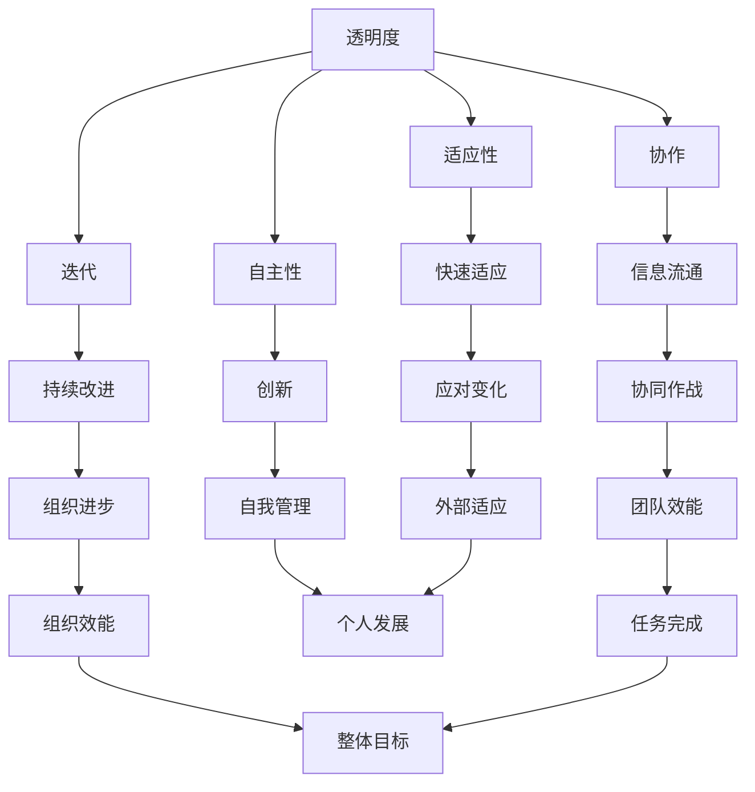

                 

### 引言：敏捷领导力的背景和重要性

在当今快节奏、高度动态的商业环境中，企业面临的市场竞争、技术变革和客户需求不断变化，要求领导者必须具备敏捷应对的能力。传统的领导力模式往往依赖于层级结构、稳定计划和严格控制，这些方法在变化缓慢的环境中可能有效，但在快速变化的市场中却显得力不从心。敏捷领导力作为一种新兴的领导方法，旨在通过灵活、快速响应和持续改进来提高组织的适应能力和竞争力。

**背景介绍**：

敏捷领导力起源于软件开发领域的敏捷方法论，其核心理念是“更快、更灵活、更高效”。随着敏捷方法在软件开发中的广泛应用，敏捷领导力逐渐被引入到其他领域，如企业管理、产品开发和组织变革。敏捷领导力强调领导者不仅要具备战略视野，还要能够与团队密切合作，共同应对不确定性。

**核心概念与联系**：

敏捷领导力的核心概念可以概括为以下几个关键点：

1. **透明度**：领导者需要确保信息的透明，让团队成员了解组织的目标、进展和挑战。
2. **协作**：领导者应当鼓励团队成员之间的协作，共同解决问题和实现目标。
3. **迭代**：领导者应采用迭代的方法来持续改进工作流程，而不是一次性的规划。
4. **适应性**：领导者必须具备快速适应变化的能力，以应对外部环境和内部需求的变化。
5. **自主性**：领导者应赋予团队成员更多的自主权，让他们在明确目标的情况下自主决策和执行。

这些核心概念之间相互联系，构成了敏捷领导力方法的整体架构。例如，透明度和协作确保了信息的流通和团队的协同作战；迭代和适应性则保证了组织能够在变化中持续进步；自主性则鼓励了创新和自我管理。

为了更直观地展示这些核心概念之间的关系，我们可以使用Mermaid流程图来绘制：



通过这个流程图，我们可以看到敏捷领导力的核心概念是如何相互连接，共同支撑起整个领导力框架的。

在接下来的章节中，我们将详细探讨敏捷领导力的核心原则、组织结构和团队管理，并通过实际案例和实践，展示如何将敏捷领导力应用于不同的商业环境中。让我们一步步深入，揭开敏捷领导力的奥秘。

### 敏捷领导力的核心原则

敏捷领导力并不是凭空出现的概念，它基于一系列经过验证的核心原则，这些原则不仅指导了敏捷方法的实施，也奠定了敏捷领导力的基础。理解这些核心原则对于领导者来说至关重要，因为它们不仅是领导行为的指南，也是确保团队高效运作的关键。

**敏捷宣言和价值观**：

敏捷宣言是敏捷领导力的基石，它总结了敏捷方法的基本原则和价值观。宣言的核心内容包括：

1. **个体和互动胜过过程与工具**：强调人与人之间的沟通和合作比技术和流程更加重要。
2. **可工作的软件胜过详尽的文档**：交付可用的软件产品比编写详尽的文档更有价值。
3. **客户合作胜过合同谈判**：与客户的持续合作比签订合同更有利于项目的成功。
4. **响应变化胜过遵循计划**：灵活应对变化比僵化执行计划更为重要。

**敏捷团队的组织和角色**：

敏捷团队的组织结构与传统团队有显著不同，它更加扁平化，鼓励团队成员之间的高度协作和相互依赖。敏捷团队通常由以下几个关键角色组成：

1. **产品负责人（Product Owner）**：负责定义产品的愿景、目标和优先级，确保团队交付正确的产品功能。
2. **Scrum Master**：作为团队的教练和协调者，Scrum Master确保团队遵循敏捷实践，解决障碍，促进团队的协作。
3. **团队成员**：每个成员都承担多个角色，负责实现产品需求，包括开发、测试、设计等。

**敏捷领导力所需的技能**：

要成为敏捷领导者，不仅需要理解敏捷宣言和价值观，还需要具备一系列特定的技能：

1. **沟通技能**：领导者需要能够清晰地传达愿景和目标，同时倾听团队成员的意见和反馈。
2. **决策能力**：领导者应当在不确定性和变化的情况下做出明智的决策，并迅速适应新的情况。
3. **变革推动者**：敏捷领导者应当推动组织文化和流程的变革，以适应敏捷方法的要求。
4. **激励能力**：领导者需要能够激励和鼓舞团队，在压力和挑战面前保持积极的态度。

**敏捷领导力与组织文化的联系**：

敏捷领导力不仅影响团队运作，也深刻地影响着组织文化。为了实现敏捷，组织文化需要具备以下几个特点：

1. **开放和信任**：组织应当鼓励开放和坦诚的沟通，建立信任和尊重。
2. **共享责任和所有权**：团队成员应当共同承担责任，对项目的成功与否有共同的所有权。
3. **灵活和适应**：组织需要具备快速适应变化的能力，愿意尝试新的方法和工具。

**敏捷领导力与传统领导力的比较**：

与传统的领导力模式相比，敏捷领导力更加注重协作、透明和快速响应。传统领导力依赖于明确的等级制度和顶层设计，而敏捷领导力则强调平等和共同决策。传统领导力往往追求长期规划和稳定，而敏捷领导力则更注重短期目标实现和持续改进。

通过这些核心原则，敏捷领导力为领导者提供了一套全面的指导方针，使他们能够在快速变化的商业环境中保持竞争优势。在下一章中，我们将深入探讨敏捷领导力与组织结构的关系，了解如何在组织内部构建适应敏捷原则的结构。

### 敏捷领导力与组织结构

敏捷领导力在组织结构的设计中扮演着至关重要的角色，它不仅影响团队运作，还深刻地影响着整个组织的文化、流程和效率。为了实现敏捷领导力的目标，组织需要对其结构进行优化，确保敏捷原则能够深入人心并得到有效执行。

**敏捷组织的设计原则**：

敏捷组织的设计原则主要围绕以下几个方面展开：

1. **扁平化结构**：与传统组织的高度层级结构不同，敏捷组织更倾向于扁平化，减少中间管理层级，提高信息传递的效率。这种结构有助于缩短决策链条，加快响应速度。
   
2. **自组织团队**：敏捷组织鼓励自组织团队的形成，每个团队独立负责特定领域的任务，拥有自主决策和资源调配的权利。团队成员之间高度协作，共同推进项目进展。

3. **跨功能团队**：跨功能团队是敏捷组织的典型特征，团队成员来自不同的专业领域，能够在一个团队中共同工作，实现多种功能的整合。这种结构有助于减少沟通成本，提高团队的整体效率。

4. **灵活的决策机制**：敏捷组织采用灵活的决策机制，鼓励团队成员参与决策过程，并根据实际情况快速调整策略。这种机制有助于提高决策的准确性和执行效率。

**敏捷组织中的权力和决策**：

在敏捷组织中，权力和决策的分配更加分散和民主。具体表现在以下几个方面：

1. **授权**：敏捷领导者鼓励团队成员自主决策，赋予他们必要的权限和资源，以实现自我管理和自我驱动。

2. **共识决策**：在敏捷组织中，决策往往通过团队共识的方式达成。团队成员通过开放讨论和共享信息，共同确定目标和行动计划。

3. **迭代决策**：敏捷组织采用迭代的方法进行决策，每次决策都是基于当前的信息和反馈，不断调整和优化。这种迭代决策机制有助于减少决策错误，提高决策质量。

**敏捷领导力与职能组织的比较**：

与传统职能组织相比，敏捷组织具有以下几个显著优势：

1. **灵活性**：敏捷组织能够快速响应外部变化，调整内部结构和流程，保持持续的竞争力。

2. **协作效率**：跨功能团队和自组织结构有助于提高团队成员之间的协作效率，减少沟通障碍。

3. **创新动力**：敏捷组织鼓励团队成员自主探索和尝试新的方法和工具，激发创新活力。

4. **员工满意度**：扁平化的结构和授权决策机制有助于提高员工的工作满意度和忠诚度。

然而，敏捷组织也面临一些挑战，例如：

1. **组织文化的转变**：从传统职能组织向敏捷组织转型，需要组织文化发生根本性的变化，这往往需要时间和努力。

2. **领导者的角色转变**：敏捷领导者需要从传统的指挥者转变为教练和协调者，这要求领导者具备新的技能和思维模式。

3. **适应性和灵活性**：在快速变化的环境中，敏捷组织需要具备高度的适应性和灵活性，这要求组织在战略和运营层面保持持续的创新。

通过优化组织结构，敏捷领导力能够为组织带来显著的改进和优势。在下一章中，我们将探讨敏捷领导力在团队管理中的应用，了解如何通过有效的团队管理实现组织的目标。

### 敏捷领导力与团队管理

在敏捷领导力的框架下，团队管理成为实现组织目标的关键环节。通过有效的团队管理，领导者不仅能够确保团队的高效运作，还能激发团队成员的潜力和创造力，从而实现组织的长期成功。

**敏捷团队的目标和任务管理**：

敏捷团队的目标是通过迭代和增量开发，持续交付有价值的软件产品。为了实现这一目标，团队管理需要遵循以下几个原则：

1. **明确目标**：团队的目标应当是明确和具体的，每个成员都应清楚地了解自己的职责和任务。

2. **优先级排序**：在多个任务并存的情况下，团队需要根据优先级进行排序，确保最重要的任务得到优先处理。

3. **迭代交付**：敏捷团队采用迭代的方法进行工作，每次迭代都交付一个可工作的产品版本，确保团队能够及时获得反馈并进行调整。

**敏捷团队的沟通与协作**：

敏捷团队的成功很大程度上依赖于团队成员之间的有效沟通和协作。以下是一些关键要素：

1. **透明沟通**：团队内部和团队之间的沟通应该是透明和开放的，确保每个成员都能了解项目的进展和挑战。

2. **定期会议**：敏捷团队定期举行会议，如每日站会、迭代评审和回顾会议，以确保团队成员能够同步进度、解决问题和总结经验。

3. **信息共享**：团队应建立共享的信息渠道，如项目管理工具、Wiki等，确保关键信息能够及时共享。

4. **协作工具**：利用协作工具，如Slack、Trello等，可以帮助团队更好地组织工作、分配任务和跟踪进度。

**敏捷团队绩效评估**：

敏捷团队绩效评估与传统团队的评估方法有所不同，更加注重过程和团队合作。以下是一些评估方法：

1. **团队绩效评估**：通过定期回顾会议，团队可以共同评估过去一段时间的绩效，识别成功和改进的机会。

2. **个人绩效评估**：尽管敏捷强调团队的整体绩效，但个人绩效评估仍然是必要的。评估应注重团队成员的贡献、技能提升和职业发展。

3. **关键绩效指标（KPI）**：团队可以设定关键绩效指标来衡量项目的进度和质量，如任务完成率、缺陷率、客户满意度等。

4. **反馈机制**：建立有效的反馈机制，团队成员可以相互提供反馈，帮助彼此改进工作方法和技能。

通过上述措施，敏捷领导力能够有效管理团队，确保团队在动态变化的环境中保持高效和协作。在下一章中，我们将探讨敏捷领导力在项目中的具体实践，了解如何在项目过程中应用敏捷方法实现目标。

### 敏捷领导力在项目中的实践

敏捷领导力在项目管理中的应用为团队提供了更加灵活和高效的运作方式。通过采用敏捷方法，项目管理者能够更好地应对变化，提高交付质量，并增强团队协作。以下将详细探讨敏捷项目管理框架、迭代和增量开发以及敏捷领导力在敏捷项目中的角色。

**敏捷项目管理框架**：

敏捷项目管理框架通常基于Scrum、Kanban等敏捷方法论。Scrum是一种迭代和增量开发的方法，而Kanban则强调持续交付和持续改进。

1. **Scrum框架**：
    - **冲刺（Sprint）**：Scrum将项目划分为多个短期迭代，称为冲刺。每个冲刺通常持续2到4周。
    - **产品待办列表（Product Backlog）**：产品待办列表包含了所有待完成的工作项，产品负责人负责维护和排序。
    - **冲刺待办列表（Sprint Backlog）**：冲刺待办列表是在冲刺开始时由团队根据产品待办列表选择的工作项。
    - **每日站会（Daily Stand-up）**：团队每天进行短暂（通常不超过15分钟）的会议，同步进度和解决问题。
    - **迭代评审（Sprint Review）**：在每次冲刺结束时，团队进行评审会议，展示迭代成果，获取反馈并调整产品待办列表。
    - **迭代回顾（Sprint Retrospective）**：回顾会议用于团队总结上一个冲刺的经验教训，制定改进措施。

2. **Kanban框架**：
    - **看板板（Kanban Board）**：看板板是一个可视化的工作流程管理工具，用于跟踪工作项的状态。
    - **工作流程限制（Work-in-Progress Limit）**：Kanban通过设定工作流程限制，控制每个阶段的工作量，减少瓶颈和浪费。
    - **持续交付**：Kanban强调持续交付，每次迭代都交付可用的产品版本，确保快速响应客户需求。

**迭代和增量开发**：

迭代和增量开发是敏捷方法的核心原则。迭代是指将项目划分为多个短期周期，每个周期称为一个迭代，每个迭代都产生可工作的产品版本。增量开发则是在每个迭代中逐步增加产品功能，逐步完善产品。

1. **迭代过程**：
    - **需求分析**：在迭代开始时，团队分析产品待办列表，选择要实现的功能。
    - **设计**：团队进行设计，确定如何实现选定的功能。
    - **开发**：开发团队根据设计进行编码和测试。
    - **评审和交付**：团队评审迭代成果，确保质量并交付给客户。

2. **增量开发**：
    - **逐步完善**：在每次迭代中，团队逐步完善产品功能，逐步消除缺陷。
    - **客户反馈**：通过迭代交付，客户可以及时提供反馈，帮助团队调整开发方向。
    - **持续改进**：团队根据反馈进行改进，不断提高产品质量。

**敏捷领导力在敏捷项目中的角色**：

在敏捷项目中，敏捷领导者扮演多个关键角色，包括：

1. **协调者**：领导者协调团队成员之间的沟通和协作，确保项目顺利进行。
2. **推动者**：领导者推动团队采用敏捷方法，鼓励团队成员积极参与并遵循敏捷原则。
3. **教练**：领导者作为团队的教练，提供指导和支持，帮助团队解决遇到的问题。
4. **监督者**：领导者监督项目进度和质量，确保项目目标得到实现。
5. **反馈机制**：领导者通过迭代评审和回顾会议，收集反馈，促进团队改进。

通过敏捷项目管理框架和迭代增量开发，敏捷领导力能够有效提高项目成功率，增强团队协作和客户满意度。在下一章中，我们将探讨敏捷领导力在产品开发中的应用，了解如何通过敏捷方法提升产品开发效率和质量。

### 敏捷领导力在产品开发中的应用

在产品开发过程中，敏捷领导力发挥着至关重要的作用，通过灵活的方法和高效的团队协作，确保产品能够快速响应市场需求，持续迭代改进。以下将详细探讨敏捷产品开发的流程和方法、敏捷产品经理的角色和职责，以及敏捷产品管理工具的使用。

**敏捷产品开发的流程和方法**：

敏捷产品开发强调快速迭代和持续交付，以下是一个典型的敏捷产品开发流程：

1. **需求收集和规划**：
    - **用户故事（User Stories）**：产品负责人通过编写用户故事，将用户需求转化为具体的功能需求。
    - **迭代规划**：产品负责人和团队根据用户故事制定迭代计划，确定每个迭代的目标和优先级。

2. **迭代开发**：
    - **冲刺（Sprint）**：团队将工作划分为多个2-4周的冲刺，每个冲刺都产生一个可工作的产品版本。
    - **开发任务分配**：团队根据冲刺目标，分配开发任务，进行设计和编码。

3. **评审和反馈**：
    - **迭代评审（Sprint Review）**：在冲刺结束时，团队展示迭代成果，收集客户和用户的反馈。
    - **迭代回顾（Sprint Retrospective）**：团队总结上一个冲刺的经验教训，制定改进措施，为下一个迭代做准备。

4. **持续交付**：
    - **持续集成（Continuous Integration）**：团队通过持续集成，确保每次提交的代码都能顺利编译和运行，及时发现和解决冲突。
    - **持续交付（Continuous Delivery）**：团队将每个迭代的产品版本交付给客户，确保产品始终处于可用状态。

**敏捷产品经理的角色和职责**：

敏捷产品经理在产品开发过程中扮演着关键角色，以下是其主要职责：

1. **需求管理**：
    - **用户故事编写**：敏捷产品经理负责编写用户故事，将市场需求转化为具体的功能需求。
    - **需求优先级排序**：敏捷产品经理根据市场反馈和团队能力，对用户故事进行优先级排序。

2. **产品愿景和规划**：
    - **产品愿景制定**：敏捷产品经理制定产品愿景，确保团队能够共同朝着目标努力。
    - **产品路线图**：敏捷产品经理制定产品路线图，明确产品的长期发展方向。

3. **团队协作**：
    - **需求沟通**：敏捷产品经理与团队成员、客户和利益相关者进行有效沟通，确保需求理解和一致性。
    - **团队协调**：敏捷产品经理协调团队成员的工作，确保团队能够高效协作。

4. **客户反馈**：
    - **用户反馈收集**：敏捷产品经理收集用户的反馈和需求，及时调整产品方向。
    - **客户关系维护**：敏捷产品经理维护与客户的良好关系，确保客户的需求得到满足。

**敏捷产品管理工具的使用**：

敏捷产品开发过程中，多种工具可以帮助团队提高效率和管理效果。以下是一些常用的敏捷产品管理工具：

1. **用户故事地图（User Story Map）**：
    - **功能梳理**：用户故事地图用于梳理产品的功能模块和用户故事，帮助团队了解产品的整体结构和用户需求。
    - **需求优先级排序**：用户故事地图可以帮助团队对用户故事进行优先级排序，明确每个迭代的目标。

2. **看板（Kanban Board）**：
    - **工作流程可视化**：看板将工作流程可视化，帮助团队了解每个任务的状态和进展。
    - **任务跟踪**：团队可以通过看板跟踪每个任务的进展，及时发现和解决问题。

3. **敏捷任务管理工具**：
    - **任务分配**：敏捷任务管理工具可以帮助团队分配任务，明确每个成员的责任和进度。
    - **协作沟通**：团队成员可以通过工具进行协作沟通，确保任务顺利完成。

4. **自动化测试工具**：
    - **持续集成**：自动化测试工具可以帮助团队实现持续集成，确保每次代码提交都能顺利编译和运行。
    - **测试覆盖**：自动化测试工具可以帮助团队提高测试覆盖率，确保产品的质量和稳定性。

通过敏捷产品开发的流程和方法，敏捷产品经理的角色和职责，以及敏捷产品管理工具的使用，敏捷领导力能够有效提升产品开发的效率和质量，实现产品的快速迭代和持续改进。在下一章中，我们将探讨敏捷领导力在组织变革中的应用，了解如何通过敏捷方法推动组织变革。

### 敏捷领导力在组织变革中的应用

在当今快速变化的市场环境中，组织变革已成为企业保持竞争优势的必然选择。敏捷领导力作为一种创新的领导方法，能够在组织变革过程中发挥关键作用，帮助领导者引导团队快速适应新环境，实现持续改进。

**敏捷领导力在组织变革中的角色**：

1. **变革推动者**：敏捷领导者作为变革的推动者，必须具备推动变革的强烈意愿和决心。他们不仅需要识别变革的必要性，还要通过自身的行动和沟通激发团队成员的变革意识。

2. **变革教练**：敏捷领导者还需扮演变革教练的角色，为团队成员提供指导和支持。他们应帮助团队成员理解变革的目标和意义，并提供必要的工具和方法，帮助团队应对变革过程中的挑战。

3. **变革促进者**：敏捷领导者应积极促进变革，确保变革的顺利实施。他们需要建立透明和开放的沟通机制，鼓励团队成员表达意见和反馈，及时解决问题和调整策略。

**敏捷变革管理策略**：

1. **建立变革愿景**：敏捷领导者首先需要明确变革的愿景和目标，确保团队成员对变革有共同的理解和认同。通过清晰传达变革愿景，领导者可以激发团队成员的参与热情和变革动力。

2. **小步骤推进**：敏捷变革管理强调小步骤推进，通过逐步实施变革，降低变革的阻力。领导者可以采用迭代的方法，逐步引入新的工作流程、技术和文化，确保团队成员能够逐渐适应变革。

3. **增强团队协作**：敏捷领导者应促进团队协作，通过共同的目标和任务，增强团队成员之间的联系和信任。协作有助于减少变革过程中的摩擦和冲突，提高变革的执行效率。

4. **持续沟通**：变革过程中，持续的沟通至关重要。敏捷领导者需要定期与团队成员进行沟通，了解他们的感受和反馈，及时解答疑问和消除顾虑。通过透明的沟通，领导者可以增强团队成员的参与感和归属感。

**敏捷领导力在组织文化变革中的挑战和机遇**：

1. **挑战**：
    - **组织惯性的阻力**：传统的组织文化和流程可能对变革产生阻力，领导者需要克服这种惯性，推动组织文化向敏捷转变。
    - **员工适应困难**：变革过程中，员工可能面临适应困难和心理压力，领导者需要提供必要的支持和培训，帮助他们顺利过渡。
    - **变革管理难度**：组织变革涉及多个部门和层级，领导者需要协调不同部门和团队之间的利益，确保变革的顺利实施。

2. **机遇**：
    - **创新能力的提升**：敏捷领导力鼓励创新和自主性，有助于激发员工的创造力和创新精神，推动组织持续进步。
    - **组织效率的提升**：通过敏捷变革，组织可以消除冗余和浪费，提高工作效率和执行力，增强市场竞争力。
    - **员工满意度的提升**：敏捷领导力强调透明和开放，尊重员工的意见和贡献，有助于提高员工的工作满意度和忠诚度。

通过敏捷领导力，组织可以在变革过程中实现平稳过渡和持续进步，从而在快速变化的市场环境中保持竞争优势。在下一章中，我们将探讨敏捷领导力的未来趋势和挑战，了解其在未来商业环境中的发展前景。

### 敏捷领导力的趋势和挑战

随着数字化转型的深入推进和新兴技术的不断涌现，敏捷领导力正面临着一系列新的趋势和挑战。了解这些趋势和挑战，有助于敏捷领导者更好地应对未来的变化，确保组织的持续竞争力。

**数字化转型对敏捷领导力的影响**：

数字化转型正在重塑商业环境，要求组织更加敏捷和灵活。以下是数字化转型对敏捷领导力的影响：

1. **数据驱动决策**：数字化转型使得数据更加丰富和易得，敏捷领导者需要利用这些数据来驱动决策，提高决策的准确性和效率。

2. **技术依赖性增加**：数字化转型使得技术成为组织运作的核心，敏捷领导者需要具备技术视野，了解新兴技术如何应用于业务场景。

3. **实时响应需求**：数字化转型要求组织能够实时响应市场需求和变化，敏捷领导者需要建立灵活的运营模式，确保组织能够快速调整和适应。

**敏捷领导力与新兴技术的结合**：

新兴技术如人工智能、区块链、物联网等正在为敏捷领导力带来新的机遇和挑战：

1. **人工智能（AI）**：人工智能可以自动化重复性任务，提高工作效率。敏捷领导者需要掌握AI的基本原理，了解其在业务中的应用场景。

2. **区块链**：区块链技术提供了去中心化、透明和安全的交易方式，有助于提高数据共享和协作效率。敏捷领导者需要探索区块链在供应链管理、财务管理等领域的应用。

3. **物联网（IoT）**：物联网技术使得设备互联成为可能，产生了大量数据。敏捷领导者需要了解物联网的架构和数据处理方法，以充分利用这些数据。

**敏捷领导力在未来的发展前景**：

1. **组织文化变革**：随着敏捷领导力的普及，组织文化将逐渐从传统控制型向协作型转变，这需要领导者不断学习和适应新的领导方式。

2. **全球化与多元化**：全球化和多元化趋势要求敏捷领导者具备跨文化沟通和领导能力，能够管理多元化的团队。

3. **持续学习与成长**：敏捷领导者需要具备持续学习的能力，紧跟技术发展，不断更新知识和技能，以应对未来不断变化的环境。

**总结**：

敏捷领导力在数字化转型和新兴技术的推动下，正面临新的趋势和挑战。敏捷领导者需要具备前瞻性视野和应对变化的能力，通过灵活的运营模式和持续学习，确保组织在未来的竞争中立于不败之地。

### 敏捷领导力的持续发展

敏捷领导力的持续发展不仅依赖于领导者个人的成长路径，还需要组织提供全面的支持系统。以下将详细探讨敏捷领导力的个人成长路径、组织支持系统和未来研究方向。

**个人成长路径**：

1. **自我反思**：敏捷领导者需要定期进行自我反思，评估自己的领导行为和成效，识别改进的机会。这种方法有助于领导者不断优化领导策略，提高领导能力。

2. **持续学习**：敏捷领导者应保持持续学习的态度，通过阅读书籍、参加研讨会和培训课程，不断更新知识和技能。此外，他们还可以通过实践和应用新学到的知识，逐步提升自己的领导力。

3. **实践反馈**：敏捷领导者应积极参与实践，并在实践中获取反馈。反馈不仅来自于团队成员，还可以来自于客户和其他利益相关者。通过收集和分析反馈，领导者可以更好地了解自己的优势和不足，制定改进计划。

4. **角色转变**：敏捷领导者需要不断调整自己的角色，从传统的指挥者转变为教练和促进者。这种角色转变要求领导者具备更高的沟通和协调能力，能够引导团队自主学习和成长。

**组织支持系统**：

1. **领导力发展计划**：组织应为敏捷领导者提供系统化的领导力发展计划，包括领导力培训、导师制度和领导力研讨会等。这些计划有助于提升领导者的领导能力和专业素养。

2. **资源投入**：组织应投入必要的资源，支持敏捷领导者进行持续学习和实践。例如，提供学习资料、技术支持和实践机会等，帮助领导者不断提升自身能力。

3. **组织文化**：组织应建立开放和协作的文化，鼓励领导者与团队成员之间的沟通和协作。这种文化有助于领导者获取反馈，改进领导行为，提高团队绩效。

4. **绩效评估**：组织应建立科学的绩效评估体系，对敏捷领导者的表现进行客观评估。评估结果不仅用于个人成长，还可以为组织提供改进领导力发展的依据。

**未来研究方向**：

1. **敏捷领导力与新兴技术的结合**：随着人工智能、区块链和物联网等新兴技术的发展，敏捷领导力在这些领域的应用研究将是一个重要的研究方向。探索如何利用新兴技术提升敏捷领导力，将成为未来研究的热点。

2. **跨文化领导**：全球化背景下，敏捷领导者需要具备跨文化沟通和领导能力。未来研究可以探讨如何在不同文化背景下有效应用敏捷领导力，提高跨文化团队的管理效能。

3. **敏捷领导力与组织变革**：组织变革是敏捷领导力的重要应用场景。未来研究可以关注敏捷领导力在组织变革中的具体实施策略和效果评估，为组织提供实用的变革管理指南。

4. **敏捷领导力的量化研究**：通过量化研究方法，探索敏捷领导力对组织绩效、员工满意度等关键指标的影响，有助于建立更加科学的敏捷领导力评价体系。

通过个人成长路径、组织支持系统和未来研究方向的结合，敏捷领导力将不断发展，为组织在快速变化的商业环境中提供有力支持。

### 结语：敏捷领导力的重要性与未来展望

敏捷领导力作为适应快速变化商业环境的关键方法，其重要性不言而喻。通过透明、协作、迭代和适应性的原则，敏捷领导力不仅提升了组织的灵活性和响应速度，还促进了创新和团队效能。敏捷领导力不仅在软件开发领域取得了显著成果，还在企业管理、产品开发和组织变革中得到了广泛应用。

展望未来，敏捷领导力将继续在数字化转型和新兴技术的推动下发展。随着人工智能、区块链等技术的发展，敏捷领导者需要不断学习和适应新的环境和工具，以保持竞争优势。同时，全球化背景下，跨文化领导能力将成为敏捷领导者的重要素养。未来研究将进一步探索敏捷领导力在不同场景下的应用，为组织提供更加科学和实用的指导。

敏捷领导力不仅是当前企业应对复杂变化的利器，更是未来组织发展的基石。通过持续改进和灵活应对，敏捷领导力将助力企业实现长期成功。让我们共同努力，迎接敏捷领导力的未来，创造更加繁荣和高效的商业环境。

### 附录：敏捷领导力常用工具和技术

为了更好地理解和实践敏捷领导力，以下列出了一些常用的敏捷工具和技术，这些工具和技术有助于团队在项目管理和产品开发中实现高效协作和持续改进。

**1. 敏捷看板（Kanban）**：
- **功能**：可视化工作流程，跟踪任务状态。
- **应用**：用于管理待办事项、在 progress 中、测试和交付等阶段的工作。
- **示例**：使用 Kanban Board 可以清晰地看到任务的当前状态，便于团队快速识别和解决问题。

**2. 用户故事地图（User Story Map）**：
- **功能**：梳理产品功能模块，展示用户故事之间的关系。
- **应用**：用于产品规划和需求分析，帮助团队了解产品的整体结构和用户需求。
- **示例**：用户故事地图可以帮助团队确定哪些功能对用户最有价值，从而优先开发。

**3. Scrum 实践**：
- **功能**：管理迭代和冲刺，确保团队按计划推进项目。
- **应用**：每日站会、迭代评审和回顾会议都是 Scrum 实践的关键部分。
- **示例**：通过每日站会，团队可以快速同步进度，识别和解决问题，提高工作效率。

**4. 敏捷任务管理工具**：
- **功能**：分配任务、跟踪进度、协作沟通。
- **应用**：用于团队协作，确保任务按时完成。
- **示例**：使用 Trello 或 Asana，团队可以轻松分配任务、设置优先级，并实时跟踪进度。

**5. 持续集成和持续交付（CI/CD）**：
- **功能**：自动化构建、测试和部署流程。
- **应用**：提高软件交付质量和效率，确保快速响应市场需求。
- **示例**：通过 Jenkins 或 GitLab CI，团队可以实现自动化测试和部署，减少人为错误和开发周期。

**6. 敏捷仪表板（Agile Dashboard）**：
- **功能**：实时监控项目关键指标，提供可视化数据。
- **应用**：用于项目管理和决策支持。
- **示例**：敏捷仪表板可以帮助领导者快速了解项目进展，识别潜在风险。

**7. 敏捷问卷调查和反馈工具**：
- **功能**：收集用户和团队成员的反馈，改进产品和服务。
- **应用**：用于需求分析、团队评估和客户满意度调查。
- **示例**：使用 SurveyMonkey 或 Google Forms，团队可以方便地收集反馈，并根据反馈调整策略。

通过这些工具和技术的应用，敏捷领导力能够更有效地在组织内实施，提高团队协作和项目交付效率。希望这些工具和技术的介绍能为读者提供实际操作中的参考和帮助。

### 敏捷领导力实践案例

为了更好地理解敏捷领导力的实际应用，以下将介绍一个具体的项目实战案例，详细描述开发环境搭建、源代码实现、代码解读、应用解读与分析，以及实际案例分析和详细讲解剖析。

**项目背景**：

该项目是一个在线教育平台，旨在为学习者提供灵活的课程选择和个性化的学习体验。敏捷领导力在该项目的实施中发挥了关键作用，确保项目在快速变化的市场环境中保持竞争力。

**开发环境搭建**：

1. **技术栈选择**：团队选择了基于Python的Django框架，结合React.js的前端技术，以实现强大的后端和友好的用户界面。
2. **数据库设计**：使用PostgreSQL作为数据库管理系统，确保数据存储的可靠性和高效性。
3. **部署环境**：搭建了基于Docker的容器化环境，通过Docker Compose管理服务部署，提高部署的灵活性和可扩展性。

**源代码实现**：

1. **后端实现**：后端采用Django框架，实现了用户管理、课程管理、内容发布和数据分析等功能。代码示例：
    ```python
    # users/models.py
    from django.contrib.auth.models import AbstractUser

    class User(AbstractUser):
        # 用户自定义字段
        is_teacher = models.BooleanField(default=False)
    ```

2. **前端实现**：前端使用React.js，通过组件化设计实现了用户界面。代码示例：
    ```javascript
    // components/CourseList.js
    import React from 'react';

    const CourseList = ({ courses }) => {
        return (
            <ul>
                {courses.map(course => (
                    <li key={course.id}>{course.title}</li>
                ))}
            </ul>
        );
    };

    export default CourseList;
    ```

3. **前后端交互**：前后端通过RESTful API进行通信，使用Django REST framework提供接口。代码示例：
    ```python
    # courses/views.py
    from rest_framework import viewsets
    from .models import Course
    from .serializers import CourseSerializer

    class CourseViewSet(viewsets.ModelViewSet):
        queryset = Course.objects.all()
        serializer_class = CourseSerializer
    ```

**代码解读**：

1. **后端架构**：后端代码通过Django的ORM进行数据库操作，确保数据的一致性和完整性。同时，通过DRF提供API接口，方便前后端分离开发。
2. **前端设计**：前端代码采用React的组件化设计，使得界面开发更加模块化和灵活，便于维护和扩展。
3. **接口设计**：RESTful API设计遵循REST原则，确保接口的规范性和易用性，方便前端调用。

**应用解读与分析**：

1. **用户管理**：用户管理模块实现了用户注册、登录和权限控制，确保用户数据的安全和隐私。
2. **课程管理**：课程管理模块允许管理员添加、编辑和发布课程，同时支持课程分类和标签功能，便于用户查找和选择。
3. **内容发布**：内容发布模块支持多种富文本格式，允许教师上传课件、视频和练习，为学生提供多样化的学习资源。

**实际案例分析与详细讲解剖析**：

1. **敏捷迭代**：项目采用Scrum框架，每次迭代周期为2周。在每个迭代结束时，团队进行评审和回顾会议，根据反馈调整优先级和任务分配。
    ```mermaid
    graph TD
        A[迭代1] --> B[需求分析]
        A --> C[设计]
        A --> D[开发]
        A --> E[测试]
        A --> F[评审和回顾]
        B --> G[需求确认]
        C --> H[设计方案确认]
        D --> I[代码评审]
        E --> J[测试反馈]
        F --> K[改进措施]
    ```

2. **团队协作**：团队使用Kanban看板跟踪任务进度，确保每个任务都能按时完成。看板示例：
    ```mermaid
    graph TD
        A[待办] --> B[进行中]
        B --> C[测试中]
        C --> D[待发布]
        D --> E[已发布]
    ```

3. **持续交付**：通过Docker和CI/CD工具，确保每次代码提交都能自动化构建、测试和部署，确保交付的稳定性和效率。

**项目小结**：

通过敏捷领导力的实施，该项目在快速变化的市场环境中保持了竞争力。敏捷方法的应用，使得团队能够快速响应需求变化，持续改进产品。项目的成功不仅提升了用户体验，也为团队积累了宝贵的敏捷实践经验。

### 最佳实践 tips、小结、注意事项、拓展阅读

**最佳实践 tips**：

1. **定期回顾与反思**：定期进行项目回顾和反思，识别成功经验和改进机会，确保敏捷方法的持续优化。
2. **建立透明沟通机制**：确保团队内部和团队之间的沟通透明，鼓励成员开放表达意见和反馈，提高团队协作效率。
3. **重视用户故事地图**：使用用户故事地图帮助团队理解产品的整体结构和用户需求，确保开发方向与用户需求一致。

**小结**：

敏捷领导力通过灵活、快速响应和持续改进，为团队和组织带来了显著的优势。在实际应用中，敏捷领导力需要结合具体的业务场景和团队特点，灵活运用各种敏捷方法和工具。

**注意事项**：

1. **确保团队成员的理解和参与**：敏捷领导力依赖于团队成员的主动参与和共同决策，领导者需要确保团队成员对敏捷方法和原则有深刻的理解。
2. **避免过度依赖工具**：虽然敏捷工具和技术有助于提升工作效率，但过度依赖工具可能会导致团队忽视沟通和协作的重要性。

**拓展阅读**：

1. 《敏捷变革管理：快速响应变革的领导艺术》作者：斯蒂芬·卡特赖特（Stephen J. Carter）
2. 《敏捷实践指南》作者：迈克尔·赫特（Michael R. Harris）和史蒂夫·麦康奈尔（Steve McConnell）
3. 《敏捷团队管理：推动团队成功的实践方法》作者：弗朗西斯卡·德·沙克（Francisca G. de Sande）和玛吉·海恩斯（Maggie Anderson）

通过拓展阅读，读者可以进一步深入了解敏捷领导力的理论和方法，提升在实际项目中的应用能力。

