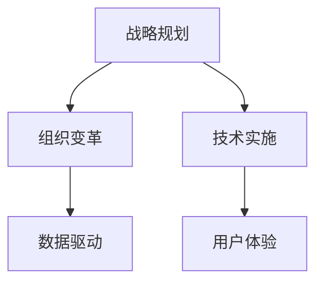

                 

 
# 引言

在当今这个快速变化的时代，数字化转型已经成为企业和组织追求的必然趋势。无论是传统行业还是新兴领域，数字化转型都已成为提升竞争力、创造价值和实现可持续发展的重要途径。本文旨在探讨数字化转型的重要性，并从多个维度深入分析如何引领组织进入智能时代。

## 文章关键词

- 数字化转型
- 智能时代
- 组织领导
- 技术创新
- 战略规划

## 摘要

本文从数字化转型的重要性出发，详细探讨了数字化转型的定义、框架与模型、战略规划与执行、实践与应用以及未来趋势与挑战。通过分析核心概念、算法原理、数学模型和实际案例，本文旨在为读者提供一套系统的数字化转型方法论，帮助组织领导者引领组织进入智能时代。

# 第一部分：数字化转型的背景与概念

## 1.1 数字化转型的定义与重要性

### 1.1.1 数字化转型的定义

数字化转型是指利用数字技术，如云计算、大数据、人工智能等，对业务流程、组织结构和商业模式进行系统性变革，以提升效率、创造价值和实现可持续发展。数字化转型的核心在于通过数据驱动的决策、用户体验的优化和技术创新的持续引入，实现业务的智能化和数字化。

#### 1.1.1.1 核心概念与联系

数字化转型涉及到多个核心概念：

- **数字化技术**：包括云计算、大数据、人工智能、物联网等。
- **业务模式变革**：包括流程重构、组织调整、商业模式创新等。
- **数据驱动**：通过数据分析、机器学习等手段，优化业务决策。


#### 1.1.1.2 数字化转型的意义

数字化转型的意义体现在以下几个方面：

- **提升效率**：通过自动化、智能化的手段，提高生产效率和服务质量。
- **创造价值**：通过数据分析和人工智能，创造新的商业模式和收入来源。
- **创新业务模式**：通过数字化转型，实现业务流程的优化和创新，提升竞争力。


#### 1.1.1.3 数字化转型的趋势

数字化转型的趋势体现在以下几个方面：

- **云计算普及**：云计算成为数字化转型的基础设施，提供灵活、高效的计算资源。
- **大数据应用深化**：大数据分析成为业务决策的重要支撑，帮助企业挖掘数据价值。
- **人工智能赋能**：人工智能技术广泛应用于各行各业，推动智能化升级。


## 1.2 数字化转型的框架与模型

### 1.2.1 数字化转型的关键因素

数字化转型成功的关键因素包括以下几个方面：

- **数据驱动**：利用数据分析和机器学习，实现数据驱动的决策。
- **用户体验**：以用户为中心，提供个性化服务和体验。
- **技术创新**：持续引入新技术，保持竞争优势。

#### 1.2.1.1 核心算法原理讲解

数据驱动的决策依赖于以下核心算法：

- **数据分析**：使用统计方法和机器学习算法，对大量数据进行处理和分析。
- **机器学习**：通过训练模型，从数据中提取规律和模式。

以下是一个简单的Python代码示例，展示如何使用数据分析：

```python
import pandas as pd
from sklearn.linear_model import LinearRegression

# 加载数据
data = pd.read_csv('data.csv')

# 数据预处理
X = data['feature']
y = data['target']

# 创建线性回归模型
model = LinearRegression()

# 拟合模型
model.fit(X, y)

# 预测
predictions = model.predict(X)

# 打印预测结果
print(predictions)
```

#### 1.2.1.2 数字化转型模型分析

数字化转型的模型通常包括以下三个层次：

1. **战略规划**：明确数字化转型的目标和路径。
2. **组织变革**：调整组织结构和文化，适应数字化转型。
3. **技术实施**：选择合适的技术方案，实施数字化转型。

以下是一个简化的数字化转型模型图：



### 1.2.2 数字化转型的技术变革

数字化转型离不开技术的支持，主要包括以下几方面：

- **云计算**：提供弹性、高效的计算资源，降低企业IT成本。
- **大数据**：通过大数据分析，挖掘数据价值，为企业提供决策支持。
- **人工智能**：通过机器学习和深度学习，实现智能化的业务流程和决策。

## 小结

本部分介绍了数字化转型的背景与概念，包括定义、意义、趋势和关键因素。通过核心概念与联系、算法原理讲解和数字化转型模型分析，帮助读者理解数字化转型的本质和实施方法。

## 下一步阅读

接下来，我们将探讨数字化转型的战略规划与执行，包括战略制定、组织变革和项目管理等内容。通过深入了解这些方面，读者将能够更好地理解如何有效推动数字化转型的落地。

# 第二部分：数字化转型的战略规划与执行

## 2.1 数字化转型战略的制定

数字化转型的战略制定是整个过程中至关重要的一环，它决定了数字化转型的方向、目标和路径。一个成功的数字化转型战略应具有明确的目标、详细的规划、合理的资源和强大的执行力。

### 2.1.1 数字化转型战略的制定原则

在制定数字化转型战略时，应遵循以下原则：

- **目标导向**：明确数字化转型的目标和期望成果，确保战略制定与组织愿景一致。
- **持续迭代**：数字化转型是一个持续的过程，战略应具备灵活性和可调整性，以适应市场和技术变化。
- **资源匹配**：确保数字化转型所需的资源得到有效配置，包括人力、财务和技术资源。
- **全员参与**：数字化转型涉及到组织内部的各个层级和部门，需要全员参与和共同努力。

### 2.1.2 数字化转型战略的制定流程

制定数字化转型战略的流程可以分为以下几个步骤：

1. **现状分析**：对组织的现状进行全面的评估，包括业务流程、技术架构、组织文化等。
2. **目标设定**：根据现状分析，明确数字化转型的目标和预期成果，如提高效率、降低成本、提升用户体验等。
3. **路径规划**：制定详细的数字化转型路径，包括短期目标和长期目标，以及实施步骤和时间表。
4. **资源规划**：根据数字化转型战略的需求，合理配置资源，确保战略能够得到有效执行。
5. **风险评估**：对数字化转型过程中可能遇到的风险进行评估，并制定相应的风险应对策略。
6. **战略沟通**：确保战略的透明度和可理解性，通过有效的沟通使全体员工了解数字化转型的目标和计划。

### 2.1.3 数字化转型战略的评估与调整

数字化转型战略的评估与调整是确保战略执行效果的重要环节。以下是评估与调整的几个关键点：

- **绩效评估**：定期对数字化转型的成果进行评估，包括业务指标、用户反馈等，以判断战略的执行效果。
- **反馈机制**：建立有效的反馈机制，收集员工的意见和建议，及时调整战略方向和执行计划。
- **持续优化**：根据评估结果和反馈，持续优化数字化转型战略，确保其与组织的发展和外部环境保持一致。
- **灵活调整**：面对市场和技术变化，数字化转型战略应具备足够的灵活性，能够快速响应和调整。

## 2.2 数字化转型的组织变革

数字化转型的成功不仅依赖于战略的制定和执行，还取决于组织的变革。组织变革是数字化转型的重要组成部分，它涉及到组织文化、组织结构和员工能力的转变。

### 2.2.1 数字化转型的组织文化

组织文化是数字化转型成功的关键因素之一。一个支持数字化转型的组织文化应具备以下特征：

- **创新精神**：鼓励员工勇于尝试新事物，接受新的技术和方法。
- **数据驱动**：将数据作为决策的重要依据，鼓励员工使用数据分析解决问题。
- **开放合作**：鼓励跨部门和跨领域的合作，打破信息孤岛，提高协同效率。
- **持续学习**：鼓励员工不断学习和更新知识，适应数字化时代的变革。

### 2.2.2 数字化转型的人才培养

数字化转型的成功离不开具备数字化技能和思维的员工。以下是数字化转型过程中的人才培养策略：

- **内部培训**：组织内部培训，提升员工的数字化技能和意识，包括数据分析、人工智能、云计算等。
- **外部引进**：引入具备数字化背景的高素质人才，为组织带来新的思维和方法。
- **岗位轮换**：通过岗位轮换，让员工在不同岗位上积累经验，提高综合能力。
- **激励机制**：建立激励机制，鼓励员工积极参与数字化转型，如设置数字化绩效考核指标。

### 2.2.3 数字化转型的组织结构优化

数字化转型的组织结构应具备灵活性和适应性，以适应快速变化的市场和技术环境。以下是数字化转型过程中组织结构优化的几个方向：

- **扁平化管理**：减少层级，提高决策效率，促进信息流通。
- **矩阵式管理**：建立矩阵式组织结构，实现跨部门协同和资源整合。
- **敏捷组织**：采用敏捷开发模式，提高组织的灵活性和响应速度。
- **数字化团队**：组建专门的数字化团队，负责数字化转型项目的推进和实施。

## 2.3 数字化转型的项目管理

数字化转型通常涉及多个项目和任务，因此项目管理至关重要。有效的项目管理可以确保数字化转型目标的实现，提高项目执行效率，降低风险。

### 2.3.1 数字化转型项目的立项与管理

数字化转型项目的立项与管理包括以下几个步骤：

- **项目立项**：明确项目目标、范围、预算和时间表，制定项目章程。
- **需求分析**：与相关利益相关者进行沟通，了解项目需求，制定详细的需求文档。
- **项目规划**：制定项目计划，包括任务分解、资源分配、时间表和风险评估。
- **项目执行**：按照项目计划执行项目任务，确保项目进度和质量。
- **项目监控**：定期监控项目进度和成本，确保项目按计划进行。
- **项目验收**：对项目成果进行验收，确保符合项目需求和标准。

### 2.3.2 数字化转型项目的风险与控制

数字化转型项目面临多种风险，包括技术风险、市场风险、组织风险等。有效的风险管理是项目成功的关键。以下是数字化转型项目的风险管理与控制措施：

- **风险识别**：识别项目中可能出现的风险，包括已知风险和潜在风险。
- **风险评估**：评估风险的严重性和可能性，确定风险优先级。
- **风险应对**：制定风险应对策略，包括风险规避、风险转移、风险接受等。
- **风险监控**：定期监控项目风险，确保风险应对措施得到有效执行。

### 2.3.3 数字化转型项目的评估与总结

数字化转型项目完成后，需要进行评估和总结，以评估项目成果和总结项目经验。以下是项目评估与总结的关键点：

- **成果评估**：评估项目是否达到预期目标和成果，包括业务绩效、用户满意度等。
- **经验总结**：总结项目过程中的成功经验和教训，为未来的数字化转型项目提供参考。
- **知识传承**：将项目过程中的知识和经验进行整理和传承，提高组织整体的数字化转型能力。
- **持续改进**：根据项目评估结果和反馈，持续改进项目管理和数字化转型策略。

## 小结

本部分详细介绍了数字化转型的战略规划与执行，包括战略制定、组织变革和项目管理等内容。通过有效的战略规划、组织变革和项目管理，组织可以更好地推动数字化转型，实现业务创新和可持续发展。

## 下一步阅读

接下来，我们将探讨数字化转型的实践与应用，包括关键应用领域、技术支持和案例研究等内容。通过深入了解这些方面，读者将能够更好地理解如何在实际业务中实施数字化转型。

## 第三部分：数字化转型的实践与应用

### 3.1 数字化转型的关键应用领域

数字化转型的实践不仅局限于理论层面的探讨，更需要深入到具体的应用领域。以下是一些关键应用领域，通过这些领域的实践，可以更好地理解数字化转型的实际效果和价值。

#### 3.1.1 数字化营销与客户体验

数字化营销是数字化转型的重要一环，它利用数据分析和人工智能技术，实现更精准、个性化的营销策略。以下是一些数字化营销的关键实践：

- **数据驱动的营销策略**：通过收集和分析用户数据，了解用户行为和需求，制定针对性的营销策略。
- **人工智能在营销中的应用**：利用机器学习算法，分析大量数据，预测用户偏好，实现精准推送和个性化营销。
- **客户体验优化**：通过数字化手段，提供更便捷、个性化的客户服务，提升客户满意度和忠诚度。

#### 3.1.2 数字化供应链管理

数字化供应链管理通过引入数字化技术和工具，优化供应链各环节的运作，提高供应链的灵活性和响应速度。以下是一些数字化供应链管理的关键实践：

- **供应链可视化**：通过物联网技术，实现对供应链各环节的实时监控和数据分析，提高供应链的可视化水平。
- **供应链协同**：通过数字化平台，实现供应链上下游企业的协同作业，提高供应链的整体效率。
- **智能库存管理**：利用大数据分析和人工智能技术，优化库存管理，减少库存成本，提高库存周转率。

#### 3.1.3 数字化人力资源管理

数字化人力资源管理利用数字化技术和工具，提升人力资源管理的效率和效果。以下是一些数字化人力资源管理的关键实践：

- **人才招聘与选拔**：通过在线招聘平台和人工智能筛选工具，实现更高效的人才招聘和选拔。
- **员工培训与发展**：利用在线学习平台和虚拟现实技术，提供个性化培训和发展计划，提高员工技能和素质。
- **绩效管理与反馈**：通过数字化工具，实现实时绩效管理和反馈，提高员工的工作效率和绩效。

### 3.2 数字化转型的技术支持

数字化转型的成功离不开技术的支持，以下是一些关键技术的应用：

- **云计算**：提供弹性、高效的计算资源，支持大规模数据处理和分析。
- **大数据**：通过大数据技术，实现海量数据的存储、处理和分析，为企业提供决策支持。
- **人工智能**：利用人工智能技术，实现自动化决策和智能服务，提高业务效率和用户体验。
- **物联网**：通过物联网技术，实现对物理世界的实时监控和数据分析，提升供应链管理和智能制造水平。

### 3.3 数字化转型的案例研究

为了更好地理解数字化转型的实践和应用，以下介绍几个成功的数字化转型案例：

#### 3.3.1 案例一：某零售企业的数字化转型

某大型零售企业通过数字化转型，实现了销售数据的实时监控和智能分析，优化了库存管理，提高了供应链效率。以下是其数字化转型的主要实践：

- **数据驱动的营销策略**：通过大数据分析，了解用户行为和需求，制定个性化的营销策略，提高销售额。
- **智能库存管理**：利用人工智能技术，实现智能库存预测和优化，减少库存成本，提高库存周转率。
- **供应链协同**：通过数字化平台，实现供应链上下游企业的实时协同，提高供应链的整体效率。

#### 3.3.2 案例二：某制造业企业的数字化转型

某制造业企业通过数字化转型，实现了生产过程的自动化和智能化，提高了生产效率和产品质量。以下是其数字化转型的主要实践：

- **智能制造**：引入物联网技术，实现生产设备的实时监控和数据分析，优化生产流程，提高生产效率。
- **质量控制**：通过大数据分析和人工智能技术，实现对产品质量的实时监控和预测，提高产品质量。
- **供应链协同**：通过数字化平台，实现供应链上下游企业的实时协同，提高供应链的整体效率。

#### 3.3.3 案例三：某金融行业的数字化转型

某金融行业企业通过数字化转型，实现了业务流程的自动化和智能化，提高了服务效率和客户满意度。以下是其数字化转型的主要实践：

- **自动化审批**：引入人工智能技术，实现贷款审批的自动化，提高审批效率和准确性。
- **智能客服**：通过大数据分析和自然语言处理技术，实现智能客服，提高客户服务质量和满意度。
- **风险管理**：利用大数据分析和人工智能技术，实现对风险的高效监控和预测，提高风险管理水平。

### 3.4 数字化转型的实际案例分析与详细讲解

以下是一个具体的数字化转型实际案例，通过对该案例的详细分析，可以更好地理解数字化转型的实际应用和效果。

#### 案例四：某物流公司的数字化转型

某物流公司通过数字化转型，实现了物流过程的实时监控和数据分析，提高了物流效率和客户满意度。以下是其数字化转型的主要实践：

- **物流过程可视化**：通过物联网技术，实现对物流过程的实时监控，包括货物位置、运输状态等，提高物流过程的透明度和可控性。
- **实时数据分析**：利用大数据技术，实时分析物流数据，优化运输路线和物流调度，提高物流效率。
- **智能仓储管理**：引入人工智能技术，实现仓储管理的自动化，包括库存管理、货物入库和出库等，提高仓储效率。

#### 案例分析

该物流公司的数字化转型主要涉及以下几个关键方面：

1. **物联网技术的应用**：通过物联网技术，实现对物流过程的实时监控，提高了物流过程的透明度和可控性。具体实现包括：
   - **RFID技术**：在货物和运输工具上安装RFID标签，实现对货物和运输工具的实时跟踪。
   - **GPS定位**：在运输工具上安装GPS设备，实时追踪运输工具的位置和行驶轨迹。

2. **大数据技术的应用**：通过大数据技术，实时分析物流数据，优化运输路线和物流调度，提高物流效率。具体实现包括：
   - **数据收集**：通过传感器、RFID等技术，收集物流过程中的各种数据，如货物位置、运输状态、货物重量等。
   - **数据存储**：利用云计算技术，将收集到的数据存储在云端，便于大规模数据分析和处理。

3. **人工智能技术的应用**：引入人工智能技术，实现仓储管理的自动化，提高仓储效率。具体实现包括：
   - **智能库存管理**：通过机器学习算法，预测货物入库和出库的时间，优化库存管理。
   - **自动化分拣**：利用计算机视觉技术，实现自动分拣货物，提高分拣效率和准确性。

#### 案例小结

通过该物流公司的数字化转型案例，可以总结出以下几点经验：

- **物联网技术**：实现对物流过程的实时监控，提高物流过程的透明度和可控性。
- **大数据技术**：通过实时数据分析，优化运输路线和物流调度，提高物流效率。
- **人工智能技术**：实现仓储管理的自动化，提高仓储效率。

这些实践经验对于其他企业的数字化转型具有借鉴意义，可以帮助其他企业更好地实施数字化转型，提高业务效率和竞争力。

## 小结

本部分详细介绍了数字化转型的实践与应用，包括关键应用领域、技术支持和实际案例分析。通过这些实践，企业可以更好地理解数字化转型的具体应用和方法，从而实现业务创新和可持续发展。

## 下一步阅读

接下来，我们将探讨数字化转型的未来趋势与挑战，包括新技术的发展、数字化转型的可持续发展以及数字化转型过程中的风险和应对策略。通过了解这些趋势和挑战，读者可以更好地应对数字化转型的挑战，把握未来的机遇。

## 第四部分：数字化转型的未来趋势与挑战

### 4.1 数字化转型的未来趋势

数字化转型是一个持续的过程，随着技术的不断进步和市场的变化，数字化转型的趋势也在不断演变。以下是一些关键的数字化转型未来趋势：

#### 4.1.1 新技术的演变趋势

- **人工智能与机器学习**：人工智能和机器学习技术将在数字化转型中扮演越来越重要的角色。通过更先进的算法和模型，企业可以更准确地预测市场趋势、优化业务流程、提高决策效率。
- **区块链技术**：区块链技术以其去中心化、安全性和不可篡改的特性，在供应链管理、金融交易、数据安全等领域具有广阔的应用前景。
- **5G和物联网**：5G技术的广泛应用和物联网设备的普及，将大幅提升数据传输速度和网络连接能力，为数字化业务的发展提供更强大的基础设施支持。

#### 4.1.2 数字化转型的未来方向

- **全链路数字化**：未来的数字化转型将不仅限于个别业务环节，而是实现全链路的数字化，包括供应链、生产、销售、服务等各个环节，实现真正的端到端数字化业务流程。
- **智能服务与个性化体验**：通过人工智能和大数据技术，提供更加智能化的服务和个性化的用户体验，提高用户满意度和忠诚度。
- **可持续数字化转型**：未来的数字化转型将更加注重可持续性，包括环境可持续性和经济可持续性，推动企业在数字化转型过程中实现绿色发展和可持续发展。

#### 4.1.3 数字化转型对行业的影响

- **制造业**：智能制造和工业互联网将重塑制造业的生态，提高生产效率、降低成本、提升产品质量。
- **服务业**：数字化服务将成为主流，通过数字化手段提供更加便捷、高效、个性化的服务，改变服务业的运作模式和商业模式。
- **金融业**：区块链和人工智能技术的应用，将大幅提高金融服务的效率和安全性，推动金融业的数字化转型。

### 4.2 数字化转型的挑战与应对

尽管数字化转型带来了巨大的机遇，但同时也面临着诸多挑战。以下是一些主要的挑战以及应对策略：

#### 4.2.1 数字化转型的挑战

- **技术挑战**：数字化转型需要掌握和运用各种新技术，如人工智能、大数据、物联网等，这对企业的技术能力和人才储备提出了很高的要求。
- **组织挑战**：数字化转型涉及到企业内部的组织结构调整和文化变革，如何确保全员参与和共识，是数字化转型成功的关键。
- **数据安全与隐私**：随着数据的广泛应用，数据安全和隐私保护成为数字化转型的重要问题，如何确保数据的安全性和合规性，是数字化转型面临的重要挑战。
- **人才短缺**：数字化转型的推进需要大量的数字化人才，但人才短缺成为许多企业面临的问题。

#### 4.2.2 应对策略

- **技术升级与培训**：企业应积极引进和掌握新技术，同时加强对员工的培训，提高员工的技术能力和数字化素养。
- **组织变革与文化重塑**：企业应通过组织变革和文化重塑，建立适应数字化转型的组织结构和企业文化，确保全员参与和支持。
- **数据安全与合规**：企业应建立健全的数据安全体系和隐私保护机制，确保数据的安全性和合规性，同时加强内部审计和合规管理。
- **人才引进与培养**：企业应积极引进数字化人才，同时通过内部培养和外部合作，提高员工的数字化技能和知识水平。

### 4.3 数字化转型的政策与法规

数字化转型不仅需要企业自身的努力，还需要政策与法规的支持。以下是一些关键的政策与法规：

- **政府支持**：政府应出台支持数字化转型的政策，包括资金支持、税收优惠、人才引进等，为企业提供有利的外部环境。
- **行业标准**：制定和推广数字化转型的行业标准，规范数字化转型的过程和方法，提高行业整体水平。
- **数据保护法**：制定和实施数据保护法，保护个人隐私和数据安全，为数字化转型提供法律保障。

### 4.4 数字化转型的可持续发展

数字化转型的可持续发展是企业长期成功的关键。以下是一些实现数字化转型的可持续发展的策略：

- **绿色数字化**：在数字化转型过程中，注重环保和可持续发展，采用绿色技术和绿色运营模式，减少对环境的负面影响。
- **社会责任**：在数字化转型过程中，注重企业的社会责任，通过数字化手段提升社会福祉，实现企业与社会共赢。
- **创新能力**：持续创新是数字化转型可持续发展的动力，企业应不断探索新技术和新模式，保持市场竞争力和创新能力。

## 小结

本部分探讨了数字化转型的未来趋势与挑战，包括新技术的发展、数字化转型的可持续发展以及数字化转型过程中的风险和应对策略。通过了解这些趋势和挑战，企业可以更好地应对数字化转型的挑战，把握未来的机遇，实现可持续发展。

## 下一步阅读

在下一部分中，我们将提供一些关于数字化转型的最佳实践、注意事项以及拓展阅读资源，帮助读者进一步深入理解和实践数字化转型。

## 附录

### A.1 数字化转型相关术语解释

在本附录中，我们将对数字化转型过程中常用的一些术语进行解释，以便读者更好地理解相关概念。

- **数字化转型**：指企业利用数字技术，如云计算、大数据、人工智能等，对业务流程、组织结构和商业模式进行系统性变革，以提升效率、创造价值和实现可持续发展。
- **云计算**：一种通过网络提供计算资源的服务模式，用户可以按需获取和使用计算资源，如存储、处理能力和网络带宽等。
- **大数据**：指无法用常规数据库软件工具进行捕捉、管理和处理的数据集，具有大量、高速、多样和复杂的特点。
- **人工智能**：一种模拟人类智能的技术，通过机器学习、自然语言处理、计算机视觉等方法，实现计算机对数据的自动分析和决策。
- **物联网**：通过将物理设备连接到互联网，实现设备间的互联互通和数据交换，从而实现对物理世界的实时监控和智能管理。

### A.2 数字化转型资源推荐

为了帮助读者更好地了解和实施数字化转型，我们推荐以下资源：

- **书籍**：
  - 《数字化企业：数字化转型实战指南》
  - 《人工智能时代：企业如何应对数字化转型》
  - 《云计算实践：架构、技术和案例》
- **在线课程**：
  - Coursera上的《大数据分析》课程
  - Udacity的《人工智能纳米学位》课程
  - edX上的《云计算基础》课程
- **研究报告**：
  -麦肯锡全球研究所的《数字化时代的组织转型》
  - Gartner的《2021年数字化转型趋势》
  - IBM的《数字化企业报告》

### A.3 数字化转型研究报告精选

以下是一些数字化转型领域的经典研究报告，供读者参考：

- **《数字化时代的企业战略》**：该报告详细分析了数字化时代企业的战略转型，探讨了数字化技术的应用和业务模式的创新。
- **《数字化转型中的领导力》**：该报告探讨了数字化转型中领导力的重要性，以及如何培养和提升数字化领导力。
- **《数字化转型对劳动市场的影响》**：该报告分析了数字化转型对劳动市场的影响，包括就业机会的变化、技能需求的变化等。

### A.4 最佳实践、小结、注意事项

在数字化转型过程中，以下是一些最佳实践、小结和注意事项：

- **最佳实践**：
  - 制定清晰的数字化转型战略和规划。
  - 注重数据安全和隐私保护。
  - 加强人才培养和知识分享。
  - 跨部门协作，实现资源的最大化利用。

- **小结**：
  - 数字化转型是企业持续发展的重要手段。
  - 成功的数字化转型需要战略、技术、组织和文化的协同推进。
  - 数字化转型是一个持续的过程，需要不断地评估和优化。

- **注意事项**：
  - 不要盲目跟风，要结合自身实际情况制定数字化转型计划。
  - 注重与员工的沟通和参与，确保全员支持。
  - 注重数字化转型过程中的风险管理和控制。

### A.5 拓展阅读

为了帮助读者更深入地了解数字化转型，以下是一些拓展阅读资源：

- **博客文章**：
  - 《如何构建数字化转型的成功案例？》
  - 《数字化转型中的五个关键步骤》
  - 《数字化转型中的领导角色》

- **在线社区**：
  - CSDN的数字化转型专栏
  - 知乎上的数字化转型话题
  - LinkedIn上的数字化转型群组

通过以上资源，读者可以更加全面和深入地了解数字化转型的理论、实践和未来趋势，为自己的数字化转型之路提供有益的指导。

## 总结

数字化转型已经成为当今企业发展的关键驱动力，它不仅改变了企业的运营模式，还提升了企业的竞争力。本文从数字化转型的背景与概念、战略规划与执行、实践与应用、未来趋势与挑战等多个维度，全面探讨了数字化转型的核心内容。通过深入分析核心概念、算法原理、数学模型和实际案例，本文旨在为读者提供一套系统的数字化转型方法论。

数字化转型不仅仅是技术的变革，更是组织文化的重塑和业务模式的创新。在这个过程中，领导者扮演着至关重要的角色，他们需要具备前瞻性思维、战略眼光和强大的执行力，引领组织迈向智能时代。

最后，我们鼓励读者将本文的理论和实践应用于实际工作中，积极探索数字化转型的最佳路径，不断提升企业的数字化水平和竞争力。通过不断学习和实践，我们相信每位读者都能在数字化转型的浪潮中，找到属于自己的成功之路。

## 作者信息

作者：AI天才研究院/AI Genius Institute & 禅与计算机程序设计艺术 /Zen And The Art of Computer Programming

AI天才研究院致力于推动人工智能领域的研究与应用，为企业和组织提供领先的数字化转型解决方案。同时，作者还是《禅与计算机程序设计艺术》一书的作者，本书深入探讨了计算机编程的艺术和哲学，对技术领域有深刻的影响。

