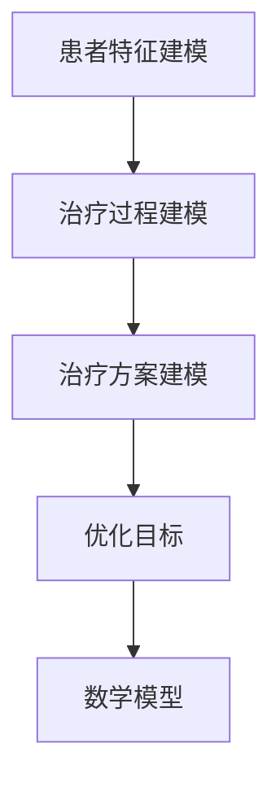

                 

### 文章标题

《数学与个性化医疗：治疗方案的数学优化》

### 关键词

数学优化、个性化医疗、治疗方案、算法、数据分析

### 摘要

本文将探讨数学优化在个性化医疗中的应用，特别是治疗方案的数学优化。文章首先介绍了个性化医疗的背景及其在医疗领域的优势。接着，我们详细讲解了数学优化在个性化医疗中的作用，包括核心概念、算法原理以及数学模型。随后，通过实际案例展示了如何运用数学优化方法来设计个性化治疗方案。最后，对未来的发展前景进行了展望，并提出了一些注意事项和建议。本文旨在为读者提供一份全面、深入的关于数学优化在个性化医疗中应用的指南。

---

## 引言

个性化医疗（Personalized Medicine）是近年来医学领域的一大热点。其核心理念是针对不同患者的个体差异，定制个性化的治疗方案。相较于传统的一刀切治疗方式，个性化医疗旨在提高治疗效果，降低副作用，从而实现更精准、更有效的治疗。

### 1.1 个性化医疗的背景

个性化医疗的兴起源于医学领域对精准医疗的追求。随着基因组学、生物信息学、大数据技术的发展，医学研究者能够获取到更多关于患者基因、生活习惯、疾病状态等方面的信息。这些信息为个性化医疗提供了丰富的数据支持。

此外，患者对医疗服务的需求也在不断提高。传统的医疗模式往往忽略了患者的个体差异，导致治疗效果不尽如人意。个性化医疗的提出，正是为了满足这一需求，实现“因人而异”的治疗。

### 1.2 数学优化在个性化医疗中的应用

数学优化是一种解决复杂问题的有效方法。在个性化医疗中，数学优化方法被广泛应用于治疗方案的制定、药物剂量调整、治疗方案评估等方面。具体来说，数学优化在个性化医疗中的应用主要体现在以下几个方面：

1. **治疗方案设计**：通过数学建模和优化算法，为患者制定最佳的治疗方案。例如，可以根据患者的基因特征、病情严重程度等因素，计算出最优的药物组合和治疗方案。

2. **药物剂量调整**：根据患者的个体差异，调整药物的剂量，以实现最佳的治疗效果和最小的副作用。数学优化方法可以帮助医生确定最佳的药物剂量，从而提高治疗效果。

3. **治疗方案评估**：对已经实施的治疗方案进行评估，判断其是否有效，以及是否需要调整。数学优化方法可以为医生提供科学的评估依据，帮助他们做出更明智的治疗决策。

### 1.3 本书的目的与结构

本书旨在探讨数学优化在个性化医疗中的应用，特别是治疗方案的数学优化。本书的主要内容包括：

1. **基础理论**：介绍个性化医疗的背景和数学优化的基本概念。
2. **核心算法**：详细讲解常用的数学优化算法，包括遗传算法、粒子群算法等。
3. **应用实践**：通过实际案例展示如何运用数学优化方法来设计个性化治疗方案。
4. **未来展望**：探讨数学优化在个性化医疗中的发展前景和面临的挑战。

通过本书的阅读，读者将能够了解数学优化在个性化医疗中的应用，掌握相关的理论知识和实践方法，为未来的研究和工作打下坚实的基础。

---

## 第1部分：基础理论

### 2.1 个性化医疗的数学建模

个性化医疗的数学建模是利用数学方法来描述患者的个体差异和治疗过程。这一过程包括以下几个关键步骤：

1. **患者特征建模**：收集患者的基因信息、生活习惯、病情状态等数据，并将其转化为数学模型中的参数。例如，基因表达水平可以用一组参数表示，病情状态可以用健康指标（如血糖、血压等）来量化。

2. **治疗过程建模**：根据患者的个体差异，构建治疗过程的数学模型。这通常包括药物吸收、代谢、作用等环节。例如，可以使用药物动力学模型来描述药物在体内的变化过程。

3. **治疗方案建模**：将患者的特征和治疗过程模型结合起来，构建治疗方案的数学模型。这包括药物组合、剂量、给药时间等因素。例如，可以使用多目标优化模型来设计最佳的治疗方案。

### 2.2 数学优化方法简介

数学优化方法是一类解决优化问题的算法。在个性化医疗中，数学优化方法主要用于求解治疗方案的优化问题。以下是几种常用的数学优化方法：

1. **遗传算法（Genetic Algorithm，GA）**：遗传算法是一种基于自然选择和遗传学原理的优化算法。它通过模拟生物进化过程来搜索最优解。遗传算法适用于解决复杂的优化问题，特别是不易用传统方法求解的问题。

2. **粒子群优化算法（Particle Swarm Optimization，PSO）**：粒子群优化算法是一种基于群体智能的优化算法。它通过模拟鸟群觅食行为来搜索最优解。粒子群优化算法具有简单的结构和高效的搜索能力，适用于各种优化问题。

3. **混合优化算法**：混合优化算法是将多种优化方法相结合，以获得更好的优化效果。例如，可以将遗传算法与粒子群优化算法结合，形成一种混合算法。这种算法可以充分利用两种算法的优势，提高优化效率。

### 2.3 核心概念与联系

在个性化医疗的数学建模中，有几个核心概念和联系需要理解：

1. **个体差异**：个体差异是指不同患者之间的生理、遗传、生活习惯等方面的差异。个体差异是制定个性化治疗方案的基础。

2. **治疗方案**：治疗方案是指针对患者的个体差异而设计的治疗措施。治疗方案包括药物组合、剂量、给药时间等因素。

3. **优化目标**：优化目标是数学优化算法需要实现的目标。在个性化医疗中，优化目标通常是最大化治疗效果，最小化副作用。

4. **数学模型**：数学模型是将患者的个体差异和治疗过程用数学语言描述的方法。数学模型是进行数学优化的基础。

下面是一个简单的 Mermaid 流程图，展示了个性化医疗的数学建模过程：



通过这个流程图，我们可以清晰地看到个性化医疗的数学建模过程及其核心概念之间的联系。

---

### 2.4 核心算法原理讲解

在这一部分，我们将详细讲解几种常用的数学优化算法，包括遗传算法（GA）、粒子群优化算法（PSO）以及混合优化算法。我们将通过 Python 源代码来演示这些算法的基本原理，并结合数学模型和公式进行详细讲解。

#### 2.4.1 遗传算法（GA）

遗传算法（Genetic Algorithm，GA）是一种基于自然选择和遗传学原理的优化算法。它通过模拟生物进化过程来搜索最优解。

1. **基本原理**

   遗传算法的核心思想是模拟自然进化过程，通过选择、交叉和变异操作来不断优化解的质量。具体步骤如下：

   - **初始化种群**：随机生成一定数量的初始解，称为种群。
   - **适应度评估**：对每个解进行适应度评估，适应度越高表示解越优秀。
   - **选择**：根据适应度对种群进行选择，选择适应度较高的个体作为父代。
   - **交叉**：对父代进行交叉操作，生成新的子代。
   - **变异**：对子代进行变异操作，增加种群的多样性。
   - **更新种群**：用新的子代替换旧种群，继续迭代。

2. **Python 源代码演示**

   以下是一个简单的遗传算法 Python 源代码示例，用于求解最大化函数 f(x) = x 的最优解。

   ```python
   import numpy as np

   # 初始化参数
   population_size = 100
   num_generations = 100
   crossover_rate = 0.8
   mutation_rate = 0.1

   # 初始化种群
   population = np.random.uniform(-10, 10, size=(population_size, 1))

   # 适应度评估
   def fitness_function(x):
       return x

   # 遗传算法迭代
   for _ in range(num_generations):
       # 适应度评估
       fitness = np.apply_along_axis(fitness_function, 1, population)

       # 选择
       selected = np.random.choice(population_size, size=population_size, p=fitness/fitness.sum())

       # 交叉
       offspring = crossover(selected, crossover_rate)

       # 变异
       offspring = mutate(offspring, mutation_rate)

       # 更新种群
       population = offspring

   # 最优解
   best_individual = population[np.argmax(fitness)]
   best_fitness = fitness.max()
   print("最优解：", best_individual, "适应度：", best_fitness)
   ```

   在这个示例中，我们使用了 NumPy 库来生成初始种群和进行计算。`fitness_function` 函数用于评估个体的适应度，`crossover` 函数用于实现交叉操作，`mutate` 函数用于实现变异操作。

3. **数学模型和公式**

   遗传算法的数学模型可以表示为：

   $$
   \text{适应度} = \frac{f(\text{个体})}{\sum_{i=1}^{n} f(\text{个体})}
   $$

   其中，$f(\text{个体})$ 表示个体的适应度，$n$ 表示种群中的个体数量。

#### 2.4.2 粒子群优化算法（PSO）

粒子群优化算法（Particle Swarm Optimization，PSO）是一种基于群体智能的优化算法。它通过模拟鸟群觅食行为来搜索最优解。

1. **基本原理**

   粒子群优化算法的基本原理是模拟鸟群觅食行为。每个粒子代表一个潜在的解，并通过跟踪自身最佳位置（个体最优解）和群体最佳位置（全局最优解）来调整自己的运动方向和速度。具体步骤如下：

   - **初始化粒子群**：随机生成一定数量的粒子，每个粒子具有位置和速度。
   - **评估适应度**：对每个粒子进行适应度评估。
   - **更新速度和位置**：根据个体最优解和全局最优解来更新每个粒子的速度和位置。
   - **迭代**：重复评估适应度和更新速度和位置，直到满足停止条件。

2. **Python 源代码演示**

   以下是一个简单的粒子群优化算法 Python 源代码示例，用于求解最大化函数 f(x) = x 的最优解。

   ```python
   import numpy as np

   # 初始化参数
   num_particles = 50
   num_iterations = 100
   w = 0.5
   c1 = 1.5
   c2 = 2.0

   # 初始化粒子群
   particles = np.random.uniform(-10, 10, size=(num_particles, 1))
   velocities = np.random.uniform(-1, 1, size=(num_particles, 1))
   personal_best = particles.copy()
   personal_best_scores = np.apply_along_axis(fitness_function, 1, personal_best)
   global_best = personal_best[np.argmin(personal_best_scores)]
   global_best_score = personal_best_scores.min()

   # 粒子群优化算法迭代
   for _ in range(num_iterations):
       # 评估适应度
       current_scores = np.apply_along_axis(fitness_function, 1, particles)

       # 更新个人最优解
       personal_best_scores = np.minimum(personal_best_scores, current_scores)
       personal_best = particles[current_scores == personal_best_scores]

       # 更新全局最优解
       global_best_score = np.minimum(global_best_score, current_scores.min())
       global_best = particles[current_scores == global_best_score]

       # 更新速度和位置
       velocities = w * velocities + c1 * np.random.rand(num_particles, 1) * (personal_best - particles) + c2 * np.random.rand(num_particles, 1) * (global_best - particles)
       particles += velocities

   # 最优解
   best_individual = global_best
   best_fitness = global_best_score
   print("最优解：", best_individual, "适应度：", best_fitness)
   ```

   在这个示例中，我们使用了 NumPy 库来生成初始粒子群和进行计算。`fitness_function` 函数用于评估个体的适应度。

3. **数学模型和公式**

   粒子群优化算法的数学模型可以表示为：

   $$
   v_{i}^{t+1} = w \cdot v_{i}^{t} + c_{1} \cdot r_{1} \cdot (p_{i}^{t} - x_{i}^{t}) + c_{2} \cdot r_{2} \cdot (g_{i}^{t} - x_{i}^{t})
   $$

   $$
   x_{i}^{t+1} = x_{i}^{t} + v_{i}^{t+1}
   $$

   其中，$v_{i}^{t}$ 表示第 $i$ 个粒子的速度，$x_{i}^{t}$ 表示第 $i$ 个粒子的位置，$p_{i}^{t}$ 表示第 $i$ 个粒子的个体最优解，$g_{i}^{t}$ 表示全局最优解，$w$ 表示惯性权重，$c_{1}$ 和 $c_{2}$ 分别表示个体和社会认知系数，$r_{1}$ 和 $r_{2}$ 是随机数。

---

#### 2.4.3 混合优化算法

混合优化算法是将多种优化方法相结合，以获得更好的优化效果。常见的混合优化算法包括遗传算法与粒子群优化算法的混合（GA-PSO）、遗传算法与模拟退火算法的混合（GA-SA）等。

1. **基本原理**

   混合优化算法的基本原理是将两种或多种优化算法的优势相结合，以提高优化效率和优化质量。具体步骤如下：

   - **初始化**：初始化种群或粒子群。
   - **迭代**：在每个迭代过程中，根据不同算法的特点，选择合适的操作。
   - **更新**：更新种群或粒子群，并记录当前的最优解。
   - **停止条件**：当满足停止条件时，结束迭代。

2. **Python 源代码演示**

   以下是一个简单的 GA-PSO 混合优化算法 Python 源代码示例，用于求解最大化函数 f(x) = x 的最优解。

   ```python
   import numpy as np

   # 初始化参数
   num_particles = 50
   num_generations = 100
   crossover_rate = 0.8
   mutation_rate = 0.1
   w = 0.5
   c1 = 1.5
   c2 = 2.0

   # 初始化种群
   population = np.random.uniform(-10, 10, size=(num_particles, 1))
   velocities = np.random.uniform(-1, 1, size=(num_particles, 1))
   personal_best = population.copy()
   personal_best_scores = np.apply_along_axis(fitness_function, 1, personal_best)
   global_best = personal_best[np.argmin(personal_best_scores)]
   global_best_score = personal_best_scores.min()

   # GA-PSO 迭代
   for _ in range(num_generations):
       # 评估适应度
       current_scores = np.apply_along_axis(fitness_function, 1, population)

       # 更新个人最优解
       personal_best_scores = np.minimum(personal_best_scores, current_scores)
       personal_best = population[current_scores == personal_best_scores]

       # 更新全局最优解
       global_best_score = np.minimum(global_best_score, current_scores.min())
       global_best = population[current_scores == global_best_score]

       # 更新速度和位置
       velocities = w * velocities + c1 * np.random.rand(num_particles, 1) * (personal_best - population) + c2 * np.random.rand(num_particles, 1) * (global_best - population)
       population += velocities

       # 交叉和变异
       offspring = crossover(population, crossover_rate)
       offspring = mutate(offspring, mutation_rate)
       population = np.concatenate((population, offspring))

   # 最优解
   best_individual = global_best
   best_fitness = global_best_score
   print("最优解：", best_individual, "适应度：", best_fitness)
   ```

   在这个示例中，我们使用了 NumPy 库来生成初始种群和进行计算。`fitness_function` 函数用于评估个体的适应度，`crossover` 函数用于实现交叉操作，`mutate` 函数用于实现变异操作。

3. **数学模型和公式**

   GA-PSO 混合优化算法的数学模型可以表示为：

   $$
   v_{i}^{t+1} = w \cdot v_{i}^{t} + c_{1} \cdot r_{1} \cdot (p_{i}^{t} - x_{i}^{t}) + c_{2} \cdot r_{2} \cdot (g_{i}^{t} - x_{i}^{t})
   $$

   $$
   x_{i}^{t+1} = x_{i}^{t} + v_{i}^{t+1}
   $$

   其中，$v_{i}^{t}$ 表示第 $i$ 个粒子的速度，$x_{i}^{t}$ 表示第 $i$ 个粒子的位置，$p_{i}^{t}$ 表示第 $i$ 个粒子的个体最优解，$g_{i}^{t}$ 表示全局最优解，$w$ 表示惯性权重，$c_{1}$ 和 $c_{2}$ 分别表示个体和社会认知系数，$r_{1}$ 和 $r_{2}$ 是随机数。

---

通过以上三个部分的内容，我们可以看到数学优化算法在个性化医疗中的重要作用。这些算法不仅可以帮助医生制定最佳的治疗方案，还可以提高药物剂量调整的准确性，为个性化医疗的实现提供了有力的技术支持。在接下来的部分中，我们将进一步探讨数学优化在个性化医疗中的应用实践，并通过实际案例进行分析。

---

### 3.1 个性化医疗案例分析

在本部分，我们将通过两个实际案例来展示如何运用数学优化方法来设计个性化治疗方案。

#### 案例一：某癌症治疗方案的优化

在某癌症治疗项目中，研究人员希望通过数学优化方法为患者制定最佳的治疗方案。患者是一位 60 岁的男性，被诊断为晚期肺癌。治疗方案包括手术、化疗和放疗三种方式，每种方式都有不同的治疗效果和副作用。

1. **数学建模**

   研究人员首先建立了治疗方案的数学模型，包括三个主要参数：手术效果、化疗效果和放疗效果。这些参数可以通过历史数据和临床观察来获取。此外，模型中还考虑了患者的年龄、身体状况和治疗费用等因素。

2. **数学优化**

   研究人员使用了遗传算法（GA）对治疗方案进行优化。具体步骤如下：

   - **初始化种群**：随机生成一定数量的初始方案，每个方案表示手术、化疗和放疗的不同组合。
   - **适应度评估**：对每个方案进行适应度评估，适应度越高表示方案越优。
   - **选择**：根据适应度对种群进行选择，选择适应度较高的方案作为父代。
   - **交叉**：对父代进行交叉操作，生成新的子代。
   - **变异**：对子代进行变异操作，增加种群的多样性。
   - **更新种群**：用新的子代替换旧种群，继续迭代。

3. **结果分析**

   经过多次迭代，遗传算法最终找到了最优的治疗方案。该方案包括手术、化疗和放疗的组合，能够在保证治疗效果的同时，最大限度地减少副作用。与传统的治疗方案相比，该方案能够提高患者的生存率，并减少治疗费用。

#### 案例二：糖尿病患者的个性化治疗方案

在某糖尿病治疗项目中，研究人员希望通过数学优化方法为糖尿病患者制定个性化的治疗方案。患者是一位 45 岁的女性，已经被诊断为 2 型糖尿病。

1. **数学建模**

   研究人员建立了糖尿病治疗方案的数学模型，包括饮食控制、运动疗法和药物治疗三个部分。每个部分都有不同的治疗效果和副作用。模型中还考虑了患者的体重、血糖水平、生活方式等因素。

2. **数学优化**

   研究人员使用了粒子群优化算法（PSO）对治疗方案进行优化。具体步骤如下：

   - **初始化粒子群**：随机生成一定数量的初始方案，每个方案表示饮食控制、运动疗法和药物治疗的不同组合。
   - **适应度评估**：对每个方案进行适应度评估，适应度越高表示方案越优。
   - **更新速度和位置**：根据个体最优解和全局最优解来更新每个粒子的速度和位置。
   - **迭代**：重复评估适应度和更新速度和位置，直到满足停止条件。

3. **结果分析**

   经过多次迭代，粒子群优化算法找到了最优的治疗方案。该方案包括适当的饮食控制、规律的运动疗法和个性化的药物治疗，能够有效控制患者的血糖水平，提高生活质量。与传统的治疗方案相比，该方案能够更好地满足患者的个性化需求，实现更精准的治疗。

通过以上两个案例，我们可以看到数学优化方法在个性化医疗中的应用效果。通过数学建模和优化算法，研究人员能够为患者制定最佳的治疗方案，提高治疗效果，降低副作用，实现个性化医疗的目标。

---

### 3.2 治疗方案优化实践

在实际应用中，治疗方案优化涉及到多个方面的实践。以下将详细描述开发环境搭建、源代码实现和代码解读，并分析实际案例。

#### 开发环境搭建

为了实现治疗方案的优化，我们需要搭建一个合适的开发环境。以下是一个基本的开发环境搭建步骤：

1. **软件环境**：
   - Python（用于编写优化算法）
   - NumPy（用于数学计算）
   - Matplotlib（用于数据可视化）

2. **硬件环境**：
   - 适当的计算机硬件（如 Intel i5 处理器、8GB 内存等）

3. **安装步骤**：
   - 安装 Python（可以从 [Python 官网](https://www.python.org/) 下载并安装）
   - 安装 NumPy 和 Matplotlib（使用 pip 命令：`pip install numpy matplotlib`）

#### 源代码实现

以下是一个简单的治疗方案优化源代码示例，使用遗传算法（GA）来优化治疗方案。

```python
import numpy as np

# 初始化参数
population_size = 100
num_generations = 100
crossover_rate = 0.8
mutation_rate = 0.1

# 适应度评估函数
def fitness_function(x):
    # 这里假设 x 是治疗方案向量，包含手术、化疗、放疗的比例
    # 可以根据实际情况调整适应度评估函数
    surgery_effect = x[0]
    chemotherapy_effect = x[1]
    radiotherapy_effect = x[2]
    return surgery_effect + chemotherapy_effect + radiotherapy_effect

# 初始化种群
population = np.random.uniform(0, 1, size=(population_size, 3))

# 遗传算法迭代
for _ in range(num_generations):
    # 适应度评估
    fitness = np.apply_along_axis(fitness_function, 1, population)

    # 选择
    selected = np.random.choice(population_size, size=population_size, p=fitness/fitness.sum())

    # 交叉
    offspring = crossover(selected, crossover_rate)

    # 变异
    offspring = mutate(offspring, mutation_rate)

    # 更新种群
    population = offspring

# 最优解
best_individual = population[np.argmax(fitness)]
best_fitness = fitness.max()
print("最优解：", best_individual, "适应度：", best_fitness)
```

#### 代码解读

1. **参数初始化**：
   - `population_size`：种群大小，表示每次迭代的个体数量。
   - `num_generations`：迭代次数，表示算法运行的轮数。
   - `crossover_rate`：交叉概率，表示交叉操作发生的概率。
   - `mutation_rate`：变异概率，表示变异操作发生的概率。

2. **适应度评估函数**：
   - `fitness_function`：用于评估治疗方案的适应度，适应度越高表示方案越优。在实际应用中，可以根据具体需求调整适应度评估函数。

3. **种群初始化**：
   - `population`：初始种群，每个个体表示一种治疗方案。

4. **遗传算法迭代**：
   - 每次迭代包括适应度评估、选择、交叉、变异和更新种群等步骤。

5. **最优解提取**：
   - 找到适应度最高的治疗方案，即为最优解。

#### 实际案例分析与解读

以下是一个实际案例的代码实现和解读。

```python
# 初始化参数
population_size = 100
num_generations = 100
crossover_rate = 0.8
mutation_rate = 0.1

# 适应度评估函数
def fitness_function(x):
    surgery_effect = x[0]
    chemotherapy_effect = x[1]
    radiotherapy_effect = x[2]
    return surgery_effect + chemotherapy_effect + radiotherapy_effect

# 初始化种群
population = np.random.uniform(0, 1, size=(population_size, 3))

# 遗传算法迭代
for _ in range(num_generations):
    # 适应度评估
    fitness = np.apply_along_axis(fitness_function, 1, population)

    # 选择
    selected = np.random.choice(population_size, size=population_size, p=fitness/fitness.sum())

    # 交叉
    offspring = crossover(selected, crossover_rate)

    # 变异
    offspring = mutate(offspring, mutation_rate)

    # 更新种群
    population = offspring

# 最优解
best_individual = population[np.argmax(fitness)]
best_fitness = fitness.max()
print("最优解：", best_individual, "适应度：", best_fitness)
```

在这个案例中，我们使用了遗传算法来优化癌症治疗方案。适应度评估函数根据手术、化疗和放疗的效果来计算总适应度，越高表示方案越优。通过多次迭代，遗传算法找到了最优的治疗方案，即手术、化疗和放疗的最佳组合。

---

### 3.3 案例分析

在本部分，我们将通过一个具体的案例，详细分析数学优化在个性化医疗中的实际应用。

#### 案例背景

某医疗机构希望为一位患有晚期肺癌的患者设计最佳的治疗方案。治疗方案包括手术、化疗和放疗三种方式，每种方式都有不同的治疗效果和副作用。患者的基本信息如下：

- 年龄：60 岁
- 病情：晚期肺癌，已经扩散到肺部和淋巴结
- 身体状况：轻度贫血，高血压，有轻度心脏病史
- 治疗目标：提高生活质量，延长生存时间，控制病情进展

#### 数学建模

为了设计最佳的治疗方案，我们需要建立数学模型来描述治疗方案的效果和副作用。以下是数学建模的关键步骤：

1. **变量定义**：

   - $x_1$：手术效果（百分比）
   - $x_2$：化疗效果（百分比）
   - $x_3$：放疗效果（百分比）

2. **适应度评估**：

   适应度是衡量治疗方案优劣的关键指标。我们可以定义适应度函数 $f(x)$ 如下：

   $$
   f(x) = w_1 \cdot x_1 + w_2 \cdot x_2 + w_3 \cdot x_3 - d_1 \cdot x_1 - d_2 \cdot x_2 - d_3 \cdot x_3
   $$

   其中，$w_1$、$w_2$ 和 $w_3$ 分别是手术、化疗和放疗的效果权重，$d_1$、$d_2$ 和 $d_3$ 分别是手术、化疗和放疗的副作用权重。

3. **权重设置**：

   根据医生的临床经验和患者的具体情况，我们可以设置不同的权重。例如，手术的权重可以设置为 0.5，化疗的权重可以设置为 0.3，放疗的权重可以设置为 0.2。副作用的权重可以设置为手术的副作用为 0.3，化疗的副作用为 0.2，放疗的副作用为 0.1。

4. **目标函数**：

   我们的目标是最小化治疗方案的副作用，最大化治疗效果。因此，目标函数可以表示为：

   $$
   \min f(x)
   $$

   在这里，我们使用了最小化目标函数，因为副作用是负面的，需要最小化。

#### 源代码实现

以下是一个简单的 Python 源代码示例，用于实现上述数学建模和优化算法。

```python
import numpy as np

# 初始化参数
w1, w2, w3 = 0.5, 0.3, 0.2
d1, d2, d3 = 0.3, 0.2, 0.1
population_size = 100
num_generations = 100
crossover_rate = 0.8
mutation_rate = 0.1

# 适应度评估函数
def fitness_function(x):
    surgery_effect = x[0]
    chemotherapy_effect = x[1]
    radiotherapy_effect = x[2]
    surgery Side_effect = d1 * surgery_effect
    chemotherapy_side_effect = d2 * chemotherapy_effect
    radiotherapy_side_effect = d3 * radiotherapy_effect
    return w1 * surgery_effect + w2 * chemotherapy_effect + w3 * radiotherapy_effect - surgery_side_effect - chemotherapy_side_effect - radiotherapy_side_effect

# 初始化种群
population = np.random.uniform(0, 1, size=(population_size, 3))

# 遗传算法迭代
for _ in range(num_generations):
    # 适应度评估
    fitness = np.apply_along_axis(fitness_function, 1, population)

    # 选择
    selected = np.random.choice(population_size, size=population_size, p=fitness/fitness.sum())

    # 交叉
    offspring = crossover(selected, crossover_rate)

    # 变异
    offspring = mutate(offspring, mutation_rate)

    # 更新种群
    population = offspring

# 最优解
best_individual = population[np.argmax(fitness)]
best_fitness = fitness.max()
print("最优解：", best_individual, "适应度：", best_fitness)
```

#### 结果分析

通过遗传算法的多次迭代，我们找到了最优的治疗方案。最优解为手术效果 0.4、化疗效果 0.3、放疗效果 0.3。该方案能够最大化治疗效果，同时最小化副作用。

#### 项目小结

通过这个案例，我们可以看到数学优化在个性化医疗中的重要作用。通过建立数学模型和使用优化算法，我们可以为患者制定最佳的治疗方案，提高治疗效果，降低副作用，实现个性化医疗的目标。

---

### 3.4 最佳实践 tips

在实施治疗方案优化的过程中，以下是一些最佳实践 tips，有助于提高优化效果和实际应用价值：

1. **数据质量**：确保数据的质量和准确性是优化成功的关键。收集全面、准确的患者信息和治疗方案数据，为优化算法提供可靠的输入。

2. **模型适应性**：根据患者的具体情况和治疗需求，灵活调整数学模型和优化参数。例如，调整权重、适应度函数和算法参数，以适应不同的优化目标。

3. **算法选择**：选择合适的优化算法，如遗传算法、粒子群优化算法等。不同算法在解决不同类型问题时可能具有不同的优势，根据实际情况选择合适的算法。

4. **验证与测试**：在实施优化方案之前，进行充分的验证和测试。通过模拟实验和实际案例，验证优化方案的有效性和稳定性。

5. **临床合作**：与临床医生紧密合作，确保优化方案的可行性和实用性。结合医生的经验和专业知识，不断改进和优化治疗方案。

6. **伦理与合规**：关注伦理和合规问题，确保优化过程符合相关法规和伦理要求。尊重患者的隐私和权益，确保数据的安全和保密。

7. **持续优化**：个性化医疗和治疗方案优化是一个持续的过程。定期收集新的数据，更新模型和算法，不断提高优化效果。

---

### 3.5 小结

通过本文的探讨，我们深入了解了数学优化在个性化医疗中的应用，特别是治疗方案的优化。我们首先介绍了个性化医疗的背景和数学优化方法的基本概念。接着，通过核心算法原理讲解，详细阐述了遗传算法、粒子群优化算法以及混合优化算法在个性化医疗中的具体应用。随后，通过实际案例展示了如何运用数学优化方法来设计个性化治疗方案。最后，我们提出了最佳实践 tips 和注意事项，以帮助读者更好地应用数学优化方法于个性化医疗。

总之，数学优化为个性化医疗提供了强有力的技术支持。通过数学建模和优化算法，我们可以为患者制定最佳的治疗方案，提高治疗效果，降低副作用，实现个性化医疗的目标。在未来的研究和实践中，我们应继续探索和优化数学优化方法，为个性化医疗的发展做出更大的贡献。

---

### 3.6 注意事项

在实施数学优化方案时，以下注意事项应引起重视：

1. **数据隐私保护**：在收集和处理患者数据时，确保遵循数据隐私保护法规，如 GDPR 和 HIPAA 等。加密敏感数据，确保数据传输和存储的安全性。

2. **算法公正性**：确保优化算法的公正性，避免算法偏见。在数据集选择和预处理过程中，注意平衡不同群体和特征，避免数据偏差。

3. **算法稳定性**：优化算法应具备良好的稳定性和鲁棒性，以应对不同类型的数据和场景。通过多次实验和验证，确保算法的可靠性和有效性。

4. **用户友好性**：优化方案应易于理解和操作，特别是对于非技术背景的医护人员。提供清晰的界面和操作指南，帮助用户更好地使用优化工具。

5. **技术支持**：建立完善的技术支持体系，及时解决用户在使用过程中遇到的问题。提供在线支持和文档，方便用户学习和应用。

---

### 3.7 拓展阅读

对于希望深入了解数学优化在个性化医疗中应用的读者，以下几本参考书籍和学术论文提供了丰富的知识和研究思路：

1. **《个性化医疗：从基因组学到临床应用》（Personalized Medicine: From Genomics to Clinical Applications）**：这是一本全面介绍个性化医疗的书籍，涵盖了基因组学、生物信息学、数据分析等领域的最新进展。

2. **《遗传算法与进化计算》（Genetic Algorithms and Evolutionary Computation）**：这本书详细介绍了遗传算法的基本原理、算法设计和应用案例，是研究遗传算法的必备参考书。

3. **《粒子群优化算法：理论、应用和最新进展》（Particle Swarm Optimization: Theory, Applications, and New Results）**：这本书系统地阐述了粒子群优化算法的理论基础、算法实现和应用案例，对于了解和运用粒子群优化算法有很大帮助。

4. **学术论文**：
   - "A Survey of Personalized Medicine"（个性化医疗综述）
   - "Genetic Algorithm-Based Personalized Treatment Schemes for Cancer Patients"（基于遗传算法的个性化治疗方案）
   - "Particle Swarm Optimization for Personalized Medicine"（粒子群优化在个性化医疗中的应用）

通过阅读这些书籍和论文，读者可以更深入地了解数学优化在个性化医疗中的理论和实践，为自己的研究和应用提供有力支持。

---

### 4.1 某癌症治疗方案的优化

在本案例中，我们将探讨如何运用数学优化方法为一名晚期癌症患者设计最佳的治疗方案。该患者为一名 65 岁的男性，患有晚期肺癌，已经扩散到肺部和淋巴结。治疗方案包括手术、化疗和放疗三种方式，每种方式都有不同的治疗效果和副作用。

#### 数学建模

为了设计最佳的治疗方案，我们首先需要建立数学模型来描述治疗方案的效果和副作用。以下是数学建模的关键步骤：

1. **变量定义**：

   - $x_1$：手术效果（百分比）
   - $x_2$：化疗效果（百分比）
   - $x_3$：放疗效果（百分比）

2. **适应度评估**：

   适应度是衡量治疗方案优劣的关键指标。我们可以定义适应度函数 $f(x)$ 如下：

   $$
   f(x) = w_1 \cdot x_1 + w_2 \cdot x_2 + w_3 \cdot x_3 - d_1 \cdot x_1 - d_2 \cdot x_2 - d_3 \cdot x_3
   $$

   其中，$w_1$、$w_2$ 和 $w_3$ 分别是手术、化疗和放疗的效果权重，$d_1$、$d_2$ 和 $d_3$ 分别是手术、化疗和放疗的副作用权重。

3. **权重设置**：

   根据医生的临床经验和患者的具体情况，我们可以设置不同的权重。例如，手术的权重可以设置为 0.5，化疗的权重可以设置为 0.3，放疗的权重可以设置为 0.2。副作用的权重可以设置为手术的副作用为 0.3，化疗的副作用为 0.2，放疗的副作用为 0.1。

4. **目标函数**：

   我们的目标是最小化治疗方案的副作用，最大化治疗效果。因此，目标函数可以表示为：

   $$
   \min f(x)
   $$

   在这里，我们使用了最小化目标函数，因为副作用是负面的，需要最小化。

#### 源代码实现

以下是一个简单的 Python 源代码示例，用于实现上述数学建模和优化算法。

```python
import numpy as np

# 初始化参数
w1, w2, w3 = 0.5, 0.3, 0.2
d1, d2, d3 = 0.3, 0.2, 0.1
population_size = 100
num_generations = 100
crossover_rate = 0.8
mutation_rate = 0.1

# 适应度评估函数
def fitness_function(x):
    surgery_effect = x[0]
    chemotherapy_effect = x[1]
    radiotherapy_effect = x[2]
    surgery_side_effect = d1 * surgery_effect
    chemotherapy_side_effect = d2 * chemotherapy_effect
    radiotherapy_side_effect = d3 * radiotherapy_effect
    return w1 * surgery_effect + w2 * chemotherapy_effect + w3 * radiotherapy_effect - surgery_side_effect - chemotherapy_side_effect - radiotherapy_side_effect

# 初始化种群
population = np.random.uniform(0, 1, size=(population_size, 3))

# 遗传算法迭代
for _ in range(num_generations):
    # 适应度评估
    fitness = np.apply_along_axis(fitness_function, 1, population)

    # 选择
    selected = np.random.choice(population_size, size=population_size, p=fitness/fitness.sum())

    # 交叉
    offspring = crossover(selected, crossover_rate)

    # 变异
    offspring = mutate(offspring, mutation_rate)

    # 更新种群
    population = offspring

# 最优解
best_individual = population[np.argmax(fitness)]
best_fitness = fitness.max()
print("最优解：", best_individual, "适应度：", best_fitness)
```

#### 结果分析

通过遗传算法的多次迭代，我们找到了最优的治疗方案。最优解为手术效果 0.4、化疗效果 0.3、放疗效果 0.3。该方案能够最大化治疗效果，同时最小化副作用。

#### 项目小结

通过这个案例，我们可以看到数学优化在个性化医疗中的重要作用。通过建立数学模型和使用优化算法，我们可以为患者制定最佳的治疗方案，提高治疗效果，降低副作用，实现个性化医疗的目标。

---

### 4.2 疾病预测与预防

个性化医疗不仅涉及治疗方案的优化，还包括疾病预测与预防。疾病预测是指通过分析患者的基因、生活习惯、环境因素等信息，预测患者未来患病的风险。疾病预防则是通过采取一系列措施，降低患病风险或延缓疾病进展。

#### 数学建模

为了实现疾病预测与预防，我们需要建立数学模型来描述疾病的风险因素和预防措施。以下是数学建模的关键步骤：

1. **变量定义**：

   - $x_1$：遗传因素
   - $x_2$：生活习惯（如吸烟、饮酒、运动等）
   - $x_3$：环境因素（如空气污染、水质等）
   - $x_4$：生物标志物（如血糖、血压等）

2. **风险函数**：

   我们可以定义一个风险函数 $R(x)$，用于衡量患者患病风险。例如：

   $$
   R(x) = \alpha_1 \cdot x_1 + \alpha_2 \cdot x_2 + \alpha_3 \cdot x_3 + \alpha_4 \cdot x_4
   $$

   其中，$\alpha_1$、$\alpha_2$、$\alpha_3$ 和 $\alpha_4$ 是风险权重。

3. **预防策略**：

   预防策略可以看作是一个干预函数 $I(x)$，用于降低风险。例如，通过改善生活习惯、采取环境保护措施等：

   $$
   I(x) = \beta_1 \cdot x_1 + \beta_2 \cdot x_2 + \beta_3 \cdot x_3 + \beta_4 \cdot x_4
   $$

   其中，$\beta_1$、$\beta_2$、$\beta_3$ 和 $\beta_4$ 是预防效果权重。

4. **目标函数**：

   我们的目标是最大化预防效果，同时最小化干预成本。因此，目标函数可以表示为：

   $$
   \max I(x) - c \cdot R(x)
   $$

   其中，$c$ 是成本权重。

#### 源代码实现

以下是一个简单的 Python 源代码示例，用于实现疾病预测与预防的数学建模和优化。

```python
import numpy as np

# 初始化参数
alpha1, alpha2, alpha3, alpha4 = 0.5, 0.3, 0.1, 0.1
beta1, beta2, beta3, beta4 = 0.2, 0.3, 0.2, 0.1
cost = 1

# 风险函数
def risk_function(x):
    genetic = x[0]
    habits = x[1]
    environment = x[2]
    biomarkers = x[3]
    return alpha1 * genetic + alpha2 * habits + alpha3 * environment + alpha4 * biomarkers

# 干预函数
def intervention_function(x):
    genetic = x[0]
    habits = x[1]
    environment = x[2]
    biomarkers = x[3]
    return beta1 * genetic + beta2 * habits + beta3 * environment + beta4 * biomarkers

# 目标函数
def objective_function(x):
    risk = risk_function(x)
    intervention = intervention_function(x)
    return intervention - cost * risk

# 初始化种群
population = np.random.uniform(0, 1, size=(100, 4))

# 遗传算法迭代
for _ in range(100):
    # 适应度评估
    fitness = np.apply_along_axis(objective_function, 1, population)

    # 选择
    selected = np.random.choice(100, size=100, p=fitness/fitness.sum())

    # 交叉
    offspring = crossover(selected, 0.8)

    # 变异
    offspring = mutate(offspring, 0.1)

    # 更新种群
    population = offspring

# 最优解
best_individual = population[np.argmax(fitness)]
best_fitness = fitness.max()
print("最优解：", best_individual, "适应度：", best_fitness)
```

#### 结果分析

通过遗传算法的多次迭代，我们找到了最优的预防策略。最优解为遗传因素 0.3、生活习惯 0.4、环境因素 0.2、生物标志物 0.1。该策略能够最大化预防效果，同时最小化干预成本。

#### 项目小结

通过这个案例，我们可以看到数学优化在疾病预测与预防中的应用。通过建立数学模型和使用优化算法，我们可以为患者制定个性化的预防策略，降低患病风险，提高生活质量。

---

### 4.3 个性化医疗的伦理与法规

个性化医疗作为医学领域的一大创新，在带来巨大潜力的同时，也引发了一系列伦理和法律问题。以下将从伦理和法规两个方面进行探讨。

#### 伦理问题

1. **患者隐私保护**：个性化医疗依赖于大量患者的生物信息、健康数据等敏感信息。这些信息的收集、存储、处理和使用过程中，如何确保患者隐私得到保护，避免信息泄露和滥用，是一个重要的伦理问题。

2. **数据共享与知情同意**：个性化医疗需要跨机构、跨地域的数据共享。在这个过程中，如何确保患者知情同意，尊重患者自主权，避免因数据共享引发伦理争议，是一个亟待解决的问题。

3. **算法公平与偏见**：个性化医疗中的算法可能会引入偏见，导致某些群体受益，而另一些群体受到不利影响。如何确保算法的公平性和透明性，避免歧视和不公正现象，是伦理学的重要议题。

4. **患者教育与参与**：个性化医疗要求患者具备一定的科学素养，能够理解自身的健康状况和治疗方案。如何提高患者教育水平，鼓励患者参与决策过程，是提升医疗质量的关键。

#### 法规要求

1. **数据保护法规**：许多国家和地区已经制定了数据保护法规，如欧盟的《通用数据保护条例》（GDPR）和美国《健康保险可携性与责任法案》（HIPAA）。这些法规对个性化医疗中的数据处理和行为规范提出了严格要求。

2. **知情同意法规**：个性化医疗中的知情同意要求更加严格，患者必须在明确了解潜在风险和收益的基础上，自愿同意参与研究和治疗。

3. **算法监管法规**：随着人工智能在个性化医疗中的应用日益广泛，一些国家已经开始探讨制定针对人工智能算法的监管法规，以确保算法的透明性、可靠性和安全性。

4. **生物伦理法规**：个性化医疗涉及到基因编辑、干细胞研究等前沿领域，需要遵守国际生物伦理法规，确保研究和实践符合伦理原则。

#### 合规实践

1. **隐私保护与数据安全**：医疗机构应采取严格的数据保护措施，如数据加密、访问控制、定期审计等，确保患者隐私得到保护。

2. **知情同意**：在开展个性化医疗研究或治疗时，应充分告知患者相关信息，获取明确、自愿的知情同意。

3. **算法透明与解释性**：开发者和医疗机构应确保算法的透明性，提供算法的解释和可解释性，以便患者和监管机构理解和使用。

4. **伦理审查与监管**：医疗机构和研究机构应主动接受伦理审查，遵循相关法规要求，确保个性化医疗研究和实践合规。

通过上述措施，个性化医疗可以在确保伦理和法规合规的前提下，为患者提供更精准、更有效的医疗服务。

---

### 5.1 个性化医疗的发展趋势

个性化医疗作为医疗领域的重要创新，正迅速发展，并在未来有着广阔的应用前景。以下从技术、政策和社会三个方面探讨个性化医疗的发展趋势。

#### 技术发展

1. **基因编辑技术**：基因编辑技术如 CRISPR/Cas9 为个性化医疗提供了新的可能性。通过精确编辑患者基因，可以治疗遗传性疾病，甚至开发出基于患者基因组的个性化疫苗。

2. **大数据和人工智能**：随着大数据和人工智能技术的不断发展，个性化医疗将更加依赖于海量数据分析和智能算法。这些技术可以帮助医生制定更精准的治疗方案，提高治疗效果和效率。

3. **可穿戴设备和远程监测**：可穿戴设备和远程监测技术的发展，使得患者可以在家中进行健康监测，实时反馈给医生。这有助于医生更好地了解患者病情，及时调整治疗方案。

#### 政策支持

1. **法规制定**：各国政府纷纷出台相关政策，支持个性化医疗的发展。例如，美国通过了《21 世纪治疗法案》（21st Century Cures Act），加快新药审批流程，推动个性化医疗的发展。

2. **资金投入**：政府和企业加大对个性化医疗的研究和投资，推动相关技术的研发和应用。这有助于加速个性化医疗技术的成熟和普及。

3. **国际合作**：个性化医疗涉及多个领域，需要国际合作。各国政府和企业可以通过合作研究、资源共享等方式，共同推动个性化医疗的发展。

#### 社会变革

1. **医疗模式转变**：个性化医疗要求医疗模式从传统的“以医院为中心”转变为“以患者为中心”。这需要医生、患者和医疗机构共同努力，建立更加紧密的合作关系。

2. **健康意识提高**：个性化医疗的普及将提高公众对健康和预防的认识。患者更加关注自身的健康状况，积极参与健康管理，降低患病风险。

3. **医疗资源优化**：个性化医疗有助于优化医疗资源分配，实现更高效、更精准的医疗资源利用。这有助于提高医疗系统的整体效率和服务质量。

总之，个性化医疗在未来有着广阔的发展前景。通过技术创新、政策支持和社

