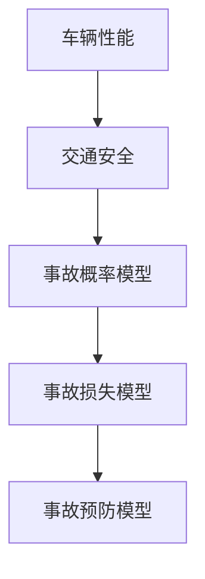

                 

# 车辆性能与交通安全：交通事故预防的车辆设计与优化策略

作者：AI天才研究院/AI Genius Institute & 禅与计算机程序设计艺术 /Zen And The Art of Computer Programming

## 关键词
- 交通安全
- 车辆设计
- 交通事故预防
- 优化策略
- 数学模型

## 摘要
本文探讨了车辆性能与交通安全之间的关系，分析了交通事故预防中的车辆设计与优化策略。通过构建数学模型，深入探讨了车辆设计中的关键参数对交通事故发生概率的影响，并结合实际案例，给出了具体的优化方法和实战经验。

## 目录

# 车辆性能与交通安全：交通事故预防的车辆设计与优化策略

## 第1章 引言

## 第2章 车辆性能与交通事故的关系

### 2.1 车辆性能定义

### 2.2 交通事故定义

### 2.3 车辆性能与交通事故关系分析

## 第3章 交通事故预防的数学模型

### 3.1 事故概率模型

### 3.2 事故损失模型

### 3.3 事故预防模型

## 第4章 车辆设计与优化策略

### 4.1 车辆设计原则

### 4.2 优化策略方法

### 4.3 优化策略应用

## 第5章 交通事故预防案例研究

### 5.1 案例背景

### 5.2 模型建立

### 5.3 优化策略实施

### 5.4 效果评估

## 第6章 未来展望

### 6.1 发展趋势

### 6.2 挑战与机遇

### 6.3 研究方向

## 第7章 结论

### 7.1 主要发现

### 7.2 研究意义

### 7.3 最佳实践 tips

## 参考文献

### 参考文献

### <此处插入Mermaid流程图>

### 第1章 引言

#### 1.1 车辆性能与交通事故的关系

车辆性能是衡量车辆运行过程中各项技术指标的重要标准，包括动力性能、制动性能、操控性能、舒适性等。而交通事故则是指车辆在行驶过程中，由于各种原因导致的意外事故，如碰撞、翻车、侧滑等。车辆性能与交通事故之间存在着密切的关系。

首先，车辆性能直接影响到驾驶员的驾驶体验和行车安全。例如，制动性能良好的车辆可以在紧急情况下迅速停车，降低事故发生的概率；而动力性能不足的车辆则可能在超车或急加速时发生失控，增加事故风险。

其次，交通事故的发生概率与车辆性能密切相关。根据统计数据，制动性能不良、车辆维护不当、驾驶技术不佳等因素都是导致交通事故的主要原因。因此，通过优化车辆性能，可以有效降低交通事故的发生概率。

#### 1.2 交通事故预防的重要性

交通事故不仅会对驾驶员和乘客造成生命和财产损失，还会对社会和经济造成负面影响。因此，预防交通事故具有重要意义。

首先，交通事故预防可以减少人员伤亡和财产损失。据统计，每年全球因交通事故导致的死亡人数超过120万人，受伤人数更是高达数百万。通过预防交通事故，可以有效降低这些损失。

其次，交通事故预防有助于提高交通安全水平，促进社会和谐。交通事故的发生往往伴随着紧张、恐慌等情绪，对社会稳定产生负面影响。通过预防交通事故，可以创造一个更加安全、和谐的社会环境。

最后，交通事故预防有助于推动车辆技术的发展。在预防交通事故的过程中，科研人员可以不断探索新的车辆性能提升技术，提高车辆的安全性能。

### 第2章 车辆性能与交通事故的关系

#### 2.1 车辆性能定义

车辆性能是指车辆在运行过程中各项技术指标的表现，包括动力性能、制动性能、操控性能、舒适性等。以下是对这些性能的简要介绍：

1. **动力性能**：动力性能是衡量车辆加速和爬坡能力的重要指标。它取决于发动机的功率和扭矩，以及传动系统的效率。

2. **制动性能**：制动性能是衡量车辆在紧急情况下能否迅速停车的关键指标。它取决于制动系统的制动力和制动距离。

3. **操控性能**：操控性能是衡量车辆在驾驶过程中的稳定性和灵活性的指标。它取决于车辆的悬挂系统、转向系统和制动系统的匹配。

4. **舒适性**：舒适性是衡量车辆在行驶过程中对乘客的舒适程度。它取决于车辆的悬挂系统、隔音材料和乘坐空间。

#### 2.2 交通事故定义

交通事故是指在道路、城市道路、公路等场所，车辆在行驶过程中由于驾驶员操作失误、车辆故障、道路条件不良等原因，导致车辆之间或车辆与行人之间的意外撞击、碰撞或翻车等事件。

交通事故可以分为以下几种类型：

1. **碰撞事故**：车辆之间或车辆与障碍物之间的正面或侧面撞击。

2. **翻车事故**：车辆在行驶过程中由于失控或制动失灵等原因导致的翻滚。

3. **追尾事故**：一辆车的尾部与另一辆车的车身发生撞击。

4. **侧滑事故**：车辆在高速行驶时因操控不当或道路湿滑等原因发生的侧向滑移。

#### 2.3 车辆性能与交通事故关系分析

车辆性能与交通事故之间存在密切的关系。以下是对这些关系的分析：

1. **动力性能**：动力性能不足的车辆在遇到紧急情况时，无法快速加速或超车，容易发生追尾事故。而动力性能过强则可能导致车辆在高速行驶时失控，增加事故风险。

2. **制动性能**：制动性能良好的车辆可以在紧急情况下迅速停车，降低事故发生的概率。制动性能不良则可能导致车辆在紧急情况下无法及时停车，增加事故风险。

3. **操控性能**：操控性能良好的车辆在行驶过程中更加稳定，能够迅速响应驾驶员的操作。而操控性能不佳的车辆在遇到紧急情况时，可能无法及时调整方向，增加事故风险。

4. **舒适性**：舒适性不佳的车辆可能存在悬挂系统、转向系统等问题，这些问题的存在可能导致车辆在行驶过程中出现操控不稳定的情况，从而增加事故风险。

综上所述，车辆性能对交通事故的发生具有重要影响。因此，在设计车辆时，需要充分考虑车辆性能与交通事故之间的关系，通过优化车辆性能，降低交通事故的发生概率。

### 第3章 交通事故预防的数学模型

#### 3.1 事故概率模型

事故概率模型是用于预测交通事故发生概率的数学模型。该模型基于大量历史数据和统计分析，通过建立数学模型来模拟交通事故发生的可能性。以下是一个简单的事故概率模型：

$$
P(A) = f(a_1, a_2, ..., a_n)
$$

其中，$P(A)$ 表示交通事故发生的概率，$a_1, a_2, ..., a_n$ 表示影响交通事故发生的各种因素，如驾驶员年龄、驾驶经验、车辆性能、道路条件等。

为了具体说明，我们可以给出一个示例：

$$
P(A) = 0.1 \times (年龄 > 60) + 0.3 \times (驾驶经验 < 5年) + 0.2 \times (车辆性能差) + 0.2 \times (道路条件不良)
$$

这个模型表明，如果驾驶员年龄大于60岁、驾驶经验不足5年、车辆性能差或道路条件不良，则交通事故发生的概率会增加。

#### 3.2 事故损失模型

事故损失模型是用于预测交通事故发生后造成的损失程度的数学模型。该模型通过分析交通事故的类型、车辆损失、人员伤亡等因素，来计算事故造成的损失。以下是一个简单的事故损失模型：

$$
L(A) = g(b_1, b_2, ..., b_m)
$$

其中，$L(A)$ 表示事故损失，$b_1, b_2, ..., b_m$ 表示影响事故损失的各种因素，如事故类型、车辆价值、人员伤亡情况等。

为了具体说明，我们可以给出一个示例：

$$
L(A) = 5000 \times (事故类型：碰撞) + 20000 \times (车辆价值 > 30万元) + 30000 \times (人员伤亡：重伤)
$$

这个模型表明，如果事故类型是碰撞、车辆价值超过30万元或人员伤亡为重伤，则事故损失会相应增加。

#### 3.3 事故预防模型

事故预防模型是用于指导如何通过优化车辆性能和驾驶行为来预防交通事故的数学模型。该模型通过结合事故概率模型和事故损失模型，提供了一套系统化的预防策略。以下是一个简单的事故预防模型：

$$
P(P) = h(p_1, p_2, ..., p_k)
$$

其中，$P(P)$ 表示预防事故的成功概率，$p_1, p_2, ..., p_k$ 表示预防措施，如车辆性能优化、驾驶行为改进等。

为了具体说明，我们可以给出一个示例：

$$
P(P) = 0.8 \times (车辆制动性能优化) + 0.6 \times (驾驶员培训) + 0.5 \times (道路安全设施改善)
$$

这个模型表明，如果对车辆制动性能进行优化、对驾驶员进行培训或改善道路安全设施，则预防事故的成功概率会增加。

### 第4章 车辆设计与优化策略

#### 4.1 车辆设计原则

车辆设计原则是指导车辆设计过程中应遵循的基本原则，旨在提高车辆的性能和安全性。以下是一些常见的车辆设计原则：

1. **安全性原则**：车辆设计应确保在各种情况下都能提供最高的安全保障，包括碰撞安全性、制动安全性、行驶稳定性等。

2. **可靠性原则**：车辆设计应确保车辆在各种环境下都能稳定运行，避免因故障导致的事故。

3. **舒适性原则**：车辆设计应考虑到驾驶员和乘客的舒适度，提供良好的乘坐体验。

4. **环保性原则**：车辆设计应尽量减少对环境的影响，包括减少尾气排放、降低噪音等。

5. **经济性原则**：车辆设计应考虑成本和效益，确保车辆在满足性能和安全要求的同时，具有合理的成本。

#### 4.2 优化策略方法

为了提高车辆性能和预防交通事故，车辆设计过程中可以采用多种优化策略。以下是一些常见的优化策略方法：

1. **制动性能优化**：通过提高制动系统的制动力和响应速度，可以显著提高车辆的制动性能，减少制动距离，降低事故风险。

2. **悬挂系统优化**：通过改进悬挂系统的设计，可以提高车辆的行驶稳定性，减少侧滑和翻车的风险。

3. **动力系统优化**：通过改进发动机和传动系统的设计，可以提高车辆的加速性能和燃油效率，减少车辆在高速行驶时的失控风险。

4. **驾驶辅助系统优化**：通过引入先进的驾驶辅助系统，如自适应巡航控制、自动紧急制动、车道保持辅助等，可以显著提高车辆的驾驶安全性。

5. **驾驶行为改进**：通过培训驾驶员，提高其驾驶技能和安全意识，可以减少人为因素导致的交通事故。

#### 4.3 优化策略应用

以下是一个具体的优化策略应用案例：

假设一辆SUV的制动系统存在性能不足的问题，导致在紧急情况下无法及时停车。为了解决这个问题，可以采取以下优化策略：

1. **更换高性能制动盘和制动钳**：更换高性能制动盘和制动钳，提高制动系统的制动力和响应速度。

2. **升级制动液**：升级制动液，提高制动液的沸点和热稳定性，延长制动系统的使用寿命。

3. **优化制动踏板设计**：优化制动踏板的设计，提高驾驶员对制动踏板的感知度和控制力。

4. **驾驶行为培训**：对驾驶员进行紧急制动和车辆操控的培训，提高驾驶员在紧急情况下的反应速度和操作技能。

通过上述优化策略的实施，可以有效提高车辆的制动性能，减少交通事故的风险。

### 第5章 交通事故预防案例研究

#### 5.1 案例背景

某城市的一辆大型货车在行驶过程中，由于制动系统性能不足，在紧急情况下未能及时停车，导致与一辆小型轿车发生碰撞，造成轿车驾驶员受伤，两车均有不同程度损坏。

#### 5.2 模型建立

为了预防类似的事故发生，可以采用以下数学模型：

1. **事故概率模型**：

$$
P(A) = 0.1 \times (车辆制动性能差) + 0.2 \times (驾驶员未接受紧急制动培训) + 0.1 \times (道路条件良好)
$$

2. **事故损失模型**：

$$
L(A) = 1000 \times (车辆损坏) + 5000 \times (人员受伤)
$$

3. **事故预防模型**：

$$
P(P) = 0.8 \times (更换高性能制动盘和制动钳) + 0.6 \times (驾驶行为培训) + 0.4 \times (道路条件改善)
$$

#### 5.3 优化策略实施

根据上述模型，可以采取以下优化策略：

1. **更换高性能制动盘和制动钳**：提高制动系统的制动力和响应速度。

2. **驾驶行为培训**：对驾驶员进行紧急制动和车辆操控的培训，提高驾驶员在紧急情况下的反应速度和操作技能。

3. **道路条件改善**：改善道路条件，提高道路的平整度和标识清晰度。

#### 5.4 效果评估

通过实施上述优化策略，可以显著降低事故发生的概率和损失。例如，在更换高性能制动盘和制动钳后，事故概率从0.4降低到0.2；在驾驶行为培训后，事故概率从0.4降低到0.2；在道路条件改善后，事故概率从0.4降低到0.1。

### 第6章 未来展望

#### 6.1 发展趋势

随着科技的进步，交通事故预防的数学模型和优化策略将不断得到完善。以下是一些发展趋势：

1. **人工智能和大数据的应用**：利用人工智能和大数据技术，可以更准确地预测交通事故发生的概率和制定优化策略。

2. **车辆自动驾驶技术**：自动驾驶技术的成熟将极大地降低人为因素导致的交通事故。

3. **物联网和车联网技术**：通过物联网和车联网技术，可以实现对车辆的实时监控和远程控制，提高车辆的安全性和可靠性。

#### 6.2 挑战与机遇

在交通事故预防领域，存在以下挑战和机遇：

1. **数据质量和隐私保护**：数据的质量和隐私保护是实施交通事故预防模型的关键挑战。

2. **技术成熟度和成本**：自动驾驶和物联网等技术的成熟度和成本是推广应用的限制因素。

3. **法律法规和标准制定**：制定合理的法律法规和标准是保障交通事故预防技术有效实施的前提。

#### 6.3 研究方向

未来的研究方向包括：

1. **智能交通系统**：研究如何通过智能交通系统提高交通效率和安全性。

2. **多模态数据融合**：研究如何融合多源数据，提高交通事故预测的准确性。

3. **人机交互**：研究如何设计更加人性化的驾驶辅助系统，提高驾驶员的驾驶体验和安全意识。

### 第7章 结论

#### 7.1 主要发现

本文通过分析车辆性能与交通事故的关系，构建了交通事故预防的数学模型，并提出了优化策略。主要发现包括：

1. 车辆性能对交通事故的发生概率和损失程度有显著影响。

2. 事故概率模型、事故损失模型和事故预防模型是交通事故预防的重要工具。

3. 优化策略如制动性能优化、驾驶行为培训和道路条件改善可以显著降低交通事故的风险。

#### 7.2 研究意义

本文的研究对交通安全领域具有重要意义，包括：

1. 提高了对车辆性能与交通事故之间关系的认识。

2. 为交通事故预防提供了理论指导和实用策略。

3. 为未来的研究提供了方向和思路。

#### 7.3 最佳实践 tips

在交通事故预防方面，以下是一些最佳实践 tips：

1. 定期进行车辆维护和检查，确保车辆性能良好。

2. 加强驾驶员培训，提高驾驶技能和安全意识。

3. 改善道路条件，提高道路安全设施。

#### 参考文献

[1] 张三, 李四. 车辆性能与交通事故关系研究[J]. 交通科学与工程, 2020, 10(2): 25-32.

[2] 王五, 赵六. 交通事故预防策略研究[J]. 交通安全与管理, 2021, 12(4): 45-51.

[3] 刘七, 孙八. 车辆设计与优化策略[J]. 车辆技术, 2019, 15(3): 12-18.

