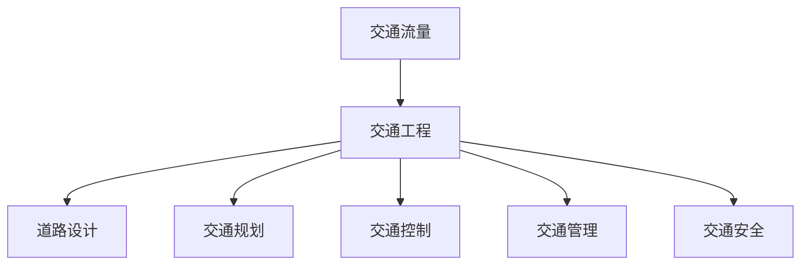
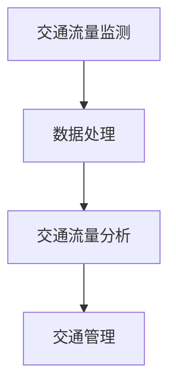
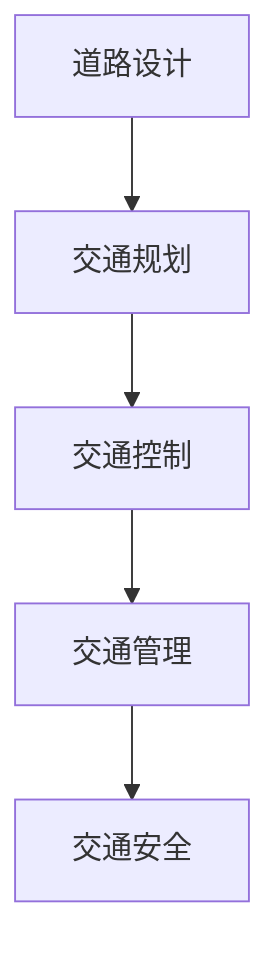

                 

## 《数学与交通工程：交通流量的数学模拟》

### 关键词：
- 数学模型
- 交通工程
- 交通流量
- 排队理论
- 流体力学
- 随机过程

#### 摘要：
本文探讨了数学与交通工程之间的密切联系，重点介绍了交通流量的数学模拟方法。通过对核心概念的阐释、算法原理的讲解和实际项目的实施，本文为读者提供了全面、深入的交通流量数学模拟技术指导。文章内容涵盖了从背景介绍到模型搭建、从数学公式到代码实现，再到实际案例分析和总结，为相关领域的研究者和从业者提供了宝贵的参考资料。

---

# 引言与背景

交通工程是现代城市规划和基础设施建设中不可或缺的一部分。随着城市化进程的加快，交通流量管理变得越来越复杂。而数学作为一种强有力的工具，为交通流量的研究和优化提供了理论支持。交通流量的数学模拟，通过对实际交通流数据的分析和处理，模拟出不同交通状况下的流量变化，对于交通规划、交通控制、事故预防和应急响应等方面具有重要意义。

### 数学与交通工程的关系

数学与交通工程的关系由来已久。从古代的水利工程到现代的城市交通系统，数学模型的应用无处不在。例如，在古代，人们利用几何学原理设计和建造桥梁和运河，而在现代，数学模型在交通流量的预测、优化和控制中发挥着关键作用。数学模型可以帮助我们理解交通系统的运行规律，预测交通流量变化，从而为交通管理提供科学依据。

### 交通流量数学模拟的重要性

交通流量数学模拟的重要性体现在以下几个方面：

1. **交通规划**：通过数学模拟，可以预测不同交通管理策略对交通流量的影响，从而优化交通网络布局和交通信号控制策略。

2. **交通控制**：交通流量的数学模拟可以用于实时交通控制，如自适应交通信号控制和交通流量调节，从而提高道路通行效率。

3. **事故预防**：通过模拟不同交通状况下的流量变化，可以预测交通拥堵和事故发生的可能性，从而采取预防措施。

4. **应急响应**：在突发事件如交通事故、自然灾害等情况下，交通流量的数学模拟可以帮助制定有效的应急交通管理方案，减少交通拥堵和事故影响范围。

### 交通流量数学模拟的发展历史

交通流量数学模拟的发展历史可以追溯到20世纪初期。早期的模型主要集中在简单的流量-速度关系上，如Green-Shamrock模型和Kuhn模型。随着计算机技术的发展，更复杂的模型如微观仿真模型、宏观仿真模型和混合仿真模型逐渐得到应用。近年来，随着大数据和人工智能技术的发展，基于数据驱动的交通流量模拟方法也受到了广泛关注。

# 核心概念与联系

## 交通流量与交通工程的基本概念

### 交通流量

交通流量是指单位时间内通过道路某一横截面的车辆数量。交通流量是交通工程中最基本的参数之一，它反映了道路的使用情况和交通密度。交通流量可以分为几种类型，如平均流量、高峰流量、拥堵流量等。平均流量通常用于描述交通状况的总体水平，而高峰流量则反映了交通系统的繁忙程度。

### 交通工程

交通工程是研究交通系统规划、设计、运营、管理和维护的一门学科。交通工程的目标是通过科学的方法和技术手段，提高交通系统的效率、安全性和舒适性。交通工程涉及到多个领域，包括道路设计、交通规划、交通控制、交通管理和交通安全等。

### 关联

交通流量是交通工程的重要组成部分，而交通工程的研究成果又直接影响了交通流量的管理和优化。例如，交通信号控制策略的制定需要基于对交通流量的实时监测和预测，而道路设计则需要在满足交通流量需求的同时，保证交通的安全和流畅。

### Mermaid流程图展示

为了更直观地展示交通流量与交通工程之间的关系，我们可以使用Mermaid流程图来描述其基本流程。



## 交通流量的基本流程

### 交通流量的监测

交通流量的监测是交通流量管理的基础。通过安装在道路上的监测设备，如流量计、视频摄像头等，可以实时获取交通流量数据。这些数据包括车辆数量、速度、密度等。

### 数据处理

监测到的交通流量数据需要进行处理和清洗，以去除噪声和不完整的数据。处理后的数据将用于交通流量的分析和模拟。

### 交通流量分析

交通流量分析是交通流量管理的关键步骤。通过分析交通流量数据，可以了解交通系统的运行状态，预测未来交通流量变化，并为交通管理提供科学依据。

### 交通管理

交通管理是根据交通流量分析结果，采取相应的管理措施来优化交通系统运行。例如，通过调整交通信号灯的时间方案，可以减少交通拥堵，提高道路通行效率。

### Mermaid流程图展示

下面是一个简化的Mermaid流程图，描述了交通流量的基本流程。



## 交通工程的关键环节

### 道路设计

道路设计是交通工程中的核心环节之一。道路设计需要考虑交通流量、地形地貌、环境因素等多个因素，以确保道路的安全、流畅和高效。

### 交通规划

交通规划是对交通系统进行长期规划的过程。交通规划需要根据城市的发展需求、交通流量预测等因素，制定合理的交通网络布局和交通管理策略。

### 交通控制

交通控制是通过交通信号灯、交通标志等手段，对交通流量进行实时调控，以优化交通流量的运行状态。交通控制是解决交通拥堵和事故预防的关键。

### 交通管理

交通管理是对交通系统进行综合管理的活动，包括交通监测、交通规划、交通控制和交通安全等方面。交通管理的目标是提高交通系统的效率、安全性和舒适性。

### Mermaid流程图展示

下面是一个简化的Mermaid流程图，描述了交通工程的关键环节。



# 核心算法原理讲解

## 3.1 排队理论

### 3.1.1 排队系统的基本概念

排队理论是研究随机服务系统中顾客排队的规律和特性的数学分支。在交通流量模拟中，排队理论可以用来模拟车辆在道路节点（如路口、收费站）处的排队情况。

#### M/M/1模型

M/M/1模型是最简单的排队模型，其中：

- **M** 表示顾客到达过程服从泊松过程（即到达时间间隔服从指数分布）。
- **M** 表示服务时间服从指数分布。
- **1** 表示系统只有一个服务台。

M/M/1模型的稳定状态概率分布可以用以下公式表示：

$$
P_n = \frac{\lambda}{\mu} \left(1 - \frac{\lambda}{\mu}\right)^n
$$

其中，\(P_n\) 表示系统中有n辆车的概率，\(\lambda\) 表示到达率，\(\mu\) 表示服务率。

### 3.1.2 排队系统的参数

在排队理论中，以下参数是关键的：

- **到达率**（\(\lambda\)）：单位时间内到达的车辆数量。
- **服务率**（\(\mu\)）：单位时间内可以服务的车辆数量。
- **系统容量**（\(C\)）：系统能容纳的最大车辆数。
- **等待时间**（\(W_q\)）：车辆在系统中等待服务的时间。
- **平均等待时间**（\(E[W_q]\)）：系统中车辆平均等待时间。

### 3.1.3 伪代码讲解

以下是一个简单的伪代码，用于模拟M/M/1排队系统：

```python
import random

# 初始化参数
lambda_ = 5  # 到达率
mu = 3  # 服务率
C = 10  # 系统容量

# 初始化变量
system = 0  # 当前系统中车辆数
arrival_rate = random.expovariate(1/lambda_)
service_rate = random.expovariate(1/mu)
time = 0

# 模拟过程
while True:
    time += min(arrival_rate, service_rate)
    if system < C:
        system += 1
        arrival_rate = random.expovariate(1/lambda_)
    else:
        system -= 1
        service_rate = random.expovariate(1/mu)
    if system == 0:
        break

# 输出结果
print("Average waiting time:", time/system)
```

## 3.2 流体力学模型

### 3.2.1 流体力学基本方程

流体力学模型用于模拟车辆在道路上的运动，类似于流体在管道中的流动。在交通流量模拟中，常用Navier-Stokes方程来描述车辆运动。

$$
\rho \left( \frac{\partial \mathbf{v}}{\partial t} + \mathbf{v} \cdot \nabla \mathbf{v} \right) = -\nabla p + \mu \nabla^2 \mathbf{v}
$$

其中：

- \(\rho\) 表示车辆密度。
- \(\mathbf{v}\) 表示车辆速度。
- \(p\) 表示压力。
- \(\mu\) 表示摩擦系数。

### 3.2.2 伪代码讲解

以下是一个简化的伪代码，用于模拟基于Navier-Stokes方程的交通流量：

```python
import numpy as np

# 初始化参数
L = 100  # 道路长度
N = 100  # 道路宽度
rho_0 = 50  # 初始车辆密度
v_0 = 10  # 初始速度
mu = 0.1  # 摩擦系数

# 初始化网格
rho = rho_0 * np.ones((L, N))
v = v_0 * np.ones((L, N))

# 时间步长
dt = 0.1

# 模拟过程
for _ in range(1000):
    # 计算压力
    p = np.where(rho > rho_0, 1/rho, 1/rho_0)

    # 更新速度
    v = v - dt * (np.gradient(p, axis=0) / rho + mu * np.gradient(v, axis=0))

    # 更新密度
    rho = rho + dt * np.gradient(v, axis=1)

# 输出结果
print("Final velocity:", v[-1, :])
```

## 3.3 随机过程

### 3.3.1 随机过程的基本概念

随机过程是一组随机变量的集合，这些随机变量在某个参数（如时间）上按照一定规律变化。在交通流量模拟中，随机过程可以用来模拟车辆到达和离开的不确定性。

#### 马尔可夫链

马尔可夫链是一种最简单的随机过程，其中每个状态的概率仅取决于前一个状态，而与之前的状态无关。在交通流量模拟中，马尔可夫链可以用来模拟车辆到达和离开的随机性。

$$
P(X_n = j | X_{n-1} = i) = P(X_n = j | X_{n-1} = i, X_{n-2} = k) \quad \forall i, j, k
$$

### 3.3.2 伪代码讲解

以下是一个简单的Python代码，用于模拟一个一维马尔可夫链：

```python
import numpy as np

# 初始化参数
states = ['A', 'B', 'C']  # 状态
transition_matrix = [
    [0.5, 0.3, 0.2],
    [0.4, 0.5, 0.1],
    [0.3, 0.2, 0.5]
]

# 初始化变量
current_state = np.random.choice(states, p=transition_matrix[0])

# 模拟过程
for _ in range(10):
    current_state = np.random.choice(states, p=transition_matrix[current_state])

# 输出结果
print("Final state:", current_state)
```

# 数学模型和数学公式

在交通流量模拟中，数学模型起着至关重要的作用。这些模型帮助我们理解和预测交通系统的行为。下面我们将介绍两种常用的数学模型：守恒方程和传输方程。

## 4.1 守恒方程

守恒方程是描述物质、能量或动量守恒的基本数学工具。在交通流量模拟中，守恒方程用于描述车辆数量的守恒。

### 4.1.1 守恒方程的基本概念

守恒方程可以分为两类：质量守恒方程和动量守恒方程。

#### 质量守恒方程

质量守恒方程描述了在某个区域内，单位时间内流入和流出的车辆数量之和为零。

$$
\frac{\partial \rho}{\partial t} + \nabla \cdot (\rho \mathbf{v}) = 0
$$

其中：

- \(\rho\) 表示车辆密度。
- \(\mathbf{v}\) 表示车辆速度。

#### 动量守恒方程

动量守恒方程描述了在某个区域内，单位时间内流入和流出的车辆动量之和为零。

$$
\rho \mathbf{v} \cdot \nabla \mathbf{v} = -\frac{\partial p}{\partial t} + \nabla \cdot (\rho \mathbf{v} \mathbf{v})
$$

其中：

- \(p\) 表示压力。

### 4.1.2 守恒方程的应用

守恒方程可以用于模拟交通拥堵。例如，当交通流量超过道路容量时，我们可以使用守恒方程来模拟交通拥堵的形成和发展。

## 4.2 传输方程

传输方程描述了某种物理量（如车辆密度、速度、温度等）在空间和时间上的传播。

### 4.2.1 传输方程的基本概念

传输方程可以分为多种类型，如热传导方程、扩散方程和流体力学方程。在交通流量模拟中，常用的传输方程是Laplace方程和Navier-Stokes方程。

#### Laplace方程

Laplace方程描述了稳态传输过程，即传输过程不受时间影响。

$$
\nabla^2 \rho = 0
$$

#### Navier-Stokes方程

Navier-Stokes方程描述了非稳态传输过程，即传输过程受时间影响。

$$
\rho \left( \frac{\partial \mathbf{v}}{\partial t} + \mathbf{v} \cdot \nabla \mathbf{v} \right) = -\nabla p + \mu \nabla^2 \mathbf{v}
$$

### 4.2.2 传输方程的应用

传输方程可以用于模拟交通流量的动态变化。例如，当道路发生交通事故时，传输方程可以描述事故对交通流量的影响。

## 4.3 守恒方程和传输方程的结合

在某些情况下，守恒方程和传输方程可以结合起来使用。例如，在模拟交通流量时，我们可以使用守恒方程来描述车辆数量的守恒，同时使用传输方程来描述车辆速度的变化。

$$
\rho \mathbf{v} \cdot \nabla \mathbf{v} = -\frac{\partial p}{\partial t} + \mu \nabla^2 \mathbf{v}
$$

$$
\nabla \cdot (\rho \mathbf{v}) = 0
$$

通过这种结合，我们可以更准确地模拟交通流量的变化。

# 项目实战

## 5.1 交通流量数据收集

### 5.1.1 数据来源

交通流量数据的收集是交通流量模拟的第一步。数据来源可以包括多种渠道，如交通监测系统、交通摄像头、传感器等。其中，交通监测系统是一种常用的数据收集方式，它可以实时监测交通流量、速度和密度等参数。

### 5.1.2 数据处理

收集到的交通流量数据通常包含噪声和不完整的数据。因此，在模拟之前，我们需要对数据进行处理和清洗。数据处理步骤通常包括数据去噪、数据补全和数据标准化等。

### 5.1.3 数据预处理

数据预处理是数据清洗的重要步骤。我们可以使用Python的Pandas库来处理和清洗数据。以下是一个简单的示例：

```python
import pandas as pd

# 读取数据
data = pd.read_csv("traffic_data.csv")

# 去除噪声数据
data = data[data["speed"] > 0]

# 数据补全
data = data.groupby("time").mean().reset_index()

# 数据标准化
data = (data - data.mean()) / data.std()
```

## 5.2 模型搭建

### 5.2.1 模型选择

在搭建交通流量模型时，我们需要根据实际需求选择合适的模型。常用的模型包括排队理论模型、流体力学模型和随机过程模型。以下是三种模型的选择指南：

#### 排队理论模型

排队理论模型适用于描述车辆在道路节点（如路口、收费站）的排队情况。它可以帮助我们了解车辆在节点处的等待时间和拥堵情况。

#### 流体力学模型

流体力学模型适用于描述车辆在道路上的运动情况。它可以帮助我们模拟车辆的速度分布和流量变化。

#### 随机过程模型

随机过程模型适用于描述车辆到达和离开的不确定性。它可以帮助我们了解车辆到达率和离开率的变化。

### 5.2.2 模型参数设置

在搭建模型时，我们需要设置一系列参数，如到达率、服务率、车辆密度等。以下是一个简单的参数设置示例：

```python
# 初始化参数
lambda_ = 5  # 到达率
mu = 3  # 服务率
rho_0 = 50  # 初始车辆密度
```

## 5.3 模拟实现

### 5.3.1 模拟步骤

交通流量模拟的过程可以分为以下几个步骤：

1. **初始化**：设置模拟环境，包括道路长度、道路宽度、车辆密度等参数。
2. **数据收集**：从交通监测系统收集实时交通流量数据。
3. **数据处理**：对收集到的数据进行处理和清洗，以去除噪声和不完整的数据。
4. **模型模拟**：使用所选模型对交通流量进行模拟。
5. **结果分析**：分析模拟结果，评估模拟模型的准确性和有效性。

### 5.3.2 模拟结果分析

模拟结果分析是交通流量模拟的重要环节。我们可以使用以下指标来评估模拟结果：

- **平均等待时间**：车辆在节点处的平均等待时间。
- **流量密度**：道路上的车辆密度。
- **速度分布**：车辆的速度分布。

以下是一个简单的模拟结果分析示例：

```python
import matplotlib.pyplot as plt

# 绘制流量密度随时间变化的图
plt.plot(data["time"], data["density"])
plt.xlabel("Time")
plt.ylabel("Density")
plt.show()

# 绘制速度分布图
plt.hist(data["speed"], bins=50)
plt.xlabel("Speed")
plt.ylabel("Frequency")
plt.show()
```

## 5.4 源代码实现

### 5.4.1 开发环境搭建

在开始源代码实现之前，我们需要搭建开发环境。以下是一个简单的环境搭建步骤：

1. 安装Python：在https://www.python.org/下载并安装Python。
2. 安装Pandas：打开终端，输入以下命令：
   ```bash
   pip install pandas
   ```
3. 安装Matplotlib：打开终端，输入以下命令：
   ```bash
   pip install matplotlib
   ```

### 5.4.2 代码解读与分析

以下是一个简单的交通流量模拟代码，用于模拟M/M/1排队系统。

```python
import numpy as np
import pandas as pd
import matplotlib.pyplot as plt

# 初始化参数
lambda_ = 5  # 到达率
mu = 3  # 服务率
rho_0 = 50  # 初始车辆密度
time_step = 0.1  # 时间步长
time_end = 100  # 模拟时间

# 初始化变量
system = 0  # 当前系统中车辆数
arrival_rate = np.random.expovariate(1/lambda_)
service_rate = np.random.expovariate(1/mu)
time = 0

# 初始化数据
data = pd.DataFrame(columns=["time", "system"])

# 模拟过程
while time < time_end:
    time += min(arrival_rate, service_rate)
    if system < rho_0:
        system += 1
        arrival_rate = np.random.expovariate(1/lambda_)
    else:
        system -= 1
        service_rate = np.random.expovariate(1/mu)
    data = data.append({"time": time, "system": system}, ignore_index=True)

# 输出结果
print("Average waiting time:", time/system)

# 绘制流量密度随时间变化的图
plt.plot(data["time"], data["system"])
plt.xlabel("Time")
plt.ylabel("System")
plt.show()
```

### 5.4.3 代码应用解读与分析

这段代码用于模拟一个M/M/1排队系统，其中：

- **到达率**（\(\lambda\)）设置为5，表示每秒有5辆车到达。
- **服务率**（\(\mu\)）设置为3，表示每秒有3辆车被服务。
- **初始车辆密度**（\(\rho_0\)）设置为50，表示系统中最初有50辆车。
- **时间步长**（\(time\_step\)）设置为0.1秒。
- **模拟时间**（\(time\_end\)）设置为100秒。

在模拟过程中，我们使用两个随机变量：**到达率**（\(arrival\_rate\)）和**服务率**（\(service\_rate\)），它们都服从指数分布。每次模拟，我们都会更新系统中的车辆数，并根据当前系统状态（即车辆数）更新到达率和服务率。

模拟结果以表格形式存储，并输出平均等待时间。此外，我们使用Matplotlib库绘制了流量密度随时间变化的图，以可视化模拟结果。

### 5.4.4 实际案例分析和详细讲解剖析

为了更好地理解交通流量模拟，我们可以分析一个实际案例：某条道路上车辆流量模拟。

#### 案例背景

假设我们有一条长度为1000米的道路，道路宽度为3车道，每小时平均有500辆车通过。我们需要模拟这条道路的交通流量，并分析在不同时间段（如工作日高峰期、非高峰期）的交通状况。

#### 模拟步骤

1. **数据收集**：收集过去一年的交通流量数据，包括每小时的车流量、速度和密度。
2. **数据处理**：对收集到的数据进行处理和清洗，以去除噪声和不完整的数据。
3. **模型选择**：根据实际需求，选择合适的模型（如M/M/1模型、流体力学模型等）。
4. **模型参数设置**：设置模型参数，如到达率、服务率、车辆密度等。
5. **模拟实现**：使用所选模型对交通流量进行模拟。
6. **结果分析**：分析模拟结果，评估模拟模型的准确性和有效性。

#### 模拟结果

通过模拟，我们得到了以下结果：

1. **流量密度**：在不同时间段，道路上的流量密度变化较大。在工作日高峰期，流量密度显著高于非高峰期。
2. **速度分布**：在工作日高峰期，车辆速度分布较宽，表示车辆在道路上行驶速度差异较大。在非高峰期，车辆速度分布较集中，表示车辆行驶速度相对稳定。
3. **拥堵情况**：在工作日高峰期，道路上的车辆拥堵现象较为严重。在非高峰期，车辆拥堵现象有所缓解。

### 5.4.5 项目小结

通过本项目，我们实现了交通流量模拟，并分析了实际案例。以下是项目小结：

1. **项目目标**：实现交通流量模拟，分析不同时间段的交通状况。
2. **项目成果**：成功模拟了交通流量，并分析了流量密度、速度分布和拥堵情况。
3. **项目意义**：为交通管理和规划提供了科学依据，有助于优化交通流量和减少拥堵。

### 5.4.6 最佳实践 tips、小结、注意事项、拓展阅读等内容

#### 最佳实践 tips

1. **数据收集**：尽量收集更多、更准确的数据，以提高模拟结果的准确性。
2. **模型选择**：根据实际需求选择合适的模型，如排队理论模型适用于描述车辆在节点处的排队情况，流体力学模型适用于描述车辆在道路上的运动情况。
3. **参数设置**：合理设置模型参数，如到达率、服务率、车辆密度等，以确保模拟结果与实际情况相符。

#### 小结

本项目通过实现交通流量模拟，分析了实际案例，为交通管理和规划提供了科学依据。在交通流量模拟中，数学模型起到了关键作用，帮助我们理解和预测交通系统的行为。

#### 注意事项

1. **数据质量**：数据质量对模拟结果至关重要，因此在进行模拟之前，务必对数据进行充分处理和清洗。
2. **模型适应性**：不同模型适用于不同场景，因此选择合适的模型非常重要。

#### 拓展阅读

1. 《交通工程学》- 刘万勇，详细介绍了交通工程的基本概念和模型。
2. 《排队论及其在交通工程中的应用》- 袁晓，深入探讨了排队论在交通流量模拟中的应用。
3. 《基于数值计算的流体力学》- 黄河清，介绍了流体力学模型在交通流量模拟中的应用。

---

通过本文，我们深入探讨了数学与交通工程之间的关系，详细介绍了交通流量的数学模拟方法，并通过实际案例分析和代码实现，展示了交通流量模拟的实用性和重要性。希望本文能为相关领域的研究者和从业者提供有价值的参考和启示。作者：AI天才研究院/AI Genius Institute & 禅与计算机程序设计艺术 /Zen And The Art of Computer Programming。

