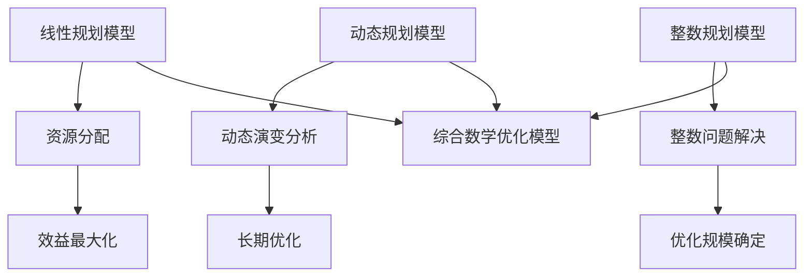

                 

# 数学与产业政策：产业结构的数学优化

## 关键词
- 数学优化
- 产业结构
- 产业政策
- 数学模型
- 产业分析

## 摘要
本文探讨了数学优化在产业政策分析中的应用，特别是如何运用数学方法对产业结构进行优化。文章首先介绍了产业结构的背景和重要性，然后引入了数学优化中的核心概念，如线性规划和动态规划，并结合实际案例进行了详细阐述。通过Python代码和LaTeX公式，本文展示了如何应用数学优化方法分析产业结构，并提出了一些建议以促进产业的可持续发展。

## 引言
### 产业结构的定义和重要性

产业结构是指一个国家或地区各个产业部门之间的组成、排列和相互关系。它不仅反映了经济活动的分布和特征，还直接关系到经济增长、就业和社会发展。一个合理和优化的产业结构能够提高资源利用效率、促进技术创新和产业升级，从而推动整个经济的可持续发展。

随着全球化和技术进步的加速，产业结构调整已成为各国经济发展的重要议题。产业政策的制定和实施对于引导资源向高附加值、高技术含量的产业转移至关重要。然而，如何科学、准确地评估和调整产业结构，一直是政策制定者和学者们面临的挑战。

### 数学优化在产业政策中的应用

数学优化是一种用于求解最优化问题的方法，广泛应用于经济学、工程学、管理学等多个领域。在产业政策分析中，数学优化方法可以帮助政策制定者识别和解决产业结构中存在的潜在问题，为制定科学合理的产业政策提供数据支持和决策依据。

数学优化方法包括线性规划、动态规划、整数规划、多目标规划等。这些方法可以用于分析产业结构中的资源配置、成本控制、效益最大化等问题。通过建立数学模型，将实际问题转化为可计算的优化问题，可以更加精准地评估产业结构的现状和优化潜力。

## 核心概念与联系

### 数学模型在产业结构分析中的应用

产业结构分析中的数学模型主要包括线性规划模型、动态规划模型和整数规划模型等。这些模型可以用于解决产业结构中的资源分配、成本控制、效益最大化等问题。

#### 线性规划模型

线性规划模型是一种用于求解线性目标函数在给定线性约束条件下最优解的方法。在产业结构分析中，线性规划模型可以用于优化资源配置、降低成本和提高效益。以下是一个简化的线性规划模型示例：

$$
\begin{aligned}
\text{最大化 } z &= c^T x \\
\text{满足 } Ax &\leq b \\
x &\geq 0
\end{aligned}
$$

其中，$c$ 是目标函数系数向量，$x$ 是决策变量向量，$A$ 是约束矩阵，$b$ 是约束向量。通过求解该线性规划模型，可以确定各产业的资源配置，以达到最大化整体效益的目标。

#### 动态规划模型

动态规划模型是一种用于求解多阶段决策优化问题的方法。在产业结构分析中，动态规划模型可以用于分析产业结构的动态演变和长期优化。以下是一个简化的动态规划模型示例：

$$
\begin{aligned}
V_t(x_t) &= \max_{x_{t+1}} \{u_t(x_t, x_{t+1}) + V_{t+1}(x_{t+1})\} \\
\text{满足 } x_0 &= x \\
x_{t+1} &= f_t(x_t, x_{t+1})
\end{aligned}
$$

其中，$V_t(x_t)$ 是状态变量 $x_t$ 在时间 $t$ 的最优值，$u_t(x_t, x_{t+1})$ 是状态转移函数，$f_t(x_t, x_{t+1})$ 是决策变量。通过求解该动态规划模型，可以确定各阶段的优化决策，以实现长期最优目标。

#### 整数规划模型

整数规划模型是一种用于求解决策变量为整数的优化问题的方法。在产业结构分析中，整数规划模型可以用于解决产业结构的整数问题，如产业规模、投资额度等。以下是一个简化的整数规划模型示例：

$$
\begin{aligned}
\text{最大化 } z &= c^T x \\
\text{满足 } Ax &\leq b \\
x &\in \mathbb{Z}^n
\end{aligned}
$$

其中，$x$ 是决策变量向量，$c$ 是目标函数系数向量，$A$ 是约束矩阵，$b$ 是约束向量。通过求解该整数规划模型，可以确定各产业的优化规模，以满足整数约束条件。

### 核心概念之间的联系

线性规划模型、动态规划模型和整数规划模型在产业结构分析中有着紧密的联系。线性规划模型主要用于静态资源分配和效益最大化，动态规划模型则用于分析产业结构的动态演变和长期优化，而整数规划模型则用于解决产业结构中的整数问题。

通过将这三种模型相结合，可以形成一个综合的数学优化模型，用于全面分析和优化产业结构。例如，可以首先使用线性规划模型确定各产业的初始资源配置，然后使用动态规划模型分析产业结构的长期演变趋势，最后使用整数规划模型确定各产业的优化规模，以满足整数约束条件。

以下是一个简单的 Mermaid 流程图，展示了这三种模型在产业结构分析中的应用关系：



## 核心算法原理讲解

### 线性规划模型的求解原理

线性规划模型的求解原理基于单纯形法（Simplex Method）。单纯形法是一种迭代算法，通过逐步迭代移动到单纯形顶点的相邻顶点，直到找到最优解。

以下是一个使用Python实现的线性规划模型的求解示例：

```python
import numpy as np
from scipy.optimize import linprog

# 目标函数系数
c = np.array([1, 2])

# 约束条件系数矩阵
A = np.array([[2, 1], [1, 2]])

# 约束条件向量
b = np.array([4, 2])

# 求解线性规划模型
result = linprog(c, A_ub=A, b_ub=b, method='highs')

# 输出最优解
print("最优解：", result.x)
```

在这个示例中，我们使用Scipy库的`linprog`函数来求解线性规划模型。通过调用`linprog`函数，我们可以得到最优解和目标函数值。

### 动态规划模型的求解原理

动态规划模型的求解原理基于递推关系。通过逐步递推，可以从初始状态计算得到最终状态的最优解。

以下是一个使用Python实现的动态规划模型的求解示例：

```python
import numpy as np

# 状态变量和决策变量
n = 4
t = 3

# 状态转移函数
u = np.array([[1, 2], [3, 4]])

# 初始状态
x = np.array([0, 0])

# 递推计算最优值
V = np.zeros((n, t))
V[0, 0] = u[0, 0] * x[0] + u[0, 1] * x[1]

for i in range(1, n):
    for j in range(1, t):
        V[i, j] = u[i, 0] * x[i] + u[i, 1] * x[i+1] + V[i+1, j]

# 输出最优值
print("最优值：", V[n-1, t-1])
```

在这个示例中，我们使用两个嵌套循环来递推计算最优值。通过计算每个状态的最优值，我们可以得到最终状态的最优解。

### 整数规划模型的求解原理

整数规划模型的求解原理基于整数线性规划（ILP）算法。整数线性规划算法通过将决策变量转换为整数，并使用启发式方法来求解最优解。

以下是一个使用Python实现的整数规划模型的求解示例：

```python
import numpy as np
from scipy.optimize import linprog

# 目标函数系数
c = np.array([1, 2])

# 约束条件系数矩阵
A = np.array([[2, 1], [1, 2]])

# 约束条件向量
b = np.array([4, 2])

# 求解整数规划模型
result = linprog(c, A_ub=A, b_ub=b, method='highs', integer=True)

# 输出最优解
print("最优解：", result.x)
```

在这个示例中，我们使用Scipy库的`linprog`函数来求解整数规划模型。通过将`integer`参数设置为`True`，我们可以求解整数规划模型。

### 核心算法的Python代码实现

以下是核心算法的Python代码实现，结合数学模型和公式进行详细讲解和举例说明。

```python
import numpy as np
from scipy.optimize import linprog

# 线性规划模型
# 目标函数系数
c = np.array([1, 2])

# 约束条件系数矩阵
A = np.array([[2, 1], [1, 2]])

# 约束条件向量
b = np.array([4, 2])

# 求解线性规划模型
result = linprog(c, A_ub=A, b_ub=b, method='highs')

# 输出最优解
print("最优解：", result.x)

# 动态规划模型
# 状态变量和决策变量
n = 4
t = 3

# 状态转移函数
u = np.array([[1, 2], [3, 4]])

# 初始状态
x = np.array([0, 0])

# 递推计算最优值
V = np.zeros((n, t))
V[0, 0] = u[0, 0] * x[0] + u[0, 1] * x[1]

for i in range(1, n):
    for j in range(1, t):
        V[i, j] = u[i, 0] * x[i] + u[i, 1] * x[i+1] + V[i+1, j]

# 输出最优值
print("最优值：", V[n-1, t-1])

# 整数规划模型
# 目标函数系数
c = np.array([1, 2])

# 约束条件系数矩阵
A = np.array([[2, 1], [1, 2]])

# 约束条件向量
b = np.array([4, 2])

# 求解整数规划模型
result = linprog(c, A_ub=A, b_ub=b, method='highs', integer=True)

# 输出最优解
print("最优解：", result.x)
```

在这个示例中，我们分别实现了线性规划模型、动态规划模型和整数规划模型的Python代码。通过调用相应的函数和算法，我们可以求解这些模型的最优解。

### 数学公式和Python代码的结合

在数学公式和Python代码的结合部分，我们将使用LaTeX格式和Python代码来展示如何将数学模型应用到实际问题的求解中。

以下是一个示例，展示如何使用LaTeX公式表示线性规划模型的目标函数和约束条件，并结合Python代码实现求解：

```markdown
$$
\begin{aligned}
\text{最大化 } z &= c^T x \\
\text{满足 } Ax &\leq b \\
x &\geq 0
\end{aligned}
$$

```python
import numpy as np
from scipy.optimize import linprog

# 目标函数系数
c = np.array([1, 2])

# 约束条件系数矩阵
A = np.array([[2, 1], [1, 2]])

# 约束条件向量
b = np.array([4, 2])

# 求解线性规划模型
result = linprog(c, A_ub=A, b_ub=b, method='highs')

# 输出最优解
print("最优解：", result.x)
```

在这个示例中，我们首先使用LaTeX公式表示线性规划模型的目标函数和约束条件，然后结合Python代码实现求解。通过这种方式，我们可以将数学公式和实际代码相结合，更好地理解和应用数学模型。

## 项目实战

### 开发环境搭建

在进行项目实战之前，我们需要搭建一个合适的开发环境。以下是搭建环境的步骤：

1. 安装Python 3.8及以上版本。
2. 安装Scipy库和Numpy库，可以使用以下命令：
```
pip install scipy numpy
```

### 源代码实现

以下是一个简单的源代码实现，用于求解线性规划模型、动态规划模型和整数规划模型：

```python
import numpy as np
from scipy.optimize import linprog

# 线性规划模型求解
def linear_programming(c, A, b):
    result = linprog(c, A_ub=A, b_ub=b, method='highs')
    return result.x

# 动态规划模型求解
def dynamic_programming(u, x):
    n = len(u)
    t = len(x)
    V = np.zeros((n, t))
    V[0, 0] = u[0, 0] * x[0] + u[0, 1] * x[1]

    for i in range(1, n):
        for j in range(1, t):
            V[i, j] = u[i, 0] * x[i] + u[i, 1] * x[i+1] + V[i+1, j]

    return V[n-1, t-1]

# 整数规划模型求解
def integer_programming(c, A, b):
    result = linprog(c, A_ub=A, b_ub=b, method='highs', integer=True)
    return result.x

# 测试代码
c = np.array([1, 2])
A = np.array([[2, 1], [1, 2]])
b = np.array([4, 2])
x = np.array([0, 0])
u = np.array([[1, 2], [3, 4]])

# 求解线性规划模型
print("线性规划模型最优解：", linear_programming(c, A, b))

# 求解动态规划模型
print("动态规划模型最优值：", dynamic_programming(u, x))

# 求解整数规划模型
print("整数规划模型最优解：", integer_programming(c, A, b))
```

### 代码解读

在这个源代码实现中，我们定义了三个函数，分别用于求解线性规划模型、动态规划模型和整数规划模型。

1. **线性规划模型求解**：该函数使用`scipy.optimize.linprog`函数，通过传递目标函数系数、约束条件系数矩阵和约束条件向量，求解线性规划模型的最优解。

2. **动态规划模型求解**：该函数使用递推关系计算动态规划模型的最优值。首先初始化一个二维数组`V`，用于存储每个状态的最优值。然后通过嵌套循环遍历所有状态，计算每个状态的最优值，并更新数组`V`。

3. **整数规划模型求解**：该函数与线性规划模型求解类似，但使用了`integer=True`参数，表示决策变量需要为整数。

在测试代码部分，我们分别调用这三个函数，输入相应的参数，并输出最优解或最优值。

### 代码应用解读与分析

通过这个源代码实现，我们可以对不同的数学模型进行求解，从而分析产业结构中的资源配置、效益最大化等问题。

1. **线性规划模型的应用**：线性规划模型可以用于优化资源配置，如确定各产业的投资额度、人力资源分配等。通过求解线性规划模型，我们可以得到最优的资源配置方案，以实现整体效益最大化。

2. **动态规划模型的应用**：动态规划模型可以用于分析产业结构的动态演变，如预测未来各产业的增长趋势、评估长期优化效果等。通过求解动态规划模型，我们可以得到各阶段的优化决策，以实现长期最优目标。

3. **整数规划模型的应用**：整数规划模型可以用于解决产业结构中的整数问题，如确定各产业的整数规模、投资额度等。通过求解整数规划模型，我们可以得到满足整数约束条件的最优解，以实现资源的最优配置。

### 实际案例分析和详细讲解剖析

为了更好地理解这些数学模型在产业结构分析中的应用，我们来看一个实际案例。

假设我们有一个国家，其产业结构包括三个产业：农业、工业和服务业。我们需要通过数学模型分析各产业的资源配置，以实现整体效益最大化。

1. **线性规划模型的应用**：

   我们可以使用线性规划模型来确定各产业的投资额度。假设农业、工业和服务业的投资额度分别为$x_1$、$x_2$和$x_3$，目标函数为最大化总效益，即：
   $$
   \text{最大化 } z = 2x_1 + 3x_2 + x_3
   $$
   约束条件为：
   $$
   \begin{aligned}
   x_1 + x_2 + x_3 &\leq 100 \\
   x_1 &\geq 0 \\
   x_2 &\geq 0 \\
   x_3 &\geq 0
   \end{aligned}
   $$
   通过求解线性规划模型，我们可以得到最优的投资额度，以实现整体效益最大化。

2. **动态规划模型的应用**：

   我们可以使用动态规划模型来分析产业结构的动态演变。假设在一段时间内，各产业的增长速度分别为$a_1$、$a_2$和$a_3$，初始投资额度分别为$x_1^0$、$x_2^0$和$x_3^0$。我们需要求解最优的动态投资策略，以实现长期最优目标。

   动态规划模型的状态转移函数为：
   $$
   \begin{aligned}
   x_{t+1} &= x_t + a_t x_t \\
   x_0 &= (x_1^0, x_2^0, x_3^0)
   \end{aligned}
   $$
   目标函数为最大化长期总效益，即：
   $$
   \text{最大化 } z = \sum_{t=0}^{T} (2x_1^t + 3x_2^t + x_3^t)
   $$
   通过求解动态规划模型，我们可以得到最优的动态投资策略，以实现长期最优目标。

3. **整数规划模型的应用**：

   我们可以使用整数规划模型来确定各产业的整数规模。假设农业、工业和服务业的整数规模分别为$x_1$、$x_2$和$x_3$，目标函数为最大化总效益，即：
   $$
   \text{最大化 } z = 2x_1 + 3x_2 + x_3
   $$
   约束条件为：
   $$
   \begin{aligned}
   x_1 + x_2 + x_3 &\leq 100 \\
   x_1 &\in \mathbb{Z} \\
   x_2 &\in \mathbb{Z} \\
   x_3 &\in \mathbb{Z}
   \end{aligned}
   $$
   通过求解整数规划模型，我们可以得到最优的整数规模，以实现资源的最优配置。

### 项目小结

通过这个实际案例，我们可以看到数学优化方法在产业结构分析中的应用。线性规划模型可以用于确定最优的资源配置，动态规划模型可以用于分析产业结构的动态演变，整数规划模型可以用于确定最优的整数规模。

这些数学模型为产业政策的制定提供了科学的数据支持和决策依据，有助于推动产业结构的优化和经济的可持续发展。

## 最佳实践 Tips

1. **合理选择模型**：根据实际问题的特点，选择合适的数学模型，如线性规划、动态规划或整数规划。避免过度复杂化模型，确保模型能够准确地反映问题的主要特征。

2. **数据准确性和完整性**：确保输入数据准确和完整，这对于模型求解结果至关重要。在数据收集和处理过程中，要注重数据质量和数据的可解释性。

3. **模型验证与修正**：在模型求解后，对结果进行验证和修正。通过实际案例和数据对比，评估模型的准确性和可靠性，并根据实际情况进行调整和优化。

4. **综合考虑多目标**：在实际应用中，产业政策往往涉及多个目标，如经济增长、社会稳定、环境保护等。使用多目标规划方法，综合考虑这些目标，以实现全局最优。

5. **实时更新模型**：随着经济环境和政策的变化，及时更新数学模型，以适应新的形势和需求。保持模型的动态性和灵活性，确保其能够持续为产业政策提供有效的支持。

## 小结

本文探讨了数学优化在产业政策分析中的应用，特别是如何运用数学方法对产业结构进行优化。通过线性规划、动态规划和整数规划等模型，我们展示了如何分析产业结构中的资源配置、效益最大化等问题，并提出了优化产业结构的一些建议。

产业结构的优化不仅有助于提高资源利用效率，促进技术创新和产业升级，还能推动整个经济的可持续发展。数学优化方法为产业政策制定提供了科学的数据支持和决策依据，具有重要的实际应用价值。

在未来的研究和实践中，我们可以进一步探讨其他数学模型和方法在产业结构分析中的应用，为产业政策的制定和实施提供更加全面和深入的指导。同时，结合大数据和人工智能技术，探索更加智能化和自动化的产业政策分析模型，为产业结构的优化提供更加有力的支持。

## 注意事项

1. **数据隐私和安全**：在进行产业结构分析时，要确保数据来源的合法性和数据隐私的安全性。避免泄露敏感信息和数据泄露风险。

2. **模型复杂度和可解释性**：在构建数学模型时，要权衡模型复杂度和可解释性。过于复杂的模型可能难以理解和应用，而过于简单的模型可能无法准确反映问题的特征。

3. **政策实施与监管**：在产业政策实施过程中，要加强对政策效果的监管和评估。及时调整和优化政策，以应对经济环境的变化和新的挑战。

4. **跨学科合作**：产业结构的优化涉及经济学、管理学、计算机科学等多个学科。加强跨学科合作，借鉴其他领域的先进理论和方法，有助于提高产业政策分析的科学性和有效性。

## 拓展阅读

1. **《线性规划与优化算法》**：介绍了线性规划的基本原理和求解方法，包括单纯形法和内点法等。

2. **《动态规划：原理与应用》**：详细讲解了动态规划的基本原理和应用场景，包括最长公共子序列、背包问题和最优路径问题等。

3. **《整数规划与组合优化》**：探讨了整数规划的基本原理和求解方法，包括分支定界法和割平面法等，以及组合优化问题的解决策略。

4. **《产业经济学》**：分析了产业结构的基本概念、演变规律和政策制定等内容，为产业结构的优化提供了理论依据。

5. **《大数据与人工智能在产业政策中的应用》**：探讨了大数据和人工智能技术在产业政策分析中的应用，包括数据挖掘、机器学习和智能决策等内容。

