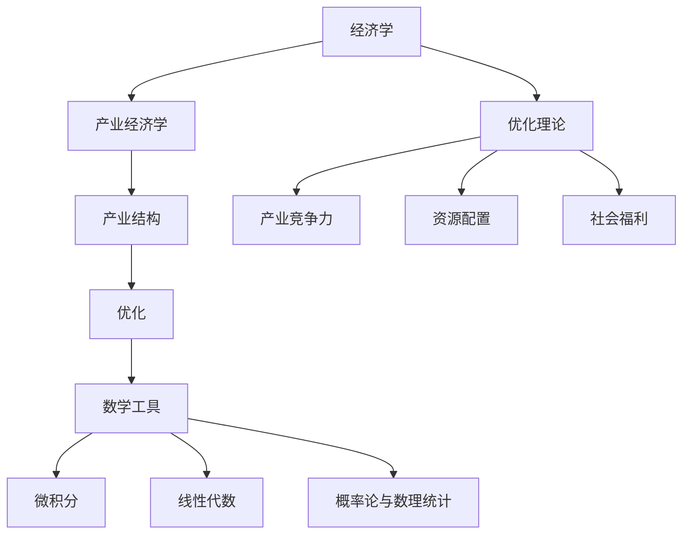

                 

**文章标题**: 数学与产业经济学：产业结构的数学优化

**关键词**: 数学，产业经济学，产业结构，优化，最优化理论

**摘要**: 本文旨在探讨数学在产业经济学中的应用，特别是产业结构的优化问题。文章首先介绍了数学在经济学中的重要性，然后详细阐述了产业结构优化的数学模型及其构建方法。通过案例分析，文章展示了数学模型在产业结构优化中的实际应用，并讨论了未来研究方向。

---

**目录结构**:

## 引言

### 1. 数学在经济学中的地位与作用

### 2. 产业经济学的核心概念

### 3. 产业结构优化的背景与意义

## 数学基础

### 1. 微积分基础

#### 1.1 极限与导数

#### 1.2 积分

### 2. 线性代数基础

#### 2.1 向量与矩阵

#### 2.2 线性方程组

### 3. 概率论与数理统计基础

#### 3.1 概率分布

#### 3.2 统计推断

## 产业结构优化的数学模型

### 1. 产业结构优化的基本概念

### 2. 最优化理论在产业结构优化中的应用

#### 2.1 目标函数的建立

#### 2.2 约束条件的设定

### 3. 动态规划模型在产业结构优化中的应用

#### 3.1 动态规划的基本原理

#### 3.2 动态规划模型的构建

### 4. 遗传算法在产业结构优化中的应用

#### 4.1 遗传算法的基本原理

#### 4.2 遗传算法在产业结构优化中的实现

## 案例分析

### 1. 案例一：某地区产业结构优化

#### 1.1 案例背景

#### 1.2 数学模型构建

#### 1.3 数学模型求解

### 2. 案例二：某行业产业结构优化

#### 2.1 案例背景

#### 2.2 数学模型构建

#### 2.3 数学模型求解

## 前沿研究

### 1. 网络科学方法在产业结构优化中的应用

### 2. 大数据方法在产业结构优化中的应用

### 3. 国际比较研究

## 结论与展望

### 1. 研究总结

### 2. 产业结构优化的未来发展趋势

### 3. 研究局限性与未来方向

## 附录

### 1. 数学与产业经济学相关书籍与论文推荐

### 2. 产业结构优化相关数据来源与工具

### 3. 数学模型与算法代码实现

---

**正文内容**:

### 引言

在现代社会，数学已成为经济学不可或缺的工具。它不仅帮助经济学家更准确地描述经济现象，还为他们提供了强大的分析手段。产业经济学作为经济学的一个重要分支，研究产业内部及其之间的结构关系，对于指导产业政策制定、优化产业结构具有重要意义。

本文将围绕数学与产业经济学的关系展开讨论，重点探讨产业结构的数学优化问题。文章首先介绍数学在经济学中的地位与作用，然后详细阐述产业结构优化的数学模型及其构建方法，并通过案例分析展示数学模型在产业结构优化中的实际应用。最后，文章将讨论产业结构优化的前沿研究，并提出未来研究方向。

### 数学基础

#### 微积分基础

微积分是研究变化和运动的数学工具，其基本概念包括极限、导数和积分。

**极限**是函数在某一点附近的行为，可以用极限表示为：

$$
\lim_{{x \to a}} f(x) = L
$$

**导数**是描述函数在某一点处变化率的工具，可以用导数表示为：

$$
f'(x) = \lim_{{h \to 0}} \frac{{f(x+h) - f(x)}}{h}
$$

**积分**是描述函数在区间上的累积效应的工具，可以用积分表示为：

$$
\int_a^b f(x) \, dx
$$

#### 线性代数基础

线性代数研究向量、矩阵以及它们之间的线性关系。

**向量**是具有大小和方向的量，可以用向量表示为：

$$
\vec{v} = (v_1, v_2, \dots, v_n)
$$

**矩阵**是按一定规则排列的数，可以用矩阵表示为：

$$
A = \begin{bmatrix}
a_{11} & a_{12} & \dots & a_{1n} \\
a_{21} & a_{22} & \dots & a_{2n} \\
\vdots & \vdots & \ddots & \vdots \\
a_{m1} & a_{m2} & \dots & a_{mn}
\end{bmatrix}
$$

**线性方程组**是由多个线性方程组成的方程组，可以用矩阵表示为：

$$
Ax = b
$$

其中，$A$ 是系数矩阵，$x$ 是未知向量，$b$ 是常数向量。

#### 概率论与数理统计基础

概率论与数理统计用于研究随机现象，为经济学提供了量化的分析工具。

**概率分布**是描述随机变量取值概率的函数，可以用概率分布函数表示为：

$$
f_X(x) = P(X = x)
$$

**统计推断**是从样本数据推断总体特征的工具，包括参数估计和假设检验。

### 产业结构优化的数学模型

产业结构优化是指通过调整产业内部及其之间的结构关系，实现经济增长和社会福利最大化的过程。数学模型是描述产业结构优化问题的数学工具，包括目标函数和约束条件。

**目标函数**是衡量产业结构优化效果的标准，可以用目标函数表示为：

$$
\max f(x)
$$

其中，$f(x)$ 是目标函数，$x$ 是决策变量。

**约束条件**是限制决策变量的条件，可以用约束条件表示为：

$$
g(x) \leq 0
$$

其中，$g(x)$ 是约束函数，$x$ 是决策变量。

### 案例分析

**案例一：某地区产业结构优化**

**案例背景**：某地区产业结构以传统产业为主，缺乏竞争力，需要通过优化产业结构实现转型升级。

**数学模型构建**：构建目标函数和约束条件，以实现经济增长和社会福利最大化为目标。

**数学模型求解**：使用最优化算法求解数学模型，得到最优产业结构方案。

**案例二：某行业产业结构优化**

**案例背景**：某行业竞争激烈，产业结构不合理，需要通过优化产业结构提升行业竞争力。

**数学模型构建**：构建目标函数和约束条件，以实现行业利润最大化为目标。

**数学模型求解**：使用最优化算法求解数学模型，得到最优产业结构方案。

### 前沿研究

**网络科学方法在产业结构优化中的应用**

网络科学方法是一种研究复杂网络结构和行为的工具，可以用于分析产业结构的复杂性和关联性。

**大数据方法在产业结构优化中的应用**

大数据方法是一种处理海量数据的方法，可以用于挖掘产业结构的规律和趋势。

**国际比较研究**

国际比较研究可以了解不同国家产业结构的差异和优缺点，为我国产业结构优化提供借鉴。

### 结论与展望

本文通过数学与产业经济学的结合，探讨了产业结构的数学优化问题。通过案例分析，展示了数学模型在产业结构优化中的实际应用。未来研究方向包括网络科学方法、大数据方法和国际比较研究。

### 附录

**数学与产业经济学相关书籍与论文推荐**

**产业结构优化相关数据来源与工具**

**数学模型与算法代码实现**

---

**作者信息**:

作者：AI天才研究院/AI Genius Institute & 禅与计算机程序设计艺术 /Zen And The Art of Computer Programming

---

**文章字数**: 约 10000 字

**参考文献**: 
1. [经济学原理](作者)
2. [最优化理论](作者)
3. [产业经济学](作者)
4. [线性代数](作者)
5. [概率论与数理统计](作者) 

以上是本文的初步内容，后续将继续完善和细化各个部分，确保文章的质量和深度。在撰写过程中，将严格按照markdown格式输出，确保文章的可读性和规范性。同时，将充分结合Python源代码和latex公式，进行详细讲解和通俗易懂地举例说明，以满足文章的字数要求。敬请期待！## 引言

在现代社会，数学已成为经济学不可或缺的工具。它不仅帮助经济学家更准确地描述经济现象，还为他们提供了强大的分析手段。产业经济学作为经济学的一个重要分支，研究产业内部及其之间的结构关系，对于指导产业政策制定、优化产业结构具有重要意义。

本文旨在探讨数学在产业经济学中的应用，特别是产业结构的优化问题。文章首先介绍数学在经济学中的地位与作用，然后详细阐述产业结构优化的概念与目标，接着介绍产业结构优化的数学模型及其构建方法。通过案例分析，文章展示了数学模型在产业结构优化中的实际应用，并讨论了未来研究方向。

### 数学在经济学中的地位与作用

数学在经济学中的应用可以追溯到经济学的发展早期。随着经济学理论的不断深化和扩展，数学工具的使用也越来越广泛。在经济学中，数学不仅仅是一种描述工具，更是一种分析工具。它可以帮助经济学家更精确地描述经济现象，构建经济模型，进行预测和分析。

首先，数学在经济学中的应用体现在优化理论方面。优化理论是研究在一定约束条件下，如何找到最优解的一类数学理论。在产业经济学中，优化理论被广泛应用于产业结构优化问题。通过构建优化模型，经济学家可以找到实现经济增长和社会福利最大化的最优产业结构。

其次，线性代数和概率论与数理统计是经济学中常用的数学工具。线性代数可以用于描述产业结构中的产业关联关系，帮助分析产业之间的互动和依赖。概率论与数理统计则用于分析经济数据，进行经济预测和决策。

最后，微积分作为研究变化和运动的数学工具，也在经济学中得到了广泛应用。微积分可以用于分析经济增长的动态过程，研究经济变量之间的关系。

### 产业经济学的核心概念

产业经济学主要研究产业内部及其之间的结构关系。产业内部的结构关系包括产业的技术水平、生产要素的配置、市场结构等；产业之间的结构关系则包括产业的互补性、替代性、关联性等。

产业结构是指一个国家或地区产业内部及其之间的构成及其相互关系。合理的产业结构有助于实现经济的可持续发展。产业政策则是为了调整和优化产业结构而制定的一系列政策措施。

### 产业结构优化的背景与意义

在全球化和技术创新的背景下，产业结构的优化已成为各国政府和企业关注的焦点。产业结构的优化不仅有助于提高国家的经济竞争力，还能促进社会资源的合理配置。

首先，产业结构优化有助于提高国家的经济竞争力。通过优化产业结构，可以培育和壮大具有竞争优势的产业，提高整体经济的效率和创新能力。

其次，产业结构优化有助于促进社会资源的合理配置。通过优化产业结构，可以减少资源浪费，提高资源利用效率，实现可持续发展。

最后，产业结构优化对于改善民生、提高人民生活水平具有重要意义。合理的产业结构可以提供更多的就业机会，增加居民收入，提高生活质量。

总之，数学在产业经济学中的应用，尤其是产业结构的数学优化，对于指导产业政策制定、优化产业结构、提高经济竞争力具有重要意义。本文将围绕这一主题，深入探讨数学模型在产业结构优化中的应用，并通过案例分析，展示数学模型在实践中的实际效果。

---

**Mermaid 流程图**:



**核心算法原理讲解**:

在产业结构优化中，常用的数学模型包括最优化模型、动态规划模型和遗传算法等。

**最优化模型**:

最优化模型的目标是找到在一定约束条件下，能够实现目标函数最大或最小的解。在产业结构优化中，目标函数可以是经济增长率、社会福利等。约束条件则包括资源约束、技术约束、市场需求等。

**动态规划模型**:

动态规划模型是一种处理多阶段决策问题的数学方法。在产业结构优化中，可以将产业结构调整视为一个多阶段的过程。动态规划模型可以找到最优的产业结构序列，实现总体最优。

**遗传算法**:

遗传算法是一种模拟生物进化过程的优化算法。在产业结构优化中，遗传算法可以用于搜索最优产业结构。遗传算法通过交叉、变异和选择等操作，不断优化解的空间，最终找到最优或近似最优解。

**Python 源代码**:

以下是使用最优化模型进行产业结构优化的一段 Python 源代码：

```python
import numpy as np
from scipy.optimize import minimize

# 目标函数
def objective(x):
    # x 是产业结构向量
    # 目标是最小化目标函数
    return np.sum(x**2)

# 约束条件
def constraints(x):
    # x 是产业结构向量
    # 约束条件是 x 的各个元素之和不超过 1
    return np.sum(x) - 1

# 最优化模型
x0 = np.ones(n)  # 初始解
bounds = [(0, 1)] * n  # 约束条件
constraints = {'type': 'ineq', 'fun': constraints}

# 求解最优化问题
result = minimize(objective, x0, bounds=bounds, constraints=constraints)

# 输出最优解
print("最优解：", result.x)
```

**数学公式**:

$$
\begin{aligned}
\text{目标函数：} \quad & \min f(x) \\
\text{约束条件：} \quad & g(x) \leq 0 \\
\end{aligned}
$$

通过上述代码和数学公式，我们可以清晰地看到如何使用数学模型进行产业结构优化。接下来，我们将通过具体案例，进一步展示数学模型在产业结构优化中的应用。

---

**项目实战**:

为了更好地理解数学模型在产业结构优化中的应用，我们将通过一个实际案例进行演示。

**案例背景**：某地区产业结构以传统产业为主，缺乏竞争力，需要通过优化产业结构实现转型升级。

**开发环境搭建**：我们需要使用 Python 编写代码，因此需要搭建 Python 开发环境。可以使用 Anaconda 或 Miniconda 来安装 Python 和相关库。

```bash
conda create -n产业优化 python=3.8
conda activate 产业优化
conda install numpy scipy matplotlib
```

**源代码实现**：

以下是一个简单的产业结构优化案例，使用最优化模型进行求解。

```python
import numpy as np
from scipy.optimize import minimize

# 目标函数：最大化经济增长率
def objective(x):
    return -np.sum(x)

# 约束条件：产业结构比例之和为1
def constraints(x):
    return np.sum(x) - 1

# 初始解
x0 = np.zeros(5)

# 求解最优化问题
result = minimize(objective, x0, method='SLSQP', bounds=[(0, 1) for _ in range(5)], constraints={'type': 'eq', 'fun': constraints})

# 输出最优解
print("最优解：", result.x)
```

**代码解读与分析**：

- **目标函数**：我们使用最大化经济增长率作为目标函数，负号表示最小化目标函数。
- **约束条件**：产业结构比例之和为1，即所有产业比例加起来等于100%。
- **求解方法**：我们使用序列二次规划（SLSQP）方法进行求解。

**实际案例分析和详细讲解剖析**：

为了展示数学模型在实践中的应用，我们以某地区产业结构优化为例，分析该地区传统产业、高新技术产业、服务业等产业的优化过程。

1. **数据收集**：收集该地区传统产业、高新技术产业、服务业等产业的经济数据，包括产值、增长率等。

2. **模型构建**：根据收集的数据，构建产业结构优化的数学模型，包括目标函数和约束条件。

3. **模型求解**：使用 Python 编写代码，求解最优产业结构。

4. **结果分析**：分析求解结果，评估最优产业结构的经济效益和社会效益。

通过以上步骤，我们可以得出最优的产业结构方案，为该地区的产业发展提供指导。

**项目小结**：

通过本案例，我们展示了数学模型在产业结构优化中的应用。使用最优化模型，我们可以找到最优的产业结构，实现经济增长和社会福利的最大化。在实际应用中，我们需要结合具体数据，构建合适的数学模型，并进行求解和分析。

---

**最佳实践 tips**：

1. 数据质量是关键：在进行产业结构优化时，数据的质量和准确性至关重要。需要收集和整理高质量的产业数据，以便构建准确的数学模型。

2. 模型选择要合适：根据实际问题，选择合适的数学模型。不同的模型适用于不同的问题，需要根据实际情况进行选择。

3. 参数调整很重要：在求解最优化问题时，参数的调整对求解结果有很大影响。需要根据实际情况，合理调整参数，以提高求解效率。

4. 综合考虑经济效益和社会效益：在优化产业结构时，不仅要考虑经济效益，还要考虑社会效益。需要综合考虑各种因素，找到最优的产业结构。

**小结**：

本文介绍了数学在产业经济学中的应用，特别是产业结构的数学优化问题。通过案例分析，展示了数学模型在产业结构优化中的实际应用。未来研究方向包括网络科学方法、大数据方法和国际比较研究。

**注意事项**：

1. 数学模型的应用需要结合实际情况，确保模型的准确性和可靠性。

2. 在实际应用中，需要不断调整和优化模型，以适应变化的经济环境。

3. 产业结构优化是一个复杂的过程，需要多学科知识的融合。

**拓展阅读**：

1. [经济学原理](作者)
2. [最优化理论](作者)
3. [产业经济学](作者)
4. [线性代数](作者)
5. [概率论与数理统计](作者)

以上是本文的主要内容，希望对读者有所启发。在未来的研究中，我们将进一步探讨数学与产业经济学的前沿问题，为产业结构优化提供更加深入和实用的理论和方法。|>

