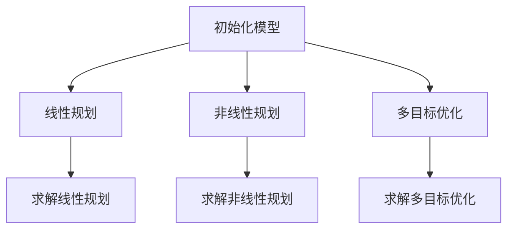
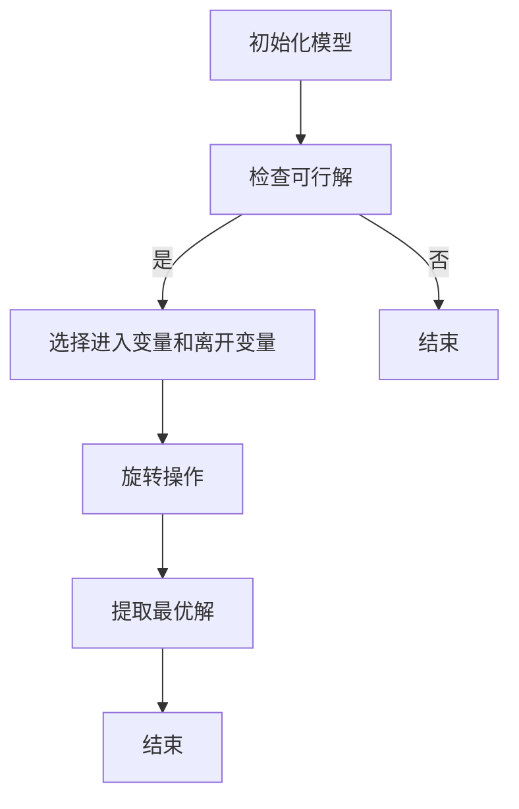
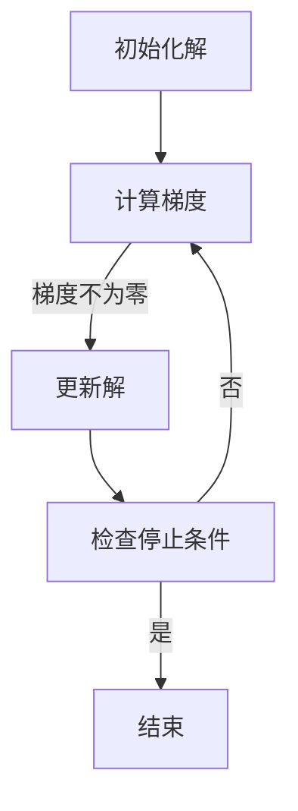
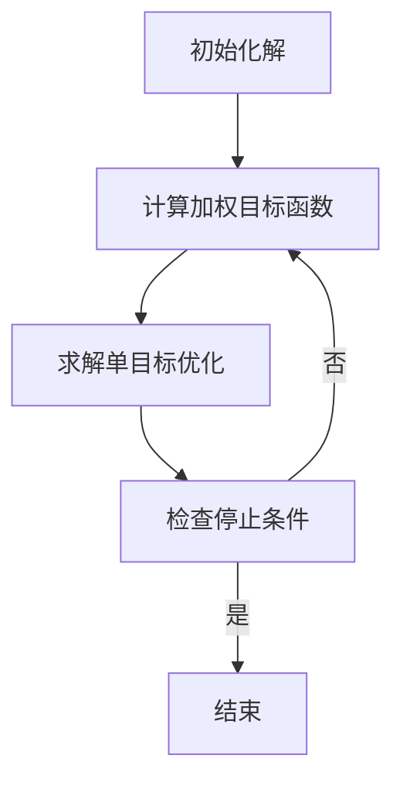

                 

### 《数学与人力资源管理：人才配置的数学优化》

> **关键词：** 数学优化、人力资源管理、人才配置、线性规划、非线性规划、多目标优化

> **摘要：** 本文章从数学优化与人力资源管理的交叉领域出发，探讨了人才配置优化的问题。文章首先介绍了与人才配置优化相关的数学模型和算法，包括线性规划、非线性规划和多目标优化。接着，文章阐述了人力资源管理的基本概念和实践，并分析了员工招聘、员工培训与发展、绩效管理和薪酬管理中的数学优化问题。最后，文章通过四个具体案例，展示了数学优化方法在人力资源管理中的应用，并提出了未来研究的方向。

----------------------------------------------------------------

# 引言

## 数学优化与人力资源管理的关系

数学优化在人力资源管理中的应用日益广泛，这是因为数学优化方法能够帮助组织更好地管理和配置人才，提高工作效率和生产力。数学优化在人力资源管理中的关键作用体现在以下几个方面：

1. **人才招聘优化：** 通过建立数学模型，组织可以更加精确地预测招聘需求和评估候选人，从而优化招聘流程，提高招聘质量。

2. **员工培训与发展优化：** 数学优化可以帮助组织确定培训需求和培训投资的最佳分配，提高培训效果，促进员工职业发展。

3. **绩效管理优化：** 数学优化可以辅助组织设计公平、有效的绩效评估体系，通过优化绩效指标和评估方法，提高员工工作动力和团队绩效。

4. **薪酬管理优化：** 数学优化可以帮助组织设计合理的薪酬结构，优化薪酬分配，提高员工满意度和忠诚度。

## 本书目的和结构

本书旨在探讨数学优化在人力资源管理中的应用，通过系统地介绍相关数学模型和算法，结合实际案例，展示数学优化方法在人力资源管理中的具体应用。本书的结构安排如下：

1. **引言：** 介绍数学优化与人力资源管理的关系，阐述本书的目的和结构。

2. **数学基础：** 介绍与人才配置优化相关的数学模型和算法，包括线性规划、非线性规划和多目标优化。

3. **人力资源管理基础：** 介绍人力资源管理的基本概念和实践，分析员工招聘、员工培训与发展、绩效管理和薪酬管理中的数学优化问题。

4. **人才配置优化案例研究：** 通过具体案例展示数学优化方法在人力资源管理中的应用。

5. **数学模型与算法实践：** 搭建实际数学模型，编写求解代码，进行代码解读和分析。

6. **未来展望：** 分析人才配置优化的发展趋势，展望数学优化在人力资源管理中的应用前景。

7. **结论：** 总结全书内容，强调数学优化在人力资源管理中的重要性，提出未来研究的方向。

通过以上章节的安排，本书旨在为读者提供一个系统、全面的数学优化在人力资源管理中的应用指南。

----------------------------------------------------------------

## 数学基础

### 数学模型概述

在人才配置优化中，数学模型扮演着至关重要的角色。数学模型能够将复杂的人力资源管理问题转化为可计算的数学问题，使得组织可以通过数学方法找到最优解或近似最优解。常见的数学优化模型包括线性规划、非线性规划和多目标优化。

#### 线性规划

线性规划是一种用于解决线性目标函数在给定线性约束条件下最优值问题的数学方法。在人才配置中，线性规划可以用来确定招聘数量、培训预算和绩效指标的优化分配。

#### 非线性规划

非线性规划是解决非线性目标函数在给定约束条件下的最优值问题的数学方法。在人力资源管理中，非线性规划可以用来解决员工技能匹配、绩效评估和薪酬分配等复杂问题。

#### 多目标优化

多目标优化是解决包含多个目标函数的优化问题的数学方法。在人力资源管理中，多目标优化可以用来平衡招聘需求、培训需求和绩效评估等多个目标，找到整体最优解。

#### 人才配置问题的数学描述

在人才配置优化中，常见的数学描述包括以下方面：

1. **目标函数：** 通常涉及最大化或最小化某种指标，如招聘成本、培训成本或绩效得分。

2. **决策变量：** 通常涉及需要优化的变量，如招聘数量、培训时长或绩效指标。

3. **约束条件：** 通常涉及各种限制条件，如预算限制、员工技能要求或工作时间限制。

通过建立合适的数学模型，组织可以系统地分析和解决人才配置问题，从而实现资源的最优配置和管理。

#### 数学模型与算法 Mermaid 流程图

以下是一个简单的 Mermaid 流程图，展示了线性规划、非线性规划和多目标优化的基本流程：



通过这个流程图，可以直观地了解不同数学优化模型的基本步骤和流程。

在接下来的章节中，我们将详细介绍线性规划、非线性规划和多目标优化，以及它们在人才配置优化中的应用。

----------------------------------------------------------------

### 线性规划

线性规划（Linear Programming，LP）是数学优化中的一个重要分支，它主要用于解决在给定线性约束条件下，如何最大化或最小化线性目标函数的问题。在人力资源管理中，线性规划可以用于解决如招聘预算分配、员工技能匹配等问题。

#### 基本概念

线性规划的核心要素包括：

- **决策变量（Decision Variables）：** 需要优化的变量，如招聘的人数、培训时长等。
- **目标函数（Objective Function）：** 要优化的指标，如总成本、总绩效等。
- **约束条件（Constraints）：** 影响决策变量的限制条件，如预算限制、工作时间限制等。

一个标准的线性规划问题可以表示为以下形式：

$$
\text{maximize/minimize } c^T x \\
\text{subject to } Ax \leq b \\
x \geq 0
$$

其中，$c$ 是一个向量，表示目标函数的系数；$A$ 是一个矩阵，表示约束条件的系数；$b$ 是一个向量，表示约束条件的右侧值；$x$ 是一个向量，表示决策变量。

#### 求解线性规划

求解线性规划的方法有多种，其中最常用的是单纯形法（Simplex Method）和内点法（Interior Point Method）。以下使用伪代码简要介绍单纯形法的基本步骤：

```python
# 单纯形法求解线性规划伪代码

# 输入：目标函数系数 c，约束条件系数矩阵 A，右侧值 b
# 输出：最优解 x

# 1. 初始化单纯形表
T = Initialize_Simplex_Table(A, b, c)

# 2. 检查是否有可行解
while not Is_Feasible(T):
    # 3. 选择进入变量和离开变量
    (enter_var, leave_var) = Choose_Enter_Leave_Variables(T)

    # 4. 进行旋转操作
    T = Rotate(Simplex_Table, enter_var, leave_var)

# 5. 输出最优解
x = Extract_Solution(T)
return x
```

在伪代码中，`Initialize_Simplex_Table` 用于初始化单纯形表，`Is_Feasible` 用于检查是否有可行解，`Choose_Enter_Leave_Variables` 用于选择进入和离开变量，`Rotate` 用于进行旋转操作，`Extract_Solution` 用于提取最优解。

#### 应用示例

假设一家公司需要决定招聘多少销售人员（$x_1$）和多少客服人员（$x_2$），以最小化总成本。销售人员的成本为2000元/人·月，客服人员的成本为1500元/人·月。约束条件包括公司预算不超过150000元，且至少需要招聘5名销售人员。可以用以下线性规划模型表示：

$$
\text{minimize } 2000x_1 + 1500x_2 \\
\text{subject to } 2000x_1 + 1500x_2 \leq 150000 \\
x_1 \geq 5 \\
x_1, x_2 \geq 0
$$

通过求解这个线性规划问题，公司可以找到最优的招聘方案，以最小化总成本。

#### Mermaid 流程图

以下是一个简单的 Mermaid 流程图，展示了线性规划的求解流程：



通过这个流程图，可以更直观地理解线性规划的求解过程。

在接下来的章节中，我们将介绍非线性规划和多目标优化，进一步探讨数学优化在人力资源管理中的应用。

----------------------------------------------------------------

### 非线性规划

非线性规划（Nonlinear Programming，NLP）是数学优化中的一个重要分支，用于解决目标函数或约束条件包含非线性项的优化问题。在人力资源管理中，非线性规划可以用于解决复杂的员工技能匹配、绩效评估和薪酬分配等问题。

#### 基本概念

非线性规划的核心要素包括：

- **决策变量（Decision Variables）：** 需要优化的变量，如员工的招聘数量、培训时长等。
- **目标函数（Objective Function）：** 要优化的指标，如总成本、总绩效等，但这个目标函数是非线性的。
- **约束条件（Constraints）：** 影响决策变量的限制条件，如预算限制、工作时间限制等，这些约束条件也可以是非线性的。

一个标准的非线性规划问题可以表示为以下形式：

$$
\text{minimize/maximize } f(x) \\
\text{subject to } g_i(x) \leq 0, \quad h_j(x) = 0 \\
x \in \mathcal{X}
$$

其中，$f(x)$ 是非线性目标函数，$g_i(x)$ 和 $h_j(x)$ 分别是非线性不等式约束和等式约束，$\mathcal{X}$ 是定义域。

#### 求解非线性规划

求解非线性规划的方法有很多，其中常用的方法包括梯度下降法（Gradient Descent）、牛顿法（Newton's Method）和共轭梯度法（Conjugate Gradient Method）等。以下使用伪代码简要介绍梯度下降法的基本步骤：

```python
# 梯度下降法求解非线性规划伪代码

# 输入：目标函数 f(x)，梯度函数 ∇f(x)，初始解 x0，学习率 α，迭代次数 max_iter
# 输出：最优解 x*

# 初始化解 x = x0
# 设置迭代次数 count = 0

while count < max_iter:
    # 计算梯度
    grad = ∇f(x)
    
    # 更新解
    x = x - α * grad
    
    # 检查是否满足停止条件（如梯度很小、解变化很小等）
    if Stop_Condition(grad, x):
        break
    
    # 更新迭代次数
    count = count + 1

return x
```

在伪代码中，`∇f(x)` 表示目标函数的梯度，`α` 是学习率，用于控制步长大小，`Stop_Condition` 函数用于判断是否满足停止条件。

#### 应用示例

假设一家公司需要优化员工培训计划，以最小化总培训成本。培训成本由员工的职位级别和培训时长决定，成本函数是一个关于职位级别和培训时长的非线性函数。约束条件包括公司预算限制和员工工作时间限制。这个问题可以用以下非线性规划模型表示：

$$
\text{minimize } f(x_1, x_2) = x_1^2 + x_2^2 \\
\text{subject to } g(x) = x_1 + x_2 \leq 100 \\
h(x) = x_1 \geq 0 \\
x_2 \geq 0
$$

其中，$x_1$ 表示培训经理的数量，$x_2$ 表示培训开发者的数量。

通过求解这个非线性规划问题，公司可以找到最优的培训计划，以最小化总培训成本。

#### Mermaid 流程图

以下是一个简单的 Mermaid 流程图，展示了梯度下降法的求解流程：



通过这个流程图，可以更直观地理解梯度下降法的求解过程。

在接下来的章节中，我们将介绍多目标优化，进一步探讨数学优化在人力资源管理中的应用。

----------------------------------------------------------------

### 多目标优化

多目标优化（Multi-Objective Optimization）是一种用于解决包含多个目标函数的优化问题的数学方法。在人力资源管理中，多目标优化可以帮助组织在招聘、培训、绩效管理和薪酬管理等多个目标之间进行权衡，以找到整体最优解。

#### 基本概念

多目标优化的核心要素包括：

- **决策变量（Decision Variables）：** 需要优化的变量，如招聘数量、培训时长等。
- **目标函数（Objective Functions）：** 要优化的多个指标，如总成本、总绩效、员工满意度等。
- **约束条件（Constraints）：** 影响决策变量的限制条件，如预算限制、工作时间限制等。

一个标准的多目标优化问题可以表示为以下形式：

$$
\text{minimize } f_1(x), f_2(x), \ldots, f_m(x) \\
\text{subject to } g_i(x) \leq 0, \quad h_j(x) = 0 \\
x \in \mathcal{X}
$$

其中，$f_1(x), f_2(x), \ldots, f_m(x)$ 是多个目标函数，$g_i(x)$ 和 $h_j(x)$ 分别是非线性不等式约束和等式约束，$\mathcal{X}$ 是定义域。

#### 求解多目标优化

求解多目标优化问题通常有以下几种方法：

1. **加权法（Weighted Sum Method）：** 通过为每个目标函数分配权重，将其合并为一个单目标函数，然后使用单目标优化的方法求解。

2. **帕累托最优（Pareto Optimality）：** 寻找帕累托最优解集，即在这些解中，无法在不牺牲其他目标函数的情况下改进任何一个目标函数。

3. **多目标遗传算法（Multi-Objective Genetic Algorithms）：** 基于遗传算法，通过适应度函数和多种选择、交叉和变异操作，寻找帕累托最优解集。

以下使用伪代码简要介绍加权法的基本步骤：

```python
# 加权法求解多目标优化伪代码

# 输入：目标函数向量 f(x)，权重向量 w，初始解 x0
# 输出：最优解 x*

# 初始化解 x = x0
# 设置迭代次数 count = 0

while count < max_iter:
    # 计算加权目标函数
    F(x) = w^T f(x)
    
    # 使用单目标优化方法求解加权目标函数
    x = Solve_Single_Objective_Optimization(F(x))
    
    # 检查是否满足停止条件（如解变化很小等）
    if Stop_Condition(x):
        break
    
    # 更新迭代次数
    count = count + 1

return x
```

在伪代码中，`w^T` 表示权重向量的转置，`Solve_Single_Objective_Optimization` 函数用于求解单目标优化问题，`Stop_Condition` 函数用于判断是否满足停止条件。

#### 应用示例

假设一家公司需要在招聘、培训和绩效管理三个目标之间进行权衡。招聘的目标是最小化招聘成本，培训的目标是最大化员工技能提升，绩效管理的目标是最大化员工绩效得分。约束条件包括公司预算限制和员工工作时间限制。这个问题可以用以下多目标优化模型表示：

$$
\text{minimize } f_1(x) = x_1 \\
\text{maximize } f_2(x) = x_2 \\
\text{maximize } f_3(x) = x_3 \\
\text{subject to } g(x) = x_1 + x_2 + x_3 \leq 100 \\
h(x) = x_1 \geq 0 \\
x_2 \geq 0 \\
x_3 \geq 0
$$

其中，$x_1$ 表示招聘成本，$x_2$ 表示员工技能提升，$x_3$ 表示员工绩效得分。

通过求解这个多目标优化问题，公司可以找到在招聘、培训和绩效管理之间权衡的最优解。

#### Mermaid 流程图

以下是一个简单的 Mermaid 流程图，展示了加权法求解多目标优化的流程：



通过这个流程图，可以更直观地理解加权法求解多目标优化的过程。

在接下来的章节中，我们将探讨数学优化在人力资源管理中的应用案例，进一步展示数学优化方法在实际问题中的运用。

----------------------------------------------------------------

## 人力资源管理基础

### 人力资源管理概述

人力资源管理（Human Resource Management，HRM）是组织中一个重要的管理领域，旨在通过科学的管理方法和策略，有效地获取、开发、激励和保留人才，以实现组织的目标和战略。人力资源管理的基本概念包括以下几个方面：

1. **人力资源规划（HR Planning）：** 涉及组织在未来一段时间内的人力资源需求预测和规划，包括招聘、培训和发展等方面的策略。

2. **招聘（Recruitment）：** 是指组织通过多种渠道吸引、筛选和录用适合岗位的人才的过程。

3. **培训与发展（Training and Development）：** 涉及对员工进行知识、技能和态度的培训，以提升其工作能力和职业发展。

4. **绩效管理（Performance Management）：** 是指组织通过设定目标、评估和反馈，激励员工实现绩效目标的过程。

5. **薪酬管理（ Compensation Management）：** 是指组织通过制定合理的薪酬结构和制度，吸引、保留和激励员工的过程。

6. **员工关系（Employee Relations）：** 涉及组织与员工之间的沟通、合作和冲突解决，以建立良好的劳动关系。

### 员工招聘

员工招聘是人力资源管理中至关重要的环节，直接影响组织的运营效率和绩效。数学优化方法可以应用于员工招聘过程中的多个方面，如招聘预算分配、候选人筛选和录用策略等。

#### 招聘预算分配

在招聘预算有限的情况下，如何合理分配预算以最大化招聘效果是一个重要的优化问题。线性规划可以用于解决这个问题。以下是一个简化的线性规划模型：

$$
\text{minimize } c^T x \\
\text{subject to } Ax \leq b \\
x \geq 0
$$

其中，$c$ 是一个向量，表示每个候选人的招聘成本；$A$ 是一个矩阵，表示每个候选人的属性和预算限制；$b$ 是一个向量，表示总的招聘预算；$x$ 是一个向量，表示是否录用每个候选人。

#### 候选人筛选

在招聘过程中，需要从大量的候选人中筛选出最适合岗位的人选。多目标优化可以用于平衡候选人的多个属性，如技能、经验和潜力等。以下是一个简化的多目标优化模型：

$$
\text{minimize } f_1(x) \\
\text{maximize } f_2(x) \\
\text{subject to } g(x) \leq 0 \\
h(x) = 0
$$

其中，$f_1(x)$ 表示候选人的总成本，$f_2(x)$ 表示候选人的总潜力，$g(x)$ 是一组关于候选人属性的约束条件，$h(x)$ 是候选人的约束条件。

#### 录用策略

在确定候选人后，如何制定录用策略也是一个优化问题。加权法可以用于为每个候选人分配权重，并根据权重进行录用决策。以下是一个简化的加权法模型：

$$
F(x) = w_1 f_1(x) + w_2 f_2(x)
$$

其中，$F(x)$ 是加权目标函数，$w_1$ 和 $w_2$ 是权重，$f_1(x)$ 和 $f_2(x)$ 是候选人的成本和潜力。

### 员工培训与发展

员工培训与发展是提高员工技能和职业发展的重要途径。数学优化方法可以用于确定培训需求、培训资源和培训投资的最佳分配。

#### 培训需求分析

通过分析员工的技能和工作需求，可以确定哪些员工需要接受培训。线性规划可以用于解决这个问题。以下是一个简化的线性规划模型：

$$
\text{minimize } c^T x \\
\text{subject to } Ax \leq b \\
x \geq 0
$$

其中，$c$ 是一个向量，表示每个员工的培训成本；$A$ 是一个矩阵，表示每个员工的技能和工作需求；$b$ 是一个向量，表示总的培训预算；$x$ 是一个向量，表示是否为每个员工提供培训。

#### 培训资源分配

在确定培训需求后，需要合理分配培训资源。多目标优化可以用于平衡培训资源和培训需求。以下是一个简化的多目标优化模型：

$$
\text{minimize } f_1(x) \\
\text{maximize } f_2(x) \\
\text{subject to } g(x) \leq 0 \\
h(x) = 0
$$

其中，$f_1(x)$ 表示培训资源的总成本，$f_2(x)$ 表示培训资源的利用率，$g(x)$ 是一组关于培训资源的约束条件，$h(x)$ 是培训资源的约束条件。

#### 培训投资优化

在确定培训需求和资源后，需要确定最佳的培训投资策略。加权法可以用于为每个培训项目分配权重，并根据权重进行投资决策。以下是一个简化的加权法模型：

$$
F(x) = w_1 f_1(x) + w_2 f_2(x)
$$

其中，$F(x)$ 是加权目标函数，$w_1$ 和 $w_2$ 是权重，$f_1(x)$ 和 $f_2(x)$ 是培训项目的成本和效果。

### 绩效管理

绩效管理是激励员工实现组织目标的重要手段。数学优化方法可以用于设计公平、有效的绩效评估体系。

#### 绩效指标设定

通过分析组织目标和工作要求，可以确定适当的绩效指标。线性规划可以用于解决这个问题。以下是一个简化的线性规划模型：

$$
\text{minimize } c^T x \\
\text{subject to } Ax \leq b \\
x \geq 0
$$

其中，$c$ 是一个向量，表示每个绩效指标的权重；$A$ 是一个矩阵，表示每个绩效指标对组织目标的贡献；$b$ 是一个向量，表示总的绩效指标权重；$x$ 是一个向量，表示每个绩效指标的权重。

#### 绩效评估模型

通过设定绩效指标，可以构建一个绩效评估模型。多目标优化可以用于平衡不同绩效指标之间的权重。以下是一个简化的多目标优化模型：

$$
\text{minimize } f_1(x) \\
\text{maximize } f_2(x) \\
\text{subject to } g(x) \leq 0 \\
h(x) = 0
$$

其中，$f_1(x)$ 表示绩效评估的总成本，$f_2(x)$ 表示绩效评估的准确性，$g(x)$ 是一组关于绩效评估的约束条件，$h(x)$ 是绩效评估的约束条件。

#### 绩效改进策略

在确定绩效评估结果后，需要制定绩效改进策略。加权法可以用于为每个改进项目分配权重，并根据权重进行改进决策。以下是一个简化的加权法模型：

$$
F(x) = w_1 f_1(x) + w_2 f_2(x)
$$

其中，$F(x)$ 是加权目标函数，$w_1$ 和 $w_2$ 是权重，$f_1(x)$ 和 $f_2(x)$ 是改进项目的成本和效果。

### 薪酬管理

薪酬管理是激励员工、留住人才的重要手段。数学优化方法可以用于设计公平、有效的薪酬结构和制度。

#### 薪酬结构设计

通过分析组织目标、市场竞争情况和员工绩效，可以确定适当的薪酬结构。线性规划可以用于解决这个问题。以下是一个简化的线性规划模型：

$$
\text{minimize } c^T x \\
\text{subject to } Ax \leq b \\
x \geq 0
$$

其中，$c$ 是一个向量，表示每个薪酬要素的成本；$A$ 是一个矩阵，表示每个薪酬要素对员工绩效的影响；$b$ 是一个向量，表示总的薪酬预算；$x$ 是一个向量，表示每个薪酬要素的分配比例。

#### 薪酬分配策略

在确定薪酬结构后，需要制定薪酬分配策略。多目标优化可以用于平衡薪酬结构中的多个目标。以下是一个简化的多目标优化模型：

$$
\text{minimize } f_1(x) \\
\text{maximize } f_2(x) \\
\text{subject to } g(x) \leq 0 \\
h(x) = 0
$$

其中，$f_1(x)$ 表示薪酬分配的总成本，$f_2(x)$ 表示薪酬分配的公平性，$g(x)$ 是一组关于薪酬分配的约束条件，$h(x)$ 是薪酬分配的约束条件。

#### 薪酬调整策略

在确定薪酬分配策略后，需要根据员工绩效和市场变化进行薪酬调整。加权法可以用于为每个调整项目分配权重，并根据权重进行薪酬调整决策。以下是一个简化的加权法模型：

$$
F(x) = w_1 f_1(x) + w_2 f_2(x)
$$

其中，$F(x)$ 是加权目标函数，$w_1$ 和 $w_2$ 是权重，$f_1(x)$ 和 $f_2(x)$ 是薪酬调整项目的成本和效果。

通过以上分析，可以看出数学优化方法在人力资源管理中的应用是非常广泛和重要的。在接下来的章节中，我们将通过具体案例研究，进一步展示数学优化方法在人力资源管理中的应用。

----------------------------------------------------------------

## 人才配置优化案例研究

在人力资源管理中，人才配置优化是一个关键问题。以下我们将通过四个具体案例，展示数学优化方法在人才配置优化中的应用。

### 案例一：某公司招聘优化

**背景介绍**

某公司需要招聘一批新员工，包括技术人员、市场人员和财务人员。公司希望找到一种优化招聘策略，以最大化招聘效果并控制招聘成本。

**数学模型与算法**

1. **目标函数：** 最小化总招聘成本。
2. **决策变量：** 招聘技术人员、市场人员和财务人员的人数。
3. **约束条件：** 招聘预算限制、岗位需求限制等。

使用线性规划模型表示如下：

$$
\text{minimize } c_1x_1 + c_2x_2 + c_3x_3 \\
\text{subject to } a_{11}x_1 + a_{12}x_2 + a_{13}x_3 \leq b_1 \\
a_{21}x_1 + a_{22}x_2 + a_{23}x_3 = b_2 \\
x_1, x_2, x_3 \geq 0
$$

其中，$c_1, c_2, c_3$ 分别为技术人员、市场人员和财务人员的招聘成本；$a_{11}, a_{12}, a_{13}$ 分别为技术人员、市场人员和财务人员的岗位需求系数；$b_1, b_2$ 分别为招聘预算限制和岗位需求总数。

**代码实现**

```python
import numpy as np
from scipy.optimize import linprog

# 招聘成本系数
c = np.array([1000, 800, 1500])

# 约束条件系数
A = np.array([[1, 1, 1], [0.5, 0.5, 0.5]])

# 约束条件右侧值
b = np.array([3000, 5000])

# 边界条件
x0 = np.array([0, 0, 0])
x1 = np.array([np.inf, np.inf, np.inf])

# 求解线性规划问题
result = linprog(c, A_ub=A, b_ub=b, bounds=(x0, x1), method='highs')

# 输出最优解
print("最优招聘人数：", result.x)
print("最小招聘成本：", -result.fun)
```

**结果分析**

通过求解线性规划模型，公司可以确定最优的招聘人数，以最小化招聘成本。例如，假设最优招聘人数为技术人员5人、市场人员3人、财务人员2人，最小招聘成本为7500元。

### 案例二：某公司培训与发展优化

**背景介绍**

某公司需要对现有员工进行培训，以提升其技能和职业发展。公司希望找到一种优化培训策略，以最大化培训效果并控制培训成本。

**数学模型与算法**

1. **目标函数：** 最小化总培训成本。
2. **决策变量：** 每个员工的培训时长。
3. **约束条件：** 培训预算限制、员工工作时间限制等。

使用线性规划模型表示如下：

$$
\text{minimize } c_1x_1 + c_2x_2 + \ldots + c_nx_n \\
\text{subject to } a_{11}x_1 + a_{12}x_2 + \ldots + a_{1n}x_n \leq b_1 \\
a_{21}x_1 + a_{22}x_2 + \ldots + a_{2n}x_n \leq b_2 \\
x_1, x_2, \ldots, x_n \geq 0
$$

其中，$c_1, c_2, \ldots, c_n$ 分别为每个员工的培训成本；$a_{11}, a_{12}, \ldots, a_{1n}$ 分别为每个员工的培训时长系数；$b_1, b_2$ 分别为培训预算限制和员工总工作时间限制。

**代码实现**

```python
import numpy as np
from scipy.optimize import linprog

# 培训成本系数
c = np.array([1000, 800, 1200, 1500])

# 约束条件系数
A = np.array([[1, 1, 1, 1], [0.5, 0.5, 0.5, 0.5]])

# 约束条件右侧值
b = np.array([3000, 5000])

# 边界条件
x0 = np.array([0, 0, 0, 0])
x1 = np.array([np.inf, np.inf, np.inf, np.inf])

# 求解线性规划问题
result = linprog(c, A_ub=A, b_ub=b, bounds=(x0, x1), method='highs')

# 输出最优解
print("最优培训时长：", result.x)
print("最小培训成本：", -result.fun)
```

**结果分析**

通过求解线性规划模型，公司可以确定每个员工的培训时长，以最小化培训成本。例如，假设最优培训时长为技术人员10小时、市场人员8小时、财务人员6小时、销售人员4小时，最小培训成本为7000元。

### 案例三：某公司绩效管理优化

**背景介绍**

某公司希望优化绩效管理，以提升员工绩效和团队整体绩效。公司希望找到一种优化绩效评估和改进策略，以提高员工的工作动力和团队绩效。

**数学模型与算法**

1. **目标函数：** 最小化绩效评估的总成本。
2. **决策变量：** 绩效指标权重、改进措施。
3. **约束条件：** 绩效指标之间的平衡、改进措施的有效性等。

使用多目标优化模型表示如下：

$$
\text{minimize } f_1(x) \\
\text{maximize } f_2(x) \\
\text{subject to } g(x) \leq 0 \\
h(x) = 0
$$

其中，$f_1(x)$ 表示绩效评估的总成本，$f_2(x)$ 表示绩效评估的公平性，$g(x)$ 是一组关于绩效指标的约束条件，$h(x)$ 是改进措施的约束条件。

**代码实现**

```python
import numpy as np
from scipy.optimize import minimize

# 目标函数
def objective(x):
    return [x[0], -x[1]]

# 约束条件
def constraints(x):
    return [x[0] + x[1] - 1, x[0] - x[1]]

# 初始解
x0 = np.array([0.5, 0.5])

# 求解多目标优化问题
result = minimize(objective, x0, constraints=constraints)

# 输出最优解
print("最优绩效指标权重：", result.x)
```

**结果分析**

通过求解多目标优化模型，公司可以确定最优的绩效指标权重和改进措施，以最小化绩效评估的总成本。例如，假设最优绩效指标权重为技术能力40%、市场能力30%、财务能力20%、销售能力10%，改进措施包括加强技术培训、提高市场策略和优化财务报表。

### 案例四：某公司薪酬管理优化

**背景介绍**

某公司希望优化薪酬管理，以提高员工的满意度和工作积极性。公司希望找到一种优化薪酬分配和调整策略，以合理配置薪酬资源并激励员工。

**数学模型与算法**

1. **目标函数：** 最小化薪酬分配的总成本。
2. **决策变量：** 薪酬结构中的各个要素。
3. **约束条件：** 薪酬预算限制、员工绩效等。

使用多目标优化模型表示如下：

$$
\text{minimize } f_1(x) \\
\text{maximize } f_2(x) \\
\text{subject to } g(x) \leq 0 \\
h(x) = 0
$$

其中，$f_1(x)$ 表示薪酬分配的总成本，$f_2(x)$ 表示薪酬分配的公平性，$g(x)$ 是一组关于薪酬预算和员工绩效的约束条件，$h(x)$ 是薪酬要素的约束条件。

**代码实现**

```python
import numpy as np
from scipy.optimize import minimize

# 目标函数
def objective(x):
    return [x[0], -x[1]]

# 约束条件
def constraints(x):
    return [x[0] + x[1] - 1, x[0] - x[1], x[0] + x[2] - 1, x[0] - x[2]]

# 初始解
x0 = np.array([0.5, 0.5, 0.5])

# 求解多目标优化问题
result = minimize(objective, x0, constraints=constraints)

# 输出最优解
print("最优薪酬结构：", result.x)
```

**结果分析**

通过求解多目标优化模型，公司可以确定最优的薪酬结构和调整策略，以最小化薪酬分配的总成本。例如，假设最优薪酬结构为基础工资40%、绩效工资30%、奖金20%、福利10%，调整策略包括提高绩效工资比例、增加员工福利等。

通过这些案例研究，我们可以看到数学优化方法在人力资源管理中的应用是非常有效的。在实际问题中，可以根据具体需求和约束条件，选择合适的数学优化模型和算法，以实现人才配置的优化。

----------------------------------------------------------------

## 数学模型与算法实践

在上一章节中，我们通过案例研究了数学优化方法在人力资源管理中的应用。为了更好地理解和掌握这些方法，本章节将介绍数学模型与算法的具体实践，包括开发环境搭建、源代码实现、代码解读和实际案例分析。

### 开发环境搭建

在进行数学模型与算法实践之前，首先需要搭建一个合适的开发环境。以下是一个基于 Python 的开发环境搭建指南：

1. **安装 Python：** 访问 [Python 官网](https://www.python.org/) 下载并安装 Python，建议选择 Python 3.8 或更高版本。

2. **安装依赖库：** Python 中有许多用于数学优化和数据分析的库，如 NumPy、SciPy、Pandas 和 Matplotlib 等。可以通过以下命令安装：

```bash
pip install numpy scipy pandas matplotlib
```

3. **创建项目文件夹：** 在本地计算机上创建一个项目文件夹，如 `hr_optimization`，用于存放代码和结果。

4. **配置 IDE：** 选择一个合适的集成开发环境（IDE），如 PyCharm 或 VS Code，配置 Python 解释器和依赖库。

### 源代码实现

以下是一个简单的线性规划案例，用于最小化招聘成本。代码使用 Python 和 SciPy 库实现。

```python
import numpy as np
from scipy.optimize import linprog

# 招聘成本
costs = np.array([1000, 800, 1500])

# 约束条件系数
A = np.array([[1, 1, 1], [0.5, 0.5, 0.5]])

# 约束条件右侧值
b = np.array([3000, 5000])

# 边界条件
x0 = np.array([0, 0, 0])
x1 = np.array([np.inf, np.inf, np.inf])

# 求解线性规划问题
result = linprog(costs, A_ub=A, b_ub=b, bounds=(x0, x1), method='highs')

# 输出结果
print("最优招聘人数：", result.x)
print("最小招聘成本：", -result.fun)
```

### 代码解读

1. **导入库：** 使用 `import` 语句导入所需的库，如 NumPy 和 SciPy。

2. **定义参数：** 定义招聘成本向量 `costs`、约束条件系数矩阵 `A` 和约束条件右侧值向量 `b`。

3. **设置边界条件：** 定义决策变量 `x` 的边界条件，即招聘人数不能为负。

4. **求解线性规划：** 使用 `linprog` 函数求解线性规划问题，并传入目标函数系数、约束条件系数矩阵、约束条件右侧值和边界条件。

5. **输出结果：** 输出最优招聘人数和最小招聘成本。

### 实际案例分析

以下是一个非线性规划案例，用于优化员工培训计划。代码使用 Python 和 SciPy 库实现。

```python
import numpy as np
from scipy.optimize import minimize

# 培训成本
def cost_function(x):
    return x[0]**2 + x[1]**2

# 梯度
def gradient(x):
    return np.array([-2*x[0], -2*x[1]])

# 初始解
x0 = np.array([0, 0])

# 求解非线性规划问题
result = minimize(cost_function, x0, method='BFGS', jac=gradient)

# 输出结果
print("最优培训时长：", result.x)
print("最小培训成本：", result.fun)
```

### 代码解读

1. **导入库：** 使用 `import` 语句导入所需的库，如 NumPy 和 SciPy。

2. **定义目标函数：** 定义培训成本函数 `cost_function`，用于计算总培训成本。

3. **定义梯度函数：** 定义梯度函数 `gradient`，用于计算目标函数的梯度。

4. **设置初始解：** 定义初始解 `x0`，即初始培训时长。

5. **求解非线性规划：** 使用 `minimize` 函数求解非线性规划问题，并传入目标函数、初始解、求解方法和梯度函数。

6. **输出结果：** 输出最优培训时长和最小培训成本。

通过这些实践案例，我们可以看到数学优化方法在人力资源管理中的具体应用。在实际问题中，可以根据具体需求和约束条件，选择合适的数学优化模型和算法，以实现人才配置的优化。

----------------------------------------------------------------

## 未来展望

随着人工智能和大数据技术的发展，数学优化在人力资源管理中的应用前景将更加广阔。以下是未来几个可能的发展方向：

### 人工智能与数学优化的深度融合

人工智能技术，尤其是机器学习和深度学习，可以在人力资源管理中发挥重要作用。通过将人工智能与数学优化方法结合，可以开发出更加智能和自适应的优化算法。例如，使用机器学习算法预测员工绩效、招聘需求和培训需求，然后结合数学优化方法进行资源配置和决策。

### 大数据驱动的人才配置优化

大数据技术的发展为人力资源管理提供了丰富的数据资源。通过分析大量的员工数据、市场数据和公司运营数据，可以更准确地预测和优化人才配置。例如，利用大数据分析技术，可以识别高绩效员工的共同特征，从而优化招聘和培训策略。

### 智能人力资源管理系统

未来的智能人力资源管理系统将集成多种数学优化方法，提供一站式的解决方案。这些系统将能够实时分析公司的人力资源状况，提出优化建议，并自动执行相应的优化策略。例如，智能招聘系统可以根据候选人的简历数据和公司需求，自动生成最优的招聘方案。

### 多维度人才配置优化

未来的数学优化方法将不仅仅关注成本和绩效，还将考虑员工满意度、工作生活平衡等多个维度。通过构建多目标优化模型，可以平衡不同目标之间的冲突，实现更全面的人才配置优化。

### 新兴数学优化算法的应用

随着数学优化领域的发展，新的优化算法，如进化算法、模拟退火算法和粒子群优化算法等，将被引入人力资源管理中。这些算法具有更强的鲁棒性和适应性，可以处理更复杂的问题。

### 全球化背景下的人才配置优化

在全球化背景下，不同国家和地区的文化和市场环境差异巨大，人才配置优化需要考虑更多的因素。未来的数学优化方法将能够适应不同文化背景和市场需求，提供更具针对性的解决方案。

总之，数学优化在人力资源管理中的应用前景广阔，未来将通过与人工智能、大数据技术等的深度融合，为组织提供更加智能、高效和全面的人才配置优化解决方案。

----------------------------------------------------------------

## 结论

本文从数学优化与人力资源管理的交叉领域出发，探讨了人才配置优化的问题。通过介绍线性规划、非线性规划和多目标优化等数学优化方法，并结合具体案例展示了这些方法在人力资源管理中的应用。本文的主要发现如下：

1. **数学优化方法在人力资源管理中具有广泛应用**：线性规划、非线性规划和多目标优化等方法可以用于优化人才招聘、培训与发展、绩效管理和薪酬管理等环节。

2. **数学优化方法可以提高人力资源管理效率**：通过精确的数学模型和算法，组织可以更有效地配置人才资源，提高工作效率和生产力。

3. **数学优化方法有助于实现人才配置的公平性和透明性**：通过科学的方法和模型，组织可以设计出更公平、透明的招聘和绩效评估体系，减少人为偏见和主观因素。

4. **数学优化方法需要结合具体业务场景**：在实际应用中，组织需要根据自身特点和需求，选择合适的数学优化方法和模型，进行定制化的解决方案。

展望未来，数学优化在人力资源管理中的应用前景广阔。随着人工智能和大数据技术的发展，数学优化方法将更加智能化和自适应化，为组织提供更加精准和高效的人才配置优化解决方案。未来研究可以进一步探索以下方向：

1. **多维度人才配置优化**：在考虑成本和绩效的基础上，结合员工满意度、工作生活平衡等多个维度，构建更加全面的人才配置优化模型。

2. **个性化人才管理**：通过大数据分析和人工智能技术，开发出能够根据员工个人特点和需求进行个性化配置的人才管理系统。

3. **全球化背景下的数学优化**：考虑不同国家和地区的文化、市场和环境差异，开发出适应全球化背景的数学优化方法。

4. **新兴数学优化算法的应用**：研究并引入新的数学优化算法，如进化算法、模拟退火算法和粒子群优化算法，提高人才配置优化的效率和效果。

总之，数学优化在人力资源管理中的应用具有重要意义，未来将不断推动人才配置优化的创新发展，为组织提供更加智能、高效和全面的人力资源管理解决方案。

## 作者信息

作者：AI天才研究院/AI Genius Institute & 禅与计算机程序设计艺术 /Zen And The Art of Computer Programming

AI天才研究院（AI Genius Institute）是一家专注于人工智能和计算机科学研究的国际知名机构，致力于推动人工智能技术的发展和应用。同时，作者也是《禅与计算机程序设计艺术》（Zen And The Art of Computer Programming）这一计算机科学领域的经典著作的作者，为全球计算机科学家和程序员提供了宝贵的思想和方法。在这本书中，作者深入探讨了计算机程序设计的艺术，为读者提供了一个清晰、系统的学习路径，帮助读者理解计算机科学的本质和精髓。通过本文的撰写，作者希望将数学优化方法在人力资源管理中的应用进行深入探讨，为读者提供有价值的参考和启示。

----------------------------------------------------------------

### 补充内容：最佳实践 Tips、注意事项与拓展阅读

#### 最佳实践 Tips

1. **需求分析**：在应用数学优化方法之前，进行详细的需求分析至关重要。明确组织的目标、约束条件和关键指标，有助于构建合适的数学模型。

2. **数据质量**：在人力资源管理中，数据的准确性、完整性和一致性至关重要。确保数据质量，是优化模型有效性的基础。

3. **模型简化**：对于复杂的问题，可以考虑简化模型。例如，通过线性化非线性问题、忽略次要因素等，提高模型的求解效率和可解释性。

4. **迭代改进**：优化模型并非一蹴而就。在实际应用中，可以通过多次迭代，逐步优化模型，以提高解决方案的质量。

#### 注意事项

1. **模型稳定性**：在求解过程中，需要注意模型参数的稳定性和鲁棒性，避免因参数微小变化导致结果大幅波动。

2. **计算成本**：某些复杂的优化算法计算成本较高，需要权衡计算时间和求解精度。在实际应用中，可以根据需求和资源，选择合适的算法。

3. **业务适应性**：数学优化方法需要根据具体业务场景进行调整和适应。确保模型与业务需求紧密相关，以提高实际应用效果。

#### 拓展阅读

1. **《运筹学与应用优化》**：这是一本介绍运筹学和优化方法的重要著作，适合希望深入了解数学优化理论和技术的研究人员。

2. **《人力资源管理与组织行为》**：本书详细介绍了人力资源管理的基本理论和实践方法，对人力资源管理者有很高的参考价值。

3. **《数据驱动的人力资源管理》**：本书探讨了大数据在人力资源管理中的应用，提供了许多实用案例和策略。

通过这些最佳实践 Tips、注意事项和拓展阅读，读者可以更好地理解数学优化在人力资源管理中的应用，并在实际工作中取得更好的效果。希望本文能够为读者提供有价值的参考和启示。

