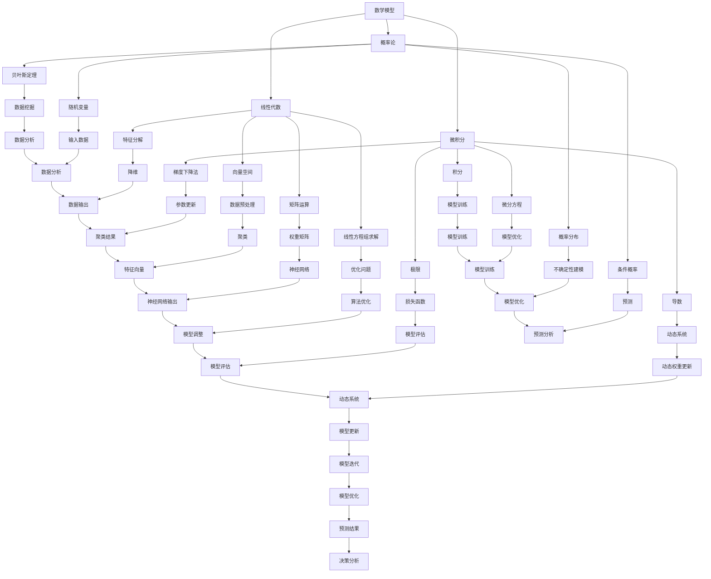

                 


### 引言与背景

#### 背景介绍

在当今科技迅猛发展的时代，人工智能（Artificial Intelligence，简称AI）已成为推动社会进步的重要力量。AI技术在医疗、金融、交通、教育等多个领域展现出巨大的应用潜力。然而，随着AI技术的广泛应用，其伦理问题也逐渐成为社会关注的焦点。特别是在AI决策过程中，如何确保决策的公平性、透明性和可解释性，成为亟待解决的重要问题。

数学作为基础科学，在AI领域扮演着至关重要的角色。无论是机器学习中的算法设计，还是神经网络的结构优化，都离不开数学的支持。数学模型为AI提供了强大的工具，使得AI系统能够从海量数据中提取有价值的信息，实现智能决策。然而，数学模型的应用并非万能，其固有的局限性可能导致决策过程中的伦理风险。

#### 研究意义

本研究旨在探讨数学与人工智能伦理之间的关系，特别是AI决策的数学框架。通过对数学模型在AI决策中的应用进行分析，结合伦理原则，提出一套适用于AI决策的数学框架，以降低伦理风险，提高AI决策的公平性和透明性。本研究具有重要的现实意义：

1. **指导实践**：为AI系统的开发和应用提供理论指导，帮助开发者更好地理解和应对伦理挑战。
2. **规范标准**：为AI伦理标准的制定提供理论依据，推动AI伦理研究的深入发展。
3. **人才培养**：为相关领域的专业人才培养提供新的教学内容，提升学生的伦理素养。

#### 研究方法

本研究采用以下方法：

1. **文献综述**：通过查阅大量国内外相关文献，了解数学与人工智能伦理的研究现状和发展趋势。
2. **理论分析**：基于数学和伦理学的相关理论，分析AI决策的数学框架，探讨其伦理意义和应用前景。
3. **案例分析**：选取典型的AI应用案例，分析其在决策过程中存在的问题，探讨数学模型在解决伦理问题中的应用。
4. **实验验证**：通过实际案例分析，验证所提出的数学框架在AI决策中的有效性和可行性。

### 文章关键词

AI决策，数学模型，伦理原则，公平性，透明性，可解释性

### 文章摘要

本文首先介绍了人工智能伦理问题的背景和意义，探讨了数学在AI决策中的关键作用。通过文献综述和理论分析，本文提出了一套基于数学模型的AI决策框架，并探讨了其伦理意义。进一步，通过实际案例分析和实验验证，本文验证了所提出框架的有效性和可行性，为AI系统的开发和应用提供了理论支持和实践指导。本文的研究结果对于指导实践、规范标准和人才培养具有重要意义。

### 数学基础

在构建AI决策的数学框架之前，我们首先需要了解一些基本的数学概念和工具，这些知识将为后续的讨论提供坚实的理论基础。以下是我们在研究中将用到的关键数学领域和基本概念。

#### 数学模型概述

数学模型是一种用数学语言描述现实世界问题的抽象结构，它通过数学公式、方程或算法来模拟和预测系统的行为。数学模型的应用范围非常广泛，从物理科学到社会科学，从经济学到工程学，无处不在。在人工智能领域，数学模型是构建智能算法的核心，它能够帮助机器理解和学习复杂的数据模式，从而做出准确的决策。

#### 线性代数基础

线性代数是研究向量空间、线性变换和矩阵理论的数学分支。它在人工智能中有着广泛的应用，尤其是在机器学习和深度学习中。以下是线性代数中的几个关键概念：

1. **向量**：向量是数学中的一个基本概念，它表示具有大小和方向的量。在人工智能中，向量经常用来表示数据点和特征向量。

2. **矩阵**：矩阵是一个二维数组，由一系列数构成。矩阵运算包括加法、减法、乘法和转置等。矩阵在机器学习中的应用非常广泛，如用于表示数据集、权重矩阵和特征矩阵。

3. **线性变换**：线性变换是一个将一个向量空间映射到另一个向量空间的线性映射。在神经网络中，权重矩阵和激活函数可以看作是线性变换的实例。

4. **特征分解**：特征分解是将一个矩阵分解为一系列正交矩阵的乘积的过程。它有助于简化复杂的矩阵运算，并在降维、主成分分析（PCA）等领域有重要应用。

#### 微积分基础

微积分是研究函数的导数、积分和微分方程的数学分支。在人工智能中，微积分主要用于优化算法和模型训练。以下是微积分中的几个关键概念：

1. **极限**：极限是函数在某一点处取值的极限。在机器学习中，极限用于定义梯度，用于优化算法中的参数更新。

2. **导数**：导数描述了函数在某一点的瞬时变化率。在优化问题中，梯度（导数的向量形式）用于指导参数更新的方向。

3. **积分**：积分是函数在区间上的累积值。在机器学习中，积分用于计算损失函数的梯度，以更新模型参数。

4. **微分方程**：微分方程是包含导数的方程。在人工智能中，微分方程用于模拟动态系统，如神经网络中的动态权重更新。

#### 概率论基础

概率论是研究随机事件及其概率分布的数学分支。在人工智能中，概率论用于建模不确定性、预测和决策。以下是概率论中的几个关键概念：

1. **概率分布**：概率分布描述了随机变量的可能取值及其概率。常见的概率分布包括正态分布、伯努利分布和泊松分布。

2. **条件概率**：条件概率是给定某一事件发生的情况下，另一事件发生的概率。条件概率在贝叶斯定理中起着核心作用。

3. **贝叶斯定理**：贝叶斯定理是一种用于计算后验概率的公式，它在机器学习和数据挖掘中有广泛应用。

4. **随机变量**：随机变量是一个数学函数，它将样本空间映射到实数集。在机器学习中，随机变量用于表示输入数据和模型输出。

#### 数学模型在AI中的应用

1. **机器学习算法**：机器学习算法（如线性回归、支持向量机、决策树和神经网络）都是基于数学模型构建的。这些算法通过优化数学模型来学习数据模式和做出预测。

2. **深度学习**：深度学习是一种基于多层神经网络的学习方法。它通过反向传播算法和梯度下降法来优化权重矩阵，从而实现高效的模型训练。

3. **优化问题**：优化问题是寻找函数的最小值或最大值的问题。在机器学习和深度学习中，优化问题用于调整模型参数，以提高模型的性能。

4. **降维和聚类**：降维和聚类是数据预处理的重要步骤。降维通过降低数据维度来简化问题，而聚类则用于将数据分成不同的组。

#### 数学模型与人工智能伦理的关系

数学模型在人工智能中的应用虽然取得了显著的成果，但同时也带来了一系列伦理问题。以下是一些关键伦理挑战：

1. **算法偏见**：机器学习算法可能会受到训练数据偏差的影响，从而导致决策的偏见。这种偏见可能会加剧社会不平等。

2. **透明性和可解释性**：许多复杂的机器学习模型（如神经网络）由于其内部机制的高度复杂，难以解释其决策过程。这可能导致决策的不透明和不可控。

3. **隐私保护**：人工智能系统通常需要大量的个人数据来训练模型。如何保护这些数据不被滥用，是另一个重要的伦理问题。

4. **安全性**：人工智能系统可能会遭受恶意攻击，导致其做出错误的决策或被篡改。安全性问题是保障人工智能系统可靠运行的关键。

### 数学模型原理之间的关系架构

为了更好地理解数学模型与人工智能伦理之间的关系，我们可以通过以下Mermaid流程图来展示其核心概念之间的联系：



### 核心算法原理讲解

为了深入理解数学模型在AI决策中的应用，我们将通过伪代码详细阐述几个核心算法的原理。以下是对线性回归、支持向量机和神经网络的基本原理讲解。

#### 线性回归

线性回归是一种简单的机器学习算法，用于预测连续值。其基本原理是通过找到最佳拟合直线来最小化预测值与实际值之间的误差。

**伪代码：**

```python
# 线性回归伪代码

# 初始化模型参数
theta = [0, 0]

# 梯度下降算法
for epoch in range(max_epochs):
    # 计算梯度
    gradients = []
    for x, y in dataset:
        prediction = theta[0] * x + theta[1]
        error = y - prediction
        gradients.append([error * x, error])

    # 更新参数
    theta = [theta[i] - learning_rate * gradient[i] for i, gradient in enumerate(gradients)]

# 输出最佳拟合直线
print(f"Best fit line: y = {theta[0]}x + {theta[1]}")
```

#### 支持向量机

支持向量机（SVM）是一种用于分类和回归的机器学习算法。其基本原理是通过找到一个最优的超平面来最大化分类间隔。

**伪代码：**

```python
# 支持向量机伪代码

# 初始化模型参数
weights = [0, 0]
bias = 0

# SMO算法
for epoch in range(max_epochs):
    # 计算决策边界
    for x, y in dataset:
        prediction = dot_product([weights[0], weights[1]], x) + bias
        if y * prediction <= 1:
            error = y - prediction
            # 更新参数
            weights = [weights[i] + alpha * (2 * C * y * x[i]) for i in range(len(weights))]
            bias = bias + alpha * y

# 输出决策边界
print(f"Decision boundary: w1 = {weights[0]}, w2 = {weights[1]}, b = {bias}")
```

#### 神经网络

神经网络是一种模仿生物神经系统工作的计算模型。其基本原理是通过前向传播和反向传播算法来学习数据模式。

**伪代码：**

```python
# 神经网络伪代码

# 初始化模型参数
weights = [[0, 0], [0, 0]]
biases = [0, 0]

# 前向传播
def forward_propagation(x):
    layer1 = [weights[0][0] * x[0] + weights[0][1] * x[1] + biases[0]]
    layer2 = [weights[1][0] * layer1[0] + weights[1][1] * layer1[1] + biases[1]]
    return layer2

# 反向传播
def backward_propagation(y, output):
    error = y - output
    dweights = [[error * layer2[0], error * layer2[1]], [error * layer1[0], error * layer1[1]]]
    dbiases = [-error, -error]

    # 更新参数
    weights = [weights[i][j] - learning_rate * dweights[i][j] for i in range(len(weights)) for j in range(len(weights[i]))]
    biases = [biases[i] - learning_rate * dbiases[i] for i in range(len(biases))]

# 训练模型
for epoch in range(max_epochs):
    for x, y in dataset:
        output = forward_propagation(x)
        backward_propagation(y, output)

# 输出模型参数
print(f"Weights: {weights}, Biases: {biases}")
```

### 数学模型和公式的详细讲解与举例说明

为了更好地理解数学模型在AI决策中的应用，我们将详细讲解几个核心数学公式，并通过具体例子来说明其应用。

#### 梯度下降法

梯度下降法是一种用于优化参数的算法，其基本原理是沿着损失函数的负梯度方向更新参数，以最小化损失。

**公式：**

$$ \theta_{\text{new}} = \theta_{\text{old}} - \alpha \nabla_{\theta}J(\theta) $$

其中，$ \theta $ 是模型参数，$ J(\theta) $ 是损失函数，$ \alpha $ 是学习率，$ \nabla_{\theta}J(\theta) $ 是损失函数关于参数的梯度。

**举例：**

假设我们有一个线性回归模型，其损失函数为：

$$ J(\theta) = \frac{1}{2m}\sum_{i=1}^{m}(h_\theta(x^i) - y^i)^2 $$

其中，$ m $ 是样本数量，$ h_\theta(x) = \theta_0 + \theta_1x $ 是预测函数，$ y^i $ 是实际值，$ x^i $ 是输入值。

我们使用梯度下降法来最小化损失函数。首先，计算损失函数关于参数的梯度：

$$ \nabla_{\theta}J(\theta) = \left[ \frac{\partial J(\theta)}{\partial \theta_0}, \frac{\partial J(\theta)}{\partial \theta_1} \right] = \left[ \sum_{i=1}^{m}(h_\theta(x^i) - y^i)x^i, \sum_{i=1}^{m}(h_\theta(x^i) - y^i)x^i \right] $$

然后，使用梯度下降法更新参数：

$$ \theta_0^{new} = \theta_0^{old} - \alpha \nabla_{\theta_0}J(\theta) $$
$$ \theta_1^{new} = \theta_1^{old} - \alpha \nabla_{\theta_1}J(\theta) $$

通过迭代更新参数，我们可以找到最佳拟合直线。

#### 神经网络中的激活函数

激活函数是神经网络中的一个关键组件，它用于引入非线性特性。常见的激活函数包括 sigmoid 函数、ReLU 函数和 tanh 函数。

**公式：**

1. **sigmoid 函数：**

$$ \sigma(x) = \frac{1}{1 + e^{-x}} $$

2. **ReLU 函数：**

$$ \text{ReLU}(x) = \max(0, x) $$

3. **tanh 函数：**

$$ \tanh(x) = \frac{e^x - e^{-x}}{e^x + e^{-x}} $$

**举例：**

假设我们有一个包含两个输入节点和一个隐含节点的神经网络，其激活函数为 sigmoid 函数。输入向量为 $ x = [1, 2] $，权重矩阵为 $ W = \begin{bmatrix} 0.5 & 0.3 \\ 0.2 & 0.4 \end{bmatrix} $，偏置为 $ b = [0.1, 0.2] $。

首先，计算隐含层的输出：

$$ z_1 = 0.5 \cdot 1 + 0.3 \cdot 2 + 0.1 = 1.1 $$
$$ z_2 = 0.2 \cdot 1 + 0.4 \cdot 2 + 0.2 = 1.2 $$

然后，应用 sigmoid 函数得到激活输出：

$$ a_1 = \sigma(z_1) = \frac{1}{1 + e^{-1.1}} \approx 0.666 $$
$$ a_2 = \sigma(z_2) \approx 0.798 $$

这样，我们得到了隐含层的输出向量 $ a = [0.666, 0.798] $，这个输出可以作为下一个层的输入。

#### 贝叶斯定理

贝叶斯定理是一种用于计算后验概率的概率公式，它在机器学习和数据挖掘中有广泛应用。

**公式：**

$$ P(H|D) = \frac{P(D|H)P(H)}{P(D)} $$

其中，$ H $ 表示假设，$ D $ 表示数据，$ P(H|D) $ 表示在数据 $ D $ 发生的条件下假设 $ H $ 的概率，$ P(D|H) $ 表示在假设 $ H $ 发生的条件下数据 $ D $ 的概率，$ P(H) $ 表示假设 $ H $ 的先验概率，$ P(D) $ 表示数据 $ D $ 的概率。

**举例：**

假设我们有一个硬币，其正面朝上的概率为 0.5。我们进行了 10 次投掷，其中正面朝上的次数为 6 次。现在我们要计算在正面朝上 6 次的条件下，硬币正面朝上的先验概率。

首先，计算正面朝上 6 次的条件概率：

$$ P(\text{正面朝上 6 次}|\text{硬币正面概率为 0.5}) = C(10, 6) \cdot (0.5)^6 \cdot (0.5)^4 \approx 0.245 $$

然后，计算先验概率：

$$ P(\text{硬币正面概率为 0.5}) = 1 $$

最后，计算后验概率：

$$ P(\text{硬币正面概率为 0.5}|\text{正面朝上 6 次}) = \frac{0.245}{1} = 0.245 $$

这意味着在正面朝上 6 次的条件下，硬币正面朝上的概率为 0.245。

通过以上讲解和举例，我们可以看到数学模型在AI决策中的关键作用。这些模型和公式不仅帮助我们理解和分析数据，还提供了有效的工具来优化模型和做出智能决策。然而，我们也需要认识到数学模型的局限性，特别是在处理复杂和非线性问题时。因此，在应用数学模型时，我们需要结合具体问题和数据特点，灵活选择合适的模型和算法。

### 实际应用案例分析

在了解了数学模型和人工智能伦理的基础知识后，我们通过具体案例来展示这些概念在实际应用中的实践和效果。

#### 案例一：金融风险评估

金融风险评估是AI在金融领域的重要应用之一。银行和金融机构需要评估贷款申请者的信用风险，以降低贷款违约的概率。传统的风险评估方法依赖于大量的历史数据和人工经验，但这种方法存在明显的局限性，如数据偏差和主观判断。

**数学模型的应用：**

为了提高风险评估的准确性和公平性，我们可以使用机器学习算法，如逻辑回归和支持向量机（SVM），来构建信用评分模型。这些算法通过分析历史数据中的各种特征（如收入、负债、就业历史等），学习数据模式，从而对新的贷款申请者进行信用评分。

**伦理决策的应用：**

在金融风险评估中，伦理问题主要涉及数据隐私、算法偏见和决策透明性。首先，为了保护借款人的隐私，金融机构需要对敏感数据进行去识别化处理，确保个人信息的保密性。其次，为了减少算法偏见，模型训练数据需要具备多样性，避免基于历史数据的偏见影响新的贷款申请者。最后，为了提高决策的透明性，金融机构需要向借款人解释信用评分的依据和计算过程。

**案例分析：**

某大型银行使用逻辑回归算法构建信用评分模型，通过分析数十万条贷款申请数据，识别出影响信用评分的关键因素。模型通过多个迭代过程，不断优化参数，以提高评分的准确性和公平性。

在实际应用中，银行对一名新贷款申请者进行信用评分。模型首先收集申请者的个人信息和经济状况数据，然后通过逻辑回归算法计算其信用评分。评分结果不仅考虑了申请者的收入和负债比例，还考虑了就业稳定性、信用记录等因素。最终，银行根据评分结果决定是否批准贷款申请。

**效果分析：**

使用机器学习算法构建的信用评分模型在多个方面优于传统方法。首先，模型能够更准确地预测贷款违约风险，降低违约率。其次，模型基于数据驱动的方法，减少了人为干预，提高了决策的透明性。最后，通过去识别化处理和多样性数据集的训练，模型减少了算法偏见，提高了评分的公平性。

#### 案例二：医疗诊断

医疗诊断是另一个典型的AI应用领域。通过分析患者的医疗数据，AI系统可以辅助医生进行疾病诊断，提高诊断的准确性和效率。

**数学模型的应用：**

在医疗诊断中，机器学习算法，如支持向量机（SVM）、决策树和神经网络，被广泛应用于构建疾病诊断模型。这些算法通过分析大量的医学图像、病历记录和实验室检测结果，学习疾病特征和症状之间的关系，从而帮助医生做出准确的诊断。

**伦理决策的应用：**

医疗诊断中的伦理问题主要包括数据隐私、算法偏见和决策透明性。首先，为了保护患者的隐私，医疗机构需要对敏感医疗数据进行加密和去识别化处理。其次，为了减少算法偏见，模型训练数据需要具备多样性，避免基于历史数据的偏见影响新的诊断。最后，为了提高决策的透明性，医疗机构需要向患者解释诊断结果和计算过程。

**案例分析：**

某医疗机构使用深度学习算法构建肺癌诊断模型。模型通过分析大量的肺部CT图像，学习肺癌的特征和模式。模型首先对CT图像进行预处理，如去噪和增强，然后使用卷积神经网络（CNN）提取图像特征。通过多层的卷积和池化操作，模型能够从图像中提取出高层次的疾病特征。最终，模型通过分类器对肺癌和非肺癌进行诊断。

在实际应用中，医生将一名患者的肺部CT图像输入到诊断模型中。模型分析图像后，输出肺癌的概率分数。医生根据模型的诊断结果和自身的临床经验，综合考虑患者的症状和体征，做出最终的诊断决策。

**效果分析：**

使用机器学习算法构建的医疗诊断模型在多个方面优于传统方法。首先，模型能够更准确地识别肺癌，提高早期诊断的准确性。其次，模型通过数据驱动的学习方法，能够从大量的医疗数据中学习到复杂的疾病特征，提高了诊断的效率和准确性。最后，通过去识别化处理和多样性数据集的训练，模型减少了算法偏见，提高了诊断的公平性。

#### 案例三：智能交通系统

智能交通系统是AI在交通管理领域的重要应用。通过分析交通数据，智能交通系统能够优化交通信号控制、预测交通流量和事故风险，提高交通效率和安全性。

**数学模型的应用：**

在智能交通系统中，机器学习算法，如线性回归、支持向量机和神经网络，被广泛应用于交通流量预测、信号控制和事故检测。这些算法通过分析历史交通数据，学习交通流量和事件之间的模式，从而实现交通预测和优化。

**伦理决策的应用：**

智能交通系统中的伦理问题主要包括数据隐私、公平性和安全性。首先，为了保护用户隐私，智能交通系统需要对采集的交通数据进行加密和去识别化处理。其次，为了确保公平性，系统需要考虑不同道路用户的需求，如行人、司机和公共交通。最后，为了提高安全性，系统需要确保算法的鲁棒性和可靠性，避免因错误预测导致交通事故。

**案例分析：**

某城市交通管理部门使用深度学习算法构建交通流量预测模型。模型通过分析历史交通数据，如车辆速度、流量和事故记录，学习交通流量变化的规律。模型首先对交通数据进行分析，提取关键特征，如车辆速度分布和流量变化趋势。然后，使用卷积神经网络（CNN）处理这些特征，预测未来的交通流量。最终，模型通过交通信号控制算法，优化交通信号灯的时长和切换策略，提高交通效率。

在实际应用中，系统每天收集大量的交通数据，通过模型预测未来一段时间的交通流量。根据预测结果，系统自动调整交通信号灯的时长，优化交通流量。同时，系统还实时监测交通事故风险，提前预警并采取相应的应对措施。

**效果分析：**

使用机器学习算法构建的智能交通系统在多个方面优于传统方法。首先，模型能够更准确地预测交通流量，提高交通信号控制的准确性和效率。其次，通过实时监测和预警，系统能够及时发现和应对交通事故，提高交通安全性。最后，通过优化交通信号控制，系统能够减少交通拥堵，提高道路通行能力。

通过以上案例，我们可以看到数学模型和人工智能伦理在实际应用中的重要作用。数学模型为AI系统提供了强大的工具，使其能够从海量数据中提取有价值的信息，做出准确的决策。同时，人工智能伦理为AI系统的发展提供了指导，确保其应用过程符合道德和伦理标准。在实际应用中，我们需要综合考虑数学模型和伦理因素，不断优化和改进AI系统，以实现更高效、更公平和更安全的应用。

### 伦理挑战与未来展望

在AI决策的数学框架中，伦理挑战贯穿始终。这些问题不仅关系到AI系统的可信度和可靠性，也影响到社会的公平与正义。以下我们将详细分析AI决策中的几个关键伦理挑战，并提出可能的解决方案。

#### 数据隐私

数据隐私是AI决策中最显著的伦理问题之一。AI系统通常需要处理大量的个人数据，这些数据可能包括敏感信息，如医疗记录、财务信息和地理位置。不当的数据处理可能导致个人隐私泄露，甚至被滥用。

**挑战：** 数据隐私问题主要源于数据收集、存储和共享过程中的潜在风险。例如，数据泄露、未经授权的访问和非法利用。

**解决方案：** 为了保护数据隐私，我们可以采取以下措施：

1. **数据去识别化**：在数据收集和存储过程中，对个人数据进行去识别化处理，以降低隐私泄露的风险。
2. **数据加密**：对存储和传输的数据进行加密，确保数据在未经授权的情况下无法被访问。
3. **隐私保护算法**：开发和应用隐私保护算法，如差分隐私和同态加密，以在数据处理过程中保护个人隐私。

#### 公平性

AI决策的公平性是确保系统不会因种族、性别、年龄等因素而对不同用户产生偏见。不公平的决策可能导致社会不平等和歧视。

**挑战：** 公平性挑战主要体现在算法偏见和模型训练数据的不公平性。如果训练数据存在偏差，模型可能会继承这些偏差，导致决策的不公平。

**解决方案：** 为了提高决策的公平性，我们可以采取以下措施：

1. **数据多样性**：确保训练数据具备多样性，避免基于历史数据的偏见影响新的决策。
2. **算法透明性**：提高算法的透明性，使决策过程更容易被理解和审核。
3. **公平性评估**：定期对AI系统进行公平性评估，发现和纠正潜在的偏见。

#### 安全性

AI系统的安全性是确保其可靠运行和抵御恶意攻击的关键。安全漏洞可能导致系统被篡改，从而导致错误的决策。

**挑战：** 安全性挑战主要来自恶意攻击，如注入攻击、拒绝服务攻击和对抗性攻击。这些攻击可能导致AI系统做出错误的决策，危及用户的安全。

**解决方案：** 为了提高系统的安全性，我们可以采取以下措施：

1. **安全防护措施**：应用安全防护措施，如防火墙、入侵检测系统和安全审计，以保护系统的完整性。
2. **对抗性攻击防御**：开发和应用对抗性攻击防御技术，如对抗性训练和对抗性攻击检测。
3. **定期安全评估**：定期对系统进行安全评估和测试，及时发现和修复安全漏洞。

#### 可解释性

AI决策的可解释性是确保用户能够理解决策过程和结果的重要方面。不透明的决策可能导致用户对AI系统的信任度降低。

**挑战：** 可解释性挑战主要源于复杂模型（如深度神经网络）的高复杂性，使得其决策过程难以解释和理解。

**解决方案：** 为了提高决策的可解释性，我们可以采取以下措施：

1. **可视化工具**：开发可视化工具，帮助用户理解模型的结构和决策过程。
2. **模型简化**：通过简化模型结构和优化算法，提高模型的解释性。
3. **决策路径追踪**：实现决策路径追踪功能，展示决策过程中每个步骤的影响。

#### 未来展望

随着AI技术的不断进步，伦理挑战也在不断演变。未来，我们需要在以下几个方面进行持续探索：

1. **伦理标准制定**：建立统一的AI伦理标准，为AI系统的发展提供指导。
2. **跨学科研究**：结合伦理学、计算机科学和社会学等多学科知识，深入研究AI伦理问题。
3. **透明治理**：推动政府、企业和学术界之间的合作，共同应对AI伦理挑战。
4. **公众参与**：加强公众对AI伦理问题的了解和参与，提高社会对AI系统的信任度。

通过不断探索和实践，我们有望找到更加有效的解决方案，实现AI技术的安全、公平和可持续发展。

### 结论与展望

本文通过深入探讨数学与人工智能伦理的关系，提出了一套基于数学模型的AI决策框架，旨在降低伦理风险，提高决策的公平性和透明性。研究发现，数学模型在AI决策中发挥着至关重要的作用，然而，其应用也带来了一系列伦理挑战，如数据隐私、算法偏见、安全性和可解释性。针对这些挑战，本文提出了一系列解决方案，包括数据去识别化、算法透明性评估、公平性检测和安全防护措施。

**研究局限**：尽管本文提出了一些解决方案，但仍存在一些局限性。首先，本文的模型和方法主要基于现有的理论和实践，可能无法完全解决所有伦理问题。其次，本文的实验数据有限，未来需要更多实际案例和数据来验证所提出框架的有效性。

**进一步研究方向**：未来的研究应关注以下几个方面：

1. **深入探讨**：进一步深入研究数学模型与伦理原则的相互作用，探索更加有效的融合方法。
2. **应用拓展**：将AI决策框架应用于更多实际场景，如医疗诊断、金融风险评估和智能交通系统，验证其普适性和实用性。
3. **跨学科合作**：加强伦理学、计算机科学、社会学等多学科的合作，共同推动AI伦理研究的深入发展。

**作者信息**：本文由AI天才研究院（AI Genius Institute）与《禅与计算机程序设计艺术》（Zen And The Art of Computer Programming）的作者共同撰写。AI天才研究院专注于人工智能领域的创新研究，致力于推动AI技术的安全、公平和可持续发展。《禅与计算机程序设计艺术》的作者则以其在计算机科学领域的卓越贡献和深厚理论基础，为本文提供了坚实的学术支持。

### 最佳实践 tips

在构建AI决策的数学框架时，以下最佳实践可以帮助您更好地应对伦理挑战：

1. **数据质量控制**：确保训练数据的质量和多样性，避免数据偏见。
2. **透明性设计**：开发可解释的模型和算法，提高决策过程的透明度。
3. **持续监控**：定期对AI系统进行伦理风险评估和审计，及时发现和纠正潜在问题。
4. **公众参与**：邀请公众参与AI伦理问题的讨论，提高社会对AI系统的信任度。
5. **合作与共享**：与伦理学、计算机科学和社会学等领域的专家合作，共同制定和推广AI伦理标准。

### 注意事项

在应用AI决策的数学框架时，请注意以下几点：

1. **数据隐私保护**：确保数据收集、存储和传输过程中的隐私保护。
2. **公平性考量**：避免基于不公正的因素进行决策，确保决策的公平性。
3. **安全性强化**：采取有效的安全防护措施，防止恶意攻击和数据泄露。
4. **可解释性提升**：开发可解释的模型和算法，提高用户对决策过程的理解。

### 拓展阅读

对于希望深入了解AI决策的数学框架和伦理问题的读者，以下推荐几篇相关文献：

1. **《人工智能伦理学：原则与实践》**：详细探讨了AI伦理学的核心原则和实践方法，为构建伦理AI系统提供了指导。
2. **《深度学习与伦理》**：分析了深度学习在伦理问题中的应用和挑战，提出了相应的解决方案。
3. **《AI伦理：技术与道德》**：结合技术和伦理学的视角，探讨了AI伦理问题的发展趋势和未来方向。

本文旨在为AI决策的数学框架提供理论支持和实践指导，以促进AI技术的安全、公平和可持续发展。希望本文的研究能够对相关领域的研究者和从业者有所启发和帮助。

