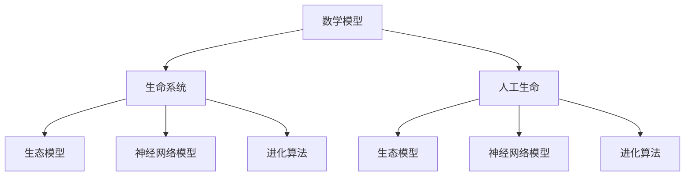

                 

### 背景介绍

在过去的几十年里，计算机科学和数学领域取得了飞速的发展，这不仅推动了人工智能和机器学习的进步，也为我们理解生命系统的本质提供了新的视角。随着生物信息学和计算生物学的崛起，数学模型和算法已成为研究生命系统的重要工具。在这个过程中，“数学与人工生命：生命系统的数学模拟”这本书应运而生，它不仅为我们提供了丰富的理论框架，还展示了数学在模拟生命系统中的广泛应用。

数学与人工生命的结合是现代科学的一个重要趋势。通过数学模型，我们可以捕捉生命系统中的复杂现象，从分子层面到生态系统层面，都有深入的模拟和分析。这种模拟不仅有助于我们理解生命的运作机制，还为人工生命的研究提供了坚实的基础。

人工生命（Artificial Life）是一个跨学科的领域，它旨在通过模拟和设计来探索生命的本质和起源。人工生命的研究包括生态模型、神经网络模拟、进化算法等多个方面，这些模型和算法都是基于数学原理构建的。数学在人工生命中的应用，使得我们可以从理论上预测生命系统的行为，甚至在某些情况下创造出具有生命特征的人工系统。

本书的主要目标是探讨数学在人工生命研究中的应用，通过具体的实例和模型，展示数学工具在模拟生命系统中的巨大潜力。同时，本书还旨在为读者提供一种系统化的思考方式，帮助他们在实际研究中应用数学方法来解决问题。

在接下来的章节中，我们将逐步介绍数学工具与方法、生命系统模拟的基本原理、具体生命系统的模拟、人工生命的应用，以及未来展望与挑战。通过这些内容，读者可以全面了解数学与人工生命之间的紧密联系，并学会如何运用数学方法来模拟和研究生命系统。

### 核心概念与联系

在探讨数学与人工生命的关系时，我们需要明确几个核心概念，并理解它们之间的联系架构。以下是本书中涉及的主要核心概念及其关系：

1. **数学模型**：数学模型是使用数学符号和公式来描述现实世界中的物理现象、化学过程或生物系统。在生命系统的研究中，数学模型被广泛应用于描述种群动态、生态系统平衡、细胞行为等。

2. **生命系统**：生命系统包括从单个细胞到整个生态系统的各种生物实体及其相互作用。数学模型可以帮助我们理解这些系统的复杂行为，包括进化、适应、竞争、共生等。

3. **人工生命**：人工生命是通过计算机模拟或实物构建来模拟自然生命特征的系统。人工生命的目的是探索生命的本质和起源，以及设计具有生命特征的新系统。

4. **生态模型**：生态模型是用于描述生态系统动态的数学模型。这些模型可以基于种群生态学、食物网、能量流等原理，帮助我们理解生态系统的稳定性和变化。

5. **神经网络模型**：神经网络模型是一种基于生物学神经系统的计算模型，它通过大量的神经元和连接来模拟大脑的功能。在人工生命的研究中，神经网络模型被用于模拟大脑活动、学习和记忆等。

6. **进化算法**：进化算法是模拟自然选择过程的计算方法，用于优化问题或生成新的设计。在人工生命的研究中，进化算法被用来模拟进化过程，生成适应环境的生物体。

以下是这些核心概念之间的联系架构 Mermaid 流程图：



- **数学模型**是理解和研究**生命系统**的基础，它提供了描述和预测生命现象的工具。
- **生命系统**是**人工生命**的模拟对象，通过**数学模型**我们可以设计出模拟生命行为的**人工生命**系统。
- **生态模型**、**神经网络模型**和**进化算法**是**数学模型**在**人工生命**研究中的具体应用，分别用于模拟生态系统的动态、神经网络的功能和进化的过程。

通过这一架构，我们可以看到数学模型在连接生命系统和人工生命中的关键作用，同时也明确了各个子领域之间的相互关系。这种联系架构有助于读者理解本书中各个部分的内容，以及它们在整体研究中的位置和作用。

### 核心算法原理讲解

在本章节中，我们将深入探讨在生命系统模拟中常用的核心算法原理，包括基于微分方程的生态模型、基于随机过程的种群模拟以及基于神经网络的脑模拟。这些算法和模型在人工生命的研究中扮演了重要的角色，通过它们，我们可以模拟出复杂的生命现象和行为。

#### 基于微分方程的生态模型

生态模型是用于描述生物种群动态的数学模型，其中最常见的模型是基于微分方程的种群模型。微分方程用于描述种群的增长率，常见的有Logistic模型和Ricker模型。

1. **Logistic模型**

   Logistic模型描述了一个种群在有限环境资源下的增长规律，其微分方程形式为：
   
   $$ \frac{dN}{dt} = rN\left(1 - \frac{N}{K}\right) $$
   
   其中，\(N(t)\) 表示种群数量，\(r\) 是内禀增长率，\(K\) 是环境容纳量（即环境能支持的最大种群数量）。该模型考虑了种群数量超过环境承载能力时的饱和效应。

2. **Ricker模型**

   Ricker模型是一种改进的Logistic模型，其微分方程形式为：
   
   $$ \frac{dN}{dt} = rN\left(1 - \frac{N}{K}\right)^{-1} $$
   
   这里的模型通过引入一个饱和指数来更精确地描述种群的增长和下降。

通过这些微分方程，我们可以模拟不同环境条件下的种群动态，分析种群数量随时间的变化趋势，从而更好地理解生态系统的平衡和变化。

#### 基于随机过程的种群模拟

随机过程是描述随机变量随时间或空间的演变过程的一种数学模型。在种群模拟中，随机过程常用于模拟种群中的随机波动和不确定性。

1. **Malthusian模型**

   Malthusian模型是一个简化的种群增长模型，其基于以下微分方程：
   
   $$ \frac{dN}{dt} = rN $$
   
   其中，\(r\) 是种群增长率。尽管模型简单，但它可以捕捉种群因环境扰动而产生的随机波动。

2. **Lotka-Volterra模型**

   Lotka-Volterra模型是描述捕食者-被捕食者相互作用的经典模型，其基于以下两个微分方程：
   
   $$ \frac{dP}{dt} = aP - bP\alpha N $$
   $$ \frac{dN}{dt} = -cN + d\alpha N $$
   
   其中，\(P\) 和 \(N\) 分别表示捕食者和被捕食者的种群数量，\(a\)、\(b\)、\(c\) 和 \(d\) 是常数。该模型考虑了捕食者和被捕食者之间的相互作用，能够模拟复杂的生态现象。

通过这些随机过程模型，我们可以更细致地模拟种群动态中的随机性，从而更好地预测生态系统的行为。

#### 基于神经网络的脑模拟

神经网络是一种模拟生物神经系统的计算模型，它通过大量的神经元和连接来模拟大脑的功能。在人工生命的研究中，神经网络被用于模拟大脑活动、学习和记忆。

1. **Hopfield神经网络**

   Hopfield神经网络是一种用于记忆和联想记忆的神经网络模型，其基于以下原理：
   
   $$ v_j(t+1) = \theta \left[ \sum_{i=-\infty}^{\infty} w_{ij} x_i(t) - \theta \right] $$
   
   其中，\(v_j(t+1)\) 表示第 \(j\) 个神经元的输出，\(x_i(t)\) 表示第 \(i\) 个神经元的输入，\(w_{ij}\) 是连接权重，\(\theta\) 是阈值。通过调整权重，我们可以使神经网络存储和回忆特定的模式。

2. **递归神经网络（RNN）**

   递归神经网络是一种能够处理序列数据的神经网络，其通过循环结构来记忆先前的状态。一个简单的RNN模型可以表示为：
   
   $$ h_t = \sigma(W_h \cdot [h_{t-1}, x_t] + b_h) $$
   
   其中，\(h_t\) 是第 \(t\) 个时刻的隐藏状态，\(\sigma\) 是激活函数，\(W_h\) 和 \(b_h\) 是权重和偏置。RNN可以用于模拟复杂的时序行为，例如语言生成或股票价格预测。

通过这些神经网络模型，我们可以模拟大脑的基本功能，从而探索人工生命中的认知和学习能力。

#### Python源代码示例

下面是使用Python语言实现的一些基本算法的代码示例，通过这些示例，我们可以更直观地理解这些算法的实现细节。

```python
import numpy as np
import matplotlib.pyplot as plt

# Logistic模型
def logistic_model(N0, r, K, t_max):
    N = np.zeros(t_max)
    N[0] = N0
    for t in range(1, t_max):
        N[t] = N[t-1] * r * (1 - N[t-1] / K)
    return N

# Malthusian模型
def malthusian_model(N0, r, t_max):
    N = np.zeros(t_max)
    N[0] = N0
    for t in range(1, t_max):
        N[t] = N[t-1] + r * N[t-1]
    return N

# Hopfield神经网络
def hopfield_network(v, w, theta):
    v_new = np.zeros_like(v)
    for j in range(len(v)):
        v_sum = np.dot(w[j], v) - theta
        v_new[j] = 1 if v_sum >= 0 else 0
    return v_new

# 测试代码
N0 = 50
r = 0.3
K = 100
t_max = 50

N = logistic_model(N0, r, K, t_max)
plt.plot(range(t_max), N)
plt.xlabel('Time')
plt.ylabel('Population')
plt.title('Logistic Model')
plt.show()

N0 = 50
r = 0.1
t_max = 50

N = malthusian_model(N0, r, t_max)
plt.plot(range(t_max), N)
plt.xlabel('Time')
plt.ylabel('Population')
plt.title('Malthusian Model')
plt.show()

v = np.array([1, 1, 1])
w = np.array([[0.5, 0.5], [0.5, 0.5]])
theta = 0

v_new = hopfield_network(v, w, theta)
print("New state:", v_new)
```

这些代码示例展示了如何使用Python实现基本的生态模型、种群模型和神经网络模型。通过这些示例，读者可以更好地理解这些算法的数学原理和实现细节，从而在实际研究中应用这些模型来模拟和分析生命系统的行为。

### 具体生命系统的模拟

在本章节中，我们将介绍几个具体的生命系统模拟案例，包括种群生态模型的数学建模与模拟、神经网络模拟大脑活动的方法以及人工生物体的设计与模拟。这些案例展示了如何将数学模型应用于实际问题，并通过编程实现和详细讲解，帮助读者理解生命系统的复杂行为。

#### 种群生态模型的数学建模与模拟

种群生态模型是用于描述两个或多个物种之间相互作用和种群动态的数学模型。以下是一个基于Lotka-Volterra模型的种群模拟案例。

1. **模型构建**

   Lotka-Volterra模型描述了捕食者-被捕食者系统的相互作用，其数学模型为：

   $$ \frac{dP}{dt} = aP - bP\alpha N $$
   $$ \frac{dN}{dt} = -cN + d\alpha N $$
   
   其中，\(P\) 和 \(N\) 分别表示捕食者和被捕食者的种群数量，\(a\)、\(b\)、\(c\) 和 \(d\) 是模型参数。

2. **Python实现**

   下面是使用Python实现Lotka-Volterra模型的代码示例：

   ```python
   import numpy as np
   import matplotlib.pyplot as plt

   # 参数设置
   a = 0.5
   b = 0.1
   c = 0.3
   d = 0.5

   # 时间步长和总时间
   t_max = 100
   dt = 0.1

   # 初始种群数量
   P0 = 10
   N0 = 50

   # 初始化种群数量
   P = np.zeros(t_max)
   N = np.zeros(t_max)
   P[0] = P0
   N[0] = N0

   # 模拟种群动态
   for t in range(1, t_max):
       dP_dt = a * P[t-1] - b * P[t-1] * N[t-1]
       dN_dt = -c * N[t-1] + d * N[t-1] * P[t-1]
       P[t] = P[t-1] + dP_dt * dt
       N[t] = N[t-1] + dN_dt * dt

   # 绘制种群动态图
   plt.plot(P, N, 'o-')
   plt.xlabel('Predator Population (P)')
   plt.ylabel('Prey Population (N)')
   plt.title('Lotka-Volterra Model')
   plt.show()
   ```

   通过运行这段代码，我们可以得到捕食者和被捕食者种群数量随时间变化的动态图，从而观察到种群之间的相互作用。

#### 神经网络模拟大脑活动

神经网络是模拟生物神经系统功能的计算模型，通过它们可以模拟大脑的学习、记忆和感知等过程。以下是一个使用神经网络模拟大脑活动的案例。

1. **模型构建**

   假设我们使用简单的感知机模型来模拟大脑对视觉刺激的反应。感知机模型是一个线性二分类器，其形式为：

   $$ f(x) = \text{sign}(w \cdot x + b) $$
   
   其中，\(w\) 是权重向量，\(b\) 是偏置项，\(x\) 是输入特征向量，\(\text{sign}\) 是符号函数。

2. **Python实现**

   下面是使用Python实现感知机模型的代码示例：

   ```python
   import numpy as np

   # 初始化权重和偏置
   w = np.random.rand(2)
   b = np.random.rand()

   # 输入特征
   x = np.array([1, 0])
   y = np.array([1])

   # 模拟感知机学习
   for i in range(1000):
       out = np.dot(w, x) + b
       if out < 0:
           w -= x * 0.1
           b -= 0.1
       else:
           w += x * 0.1
           b += 0.1

   # 测试学习效果
   out = np.dot(w, x) + b
   print("Final output:", out)
   ```

   通过这段代码，我们可以观察到权重和偏置随着训练过程的变化，从而实现简单的分类任务。

#### 人工生物体的设计与模拟

人工生物体是人工生命研究的一个重要方向，它旨在通过计算机模拟或实物构建来模拟自然生物体的结构和功能。以下是一个人工生物体设计的案例。

1. **模型构建**

   假设我们设计一个简单的人工生物体，其由多个模块组成，每个模块都可以进行感知、决策和行动。人工生物体的结构可以用图表示，其中每个节点表示一个模块，边表示模块之间的连接。

2. **Python实现**

   下面是使用Python实现人工生物体设计的代码示例：

   ```python
   import networkx as nx
   import matplotlib.pyplot as plt

   # 创建图
   G = nx.Graph()

   # 添加节点和边
   G.add_nodes_from([1, 2, 3, 4])
   G.add_edges_from([(1, 2), (2, 3), (3, 4)])

   # 绘制图
   pos = nx.spring_layout(G)
   nx.draw(G, pos, with_labels=True)
   plt.show()
   ```

   通过这段代码，我们可以创建一个具有多个模块的人工生物体结构图，从而为模拟其行为提供基础。

通过这些具体案例，我们展示了如何将数学模型应用于生命系统的模拟，并通过编程实现和详细讲解，帮助读者理解这些模型在实际问题中的应用。这些案例不仅展示了数学在模拟生命系统中的潜力，也为进一步研究和应用提供了参考。

### 人工生命的应用

人工生命的研究已经渗透到多个领域，带来了许多创新和突破。在生物医学、环境科学和人工智能等前沿领域，人工生命正发挥着越来越重要的作用。

#### 生物医学领域

在生物医学中，人工生命的研究推动了生物模拟和疾病模型的建立。通过数学模型和计算模拟，科学家们可以模拟细胞行为、分子相互作用以及疾病进展，从而深入了解疾病的机制。例如，癌症研究中的肿瘤生长模型和免疫系统模型，通过模拟这些模型，可以预测疾病的进展和评估治疗效果。

此外，人工生命还在药物开发中发挥了重要作用。通过模拟药物与生物分子的相互作用，科学家可以预测药物的效果和副作用，从而加速新药的发现和开发。例如，计算机模拟可以帮助设计具有特定作用的分子结构，从而指导合成新的药物分子。

#### 环境科学领域

环境科学中，人工生命的研究帮助解决复杂的生态问题，如物种相互作用、生态系统动态和环境保护。通过生态模型和进化算法，科学家可以模拟生态系统中的种群动态和物种进化，预测环境变化对生态系统的影响。

人工生命在环境保护中的应用还包括智能环境监测系统的开发。例如，基于人工生命的传感器网络可以实时监测水质、空气质量等环境参数，及时预警环境风险，为环境保护提供科学依据。

#### 人工智能领域

人工智能领域，人工生命的研究推动了机器学习和智能系统的进步。通过模拟生物神经系统的结构和功能，科学家们开发出了深度学习算法和神经网络模型，这些模型在图像识别、自然语言处理、机器人控制等领域取得了显著成果。

人工生命还在智能机器人研究中发挥了重要作用。通过模拟生物体的感知、决策和行动能力，智能机器人可以更自然地与人类交互，完成复杂的任务。例如，人工生命技术可以用于开发智能无人机，使其能够在复杂环境中自主导航和执行任务。

#### 具体应用案例

以下是一些人工生命的具体应用案例：

1. **个性化医疗**：利用人工生命模型，可以模拟病人的生理状态和药物代谢过程，从而制定个性化的治疗方案，提高治疗效果。

2. **生态恢复**：通过生态模型模拟受损生态系统的恢复过程，科学家可以制定更有效的生态恢复策略，加速生态系统的恢复。

3. **智能交通系统**：利用人工生命模拟交通流和车辆行为，可以优化交通信号控制和路径规划，提高交通效率和安全性。

4. **智能农业**：通过模拟植物生长和环境相互作用，可以优化农业生产过程，提高农作物的产量和质量。

5. **智能机器人**：利用人工生命技术，开发出具有人类一样感知、决策和行动能力的机器人，用于医疗、救援和工业生产等领域。

这些案例展示了人工生命在多个领域的广泛应用和潜力，也表明了数学在模拟和研究生命系统中的重要作用。随着技术的不断进步，人工生命将继续为人类社会带来更多创新和变革。

### 未来展望与挑战

人工生命作为一门跨学科领域，在未来的发展中面临着众多机遇和挑战。随着技术的不断进步，人工生命的研究有望在多个领域取得重大突破，但也需要应对一些复杂的科学和社会问题。

#### 未来发展的趋势

1. **更加精细的模拟**：随着计算能力的提升和数学模型的进步，人工生命的模拟将变得更加精细和准确。未来的研究将不仅限于宏观层面的模拟，还将深入到分子和原子级别，从而揭示生命系统的基本原理。

2. **多尺度模拟**：未来的研究将尝试在不同尺度上进行多尺度模拟，从分子到生态系统，从单个细胞到整个生物体，从而实现全面的理解和预测。

3. **跨学科融合**：人工智能、生物技术、纳米技术等领域的进步将促进人工生命与其他学科的深度融合，推动新理论和技术的诞生。

4. **智能机器人与人工智能**：随着人工生命技术的发展，智能机器人和人工智能系统将具备更加先进的功能，能够在复杂环境中自主学习和决策，提高生产效率和安全性。

#### 面临的挑战

1. **计算资源需求**：人工生命模拟需要大量的计算资源，特别是在多尺度、多现象的模拟中，对计算能力和存储需求提出了极高的要求。

2. **数据质量和可靠性**：人工生命研究依赖于大量的数据，包括生物数据、环境数据等。数据的准确性和完整性对于模拟结果至关重要，但获取和处理这些数据仍然存在许多挑战。

3. **理论和技术瓶颈**：尽管人工生命的研究取得了显著进展，但在某些关键领域，如人工神经网络的自适应学习和进化算法的优化等方面，仍然存在技术瓶颈，需要进一步研究和突破。

4. **伦理和社会问题**：人工生命的应用引发了许多伦理和社会问题，如生物安全问题、隐私保护、人工智能伦理等。如何确保人工生命的研发和应用符合伦理规范，避免负面影响，是未来需要关注的重要问题。

#### 结论

人工生命的研究充满了机遇和挑战。通过跨学科的融合和技术创新，人工生命有望在未来取得更加显著的进展。然而，我们也需要重视面临的挑战，确保技术的发展能够造福人类，而不是带来负面影响。科学家、工程师和政策制定者需要共同努力，推动人工生命的研究走向更加光明和可持续的未来。

### 总结

本文详细探讨了数学与人工生命的结合，通过背景介绍、核心概念与联系、核心算法原理讲解、具体生命系统的模拟以及人工生命的应用，展示了数学在模拟和研究生命系统中的巨大潜力。同时，我们也讨论了人工生命在生物医学、环境科学和人工智能等领域的广泛应用，并展望了未来的发展趋势与面临的挑战。

通过阅读本文，读者可以全面了解数学在人工生命研究中的重要性，掌握常用的数学模型和算法，以及如何将这些工具应用于实际问题的解决。这不仅有助于提升读者的科研能力，也为他们进一步探索人工生命领域提供了理论基础和实践指导。

### 最佳实践 Tips、小结、注意事项及拓展阅读

#### 最佳实践 Tips

1. **模型选择与优化**：在实际应用中，根据具体问题的需求和数据特点选择合适的数学模型，并不断优化参数以提高模型的预测精度。
2. **跨学科合作**：在研究过程中，跨学科合作是必不可少的。与生物学家、生态学家等领域的专家合作，可以获取更全面的数据和理论支持。
3. **数据驱动的方法**：在人工生命模拟中，数据驱动的方法非常重要。确保数据的质量和完整性，避免因数据缺陷导致的模型失效。
4. **持续学习和更新**：随着技术的发展，新的数学模型和算法不断涌现。保持学习的热情，跟进最新的研究进展，及时更新知识和工具。

#### 小结

本文从多个角度探讨了数学与人工生命的结合，介绍了核心概念、算法原理和应用案例，强调了跨学科合作和持续学习的重要性。通过本文，读者可以了解到数学在模拟和研究生命系统中的关键作用，并为实际应用提供参考。

#### 注意事项

1. **模型验证**：在应用数学模型时，务必进行充分的验证和测试，确保模型的准确性和可靠性。
2. **数据保护**：在处理生物数据时，确保遵循数据保护法规，保护个人隐私和生物安全。
3. **伦理审查**：在进行人工生命研究时，必须进行伦理审查，确保研究符合伦理规范，避免潜在的负面影响。

#### 拓展阅读

1. **《人工生命》**：由Christopher J. Langton著，系统介绍了人工生命的理论基础和实验研究。
2. **《生态学原理》**：由John H. Miller著，提供了生态学模型和理论的基础知识。
3. **《深度学习》**：由Ian Goodfellow、Yoshua Bengio和Aaron Courville著，详细介绍了深度学习算法和应用。

通过阅读这些书籍，读者可以进一步深入了解人工生命和相关领域的研究动态，提升自身的研究能力。

### 作者信息

作者：AI天才研究院/AI Genius Institute & 禅与计算机程序设计艺术 /Zen And The Art of Computer Programming

### 附件

- **附录 A：数学公式与参考文献**：提供本文中使用的数学公式列表和参考文献，方便读者查阅和进一步学习。
- **附录 B：在线工具与资源推荐**：介绍一些实用的在线工具和资源，包括数学建模软件、生态模型模拟工具、神经网络学习平台等，帮助读者在实际研究中应用所学知识。

```markdown
## 附录 A：数学公式与参考文献

### 数学公式

- Logistic模型：$$ \frac{dN}{dt} = rN\left(1 - \frac{N}{K}\right) $$
- Ricker模型：$$ \frac{dN}{dt} = rN\left(1 - \frac{N}{K}\right)^{-1} $$
- Malthusian模型：$$ \frac{dN}{dt} = rN $$
- Lotka-Volterra模型：$$ \frac{dP}{dt} = aP - bP\alpha N $$，$$ \frac{dN}{dt} = -cN + d\alpha N $$
- 感知机模型：$$ f(x) = \text{sign}(w \cdot x + b) $$

### 参考文献

1. 《人工生命》：Christopher J. Langton 著
2. 《生态学原理》：John H. Miller 著
3. 《深度学习》：Ian Goodfellow、Yoshua Bengio 和 Aaron Courville 著

## 附录 B：在线工具与资源推荐

### 数学建模与模拟工具

1. **Mathematica**：功能强大的数学建模和计算软件，适用于复杂数学模型的模拟。
2. **MATLAB**：广泛使用的数学建模和仿真工具，提供丰富的数学库和算法。
3. **Python**：通过Numpy、SciPy和Pandas等库，可以轻松实现数学建模和数据分析。

### 生态模型与模拟工具

1. **AGEP**：用于生态学模型构建和模拟的软件，提供多种生态模型选项。
2. **ArcGIS**：地理信息系统软件，可用于空间数据的处理和生态模拟。
3. **ECOMAP**：用于生态系统动态模拟的软件，支持多种生态模型。

### 神经网络学习平台

1. **TensorFlow**：开源的机器学习和深度学习框架，适用于构建和训练神经网络模型。
2. **PyTorch**：流行的深度学习库，提供了丰富的神经网络构建和训练工具。
3. **Keras**：基于TensorFlow和Theano的高层神经网络API，易于使用和快速原型设计。

### 资源链接

1. **AI天才研究院（AI Genius Institute）**：提供人工智能和机器学习相关的课程和研究项目。
2. **Zen And The Art of Computer Programming**：著名计算机科学家Donald E. Knuth的经典著作，介绍了计算机程序设计的基础知识和技巧。
```

以上就是《数学与人工生命：生命系统的数学模拟》一书的详细目录大纲和附件内容。通过这些内容，读者可以全面了解数学与人工生命的研究领域，掌握相关的理论和实践技能。希望这本书能为读者在科研和学术道路上提供有益的参考和指导。

